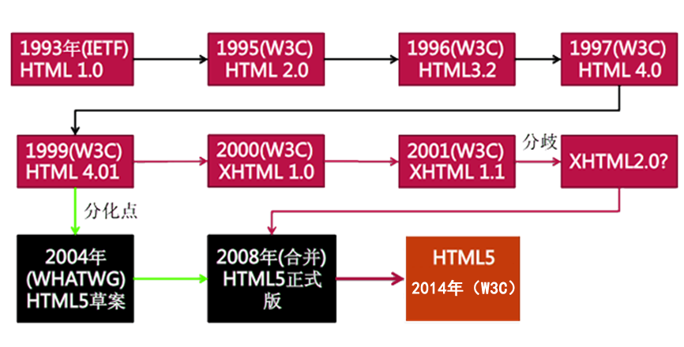

# 学习 HTML 和 CSS

## 什么是 HTML 和 CSS

    它们是两种 “编程语言” 但是其实一种标记语言，一般情况下需要配合使用，是做作为开发网站的基础语言
    
    网站 是什么？ ——> 平时浏览的官网 eg： 百度， 华为， 小米，...
    
    代码 <——> 网站  之间的关系！！！
    代码放置在浏览器上，浏览器会对代码进行解析，就会呈现出我们看到的网站，
    
    那么在网站中能不能看到原始代码呢？
    可以， 点击鼠标右键 --> 选择查看源代码  淘宝网
    
    代码写在哪里？
    
    一个网站是有N多个网页构成的，页面就是 .html 文件
    电视剧 -> 集数 在线看，离线看 .mp4
    
    如何创建 .html 文件？
        如何查看后缀名：win7/win10
            win10：双击打开 “此电脑”，左上方区域 单击“查看” ，“文件拓展名”勾选
            win7：双击“计算机”，左上方区域单机“组织”，弹出窗口，单击“查看”，隐藏已知文件类型的扩展名并将其前面的勾去掉
        网页的后缀名：.html/.htm
    
    新建文件  ——>  修改后缀名 为 .html
    注意一个点： 创建文件/文件夹时，它的命名
        --> 命名规则
          1、尽量不要使用中文
          2、不要数字开头
          3、能够使用：字母，数字，下划线配合使用，建议以小写的字母开头
          4、不要包含特殊字符!@#$%^&等等
          5、建议命名的时候见名知意
          6、网站的首页必须要命名为 index.html

## 深入了解网站开发

    产品经理
        ==> 产品 从零到一 的主导者,确定需求，提供原型图
    
    UI设计师
        ==> 提供设计稿
    
    web前端开发工程师（H5）
        ==> 对照设计稿把页面写出来
        ==> 把数据库中的数据放置到页面中
    
         html + css + javascript
    
    web后端开发工程师
     ==> 数据处理，产出接口文档
    
    测试
     ==> 性能测试、安全性测试等
    
    Q: 了解 HTML - Css - JavaScript 之间的关系

## Web 前端的三大核心技术

    HTML            --> 结构
    CSS             --> 表现
    JavaScript      --> 行为
    
    什么是HTML？
    HTML: 超文本 标记 语言（HyperText Markup Language），标准通用标记语言下的一个应用。
     是网页制作必备的编程语言
    
        超文本：文本内容 和 非文本内容（图片、 音频、 视频）
        标记：<单词>
        语言：编程语言
    HTML 指的是超文本标记语言 (Hyper Text Markup Language) www万维网的描述性语言
    
    XHTML指的是可扩展超文本标记语言（EXtensible HyperText Markup Language）表现方式与超文本 HTML 类似，不过语法上更加严格
    
    HTML5: 指的是HTML的第五次重大修改（第5个版本）(HTML5 是 W3C 与 WHATWG 合作的结果)，
    H5网络标准统一，可以跨平台，多设备使用，语义化比较强

    什么是CSS？
    CSS: 层叠 样式 表 (Cascading Style Sheets),也称级联样式表
    
    什么是JavaScript？
    是一种解释性脚本语言，主要用来向 HTML 页面添加交互行为

    	W3C( World Wide Web Consortium )万维网联盟，创建于1994年是Web技术领域最具权威和影响力的国际中立性技术标准机构
    	W3C (制定了结构(xhtml、xml)和表现(css)的 标准，非盈利性的
    
    	ECMA(European Computer Manufactures Association) 欧洲电脑场商联合会
    	ECMA制定了行为(DOM(文档对象模型)，ECMAScript)标准
    
    	WHATWG网页超文本应用技术工作小组是： 一个以推动网络HTML 5 标准为目的而成立的组织
    	在2004年，由Opera、Mozilla基金会和苹果这些浏览器厂商组成

    	Q：了解制定三大核心技术的组织
            W3C ECMA
            W3C制定了结构HTML的语法、标准
            W3C制定了表现Css的语法、标准
            ECMA制定了行为标准（DOM ECMAScript）
