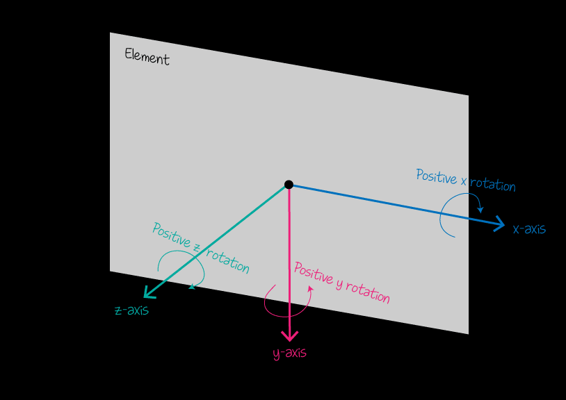

# CSS3 中的转换与动画

## CSS3 中的转换

    CSS3 转换可以对元素进行移动、缩放、转动、拉长或拉伸
    transform			适用于2D或3D转换的元素
    deg 				角度
    
    需要注意的是： 当一个元素同时设置多个转换效果时，需要注意“轴”的变化

### 2D 转换

    translate(x,y)			定义 2D 移动，沿着 X 和 Y 轴移动元素
    translateX(n)			定义 2D 移动，沿着 X 轴移动元素
    translateY(n)			定义 2D 移动，沿着 Y 轴移动元素
    
    rotate(angle)			定义 2D 旋转，在参数中规定角度，在一个平面内进行旋转
    
    scale(x,y)				定义 2D 缩放，改变元素的宽度和高度
    scaleX(n)				定义 2D 缩放，改变元素的宽度
    scaleY(n)				定义 2D 缩放，改变元素的高度
    
    skew(x-angle,y-angle)	定义 2D 倾斜，沿着 X 和 Y 轴
    skewX(angle)			定义 2D 倾斜，沿着 X 轴
    skewY(angle)			定义 2D 倾斜，沿着 Y 轴
    
    transform-origin		定义 转换中心
    	在没有设置过transform-origin属性时，CSS变形进行的旋转、移位、缩放等操作都是以元素自己中心（变形原点/中心点）位置进行变形的。而 CSS3 中的transform-origin属性用于设置旋转元素的基点位置
    	属性值可以是百分比、em、px等具体的值，也可以是top、right、bottom、left和center这样的关键词
    	
    2D转换多个值都是作用时，需要注意的时，转换中心和转换轴的变化！！！
    	        transform: rotate(45deg);
                transform: translateX(200px) rotate(45deg);
                transform: rotate(45deg) translateX(200px);
                当同时有位移和其他属性的时候，记得要将位移放到最前

### 3D 转换

    translate3d(x,y,z)		定义 3D 移动
    translateX(x)			定义 3D 移动，仅使用用于 X 轴的值
    translateY(y)			定义 3D 移动，仅使用用于 Y 轴的值
    translateZ(z)			定义 3D 移动，仅使用用于 Z 轴的值
    
    rotate3d(x,y,z,angle)	定义 3D 旋转	注意矢量坐标系！！！
    rotateX(angle)			定义沿 X 轴的 3D 旋转 	等同于rotate3d(1,0,0,par)
    rotateY(angle)			定义沿 Y 轴的 3D 旋转	等同于rotate3d(0,1,0,par)
    rotateZ(angle)			定义沿 Z 轴的 3D 旋转	等同于rotate3d(0,0,1,par)
    
    scale3d(x,y,z)			定义 3D 缩放
    scaleX(x)				定义 3D 缩放，通过给定一个 X 轴的值
    scaleY(y)				定义 3D 缩放，通过给定一个 Y 轴的值
    scaleZ(z)				定义 3D 缩放，通过给定一个 Z 轴的值

### 3D 效果需要设置的属性

    给父级元素添加
    	perspective			定义 3D 转换元素的透视视图
    		一般使用 看起来最适应 800px 或者 1200px  加在 body
    
        transform-style		属性指定嵌套元素是怎样在三维空间中呈现
            flat		表示所有子元素在2D平面呈现
            preserve-3d	表示所有子元素在3D空间中呈现
            注意：transform-style属性需要设置在父元素中，并且高于任何嵌套的变形元素
    
        perspective-origin		定义 3D 元素所基于的 X 轴和 Y 轴
            x-axis		定义该视图在 x 轴上的位置。默认值：50%
            y-axis		定义该视图在 y 轴上的位置。默认值：50%
    
    给子级元素添加
        backface-visibility		定义当元素背面向屏幕时是否可见
            visible		背面是可见的
            hidden		背面是不可见的

### 3D 立方体效果

### 翻牌子效果

## CSS3 中的动画

    CSS3 动画是使元素从一种样式逐渐变化为另一种样式的效果
    
    要创建 CSS3 动画，需要了解 @keyframes 规则
    	@keyframes 规则是创建动画
    	@keyframes 规则内指定一个 CSS 样式和动画将逐步从目前的样式更改为新的样式
    
    当在 @keyframes 创建动画，把它绑定到一个选择器，否则动画不会有任何效果
    指定至少这两个CSS3的动画属性绑定向一个选择器
    		规定动画的名称
    		规定动画的时长
    
    第一步：定义一个动画
    @keyframes 动画名称 {
    
    			/*定义关键帧 必须有头有尾*/
    			from 或者 0%{
    				css-styles:
    			}
    
    			50%{
    				css-styles:
    			}
    
    			to 或者 100%{
    				css-styles:
    			}
    		}
    
    第二步：执行这个动画
    	animation: 动画名称  执行时间  速度效果  延迟时间  执行次数  往复执行;
    		animation-name				动画名称
    		animation-duration			执行时间
    		animation-timing-function	速度效果
    		animation-delay				延迟时间
    		animation-iteration-count	执行次数
    			infinite	播放无限次（永远）
    		animation-direction			往复执行
    			reverse				动画反向播放
    			alternate			动画在奇数次（1、3、5...）正向播放，在偶数次（2、4、6...）反向播放
    			alternate-reverse	动画在奇数次（1、3、5...）反向播放，在偶数次（2、4、6...）正向播放
    			
    第三步：暂停或启动这个动画
    	animation-play-state:paused[暂停] | running[启动];

## 过渡和动画的区别

- 相同点：
  都是随着时间改变元素的属性值
- 不同点：
  transition 需要触发一个事件(hover 事件或 click 事件等)才会随时间改变其 css 属性；

  而 animation 在不需要触发任何事件的情况下也可以显式的随着时间变化来改变元素 css 的属性值，从而达到一种动画的效果，css3 的 animation 就需要明确的动画属性值
