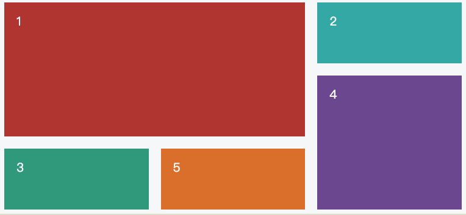
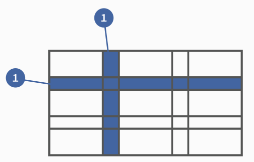

# 网格布局

## 什么是网格布局？

	Grid 布局是CSS中最强大的布局系统。
	与 flexbox 的一维布局系统不同，Grid 布局是一个二维布局系统，也就意味着它可以同时处理列和行。
	通过将 CSS 规则应用于父元素 (网格容器)和其子元素（ 网格项），你就可以轻松使用 Grid(网格) 布局。

	它的目标是完全改变我们基于网格的用户界面的布局方式。CSS 一直用来布局我们的网页，但一直以来都存在这样或那样的问题。一开始我们用表格（table），然后是浮动（float），再是定位（postion）和内嵌块（inline-block），但是所有这些方法遗漏了很多重要的功能（例如垂直居中）。
	Flexbox 的出现很大程度上改善了我们的布局方式，但它的目的是为了解决更简单的一维布局，而不是复杂的二维布局（实际上 Flexbox 和 Grid 能协同工作，而且配合得非常好）。

## 基本概念

	必须使用 display: grid 指定一个容器为网格布局，
	必须使用 grid-template-columns 和 grid-template-rows 设置 列 和 行 的尺寸大小

### 行 和 列

	容器里面的水平区域称为"行"（row），垂直区域称为"列"（column）
	水平的深色区域就是"行"，垂直的深色区域就是"列"

	
### 单元格

	行和列的交叉区域，称为"单元格"（cell）
	正常情况下，n行和m列会产生n x m个单元格。比如，5行5列会产生25个单元格

### 网格线

	划分网格的线，称为"网格线"（grid line）。水平网格线划分出行，垂直网格线划分出列
	正常情况下，n行有n + 1根水平网格线，m列有m + 1根垂直网格线

## 基本配置项

### 给父元素添加

	1.display:grid/inline-grid
	注意，设为网格布局以后，容器子元素（项目）的float、display: inline-block、display: table-cell、vertical-align和column-*等设置都将失效
	
	2.grid-template-columns / grid-template-rows
	定义每一列（columns）、每一行（rows）的大小
	    eg: {
	        display: grid;
	        grid-template-columns: 100px 200px 300px;
	        grid-template-rows: 300px 200px 100px;
	    }
	显示效果为 三列三行的网格布局，
		列宽分别为 100px 200px 300px;
		行高分别为 300px 200px 100px;
	    eg: {
	        display: grid;
	        grid-template-columns: repeat(3, 33.33%);;
	        grid-template-rows: repeat(3, 33.33%);
	    }
		repeat()
	    有时候，重复写同样的值非常麻烦，尤其网格很多时
	    这时，可以使用repeat()函数，简化重复的值
	    repeat()接受两个参数，第一个参数是重复的次数（上例是3），第二个参数是所要重复的值
	    repeat()重复某种模式也是可以的（）
	        fr关键字
	    为了方便表示比例关系，网格布局提供了fr关键字（fraction 的缩写，意为"片段"）。
	    如果两列的宽度分别为1fr和2fr，就表示后者是前者的两倍
	    fr可以与绝对长度的单位结合使用
	    eg: {
	        display: grid;
	        grid-template-columns: 150px 1fr 2fr;
	    }
	
	3.grid-column-gap / grid-row-gap / grid-gap: 行间距 列间距 设置间距大小
		根据最新标准，上面三个属性名的grid-前缀已经删除，
		grid-column-gap和grid-row-gap写成column-gap和row-gap，grid-gap写成gap
	
	4.grid-auto-flow : row column 排列方式
		划分网格以后，容器的子元素会按照顺序，自动放置在每一个网格
		默认的放置顺序是"先行后列"，即先填满第一行，再开始放入第二行
		也可以将它设成column，变成"先列后行"，还有 row dense 和 column dense
	
	5.justify-content和align-content  place-content：align-content和justify-content属性的缩写
		- justify-content
		  整个内容区域在容器里面的水平位置（左中右）
		- align-content
		  整个内容区域的垂直位置（上中下）

### 给子元素添加

	1.grid-area: grid-row-start / grid-column-start / grid-row-end / grid-column-end 
		grid-area: 行开始 列开始 行结束 列结束
		
		grid-area: 2 / 1 / span 2 / span 3; 从第2行第1列开始，并跨越2行3列
			 2               垂直方向上坐标
	         1               水平方向上坐标
	
			sapn 2           垂直方向上的合并之后的大小
			sapn 3           水平方向上的合并之后的大小
		