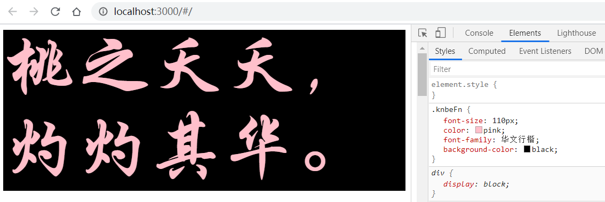

## 一、hooks

### 1.useState

作用：保存组件的状态（用于解决函数组件无状态问题）

语法：

```js
import React, { useState } from 'react';
const [state, setstate] = useState(initialState);
```

案例：

~~~
/**
 * hook：useState
 * 作用：实现函数组件中的所谓的“状态”
 * 提供方：react
 * 语法：const [访问变量名,设置数据方法名] = useState(初始默认值)
 * 参数含义：
 *      访问变量名：可以通过该变量名获取state的值
 *      设置数据方法名：只能通过调用该方法修改state的值，其只接受一个参数，参数要么是直接表示其值，要么以函数返回形式表示其值(必须有返回值)。如果前面的变量名叫a，那么此处的函数名一般叫做setA
 *      初始默认值：给state的初始值，支持字面量，也支持数组和对象等复杂数据类型
 * 注意点：
 *      a. 在修改字面量时，直接将最终的字面量的值给到修改函数即可
 *      b. 在修改对象或数组的时候，如果只是修改其中的一部分数据，记得最后返回的数据需要携带没有被修改的数据，如果不携带则丢失
 */

import React, { useState } from 'react';

const Index = () => {

    // 基础的字面量
    const [count, setCount] = useState(0)
    // 对象类型
    const [user, setUser] = useState({ uname: "张三", age: 22 })

    // 修改用户的信息的事件处理程序
    const modUser = () => {
         //1.直接赋值 setUser({ ...user, age: 33 })
         //2. 函数返回的形式 
         setUser((m) => {
             // m为当前要修改的数据 user { uname: "张三", age: 22 }
            return {
                ...user, 
                age: user.age + 5
            }
        })
    }
    
    // 修改数组信息 注意: 再修改对象或数组时,如果只是修改其中一部分数据,记得要将剩余数据返回,否则元数据丢失
    const [usernameArr, setUsernameArr] = useState(['刘','关','张']);
    const editArr=()=>{
        usernameArr.push('赵云')
        console.log(usernameArr);
        // setUsernameArr(usernameArr)// 该种方式修改不了,useState会认为是同一个数组,不能修改
        // 第一种方式:
        setUsernameArr([...usernameArr])
        // 第二种方式
        // setUsernameArr(()=>{
        //     return  [...usernameArr,'赵云']  
        // })
    }
    return (
        <div>
            <div>计数器的值是：{count}</div>
            {/*点击事件直接写函数表达式 一步到位*/}
            <div><button onClick={() => setCount(count + 1)}>+1</button></div>
            <hr />
            <div>
                <div>用户信息是：</div>
                <div>
                    用户名是：{user.uname}
                </div>
                <div>
                    年龄是：{user.age}
                </div>
                <button onClick={() => modUser()}>修改用户年龄</button>
            </div>
            <hr/>
            <p>{usernameArr.map((item,index)=>{
                return <span key={index}>{item}</span>
            })}</p>
            <p><button onClick={editArr}>修改数组</button></p>
        </div>
    );
}

export default Index;
~~~

### 2.useEffect

作用：模拟类组件中的生命周期的

函数组件对于在一些生命周期中操作还是无能为力，所以 React提供了 useEffect 来帮助开发者处理函数组件，来帮助模拟完成一部分开发中**非常常用的生命周期方法（并不是全部的生命周期）**。常被称为：**副作用处理函数**。此函数的操作是异步的。

useEffect 相当类组件中的3个生命周期 （但含义上不完全等同）

- componentDidMount
- componentDidUpdate
- componetWillUnMount

语法：

```js
 useEffect(() => {
     effect... 副作用的操作,（类似于组件挂载完毕后、更新完毕后的操作）
     return () => {
         cleanup... 清理副作用
         （类似于组件的解除挂载的周期，可选）
     }
 },[INPUT,....])
```

案例：

~~~
/**
 * hook：useEffect
 * 作用：用于操作作用及副作用代码的（用于控制函数组件生命周期的）
 * 语法：
 *      useEffect(callback[,array]) 数组array可选
 * 提供方：react
 * 细致语法：
 *      a. 在首次渲染及后续每次更新之后会执行callback的代码（模拟首次componentDidMount及componentDidUpdate）
 *          useEffect(没有返回值的callback)
 *      b. 被返回的函数是用于清理副作用的，会在执行下一次副作用前执行
 *          useEffect(带有返回值的cakkbacl)     //返回值必须是一个函数
 *      c. 有第二个参数，并且第二参数为空数组（仅仅会让副作用代码在首次挂载完毕后执行一次）
 *          useEffect(callback,[])
 *      d. 有第二个参数，且第二个参数中有具体的元素，元素个数不限，元素为useState的访问变量名。关注指定元素的更新，当被指定的元素更新后，将会再去执行副作用代码，及清理副作用的代码（如有）。
 *          useEffect(callback,[el1,el2,....])
 * 
 * 清理副作用很有意义：
 * 假设给页面绑定了点击事件，如果不清理事件，可能会导致事件越绑越多
 */
import React, { useEffect, useState } from 'react';

const Index = () => {
    const [count, setCount] = useState(0);
    const [position, setPosition] = useState({ x: 0, y: 0 })

    // 情形1: 没有返回值的callback
    // useEffect(() => {
    //     console.log(1)  //副作用代码 1.页面初始化执行,2.数据更新后执行 
    // })
    // 情形2: 带有返回值得callback函数
    // useEffect(() => {
    //     console.log(1)  //副作用代码  1.页面初始化执行;2.数据更新后执行
    //     return () => {
    //         console.log(2)  //清除副作用代码 1.下一次数据更新前执行
    //     }
    // })
    // 情形3: 第2个参数为空数组
    // useEffect(() => {
    //     console.log(1)  //副作用代码  1.页面初始化执行
    //     return () => {
    //         console.log(2)  //清除副作用代码 1.该函数不执行,return 没有意义了,相当于不写return
    //     }
    // }, [])
    // 情形4:第二个参数有数据
    // useEffect(() => {
    //     console.log(1)  //副作用代码  1.页面初始化执行,2.数据更新后执行
    //     return () => {
    //         console.log(2)  //清除副作用代码 1.下一次数据更新前执行
    //     }
    // }, [count]) // 此处第二个参数为被监听数据,可以写多个数据

    // 使用demo案例:
    const handler = (e) => {
        console.log('页面点击了');
        setPosition({ x: e.pageX, y: e.pageY })
    }
    useEffect(() => {
        // 给页面绑定点击事件
        document.addEventListener('click', handler)
        return () => {
            document.removeEventListener('click', handler) //清除副作用代码 1.下一次事件绑定前																清除,否则事件绑定对此叠加
        }
    })
    return (
        <div>
            <p>count:{count}</p>
            <p><button onClick={() => setCount(count + 1)}>+1</button></p>
            <hr></hr>
            <p>页面点击位置的坐标:x:{position.x},y:{position.y}</p>
        </div>
    );
}

export default Index;
~~~

### 3.useRef 

作用：用来生成对 DOM 对象的引用（类似于类组件中的createRef方法）

获取元素节点或者 子组件上的数据和方法

效果: 与类组件createRef相比实现相同的功能,函数组件使用useRef 相对复杂麻烦.

案例：

- 父组件Index.jsx

~~~
/**
 * useRef的注意点：
 * 1. 使用肯定得导入useRef
 * 2. 通过执行该useRef函数获取ref对象
 * 3. 将ref对象挂载到需要获取对象的标签上面，例如：ref={ref}
 * 4. 后续我们可以通过ref对象获取对应的标签的对象
 * 5. 特别需要注意：默认情况下，普通的html标签是可以直接使用ref对象的（获取到的是dom对象），而函数组件标签默认不能使用ref对象！
 * 6. 如果需要解决函数组件标签使用ref就报错的问题，需要借助React.forwardRef()【让子具备转发ref的能力，子去给父ref】，该方法不是hook函数，而是hoc强化函数；还需要借助一个hook函数：useImperativeHandle来告诉父可以从子这里获取哪些数据或者方法（向外暴露成员）。
 * 7. useImperativeHandle函数的语法：useImperativeHandle(ref对象,callback)，callback必须返回一个对象，对象即为向外暴露的成员。其中ref对象为函数组件函数的第二形参
 * 
 */

import React, { useRef } from "react"
import Child from "./Child"

const Index = () => {
    // 通过useRef获取ref对象
    const ref1 = useRef()
    const ref2 = useRef()

    // 事件的处理程序
    const showRef = () => {
        console.log(ref1)
        console.log(ref2)
    }
    return (
        <div>
            {/* 默认情况下，普通的html标签是可以直接使用ref对象的 */}
            <div ref={ref1}>这是父组件</div>
            {/*如果给函数组件直接使用ref属性会报错,解决方法给该子组件使用forwardRef强化函数*/}
            <Child ref={ref2} />

            <div>
                <button onClick={showRef}>打印</button>
            </div>
        </div>
    )
}

export default Index
~~~
- 子组件Child.jsx

~~~
//接下来使用 useImperativeHandle这个 hooks函数,将子组件的数据和方法暴露给父组件
// 语法: useImperativeHandle(ref,()=>{return{要暴露给父组件的数据和方法}});第二个函数必须有返回值
import React, { useState, forwardRef, useImperativeHandle } from "react"

const Child = (props, ref) => {
    const [state, setState] = useState(66666)

    const showMsg = () => {
        console.log(state)
    }
    // 向外暴露成员方法、变量,注意:第一个参数ref为该函数组件的第二个形参 
    useImperativeHandle(ref, () => ({ showMsg }))

    return (
        <div>
            <div>这是子组件</div>
        </div>
    )
}

// forwardRef:为强化函数,使该函数组件具备转发ref的能力,解决该函数组件添加ref属性报错的问题.
export default forwardRef(Child)
~~~

面试题：

- useRef能否用createRef替换？【可以】
- useRef与之前学习的createRef有何区别？【useRef在多次渲染页面的时候始终是同一个ref对象的引用；而createRef在每次更新后都会产生新的ref引用】

### 4.useContext 

- 作用: 实现跨级组件之间的传参

- 与类组件相比，实现同等效果，函数组件和类组件复杂度差不多

作用：createContext实现数据的共享，只是消费数据的方式不一样

案例：

- context对象产生的文件createContext.js

```js
import { createContext } from "react"
// createContext函数是可以传递参数的。
// 参数的意义可以理解成是待消费的数据的默认值
// 默认值一般在项目做单元(组件)测试（unit test）的时候可能会被用上
export default createContext({ a: 11, b: 22, c: 33 })
```

- 售卖方组件

```jsx
/**
 * 1. 售卖方提供需要借助context对象的Provider组件
 * 2. 通过售卖方Provider组件的value属性将需要共享的数据传递给子组件
 * 3. 消费方通过useContext函数进行消费，语法：const data = useContext(context对象)
 */

import React from "react"
import Child from "./Child"
import Obj from "./createContext"

// 获取售卖方的身份
const { Provider } = Obj
const ProviderCmp = () => {
    const data = { a: 1111, b: 2222, c: 3333 }
    return (
        <div>
            <Provider value={data}>
                <Child />
            </Provider>
        </div>
    )
}

export default ProviderCmp
```

- 消费方的组件

```jsx
import React, { useContext } from "react"
import Obj from "./createContext"
const Child = () => {
    // 通过useContext消费数据
    const data = useContext(Obj)
    return (
        <div>
            <div>a的值是：{data.a}</div>
            <div>b的值是：{data.b}</div>
            <div>c的值是：{data.c}</div>
        </div>
    )
}

export default Child
```

###  5.useMemo 

一般作为性能优化的时候使用

 `useMemo` 计算结果是 `return` 回来的值, 主要用于 缓存计算结果的值 ，应用场景如： 需要 计算的状态 

相当于vue中的计算属性, 只有依赖的值发生变化,计算属性才会重新计算

```jsx
//语法结构:  
//注意: 参数1为函数,该函数必须有一个返回值,返回值就是newvalue的值
//注意: 参数2为数组,表示该useMome依赖的数据,当依赖的数据发生改变,计算属性就会重新计算,也就是重新执行参数1的箭头函数, 当依赖数组为空数组,则每次都会执行
const newvalue =  useMemo(()=>{},[依赖的值1,依赖的值2])
```

示例代码: 实现一个根据关键词进行筛选的功能

```jsx
import React, { useEffect, useState, useMemo } from 'react';
import axios from 'axios';

const Test = () => {
    const [keyword, setKeywordFn] = useState('')
    const [collegeArr, setCollegeFn] = useState([])
    const [count, setCount] = useState(0)

    useEffect(() => {
        //console.log('数据请求');
        axios.get('https://api.i-lynn.cn/college').then(res => {
            console.log('res', res);
            setCollegeFn(res.data.data.list1)
        })
    }, [])
	
    // 方式1: 当点击count++ 时, 因为函数组件的数据变化了,函数组件重新执行,则重新执行函数组件中的所有的     代码,那么getCollegelist 该值就会重新赋值.
    // const getCollegelist = collegeArr.filter((item) => {
    //     console.log('代码执行1');
    //     return item.school_name.includes(keyword)
    // })
    // console.log(getCollegelist);
	
    // 方式2: 当点击count++,getCollegelist的值不会重新赋值,因为只有依赖的keyword或collegeArr发生        变化, 该箭头函数才会重新执行,并赋值
    const getCollegelist = useMemo(() => collegeArr.filter((item) => {
        console.log('代码执行2');
        return item.school_name.includes(keyword)
    }), [keyword, collegeArr])
    // console.log(getCollegelist);

    return (
        <div>
            <p onClick={() => setCount(count + 1)}>count:{count}</p>
            <hr />
            <input value={keyword} onChange={(e) => {
                setKeywordFn(e..value)
            }} />
            <ul>
                {
                    getCollegelist.map((item) => {
                        return <li key={item.id}>{item.school_name}</li>
                    })
                }
            </ul>
        </div>
    );
}

export default Test;
```

### 6.useCallback 

 `useCallback` 计算结果是 `函数`, 主要用于 缓存函数，应用场景如: 需要缓存的函数，因为函数式组件每次任何一个 state 的变化 整个组件 都会被重新刷新，一些函数是没有必要被重新创建的，此时就应该缓存起来，提高性能，和减少资源浪费。 

语法: 

```jsx
import React, { useState, useCallback } from 'react';

const Test2 = () => {
    const [inpvalue, setinpvalue] = useState('');
    const [userList, setUserList] = useState(['张三', '李四']);
    const [useinfo, setUserinfo] = useState({ name: "小明", age: 10 });
    
    // 情况1: 当不使用useCallback情况下, 当修改useinfo对象中的年龄的时候, 函数组件重新执行, 这样导致
    //  addUser 函数重新被创建赋值, 消耗浏览器性能
    // const addUser = () => {
    //     console.log('执行了', inpvalue);
    //     userList.push(inpvalue);
    //     // console.log(userList);
    //     setUserList([...userList])
    // }
	
    // 情况2: 当使用 useCallback 的时候, 会将当前useCallback中的参数如下的箭头函数缓存起来, 这样, 
    // 不会发生当函数组件中的数据被修改时, 函数组件代码重新执行时, 里面的addUser 函数会被重新创建, 
    // 默认如果依赖值为空,也就是 useCallback 中的第二个参数为空数组,则会导致永远都赋值的为初始函数,函数没有被重新创建,导致添加不了用户, 可以将数组的依赖项值赋值为输入框中的变量,这样当输入框中的值改变时,才重新创建函数赋值,优化性能
    const addUser = useCallback(() => {
        userList.push(inpvalue)
        // console.log(userList);
        setUserList([...userList])
    }, [inpvalue])
    
    console.log('执行了');
    return (
        <div>
            我是test2组件
            <p onClick={() => {
                setUserinfo({
                    ...useinfo,
                    age: useinfo.age + 1
                })
            }}>{useinfo.name}--{useinfo.age}</p>
            <hr />
            <p>
                <input value={inpvalue} onChange={
                    (e) => setinpvalue(e.target.value)
                } />
                <button onClick={addUser}>添加</button>
            </p>
            <hr />
            <ul>
                {
                    userList.map((item, index) => <li key={index}>{item}</li>)
                }
            </ul>

        </div>
    );
}

export default Test2;
```


**面试题:** useMemo 和useCallback 的区别?

都是做性能优化的

 useMemo和useCallback都会在组件第一次渲染的时候执行，之后会在其依赖的变量发生改变时再次执行；并且这两个hooks都可以实现数据缓存，useMemo返回缓存的变量(重新计算的值)，useCallback缓存的是函数。 

## 二、网络请求

### 1.axios

react中通过npm来安装axios扩展

`npm i -S axios`

### 2.发起请求

以请求接口地址https://api.i-lynn.cn/ip为例，请求完毕后将当前我们自己的IP地址显示在视图中。

~~~
import React, { Component } from "react";
// 引入axios
import axios from "axios";

class App extends Component {
    // 初始化状态
    state = {
        ipInfo: {},
    };

    render() {
        // 从数据中获取ip、country、area
        let { ip, country, area } = this.state.ipInfo;
        return (
            <div>
                当前的IP地址是：{ip} - {country} / {area}
            </div>
        );
    }

    // 类似于vue中的mounted
    async componentDidMount() {
        let ret = await axios.get("https://api.i-lynn.cn/ip");
        // console.log(ret.data);
        // 修改状态
        this.setState({
            ipInfo: ret.data
        });
    }
}

export default App;

~~~


### 3.react的反向代理

**在`src目录`中，**新建`setupProxy.js`（必须是这个名字，[react](https://so.csdn.net/so/search?q=react&spm=1001.2101.3001.7020)脚手架会识别)，并通过npm安装http-proxy-middleware 代理中间件模块,保证 http-proxy-middleware  版本为2.0以上

`npm i -S http-proxy-middleware`

配置反向代理:

~~~
// 第一步: 导出下载好的 http-proxy-middleware 中间件
const { createProxyMiddleware } = require('http-proxy-middleware')
// 设置跨域代理
// /api 表示当你的页面中的请求地址中包含 /api 这个字段的时候,
// target: 表示目标地址: 就使用本地服务器去请求目标服务器的域名地址
// changeOrigin 是否允许跨域
// pathRewrite : 重写地址:  /api 替换成''

module.exports = function (app) {
    app.use(
        createProxyMiddleware('/api', {//api是需要转发的请求(所有带有/api前缀的请求都会转发给5000)
            target: 'http://kumanxuan1.f3322.net:8001', //配置转发目标地址(能返回数据的服务器地址)
            changeOrigin: true, //控制服务器接收到的请求头中host字段的值
            /*
                changeOrigin设置为true时，服务器收到的请求头中的host为：localhost:8000
                changeOrigin设置为false时，服务器收到的请求头中的host为：localhost:3000
                changeOrigin默认值为false，但我们一般将changeOrigin值设为true
            */
            pathRewrite: { '^/api': '' } //去除请求前缀，保证交给后台服务器的是正常请求地址(必须配置)
        })
    )
}

~~~

1.3.1版本配置

~~~
//新版配置代码
const {createProxyMiddleware} = require('http-proxy-middleware')

module.exports = function(app){
  app.use(
    createProxyMiddleware('/api1',{
      target:'http://localhost:5000',
      changeOrigin:true,
      pathRewrite:{'^/api1':''}
    })
  )
}
~~~


## 三、css-in-js技术

### 1、简介

CSS-in-JS是一种技术，而不是一个具体的库实现。简单来说CSS-in-JS就是将应用的CSS样式写在JavaScript文件里面，而不是独立为一些css，scss或less之类的文件，这样你就可以在CSS中使用一些属于JS的诸如模块声明，变量定义，函数调用和条件判断等语言特性来提供灵活的可扩展的样式定义。CSS-in-JS在React社区的热度是最高的，这是因为React本身不会管用户怎么去为组件定义样式的问题，而Vue有属于框架自己的一套定义样式的方案。

- 在js文件中写css就是css-in-js技术
- 好处：
  - 支持一些js的特性
    - 继承
    - 变量
    - 函数
  - 支持框架的特性
    - 传值特性

`styled-components` 应该是CSS-in-JS最热门的一个库，通过`styled-components`，你可以使用ES6的标签模板字符串语法，为需要styled的Component定义一系列CSS属性，当该组件的JS代码被解析执行的时候，styled-components会动态生成一个CSS选择器（比较随意的），并把对应的CSS样式通过style标签的形式插入到head标签里面。动态生成的CSS选择器会有一小段哈希值来保证**全局唯一性**来避免样式发生冲突。

- 通过ES6里面的模版字符串形式写css样式（**遵循之前css样式代码的写法**）
- 每个样式选择器都会在编译之后自动被添加上一个hash值（全局唯一）

使用`styled-components`前需要安装，安装的命令如下：

~~~shell
npm i -S styled-components
~~~

由于css后期会在模版字符串中编写，默认情况下vscode是没有css样式代码片段的（写样式的时候是没有代码提示的），为了提高css代码在模版字符串中编写的效率，此处强烈建议安装一个vscode的扩展：vscode-styled-components。

在React中写样式的方式一共有：

- **import "xxx.css"**
- **styled-components**
- **行内标签style属性**
- index.html中Link标签
- index.html的style标签

### 2、定义样式与使用

~~~
import styled from "styled-components";
// 按需导出(注意:style 后的div将会包裹对应的设置样式的内容)
export const Title = styled.div`
    font-size: 110px;
    color: pink;
    font-family: 华文行楷;
    background-color: black;
`;
~~~

**使用**

在使用的时候成员会被当作组件去使用（首字母大写）

~~~
import React, { Component, Fragment } from "react";
//按需导入,就像使用常规 React 组件一样使用 Title
import { Title } from "./assets/style/style";

class App extends Component {
    render() {
        return (
            <Fragment>
                <Title>桃之夭夭，灼灼其华。</Title>
            </Fragment>
        );
    }
}

export default App;
~~~


