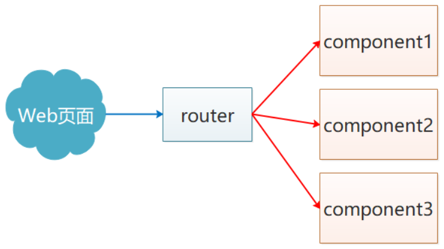
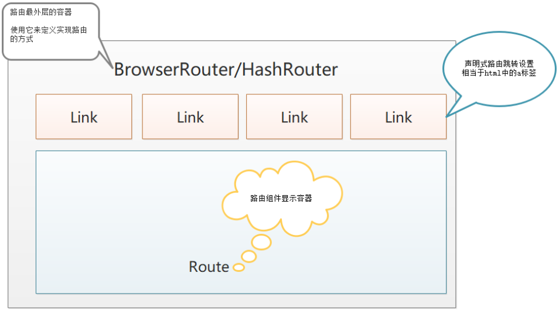

# 路由

声明：本次使用的路由包版本是5.3.3【当前最新6.0】

## 1、介绍




React Router官网：https://reactrouter.com/

使用用React Router前需要先进行安装：

~~~shell
npm i react-router-dom@5.3.3
~~~

React Router现在的主版本是5，思想：**一切皆组件**。


## 2、路由的使用 

### 2.1、相关组件 

如前面介绍里说的，自Router 4之后的思想是`一切皆组件`，所以在正式开始学习React路由前需要先对几个组件要有所掌握：

- **Router组件**（别名，真实是不存在的，为了简写路由模式的组件名称）：**包裹整个应用**（单个具体的组件/**根组件**），一个React应用只需要使用一次
  - 注意：**在react中，不存在类似于vue的路由配置文件，对于前端路由模式的选择，我们可以通过该组件完成**
  - Router类型： HashRouter和BrowserRouter
    - HashRouter： 使用URL的哈希值实现 （localhost:3000/#/first）
    - BrowserRouter：使用H5的history API实现（localhost:3000/first）
  - **区别**：
    - 两者在开发阶段，除了地址栏上的表现形式不一样以外，其它没区别
    - 两者在生产阶段，hash路由可以直接上生产，无需做任何配置，而history模式则上生产需要配置的，配置服务器环境 (后台人员服务器配置一下如果404,指定index.html或首页)，否则项目是不能刷新的，一刷新就会404 
- **Link**组件：用于指定导航链接（a标签）就是做声明式导航的（类似于vue中的`router-link组件`）
  - 最终Link会编译成a标签，而to属性会被编译成 a标签的href属性
- **Route组件**：既可以编写路由规则同时也是路由规则对应的组件的展示容器【**路由规则**】{path: xx,component:xxx}
  - path属性：路由规则，这里需要跟Link组件里面to属性的值一致
  - component属性：展示的组件
  - 语法：<Route path="路径" component={组件}></Route>
  - 该组件除了具备定义路由规则功能外，还有类似于vue中`router-view`的功能

**各个组件之间的关系**



> **注意：`Link`和`Route`组件必须被`Router`组件给包裹，否则报错。**


### 2.2、声明式导航

- 在`src/index.js`主入口文件中定义一个路由模式（可选，也可以在具体的某个组件中使用Router）

~~~jsx
import React from "react";
import ReactDOM from "react-dom";

// 设置路由模式
import {BrowserRouter as Router} from 'react-router-dom'

// 定义 provider
import { Provider } from "react-redux";
import store from "./Store/index";

import App from "./App";

ReactDOM.render(
    <Provider store={store}>
        {/* 使用Router包裹根组件,这样全局都可以使用该路由 */}
        <Router>
            <App></App>
        </Router>
    </Provider>,
    document.getElementById("root")
);
~~~

- 在 src/router/index.jsx中定义路由规则,使用Route 组件,一般语法: <Route path='路径' component={组件}></Route>


~~~jsx
//  定义路由规则:

// 由于react中定义路由规则是通过组件实现的,所以首先创建一个组件(函数组件和类组件都可以)
// 由于路由不涉及到状态,生命周期,所以使用函数组件更加简单
import React from 'react';
// 1. 引入路由组件Route
import { Route } from 'react-router-dom';
// 2. 引入路由地址对应的页面组件
import News from '../views/New'
import About from '../views/About'
//3. 配置路由规则(类似于vue中的routes)
const Index = () => {
    return (
        <>
            <Route path='/news' component={News}></Route>
            <Route path='/about' component={About}></Route>
        </>
    );
}

export default Index;
~~~

- 在根组件中引入路由规则(**除其他特殊的路由规则外(嵌套路由规则),其他普通的路由规则都需要在根组件中使用**)

```jsx
import React, { Component } from 'react';
// 引入link组件 相当于a标签实现页面跳转
import { Link } from 'react-router-dom';
// 引入路由规则组件
import Rules from './router/Index'
class App extends Component {
  render() {
    return (
      <div>
        <ul>
           <Link to='/news'><li>新闻</li></Link>
           <Link to='/about?id=100'><li>关于</li></Link>
            {/*
				传参方式1:search, 在对应页面中使用props.location.search
                传参方式2:state 隐式传参,该方法参数不会出现在地址栏,用户看不到,在对应页面		   						    props.location.state , 该方法可以作为页面埋点的方式
			*/}
           <Link to={{ pathname: '/news', search: 'id=99', state: { a: 1, b: 2 } }}>新闻				</Link>
            {/* 传参方式3:restful动态路由传参 ,需要在路由规则配置参数 <Route path='/news/:id' 					component={News}></Route>,在对应页面拿参 props.match.params*/},
            <Link to={{ pathname: '/news/111'}}>新闻</Link>
        </ul>
        {/*使用路由规则*/}   
        <Rules />
      </div>
    );
  }
}
export default App;
```

在写上述代码时注意，路由自带组件的顺序嵌套关系，组件`<Link></Link>`和组件`<Route></Route>`必须被组件`<Router></Router>`给包裹着。

> 需要注意：
>
> 刨除样式的影响，`Route`组件在HTML代码中的位置决定了渲染后其在页面中显示的位置。如果`Route`放在最后，则其显示的时候也在最后；若其放在渲染内容的最前面，相应的显示也会在最开始。


### 2.3、编程式导航

react-router-dom中通过history对象中的push/go等方法实现编程式导航功能，这一点与之前的vue路由还是很相似的。

形如：

~~~jsx
// 方式1 
this.props.history.push('/home?参数')
// 方式2  
this.props.history.push({
  pathname: "/home",
  search: "from=404",	// 表示传递查询字符串
  state: {				// 隐式传参，地址栏不体现
    username: "admin",
  },
});

//方式3  给定给定的数字（正数或负数）决定去往历史栈中的哪个地址，正数往未来，负数往过去
this.props.history.go(-1)
this.props.history.goBack()
~~~

> 请勿在根组件中写编程式导航，因为根组件默认是没有props对象，因为只有通过路由跳转的组件, 该组件的props 中才有 history, loaction match 这三个属性,否则没有. 解决方法使用 react-router-dom中提供的高阶组件强化函数 withRouter(组件) 被包裹组件就有三个参数了  如下: 
>
> ```jsx
> import {withRouter } from 'react-router-dom';
> 
> export default withRouter(App);
> ```
>
> 

## 3、路由参数

路由参数：在Route定义渲染组件时给定动态绑定的参数。

React路由传参方式有三种：

- ==动态路由参数（param）==
  - 以“/film/detail/:id”形式传递的数据
  - 在目标页面路由中传递
  - 在落地组件中通过`this.props.match.params`得到
  - 一般用于restful规范下的开发
- 查询字符串（query）
  - 通过地址栏中的 `?key=value&key=value`传递
  - 在落地组件中通过`this.props.location.search`得到
  - 由于得到的数据是带“?”的，还需要进一步加工处理之后才能使用，因此建议少用或者不用
- **隐**式传参（state)，通过地址栏是观察不到的
  - 不合适写在声明式导航中，写在编程式导航中更加合适
  - 一般数用于**埋点**数据
    - 简单的讲，埋点是将部分标记隐藏起来，等待用户去触发，因为这个事情不想让用户看到（需要做一些数据的收集，后续做分析），因此会使用隐式传参的方式（大数据分析）
  - 在落地组件中通过`this.props.location.state`得到

接收示例：

~~~jsx
constructor(props){
    super(props)
    this.state = {
        // 接收动态路由参数
        news_id: this.props.match.params.id,
        // 接收查询字符串并处理
        query: querystring.parse(this.props.location.search.slice(1)),
        // 接收state
        state: this.props.location.state
    };
}
~~~


## 4、嵌套路由

~~~js
const routes = [
    // 父路由规则
    {path:'/',redirect:'/home'},
    {
        path: "/admin",
        component: Admin,
        // 子路由规则
        children: [
            {
                path: "/admin/index",
                component: Index
            },
            {
                path: "user",
                compnent: User
            }
        ]
    }
]
~~~

在有一些功能中，往往请求地址的前缀是相同的，不同的只是后面一部份，此时就可以使用多级路由（路由嵌套）来实现此路由的定义实现。

例如，路由规则如下

````
/admin/index
/admin/user
/admin/goods
/admin/add
````

它们路由前缀的admin是相同的，不同的只是后面一部分。

**思想：**

- 借助react路由默认是**非严格匹配模式**的便利（路由规则是：/abc）

  - 例如。上述路由都有`/admin`开头，那么我们可以在路由定义时定义一个组件的路由规则“/admin”。如果这样做，则上述4个路由都会匹配上这个路由规则。匹配的这个组件我们称之为父组件

  - 扩展：如果某个路由需要使用严格模式，请在这个路由上加上一个属性：exact

    如:  <Route path='/admin' component={Admin} exact />

  - 注意: 如果该一级路由有二级路由,那么该**一级路由**一定不能设置严格模式

  - 注意:如果需要匹配**根路由(/)**,那么需要设置严格模式,否则所有的路由都匹配

  - 注意:嵌套路由规则的地址需要将上一级的路由地址拼上,(如 二级路由path = '/一级路由path/二级路由path'

- 再在父组件中写嵌套的子路由的匹配规则

**实现方式**

- 先需要定义个组件，用于负责匹配同一前缀的路由，将匹配到的路由指向到具体的模块

~~~jsx
// 该组件为根组件,修改入口文件的根组件地址,让页面显示当前的组件页面
import React, { Component } from 'react';
import { Route } from 'react-router-dom'
import Admin from './Admin'
class Root extends Component {
    render() {
        return (
            <div>
                我是根组件
                {/*注意:如果该组件有二级路由,那么不能设置严格模式  exact*/ }
                <Route path='/admin' component={Admin} />
            </div>
        );
    }
}

export default Root;
~~~

- 在如上的一级路由对应的组件Admin.jsx中,定义二级路由规则

~~~jsx
import React, { Component } from 'react';
import { Route } from 'react-router-dom';
// 引入子组件Adminone和Admintwo
import Adminone from './adminOne';
import Admintwo from './adminTwo';
class Admin extends Component {
    render() {
        {/*
        	可以将一级路由的path 写活,这样当一级路由的path修改时,不会影响二级路由的path
        	this.props.match.path 为一级路由的path地址
        */}
        let prefix = this.props.match.path //获取一级路由前缀 /admin
        return (
            <div>
                 我是admin 组件
                {/*定义二级路由规则:注意一定需要把一级路由地址拼上*/}
                <Route path='/admin/adminone' component={Adminone}></Route>
                <Route path={prefix+'/admintwo'} component={Admintwo}></Route>
            </div>
        );
    }
}

export default Admin;
~~~

- 创建父路由中的子路由需要的组件


## 5、重定向与404路由

vue中实现路由重定向:

const routes = [

​	{

​     path:'/', redirect:'/home'

​     },

  { path:'/mine', 
  component:Mine,
  children:[

​     {path:'', component:Mine1}

  ]   

}

]

### 5.1、重定向路由 

React的重定向路由有以下写法：

> 在重定向的时候需要知道，从哪里来，到哪里去，因此该组件需要使用2个属性：
>
> - from：匹配需要重定向的路由
> - to：需要去往的路由

~~~react
import React, { Component } from 'react';
// 第一步:引入 Redirect 组件
import { Route, Redirect } from 'react-router-dom'
import Admin from './Admin'
class Root extends Component {
    render() {
        return (
            <div>
                <Switch>
                    我是根组件
                    <Route path='/admin' component={Admin} />
                    {/* 第二步:使用重定向路由 */}
                    <Redirect from='/' exact to='/admin/adminone' exact></Redirect>
                </Switch>
            </div>
        );
    }
}

export default Root;
~~~

注意： 一定要将重定向路由规则组件写在其他路由规则之后,且重定向路由组件设置严格模式. 


### 5.2、404路由 

项目中少不了404页面的配置，在React里面配置404页面需要注意： 

- 需要用到Switch组件，让其去包裹所有路由的`Route`组件（Switch组件保证只渲染其中一个子路由）

  ~~~jsx
  import NotFound from "./Components/404";
  
  <Route>
      <NotFound></NotFound>
  </Route>
  // 或
   <Route component={NotFound}></Route>
  ~~~

> 注意：在404路由的位置，不需要给定具体的路由匹配规则，即不给`path`表示匹配`*`，即所有的路由都会匹配，因此用404路由一定要加`Switch`匹配一个路由。

例如：

~~~jsx
import React, { Component } from 'react';
// 第一步: 引入Switch组件
import { Route, Redirect, Switch } from 'react-router-dom'
import Admin from './Admin'
import Notfound from './NotFound';
class Root extends Component {
    render() {
        return (
            <div>
                我是根组件
              {/*使用switch组件包括所有路由,这样被包裹的路由每次只能匹配一个,同时支持手动修改地址栏*/}
                <Switch>
                    <Route path='/admin' component={Admin} />
                    {/* 使用重定向路由 */}
                    <Redirect from='/' exact to='/admin/adminone'></Redirect>
                    {/* 404路由 */}
                    <Route component={Notfound}></Route>
                </Switch>
            </div>
        );
    }
}

export default Root;
~~~


## 6、三种路由渲染方式

> v6中采用了新的属性对组件进行渲染，属性名：element

Route路由渲染组件是用于路由规则匹配成功后组件渲染容器，此组件提供了3种组件渲染方式：

- component属性（值为**变量对象或函数**）

  - ~~~jsx
    // 第一种方式 使用组件的变量名(最常用)
    <Route path="/home" component={Home}/>
    ~~~

  ~~~jsx
    import Home from '../views/routerview/Home';
    // 第二种方式: component的是为函数形式,返回对应的组件名
    // 缺点: 会造成Home组件的props属性丢失,无法使用props中的属性和方法,解决办法需要添加一个props形参, 该形参就是props属性对象,可以解构到组件上,这样就实现了props
    <Route path="/home" component={(props) => <Home {...props} />} />
  ~~~

- render属性（值只支持函数方式）

  - ~~~jsx
    // 如果不设置形参props和组件的{...props},会造成该组件Home 的props属性丢失,这样比如使用编程式导航跳转的时候,无法实现跳转 this.props.history.push()
    <Route path="/home" render={(props) => <Home {...props} />} />
    ~~~

- children属性（值可以是**函数或组件**）

  - ~~~jsx
    //props 属性会丢失,同上 
    //注意:children属性为函数时,该组件有个特点,无论该path是否与当前的渲染地址匹配,该渲染方式始终执行(即始终渲染该组件,前提没有Switch组件包裹),如果当前路由地址不匹配的话,其props的match属性为null
    // 后面可以使用该特性,自定义路由组件,
    <Route path="/about" children={(props) => {
    	if(props.match){
            return <About {...props} />
        }
    }} />
    ~~~

  - ~~~jsx
    //children属性为组件时, props属性会丢失 同上
    <Route path="/about" children={<About {...this.props} />} />
    ~~~

**注意点**

- 当children的值是一个函数时，无论当前地址和path路径匹不匹配，都将会执行children对应的函数，当children的值为一个组件时，当前地址和path不匹配时，路由组件不渲染
- children函数方式渲染，会在形参中接受到一个props对象，对象中match属性如果当前地址匹配成功返回对象，否则null


## 7、封装自定义导航组件

目前虽然在react中有导航组件Link，但是与vue相比，vue的router-link支持tag属性（自定义渲染成标签），而这里不支持。

1. 如下代码是使用<Link>组件实现的正常路由切换跳转

```jsx
import React, { Component } from 'react';
import { Link, Route } from 'react-router-dom'
class Routertest extends Component {
    render() {
        return (
            <div>
                <ul>
                    <li><Link to='/shouye' tag='p'>首页</Link></li>
                    <li><Link to='/fenlei'>分类页</Link></li>
                </ul>
                <Route path='/shouye' component={Shouye}></Route>
                <Route path='/fenlei' component={Fenlei}></Route>
            </div>
        );
    }
}
//1.定义首页组件
class Shouye extends Component {
    render() {
        return (
            <div>我是首页内容</div>
        )
    }
}
//2.定义分类组件
class Fenlei extends Component {
    render() {
        return (
            <div>我是分类页内容</div>
        )
    }
}
export default Routertest;
```

2. 使用自定义导航组件方式实现渲染

```jsx
// 1. 父组件代码
import React, { Component } from 'react';
import { Link, Route } from 'react-router-dom'
// 引入Nav组件
import Nav from '../components/Nav'
class Routertest extends Component {
    render() {
        return (
            <div>
                <ul>
                    <li><Nav to='/shouye' tag='p'>首页</Nav></li>
                    <li><Nav to='/fenlei'>分类页</Nav></li>
                </ul>
                <Route path='/shouye' component={Shouye}></Route>
                <Route path='/fenlei' component={Fenlei}></Route>
            </div>
        );
    }
}
//1.定义首页组件
class Shouye extends Component {
    render() {
        return (
            <div>我是首页内容</div>
        )
    }
}
//2.定义分类组件
class Fenlei extends Component {
    render() {
        return (
            <div>我是分类页内容</div>
        )
    }
}
export default Routertest;
```

```jsx
// 定义 Nav组件代码
import React, { Component } from 'react';
// 需要导入
import { Route, withRouter } from 'react-router-dom'
class Nav extends Component {
    render() {
        const text = this.props.children // 获取要显示的文本内容
        const Tag = this.props.tag ? this.props.tag : 'a' // 获取要显示的标签
        const url = this.props.to // 获取要跳转的路径
        const style = { cursor: 'pointer' } // 设置样式
        return (
            <>
                <Route path={url} children={(props) => {
                    if (props.match) { // 判断当前页面路径与当前的path路径匹配,当前标签设置样式,就										是为了这个判断,要不然可以不用Route,直接使用Tag
                        style.color = 'red'
                    }
                    return <Tag onClick={() => this.go(url)} style={style}>{text}</Tag>
                }}></Route>

            </>
        );
    };
    go(url) {
        //console.log(this, props);
        // 注意:此处也可以使用children接收的props形参,在go函数的形参中接收该props,这样也可以使用
        // props.history.go(url) 实现
        this.props.history.push(url)
    }
}
// withRouter:高阶组件的强化函数,该函数可以让没有路由信息的组件获取路由信息和方法
export default withRouter(Nav);
```

知识点：6小节中的三种渲染模式


## 8、withRouter

**作用：把不是通过路由切换过来的组件中，将react-router 的 history、location、match 三个对象传入props对象上**

默认情况下，必须是经过路由匹配渲染的组件才存在this.props，才拥有路由参数，才能使用编程式导航的写法，才能执行this.props.history.push('/uri')跳转到对应路由的页面。然而不是所有组件都直接与路由相连的，当这些组件需要路由参数时，使用withRouter就可以给此组件传入路由参数，此时就可以使用this.props。

~~~jsx
// 引入withRouter
import { withRouter} from 'react-router-dom'

// 执行一下withRouter
export default withRouter(Cmp)
~~~

> 该高阶组件是路由包自带的东西，因此只需要引入+使用就可以了，不需要自己定义。


**V5与V6的变化**

- Switch被废弃，由Routes替代，并且Routes是必须的

- 渲染组件的方式被element属性替代，例如：

  - `<Route path="/dashboard" element={<Dashboard />} />`

- 重定向组件Redirect被废弃，使用以下语法替代：

  - ~~~js
    <Route path="/" element={<Navigate to="/dashboard/welcome" />} />
    ~~~

- 嵌套路由被简化

  - 父路由：

    - ~~~js
      <Route path="/dashboard/*" element={<Dashboard />} />
      ~~~

  - 子路由（子路由规则中不再需要写父前缀）：

    - ~~~js
      <Route path="welcome"  element={<Welcome/>}/>
      ~~~

      
