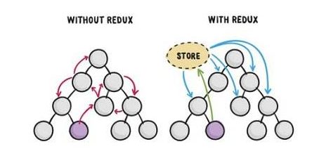
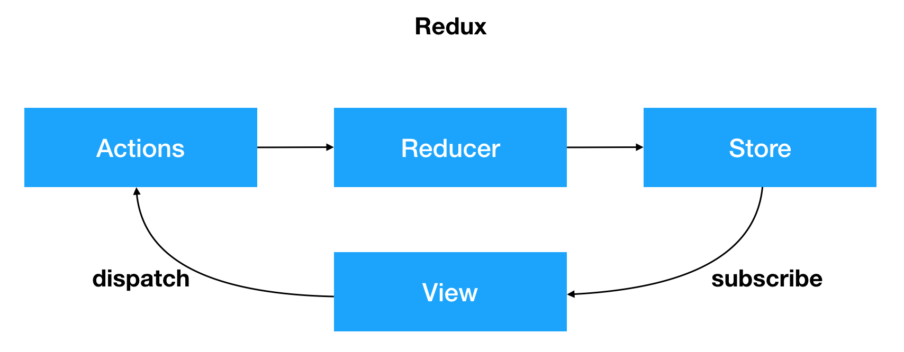
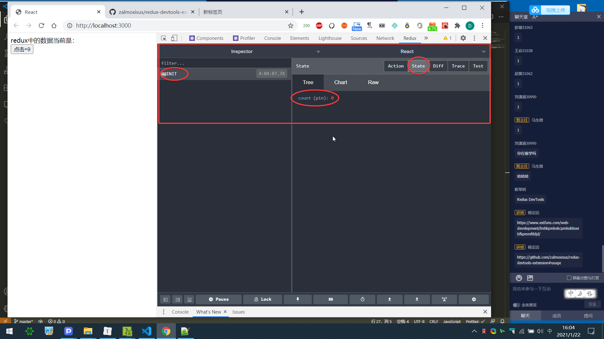

# Redux（重点）

## 1、简介 

2013年Facebook提出了Flux架构的思想，引发了很多的实现。2015年，Redux出现，将Flux与函数式编程结合一起，很短时间内就成为了最热门的前端架构。

纯函数:输出完成有输入决定的函数

函数的副作用(side effect):发请求，dom操作，.....

简单说，如果你的UI层非常简单，没有很多互动，Redux就是不必要的，用了反而增加复杂性。

如果你的项目的迭代变得越来越复杂，组件的数量和层级也变得越来越多，越来越深，此时组件间的数据通信就变得异常的复杂和低效，为了解决这个问题，引入了状态管理（**redux**）从而很好的解决多组件之间的通信问题。



如果需要使用Redux请先进行安装：

网址：https://redux.js.org/introduction/getting-started

~~~shell
npm i -S redux
~~~

作用：项目进行大规模数据管理的工具。

提醒：所有的代码需要从0开始写（不像vuex，选择了vuex后会自带一些代码）


## 2、三大原则（重点）

- 单一数据源
  
  - 整个应用的`state`（这个state不是组件中的state，请不要混淆）被储存在一棵对象结构树中，并且这个对象结构只存在于唯一一个store中
- State是只读（相对，相对旧数据）的
  
  - 唯一改变state的方法就是触发dispatch+action，action是一个用于描述已发生事件的**普通对象**（action普通对象必须要有`type`属性，值是什么无所谓，其余属性也无所谓）。
  
  
- （最终修改数据的方法）使用**纯函数**（一个函数的返回结果**只**受到其形参的影响，则其就是纯函数）来执行修改store中的数据
  
  - 为了描述action如何改变state tree ，我们需要编写reducer【**看作是vuex中的mutations里的方法】，==reducer必须是纯函数==，它接收先前的state和action，并返回**新的state（不会合并的，自行注意这个坑）

> 纯函数是函数式编程的概念，必须遵守以下一些约束。
>
> - 不得改写参数
>
> - 不能调用系统 I/O 的API
>
> - 不能调用Date.now()或者Math.random()等不纯的方法，因为每次会得到不一样的结果

请注意：由于reducer被要求是纯函数，所以reducer函数里面不能改变State，必须返回一个全新的数据（不会自动合并原始数据的，因此一定要注意：别把原始数据搞丢了）。

**操作原理图**



a. store通过reducer创建了初始状态

b. view通过store.getState() 获取到了store中保存的state挂载在了自己的状态上

c. 用户产生了操作（事件），调用了actions 的方法

d. actions的方法被调用，创建了带有标示性信息的action（描述对象，描述如何修改数据）

e. store.dispatch方法发送actions任务到了reducer中

f. reducer接收到action并根据标识信息判断之后返回了新的state（自己注意合并的问题）

g. store的state被reducer更改为新state的时候，store.subscribe方法里的回调函数会执行，此时就可以通知view去重新获取state

- store.getState()：用于获取仓库中初始的数据（一次性）
- store.dispatch()：用于派发修改数据的任务，参数是action普通对象
- store.subscribe(callback)：视图组件用于订阅新数据的方法（二次及以后的数据更新，使之产生类似于vue的响应式store数据）


## 3、redux的基本使用(存。取，改)

**案例：在组件中展示一个按钮，点按钮后给redux中的数字+9，数字初始为0。实现一个计数器的效果**

步骤：

- 创建store
- 创建视图组件（展示store中的数据）
- 修改
- 回显数据到视图组件


**实现步骤**

a. 创建默认数据源：

~~~js
// 1. 这是仓库store/index.js

// a. 导入createStore方法，作用用于产生仓库
import { createStore } from "redux";

// b. 创建数据源, 默认数据源是一个普通对象，可以有很多的数据
const defaultState = {
    // 定义初始化的数据
    count: 0,
    num:100
};

// c. 创建纯函数reducer（函数名随意）
// 作用：负责返回state（如果不涉及数据修改,直接返回state,如果设置修改数据,则返回修改完的state）
// 语法：reducer(state = defaultState,actions)
function reducer(state = defaultState, actions) {
    //该处为修改数据源的操作
     if (actions.type === '+') {
        return {
            ...state, // 保留旧数据,否则修饰,因为reducer方法不是修改state,而是替换state
            count: state.count + actions.payload
        }
    }
    return state;
}

// d. 创建仓库
// 产生仓库的时候需要往仓库中存放数据源，因此需要传递上面定义的reducer函数
const store = createStore(reducer);

// e. 导出仓库
export default store;

~~~

为了方便调试redux（可选安装)，建议去谷歌商店安装`redux devtools`(或到插件迷网站下载)，在使用的时候需要参考其[说明页面](https://github.com/zalmoxisus/redux-devtools-extension#usage)

> redux工具条在安装好之后不能直接使用，需要配置仓库代码，然后才能使用。

~~~js
// d. 产生仓库
// 产生仓库的时候需要往仓库中存放数据源，因此需要传递reducer过去
const store = createStore(
    reducer,
    // 必须要加上一段插件的配置工具，才能在浏览器中使用redux扩展,才能看到redux中state数据.
    window.__REDUX_DEVTOOLS_EXTENSION__ && window.__REDUX_DEVTOOLS_EXTENSION__()
);
~~~

显示效果：




b. 建立视图组件并且展示数据源

~~~react
import React, { Component } from "react";
// 需要导入store;
import store from "../store/index";
class Counter extends Component {
    // 在constructor中获取store中的数据
    constructor(props) {
        super(props);
        // 获取store数据（一次性，不具备响应式）
        this.state = store.getState(); 
        // 重新订阅store中的数据更新state, 每次修改store中的数据都会触发该方法
        // 非简写方式01:
        store.subscribe(() => {
            //console.log('subscribe');
            this.setState(() => {
                return store.getState()
            })
        })
        // 简写方式02:
        store.subscribe(() => this.setState(() => store.getState()));
    }
    render() {
        console.log(this.state);
        return (
            <div>
                <div>当前Store中的数据是：{this.state.count}</div>
                <button onClick={this.addCount.bind(this)}>点击+9</button>
                <hr />
                <div>当前Store中的数据是：{this.state.age}</div>
                <button onClick={this.addAge.bind(this)}>点击+1</button>
            </div>
        );
    }

    // 点击+9
    addCount() {
        // 描述数据如何更改的对象，其必须有type属性
        let action = { type: "mod_count", payload: 9 };
        // 通过store.dispatch去派发actionr任务（会将该action派发给所有的reducer也就是调用reducer方			法，每个reducer都接收action任务,然后判断执行，因此一定要注意type的取值）
        store.dispatch(action);
    }

    // 点击+1
    addAge() {
        let action = { type: "mod_age", payload: 1 };
        store.dispatch(action);
    }
}

export default Counter;
~~~

c. 修改操作

视图组件中的代码：

~~~js
handler() {
    // 3. +9这个修改操作需要通过普通对象去描述（actions）
    const action = {
        // type是用于在reducer方法中做条件判断用的
        type: "add",
        // 另一个属性用于声明本次修改具体的值是多少
        payload: 9,
    };
    // 派发修改任务
    store.dispatch(action);
}
~~~

仓库文件的代码：

~~~js
function reducer(state = defaultState, actions) {
    console.log(actions);
    //判断是否是加法操作
    if (actions.type === "add") {
        return { 
            ...state, // 记得携带旧数据,否则新返回的对象中是没有旧数据的
            count: state.count + actions.payload //actions.payload获取到参数,该count变量会覆													 盖掉上面我的count 变量
        };
    }
    // 在返回之前写修改数据源的操作
    return state;
}
~~~

d. 回显新的数据

~~~js
// 构造函数
constructor(props) {
    super(props);
    // 2. 在视图组件中获取初始的仓库数据
    // getState()方法是store对象内置的方法
    this.state = store.getState();
    // 4. 订阅新的数据(当state中的数据被修改,会触发subscribe内的箭头函数callback,		   	   
         //store.subscribe(callback)
    store.subscribe(() => {
        // 获取新数据修改当前的state
        this.setState(() => store.getState());
    });
}
~~~


f. 当处理多个reducer 方法时,由于不同的reducer 操作的是不同模块的数据,所以需要单独维护

```js
// 定义store 仓库数据
// 01: 引入 combineReducers 这个方法 将多个reducers 结合成一个reducer
import { legacy_createStore as createStore, combineReducers } from 'redux';

// 02: 定义初始数据
const defaultState = {
    count: 0,
    num: 100
}

//03: 创建纯函数 修改state 数据
function reducer(state = defaultState, actions) {
    if (actions.type == '+') {
        return {
            ...state,
            count: state.count + actions.payload
        }
    }

    return state
}
// 另一个reducer 维护自己的模块数据
function reducer1(state = defaultState, actions) {
    if (actions.type == 'jia') {
        return {
            ...state,
            num: state.num + actions.payload
        }
    }

    return state
}
// 04: 创建仓库,使用combineReducers 将多个reducer结合成一个reducer,
const store = createStore(combineReducers({ reducer, reducer1 }), window.__REDUX_DEVTOOLS_EXTENSION__ && window.__REDUX_DEVTOOLS_EXTENSION__());


//05: 导出仓库 
export default store

```

f1. 多个reduce在页面中显示数据并操作

```jsx
import React, { Component } from 'react';
import store from '../../store';
console.log(store);
class Test extends Component {
    constructor() {
        super();
        this.state = store.getState();
        console.log(this.state);
        store.subscribe(() => {
            this.setState(() => {
                return store.getState()
            })
        })
    }
    render() {
        return (
            <div>
                我是test 组件
                <p>{this.state.reducer.count}<button onClick={this.addCount}>+1</button></p>
                <p>{this.state.reducer1.num}<button onClick={this.addNum}>+10</button></p>
            </div>
        );
    }

    addCount = () => {
        store.dispatch({ type: '+', payload: 1 })
    }
    addNum = () => {
        store.dispatch({ type: 'jia', payload: 10 })
    }
}

export default Test;
```


## 4、react-redux(便于全局使用)

网址：https://react-redux.js.org/

React-Redux是Redux的官方针对React开发的扩展库，默认没有在React项目中安装，需要手动来安装。react-redux是依赖于redux，所以必须先安装redux。

我们可以理解为react-redux就是redux给我们提供的高阶组件加工厂。

使用react-redux 可以很方便我们去操作redux

~~~shell
npm i -S react-redux
~~~

React-redux所能解决的问题是：

- 每个组件使用仓库的时候,需要 import store from '路径' ,仓库store没有实现全局化(而vue在每个组件可以直接访问全局数据,无需导入 this.$store.state)

- 使用它以后我们不需要在每个组件中再去 手动订阅数据的更新了store.subscribe(...)(vue不需要) 。
- this.state=store.getState() 已经占用了数据的初始化state赋值，当前组件自身state的数据无法额外添加,
- 为了解决上述问题. 使用本节的react-redux, 但该方法并不是为了简化代码的，它们存在的意义是解决前面所遇到的问题

**使用步骤**

- 在项目入口文件中定义Provider

  - 该步骤的操作有点类似于之前组件通信中的context那块的操作

  - 将整个仓库作为商品提供给App根组件，后续的所有的组件都可以获取到仓库store中的数据

  - 注意：与context不一样，这里绑定数据使用的属性是“store”

  - 入口 index.js 文件中的示例代码：

  - ~~~js
    // 导入
    import React from "react";
    import ReactDOM from "react-dom";
    // 导入provider
    import { Provider } from "react-redux";
    import store from "./store/index";
    
    // 导入需要展示的组件
    import App from "./Login";
    
    // 渲染视图
    // 在展示app组件的时候需要按照组件的形式进行操作
    ReactDOM.render(
        //使用Provider组件包裹,将要共享的数据设置为store属性,这个每个后代组件都能获取到该store数据了
        // 此时 store 数据就实现了全局化了
        <Provider store={store}>
            <App></App>
        </Provider>,
        document.getElementById("root")
    );
    ~~~

- 在需要使用redux的组件中使用

  - 这个步骤与vuex中map系列函数（mapState，mapMutations，mapActions、mapGetters）的思想是一样的

  - 思想：将仓库中的属性和方法映射成当前组件自身的属性和方法

  - 在实际使用的时候组件中不再需要使用store对象了（包括初始的获取数据：store.getState()、store.dispatch(）、store.subscribe()）

  - 步骤

    - 在需要使用redux的组件前面导入react-redux提供的高阶组件：connect

    - 编写映射方法（请注意，这个方法映射不是类组件的方法，而是在类组件外写的方法）

      - mapStateToProps(state)
        - 作用：将仓库中的state数据源映射成本组件的属性props，返回一个props对象
        - 参数：仓库中的state
      - mapDispatchToProps(dispatch)
        - 作用：将派发action的方法映射成当前组件自身的属性，该方法也要求返回一个对象，该对象中存放的就是派发action的方法集合
        - 参数：dispatch如同之前的store.dispatch()
      - 编写时，可以写箭头函数，也可以写常规函数

    - 应用高阶组件connect，写法是固定的 connect(参数1,参数2)(组件名)

      - ~~~js
        // 在组件最后导出的时候改写成如下：
        // 从react-redux 导入的connect 参数1,参数2 固定的
        // 参数1为mapStateToProps 函数,且该函数必须返回一个对象,否则报错
        // 参数2为mapDispatchToProps 函数, 且该函数必须返回一个对象,否则报错
        export default connect(mapStateToProps,mapDispatchToProps)(ComponentName)
        ~~~

  - 组件中实际使用时的参考代码：以jsx为例

  - ~~~react
    import React, { Component } from "react";
    // 第一步：在需要使用redux组件中导入一个由react-redux提供的hoc
    import { connect } from "react-redux";
    class Counter extends Component {
        render() {
            return (
                <div>
                    <div>当前Store中的数据是：{this.props.tool.count}</div>
                    <button onClick={this.props.addCount}>点击+9</button>
                    <hr />
                    <div>当前Store中的数据是：{this.props.user.age}</div>
                    <button onClick={this.props.addAge}>点击+1</button>
                </div>
            );
        }
    }
    
    // 第二步：在类外面定义俩个映射方法
    // 将redux中的state数据源属性映射到本组件自身的props属性中
    function mapStateToProps(state) {
        // return state.user;
        // return state.tool;
        return state;
    }
    // 将修改数据的方法dispatch映射成自身组件的props属性
    function mapDispatchToProps(dispatch) {
        // 该方法返回一个对象，对象中都是方法
        return {
            addCount() {
                dispatch({type:'+',payload:1});
            },
            addAge() {
                dispatch({type:'jia',payload:2});
            },
        };
    }
    
    // 第三步：应用HOC
    // connect函数的俩个参数顺序不能颠倒
    export default connect(mapStateToProps, mapDispatchToProps)(Counter);
    ~~~

​    connect写法是传统写法

​    useSelector 拿到仓库里的数据

   ~~~
 let state= useSelector(state=>state);  参数是回调，直接可以拿到仓库里的数据
   ~~~


   useDispatch 就直接可以抛发动作

  ~~~
let dispatch=useDispatch();  dispatch(动作对象)
  ~~~


## 5、Redux模块化

> 如果redux需要使用多个模块，请使用combineReducers方法将多个reudcer函数进行组合，得到一个根reducer对象，将对象传递给创建仓库的方法：https://redux.js.org/tutorials/fundamentals/part-3-state-actions-reducers#combinereducers

针对redux的模块化，在一个常规项目中会将其代码拆分成以下几个部分：

- Reducers，建立同名目录，存放模块化之后的reducer 
- types : 建立同名目录,存放types (这样可以集中管理type)  

具体实现，以项目的代码为准。

```jsx
//store 目录下的index.js 

// 1.导入createStore 方法 用它来创建store
import { createStore, combineReducers } from 'redux';
// 2. 创建一个默认数据对象, 可以定义多个数据
const defaultState = {
    count: 0, // 该数据为user模块中的数据
    num: 100  // 该数据为shoppingCar模块中的数据
}
// dispatch派发一个actions时,所有的reducer方法都被执行,所以reducer中的type值都不一样
//3. 创建 user模块的 reducer 纯函数, 返回state 对象
function user(state = defaultState, actions) {
    // 此处可以操作state中的数据,
    if (actions.type === '+') {
        return {
            ...state,
            count: state.count + actions.payload
        }
    }
    if (actions.type === '-') {
        //console.log(3, state.count, actions.payload)
        return {
            ...state,
            count: state.count - actions.payload
        }
    }
    return state
}

//4. 创建shoppingCar模块的reducer纯函数,返回state 对象
function shoppingCar(state = defaultState, actions) {
    if (actions.type === 'add') {
        return {
            ...state,
            num: state.num + actions.payload
        }
    }
    return state
}
// 5. 使用combineReducers 可以将多有的reducer方法进行合并,参数为对象,对象的key为模块的名称
// 有点类似于vuex的命名空间
const reducers = combineReducers({ user: user, shoppingCar: shoppingCar })
// 6. 创建仓库
const store = createStore(reducers, window.__REDUX_DEVTOOLS_EXTENSION__ && window.__REDUX_DEVTOOLS_EXTENSION__())
// 7. 导出仓库
export default store
```

```jsx
// 页面操作部分
import React, { Component } from 'react';
import { connect } from 'react-redux';
class Thirteenclass extends Component {
    render() {
        return (
            <div>
                <h1>测试redux</h1>
                <p>store中的数据count: {this.props.user.count}</p>
                <p>
                    <button onClick={this.props.addFn}>+1</button>
                </p>
                <hr />
                <p>store中的数据num: {this.props.shoppingCar.num}</p>
                <p>
                    <button onClick={this.props.addNum}>+1</button>
                </p>
            </div>
        );
    }
}
// 将state 映射成自身组件的props
function mapStateToProps(state) {
    return state
}
// 将dispatch映射成自身组件的props
function mapDispatchToProps(dispatch) {
    return {
        addFn() {
            // 同步调用
            //dispatch({ type: '+', payload: 1 }) 
            // 异步调用 如下:payload的值为接口返回的数据,不是固定的值(该接口返回一个随机数)
            fetch('https://api.i-lynn.cn/rand').then(res => res.json()).then(res => {
                dispatch({ type: '+', payload: res.payload })
            })
        },
        addNum() {
            dispatch({ type: 'add', payload: 1 })
        }
    }
}
// 应用高阶组件connect，写法是固定的 connect(mapStateToProps,mapDispatchToProps)(组件名)
export default connect(mapStateToProps, mapDispatchToProps)(Thirteenclass);
```

模块化目录及文件内容实例:

~~~js
//第一步: 拆分types, store目录下/types/index.js(这样便于集中化管理
const types = {
    addCount: '+',
    addNum: 'add'
}
export default types

// 第二步: 拆分 reducers, store目录下/reducers/ 不同的模块创建不同的js并导出该函数
#reducers目录
 #user.js文件
 	import types from "../types/types"
    const defaultState = {
        count: 0,
        num: 100
    }
	//创建reducer 纯函数, 返回state 对象,
	function user(state = defaultState, actions) {
        // 此处可以操作state中的数据
        if (actions.type === types.addCount) {
            return {
                ...state,
                count: state.count + actions.payload
            }
        }
        return state
    }
	export default user
 #shoppingCar.js文件
   // 代码同user.js
~~~


面试题：如果项目有100甚至更多个reducer模块，后续就得import100次甚至更多次，虽然代码简单，但是很繁琐，请问如何优化？

如下这种情况:

```js
// 导入不同的reducer模块
import user from './reducers/user'
import shoppingCar from './reducers/shoppingCar'
import ... from '路径'
// combineReducers结合不同的reducer模块
const reducers = combineReducers({ user: user, shoppingCar: shoppingCar,... })
const store = createStore(reducers, window.__REDUX_DEVTOOLS_EXTENSION__ && window.__REDUX_DEVTOOLS_EXTENSION__())
```

将上述写法优化如下: 

~~~js
// 代码优化，批量导入 这是webpack提供的一个方法
// 核心语法: require.context(待遍历的目录,是否递归遍历,正则表达式选择要处理的文件)
// 待遍历的目录:写相对路径就可以
// 是否递归遍历 如果带遍历的目录下还有二级三级的目录,那就使用递归遍历,这个取决于你的文件目录结构
const files = require.context('./reducers/', false, /\.js$/)
console.log(files.keys())// 返回符合条件的文件路径组成的数组
const result = {}
files.keys().forEach(item => {
    const start = item.lastIndexOf('/')
    const end = item.lastIndexOf('.')
    const name = item.substring(start + 1, end)
    const val = files(item).default //获取参数文件导出的内容
    //console.log(name, val)
    result[name] = val
});
// console.log(result)
const reducers = combineReducers(result)
//创建仓库
const store = createStore(reducers, window.__REDUX_DEVTOOLS_EXTENSION__ && window.__REDUX_DEVTOOLS_EXTENSION__())
// 导出仓库
export default store
~~~

