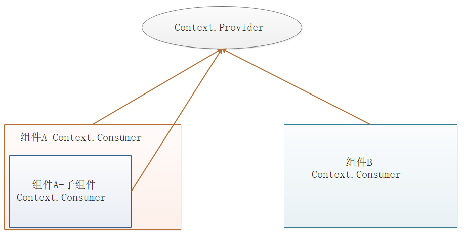

## 组件通信

### 1、父组件向子组件传值

**方式一**:  父组件将自己的状态传递给子组件，子组件当做属性来接收，当父组件更改自己状态的时候，子组件接收到的属性就会发生改变  

**方式二**:  在子组件中定义一个方法,接受一个形参, 在父组件中调用子组件的该方法,将数据传递给子组件,通过ref属性获取子组件的实例对象,进而调用子组件上的方法

注意: 使用ref 属性只能使用在类组件上,函数组件上不能使用ref属性,报错

### 2、子组件向父组件传值

在父组件中定义一个方法,该方法接受一个形参,父组件将该方法传递给子组件,子组件中调用父组件传递的方法,并将数据传给给方法.

### 3、跨组件通信（数据共享）

在react没有类似vue中的事件总线来解决这个问题。在实际的项目中，当需要组件间跨级访问信息时，如果还使用组件层层传递props，此时代码显得不那么优雅，甚至有些冗余。在react中，我们还可以使用context来实现**跨级父子组件间的通信**。

函数组件的 使用context 实现的跨组件通信相对简单些,后面讲到函数组件说.

~~~
import React, { Component, createContext } from "react"

const {
	Provider,
	Consumer
} = createContext()
~~~

提示：在React的context中，数据被看成了商品，发布数据的组件会用provider身份，接收数据的组件使用consumer身份。

- 创建Context对象

Context需要在父级或祖先级组件中使用,同时也需要在获取数据的子组件中使用, 所以需要将该对象定义成全局对象(即定义一个单独的js文件中), 然后在父级/祖先级 组件中引入,同时也在获取数据的子组件中引入.

~~~
// 定义全局context
// 由于这个操作后期可能被复用，建议独立文件去创建。此处以`src/Context/index.js`为例
import { createContext } from "react"
export default createContext() // createContext函数的的参数就是提供的默认值,如果后续没有给provider赋值value属性,那么 createContext({a:1,b:2,c:3});{a:1,b:2,c:3}就是value的默认值
~~~

- 发布消息

在App.jsx组件中发布消息，这样所有的组件都可以消费它的消息。

~~~
import React, { Component } from "react";
import Cmp1 from "./Components/Cmp1";
import Cmp2 from "./Components/Cmp2";
// 导入context对象
import ContextObj from "./Context/index";
let { Provider } = ContextObj;

class App extends Component {
    state = {
        count: 12345,
    };

    render() {
        return (
            

                {/* 将需要接受数据的子组件放到Provider组件内,否则子组件接受不到数据
                value 属性指定要传递的数据*/}
                <Provider value={this.state.count}>
                    <Cmp6></Cmp6>
                    <Cmp7></Cmp7>
                </Provider>
            

        );
    }
}

export default App;
~~~

+ 组件消费

在子组件中通过Api完成消费动作，从而实现消息通信。消费的方式有2种：

方式1：通过组件消费

~~~
import React, { Component } from "react";

import ContextObj from "../Context/index";
let { Consumer } = ContextObj;

class Cmp1 extends Component {
    render() {
        return (
            

                <Consumer>
                     {/* 注意:Consumer组件中只能是函数形式, */}
                    {(value) => {
                        return 
获取到的值是：{value}
;
                    }}
                </Consumer>
            

        );
    }
}

export default Cmp1;
~~~

方式2：通过绑定静态成员属性来消费

~~~
import React, { Component } from "react";
import ContextObj from "../Context/index";

class Cmp2 extends Component {
    static contextType = ContextObj; //contextType 是内置固定属性,不能修改
    render() {
         // this.context 就是共享的数据, 因为context在赋值给静态成员属性contextType时,做了一个属性映			射,将context内的context属性映射到组件实例上,所以如下就可以通过this.context获取对应的数据
        return 
{this.context}
;
    }
}

export default Cmp2;
~~~

### 4、兄弟组件间通信

这里我们采用自定义事件的方式来实现非嵌套组件间的通信。

我们需要使用一个 events 包：第三方的包不属于react全家桶的包

~~~
npm install events --save
~~~

新建一个 ev.js，引入 events 包，并向外提供一个事件对象，供通信时使用：

~~~
import { EventEmitter } from "events";
export default new EventEmitter();
~~~

父组件：

~~~
import React, { Component } from 'react';
import Child1 from "./Foo";
import Child2 from "./Boo";

export default class App extends Component{
    render(){
        return(
            

                <Child1 />
                <Child2 />
            

        );
    }
} 
~~~

Child1组件:

~~~
import React,{ Component } from "react";
import Bus from "./ev"
export default class Boo extends Component{
    emitFn = () => {
        // 触发 (自定义事件,传递的参数)   和vue一样
        Bus.emit("transfer",this.state.msg)
    }
    state={
        msg:'舒克'
    }
    render()
        return(
            

                 组件1
                <button onClick = {()=> this.emitFn() }>点击我</button>
            

        );
    }
}
~~~

Child2组件:

~~~
import React,{ Component } from "react";
import Bus from "./ev"
export default class Foo extends Component{
    getData = (msg) => {
         console.log(msg) // 这就是传递过来的参数
    }
    componentDidMount(){
        // 组价2 中接收组件1传过来的自定义事件
        Bus.on("transfer",this.getData);
    }
    render(){
        return(
            

                 组件2
            

        );
    }
}
~~~

自定义事件是典型的发布/订阅模式，通过向事件对象上添加监听器和触发事件来实现组件间通信。

## 高阶组件

Higher - Order Components：在原有组件基础之上**加工**后新生成得到的新组件。【高阶组件】

~~~
const NewComponent = HOC(YourComponent) 
~~~

通俗的来讲，`高阶组件`就相当于手机壳，通过包装组件，增强组件功能

### 自定义高阶组件

HOC实现步骤：

- 创建一个函数

- 指定函数参数，**参数应该以大写字母开头**

- 在函数内部创建一个类组件，提供**复用**的状态（如有）及逻辑代码，并返回

- 在该组件中，渲染参数组件，同时将状态通过prop传递给参数组件（可选，如有）

- 调用该高阶组件方法，传入要增强的组件，通过返回值拿到增强后的组件，并将其渲染到页面

比如，我们想要我们的组件通过自动注入一个版权信息：

~~~
// 如下结构和函数的组件结构很相似,所以可以使用rfc,创建一个函数组件然后在此基础上修改
import React, { Component, Fragment } from "react";
const withCopyright = (Cmp) => {
    return class Hoc extends Component {
        render() {
            return (
                <Fragment>
                    <Cmp></Cmp>
                    
&copy; 2020 千峰教育

                </Fragment>
            );
        }
    };
};

export default withCopyright;

// Fragment是一个伪标签，渲染的时候是不会显示在页面中的，因此也不会影响视图显示
// 此处注意:如果该Cmp 组件 在使用withCopyright 方法之前,是作为它的父组件下的子组件,并且接受了来组父组件和参数props,那么通过 withCopyright 方法,导致原先的父子组件变成了 爷孙组件,且孙组件无法接受爷组件的数据,此时了使用中间组件传递一下,而withCopyright 返回的组件就是中间组件 写法为:
<Fragment>
	<Cmp {...this.props}></Cmp>
	
&copy; 2020 千峰教育

</Fragment>
~~~

使用方式：

~~~
import React, { Component } from "react";
// 引入HOC函数
import Hoc from './Hoc/Hoc_copyright';

class App extends Component {
    render() {
        return (
            

                <h1>网站首页</h1>
            

        );
    }
}

export default Hoc(App);
~~~

这样只要我们有需要用到版权信息的组件，都可以直接使用withCopyright这个高阶组件包裹即可。

+ 常见应用场景

  1.需要代码重用时, react如果有多个组件都用到了`同一段逻辑`, 这时,就可以把共同的逻辑部分提取出来,利用高阶组件的形式将这段逻辑整合到每一个组件中, 从而减少代码的逻辑重复

  2.需要组件`增强优化时`, 比如我们在项目中使用的组件有些不是自己写的, 而是从网上撸下来的,但是`第三方`写的组件可能比较复杂, 有时不能完全满足需求, 但第三方组件不易修改, 此时也可以用高阶组件,在不修改原始组件的前提下, 对组件添加满足实际开发需求的功能

   3.可以对原有`组件`中的state, props和逻辑执行增删改操作, 一般用于代码`重用`和组件`增强优化`

### 内置高阶组件memo

React.memo 是一个高阶组件，接受一个组件作为参数返回一个新的组件。新的组件仅检查 props 变更，会将当前的 props 和 上一次的 props 进行浅层比较，相同则阻止渲染。

~~~
import React, { Component } from 'react'
import TestSun from './TestSun'

export default class Test extends Component {
 state={
    n:1
 }
 inc=()=>{
    this.setState({
        n:this.state.n+1
    })
 }
  render() {
    return (
      

           {this.state.n} <button onClick={this.inc}>+</button>
           <TestSun></TestSun>
      

    )
  }
}
可以看到子组件TestSun使用高阶组件memo后，不会是父组件渲染，它也会跟着渲染了
import React, { Component,memo } from 'react'

export default memo(class TestSun extends Component {
  render() {
    console.log("TestSun render")
    return (
      

        testSun
      

    )
  }
})

~~~

