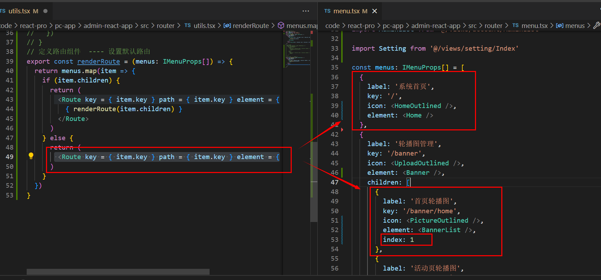
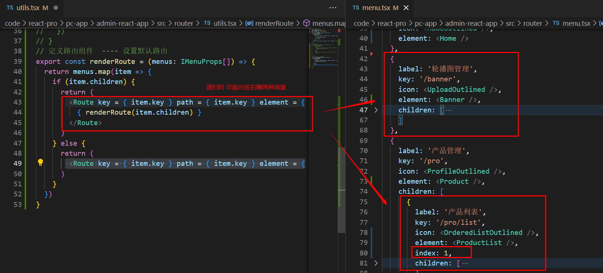
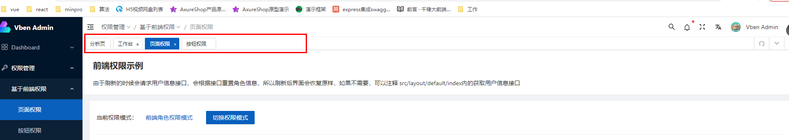
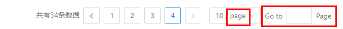
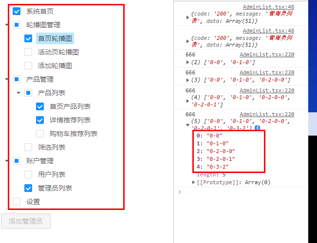
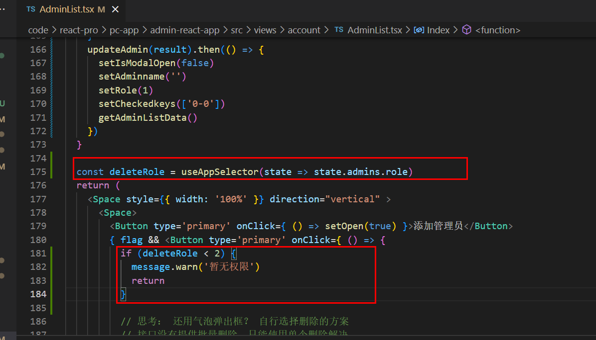

# react-pc

https://www.html.cn/create-react-app/

# 1.创建项目

```sh
# 现在
npx create-react-app admin-react-app --template typescript
```

**熟悉目录结构**

```
- admin-app
	-node_modules
	-public
	-src
		App.css
		App.test.tsx App.tsx的测试文件  npm run test 查看测试结果
		App.tsx
		index.css
		index.tsx react应用程序的入口文件
		logo.svg 
		react-app-env.d.ts // 声明文件 // 指令声明对包的依赖关系
		reportWebVitals.ts // 测试性能
		seupTests.ts // 使用jest做为测试工具
	.gitignore
	package-lock.json
	package.json
	README.md
	tsconfig.json
```

> *.d.ts 代表ts的声明文件

# 2.改造目录结构

```
src
	api
	components
	layout
	store
	router
	utils
	views
	App.tsx
	index.tsx
	logo.svg
	react-app-env.d.ts
	reportWebVitals.ts 
  seupTests.ts 
```

```tsx
// src/index.js
import React from 'react';
import ReactDOM from 'react-dom/client';
import './index.css';
import App from './App';
import reportWebVitals from './reportWebVitals';

const root = ReactDOM.createRoot(
  // document.getElementById('root') as HTMLElement
  document.getElementById('root') as HTMLDivElement // 缩小类型范围
);
root.render(
  <React.StrictMode>
    <App />
  </React.StrictMode>
);

reportWebVitals();

```

```tsx
// src/App.tsx
import React, { FC } from 'react';

interface IAppProps {
  
};

const App:FC<IAppProps> = () => {
  return (
    <div>
      App
    </div>
  )
};

export default App;
```

# 3.安装一些必须的模块

## 3.1 配置预处理器

两种方式：

* 抽离配置文件配置预处理器
* 不抽离配置文件craco进行预处理器配置

> 本项目推荐使用第二种方式

```sh
$ cnpm i @craco/craco @types/node -D
```

https://www.npmjs.com/package/@craco/craco

### 3.1.1 配置别名@

项目根目录创建 `craco.config.js`，代码如下：

```ts
// craco.config.js
const path = require('path')
module.exports = {
  webpack: {
    alias: {
      '@': path.resolve(__dirname, 'src')
    }
  }
}
```

为了使 TS 文件引入时的别名路径能够正常解析，需要配置 `tsconifg.json`，在 `compilerOptions`选项里添加 path 等属性。为了防止配置被覆盖，需要单独创建一个文件 `tsconfig.path.json`，添加以下代码

```json
// tsconfig.path.json
{
  "compilerOptions": {
    "baseUrl": ".",
    "paths": {
      "@/*": ["./src/*"]
    },
    "types": [
      "node"
    ]
  }
}
```

在 `tsconifg.json` 引入配置文件：

```json
// tsconfig.json
{
  "compilerOptions": {
    "target": "es5",
    "lib": [
      "dom",
      "dom.iterable",
      "esnext"
    ],
    "allowJs": true,
    "skipLibCheck": true,
    "esModuleInterop": true,
    "allowSyntheticDefaultImports": true,
    "strict": true,
    "forceConsistentCasingInFileNames": true,
    "noFallthroughCasesInSwitch": true,
    "module": "esnext",
    "moduleResolution": "node",
    "resolveJsonModule": true,
    "isolatedModules": true,
    "noEmit": true,
    "jsx": "react-jsx"
  },
  "extends": "./tsconfig.path.json",
  "include": [
    "src"
  ]
}
```

修改 `package.json` 如下：

```json
"scripts": {
  "start": "craco start",
  "build": "craco build",
  "test": "craco test"
},
```

```sh
$ npm run start
```

## 3.2安装状态管理器

根据项目需求 任选其一即可

```sh
$ cnpm i redux -S
$ cnpm i redux react-redux -S
$ cnpm i redux react-redux redux-thunk -S
$ cnpm i redux react-redux redux-saga -S
$ cnpm i redux react-redux redux-thunk immutable redux-immutable -S
$ cnpm i redux react-redux redux-saga immutable redux-immutable -S
$ cnpm i mobx mobx-react -S
```

>  本项目不采用之前的状态管理模式，使用 rtk 技术
>
>  ```
>  cnpm i @reduxjs/toolkit redux react-redux redux-devtools -S
>  ```

## 3.3 路由

2021年11月4日 发布了 react-router-dom的v6.0.0版本：https://reactrouter.com/

如需使用v5版本：https://v5.reactrouter.com/web/guides/quick-start `cnpm i react-router-dom@5 -S`

> 本项目采用 V6版本

```
cnpm i react-router-dom -S
```

## 3.4 数据验证

> 思考，有没有必要安装 prop-types ?

```
cnpm i prop-types -S
```

> 本项目其实没有必要安装，因为所有的数据都是基于ts，而ts需要指定类型注解

## 3.5数据请求

```
cnpm i axios -S
```

> 以前版本中 cnpm i @types/axios -S
>
> Ts 中 @types/* 为声明文件

## 3.6ui库

官网地址：https://ant.design/index-cn 4.22.2

国内官方镜像地址：https://ant-design.antgroup.com/index-cn

国内gitee镜像地址：https://ant-design.gitee.io/index-cn

```
cnpm i antd -S
```

`src/index.css`

```css
/* src/index.css */
@import '~antd/dist/antd.css';
```

`src/index.tsx`

```tsx
// src/index.js
import React from 'react';
import ReactDOM from 'react-dom/client';
import './index.css';
import App from './App';
import reportWebVitals from './reportWebVitals';

const root = ReactDOM.createRoot(
  document.getElementById('root') as HTMLDivElement
);
root.render(
  <React.StrictMode>
    <App />
  </React.StrictMode>
);

reportWebVitals();

```

测试组件库

```tsx
// src/App.tsx
import React, { FC } from 'react';
import { Button } from 'antd'
interface IAppProps {
  
};

const App:FC<IAppProps> = () => {
  return (
    <div>
      App 
      <Button type="primary" danger>
        Primary
      </Button>
    </div>
  )
};

export default App;
```

> 浏览器查看发现测试通过

### 3.6.1 自定义主题

https://ant-design.antgroup.com/docs/react/use-in-typescript-cn

按照 [配置主题](https://ant-design.antgroup.com/docs/react/customize-theme-cn) 的要求，自定义主题需要用到类似 [less-loader](https://github.com/webpack-contrib/less-loader/) 提供的 less 变量覆盖功能。我们可以引入 [craco-antd](https://github.com/DocSpring/craco-antd)  或者是 `craco-less`来帮助加载 less 样式和修改变量。

```sh
$ cnpm i craco-antd -D
$ cnpm i craco-less -D
```

首先把 `src/index.css` 文件修改为 `src/index.less`，然后修改样式引用为 less 文件。

修改 `craco.config.js`如下：

```ts
// craco.config.js
const CracoAntDesignPlugin = require('craco-antd'); // 推荐ts中写法
// const CracoLessPlugin = require('craco-less'); // js以及ts写法

const path = require('path')
module.exports = {
  webpack: {
    alias: {
      '@': path.resolve(__dirname, 'src')
    }
  },
  plugins: [
    {
      plugin: CracoAntDesignPlugin,
      options: {
        customizeTheme: {
          '@primary-color': '#1DA57A',
        },
      },
    },
  ]
  // plugins: [
  //   {
  //     plugin: CracoLessPlugin,
  //     options: {
  //       lessLoaderOptions: {
  //         lessOptions: {
  //           modifyVars: { '@primary-color': '#1DA57A' },
  //           javascriptEnabled: true,
  //         },
  //       },
  //     },
  //   },
  // ],
}

```

这里利用了 [less-loader](https://github.com/webpack/less-loader#less-options) 的 `modifyVars` 来进行主题配置，变量和其他配置方式可以参考 [配置主题](https://ant-design.antgroup.com/docs/react/customize-theme-cn) 文档。修改后重启 `yarn start`，如果看到一个绿色的按钮就说明配置成功了。

antd 内建了深色主题和紧凑主题，你可以参照 [使用暗色主题和紧凑主题](https://ant-design.antgroup.com/docs/react/customize-theme-cn#使用暗色主题和紧凑主题) 进行接入。

可以定制的变量列表如下：

```scss
@primary-color: #1890ff; // 全局主色
@link-color: #1890ff; // 链接色
@success-color: #52c41a; // 成功色
@warning-color: #faad14; // 警告色
@error-color: #f5222d; // 错误色
@font-size-base: 14px; // 主字号
@heading-color: rgba(0, 0, 0, 0.85); // 标题色
@text-color: rgba(0, 0, 0, 0.65); // 主文本色
@text-color-secondary: rgba(0, 0, 0, 0.45); // 次文本色
@disabled-color: rgba(0, 0, 0, 0.25); // 失效色
@border-radius-base: 2px; // 组件/浮层圆角
@border-color-base: #d9d9d9; // 边框色
@box-shadow-base: 0 3px 6px -4px rgba(0, 0, 0, 0.12), 0 6px 16px 0 rgba(0, 0, 0, 0.08),
  0 9px 28px 8px rgba(0, 0, 0, 0.05); // 浮层阴影
```

完整的配置如下：

```js
// craco.config.js
const CracoAntDesignPlugin = require('craco-antd'); // 推荐ts中写法
// const CracoLessPlugin = require('craco-less'); // js以及ts写法

const path = require('path')
module.exports = {
  webpack: {
    alias: {
      '@': path.resolve(__dirname, 'src')
    }
  },
  plugins: [
    {
      plugin: CracoAntDesignPlugin,
      options: {
        customizeTheme: {
          '@primary-color': '#1890ff', // 全局主色
          '@link-color': '#1890ff', // 链接色
          '@success-color': '#52c41a', // 成功色
          '@warning-color': '#faad14', // 警告色
          '@error-color': '#f5222d', // 错误色
          '@font-size-base': '14px', // 主字号
          '@heading-color': 'rgba(0, 0, 0, 0.85)', // 标题色
          '@text-color': 'rgba(0, 0, 0, 0.65)', // 主文本色
          '@text-color-secondary': 'rgba(0, 0, 0, 0.45)', // 次文本色
          '@disabled-color': 'rgba(0, 0, 0, 0.25)', // 失效色
          '@border-radius-base': '2px', // 组件/浮层圆角
          '@border-color-base': '#d9d9d9', // 边框色
          '@box-shadow-base': '0 3px 6px -4px rgba(0, 0, 0, 0.12), 0 6px 16px 0 rgba(0, 0, 0, 0.08), 0 9px 28px 8px rgba(0, 0, 0, 0.05)' // 浮层阴影
        },
      },
    },
  ]
  // plugins: [
  //   {
  //     plugin: CracoLessPlugin,
  //     options: {
  //       lessLoaderOptions: {
  //         lessOptions: {
  //           modifyVars: { '@primary-color': '#1DA57A' },
  //           javascriptEnabled: true,
  //         },
  //       },
  //     },
  //   },
  // ],
}

```

> 同样，你可以使用 [react-app-rewired](https://github.com/timarney/react-app-rewired) 和 [customize-cra](https://github.com/arackaf/customize-cra) 来自定义 create-react-app 的 webpack 配置。

## 3.7其他第三方工具包

https://www.lodashjs.com/

Lodash 工具包，项目必装，它提供了很多使用的函数

```
$ cnpm i lodash -S
$ cnpm i @types/lodash -D
```

```js
import _ from 'lodash'

var users = [
  { 'user': 'barney',  'active': false },
  { 'user': 'fred',    'active': false },
  { 'user': 'pebbles', 'active': true }
];

console.log(_.findIndex(users, (item) => item.user === 'pebbles'))
console.log(users.findIndex((item) => item.user === 'pebbles'))
```


# 4.创建主布局文件

预览模板：https://pro.ant.design/zh-CN/

> src/layout/Index.tsx 作为后台管理系统的主页面布局(包含左侧的菜单栏，顶部，底部等)

https://ant-design.gitee.io/components/layout-cn/#components-layout-demo-custom-trigger

> 不要照着代码敲，直接复制即可，给 Layout 组件添加 id为`admin-app`

```tsx
// src/layout/Index.tsx 主要的布局文件
import {
  MenuFoldOutlined,
  MenuUnfoldOutlined,
  UploadOutlined,
  UserOutlined,
  VideoCameraOutlined,
} from '@ant-design/icons';
import { Layout, Menu } from 'antd';
import React, { useState } from 'react';

const { Header, Sider, Content } = Layout;

const App: React.FC = () => {
  const [collapsed, setCollapsed] = useState(false);

  return (
    <Layout id='admin-app'>
      <Sider trigger={null} collapsible collapsed={collapsed}>
        <div className="logo" />
        <Menu
          theme="dark"
          mode="inline"
          defaultSelectedKeys={['1']}
          items={[
            {
              key: '1',
              icon: <UserOutlined />,
              label: 'nav 1',
            },
            {
              key: '2',
              icon: <VideoCameraOutlined />,
              label: 'nav 2',
            },
            {
              key: '3',
              icon: <UploadOutlined />,
              label: 'nav 3',
            },
          ]}
        />
      </Sider>
      <Layout className="site-layout">
        <Header className="site-layout-background" style={{ padding: 0 }}>
          {React.createElement(collapsed ? MenuUnfoldOutlined : MenuFoldOutlined, {
            className: 'trigger',
            onClick: () => setCollapsed(!collapsed),
          })}
        </Header>
        <Content
          className="site-layout-background"
          style={{
            margin: '24px 16px',
            padding: 24,
            minHeight: 280,
          }}
        >
          Content
        </Content>
      </Layout>
    </Layout>
  );
};

export default App;
```

> 主组件引入 主界面的布局文件

```tsx
// src/App.tsx
import { FC } from "react";
import Index from './layout/Index'

type AppProps = {}

const App: FC = (props: AppProps) => (
  <>
    <Index />
  </>
);

export default App
```

> 查看浏览器，预览运行结果

> 发现页面并不是全屏。审查元素设置 root以及 components-layout-demo-custom-trigger 高度为 100%

```css
/* src/index.css */
@import '~antd/dist/antd.less';

// 设置全屏  --- 审查元素 一层一层找 坚决不放过任何一个遗漏的
html, body, #root {
  height: 100%;
}

#admin-app {
  height: 100%;
}
// 布局文件
// #components-layout-demo-custom-trigger .trigger {  // 组件库提供案例id，改成自己的
#admin-app .trigger {
  padding: 0 24px;
  font-size: 18px;
  line-height: 64px;
  cursor: pointer;
  transition: color 0.3s;
}
// #components-layout-demo-custom-trigger .trigger:hover 
#admin-app .trigger:hover {
  color: #1890ff;
}

// #components-layout-demo-custom-trigger .logo {
#admin-app .logo {
  height: 32px;
  margin: 16px;
  background: rgba(255, 255, 255, 0.3);
}

.site-layout .site-layout-background {
  background: #fff;
}

```

# 5.拆分主界面

> 先拆分左侧的菜单栏组件

```tsx
// src/layout/components/SideBar.tsx 左侧菜单栏
import React, { FC, useState } from 'react';
import {
  UploadOutlined,
  UserOutlined,
  VideoCameraOutlined,
} from '@ant-design/icons';
import { Layout, Menu } from 'antd';
interface ISideBarProps {
  
};

const { Sider } = Layout;
const SideBar:FC<ISideBarProps> = () => {
  const [collapsed] = useState(false);
  return (
    <Sider trigger={null} collapsible collapsed={collapsed}>
      <div className="logo" />
      <Menu
        theme="dark"
        mode="inline"
        defaultSelectedKeys={['1']}
        items={[
          {
            key: '1',
            icon: <UserOutlined />,
            label: 'nav 1',
          },
          {
            key: '2',
            icon: <VideoCameraOutlined />,
            label: 'nav 2',
          },
          {
            key: '3',
            icon: <UploadOutlined />,
            label: 'nav 3',
          },
        ]}
      />
    </Sider>
  )
};

export default SideBar;
```

```tsx
// src/layout/components/AppHeader.tsx 头部组件
import React, { FC, useState } from 'react';
import {
  MenuFoldOutlined,
  MenuUnfoldOutlined
} from '@ant-design/icons';
import { Layout } from 'antd';
const { Header } = Layout;
interface IAppHeaderProps {
  
};

const AppHeader:FC<IAppHeaderProps> = () => {
  const [collapsed, setCollapsed] = useState(false);
  return (
    <Header className="site-layout-background" style={{ padding: 0 }}>
      {React.createElement(collapsed ? MenuUnfoldOutlined : MenuFoldOutlined, {
        className: 'trigger',
        onClick: () => setCollapsed(!collapsed),
      })}
    </Header>
  )
};

export default AppHeader;
```

```tsx
// src/layout/components/AppMain.tsx 内容区域
import React, { FC } from 'react';
import { Layout } from 'antd';
interface IAppMainProps {
  
};
const { Content } = Layout;
const AppMain:FC<IAppMainProps> = () => {
  return (
    <Content
      className="site-layout-background"
      style={{
        margin: '24px 16px',
        padding: 24,
        minHeight: 280,
      }}
    >
      Content
    </Content>
  )
};

export default AppMain;
```

整和组件资源

```ts
// src/layout/components/index.ts
export { default as SideBar } from './SideBar'
export { default as AppHeader } from './AppHeader'
export { default as AppMain } from './AppMain'
```

```tsx
// src/layout/Index.tsx 主要的布局文件
import { Layout } from 'antd';
import React  from 'react';

import { AppHeader, AppMain, SideBar } from './components'

const App: React.FC = () => {
  return (
    <Layout id='admin-app'>
      {/* 左侧菜单栏 */}
      <SideBar />
      <Layout className="site-layout">
        {/* 头部 */}
        <AppHeader />
        {/* 内容 */}
        <AppMain />
      </Layout>
    </Layout>
  );
};

export default App;
```

> 此时点击头部的控制器，发现只有头部组件的 图标在切换，但是并没有影响左侧菜单的收缩
>
> 建议使用状态管理器管理控制的这个状态

# 6.使用rtk来管理状态

http://cn.redux.js.org/

参考链接：http://cn.redux.js.org/tutorials/typescript-quick-start

## 6.1 定义State和Dispatch类型

```ts
// src/store/index.ts
import { configureStore } from '@reduxjs/toolkit';

const store = configureStore({
  reducer: { // 整合模块

  }
});

// redux store  store.getState  store.subscribe  store.dispatch
// 定义State和dispatch类型  从 store 本身推断出 `RootState` 和 `AppDispatch` 类型
export type RootState = ReturnType<typeof store.getState>
export type AppDispatch = typeof store.dispatch


export default store;
```

> 构建app的模块用于管理 头部和 左侧菜单的共同的状态

## 6.2 定义 Hooks 类型

虽然可以将`RootState`and`AppDispatch`类型导入到每个组件中，但**最好创建`useDispatch`and `useSelector`hooks 的类型化版本以在您的应用程序中使用**。

```ts
// src/store/hook.ts 自定义useSelector 以及 useDispatch 避免后续组件使用时需要单独引入每一次 js不需要
import { useSelector, useDispatch, TypedUseSelectorHook } from 'react-redux'
import { AppDispatch, RootState } from './index'

// 在整个应用程序中使用，而不是简单的 `useDispatch` 和 `useSelector`
export const useAppDispatch: () => AppDispatch = useDispatch // () => AppDispatch 代表返回的是一个函数
export const useAppSelector: TypedUseSelectorHook<RootState> = useSelector // TypedUseSelectorHook<RootState> 类型注解
// 以后组件中不要再单独使用 useSelector, useDispatch，使用useAppSelector 以及useAppDispatch 代替
```

## 6.3 应用程序中使用

> 创建状态管理

```ts
// src/store/modules/app.ts
import { createSlice, PayloadAction } from '@reduxjs/toolkit' // PayloadAction 添加类型注解需要 js中不需要

interface IState { // js不需要
  count: number
  collapsed: boolean
}
const initialState: IState = { // IState js不要
  count: 100,
  collapsed: false
}
// 固定写法,定义模块，无法直接被使用，需要暴露相关的内容
const appSlice = createSlice({
  name: 'app', // 模块名称
  initialState, // 初始化状态
  reducers: { // 修改状态的方法
    addCount (state, action: PayloadAction<number>) {
     state.count += action.payload 
    },
    setCollapsed (state, action: PayloadAction<boolean>) { // js不需要
      // 修改状态
      state.collapsed = action.payload
    }
  }
})

// console.log(appSlice)
// appSlice { reducer: '需要的状态', actions: '改变状态函数', caseReducers: '类似actions', getInitialState: '获取初始化状态', name: '模块名称'}

// 暴露后续组件中可以修改状态的函数
export const { addCount, setCollapsed } = appSlice.actions // appSlice.actions 实际上就是 上面模块 reducers内的函数

// 默认暴露出去 模块的reducer
export default appSlice.reducer
```

## 6.4 整合reducer

```ts
// src/store/index.ts
import { configureStore } from '@reduxjs/toolkit';
import appReducer from './modules/app'
const store = configureStore({
  reducer: { // 整合模块
    app: appReducer
  }
});

// redux store  store.getState  store.subscribe  store.dispatch
// 定义State和dispatch类型  从 store 本身推断出 `RootState` 和 `AppDispatch` 类型
export type RootState = ReturnType<typeof store.getState> // js 不需要
export type AppDispatch = typeof store.dispatch // js 不需要


export default store;
```

## 6.5 入口文件配置状态管理器

```tsx
// src/index.js
import React from 'react';
import ReactDOM from 'react-dom/client';
import { Provider } from 'react-redux';
import store from '@/store'
import '@/index.less';
import App from '@/App';
import reportWebVitals from '@/reportWebVitals';

const root = ReactDOM.createRoot(
  document.getElementById('root') as HTMLDivElement
);
root.render(
  <React.StrictMode>
    <Provider store = { store }>
      <App />
    </Provider>
  </React.StrictMode>
);

reportWebVitals();

```

## 6.6 左侧菜单栏使用状态管理器

```tsx
// src/layout/components/SideBar.tsx 左侧菜单栏
import React, { FC } from 'react';
import {
  UploadOutlined,
  UserOutlined,
  VideoCameraOutlined,
} from '@ant-design/icons';
import { Layout, Menu } from 'antd';
// import { useSelector } from 'react-redux';
// import { RootState } from '@/store';
import { useAppSelector } from '@/store/hook';
interface ISideBarProps {
  
};

const { Sider } = Layout;
const SideBar:FC<ISideBarProps> = () => {
  // const [collapsed] = useState(false);

  // const collapsed = useSelector(state => state.app.collapsed); // js中的写法
  // const collapsed = useSelector((state: RootState) => state.app.collapsed); // ts中的写法,组件引入类型，冗余度会高
  const collapsed = useAppSelector(state => state.app.collapsed); // ts推荐写法

  return (
    <Sider trigger={null} collapsible collapsed={collapsed}>
      <div className="logo" />
      <Menu
        theme="dark"
        mode="inline"
        defaultSelectedKeys={['1']}
        items={[
          {
            key: '1',
            icon: <UserOutlined />,
            label: 'nav 1',
          },
          {
            key: '2',
            icon: <VideoCameraOutlined />,
            label: 'nav 2',
          },
          {
            key: '3',
            icon: <UploadOutlined />,
            label: 'nav 3',
          },
        ]}
      />
    </Sider>
  )
};

export default SideBar;
```

## 6.7 头部组件使用状态管理器

```tsx
// src/layout/components/AppHeader.tsx 头部组件
import React, { FC } from 'react';
import {
  MenuFoldOutlined,
  MenuUnfoldOutlined
} from '@ant-design/icons';
import { Layout } from 'antd';
import { useAppDispatch, useAppSelector } from '@/store/hook';
import { setCollapsed } from '@/store/modules/app'
// import { useDispatch } from 'react-redux';
// import { AppDispatch } from '@/store';
const { Header } = Layout;
interface IAppHeaderProps {
};

const AppHeader:FC<IAppHeaderProps> = () => {
  // const [collapsed, setCollapsed] = useState(false);

  const collapsed = useAppSelector(state => state.app.collapsed)

  // const dispatch: AppDispatch = useDispatch() // ts中添加类型注解
  const dispatch = useAppDispatch() // ts推荐写法
  
  return (
    <Header className="site-layout-background" style={{ padding: 0 }}>
      {/* {React.createElement(collapsed ? MenuUnfoldOutlined : MenuFoldOutlined, {
        className: 'trigger',
        onClick: () => {
          dispatch(setCollapsed(!collapsed))
        }
      })} */}
      {
        collapsed ? <MenuUnfoldOutlined  className="trigger" onClick={ () => {
          dispatch(setCollapsed(!collapsed))
        }}/> : <MenuFoldOutlined  className="trigger" onClick={ () => {
          dispatch(setCollapsed(!collapsed))
        }}/>
      }
    </Header>
  )
};

export default AppHeader;
```

## 6.8保留用户习惯-可选

永久存储 用户习惯

此时发现 头部的 按钮可以控制左侧菜单栏了，但是还没有满足需求

需求如下：保留用户的使用习惯

```tsx
// src/store/modules/app.ts
import { createSlice, PayloadAction } from '@reduxjs/toolkit' // PayloadAction 添加类型注解需要 js中不需要

interface IState { // js不需要
  count: number
  collapsed: boolean
}
const initialState: IState = { // IState js不要
  count: 100,
  // collapsed: false // 每次一样
  collapsed: localStorage.getItem('collapsed') === 'true' // 保留用户的使用习惯
}
// 固定写法,定义模块，无法直接被使用，需要暴露相关的内容
const appSlice = createSlice({
  name: 'app', // 模块名称
  initialState, // 初始化状态
  reducers: { // 修改状态的方法
    addCount (state, action: PayloadAction<number>) {
     state.count += action.payload 
    },
    setCollapsed (state, action: PayloadAction<boolean>) { // js不需要
      // 修改状态
      // 保存到本地
      localStorage.setItem('collapsed', String(action.payload)) // 保留用户的使用习惯
      state.collapsed = action.payload
    }
  }
})

// console.log(appSlice)
// appSlice { reducer: '需要的状态', actions: '改变状态函数', caseReducers: '类似actions', getInitialState: '获取初始化状态', name: '模块名称'}

// 暴露后续组件中可以修改状态的函数
export const { addCount, setCollapsed } = appSlice.actions // appSlice.actions 实际上就是 上面模块 reducers内的函数

// 默认暴露出去 模块的reducer
export default appSlice.reducer
```

## 6.9 永久存储的 类 localStorage 的工具 store2

```sh
$ cnpm i store2 -S
```

https://www.npmjs.com/package/store2

推荐一个好用的永久存储的 类 localStorage 的工具 store2

```tsx
// src/store/modules/app.ts
import { createSlice, PayloadAction } from '@reduxjs/toolkit' // PayloadAction 添加类型注解需要 js中不需要
import store2 from 'store2'
interface IState { // js不需要
  count: number
  collapsed: boolean
}
const initialState: IState = { // IState js不要
  count: 100,
  // collapsed: false // 每次一样
  // collapsed: localStorage.getItem('collapsed') === 'true' // 保留用户的使用习惯
  collapsed: store2.get('collapsed') === 'true' // 保留用户的使用习惯
}
// 固定写法,定义模块，无法直接被使用，需要暴露相关的内容
const appSlice = createSlice({
  name: 'app', // 模块名称
  initialState, // 初始化状态
  reducers: { // 修改状态的方法
    addCount (state, action: PayloadAction<number>) {
     state.count += action.payload 
    },
    setCollapsed (state, action: PayloadAction<boolean>) { // js不需要
      // 修改状态
      // 保存到本地
      // localStorage.setItem('collapsed', String(action.payload)) // 保留用户的使用习惯
      store2.set('collapsed', String(action.payload))
      state.collapsed = action.payload
    }
  }
})

// console.log(appSlice)
// appSlice { reducer: '需要的状态', actions: '改变状态函数', caseReducers: '类似actions', getInitialState: '获取初始化状态', name: '模块名称'}

// 暴露后续组件中可以修改状态的函数
export const { addCount, setCollapsed } = appSlice.actions // appSlice.actions 实际上就是 上面模块 reducers内的函数

// 默认暴露出去 模块的reducer
export default appSlice.reducer
```


# 7.左侧菜单栏

## 7.1.设计左侧菜单栏的数据

https://ant-design.gitee.io/components/menu-cn/#components-menu-demo-sider-current

> Antd 4.20以上版本直接实现 递归
>
> antd 4.20版本以下需要手动实现

```ts
// src/router/inter.d.ts
import { ReactNode } from 'react'

// key属性可以使用 左侧菜单的路由地址，因为它具有唯一性
export interface IMenuProps {
  label: string
  key: string
  icon?: ReactNode
  children?: IMenuProps[]
}
```

```ts
// src/router/menu.tsx
import { IMenuProps } from './inter'
import {
  HomeOutlined,
  UploadOutlined,
  PictureOutlined,
  ProfileOutlined,
  OrderedListOutlined,
  FilterOutlined,
  TeamOutlined,
  UserOutlined,
  SettingOutlined
} from '@ant-design/icons'
const menus: IMenuProps[] = [
  {
    label: '系统首页',
    key: '/',
    icon: <HomeOutlined />
  },
  // {
  //   label: '轮播图管理',
  //   key: '/banner',
  //   icon: <UploadOutlined />,
  //   children: [
  //     {
  //       label: '首页轮播图',
  //       key: '/banner/home',
  //       icon: <PictureOutlined />,
  //       children: [
  //         {
  //           label: '轮播图列表',
  //           key: '/banner/home/list',
  //           icon: <PictureOutlined />
  //         },
  //         {
  //           label: '添加轮播图',
  //           key: '/banner/home/add',
  //           icon: <UploadOutlined />
  //         }
  //       ]
  //     },
  //     {
  //       label: '活动页轮播图',
  //       key: '/banner/active',
  //       icon: <PictureOutlined />,
  //       children: [
  //         {
  //           label: '轮播图列表',
  //           key: '/banner/home/list',
  //           icon: <PictureOutlined />
  //         },
  //         {
  //           label: '添加轮播图',
  //           key: '/banner/home/add',
  //           icon: <UploadOutlined />
  //         }
  //       ]
  //     },
      
  //   ]
  // }
  {
    label: '轮播图管理',
    key: '/banner',
    icon: <UploadOutlined />,
    children: [
      {
        label: '首页轮播图',
        key: '/banner/home',
        icon: <PictureOutlined />
      },
      {
        label: '活动页轮播图',
        key: '/banner/active',
        icon: <PictureOutlined />
      },
      {
        label: '添加轮播图',
        key: '/banner/add',
        icon: <UploadOutlined />
      },
    ]
  },
  {
    label: '产品管理',
    key: '/pro',
    icon: <ProfileOutlined />,
    children: [
      {
        label: '产品列表',
        key: '/pro/list',
        icon: <OrderedListOutlined /> ,
        children: [
          {
            label: '首页产品列表',
            key: '/pro/list/home'
          },
          {
            label: '详情推荐列表',
            key: '/pro/list/detail'
          },
          {
            label: '购物车推荐列表',
            key: '/pro/list/cart'
          },
        ]
      },
      {
        label: '筛选列表',
        key: '/pro/search',
        icon: <FilterOutlined />
      },
    ]
  },
  {
    label: '账户管理',
    key: '/account',
    icon: <TeamOutlined />,
    children: [
      {
        label: '用户列表',
        key: '/account/userlist',
        icon: <UserOutlined />
      },
      {
        label: '管理员列表',
        key: '/account/adminlist',
        icon: <UserOutlined />
      }
    ]
  },
  {
    label: '设置',
    key: '/setting',
    icon: <SettingOutlined />
  }
]


export default menus
```

## 7.2.渲染左侧菜单栏

左侧菜单栏的头部设定logo以及后台管理系统名称

```tsx
// src/layout/components/SideBar.tsx 左侧菜单栏
import React, { FC } from 'react';

import { Layout, Menu, Image } from 'antd';
import { useAppSelector } from '@/store/hook';
import menus from '@/router/menu'
import logo from '@/logo.svg'
interface ISideBarProps {
  
};

const { Sider } = Layout;
const SideBar:FC<ISideBarProps> = () => {
  const collapsed = useAppSelector(state => state.app.collapsed); 

  return (
    <Sider trigger={null} collapsible collapsed={collapsed}>
      <div className="logo" style={ { 
        display: 'flex', 
        justifyContent: 'center', 
        alignItems: 'center',
        color: '#fff'
      }}>
        <Image src = { logo } width="28px" height="28px" preview={ false }></Image>
        { !collapsed && <div style={{
          height: '32px', 
          overflow: 'hidden', 
          lineHeight: '32px'
        }}>嗨购后台管理系统</div> }
      </div>
      <Menu
        theme="dark"
        mode="inline"
        defaultSelectedKeys={['1']}
        items={ menus }
      />
    </Sider>
  )
};

export default SideBar;
```

##  7.3 低版本处理

以上菜单项的设置在`antd 4.20.0`版本以上好使，如果在`4.20.0`版本以下，应该使用 递归组件实现

```tsx
// src/layout/components/SideBar.tsx 左侧菜单栏
import React, { FC } from 'react';

import { Layout, Menu, Image } from 'antd';
import { useAppSelector } from '@/store/hook';
import menus from '@/router/menu'
import logo from '@/logo.svg'
import { IMenuProps } from '@/router/inter';
interface ISideBarProps {
  
};

const { Sider } = Layout;

const renderMenu = (menus: IMenuProps[]) => {
  return menus.map(item => {
    if (item.children) {
      return (
        <Menu.SubMenu title = { item.label } icon = { item.icon } key = { item.key }>
          {
            renderMenu(item.children)
          }
        </Menu.SubMenu>
      )
    } else {
      return <Menu.Item key = { item.key } icon = { item.icon }>{ item.label }</Menu.Item>
    }
  })
}

const SideBar:FC<ISideBarProps> = () => {
  const collapsed = useAppSelector(state => state.app.collapsed); 

  return (
    <Sider trigger={null} collapsible collapsed={collapsed}>
      <div className="logo" style={ { 
        display: 'flex', 
        justifyContent: 'center', 
        alignItems: 'center',
        color: '#fff'
      }}>
        <Image src = { logo } width="28px" height="28px" preview={ false }></Image>
        { !collapsed && <div style={{
          height: '32px', 
          overflow: 'hidden', 
          lineHeight: '32px'
        }}>嗨购后台管理系统</div> }
      </div>
      <Menu
        theme="dark"
        mode="inline"
        defaultSelectedKeys={['1']}
      >
        {
          renderMenu(menus)
        }
      </Menu>
    </Sider>
  )
};

export default SideBar;
```

优化：

```
// src/router/utils.tsx

import { Menu } from 'antd';
import { IMenuProps } from './inter';
export const renderMenu = (menus: IMenuProps[]) => {
  return menus.map(item => {
    if (item.children) {
      return (
        <Menu.SubMenu title = { item.label } icon = { item.icon } key = { item.key }>
          {
            renderMenu(item.children)
          }
        </Menu.SubMenu>
      )
    } else {
      return <Menu.Item key = { item.key } icon = { item.icon }>{ item.label }</Menu.Item>
    }
  })
}
```

```tsx
// src/layout/components/SideBar.tsx 左侧菜单栏
import React, { FC } from 'react';

import { Layout, Menu, Image } from 'antd';
import { useAppSelector } from '@/store/hook';
import menus from '@/router/menu'
import logo from '@/logo.svg'
// import { IMenuProps } from '@/router/inter';
import { renderMenu } from '@/router/utils'
interface ISideBarProps {
  
};

const { Sider } = Layout;

// antd 4.20.0版本以下，递归生成菜单项
// 建议可以把这个代码放到另一个模块中
// const renderMenu = (menus: IMenuProps[]) => {
//   return menus.map(item => {
//     if (item.children) {
//       return (
//         <Menu.SubMenu title = { item.label } icon = { item.icon } key = { item.key }>
//           {
//             renderMenu(item.children)
//           }
//         </Menu.SubMenu>
//       )
//     } else {
//       return <Menu.Item key = { item.key } icon = { item.icon }>{ item.label }</Menu.Item>
//     }
//   })
// }

const SideBar:FC<ISideBarProps> = () => {
  const collapsed = useAppSelector(state => state.app.collapsed); 

  return (
    <Sider trigger={null} collapsible collapsed={collapsed}>
      <div className="logo" style={ { 
        display: 'flex', 
        justifyContent: 'center', 
        alignItems: 'center',
        color: '#fff'
      }}>
        <Image src = { logo } width="28px" height="28px" preview={ false }></Image>
        { !collapsed && <div style={{
          height: '32px', 
          overflow: 'hidden', 
          lineHeight: '32px'
        }}>嗨购后台管理系统</div> }
      </div>
      <Menu
        theme="dark"
        mode="inline"
        defaultSelectedKeys={['1']}
      >
        {
          renderMenu(menus)
        }
      </Menu>
    </Sider>
  )
};

export default SideBar;
```

## 7.4 菜单渲染优化

如果左侧菜单栏数据过于庞大，每个管理项里又有很多项，需要只展开一个菜单项

```tsx
// src/layout/components/SideBar.tsx 左侧菜单栏
import React, { FC, useState } from 'react';

import { Layout, Menu, Image, MenuProps } from 'antd';
import { useAppSelector } from '@/store/hook';
import menus from '@/router/menu'
import logo from '@/logo.svg'
// import { IMenuProps } from '@/router/inter';
import { renderMenu } from '@/router/utils'
interface ISideBarProps {
  
};

const { Sider } = Layout;

// antd 4.20.0版本以下，递归生成菜单项
// 建议可以把这个代码放到另一个模块中
// const renderMenu = (menus: IMenuProps[]) => {
//   return menus.map(item => {
//     if (item.children) {
//       return (
//         <Menu.SubMenu title = { item.label } icon = { item.icon } key = { item.key }>
//           {
//             renderMenu(item.children)
//           }
//         </Menu.SubMenu>
//       )
//     } else {
//       return <Menu.Item key = { item.key } icon = { item.icon }>{ item.label }</Menu.Item>
//     }
//   })
// }

// 设置只展开一个菜单项
const rootSubmenuKeys: string[] = [];
menus.forEach(item => {
  item.children && rootSubmenuKeys.push(item.key)
})
console.log(rootSubmenuKeys)

const SideBar:FC<ISideBarProps> = () => {
  const collapsed = useAppSelector(state => state.app.collapsed);
  
  
  // 展开哪一项数据
  const [openKeys, setOpenKeys] = useState<string[]>([])
  // 打开一个菜单项时，需要做判断 - SubMenu 展开/关闭的回调
  const onOpenChange: MenuProps['onOpenChange'] = keys => {
    // 如果当前展开项是 轮播图管理，再点击 账户管理 ['/banner', '/account']
    console.log('keys', keys) // ['/banner'] =>  ['/banner', '/account']
    console.log('openKeys', openKeys) // [] => ['/banner']
    // 得到当前
    const latestOpenKey = keys.find(key => openKeys.indexOf(key) === -1); 
    console.log('latestOpenKey', latestOpenKey) // /banner ===> /account
    if (rootSubmenuKeys.indexOf(latestOpenKey!) === -1) {
      setOpenKeys(keys);
    } else {
      setOpenKeys(latestOpenKey ? [latestOpenKey] : []);
    }
  }

  return (
    <Sider trigger={null} collapsible collapsed={collapsed}>
      <div className="logo" style={ { 
        display: 'flex', 
        justifyContent: 'center', 
        alignItems: 'center',
        color: '#fff'
      }}>
        <Image src = { logo } width="28px" height="28px" preview={ false }></Image>
        { !collapsed && <div style={{
          height: '32px', 
          overflow: 'hidden', 
          lineHeight: '32px'
        }}>嗨购后台管理系统</div> }
      </div>
      <Menu
        theme="dark"
        mode="inline"
        defaultSelectedKeys={['1']}
        openKeys = { openKeys } // 打开哪一个菜单项
        onOpenChange = { onOpenChange } // 打开某一个菜单项时需要关闭其他菜单项
      >
        {
          renderMenu(menus)
        }
      </Menu>
    </Sider>
  )
};

export default SideBar;
```

# 8.定义路由

##  8.1 官方文档

https://reactrouter.com/

## 8.2 创建对应的页面

```shell
|-src
|  |- ...
|  |-views
|    |- banner
|    |  |- Index.tsx    #轮播图管理页面
|    |  |- List.tsx     #首页轮播图
|    |  |- Active.tsx   #活动页轮播图
|	 |  |- Add.tsx		#添加轮播图
|	 |- home
|    |  |- Index.tsx	#系统首页
|    |- product
|    |  |- Index.tsx 	#产品管理
|    |  |- Search.tsx 	#筛选列表
|    |  |- list
|    |  |  |- Index.tsx #产品列表
|    |  |  |- Home.tsx  #首页产品列表
|    |  |  |- Detail.tsx#详情推荐列表
|    |  |  |- Cart.tsx  #购物车推荐列表
|    |- Account
|    |  |- Index.tsx	#账户管理
|    |  |- UserList.tsx #用户列表
|    |  |- AdminList.tsx#管理员列表
|    |- setting
|    |  |- Index.tsx    #设置页面
 	
```

```tsx
// src/views/account/Index.tsx
import React, { FC } from 'react';

interface IIndexProps {
  
};

const Index:FC<IIndexProps> = () => {
  return (
    <>
      <h1>账户管理</h1>
    </>
  )
};

export default Index;
```

```tsx
// src/views/account/UserList.tsx
import React, { FC } from 'react';

interface IIndexProps {
  
};

const Index:FC<IIndexProps> = () => {
  return (
    <>
      <h1>用户列表</h1>
    </>
  )
};

export default Index;
```

```tsx
// src/views/account/AdminList.tsx
import React, { FC } from 'react';

interface IIndexProps {
  
};

const Index:FC<IIndexProps> = () => {
  return (
    <>
      <h1>管理员列表</h1>
    </>
  )
};

export default Index;
```

```tsx
// src/views/banner/Index.tsx
import React, { FC } from 'react';

interface IIndexProps {
  
};

const Index:FC<IIndexProps> = () => {
  return (
    <>
      <h1>轮播图管理</h1>
    </>
  )
};

export default Index;
```

```tsx
// src/views/banner/List.tsx
import React, { FC } from 'react';

interface IIndexProps {
  
};

const Index:FC<IIndexProps> = () => {
  return (
    <>
      <h1>首页轮播图列表</h1>
    </>
  )
};

export default Index;
```

```tsx
// src/views/banner/Active.tsx
import React, { FC } from 'react';

interface IIndexProps {
  
};

const Index:FC<IIndexProps> = () => {
  return (
    <>
      <h1>活动页轮播图</h1>
    </>
  )
};

export default Index;
```

```tsx
// src/views/banner/Add.tsx
import React, { FC } from 'react';

interface IIndexProps {
  
};

const Index:FC<IIndexProps> = () => {
  return (
    <>
      <h1>添加轮播图</h1>
    </>
  )
};

export default Index;
```

```tsx
// src/views/home/Index.tsx
import React, { FC } from 'react';

interface IIndexProps {
  
};

const Index:FC<IIndexProps> = () => {
  return (
    <>
      <h1>系统首页</h1>
    </>
  )
};

export default Index;
```

```tsx
// src/views/Product/Index.tsx
import React, { FC } from 'react';

interface IIndexProps {
  
};

const Index:FC<IIndexProps> = () => {
  return (
    <>
      <h1>产品管理</h1>
    </>
  )
};

export default Index;
```

```tsx
// src/views/Product/Search.tsx
import React, { FC } from 'react';

interface IIndexProps {
  
};

const Index:FC<IIndexProps> = () => {
  return (
    <>
      <h1>筛选列表</h1>
    </>
  )
};

export default Index;
```

```tsx
// src/views/Product/list/Index.tsx
import React, { FC } from 'react';

interface IIndexProps {
  
};

const Index:FC<IIndexProps> = () => {
  return (
    <>
      <h1>产品列表</h1>
    </>
  )
};

export default Index;
```


```tsx
// src/views/Product/list/Home.tsx
import React, { FC } from 'react';

interface IIndexProps {
  
};

const Index:FC<IIndexProps> = () => {
  return (
    <>
      <h1>首页产品列表</h1>
    </>
  )
};

export default Index;
```

```tsx
// src/views/Product/list/Detail.tsx
import React, { FC } from 'react';

interface IIndexProps {
  
};

const Index:FC<IIndexProps> = () => {
  return (
    <>
      <h1>详情推荐列表</h1>
    </>
  )
};

export default Index;
```

```tsx
// src/views/Product/list/Cart.tsx
import React, { FC } from 'react';

interface IIndexProps {
  
};

const Index:FC<IIndexProps> = () => {
  return (
    <>
      <h1>购物车推荐列表</h1>
    </>
  )
};

export default Index;
```

```tsx
// src/views/setting/Index.tsx
import React, { FC } from 'react';

interface IIndexProps {
  
};

const Index:FC<IIndexProps> = () => {
  return (
    <>
      <h1>设置页面</h1>
    </>
  )
};

export default Index;
```

有二级菜单，能想到的 就是使用 嵌套路由

https://reactrouter.com/docs/en/v6/getting-started/overview#index-routes

## 8.3 定义菜单路由信息

v6的路由通过 element 属性定义匹配的组件

因此menus中可以添加一个 element 属性，值就为组件的引用即可

```ts
// src/router/inter.d.ts
import { ReactNode } from 'react'

// key属性可以使用 左侧菜单的路由地址，因为它具有唯一性
export interface IMenuProps {
  label: string
  key: string
  icon?: ReactNode
  children?: IMenuProps[]
  element: ReactNode // 因为页面创建时 指定了多级了路由的页面，故这里设置为 必传属性
}
```

```ts
// src/router/menu.tsx
import { IMenuProps } from './inter'
import {
  HomeOutlined,
  UploadOutlined,
  PictureOutlined,
  ProfileOutlined,
  OrderedListOutlined,
  FilterOutlined,
  TeamOutlined,
  UserOutlined,
  SettingOutlined
} from '@ant-design/icons'

import Home from '@/views/home/Index'

import Banner from '@/views/banner/Index'
import BannerList from '@/views/banner/List'
import BannerActive from '@/views/banner/Active'
import BannerAdd from '@/views/banner/Add'

import Product from '@/views/product/Index'
import ProductSearch from '@/views/product/Search'
import ProductList from '@/views/product/list/Index'
import ProductHomeList from '@/views/product/list/Home'
import ProductDetailList from '@/views/product/list/Detail'
import ProductCartList from '@/views/product/list/Cart'

import Account from '@/views/account/Index'
import UserList from '@/views/account/UserList'
import AdminList from '@/views/account/AdminList'

import Setting from '@/views/setting/Index'

const menus: IMenuProps[] = [
  {
    label: '系统首页',
    key: '/',
    icon: <HomeOutlined />,
    element: <Home />
  },
  {
    label: '轮播图管理',
    key: '/banner',
    icon: <UploadOutlined />,
    element: <Banner />,
    children: [
      {
        label: '首页轮播图',
        key: '/banner/home',
        icon: <PictureOutlined />,
        element: <BannerList />
      },
      {
        label: '活动页轮播图',
        key: '/banner/active',
        icon: <PictureOutlined />,
        element: <BannerActive />
      },
      {
        label: '添加轮播图',
        key: '/banner/add',
        icon: <UploadOutlined />,
        element: <BannerAdd />
      },
    ]
  },
  {
    label: '产品管理',
    key: '/pro',
    icon: <ProfileOutlined />,
    element: <Product />,
    children: [
      {
        label: '产品列表',
        key: '/pro/list',
        icon: <OrderedListOutlined />,
        element: <ProductList />,
        children: [
          {
            label: '首页产品列表',
            key: '/pro/list/home',
            element: <ProductHomeList />
          },
          {
            label: '详情推荐列表',
            key: '/pro/list/detail',
            element: <ProductDetailList />
          },
          {
            label: '购物车推荐列表',
            key: '/pro/list/cart',
            element: <ProductCartList />
          },
        ]
      },
      {
        label: '筛选列表',
        key: '/pro/search',
        icon: <FilterOutlined />,
        element: <ProductSearch />
      },
    ]
  },
  {
    label: '账户管理',
    key: '/account',
    icon: <TeamOutlined />,
    element: <Account />,
    children: [
      {
        label: '用户列表',
        key: '/account/userlist',
        icon: <UserOutlined />,
        element: <UserList />
      },
      {
        label: '管理员列表',
        key: '/account/adminlist',
        icon: <UserOutlined />,
        element: <AdminList />
      }
    ]
  },
  {
    label: '设置',
    key: '/setting',
    icon: <SettingOutlined />,
    element: <Setting />
  }
]


export default menus
```

## 8.4.装载路由

在根组件添加 `BrowserRouter` 或者 `HashRouter`

```tsx
// src/index.js
import React from 'react';
import ReactDOM from 'react-dom/client';
import { Provider } from 'react-redux';
import store from '@/store'
import '@/index.less';
import App from '@/App';
import reportWebVitals from '@/reportWebVitals';
import { BrowserRouter } from 'react-router-dom' // +++++

const root = ReactDOM.createRoot(
  document.getElementById('root') as HTMLDivElement
);
root.render(
  <React.StrictMode>
    <Provider store = { store }>
      <BrowserRouter >
        <App />
      </BrowserRouter>
    </Provider>
  </React.StrictMode>
);

reportWebVitals();

```

## 8.5 定义路由组件

在`menu.tsx`里已经定义好了请求的路径（其实就是数据中key属性）和路径对应组件（其实就是数据中的element属性）,剩下就是定义路由组件了

组件渲染的区域 `AppMain `组件

```tsx
// src/router/utils.tsx
import { Menu } from 'antd';
import { IMenuProps } from './inter';
import { Route } from 'react-router-dom'
// 定义左侧菜单栏数据
export const renderMenu = (menus: IMenuProps[]) => {
  return menus.map(item => {
    if (item.children) {
      return (
        <Menu.SubMenu title = { item.label } icon = { item.icon } key = { item.key }>
          {
            renderMenu(item.children)
          }
        </Menu.SubMenu>
      )
    } else {
      return <Menu.Item key = { item.key } icon = { item.icon }>{ item.label }</Menu.Item>
    }
  })
}
// 定义路由组件
export const renderRoute = (menus: IMenuProps[]) => {
  return menus.map(item => {
    if (item.children) {
      return (
        <Route key = { item.key } path = { item.key } element = { item.element }>
          { renderRoute(item.children) }
        </Route>
      )
    } else {
      return (
        <Route key = { item.key } path = { item.key } element = { item.element }>
        </Route>
      )
    }
  })
}
```


```tsx
// src/layout/components/AppMain.tsx 内容区域
import React, { FC } from 'react';
import { Layout } from 'antd';
import menus from '@/router/menu';
import { renderRoute } from '@/router/utils';
import { Routes } from 'react-router-dom'
interface IAppMainProps {
  
};
const { Content } = Layout;
const arr = renderRoute(menus)
console.log('arr', arr[1])
const AppMain:FC<IAppMainProps> = () => {
  return (
    <Content
      className="site-layout-background"
      style={{
        margin: '24px 16px',
        padding: 24,
        minHeight: 280,
      }}
    >
      {/* 
        多个路由需要定义时，包裹在Routes选项下
      */}
      <Routes>
        {
          renderRoute(menus)
        }
      </Routes>
    </Content>
  )
};

export default AppMain;
```

## 8.6 二级乃至三级菜单生效

二级菜单对应的二级路由要生效，需要给以及页面添加` <Outlet />` 标识

```tsx
// src/views/account/Index.tsx
import React, { FC } from 'react';
import { Outlet } from 'react-router-dom';

interface IIndexProps {
  
};

const Index:FC<IIndexProps> = () => {
  return (
    <>
      <h1>账户管理</h1>
      <Outlet />
    </>
  )
};

export default Index;
```

```tsx
// src/views/banner/Index.tsx
import React, { FC } from 'react';
import { Outlet } from 'react-router-dom';

interface IIndexProps {
  
};

const Index:FC<IIndexProps> = () => {
  return (
    <>
      <h1>轮播图管理</h1>
      <Outlet />
    </>
  )
};

export default Index;
```

```tsx
// src/views/Product/Index.tsx
import React, { FC } from 'react';
import { Outlet } from 'react-router-dom';

interface IIndexProps {
  
};

const Index:FC<IIndexProps> = () => {
  return (
    <>
      <h1>产品管理</h1>
      <Outlet />
    </>
  )
};

export default Index;
```

```tsx
// src/views/Product/Index.tsx
import React, { FC } from 'react';
import { Outlet } from 'react-router-dom';

interface IIndexProps {
  
};

const Index:FC<IIndexProps> = () => {
  return (
    <>
      <h1>产品列表</h1>
      <Outlet />
    </>
  )
};

export default Index;
```

## 8.7 手动测试路由

可以在地址栏输入路径，测试是否正常

```sh
http://localhost:3000/ 					#系统首页

http://localhost:3000/banner			#轮播图管理
http://localhost:3000/banner/home		#首页轮播图
http://localhost:3000/banner/active		#活动页轮播图
http://localhost:3000/banner/add		#添加轮播图

http://localhost:3000/pro				#产品管理
http://localhost:3000/pro/search		#筛选列表
http://localhost:3000/pro/list			#产品列表
http://localhost:3000/pro/list/home		#首页产品列表
http://localhost:3000/pro/list/detail	#详情推荐列表
http://localhost:3000/pro/list/cart		#购物车推荐列表

http://localhost:3000/account			#账户管理
http://localhost:3000/account/userlist	#用户列表
http://localhost:3000/account/adminlist	#管理员列表

http://localhost:3000/settinig			#设置 	

```

##  8.8 设置默认路由

参照 https://reactrouter.com/docs/en/v6/getting-started/overview#index-routes 学习默认路由

根据渲染需求，当路由包含一层或者多层子路由时，当选择父级路由时，希望能够自动跳转到某个子路由。也就是路由的重定向。

在路由表添加标记默认打开子路由

```tsx
// src/router/inter.d.ts
import { ReactNode } from 'react'

// key属性可以使用 左侧菜单的路由地址，因为它具有唯一性
export interface IMenuProps {
  label: string
  key: string
  icon?: ReactNode
  children?: IMenuProps[]
  element: ReactNode // 因为页面创建时 指定了多级了路由的页面，故这里设置为 必传属性
  index?: 1 | 0 // 不建议使用 boolean，因为react在渲染属性时，具有boolean值的属性会有特殊的含义
}
```

```tsx
// src/router/menu.tsx
import { IMenuProps } from './inter'
import {
  HomeOutlined,
  UploadOutlined,
  PictureOutlined,
  ProfileOutlined,
  OrderedListOutlined,
  FilterOutlined,
  TeamOutlined,
  UserOutlined,
  SettingOutlined
} from '@ant-design/icons'

import Home from '@/views/home/Index'

import Banner from '@/views/banner/Index'
import BannerList from '@/views/banner/List'
import BannerActive from '@/views/banner/Active'
import BannerAdd from '@/views/banner/Add'

import Product from '@/views/product/Index'
import ProductSearch from '@/views/product/Search'
import ProductList from '@/views/product/list/Index'
import ProductHomeList from '@/views/product/list/Home'
import ProductDetailList from '@/views/product/list/Detail'
import ProductCartList from '@/views/product/list/Cart'

import Account from '@/views/account/Index'
import UserList from '@/views/account/UserList'
import AdminList from '@/views/account/AdminList'

import Setting from '@/views/setting/Index'

const menus: IMenuProps[] = [
  {
    label: '系统首页',
    key: '/',
    icon: <HomeOutlined />,
    element: <Home />
  },
  {
    label: '轮播图管理',
    key: '/banner',
    icon: <UploadOutlined />,
    element: <Banner />,
    children: [
      {
        label: '首页轮播图',
        key: '/banner/home',
        icon: <PictureOutlined />,
        element: <BannerList />,
        index: 1
      },
      {
        label: '活动页轮播图',
        key: '/banner/active',
        icon: <PictureOutlined />,
        element: <BannerActive />
      },
      {
        label: '添加轮播图',
        key: '/banner/add',
        icon: <UploadOutlined />,
        element: <BannerAdd />
      },
    ]
  },
  {
    label: '产品管理',
    key: '/pro',
    icon: <ProfileOutlined />,
    element: <Product />,
    children: [
      {
        label: '产品列表',
        key: '/pro/list',
        icon: <OrderedListOutlined />,
        element: <ProductList />,
        index: 1,
        children: [
          {
            label: '首页产品列表',
            key: '/pro/list/home',
            element: <ProductHomeList />,
            index: 1
          },
          {
            label: '详情推荐列表',
            key: '/pro/list/detail',
            element: <ProductDetailList />
          },
          {
            label: '购物车推荐列表',
            key: '/pro/list/cart',
            element: <ProductCartList />
          },
        ]
      },
      {
        label: '筛选列表',
        key: '/pro/search',
        icon: <FilterOutlined />,
        element: <ProductSearch />
      },
    ]
  },
  {
    label: '账户管理',
    key: '/account',
    icon: <TeamOutlined />,
    element: <Account />,
    children: [
      {
        label: '用户列表',
        key: '/account/userlist',
        icon: <UserOutlined />,
        element: <UserList />,
        index: 1
      },
      {
        label: '管理员列表',
        key: '/account/adminlist',
        icon: <UserOutlined />,
        element: <AdminList />
      }
    ]
  },
  {
    label: '设置',
    key: '/setting',
    icon: <SettingOutlined />,
    element: <Setting />
  }
]


export default menus
```

为了配合路由跳转组件，修改代码如下





```tsx
// src/router/utils.tsx
import { Menu } from 'antd';
import { IMenuProps } from './inter';
import { Navigate, Route } from 'react-router-dom'
import React from 'react';
// 定义左侧菜单栏数据
export const renderMenu = (menus: IMenuProps[]) => {
  return menus.map(item => {
    if (item.children) {
      return (
        <Menu.SubMenu title = { item.label } icon = { item.icon } key = { item.key }>
          {
            renderMenu(item.children)
          }
        </Menu.SubMenu>
      )
    } else {
      return <Menu.Item key = { item.key } icon = { item.icon }>{ item.label }</Menu.Item>
    }
  })
}
// 定义路由组件
// export const renderRoute = (menus: IMenuProps[]) => {
//   return menus.map(item => {
//     if (item.children) {
//       return (
//         <Route key = { item.key } path = { item.key } element = { item.element }>
//           { renderRoute(item.children) }
//         </Route>
//       )
//     } else {
//       return (
//         <Route key = { item.key } path = { item.key } element = { item.element }>
//         </Route>
//       )
//     }
//   })
// }
// 定义路由组件  ---- 设置默认路由
export const renderRoute = (menus: IMenuProps[]) => {
  return menus.map(item => {
    if (item.children) {
      if (!!item.index) {
        return (
          <React.Fragment key={item.key}>
            <Route index element = { <Navigate to={item.key} replace = { true } />} />
            <Route path = { item.key } element = { item.element }>
              { renderRoute(item.children) }
            </Route>
          </React.Fragment>
        )
      } else {
        return (
          <Route key = { item.key } path = { item.key } element = { item.element }>
            { renderRoute(item.children) }
          </Route>
        )
      }
    } else {
      if (!!item.index) { // 如果index存在
        return (
          <React.Fragment key = { item.key }>
            <Route index element = { <Navigate to={item.key} replace = { true } />} />
            <Route path = { item.key } element = { item.element }></Route>
          </React.Fragment>
        )
      } else {
        return (
          <Route key = { item.key } path = { item.key } element = { item.element }></Route>
        )
      }
    }
  })
}
```

```
http://localhost:3000/banner   ===> http://localhost:3000/banner/home
http://localhost:3000/pro  ===> http://localhost:3000/pro/list/home
http://localhost:3000/account ===> http://localhost:3000/account/userlist
```

## 8.9 设置404页面

```tsx
// src/views/error/Page404.tsx
import React, { FC } from 'react';

interface IPage404Props {
  
};

const Page404:FC<IPage404Props> = ({}) => {
  return (
    <h1>当前页面未找到</h1>
  )
};

export default Page404;
```

```tsx
// src/layout/components/AppMain.tsx 内容区域
import React, { FC } from 'react';
import { Layout } from 'antd';
import menus from '@/router/menu';
import { renderRoute } from '@/router/utils';
import { Routes, Route } from 'react-router-dom'
import Page404 from '@/views/error/Page404';
interface IAppMainProps {
  
};
const { Content } = Layout;
// const arr = renderRoute(menus)
// console.log('arr', arr[1])
const AppMain:FC<IAppMainProps> = () => {
  return (
    <Content
      className="site-layout-background"
      style={{
        margin: '24px 16px',
        padding: 24,
        minHeight: 280,
      }}
    >
      {/* 
        多个路由需要定义时，包裹在Routes选项下
      */}
      <Routes>
        {
          renderRoute(menus)
        }
		{/* 
            ++++++ 404+++++
        */}
        <Route path="*" element = { <Page404 /> } />
      </Routes>
    </Content>
  )
};

export default AppMain;
```

# 9 切换路由

上诉项目中，切换路由都是手动输入的，实际上应该点击左侧菜单栏进行路由导航。

左侧菜单的逻辑交互，前面已经生成了（openKeys 以及 onOpenChanges 实现）

现在通过点击事件来切换导航

## 9.1 点击切换路由

```tsx
// src/layout/components/SideBar.tsx 左侧菜单栏
import React, { FC, useState } from 'react';

import { Layout, Menu, Image, MenuProps } from 'antd';
import { useAppSelector } from '@/store/hook';
import menus from '@/router/menu'
import logo from '@/logo.svg'
import { renderMenu } from '@/router/utils'
import { useNavigate } from 'react-router-dom';
interface ISideBarProps {
  
};

const { Sider } = Layout;

// 设置只展开一个菜单项
const rootSubmenuKeys: string[] = [];
menus.forEach(item => {
  item.children && rootSubmenuKeys.push(item.key)
})
console.log(rootSubmenuKeys)

const SideBar:FC<ISideBarProps> = () => {
  const collapsed = useAppSelector(state => state.app.collapsed);
  
  
  // 展开哪一项数据
  const [openKeys, setOpenKeys] = useState<string[]>([])
  // 打开一个菜单项时，需要做判断 - SubMenu 展开/关闭的回调
  const onOpenChange: MenuProps['onOpenChange'] = keys => {
    // 如果当前展开项是 轮播图管理，再点击 账户管理 ['/banner', '/account']
    console.log('keys', keys) // ['/banner'] =>  ['/banner', '/account']
    console.log('openKeys', openKeys) // [] => ['/banner']
    // 得到当前
    const latestOpenKey = keys.find(key => openKeys.indexOf(key) === -1); 
    console.log('latestOpenKey', latestOpenKey) // /banner ===> /account
    if (rootSubmenuKeys.indexOf(latestOpenKey!) === -1) {
      setOpenKeys(keys);
    } else {
      setOpenKeys(latestOpenKey ? [latestOpenKey] : []);
    }
  }

  // 点击切换路由 // +++++++++
  const navigate = useNavigate()
  const changeUrl = ({ key }: { key: string }) => {
    console.log(key)
    navigate(key, { replace: false })
  }

  return (
    <Sider trigger={null} collapsible collapsed={collapsed}>
      <div className="logo" style={ { 
        display: 'flex', 
        justifyContent: 'center', 
        alignItems: 'center',
        color: '#fff'
      }}>
        <Image src = { logo } width="28px" height="28px" preview={ false }></Image>
        { !collapsed && <div style={{
          height: '32px', 
          overflow: 'hidden', 
          lineHeight: '32px'
        }}>嗨购后台管理系统</div> }
      </div>
      <Menu
        theme="dark"
        mode="inline"
        defaultSelectedKeys={['1']}
        openKeys = { openKeys } // 打开哪一个菜单项
        onOpenChange = { onOpenChange } // 打开某一个菜单项时需要关闭其他菜单项
        onClick = { changeUrl } // +++++++++
      >
        {
          renderMenu(menus)
        }
      </Menu>
    </Sider>
  )
};

export default SideBar;
```

##  9.2 刷新保持左侧菜单状态

当页面刷新时，需要保证当前二级路由是展开的，且当前路由是被选中的状态

编写一个 `getSubMenu` 函数, 用来生成 `['pro', 'pro/list', 'pro/list/home']`的数组，用于展开当前的 `SubMenu` 菜单项

```tsx
// src/router/utils.tsx
import { Menu } from 'antd';
import { IMenuProps } from './inter';
import { Navigate, Route } from 'react-router-dom'
import React from 'react';
// 定义左侧菜单栏数据
export const renderMenu = (menus: IMenuProps[]) => {
  return menus.map(item => {
    if (item.children) {
      return (
        <Menu.SubMenu title = { item.label } icon = { item.icon } key = { item.key }>
          {
            renderMenu(item.children)
          }
        </Menu.SubMenu>
      )
    } else {
      return <Menu.Item key = { item.key } icon = { item.icon }>{ item.label }</Menu.Item>
    }
  })
}
// 定义路由组件
// export const renderRoute = (menus: IMenuProps[]) => {
//   return menus.map(item => {
//     if (item.children) {
//       return (
//         <Route key = { item.key } path = { item.key } element = { item.element }>
//           { renderRoute(item.children) }
//         </Route>
//       )
//     } else {
//       return (
//         <Route key = { item.key } path = { item.key } element = { item.element }>
//         </Route>
//       )
//     }
//   })
// }
// 定义路由组件  ---- 设置默认路由
export const renderRoute = (menus: IMenuProps[]) => {
  return menus.map(item => {
    if (item.children) {
      if (!!item.index) {
        return (
          <React.Fragment key={item.key}>
            <Route index element = { <Navigate to={item.key} replace = { true } />} />
            <Route path = { item.key } element = { item.element }>
              { renderRoute(item.children) }
            </Route>
          </React.Fragment>
        )
      } else {
        return (
          <Route key = { item.key } path = { item.key } element = { item.element }>
            { renderRoute(item.children) }
          </Route>
        )
      }
    } else {
      if (!!item.index) { // 如果index存在
        return (
          <React.Fragment key = { item.key }>
            <Route index element = { <Navigate to={item.key} replace = { true } />} />
            <Route path = { item.key } element = { item.element }></Route>
          </React.Fragment>
        )
      } else {
        return (
          <Route key = { item.key } path = { item.key } element = { item.element }></Route>
        )
      }
    }
  })
}

// 获取当前 需要展开的菜单项（可展开二级以及三级乃至更多展开项） +++++++++++
// pathname  /pro/list/cart 
//  ===> ['/pro', '/pro/list', '/pro/list/cart']
export const getSubMenu = (pathname: string) => { 
  // 1.以 / 分割 pathname.split('/')  //  ['', 'pro', 'list', 'cart']
  const pathArray = pathname.split('/').slice(1) // ['pro', 'list', 'cart']
  // console.log(pathArray) 
  const result = pathArray.reduce((newArr, item, index) => {
    const str = newArr[index] + '/' + item
    newArr.push(str)
    return newArr
  }, [''])
  console.log('result', result)
  return result
}
```

```tsx
// src/layout/components/SideBar.tsx 左侧菜单栏
import React, { FC, useState } from 'react';

import { Layout, Menu, Image, MenuProps } from 'antd';
import { useAppSelector } from '@/store/hook';
import menus from '@/router/menu'
import logo from '@/logo.svg'
import { renderMenu, getSubMenu } from '@/router/utils'
import { useLocation, useNavigate } from 'react-router-dom';
interface ISideBarProps {
  
};

const { Sider } = Layout;

// 设置只展开一个菜单项
const rootSubmenuKeys: string[] = [];
menus.forEach(item => {
  item.children && rootSubmenuKeys.push(item.key)
})

const SideBar:FC<ISideBarProps> = () => {
  const collapsed = useAppSelector(state => state.app.collapsed);
  // 获取当前路由的路径信息
  const { pathname } = useLocation() // ++++++++++
  // 当前选中的菜单项key数组
  // 初始值设置为 [pathname],刷新进入选中某一个菜单项
  const [selectedKeys, setSelectedKeys] = useState([pathname]) // ++++++++++

  // const [openKeys, setOpenKeys] = useState<string[]>(['/pro', '/pro/list'])
  const [openKeys, setOpenKeys] = useState<string[]>(getSubMenu(pathname))  // ++++++++++
  
  // 展开哪一项数据
  // const [openKeys, setOpenKeys] = useState<string[]>([]) // -------------
  // 打开一个菜单项时，需要做判断 - SubMenu 展开/关闭的回调
  const onOpenChange: MenuProps['onOpenChange'] = keys => {
    // 如果当前展开项是 轮播图管理，再点击 账户管理 ['/banner', '/account']
    console.log('keys', keys) // ['/banner'] =>  ['/banner', '/account']
    console.log('openKeys', openKeys) // [] => ['/banner']
    // 得到当前
    const latestOpenKey = keys.find(key => openKeys.indexOf(key) === -1); 
    console.log('latestOpenKey', latestOpenKey) // /banner ===> /account
    if (rootSubmenuKeys.indexOf(latestOpenKey!) === -1) {
      setOpenKeys(keys);
    } else {
      setOpenKeys(latestOpenKey ? [latestOpenKey] : []);
    }
  }

  // 点击切换路由
  const navigate = useNavigate()
  const changeUrl = ({ key }: { key: string }) => {
    console.log(key)
    navigate(key, { replace: false })

    // 点击左侧菜单，切换菜单项，选中样式
    setSelectedKeys([key]) // ++++++++++
  }

  return (
    <Sider trigger={null} collapsible collapsed={collapsed}>
      <div className="logo" style={ { 
        display: 'flex', 
        justifyContent: 'center', 
        alignItems: 'center',
        color: '#fff'
      }}>
        <Image src = { logo } width="28px" height="28px" preview={ false }></Image>
        { !collapsed && <div style={{
          height: '32px', 
          overflow: 'hidden', 
          lineHeight: '32px'
        }}>嗨购后台管理系统</div> }
      </div>
      <Menu
        theme="dark"
        mode="inline"
        defaultSelectedKeys={['1']}
        openKeys = { openKeys } // 打开哪一个菜单项
        onOpenChange = { onOpenChange } // 打开某一个菜单项时需要关闭其他菜单项
        onClick = { changeUrl }
        selectedKeys = { selectedKeys } // ++++++++++
      >
        {
          renderMenu(menus)
        }
      </Menu>
    </Sider>
  )
};

export default SideBar;
```

# 10 设置面包屑导航

## 10.1 参考文档

通过案例项目，得知 面包屑组件应该包含在 页面的头部 https://vvbin.cn/next/#/feat/breadcrumb/flat

参照组件库的面包屑 https://ant-design.gitee.io/components/breadcrumb-cn/#components-breadcrumb-demo-react-router

## 10.2 设置面包屑导航

```ts
/**
面包屑导航映射表
/: 系统首页
/banner: 轮播图管理
/banner/home： 首页轮播图
/banner/active: 活动页轮播图
/banner/add: 添加轮播图
/pro: 产品管理
/pro/list: 产品列表
/pro/list/home: 首页产品列表
/pro/list/detail: 详情推荐列表
/pro/list/cart: 购物车推荐列表
/pro/search: 筛选列表
/account: 账户管理
/account/userlist: 用户列表
/account/adminlist: 管理员列表
/setting: 设置
**/
// 如果将上述的映射表 放到一个对象中，可以通过地址栏的pathname属性 获取相应的 该对象的key值即可得到 对应的value值
```


```tsx
// src/layout/components/AppBreadcrumb.tsx

import { IMenuProps } from '@/router/inter';
import menus from '@/router/menu';
import React, { FC } from 'react';
import { Breadcrumb } from 'antd'
import { useLocation, Link } from 'react-router-dom';

interface IAppBreadcrumbProps {
  
};

const breadcrumbNameMap: Record<string, string> = {}

const getBreadcrumbData = (menus: IMenuProps[]) => {
  menus.forEach(item => {
    if (item.children) {
      breadcrumbNameMap[item.key] = item.label
      getBreadcrumbData(item.children)
    } else {
      breadcrumbNameMap[item.key] = item.label
    }
  })
}
getBreadcrumbData(menus)
// console.log(breadcrumbNameMap)
/**
 * /: "系统首页"
/account: "账户管理"
/account/adminlist: "管理员列表"
/account/userlist: "用户列表"
/banner: "轮播图管理"
/banner/active: "活动页轮播图"
/banner/add: "添加轮播图"
/banner/home: "首页轮播图"
/pro: "产品管理"
/pro/list: "产品列表"
/pro/list/cart: "购物车推荐列表"
/pro/list/detail: "详情推荐列表"
/pro/list/home: "首页产品列表"
/pro/search: "筛选列表"
/setting: "设置"
 */

const AppBreadcrumb:FC<IAppBreadcrumbProps> = () => {
  const location = useLocation()
  // /pro/list/cart
  const pathSnippets = location.pathname.split('/').filter(i => i); // ['pro', 'list', 'cart']
  console.log(pathSnippets)

  const extraBreadcrumbItems = pathSnippets.map((_, index) => {
    // url /
    const url = `/${pathSnippets.slice(0, index + 1).join('/')}`;
    console.log(url) // /pro  /pro/list /pro/list/cart
    return (
      <Breadcrumb.Item key={url}>
        <Link to={url}>{breadcrumbNameMap[url]}</Link>
      </Breadcrumb.Item>
    );
  });

  const breadcrumbItems = [
    location.pathname === '/' ? null : <Breadcrumb.Item key="home">
    <Link to="/">系统首页</Link>
  </Breadcrumb.Item>,
  ].concat(extraBreadcrumbItems);

  return (
    <div style={{ height: '100%', display: 'flex', alignItems: 'center' }}>
      <Breadcrumb>{breadcrumbItems}</Breadcrumb>
    </div>
  )
};

export default AppBreadcrumb;
```

```ts
// src/layout/components/index.ts
export { default as SideBar } from './SideBar'
export { default as AppHeader } from './AppHeader'
export { default as AppMain } from './AppMain'
export { default as AppBreadcrumb } from './AppBreadcrumb'
```

头部组件加入了面包屑导航组件，尽可能不动原来的布局

```tsx
// src/layout/components/AppHeader.tsx 头部组件
import React, { FC } from 'react';
import {
  MenuFoldOutlined,
  MenuUnfoldOutlined
} from '@ant-design/icons';
import { Layout } from 'antd';
import { useAppDispatch, useAppSelector } from '@/store/hook';
import { setCollapsed } from '@/store/modules/app'
import AppBreadcrumb from './AppBreadcrumb';
// import { useDispatch } from 'react-redux';
// import { AppDispatch } from '@/store';
const { Header } = Layout;
interface IAppHeaderProps {
};

const AppHeader:FC<IAppHeaderProps> = () => {
  // const [collapsed, setCollapsed] = useState(false);

  const collapsed = useAppSelector(state => state.app.collapsed)

  // const dispatch: AppDispatch = useDispatch() // ts中添加类型注解
  const dispatch = useAppDispatch() // ts推荐写法
  
  return (
    <Header className="site-layout-background" style={{ padding: 0, display: 'flex'  }}>
      {/* {React.createElement(collapsed ? MenuUnfoldOutlined : MenuFoldOutlined, {
        className: 'trigger',
        onClick: () => {
          dispatch(setCollapsed(!collapsed))
        }
      })} */}
      <div >
        {
          collapsed ? <MenuUnfoldOutlined  className="trigger" onClick={ () => {
            dispatch(setCollapsed(!collapsed))
          }}/> : <MenuFoldOutlined  className="trigger" onClick={ () => {
            dispatch(setCollapsed(!collapsed))
          }}/>
        }
      </div>
      <AppBreadcrumb />
    </Header>
  )
};

export default AppHeader;
```

随之而来的问题就是，当点击面包屑导航时，地址栏的路由已经发生了跳转，但是左侧菜单栏数据效果没有实时更新（左侧菜单栏组件早就创建完毕，选中和打开的选项已经做了固定， 点击面包屑没有引起左侧菜单栏组件的状态以及属性的更新，左侧菜单栏不会重新渲染）

此时可以在左侧菜单栏组件监听 路由的变化 -- -useEffect

```tsx
// src/layout/components/SideBar.tsx 左侧菜单栏
import React, { FC, useState, useEffect } from 'react';

import { Layout, Menu, Image, MenuProps } from 'antd';
import { useAppSelector } from '@/store/hook';
import menus from '@/router/menu'
import logo from '@/logo.svg'
import { renderMenu, getSubMenu } from '@/router/utils'
import { useLocation, useNavigate } from 'react-router-dom';
interface ISideBarProps {
  
};

const { Sider } = Layout;

// 设置只展开一个菜单项
const rootSubmenuKeys: string[] = [];
menus.forEach(item => {
  item.children && rootSubmenuKeys.push(item.key)
})

const SideBar:FC<ISideBarProps> = () => {
  const collapsed = useAppSelector(state => state.app.collapsed);
  // 获取当前路由的路径信息
  const { pathname } = useLocation()
  // 当前选中的菜单项key数组
  // 初始值设置为 [pathname],刷新进入选中某一个菜单项
  const [selectedKeys, setSelectedKeys] = useState([pathname])

  // const [openKeys, setOpenKeys] = useState<string[]>(['/pro', '/pro/list'])
  const [openKeys, setOpenKeys] = useState<string[]>(getSubMenu(pathname))
  
  // 展开哪一项数据
  // const [openKeys, setOpenKeys] = useState<string[]>([])
  // 打开一个菜单项时，需要做判断 - SubMenu 展开/关闭的回调
  const onOpenChange: MenuProps['onOpenChange'] = keys => {
    // 如果当前展开项是 轮播图管理，再点击 账户管理 ['/banner', '/account']
    // console.log('keys', keys) // ['/banner'] =>  ['/banner', '/account']
    // console.log('openKeys', openKeys) // [] => ['/banner']
    // 得到当前
    const latestOpenKey = keys.find(key => openKeys.indexOf(key) === -1); 
    // console.log('latestOpenKey', latestOpenKey) // /banner ===> /account
    if (rootSubmenuKeys.indexOf(latestOpenKey!) === -1) {
      setOpenKeys(keys);
    } else {
      setOpenKeys(latestOpenKey ? [latestOpenKey] : []);
    }
  }

  // 点击切换路由
  const navigate = useNavigate()
  const changeUrl = ({ key }: { key: string }) => {
    // console.log(key)
    navigate(key, { replace: false })

    // 点击左侧菜单，切换菜单项，选中样式
    setSelectedKeys([key])
  }

  // 监听 pathname 的变化，然后调整左侧菜单打开和选中状态 ++++++++
  useEffect(() => {
    setSelectedKeys([pathname])
    setOpenKeys(getSubMenu(pathname))
  }, [pathname])

  return (
    <Sider trigger={null} collapsible collapsed={collapsed}>
      <div className="logo" style={ { 
        display: 'flex', 
        justifyContent: 'center', 
        alignItems: 'center',
        color: '#fff'
      }}>
        <Image src = { logo } width="28px" height="28px" preview={ false }></Image>
        { !collapsed && <div style={{
          height: '32px', 
          overflow: 'hidden', 
          lineHeight: '32px'
        }}>嗨购后台管理系统</div> }
      </div>
      <Menu
        theme="dark"
        mode="inline"
        defaultSelectedKeys={['1']}
        openKeys = { openKeys } // 打开哪一个菜单项
        onOpenChange = { onOpenChange } // 打开某一个菜单项时需要关闭其他菜单项
        onClick = { changeUrl }
        selectedKeys = { selectedKeys }
      >
        {
          renderMenu(menus)
        }
      </Menu>
    </Sider>
  )
};

export default SideBar;
```


# 11.快捷切换页



* 系统默认路由为系统首页，所以第一个就为系统首页，且系统首页不可关闭
* 切换路由，判断当前页面是否已存在，如果存在，找到列表项的索引值，设置该索引值选中效果，并且页面切换至该索引值
* 如果当前路由对应的页面不存在，则在最后添加一项新的数据，并且设置最后一项为选中项

## 11.1 准备组件

```tsx
// src/layout/components/AppTabs.tsx
import React, { FC } from 'react';

interface IAppTabsProps {
  
};

const AppTabs:FC<IAppTabsProps> = () => {
  return (
    <div style={ {
      'backgroundColor': '#f66',
      'height': 40
    } }></div>
  )
};

export default AppTabs;
```

```ts
// src/layout/components/index.ts
export { default as SideBar } from './SideBar'
export { default as AppHeader } from './AppHeader'
export { default as AppMain } from './AppMain'
export { default as AppBreadcrumb } from './AppBreadcrumb'
export { default as AppTabs } from './AppTabs'
```

```tsx
// src/layout/Index.tsx 主要的布局文件
import { Layout } from 'antd';
import React  from 'react';

import { AppHeader, AppMain, AppTabs, SideBar } from './components'

const App: React.FC = () => {
  return (
    <Layout id='admin-app'>
      {/* 左侧菜单栏 */}
      <SideBar />
      <Layout className="site-layout">
        {/* 头部 */}
        <AppHeader />
        {/* 快捷切换组件 */}
        <AppTabs />
        {/* 内容 */}
        <AppMain />
      </Layout>
    </Layout>
  );
};

export default App;
```

## 11.2 处理数据

后期 监听地址栏  从tabsArr 中提取数据

```ts
 const tabsArr = [{"label":"系统首页","key":"/"},
 {"label":"首页轮播图","key":"/banner/home"},
 {"label":"活动页轮播图","key":"/banner/active"},
 {"label":"首页产品列表","key":"/pro/list/home"},
 {"label":"详情推荐列表","key":"/pro/list/detail"},
 {"label":"购物车推荐列表","key":"/pro/list/cart"},
 {"label":"筛选列表","key":"/pro/search"},
 {"label":"用户列表","key":"/account/userlist"},
 {"label":"管理员列表","key":"/account/adminlist"},
 {"label":"设置","key":"/setting"}]
```


```tsx
// src/router/utils.tsx
import { Menu } from 'antd';
import { IMenuProps } from './inter';
import { Navigate, Route } from 'react-router-dom'
import React from 'react';
// 定义左侧菜单栏数据
export const renderMenu = (menus: IMenuProps[]) => {
  return menus.map(item => {
    if (item.children) {
      return (
        <Menu.SubMenu title = { item.label } icon = { item.icon } key = { item.key }>
          {
            renderMenu(item.children)
          }
        </Menu.SubMenu>
      )
    } else {
      return <Menu.Item key = { item.key } icon = { item.icon }>{ item.label }</Menu.Item>
    }
  })
}
// 定义路由组件
// export const renderRoute = (menus: IMenuProps[]) => {
//   return menus.map(item => {
//     if (item.children) {
//       return (
//         <Route key = { item.key } path = { item.key } element = { item.element }>
//           { renderRoute(item.children) }
//         </Route>
//       )
//     } else {
//       return (
//         <Route key = { item.key } path = { item.key } element = { item.element }>
//         </Route>
//       )
//     }
//   })
// }
// 定义路由组件  ---- 设置默认路由
export const renderRoute = (menus: IMenuProps[]) => {
  return menus.map(item => {
    if (item.children) {
      if (!!item.index) {
        return (
          <React.Fragment key={item.key}>
            <Route index element = { <Navigate to={item.key} replace = { true } />} />
            <Route path = { item.key } element = { item.element }>
              { renderRoute(item.children) }
            </Route>
          </React.Fragment>
        )
      } else {
        return (
          <Route key = { item.key } path = { item.key } element = { item.element }>
            { renderRoute(item.children) }
          </Route>
        )
      }
    } else {
      if (!!item.index) { // 如果index存在
        return (
          <React.Fragment key = { item.key }>
            <Route index element = { <Navigate to={item.key} replace = { true } />} />
            <Route path = { item.key } element = { item.element }></Route>
          </React.Fragment>
        )
      } else {
        return (
          <Route key = { item.key } path = { item.key } element = { item.element }></Route>
        )
      }
    }
  })
}

// 获取当前 需要展开的菜单项（可展开二级以及三级乃至更多展开项）
// pathname  /pro/list/cart 
//  ===> ['/pro', '/pro/list', '/pro/list/cart']
export const getSubMenu = (pathname: string) => { 
  // 1.以 / 分割 pathname.split('/')  //  ['', 'pro', 'list', 'cart']
  const pathArray = pathname.split('/').slice(1) // ['pro', 'list', 'cart']
  // console.log(pathArray) 
  const result = pathArray.reduce((newArr, item, index) => {
    // '/pro'
    // '/pro/list'
    // 'pro/list/cart'
    const str = newArr[index] + '/' + item
    // ['', '/pro']
    // ['', '/pro', '/pro/list']
    // ['', '/pro', '/pro/list', '/pro/list/cart']
    newArr.push(str)
    return newArr
  }, [''])
  // console.log('result', result)
  return result
}

export interface ITabProps {
  label: string
  key: string
}
// 提取快捷切换页的数据
const tabsArr: ITabProps[] = []
export const getTabsData = (menus: IMenuProps[]) => {
  // const tabsArr: ITabProps[] = []
  menus.forEach(item => {
    if (item.children) {
      getTabsData(item.children)
    } else {
      tabsArr.push({
        label: item.label,
        key: item.key
      })
    }
  })
  return tabsArr
}
```

## 11.3 监听路由添加数据

```tsx
// src/layout/components/AppTabs.tsx
import menus from '@/router/menu';
import { getTabsData } from '@/router/utils';
import { Tag } from 'antd'
import React, { FC, useState, useEffect } from 'react';
import { useLocation } from 'react-router-dom';

interface IAppTabsProps {
  
};

const tabArrs = getTabsData(menus)
console.log(tabArrs)
/**
 * 
 * [{"label":"系统首页","key":"/"},
 {"label":"首页轮播图","key":"/banner/home"},
 {"label":"活动页轮播图","key":"/banner/active"},
 {"label":"首页产品列表","key":"/pro/list/home"},
 {"label":"详情推荐列表","key":"/pro/list/detail"},
 {"label":"购物车推荐列表","key":"/pro/list/cart"},
 {"label":"筛选列表","key":"/pro/search"},
 {"label":"用户列表","key":"/account/userlist"},
 {"label":"管理员列表","key":"/account/adminlist"},
 {"label":"设置","key":"/setting"}]
 */

const AppTabs:FC<IAppTabsProps> = () => {
  // 获取当前的路由信息
  const { pathname } = useLocation()

  // 准备快捷导航的真实的数据
  const [arr, setArr] = useState([{ label: '系统首页', key: '/' }])
  // 当前选中项
  const [current, setCurrent] = useState(0)

  // 监听路由
  useEffect(() => {
    const index = arr.findIndex(item => item.key === pathname)

    if (index === -1) { // 相当于现在展示数据数组arr中没有当前的页面
      // 从原始数据中获取值
      const item = tabArrs.find(item => item.key === pathname) 
      const newArr = arr
      // 如果item被查询到，将查询到的数据填充到arr中
      item && newArr.push(item) // 添加数据

      // 修改状态
      setArr(newArr)
      setCurrent(arr.length - 1)

    } else {
      // 当前的数据中含有此页面，只需要改变索引值
      setCurrent(index)
    }
  }, [pathname, arr])


  return (
    <div style={ {
      'backgroundColor': '#fff',
      'height': 40,
      'borderTop': '1px solid #ccc',
      'borderBottom': '1px solid #ccc',
      'overflow': 'auto',
      'whiteSpace': 'nowrap' // 不换行 滚动条
    } }>
      {
        arr && arr.map((item, index) => {
          return (
            <Tag
              key = { item.key }
              style={ { 
                height: 36, 
                lineHeight: '36px', 
                marginTop: 2, 
                marginLeft: 5,
                color: current === index ? '#fff' : '#333' 
              } }
              color = { current === index ? '#108ee9' : '#efefef' }
            >
              { item.label }
            </Tag>
          )
        })
      }
    </div>
  )
};

export default AppTabs;
```

## 11.4 点击tab页切换路由,关闭效果

```tsx
// src/layout/components/AppTabs.tsx
import menus from '@/router/menu';
import { getTabsData } from '@/router/utils';
import { Tag } from 'antd'
import React, { FC, useState, useEffect } from 'react';
import { useLocation, useNavigate } from 'react-router-dom';

interface IAppTabsProps {
  
};

const tabArrs = getTabsData(menus)
console.log(tabArrs)
/**
 * 
 * [{"label":"系统首页","key":"/"},
 {"label":"首页轮播图","key":"/banner/home"},
 {"label":"活动页轮播图","key":"/banner/active"},
 {"label":"首页产品列表","key":"/pro/list/home"},
 {"label":"详情推荐列表","key":"/pro/list/detail"},
 {"label":"购物车推荐列表","key":"/pro/list/cart"},
 {"label":"筛选列表","key":"/pro/search"},
 {"label":"用户列表","key":"/account/userlist"},
 {"label":"管理员列表","key":"/account/adminlist"},
 {"label":"设置","key":"/setting"}]
 */

const AppTabs:FC<IAppTabsProps> = () => {
  // 获取当前的路由信息
  const { pathname } = useLocation()

  // 准备快捷导航的真实的数据
  const [arr, setArr] = useState([{ label: '系统首页', key: '/' }])
  // 当前选中项
  const [current, setCurrent] = useState(0)

  // 监听路由
  useEffect(() => {
    const index = arr.findIndex(item => item.key === pathname)

    if (index === -1) { // 相当于现在展示数据数组arr中没有当前的页面
      // 从原始数据中获取值
      const item = tabArrs.find(item => item.key === pathname) 
      const newArr = arr
      // 如果item被查询到，将查询到的数据填充到arr中
      item && newArr.push(item) // 添加数据

      // 修改状态
      setArr(newArr)
      setCurrent(arr.length - 1)

    } else {
      // 当前的数据中含有此页面，只需要改变索引值
      setCurrent(index)
    }
  }, [pathname, arr])


  const navigate = useNavigate()
  return (
    <div style={ {
      'backgroundColor': '#fff',
      'height': 36,
      'borderTop': '1px solid #ccc',
      'borderBottom': '1px solid #ccc',
      'overflow': 'auto',
      'whiteSpace': 'nowrap' // 不换行 滚动条
    } }>
      {
        arr && arr.map((item, index) => {
          return (
            <Tag
              key = { item.key }
              style={ { 
                height: 32, 
                lineHeight: '32px', 
                marginTop: 2, 
                marginLeft: 5,
                color: current === index ? '#fff' : '#333',
                cursor: 'pointer'
              } }
              color = { current === index ? '#108ee9' : '#efefef' }
              onClick = { () => {// ++++++
                navigate(item.key, { replace: false })
                setCurrent(index)
              }}
              closable = { current === index && index !== 0 } // ++++++
              onClose = { (e) => { // ++++++
                e.preventDefault()
                arr.splice(index, 1)
                setArr(arr)
                setCurrent(index - 1)
                navigate(arr[current - 1].key, { replace: false })
              }}
            >
              { item.label }
            </Tag>
          )
        })
      }
    </div>
  )
};

export default AppTabs;
```

# 12.数据请求的封装

```ts
// src/utils/request.ts
import { message } from 'antd'
import axios, { AxiosRequestConfig } from 'axios'
import store from 'store2'

const isDev = process.env.NODE_ENV === 'development'

const instance = axios.create({
  baseURL: isDev ? 'http://121.89.205.189:3000/admin' : 'http://121.89.205.189:3000/admin',
  timeout: 6000
})


// 请求拦截器封装
instance.interceptors.request.use((config) => {
  // 可以从本地获取用户的信息，如果用户的信息存在，提取Token,通过头信息传递给服务器
  // 以前给本地存储中存储多个数据，本项目存储的是一个对象 { loginState: true, adminname: '', 'X-Token': '', role: 1, checkedKeys: []}
  const storeUsers = store.get('haigou-users') // 存的时候就是存的对象

  // 传递token信息
  config.headers!.token = storeUsers && (storeUsers['X-Token'] || '')

  return config
}, (error) => Promise.reject(error))

// 响应拦截器封装
instance.interceptors.response.use((response: any) => {
  // 验证token
  if (response.data.code === '10119') {
    // token 无效
    message.warning('登录失效，请重新登录');

    // 防止后期系统首页以及登录来回切换
    store.remove('haigou-users')

    // 跳转到登录页面 --- 如果使用的是 HashRouter ,此处地址需要改为 '/#/login'
    window.location.href = '/login'

    // 返回
    return
  }

  // 登录成功 放行
  return response
}, (error) => Promise.reject(error))

// 自定义各种常用的restful api的请求
// axios.get('url', { params: { key: value } })
// axios.post('url', { key: value })
// axios({ url: '', method: 'GET', params: { key: value }})
// axios({ url: '', method: 'POST', data: { key: value }})
export default function request( config: AxiosRequestConfig ) {
  // 接口请求 必须参数  url method  data  headers
  const { url = '', method = 'GET', data = {}, headers = {} } = config

  // 区分不同的数据请求 为了执行时传入的数据请求方式统一性 GEt GeT get GET
  switch (method.toUpperCase()) {
    case 'GET':
      return instance.get(url, { params: data })

    case 'POST': 
      // 可能数据请求方式 表单提交  文件提交   默认json
      // 表单提交
      if (headers['content-type'] === 'application/x-www-form-url-encoded') {
        // 转换参数  URLSearchParams  / 第三方库 qs
        const p = new URLSearchParams()
        for (const key in data) {
          p.append(key, data[key])
        }
        return instance.post(url, p, { headers })
      }

      // 文件提交
      if (headers['content-type'] === 'multipart/form-data') {
        const p = new FormData()
        for (const key in data) {
          p.append(key, data[key])
        }
        return instance.post(url, p, { headers })
      }

      // 默认 application/json
      return instance.post(url, data)
    
    // 修改数据 - 所有的数据的更新
    case 'PUT':
      return instance.put(url, data)

    // 删除数据
    case 'DELETE': 
      return instance.delete(url, { data })  

    // 修改数据 - 部分的数据的更新
    case 'PATCH':
      return instance.patch(url, data)

    default:
      return instance(config)
  }
}
```

按照思维来看，此时需要请求以及渲染轮播图管理相关功能，但是查看后端接口，发现基本所有的借口都需要基于 token，那么需要首先完成登录功能

接口文档：http://121.89.205.189:3000/admindoc/

# 13 构建登录页面

## 13.1 参考组件库组件

https://ant-design.gitee.io/components/form-cn/#components-form-demo-normal-login

## 13.2 构造登录接口API

```tsx
// src/api/admin.ts

import request from '@/utils/request'
export interface IAdminParams {
  adminname: string
  password: string
}

// 登录
export function adminLoginFn (params: IAdminParams) {
  return request({
    url: '/admin/login',
    method: 'POST',
    data: params
  })
}
```

## 13.3 创建登录的页面

```tsx
// src/views/login/Index.tsx
import React, { FC } from 'react';

interface ILoginProps {
  
};

const Login:FC<ILoginProps> = () => {
  return (
    <>
      <h1>登录页面</h1>
    </>
  )
};

export default Login;
```

## 13.4 创建登录路由

```tsx
// src/App.tsx
import React, { FC } from 'react';
import Index from '@/layout/Index'
import Login from '@/views/login/Index'

import { Routes, Route } from 'react-router-dom'

interface IAppProps {
};

const App:FC<IAppProps> = () => {
  // reactrouterv6版本中需要加* 
  return (
    <Routes>
      <Route path="/login" element = { <Login /> } />
      <Route path="/*" element = { <Index /> } />
    </Routes>
  )
};

export default App;
```

地址栏访问 `http://localhost:3000/login` 即可看到登录页面出现，其余路由还保持和之前一致

## 13.4 完善登录界面

```tsx
// src/views/login/Index.tsx
import { LockOutlined, UserOutlined } from '@ant-design/icons';
import { Button, Form, Input } from 'antd';
import React from 'react';
import './style.less';

const App: React.FC = () => {
  const onFinish = (values: any) => {
    console.log('Received values of form: ', values);
  };

  return (
    <div id='loginForm'>
      <div className='loginBox'>
        <h1>嗨购管理系统</h1>
        <Form
          name="normal_login"
          className="login-form"
          initialValues={{ // 表单自动填充的字段
            adminname: 'admin',
            password: '123456'
          }}
          onFinish={onFinish}
        >
          <Form.Item
            name="adminname"
            rules={[{ required: true, message: '请输入管理员账户!' }]}
          >
            <Input prefix={<UserOutlined className="site-form-item-icon" />} placeholder="账户" />
          </Form.Item>
          <Form.Item
            name="password"
            rules={[{ required: true, message: '请输入密码!' }]}
          >
            <Input
              prefix={<LockOutlined className="site-form-item-icon" />}
              type="password"
              placeholder="密码"
            />
          </Form.Item>
          

          <Form.Item>
            <Button type="primary" htmlType="submit" className="login-form-button">
              登 录
            </Button>

          </Form.Item>
        </Form>
      </div>
    </div>

  );
};

export default App;
```

```less
// src/views/login/style.less
#loginForm {
  height: 100%;
  display: flex;
  flex-direction: column;
  justify-content: center;
  align-items: center;
  background: url(https://cas.1000phone.net/cas/images/login/bg.png) no-repeat center center;
  background-size: cover;
  .loginBox {
    width: 400px;
    min-height: 300px;
    background-color: #fff;
    border-radius: 30px;
    display: flex;
    flex-direction: column;
    justify-content: center;
    align-items: center;
    padding: 50px 0;
    .login-form {
      width: 300px;
    }
  }
}
 
#loginForm .login-form-forgot {
  float: right;
}
#loginForm .ant-col-rtl .login-form-forgot {
  float: left;
}
#loginForm .login-form-button {
  width: 100%;
}
```

使用状态管理器，异步操作可以在组件，也可以在状态管理器

# 14 执行登录

使用状态管理器（RTK）管理登录信息。

## 14.1 构建模块 admins

```ts
// src/store/modules/admins.ts
import { createSlice, PayloadAction } from '@reduxjs/toolkit'
import store from 'store2'

export interface IAdminState {
  loginState: boolean
  adminname: string
  token: string
  role: number
  checkedKeys: any[]
}

// const initialState: IAdminState = store.get('haigou-users') ? {
//   loginState: store.get('haigou-users')['loginState'],
//   adminname: store.get('haigou-users')['adminname'],
//   token: store.get('haigou-users')['X-Token'],
//   role: store.get('haigou-users')['role'],
//   checkedKeys: store.get('haigou-users')['checkedKeys']
// } : {
//   loginState: false,
//   adminname: '',
//   token: '',
//   role: 0,
//   checkedKeys: []
// }

const initialState: IAdminState =  {
  loginState: store.get('haigou-users') ? store.get('haigou-users')['loginState'] : false,
  adminname: store.get('haigou-users') ? store.get('haigou-users')['adminname'] : '',
  token: store.get('haigou-users') ? store.get('haigou-users')['X-Token'] : '',
  role: store.get('haigou-users') ? store.get('haigou-users')['role'] : 0,
  checkedKeys: store.get('haigou-users') ? store.get('haigou-users')['checkedKeys'] : []
} 
const adminSlice = createSlice({
  name: 'admins',
  initialState,
  reducers: {
    changeLoginState (state, action: PayloadAction<boolean>) {
      state.loginState = action.payload
    },
    changeAdminName (state, action: PayloadAction<string>) {
      state.adminname = action.payload
    },
    changeToken (state, action: PayloadAction<string>) {
      state.token = action.payload
    },
    changeRole (state, action: PayloadAction<number>) {
      state.role = action.payload
    },
    changecheckedKeys (state, action: PayloadAction<any[]>) {
      state.checkedKeys = action.payload
    }
  }
})

export const {
  changeLoginState,
  changeAdminName,
  changeToken,
  changeRole,
  changecheckedKeys
} = adminSlice.actions

export default adminSlice.reducer
```

## 14.2 装载模块

```ts
// src/store/index.ts
import { configureStore } from '@reduxjs/toolkit';
import appReducer from './modules/app'
import adminReducer from './modules/admins'
const store = configureStore({
  reducer: { // 整合模块
    app: appReducer,
    admins: adminReducer
  }
});

// redux store  store.getState  store.subscribe  store.dispatch
// 定义State和dispatch类型  从 store 本身推断出 `RootState` 和 `AppDispatch` 类型
export type RootState = ReturnType<typeof store.getState> // js 不需要
export type AppDispatch = typeof store.dispatch // js 不需要


export default store;
```

## 14.3 登录实现

```tsx
// src/views/login/Index.tsx
import { IAdminParams, adminLoginFn } from '@/api/admin';
import { LockOutlined, UserOutlined } from '@ant-design/icons';
import { Button, Form, Input, message } from 'antd';
import store from 'store2'
import React from 'react';
import './style.less';
import { useAppDispatch } from '@/store/hook';
import { changeAdminName, changecheckedKeys, changeLoginState, changeRole, changeToken } from '@/store/modules/admins';
import { useNavigate } from 'react-router-dom';

const App: React.FC = () => {

  const dispatch = useAppDispatch()

  const navigate = useNavigate()

  const onFinish = (values: IAdminParams) => {
    adminLoginFn(values).then(res => {
      console.log(res.data)
      switch (res.data.code) {
        case '10003':
          message.error('密码错误')
          break;
        case '10005':
          message.error('没有该账户，请联系超管')
          break;
        default:
          message.success('登录成功')

          // 存信息到本地以及状态管理器
          const result = res.data.data
          const haigouUsers = {
            loginState: true,
            'X-Token': result.token,
            adminname: result.adminname,
            role: result.role,
            checkedKeys: result.checkedkeys
          }
          store.set('haigou-users', haigouUsers)

          dispatch(changeLoginState(true))
          dispatch(changeAdminName(result.adminname))
          dispatch(changeToken(result.token))
          dispatch(changeRole(result.role))
          dispatch(changecheckedKeys(result.checkedkeys))

          // 跳转到系统首页
          navigate('/', { replace: true })
          break;
      }
    })

  };

  return (
    <div id='loginForm'>
      <div className='loginBox'>
        <h1>嗨购管理系统</h1>
        <Form
          name="normal_login"
          className="login-form"
          initialValues={{ // 表单自动填充的字段
            adminname: 'admin',
            password: '123456'
          }}
          onFinish={onFinish}
        >
          <Form.Item
            name="adminname"
            rules={[{ required: true, message: '请输入管理员账户!' }]}
          >
            <Input prefix={<UserOutlined className="site-form-item-icon" />} placeholder="账户" />
          </Form.Item>
          <Form.Item
            name="password"
            rules={[{ required: true, message: '请输入密码!' }]}
          >
            <Input
              prefix={<LockOutlined className="site-form-item-icon" />}
              type="password"
              placeholder="密码"
            />
          </Form.Item>
          

          <Form.Item>
            <Button type="primary" htmlType="submit" className="login-form-button">
              登 录
            </Button>

          </Form.Item>
        </Form>
      </div>
    </div>

  );
};

export default App;
```

# 15.前端登录验证

当前路由在登录页面，判断用户的登录状态，如果登录，则跳转到系统的首页，如果未登录，显示登录页面

当前路由在非登录页面，判断用户的登录状态，如果登录，则显示非登录页面，如果未登录，跳转到登录页面

```tsx
// src/App.tsx
import React, { FC } from 'react';
import Index from '@/layout/Index'
import Login from '@/views/login/Index'

import { Routes, Route, Navigate } from 'react-router-dom'
import { useAppSelector } from './store/hook';

interface IAppProps {
};

const App:FC<IAppProps> = () => {
  const loginState = useAppSelector(state => state.admins.loginState)
  // reactrouterv6版本中需要加* 
  return (
    <Routes>
      <Route path="/login" element = { loginState ? <Navigate to="/"/> : <Login /> } />
      <Route path="/*" element = { loginState ? <Index /> : <Navigate to="/login" /> } />
    </Routes>
  )
};

export default App;
```


# 16 .后端token校验

封装axios时已经实现 --- 响应拦截器

后台管理系统都需要请求数据，而请求数据 都需要添加token字段

```ts
// src/utils/request.ts
....
// 请求拦截器封装
instance.interceptors.request.use((config) => {
  // 可以从本地获取用户的信息，如果用户的信息存在，提取Token,通过头信息传递给服务器
  // 以前给本地存储中存储多个数据，本项目存储的是一个对象 { loginState: true, adminname: '', 'X-Token': '', role: 1, checkedKeys: []}
  const storeUsers = store.get('haigou-users') // 存的时候就是存的对象

  // 传递token信息
  config.headers!.token = storeUsers && (storeUsers['X-Token'] || '')

  return config
}, (error) => Promise.reject(error))

// 响应拦截器封装
instance.interceptors.response.use((response: any) => {
  // 验证token
  if (response.data.code === '10119') {
    // token 无效
    message.warning('登录失效，请重新登录');

    // 防止后期系统首页以及登录来回切换
    store.remove('haigou-users')

    // 跳转到登录页面 --- 如果使用的是 HashRouter ,此处地址需要改为 '/#/login'
    window.location.href = '/login'

    // 返回
    return
  }

  // 登录成功 放行
  return response
}, (error) => Promise.reject(error))
....
```


# 17.退出登录

## 17.1 实现退出登录

https://ant-design.gitee.io/components/dropdown-cn/#components-dropdown-demo-trigger

```tsx
// src/layout/components/AppHeader.tsx 头部组件
import React, { FC } from 'react';
import {
  MenuFoldOutlined,
  MenuUnfoldOutlined,
  DownOutlined
} from '@ant-design/icons';
import { Layout, Dropdown, Space, Menu } from 'antd';
import { useAppDispatch, useAppSelector } from '@/store/hook';
import { setCollapsed } from '@/store/modules/app'
import AppBreadcrumb from './AppBreadcrumb';
import { useNavigate } from 'react-router-dom';
import store from 'store2';
import { changeLoginState } from '@/store/modules/admins';
// import { useDispatch } from 'react-redux';
// import { AppDispatch } from '@/store';
const { Header } = Layout;
interface IAppHeaderProps {
};

const AppHeader:FC<IAppHeaderProps> = () => {
  // const [collapsed, setCollapsed] = useState(false);

  const collapsed = useAppSelector(state => state.app.collapsed)

  // const dispatch: AppDispatch = useDispatch() // ts中添加类型注解
  const dispatch = useAppDispatch() // ts推荐写法
  const navigate = useNavigate()
  const menu = (
    <Menu
      onClick={ ({key}) => {
        console.log(key)
        if (key === '/setting') {
          navigate(key)
        } else if (key === 'logout'){
          store.remove('haigou-users')
          dispatch(changeLoginState(false))
          navigate('/login')
        } else {
          // 其余选项
        }
      }}
      items={[
        {
          label: '设置',
          key: '/setting',
        },
        {
          type: 'divider',
        },
        {
          label: '退出',
          key: 'logout',
        },
      ]}
    />
  );
  
  const adminname = useAppSelector(state => state.admins.adminname)
  return (
    <Header className="site-layout-background" style={{ padding: 0, display: 'flex'  }}>
      {/* {React.createElement(collapsed ? MenuUnfoldOutlined : MenuFoldOutlined, {
        className: 'trigger',
        onClick: () => {
          dispatch(setCollapsed(!collapsed))
        }
      })} */}
      <div >
        {
          collapsed ? <MenuUnfoldOutlined  className="trigger" onClick={ () => {
            dispatch(setCollapsed(!collapsed))
          }}/> : <MenuFoldOutlined  className="trigger" onClick={ () => {
            dispatch(setCollapsed(!collapsed))
          }}/>
        }
      </div>
      <AppBreadcrumb />
      <div style={{ position: 'absolute', right: '16px'  }}>
        <Dropdown overlay={menu} trigger={['click']}>
          <span>
            <Space>
              { adminname }
              <DownOutlined />
            </Space>
          </span>
        </Dropdown>
      </div>
    </Header>
  )
};

export default AppHeader;
```

## 17.2 保留退出时的页面

先获取退出登陆时 路由的地址

```tsx
// src/layout/components/AppHeader.tsx 头部组件
import React, { FC } from 'react';
import {
  MenuFoldOutlined,
  MenuUnfoldOutlined,
  DownOutlined
} from '@ant-design/icons';
import { Layout, Dropdown, Space, Menu } from 'antd';
import { useAppDispatch, useAppSelector } from '@/store/hook';
import { setCollapsed } from '@/store/modules/app'
import AppBreadcrumb from './AppBreadcrumb';
import { useLocation, useNavigate } from 'react-router-dom';
import store from 'store2';
import { changeLoginState } from '@/store/modules/admins';
// import { useDispatch } from 'react-redux';
// import { AppDispatch } from '@/store';
const { Header } = Layout;
interface IAppHeaderProps {
};

const AppHeader:FC<IAppHeaderProps> = () => {
  // const [collapsed, setCollapsed] = useState(false);

  const collapsed = useAppSelector(state => state.app.collapsed)

  // const dispatch: AppDispatch = useDispatch() // ts中添加类型注解
  const dispatch = useAppDispatch() // ts推荐写法
  const navigate = useNavigate()
  const { pathname } = useLocation() // 当前页面地址 // +++++++++
  const menu = (
    <Menu
      onClick={ ({key}) => {
        console.log(key)
        if (key === '/setting') {
          navigate(key)
        } else if (key === 'logout'){
          store.remove('haigou-users')
          dispatch(changeLoginState(false))
          navigate('/login?r=' + pathname) // +++++++++
        } else {
          // 其余选项
        }
      }}
      items={[
        {
          label: '设置',
          key: '/setting',
        },
        {
          type: 'divider',
        },
        {
          label: '退出',
          key: 'logout',
        },
      ]}
    />
  );
  
  const adminname = useAppSelector(state => state.admins.adminname)
  return (
    <Header className="site-layout-background" style={{ padding: 0, display: 'flex'  }}>
      {/* {React.createElement(collapsed ? MenuUnfoldOutlined : MenuFoldOutlined, {
        className: 'trigger',
        onClick: () => {
          dispatch(setCollapsed(!collapsed))
        }
      })} */}
      <div >
        {
          collapsed ? <MenuUnfoldOutlined  className="trigger" onClick={ () => {
            dispatch(setCollapsed(!collapsed))
          }}/> : <MenuFoldOutlined  className="trigger" onClick={ () => {
            dispatch(setCollapsed(!collapsed))
          }}/>
        }
      </div>
      <AppBreadcrumb />
      <div style={{ position: 'absolute', right: '16px'  }}>
        <Dropdown overlay={menu} trigger={['click']}>
          <span>
            <Space>
              { adminname }
              <DownOutlined />
            </Space>
          </span>
        </Dropdown>
      </div>
    </Header>
  )
};

export default AppHeader;
```


正常考虑问题思路是，在登陆时，登录成功之后 判断有没有退出时的记录地址，然后跳转

但实际上程序运行的思路是，放你登录成功之后，已经修改了登录状态，状态的改变引起视图的二次渲染，所以真正决定跳转地址的是App.tsx组件

```tsx
// src/App.tsx
import React, { FC } from 'react';
import Index from '@/layout/Index'
import Login from '@/views/login/Index'

import { Routes, Route, Navigate, useSearchParams } from 'react-router-dom'
import { useAppSelector } from './store/hook';

interface IAppProps {
};

const App:FC<IAppProps> = () => {
  const loginState = useAppSelector(state => state.admins.loginState)

  const [params] = useSearchParams() // /login?r=/banner/home
  const url = params.get('r') as string
  console.log(url) // /banner/home
  // reactrouterv6版本中需要加* 
  return (
    <Routes>
      <Route path="/login" element = { loginState ? <Navigate to={  url ? url : '/' }/> : <Login /> } />
      <Route path="/*" element = { loginState ? <Index /> : <Navigate to="/login" /> } />
    </Routes>
  )
};

export default App;
```

# 18.隐藏子菜单

设置路由已经放到头部，左侧菜单栏不需要显示设置选项了

给router/menu.tsx中不需要出现的 添加 hidden

给添加轮播图以及设置选项添加 hidden 属性

```ts
// src/router/inter.d.ts
import { ReactNode } from 'react'

// key属性可以使用 左侧菜单的路由地址，因为它具有唯一性
export interface IMenuProps {
  label: string
  key: string
  icon?: ReactNode
  children?: IMenuProps[]
  element: ReactNode // 因为页面创建时 指定了多级了路由的页面，故这里设置为 必传属性
  index?: 1 | 0 // 不建议使用 boolean，因为react在渲染属性时，具有boolean值的属性会有特殊的含义
  hidden?: 1 | 0 // ++++++++
}
```

```ts
// src/router/menu.tsx
import { IMenuProps } from './inter'
import {
  HomeOutlined,
  UploadOutlined,
  PictureOutlined,
  ProfileOutlined,
  OrderedListOutlined,
  FilterOutlined,
  TeamOutlined,
  UserOutlined,
  SettingOutlined
} from '@ant-design/icons'

import Home from '@/views/home/Index'

import Banner from '@/views/banner/Index'
import BannerList from '@/views/banner/List'
import BannerActive from '@/views/banner/Active'
import BannerAdd from '@/views/banner/Add'

import Product from '@/views/product/Index'
import ProductSearch from '@/views/product/Search'
import ProductList from '@/views/product/list/Index'
import ProductHomeList from '@/views/product/list/Home'
import ProductDetailList from '@/views/product/list/Detail'
import ProductCartList from '@/views/product/list/Cart'

import Account from '@/views/account/Index'
import UserList from '@/views/account/UserList'
import AdminList from '@/views/account/AdminList'

import Setting from '@/views/setting/Index'

const menus: IMenuProps[] = [
  {
    label: '系统首页',
    key: '/',
    icon: <HomeOutlined />,
    element: <Home />
  },
  {
    label: '轮播图管理',
    key: '/banner',
    icon: <UploadOutlined />,
    element: <Banner />,
    children: [
      {
        label: '首页轮播图',
        key: '/banner/home',
        icon: <PictureOutlined />,
        element: <BannerList />,
        index: 1
      },
      {
        label: '活动页轮播图',
        key: '/banner/active',
        icon: <PictureOutlined />,
        element: <BannerActive />
      },
      {
        label: '添加轮播图',
        key: '/banner/add',
        icon: <UploadOutlined />,
        element: <BannerAdd />,
        hidden: 1 // +++++++
      },
    ]
  },
  {
    label: '产品管理',
    key: '/pro',
    icon: <ProfileOutlined />,
    element: <Product />,
    children: [
      {
        label: '产品列表',
        key: '/pro/list',
        icon: <OrderedListOutlined />,
        element: <ProductList />,
        index: 1,
        children: [
          {
            label: '首页产品列表',
            key: '/pro/list/home',
            element: <ProductHomeList />,
            index: 1
          },
          {
            label: '详情推荐列表',
            key: '/pro/list/detail',
            element: <ProductDetailList />
          },
          {
            label: '购物车推荐列表',
            key: '/pro/list/cart',
            element: <ProductCartList />
          },
        ]
      },
      {
        label: '筛选列表',
        key: '/pro/search',
        icon: <FilterOutlined />,
        element: <ProductSearch />
      },
    ]
  },
  {
    label: '账户管理',
    key: '/account',
    icon: <TeamOutlined />,
    element: <Account />,
    children: [
      {
        label: '用户列表',
        key: '/account/userlist',
        icon: <UserOutlined />,
        element: <UserList />,
        index: 1
      },
      {
        label: '管理员列表',
        key: '/account/adminlist',
        icon: <UserOutlined />,
        element: <AdminList />
      }
    ]
  },
  {
    label: '设置',
    key: '/setting',
    icon: <SettingOutlined />,
    element: <Setting />,
    hidden: 1  ++++++
  }
]


export default menus
```

渲染左侧菜单栏数据时，可以过滤数据，将有`hidden: 1`子菜单删除掉

**4.20.0以前写法**

```tsx
// src/router/utils.tsx
import { Menu } from 'antd';
import { IMenuProps } from './inter';
import { Navigate, Route } from 'react-router-dom'
import React from 'react';
// 定义左侧菜单栏数据
export const renderMenu = (menus: IMenuProps[]) => {
  return menus.map(item => {
    if (item.children) { // ++++++++
      return item.hidden ? null : (<Menu.SubMenu title = { item.label } icon = { item.icon } key = { item.key }>
      {
        renderMenu(item.children)
      }
    </Menu.SubMenu>)
    } else {// ++++++++
      return item.hidden  ?  null : <Menu.Item key = { item.key } icon = { item.icon }>{ item.label }</Menu.Item>
    }
  })
}
// 定义路由组件  ---- 设置默认路由
export const renderRoute = (menus: IMenuProps[]) => {
  return menus.map(item => {
    if (item.children) {
      if (!!item.index) {
        return (
          <React.Fragment key={item.key}>
            <Route index element = { <Navigate to={item.key} replace = { true } />} />
            <Route path = { item.key } element = { item.element }>
              { renderRoute(item.children) }
            </Route>
          </React.Fragment>
        )
      } else {
        return (
          <Route key = { item.key } path = { item.key } element = { item.element }>
            { renderRoute(item.children) }
          </Route>
        )
      }
    } else {
      if (!!item.index) { // 如果index存在
        return (
          <React.Fragment key = { item.key }>
            <Route index element = { <Navigate to={item.key} replace = { true } />} />
            <Route path = { item.key } element = { item.element }></Route>
          </React.Fragment>
        )
      } else {
        return (
          <Route key = { item.key } path = { item.key } element = { item.element }></Route>
        )
      }
    }
  })
}

// 获取当前 需要展开的菜单项（可展开二级以及三级乃至更多展开项）
// pathname  /pro/list/cart 
//  ===> ['/pro', '/pro/list', '/pro/list/cart']
export const getSubMenu = (pathname: string) => { 
  // 1.以 / 分割 pathname.split('/')  //  ['', 'pro', 'list', 'cart']
  const pathArray = pathname.split('/').slice(1) // ['pro', 'list', 'cart']
  // console.log(pathArray) 
  const result = pathArray.reduce((newArr, item, index) => {
    // '/pro'
    // '/pro/list'
    // 'pro/list/cart'
    const str = newArr[index] + '/' + item
    // ['', '/pro']
    // ['', '/pro', '/pro/list']
    // ['', '/pro', '/pro/list', '/pro/list/cart']
    newArr.push(str)
    return newArr
  }, [''])
  // console.log('result', result)
  return result
}

export interface ITabProps {
  label: string
  key: string
}
// 提取快捷切换页的数据
const tabsArr: ITabProps[] = []
export const getTabsData = (menus: IMenuProps[]) => {
  // const tabsArr: ITabProps[] = []
  menus.forEach(item => {
    if (item.children) {
      getTabsData(item.children)
    } else {
      tabsArr.push({
        label: item.label,
        key: item.key
      })
    }
  })
  return tabsArr
}
```

**4.20.0以上写法**

````tsx
// src/layout/components/SideBar.tsx 左侧菜单栏
import React, { FC, useState, useEffect } from 'react';

import { Layout, Menu, Image, MenuProps } from 'antd';
import { useAppSelector } from '@/store/hook';
import menus from '@/router/menu'
import logo from '@/logo.svg'
import { getSubMenu } from '@/router/utils'
import { useLocation, useNavigate } from 'react-router-dom';

interface ISideBarProps {
  
};

const { Sider } = Layout;

// 设置只展开一个菜单项
const rootSubmenuKeys: string[] = [];
menus.forEach(item => {
  item.children && rootSubmenuKeys.push(item.key)
})

const SideBar:FC<ISideBarProps> = () => {
  const collapsed = useAppSelector(state => state.app.collapsed);
  // 获取当前路由的路径信息
  const { pathname } = useLocation()
  // 当前选中的菜单项key数组
  // 初始值设置为 [pathname],刷新进入选中某一个菜单项
  const [selectedKeys, setSelectedKeys] = useState([pathname])

  // const [openKeys, setOpenKeys] = useState<string[]>(['/pro', '/pro/list'])
  const [openKeys, setOpenKeys] = useState<string[]>(getSubMenu(pathname))
  
  // 展开哪一项数据
  // const [openKeys, setOpenKeys] = useState<string[]>([])
  // 打开一个菜单项时，需要做判断 - SubMenu 展开/关闭的回调
  const onOpenChange: MenuProps['onOpenChange'] = keys => {
    // 如果当前展开项是 轮播图管理，再点击 账户管理 ['/banner', '/account']
    // console.log('keys', keys) // ['/banner'] =>  ['/banner', '/account']
    // console.log('openKeys', openKeys) // [] => ['/banner']
    // 得到当前
    const latestOpenKey = keys.find(key => openKeys.indexOf(key) === -1); 
    // console.log('latestOpenKey', latestOpenKey) // /banner ===> /account
    if (rootSubmenuKeys.indexOf(latestOpenKey!) === -1) {
      setOpenKeys(keys);
    } else {
      setOpenKeys(latestOpenKey ? [latestOpenKey] : []);
    }
  }

  // 点击切换路由
  const navigate = useNavigate()
  const changeUrl = ({ key }: { key: string }) => {
    // console.log(key)
    navigate(key, { replace: false })

    // 点击左侧菜单，切换菜单项，选中样式
    setSelectedKeys([key])
  }

  // 监听 pathname 的变化，然后调整左侧菜单打开和选中状态
  useEffect(() => {
    setSelectedKeys([pathname])
    setOpenKeys(getSubMenu(pathname))
  }, [pathname])

  return (
    <Sider trigger={null} collapsible collapsed={collapsed}>
      <div className="logo" style={ { 
        display: 'flex', 
        justifyContent: 'center', 
        alignItems: 'center',
        color: '#fff'
      }}>
        <Image src = { logo } width="28px" height="28px" preview={ false }></Image>
        { !collapsed && <div style={{
          height: '32px', 
          overflow: 'hidden', 
          lineHeight: '32px'
        }}>嗨购后台管理系统</div> }
      </div>
      <Menu
        theme="dark"
        mode="inline"
        defaultSelectedKeys={['1']}
        openKeys = { openKeys } // 打开哪一个菜单项
        onOpenChange = { onOpenChange } // 打开某一个菜单项时需要关闭其他菜单项
        onClick = { changeUrl }
        selectedKeys = { selectedKeys }
        items = { menus }
      >
      </Menu>
    </Sider>
  )
};

export default SideBar;
````

隐藏子菜单使用 hidden 属性，如果使用的不是hidden属性，那么需要自行过滤数据

```ts
function getData (menus: IMenuProps[]) { // ++++++++++
	const items:IMenuProps[] = []
    menus.forEach(item => {
     if (item.children) {
       if (!item.hidden) {
         items.push({...item}) // 只提取二级菜单项中的第一层级
       }
     } else {
       if (!item.hidden) {
         items.push({...item}) // 一级菜单提取出来
       }
     }
    })

    items.forEach(item => { // 因为上面只提取了第一层级的数据
     if(item.children) {
       let a = getData(item.children)
       item.children = a
     }
    })
    return items
}
```

# 19. 管理员管理

## 19.1.设计接口

```ts
// src/api/admin.ts

import request from '@/utils/request'
export interface IAdminParams {
  adminname: string
  password: string
}
export interface IAdminAddParams {
  adminname: string
  token: string
  role: number
  checkedKeys: any[]
}

// 登录
export function adminLoginFn (params: IAdminParams) {
  return request({
    url: '/admin/login',
    method: 'POST',
    data: params
  })
}

export function getAdminList () {
  return request({
    url: '/admin/list'
  })
}

export function getAdminDetail (params: { adminname: string }) {
  return request({
    url: '/admin/detail',
    data: params
  })
}

export function addAdmin (params: IAdminAddParams) {
  return request({
    url: '/admin/add',
    data: params,
    method: 'POST'
  })
}

export function deleteAdmin (params: { adminid: string }) {
  return request({
    url: '/admin/delete',
    method: 'POST',
    data: params
  })
}

export function updateAdmin (params: IAdminAddParams) {
  return request({
    url: '/admin/update',
    method: 'POST',
    data: params
  })
}
```

## 19.2.展示管理员列表

```tsx
// src/views/account/AdminList.tsx
import React, { FC, useEffect, useState } from 'react';
import { Table, Space, Button, Tag } from 'antd'
import {
  EditOutlined,
  DeleteOutlined
} from '@ant-design/icons'
import type { ColumnsType } from 'antd/es/table';
import { getAdminList } from '@/api/admin';
interface IIndexProps {
};
interface DataType {
  adminid: string
  adminname: string
  role: number
  checkedKeys: any[]
}

const Index:FC<IIndexProps> = () => {
  const [adminList, setAdminList] = useState<DataType[]>([])
  const getAdminListData = () => { // 获取列表数据
    getAdminList().then(res => {
      console.log(res.data)
      setAdminList(res.data.data)
    })
  }
  useEffect(() => {
    getAdminListData()
  }, [])

  const columns: ColumnsType<DataType> = [
    {
      title: '序号',
      render (_, record, index) {
        return (<span>{ index + 1 }</span>)
      }
    },
    {
      title: '账户',
      dataIndex: 'adminname'
    },
    {
      title: '角色',
      dataIndex: 'role',
      render: (text) => { // 第一个参数即为 role 
        return text === 2 ? <Tag color="cyan">超级管理员</Tag> : <Tag>管理员</Tag>
      }
      // render: (_, { role }) => { // 第一个参数即为 role 字段的值 第二个参数是当前对象
      //   return role === 2 ? <Tag color="cyan">超级管理员</Tag> : <Tag>管理员</Tag>
      // }
    },
    {
      title: '操作',
      render (_, record, index) {
        return (
          <Space>
            <Button type='ghost'  shape="circle" icon={<EditOutlined />}></Button>
            <Button danger shape="circle" icon={<DeleteOutlined />}></Button>
          </Space>
        )
      }
    }
  ]
  return (
    <Space style={{ width: '100%' }} direction="vertical">
      <Button type='primary'>添加管理员</Button>
      <Table 
        columns={ columns } 
        dataSource={ adminList }
        // rowKey = "adminid"
        rowKey = { (record) => record.adminid }
      ></Table>
    </Space>
  )
};

export default Index;
```

## 19.3 优化表格滚动

如果屏幕比较小，默认展示的都是10条数据，就容易超出固定容器大小，此时可以通过 限制表格的滚动属性解决问题

第三方hooks库 https://ahooks.js.org/zh-CN/

```sh
$ cnpm i ahooks -S
```

> ？？？？ ahooks的useSize获取到的是 undefined

```tsx
// src/views/account/AdminList.tsx
import React, { FC, useEffect, useState } from 'react';
import { Table, Space, Button, Tag } from 'antd'
import {
  EditOutlined,
  DeleteOutlined
} from '@ant-design/icons'
import type { ColumnsType } from 'antd/es/table';
import { getAdminList } from '@/api/admin';
interface IIndexProps {
};
interface DataType {
  adminid: string
  adminname: string
  role: number
  checkedKeys: any[]
}

const Index:FC<IIndexProps> = () => {
  const [height] = useState(document.body.offsetHeight) // 计算body的高度

  const [adminList, setAdminList] = useState<DataType[]>([])
  const getAdminListData = () => { // 获取列表数据
    getAdminList().then(res => {
      console.log(res.data)
      setAdminList(res.data.data)
    })
  }
  useEffect(() => {
    getAdminListData()
  }, [])


  const columns: ColumnsType<DataType> = [
    {
      title: '序号',
      render (_, record, index) {
        return (<span>{ index + 1 }</span>)
      }
    },
    {
      title: '账户',
      dataIndex: 'adminname'
    },
    {
      title: '角色',
      dataIndex: 'role',
      render: (text) => { // 第一个参数即为 role 
        return text === 2 ? <Tag color="cyan">超级管理员</Tag> : <Tag>管理员</Tag>
      }
      // render: (_, { role }) => { // 第一个参数即为 role 字段的值 第二个参数是当前对象
      //   return role === 2 ? <Tag color="cyan">超级管理员</Tag> : <Tag>管理员</Tag>
      // }
    },
    {
      title: '操作',
      render (_, record, index) {
        return (
          <Space>
            <Button type='ghost'  shape="circle" icon={<EditOutlined />}></Button>
            <Button danger shape="circle" icon={<DeleteOutlined />}></Button>
          </Space>
        )
      }
    }
  ]
  return (
    <Space style={{ width: '100%' }} direction="vertical">
      <Button type='primary'>添加管理员</Button>
      <Table 
        columns={ columns } 
        dataSource={ adminList }
        // rowKey = "adminid"
        rowKey = { (record) => record.adminid }
        scroll = {{ y: height - 330 }}
      ></Table>
    </Space>
  )
};

export default Index;
```

## 19.4 优化表格的分页器

**优化数据表格**（分页器优化 - 序号-分页之后需要要连贯）

```tsx
// src/views/account/AdminList.tsx
import React, { FC, useEffect, useState } from 'react';
import { Table, Space, Button, Tag } from 'antd'
import {
  EditOutlined,
  DeleteOutlined
} from '@ant-design/icons'
import type { ColumnsType } from 'antd/es/table';
import { getAdminList } from '@/api/admin';
interface IIndexProps {
};
interface DataType {
  adminid: string
  adminname: string
  role: number
  checkedKeys: any[]
}

const Index:FC<IIndexProps> = () => {
  // 分页设置 // +++++++
  const [current, setCurrent] = useState(1)
  const [pageSize, setPageSize] = useState(10)

  const [height] = useState(document.body.offsetHeight) // 计算body的高度

  const [adminList, setAdminList] = useState<DataType[]>([])
  const getAdminListData = () => { // 获取列表数据
    getAdminList().then(res => {
      console.log(res.data)
      setAdminList(res.data.data)
    })
  }
  useEffect(() => {
    getAdminListData()
  }, [])


  const columns: ColumnsType<DataType> = [
    {
      title: '序号',
      render (_, record, index) { // +++++++
        return (<span>{ (current - 1) * pageSize + index + 1 }</span>)
      }
    },
    {
      title: '账户',
      dataIndex: 'adminname'
    },
    {
      title: '角色',
      dataIndex: 'role',
      render: (text) => { // 第一个参数即为 role 
        return text === 2 ? <Tag color="cyan">超级管理员</Tag> : <Tag>管理员</Tag>
      }
      // render: (_, { role }) => { // 第一个参数即为 role 字段的值 第二个参数是当前对象
      //   return role === 2 ? <Tag color="cyan">超级管理员</Tag> : <Tag>管理员</Tag>
      // }
    },
    {
      title: '操作',
      render (_, record, index) {
        return (
          <Space>
            <Button type='ghost'  shape="circle" icon={<EditOutlined />}></Button>
            <Button danger shape="circle" icon={<DeleteOutlined />}></Button>
          </Space>
        )
      }
    }
  ]
  return (
    <Space style={{ width: '100%' }} direction="vertical">
      <Button type='primary'>添加管理员</Button>
      <Table 
        columns={ columns } 
        dataSource={ adminList }
        // rowKey = "adminid"
        rowKey = { (record) => record.adminid }
        scroll = {{ y: height - 330 }}
        pagination = {{ // +++++++
          position: ['bottomRight'],
          current: current,
          pageSize: pageSize,
          showSizeChanger: true,
          pageSizeOptions: [5, 10, 50, 200],
          showQuickJumper: true,
          showTotal: (total) => {
            return (<span>共有{total}条数据</span>)
          },
          onChange: (page, pageSize) => {
            setCurrent(page)
            setPageSize(pageSize)
          }
        }}
      ></Table>
    </Space>
  )
};

export default Index;
```

## 19.5 添加中文包 

 由于 antd 组件的默认文案是英文，所以需要修改为中文



https://ant-design.gitee.io/docs/react/getting-started-cn

```tsx
// src/index.js
import React from 'react';
import ReactDOM from 'react-dom/client';
import { Provider } from 'react-redux';
import store from '@/store'
import '@/index.less';
import App from '@/App';
import reportWebVitals from '@/reportWebVitals';
import { BrowserRouter } from 'react-router-dom'

import { ConfigProvider } from 'antd'; // ++++++++
// 由于 antd 组件的默认文案是英文，所以需要修改为中文
import zhCN from 'antd/es/locale/zh_CN';// ++++++++

const root = ReactDOM.createRoot(
  document.getElementById('root') as HTMLDivElement
);
root.render(
  <React.StrictMode>
    <Provider store = { store }>
      <BrowserRouter >
        { /*++++++++++*/}
        <ConfigProvider locale={zhCN}> 
          <App />
        </ConfigProvider>
      </BrowserRouter>
    </Provider>
  </React.StrictMode>
);

reportWebVitals();

```

## 19.6 抽离分页器

可以抽离，但不是必须

```tsx
// src/hooks/usePagination.tsx
import { JSXElementConstructor, ReactElement, ReactFragment, ReactPortal, SetStateAction, useState } from 'react'
export default function usePagination(config: any) {
  let { position, showSizeChanger, pageSizeOptions, showQuickJumper } =  config
  const [current, setCurrent] = useState(1)
  const [pageSize, setPageSize] = useState(10)
  const onChange = (page: SetStateAction<number>, pageSize: SetStateAction<number>) => {
    setCurrent(page)
    setPageSize(pageSize)
  }
  const showTotal =  (total: string | number | boolean | ReactElement<any, string | JSXElementConstructor<any>> | ReactFragment | ReactPortal | null | undefined) => {
    return (<span>共有{total}条数据</span>)
  }
  return {
    position,
    current,
    pageSize,
    showSizeChanger,
    pageSizeOptions,
    showQuickJumper,
    showTotal,
    onChange
  }
}
```

```tsx
// src/views/account/AdminList.tsx
import React, { FC, useEffect, useState } from 'react';
import { Table, Space, Button, Tag } from 'antd'
import {
  EditOutlined,
  DeleteOutlined
} from '@ant-design/icons'
import type { ColumnsType } from 'antd/es/table';
import { getAdminList } from '@/api/admin';
import usePagination from '@/hooks/usePagination';
interface IIndexProps {
};
interface DataType {
  adminid: string
  adminname: string
  role: number
  checkedKeys: any[]
}

const Index:FC<IIndexProps> = () => {
  // 分页设置
  const config = usePagination({
    position: ['bottomLeft'],
    showSizeChanger: true,
    pageSizeOptions: [1, 2, 3, 4], 
    showQuickJumper: true
  })

  const [height] = useState(document.body.offsetHeight) // 计算body的高度

  const [adminList, setAdminList] = useState<DataType[]>([])
  const getAdminListData = () => { // 获取列表数据
    getAdminList().then(res => {
      console.log(res.data)
      setAdminList(res.data.data)
    })
  }
  useEffect(() => {
    getAdminListData()
  }, [])


  const columns: ColumnsType<DataType> = [
    {
      title: '序号',
      render (_, record, index) {
        return (<span>{ (config.current - 1) * config.pageSize + index + 1 }</span>)
      }
    },
    {
      title: '账户',
      dataIndex: 'adminname'
    },
    {
      title: '角色',
      dataIndex: 'role',
      render: (text) => { // 第一个参数即为 role 
        return text === 2 ? <Tag color="cyan">超级管理员</Tag> : <Tag>管理员</Tag>
      }
      // render: (_, { role }) => { // 第一个参数即为 role 字段的值 第二个参数是当前对象
      //   return role === 2 ? <Tag color="cyan">超级管理员</Tag> : <Tag>管理员</Tag>
      // }
    },
    {
      title: '操作',
      render (_, record, index) {
        return (
          <Space>
            <Button type='ghost'  shape="circle" icon={<EditOutlined />}></Button>
            <Button danger shape="circle" icon={<DeleteOutlined />}></Button>
          </Space>
        )
      }
    }
  ]
  return (
    <Space style={{ width: '100%' }} direction="vertical">
      <Button type='primary'>添加管理员</Button>
      <Table 
        columns={ columns } 
        dataSource={ adminList }
        // rowKey = "adminid"
        rowKey = { (record) => record.adminid }
        scroll = {{ y: height - 330 }}
        pagination = { config }
      ></Table>
    </Space>
  )
};

export default Index;
```

## 19.7删除管理员

```tsx
// src/views/account/AdminList.tsx
import React, { FC, useEffect, useState } from 'react';
import { Table, Space, Button, Tag, Popconfirm } from 'antd'
import {
  EditOutlined,
  DeleteOutlined
} from '@ant-design/icons'
import type { ColumnsType } from 'antd/es/table';
import { deleteAdmin, getAdminList } from '@/api/admin';
import usePagination from '@/hooks/usePagination';
interface IIndexProps {
};
interface DataType {
  adminid: string
  adminname: string
  role: number
  checkedKeys: any[]
}

const Index:FC<IIndexProps> = () => {
  // 分页设置
  const config = usePagination({
    position: ['bottomLeft'],
    showSizeChanger: true,
    pageSizeOptions: [1, 2, 3, 4], 
    showQuickJumper: true
  })

  const [height] = useState(document.body.offsetHeight) // 计算body的高度

  const [adminList, setAdminList] = useState<DataType[]>([])
  const getAdminListData = () => { // 获取列表数据
    getAdminList().then(res => {
      console.log(res.data)
      setAdminList(res.data.data)
    })
  }
  useEffect(() => {
    getAdminListData()
  }, [])


  const columns: ColumnsType<DataType> = [
    {
      title: '序号',
      render (_, record, index) {
        return (<span>{ (config.current - 1) * config.pageSize + index + 1 }</span>)
      }
    },
    {
      title: '账户',
      dataIndex: 'adminname'
    },
    {
      title: '角色',
      dataIndex: 'role',
      render: (text) => { // 第一个参数即为 role 
        return text === 2 ? <Tag color="cyan">超级管理员</Tag> : <Tag>管理员</Tag>
      }
      // render: (_, { role }) => { // 第一个参数即为 role 字段的值 第二个参数是当前对象
      //   return role === 2 ? <Tag color="cyan">超级管理员</Tag> : <Tag>管理员</Tag>
      // }
    },
    {
      title: '操作',
      render (_, record, index) {
        return (
          <Space>
            <Button type='ghost'  shape="circle" icon={<EditOutlined />}></Button>
           {/* +++++++++++++ */}
            <Popconfirm title="确定删除吗?" onConfirm={ () => {
              deleteAdmin({ adminid: record.adminid}).then(() => {
                // 删除完毕重新获取数据
                getAdminListData()
              })
            }} onOpenChange={() => console.log('open change')}>
              <Button danger shape="circle" icon={<DeleteOutlined />}></Button>
            </Popconfirm>
          </Space>
        )
      }
    }
  ]
  return (
    <Space style={{ width: '100%' }} direction="vertical">
      <Button type='primary'>添加管理员</Button>
      <Table 
        columns={ columns } 
        dataSource={ adminList }
        // rowKey = "adminid"
        rowKey = { (record) => record.adminid }
        scroll = {{ y: height - 330 }}
        pagination = { config }
      ></Table>
    </Space>
  )
};

export default Index;
```

## 19.8 如何批量删除管理员数据

https://ant-design.gitee.io/components/table-cn/#components-table-demo-row-selection-custom

```tsx
// src/views/account/AdminList.tsx
import React, { FC, useEffect, useState, useMemo } from 'react';
import { Table, Space, Button, Tag, Popconfirm } from 'antd'
import {
  EditOutlined,
  DeleteOutlined
} from '@ant-design/icons'
import type { ColumnsType } from 'antd/es/table';
import type { TableRowSelection } from 'antd/es/table/interface';
import { deleteAdmin, getAdminList } from '@/api/admin';
import usePagination from '@/hooks/usePagination';
interface IIndexProps {
};
interface DataType {
  adminid: string
  adminname: string
  role: number
  checkedKeys: any[]
}

const Index:FC<IIndexProps> = () => {
  // 分页设置
  const config = usePagination({
    position: ['bottomLeft'],
    showSizeChanger: true,
    pageSizeOptions: [1, 2, 3, 4], 
    showQuickJumper: true
  })

  const [height] = useState(document.body.offsetHeight) // 计算body的高度

  const [adminList, setAdminList] = useState<DataType[]>([])
  const getAdminListData = () => { // 获取列表数据
    getAdminList().then(res => {
      console.log(res.data)
      setAdminList(res.data.data)
    })
  }
  useEffect(() => {
    getAdminListData()
  }, [])


  const columns: ColumnsType<DataType> = [
    {
      title: '序号',
      render (_, record, index) {
        return (<span>{ (config.current - 1) * config.pageSize + index + 1 }</span>)
      }
    },
    {
      title: '账户',
      dataIndex: 'adminname'
    },
    {
      title: '角色',
      dataIndex: 'role',
      render: (text) => { // 第一个参数即为 role 
        return text === 2 ? <Tag color="cyan">超级管理员</Tag> : <Tag>管理员</Tag>
      }
      // render: (_, { role }) => { // 第一个参数即为 role 字段的值 第二个参数是当前对象
      //   return role === 2 ? <Tag color="cyan">超级管理员</Tag> : <Tag>管理员</Tag>
      // }
    },
    {
      title: '操作',
      render (_, record, index) {
        return (
          <Space>
            <Button type='ghost'  shape="circle" icon={<EditOutlined />}></Button>
            <Popconfirm title="确定删除吗?" onConfirm={ () => {
              deleteAdmin({ adminid: record.adminid}).then(() => {
                // 删除完毕重新获取数据
                getAdminListData()
              })
            }} onOpenChange={() => console.log('open change')}>
              <Button danger shape="circle" icon={<DeleteOutlined />}></Button>
            </Popconfirm>
          </Space>
        )
      }
    }
  ]

  // 自定义选择 selectedRowKeys 批量删除的数据
  const [selectedRowKeys, setSelectedRowKeys] = useState<React.Key[]>([]);

  const onSelectChange = (newSelectedRowKeys: React.Key[]) => {
    console.log('selectedRowKeys changed: ', newSelectedRowKeys);
    setSelectedRowKeys(newSelectedRowKeys);
  };
  const rowSelection: TableRowSelection<DataType> = {
    selectedRowKeys,
    onChange: onSelectChange,
  }

  const flag = useMemo(() => {
    return selectedRowKeys.length > 0
  }, [selectedRowKeys])
  return (
    <Space style={{ width: '100%' }} direction="vertical">
      <Space>
        <Button type='primary'>添加管理员</Button>
        { flag && <Button type='primary' onClick={ () => { // ++++++++++
          // 思考： 还用气泡弹出框？ 自行选择删除的方案
          // 接口没有提供批量删除，只能使用单个删除解决
          // 每个删除都是基于 Promise， 综合考虑 Promise.all
          const arr: any = []
          selectedRowKeys.forEach((item: any) => {
            arr.push(deleteAdmin({ adminid: item}))
          })
          Promise.all(arr).then(() => {
            getAdminListData()
          })
        }}>批量删除</Button> }
      </Space>
      <Table 
        columns={ columns } 
        dataSource={ adminList }
        // rowKey = "adminid"
        rowKey = { (record) => record.adminid }
        scroll = {{ y: height - 330 }}
        pagination = { config }
        rowSelection={rowSelection}
      ></Table>
    </Space>
  )
};

export default Index;
```


## 19.9.添加管理员

### 19.9.1 设置添加管理员的抽屉效果（无树形控件）

``````tsx
// src/views/account/AdminList.tsx
import React, { FC, useEffect, useState, useMemo } from 'react';
import { Table, Space, Button, Tag, Popconfirm, Drawer, Input, Select } from 'antd'
import {
  EditOutlined,
  DeleteOutlined
} from '@ant-design/icons'
import type { ColumnsType } from 'antd/es/table';
import type { TableRowSelection } from 'antd/es/table/interface';
import { deleteAdmin, getAdminList } from '@/api/admin';
import usePagination from '@/hooks/usePagination';
interface IIndexProps {
};
interface DataType {
  adminid: string
  adminname: string
  role: number
  checkedKeys: any[]
}

const Index:FC<IIndexProps> = () => {
  // 分页设置
  const config = usePagination({
    position: ['bottomLeft'],
    showSizeChanger: true,
    pageSizeOptions: [1, 2, 3, 4], 
    showQuickJumper: true
  })

  const [height, setHeight] = useState(document.body.offsetHeight) // 计算body的高度
  useEffect(() => {
    window.addEventListener('resize', () => {
      setHeight(document.body.offsetHeight)
    })  
  }, [])

 
  const [adminList, setAdminList] = useState<DataType[]>([])
  const getAdminListData = () => { // 获取列表数据
    console.log(66)
    getAdminList().then(res => {
      console.log(res.data)
      setAdminList(res.data.data)
    })
  }
  useEffect(() => {
    getAdminListData()
  }, [])


  const columns: ColumnsType<DataType> = [
    {
      title: '序号',
      render (_, record, index) {
        return (<span>{ (config.current - 1) * config.pageSize + index + 1 }</span>)
      }
    },
    {
      title: '账户',
      dataIndex: 'adminname'
    },
    {
      title: '角色',
      dataIndex: 'role',
      render: (text) => { // 第一个参数即为 role 
        return text === 2 ? <Tag color="cyan">超级管理员</Tag> : <Tag>管理员</Tag>
      }
      // render: (_, { role }) => { // 第一个参数即为 role 字段的值 第二个参数是当前对象
      //   return role === 2 ? <Tag color="cyan">超级管理员</Tag> : <Tag>管理员</Tag>
      // }
    },
    {
      title: '操作',
      render (_, record, index) {
        return (
          <Space>
            <Button type='ghost'  shape="circle" icon={<EditOutlined />}></Button>
            <Popconfirm title="确定删除吗?" onConfirm={ () => {
              deleteAdmin({ adminid: record.adminid}).then(() => {
                // 删除完毕重新获取数据
                getAdminListData()
              })
            }} onOpenChange={() => console.log('open change')}>
              <Button danger shape="circle" icon={<DeleteOutlined />}></Button>
            </Popconfirm>
          </Space>
        )
      }
    }
  ]

  // 自定义选择 selectedRowKeys 批量删除的数据
  const [selectedRowKeys, setSelectedRowKeys] = useState<React.Key[]>([]);

  const onSelectChange = (newSelectedRowKeys: React.Key[]) => {
    console.log('selectedRowKeys changed: ', newSelectedRowKeys);
    setSelectedRowKeys(newSelectedRowKeys);
  };
  const rowSelection: TableRowSelection<DataType> = {
    selectedRowKeys,
    onChange: onSelectChange,
  }

  const flag = useMemo(() => {
    return selectedRowKeys.length > 0
  }, [selectedRowKeys])


  // 抽屉效果 用来添加管理员
  const [open, setOpen] = useState(false);

  return (
    <Space style={{ width: '100%' }} direction="vertical" >
      <Space>
        <Button type='primary' onClick={ () => setOpen(true) }>添加管理员</Button>
        { flag && <Button type='primary' onClick={ () => {
          // 思考： 还用气泡弹出框？ 自行选择删除的方案
          // 接口没有提供批量删除，只能使用单个删除解决
          // 每个删除都是基于 Promise， 综合考虑 Promise.all
          const arr: any = []
          selectedRowKeys.forEach((item: any) => {
            arr.push(deleteAdmin({ adminid: item}))
          })
          Promise.all(arr).then(() => {
            getAdminListData()
          })
        }}>批量删除</Button> }
      </Space>
      <Table 
        columns={ columns } 
        dataSource={ adminList }
        // rowKey = "adminid"
        rowKey = { (record) => record.adminid }
        scroll = {{ y: height - 330 }}
        pagination = { config }
        rowSelection={rowSelection}
      ></Table>
      <Drawer title="添加管理员" placement="right" onClose={() => {
        setOpen(false)
      }} open={open}>
        <Space direction='vertical' style={{ display: 'flex' }}>
          <Input placeholder='账户名' />
          <Input placeholder='密码' />
          <Select defaultValue={ 1 } style={{ width: '100%'}}>
            <Select.Option value={1}>管理员</Select.Option>
            <Select.Option value={2}>超级管理员</Select.Option>
          </Select>
          选择该管理员的权限：
          
        </Space>
      </Drawer>
    </Space>
  )
};

export default Index;
``````

### 19.9.2 修改菜单数据 添加了keyid字段

```tsx
// src/router/inter.d.ts
import { ReactNode } from 'react'

// key属性可以使用 左侧菜单的路由地址，因为它具有唯一性
export interface IMenuProps {
  label: string
  key: string
  keyid: string
  icon?: ReactNode
  children?: IMenuProps[]
  element: ReactNode // 因为页面创建时 指定了多级了路由的页面，故这里设置为 必传属性
  index?: 1 | 0 // 不建议使用 boolean，因为react在渲染属性时，具有boolean值的属性会有特殊的含义
  hidden?: 1 | 0 // 宁用 hidden 为 真 不用 show 为假
}
```


```tsx
// src/router/menu.tsx
import { IMenuProps } from './inter'
import {
  HomeOutlined,
  UploadOutlined,
  PictureOutlined,
  ProfileOutlined,
  OrderedListOutlined,
  FilterOutlined,
  TeamOutlined,
  UserOutlined,
  SettingOutlined
} from '@ant-design/icons'

import Home from '@/views/home/Index'

import Banner from '@/views/banner/Index'
import BannerList from '@/views/banner/List'
import BannerActive from '@/views/banner/Active'
import BannerAdd from '@/views/banner/Add'

import Product from '@/views/product/Index'
import ProductSearch from '@/views/product/Search'
import ProductList from '@/views/product/list/Index'
import ProductHomeList from '@/views/product/list/Home'
import ProductDetailList from '@/views/product/list/Detail'
import ProductCartList from '@/views/product/list/Cart'

import Account from '@/views/account/Index'
import UserList from '@/views/account/UserList'
import AdminList from '@/views/account/AdminList'

import Setting from '@/views/setting/Index'

const menus: IMenuProps[] = [
  {
    label: '系统首页',
    key: '/',
    keyid: '0-0',
    icon: <HomeOutlined />,
    element: <Home />
  },
  {
    label: '轮播图管理',
    key: '/banner',
    keyid: '0-1',
    icon: <UploadOutlined />,
    element: <Banner />,
    children: [
      {
        label: '首页轮播图',
        key: '/banner/home',
        keyid: '0-1-0',
        icon: <PictureOutlined />,
        element: <BannerList />,
        index: 1
      },
      {
        label: '活动页轮播图',
        key: '/banner/active',
        keyid: '0-1-1',
        icon: <PictureOutlined />,
        element: <BannerActive />
      },
      {
        label: '添加轮播图',
        key: '/banner/add',
        keyid: '0-1-2',
        icon: <UploadOutlined />,
        element: <BannerAdd />,
        hidden: 1
      },
    ]
  },
  {
    label: '产品管理',
    key: '/pro',
    keyid: '0-2',
    icon: <ProfileOutlined />,
    element: <Product />,
    children: [
      {
        label: '产品列表',
        key: '/pro/list',
        keyid: '0-2-0',
        icon: <OrderedListOutlined />,
        element: <ProductList />,
        index: 1,
        children: [
          {
            label: '首页产品列表',
            key: '/pro/list/home',
            keyid: '0-2-0-0',
            element: <ProductHomeList />,
            index: 1
          },
          {
            label: '详情推荐列表',
            key: '/pro/list/detail',
            keyid: '0-2-0-1',
            element: <ProductDetailList />
          },
          {
            label: '购物车推荐列表',
            key: '/pro/list/cart',
            keyid: '0-2-0-2',
            element: <ProductCartList />
          },
        ]
      },
      {
        label: '筛选列表',
        key: '/pro/search',
        keyid: '0-2-1',
        icon: <FilterOutlined />,
        element: <ProductSearch />
      },
    ]
  },
  {
    label: '账户管理',
    key: '/account',
    keyid: '0-3',
    icon: <TeamOutlined />,
    element: <Account />,
    children: [
      {
        label: '用户列表',
        key: '/account/userlist',
        keyid: '0-3-1',
        icon: <UserOutlined />,
        element: <UserList />,
        index: 1
      },
      {
        label: '管理员列表',
        key: '/account/adminlist',
        keyid: '0-3-2',
        icon: <UserOutlined />,
        element: <AdminList />
      }
    ]
  },
  {
    label: '设置',
    key: '/setting',
    keyid: '0-4',
    icon: <SettingOutlined />,
    element: <Setting />,
    hidden: 1
  }
]


export default menus
```


### 19.9.3 添加管理员时选择该管理员权限

```tsx
// src/router/utils.tsx
import type { DataNode } from 'antd/es/tree';
// .....
export function getTreeData (menus: IMenuProps[]) {
  const arr: DataNode[] = []
  menus.forEach(item => {
    let obj: DataNode = {
      key: '',
      title: ''
    }
    if (item.children) {
      obj = {
        key: item.keyid,
        title: item.label,
        children: getTreeData(item.children)
      }
    } else {
      obj = {
        key: item.keyid,
        title: item.label
      }
    }
    arr.push(obj)
  })
  return arr
}
```

```tsx
// src/views/account/AdminList.tsx
import React, { FC, useEffect, useState, useMemo } from 'react';
import { Table, Space, Button, Tag, Popconfirm, Drawer, Input, Select, Tree } from 'antd'
import {
  EditOutlined,
  DeleteOutlined
} from '@ant-design/icons'
import type { ColumnsType } from 'antd/es/table';
import type { TableRowSelection } from 'antd/es/table/interface';
import type { DataNode } from 'antd/es/tree';
import { addAdmin, deleteAdmin, getAdminList } from '@/api/admin';
import usePagination from '@/hooks/usePagination';
import menus from '@/router/menu';
import { getTreeData } from '@/router/utils';
interface IIndexProps {
};
interface DataType {
  adminid: string
  adminname: string
  role: number
  checkedKeys: any[]
}

const Index:FC<IIndexProps> = () => {
  // 树形控件
  const treeData: DataNode[] = getTreeData(menus)

  // 分页设置
  const config = usePagination({
    position: ['bottomLeft'],
    showSizeChanger: true,
    pageSizeOptions: [1, 2, 3, 4], 
    showQuickJumper: true
  })

  const [height, setHeight] = useState(document.body.offsetHeight) // 计算body的高度
  useEffect(() => {
    window.addEventListener('resize', () => {
      setHeight(document.body.offsetHeight)
    })  
  }, [])

 
  const [adminList, setAdminList] = useState<DataType[]>([])
  const getAdminListData = () => { // 获取列表数据
    console.log(66)
    getAdminList().then(res => {
      console.log(res.data)
      setAdminList(res.data.data)
    })
  }
  useEffect(() => {
    getAdminListData()
  }, [])


  const columns: ColumnsType<DataType> = [
    {
      title: '序号',
      render (_, record, index) {
        return (<span>{ (config.current - 1) * config.pageSize + index + 1 }</span>)
      }
    },
    {
      title: '账户',
      dataIndex: 'adminname'
    },
    {
      title: '角色',
      dataIndex: 'role',
      render: (text) => { // 第一个参数即为 role 
        return text === 2 ? <Tag color="cyan">超级管理员</Tag> : <Tag>管理员</Tag>
      }
      // render: (_, { role }) => { // 第一个参数即为 role 字段的值 第二个参数是当前对象
      //   return role === 2 ? <Tag color="cyan">超级管理员</Tag> : <Tag>管理员</Tag>
      // }
    },
    {
      title: '操作',
      render (_, record, index) {
        return (
          <Space>
            <Button type='ghost'  shape="circle" icon={<EditOutlined />}></Button>
            <Popconfirm title="确定删除吗?" onConfirm={ () => {
              deleteAdmin({ adminid: record.adminid}).then(() => {
                // 删除完毕重新获取数据
                getAdminListData()
              })
            }} onOpenChange={() => console.log('open change')}>
              <Button danger shape="circle" icon={<DeleteOutlined />}></Button>
            </Popconfirm>
          </Space>
        )
      }
    }
  ]

  // 自定义选择 selectedRowKeys 批量删除的数据
  const [selectedRowKeys, setSelectedRowKeys] = useState<React.Key[]>([]);

  const onSelectChange = (newSelectedRowKeys: React.Key[]) => {
    console.log('selectedRowKeys changed: ', newSelectedRowKeys);
    setSelectedRowKeys(newSelectedRowKeys);
  };
  const rowSelection: TableRowSelection<DataType> = {
    selectedRowKeys,
    onChange: onSelectChange,
  }

  const flag = useMemo(() => {
    return selectedRowKeys.length > 0
  }, [selectedRowKeys])


  // 抽屉效果 用来添加管理员
  const [adminname, setAdminname] = useState('')
  const [password, setPassword] = useState('')
  const [role, setRole] = useState(1)
  const [open, setOpen] = useState(false);
  // 树形控件
  const [checkedKeys, setcheckedKeys] = useState(['0-0'])

  const onAdd = () => {
    const result: any = {
      adminname, password, role, checkedKeys
    }
    
    console.log(result)
  }
  return (
    <Space style={{ width: '100%' }} direction="vertical" >
      <Space>
        <Button type='primary' onClick={ () => setOpen(true) }>添加管理员</Button>
        { flag && <Button type='primary' onClick={ () => {
          // 思考： 还用气泡弹出框？ 自行选择删除的方案
          // 接口没有提供批量删除，只能使用单个删除解决
          // 每个删除都是基于 Promise， 综合考虑 Promise.all
          const arr: any = []
          selectedRowKeys.forEach((item: any) => {
            arr.push(deleteAdmin({ adminid: item}))
          })
          Promise.all(arr).then(() => {
            getAdminListData()
          })
        }}>批量删除</Button> }
      </Space>
      <Table 
        columns={ columns } 
        dataSource={ adminList }
        // rowKey = "adminid"
        rowKey = { (record) => record.adminid }
        scroll = {{ y: height - 330 }}
        pagination = { config }
        rowSelection={rowSelection}
      ></Table>
      <Drawer title="添加管理员" placement="right" onClose={() => {
        setOpen(false)
      }} open={open}>
        <Space direction='vertical' style={{ display: 'flex' }}>
          <Input placeholder='账户名' value = { adminname } onChange = { e => setAdminname(e.target.value) } />
          <Input placeholder='密码' value = { password } onChange = { e => setPassword(e.target.value) } />
          <Select defaultValue={ 1 } style={{ width: '100%'}} value = { role } onChange = { (value) => setRole(value)}>
            <Select.Option value={1}>管理员</Select.Option>
            <Select.Option value={2}>超级管理员</Select.Option>
          </Select>
          选择该管理员的权限：
          <Tree 
            checkable
            checkedKeys = { checkedKeys }
            onCheck = { (checkedKeys: any) => {
              setcheckedKeys(checkedKeys)
            }}
            treeData={ treeData }
          />
          <Button type="primary" onClick={ onAdd }>添加管理员</Button>
        </Space>
      </Drawer>
    </Space>
  )
};

export default Index;
```

### 19.9.4 添加管理员

添加完毕一定要记得重置（表单，权限）

```tsx
// src/views/account/AdminList.tsx
import React, { FC, useEffect, useState, useMemo } from 'react';
import { Table, Space, Button, Tag, Popconfirm, Drawer, Input, Select, Tree, message } from 'antd'
import {
  EditOutlined,
  DeleteOutlined
} from '@ant-design/icons'
import type { ColumnsType } from 'antd/es/table';
import type { TableRowSelection } from 'antd/es/table/interface';
import type { DataNode } from 'antd/es/tree';
import { addAdmin, deleteAdmin, getAdminList } from '@/api/admin';
import usePagination from '@/hooks/usePagination';
import menus from '@/router/menu';
import { getTreeData } from '@/router/utils';
interface IIndexProps {
};
interface DataType {
  adminid: string
  adminname: string
  role: number
  checkedKeys: any[]
}

const Index:FC<IIndexProps> = () => {
  // 树形控件
  const treeData: DataNode[] = getTreeData(menus)

  // 分页设置
  const config = usePagination({
    position: ['bottomLeft'],
    showSizeChanger: true,
    pageSizeOptions: [1, 2, 3, 4], 
    showQuickJumper: true
  })

  const [height, setHeight] = useState(document.body.offsetHeight) // 计算body的高度
  useEffect(() => {
    window.addEventListener('resize', () => {
      setHeight(document.body.offsetHeight)
    })  
  }, [])

 
  const [adminList, setAdminList] = useState<DataType[]>([])
  const getAdminListData = () => { // 获取列表数据
    // console.log(66)
    getAdminList().then(res => {
      // console.log(res.data)
      setAdminList(res.data.data)
    })
  }
  useEffect(() => {
    getAdminListData()
  }, [])


  const columns: ColumnsType<DataType> = [
    {
      title: '序号',
      render (_, record, index) {
        return (<span>{ (config.current - 1) * config.pageSize + index + 1 }</span>)
      }
    },
    {
      title: '账户',
      dataIndex: 'adminname'
    },
    {
      title: '角色',
      dataIndex: 'role',
      render: (text) => { // 第一个参数即为 role 
        return text === 2 ? <Tag color="cyan">超级管理员</Tag> : <Tag>管理员</Tag>
      }
      // render: (_, { role }) => { // 第一个参数即为 role 字段的值 第二个参数是当前对象
      //   return role === 2 ? <Tag color="cyan">超级管理员</Tag> : <Tag>管理员</Tag>
      // }
    },
    {
      title: '操作',
      render (_, record, index) {
        return (
          <Space>
            <Button type='ghost'  shape="circle" icon={<EditOutlined />}></Button>
            <Popconfirm title="确定删除吗?" onConfirm={ () => {
              deleteAdmin({ adminid: record.adminid}).then(() => {
                // 删除完毕重新获取数据
                getAdminListData()
              })
            }} onOpenChange={() => console.log('open change')}>
              <Button danger shape="circle" icon={<DeleteOutlined />}></Button>
            </Popconfirm>
          </Space>
        )
      }
    }
  ]

  // 自定义选择 selectedRowKeys 批量删除的数据
  const [selectedRowKeys, setSelectedRowKeys] = useState<React.Key[]>([]);

  const onSelectChange = (newSelectedRowKeys: React.Key[]) => {
    console.log('selectedRowKeys changed: ', newSelectedRowKeys);
    setSelectedRowKeys(newSelectedRowKeys);
  };
  const rowSelection: TableRowSelection<DataType> = {
    selectedRowKeys,
    onChange: onSelectChange,
  }

  const flag = useMemo(() => {
    return selectedRowKeys.length > 0
  }, [selectedRowKeys])


  // 抽屉效果 用来添加管理员
  const [open, setOpen] = useState(false);
  const [adminname, setAdminname] = useState('')
  const [password, setPassword] = useState('')
  const [role, setRole] = useState(1)
  // 树形控件
  const [checkedKeys, setcheckedKeys] = useState(['0-0'])

  const onAdd = () => {
    const result: any = {
      adminname, password, role, checkedKeys
    }
    addAdmin(result).then((res) => {
      console.log(res.data)
      if (res.data.code === '10004') {
        message.warning('该管理员账户已存在')
      } else if (res.data.code === '10008') {
        message.warning('账户名不符合规则')
      } else {
        message.success('添加成功')
        getAdminListData()
        setAdminname('')
        setPassword('')
        setRole(1)
        setcheckedKeys(['0-0'])
        setOpen(false)
      }
      
    })
    // console.log(result)
  }

  const dis = useMemo(() => {
    return adminname === '' || password === ''
  }, [adminname, password])
  return (
    <Space style={{ width: '100%' }} direction="vertical" >
      <Space>
        <Button type='primary' onClick={ () => setOpen(true) }>添加管理员</Button>
        { flag && <Button type='primary' onClick={ () => {
          // 思考： 还用气泡弹出框？ 自行选择删除的方案
          // 接口没有提供批量删除，只能使用单个删除解决
          // 每个删除都是基于 Promise， 综合考虑 Promise.all
          const arr: any = []
          selectedRowKeys.forEach((item: any) => {
            arr.push(deleteAdmin({ adminid: item}))
          })
          Promise.all(arr).then(() => {
            getAdminListData()
          })
        }}>批量删除</Button> }
      </Space>
      <Table 
        columns={ columns } 
        dataSource={ adminList }
        // rowKey = "adminid"
        rowKey = { (record) => record.adminid }
        scroll = {{ y: height - 330 }}
        pagination = { config }
        rowSelection={rowSelection}
      ></Table>
      <Drawer title="添加管理员" placement="right" onClose={() => {
        setOpen(false)
      }} open={open}>
        <Space direction='vertical' style={{ display: 'flex' }}>
          <Input placeholder='账户名' value = { adminname } onChange = { e => setAdminname(e.target.value) } />
          <Input placeholder='密码' value = { password } onChange = { e => setPassword(e.target.value) } />
          <Select defaultValue={ 1 } style={{ width: '100%'}} value = { role } onChange = { (value) => setRole(value)}>
            <Select.Option value={1}>管理员</Select.Option>
            <Select.Option value={2}>超级管理员</Select.Option>
          </Select>
          选择该管理员的权限：
          <Tree 
            checkable
            checkedKeys = { checkedKeys }
            onCheck = { (checkedKeys: any) => {
              setcheckedKeys(checkedKeys)
            }}
            treeData={ treeData }
          />
          <Button type="primary" onClick={ onAdd } disabled = { dis }>添加管理员</Button>
        </Space>
      </Drawer>
    </Space>
  )
};

export default Index;
```

## 19.10管理员修改

修改不重新生成新的页面，还在这个页面，使用模态框实现

可以使用之前的数据字段 ---- 需要注意 树形控件的字段 为 checkedKeys 而不是 checkedkeys

```tsx
// src/views/account/AdminList.tsx
import React, { FC, useEffect, useState, useMemo } from 'react';
import { Table, Space, Button, Tag, Popconfirm, Drawer, Input, Select, Tree, message, Modal } from 'antd'
import {
  EditOutlined,
  DeleteOutlined
} from '@ant-design/icons'
import type { ColumnsType } from 'antd/es/table';
import type { TableRowSelection } from 'antd/es/table/interface';
import type { DataNode } from 'antd/es/tree';
import { addAdmin, deleteAdmin, getAdminList, updateAdmin } from '@/api/admin';
import usePagination from '@/hooks/usePagination';
import menus from '@/router/menu';
import { getTreeData } from '@/router/utils';
interface IIndexProps {
};
interface DataType {
  adminid: string
  adminname: string
  role: number
  checkedKeys: any[]
}

const Index:FC<IIndexProps> = () => {
  // 树形控件
  const treeData: DataNode[] = getTreeData(menus)

  // 分页设置
  const config = usePagination({
    position: ['bottomLeft'],
    showSizeChanger: true,
    pageSizeOptions: [1, 2, 3, 4], 
    showQuickJumper: true
  })

  const [height, setHeight] = useState(document.body.offsetHeight) // 计算body的高度
  useEffect(() => {
    window.addEventListener('resize', () => {
      setHeight(document.body.offsetHeight)
    })  
  }, [])

 
  const [adminList, setAdminList] = useState<DataType[]>([])
  const getAdminListData = () => { // 获取列表数据
    // console.log(66)
    getAdminList().then(res => {
      console.log(res.data)
      setAdminList(res.data.data)
    })
  }
  useEffect(() => {
    getAdminListData()
  }, [])


  const columns: ColumnsType<DataType> = [
    {
      title: '序号',
      render (_, record, index) {
        return (<span>{ (config.current - 1) * config.pageSize + index + 1 }</span>)
      }
    },
    {
      title: '账户',
      dataIndex: 'adminname'
    },
    {
      title: '角色',
      dataIndex: 'role',
      render: (text) => { // 第一个参数即为 role 
        return text === 2 ? <Tag color="cyan">超级管理员</Tag> : <Tag>管理员</Tag>
      }
      // render: (_, { role }) => { // 第一个参数即为 role 字段的值 第二个参数是当前对象
      //   return role === 2 ? <Tag color="cyan">超级管理员</Tag> : <Tag>管理员</Tag>
      // }
    },
    {
      title: '操作',
      render (_, record, index) {
        return (
          <Space>
            <Button type='ghost'  shape="circle" icon={<EditOutlined />} onClick = {() => {
              // 给表单填充数据
              setAdminname(record.adminname)
              setRole(record.role)
              setCheckedkeys(record.checkedKeys)
              // 弹出框显示
              setIsModalOpen(true)
            }}></Button>
            <Popconfirm title="确定删除吗?" onConfirm={ () => {
              deleteAdmin({ adminid: record.adminid}).then(() => {
                // 删除完毕重新获取数据
                getAdminListData()
              })
            }} onOpenChange={() => console.log('open change')}>
              <Button danger shape="circle" icon={<DeleteOutlined />}></Button>
            </Popconfirm>
          </Space>
        )
      }
    }
  ]

  // 自定义选择 selectedRowKeys 批量删除的数据
  const [selectedRowKeys, setSelectedRowKeys] = useState<React.Key[]>([]);

  const onSelectChange = (newSelectedRowKeys: React.Key[]) => {
    console.log('selectedRowKeys changed: ', newSelectedRowKeys);
    setSelectedRowKeys(newSelectedRowKeys);
  };
  const rowSelection: TableRowSelection<DataType> = {
    selectedRowKeys,
    onChange: onSelectChange,
  }

  const flag = useMemo(() => {
    return selectedRowKeys.length > 0
  }, [selectedRowKeys])


  // 抽屉效果 用来添加管理员
  const [open, setOpen] = useState(false);
  const [adminname, setAdminname] = useState('')
  const [password, setPassword] = useState('')
  const [role, setRole] = useState(1)
  // 树形控件
  const [checkedKeys, setCheckedkeys] = useState(['0-0'])

  const onAdd = () => {
    const result: any = {
      adminname, password, role, checkedKeys: checkedKeys
    }
    addAdmin(result).then((res) => {
      console.log(res.data)
      if (res.data.code === '10004') {
        message.warning('该管理员账户已存在')
      } else if (res.data.code === '10008') {
        message.warning('账户名不符合规则')
      } else {
        message.success('添加成功')
        getAdminListData()
        setAdminname('')
        setPassword('')
        setRole(1)
        setCheckedkeys(['0-0'])
        setOpen(false)
      }
      
    })
    console.log(result)
  }

  const dis = useMemo(() => {
    return adminname === '' || password === ''
  }, [adminname, password])


  // 编辑
  const [isModalOpen, setIsModalOpen] = useState(false);  
  const onUpdate = () => {
    const result: any = {
      adminname, role, checkedKeys
    }
    updateAdmin(result).then(() => {
      setIsModalOpen(false)
      setAdminname('')
      setRole(1)
      setCheckedkeys(['0-0'])
      getAdminListData()
    })
  }
  return (
    <Space style={{ width: '100%' }} direction="vertical" >
      <Space>
        <Button type='primary' onClick={ () => setOpen(true) }>添加管理员</Button>
        { flag && <Button type='primary' onClick={ () => {
          // 思考： 还用气泡弹出框？ 自行选择删除的方案
          // 接口没有提供批量删除，只能使用单个删除解决
          // 每个删除都是基于 Promise， 综合考虑 Promise.all
          const arr: any = []
          selectedRowKeys.forEach((item: any) => {
            arr.push(deleteAdmin({ adminid: item}))
          })
          Promise.all(arr).then(() => {
            getAdminListData()
          })
        }}>批量删除</Button> }
      </Space>
      <Table 
        columns={ columns } 
        dataSource={ adminList }
        // rowKey = "adminid"
        rowKey = { (record) => record.adminid }
        scroll = {{ y: height - 330 }}
        pagination = { config }
        rowSelection={rowSelection}
      ></Table>
      <Drawer title="添加管理员" placement="right" onClose={() => {
        getAdminListData()
        setAdminname('')
        setPassword('')
        setRole(1)
        setCheckedkeys(['0-0'])
        setOpen(false)
      }} open={open}>
        <Space direction='vertical' style={{ display: 'flex' }}>
          <Input placeholder='账户名' value = { adminname } onChange = { e => setAdminname(e.target.value) } />
          <Input placeholder='密码' value = { password } onChange = { e => setPassword(e.target.value) } />
          <Select defaultValue={ 1 } style={{ width: '100%'}} value = { role } onChange = { (value) => setRole(value)}>
            <Select.Option value={1}>管理员</Select.Option>
            <Select.Option value={2}>超级管理员</Select.Option>
          </Select>
          选择该管理员的权限：
          <Tree 
            checkable
            checkedKeys = { checkedKeys }
            onCheck = { (checkedKeys: any) => {
              setCheckedkeys(checkedKeys)
            }}
            treeData={ treeData }
          />
          <Button type="primary" onClick={ onAdd } disabled = { dis }>添加管理员</Button>
        </Space>
      </Drawer>
      <Modal title="修改管理员" footer={null} open={isModalOpen} onOk={() => {}} onCancel={ () => {
        setAdminname('')
        setRole(1)
        setCheckedkeys(['0-0'])
        setIsModalOpen(false)
      }}>
        <Space direction='vertical' style={{ display: 'flex' }}>
          <Input disabled placeholder='账户名' value = { adminname } onChange = { e => setAdminname(e.target.value) } />
          <Select defaultValue={ 1 } style={{ width: '100%'}} value = { role } onChange = { (value) => setRole(value)}>
            <Select.Option value={1}>管理员</Select.Option>
            <Select.Option value={2}>超级管理员</Select.Option>
          </Select>
          选择该管理员的权限：
          <Tree 
            checkable
            checkedKeys = { checkedKeys }
            onCheck = { (checkedKeys: any) => {
              setCheckedkeys(checkedKeys)
            }}
            treeData={ treeData }
          />
          <Button type="primary" onClick={ onUpdate } >修改管理员权限</Button>
        </Space>
      </Modal>
    </Space>
  )
};

export default Index;
```


# 20 系统首页数据统计

```ts
// src/api/home.ts
import request from '@/utils/request'

export function getUserTotalNum () {
  return request({
    url: '/statistic/user'
  })
}

export function getShopTotalNum () {
  return request({
    url: '/statistic/product'
  })
}
```

```tsx
// src/views/home/Index.tsx
import React, { FC, useState, useEffect } from 'react';
import { CalculatorOutlined, UsergroupDeleteOutlined } from '@ant-design/icons';
import { Statistic, Col, Row, } from 'antd';
import { getShopTotalNum, getUserTotalNum } from '@/api/home';
interface IIndexProps {
  
};

const Index:FC<IIndexProps> = () => {
  const [ userNum, setUserNum ] = useState(0)
  const [ proNum, setProNum ] = useState(0)

  useEffect(() => {
    getUserTotalNum().then(res => setUserNum(res.data.data))
    getShopTotalNum().then(res => setProNum(res.data.data))
  }, [])
  return (
    <>
      <Row gutter={16}>
        <Col span={3}>
          <Statistic title="商品总数量" value={proNum} prefix={<CalculatorOutlined />} />
        </Col>
        <Col span={3}>
          <Statistic title="用户总数量" value={userNum} prefix={<UsergroupDeleteOutlined />}  />
        </Col>
      </Row>
    </>
  )
};

export default Index;
```


# 21 左侧菜单栏的权限

## 21.1 思路

* 当用户登录的时候，可以获取到该用户的 `checkedKeys` 数据
* 使用这个数据从 `router/menu.tsx`中提取匹配的数据，
* 生成左侧菜单栏组件（目前是直接渲染`router/menu.tsx`）

## 21.2 算法过程



从一个数组`['0-0', '0-1-0', '0-2-0-0', '0-2-0-1', '0-3-2']`触发，筛选 `router/menu.tsx`，获取到满足条件的数据

```tsx
// src/router/menu.tsx
import { IMenuProps } from './inter'
import {
  HomeOutlined,
  UploadOutlined,
  PictureOutlined,
  ProfileOutlined,
  OrderedListOutlined,
  FilterOutlined,
  TeamOutlined,
  UserOutlined,
  SettingOutlined
} from '@ant-design/icons'

import Home from '@/views/home/Index'

import Banner from '@/views/banner/Index'
import BannerList from '@/views/banner/List'
import BannerActive from '@/views/banner/Active'
import BannerAdd from '@/views/banner/Add'

import Product from '@/views/product/Index'
import ProductSearch from '@/views/product/Search'
import ProductList from '@/views/product/list/Index'
import ProductHomeList from '@/views/product/list/Home'
import ProductDetailList from '@/views/product/list/Detail'
import ProductCartList from '@/views/product/list/Cart'

import Account from '@/views/account/Index'
import UserList from '@/views/account/UserList'
import AdminList from '@/views/account/AdminList'

import Setting from '@/views/setting/Index'

const menus: IMenuProps[] = [
  {
    label: '系统首页',
    key: '/',
    keyid: '0-0',
    icon: <HomeOutlined />,
    element: <Home />
  },
  {
    label: '轮播图管理',
    key: '/banner',
    keyid: '0-1',
    icon: <UploadOutlined />,
    element: <Banner />,
    children: [
      {
        label: '首页轮播图',
        key: '/banner/home',
        keyid: '0-1-0',
        icon: <PictureOutlined />,
        element: <BannerList />,
        index: 1
      }
    ]
  },
  {
    label: '产品管理',
    key: '/pro',
    keyid: '0-2',
    icon: <ProfileOutlined />,
    element: <Product />,
    children: [
      {
        label: '产品列表',
        key: '/pro/list',
        keyid: '0-2-0',
        icon: <OrderedListOutlined />,
        element: <ProductList />,
        index: 1,
        children: [
          {
            label: '首页产品列表',
            key: '/pro/list/home',
            keyid: '0-2-0-0',
            element: <ProductHomeList />,
            index: 1
          },
          {
            label: '详情推荐列表',
            key: '/pro/list/detail',
            keyid: '0-2-0-1',
            element: <ProductDetailList />
          },
         
        ]
      },
     
    ]
  },
  {
    label: '账户管理',
    key: '/account',
    keyid: '0-3',
    icon: <TeamOutlined />,
    element: <Account />,
    children: [
      {
        label: '管理员列表',
        key: '/account/adminlist',
        keyid: '0-3-2',
        icon: <UserOutlined />,
        element: <AdminList />
      }
    ]
  }
]

export default menus
```

## 21.3 算法实现

算法1：

* 从['0-0', '0-1-0', '0-2-0-0', '0-2-0-1', '0-3-2'] 到
* ['0-0', '0-1', '0-1-0',  '0-2', '0-2-0', '0-2-0-0', '0-2-0-1', '0-3', '0-3-2']

```ts

// ['0-0', '0-1-0', '0-2-0-0', '0-2-0-1', '0-3-2'] 
// ['0-0', '0-1', '0-1-0',  '0-2', '0-2-0', '0-2-0-0', '0-2-0-1', '0-3', '0-3-2']
let arr = ['0-0','0-1-0','0-2-0-0','0-2-0-1','0-3-2', '0-4-0-0-2', '0-5-1-2-0-1']
// 0-0
// 0-1 0-1-0
// 0-2 0-2-0 0-2-0-0
// 0-2 0-2-0 0-2-0-1
// 0-3 0-3-2
// 0-4 0-4-0 0-4-0-0  0-4-0-0-2
// 0-5 0-5-1 0-5-1-2  0-5-1-2-0  0-5-1-2-0-1

// let brr = []
// for(let i = 0; i < arr.length; i++){
//   for(let j = 0; j < arr[i].length; j += 2){
//     brr.push(arr[i].substring(0, j + 3))
//   }
// }

// console.log(new Set(brr)); 
let brr = new Set()
for(let i = 0; i < arr.length; i++){
  for(let j = 0; j < arr[i].length; j += 2){
    brr.add(arr[i].substring(0, j + 3))
  }
}

console.log(brr); 
```


算法2：

['0-0', '0-1', '0-1-0',  '0-2', '0-2-0', '0-2-0-0', '0-2-0-1', '0-3', '0-3-2'] 提取数据

```ts
// src/router/utils.tsx
import { Menu } from 'antd';
import { IMenuProps } from './inter';
import { Navigate, Route } from 'react-router-dom'
import React from 'react';
import type { DataNode } from 'antd/es/tree';
// .......

export function getCheckedKeysArr (arr: string[]) {
  const brr: Set<string> = new Set()
  for(let i = 0; i < arr.length; i++){
    for(let j = 0; j < arr[i].length; j += 2){
      brr.add(arr[i].substring(0, j + 3))
    }
  }
  return [...brr]
}
// menus 原始数据  
// checkedKeys转换后的数据 ['0-0', '0-1', '0-1-0',  '0-2', '0-2-0', '0-2-0-0', '0-2-0-1', '0-3', '0-3-2']
export function getPermissionMenu (menus: IMenuProps[], checkedKeys: string[]) {
  let arr: IMenuProps[] = []
  // 处理第一级数据
  checkedKeys.forEach(value => {
    menus.forEach(item => {
      if (item.keyid === value) { // 这项数据又
        arr.push({...item})
      }
    })
  })
  // 处理子数据
  arr.forEach(item => {
    if (item.children) {
      let newArr = getPermissionMenu(item.children, checkedKeys)
      item.children = newArr
    }
  })

  return arr
}
```

此时提示 ts配置中target 需要更改为 'es2015'

```json
// tsconfig.json
{
  "compilerOptions": {
    "target": "es2015",
    ...
  }
}
```


## 21.4 生成动态的左侧菜单项

```tsx
// src/layout/components/SideBar.tsx 左侧菜单栏
import React, { FC, useState, useEffect } from 'react';

import { Layout, Menu, Image, MenuProps } from 'antd';
import { useAppSelector } from '@/store/hook';
import menus from '@/router/menu'
import logo from '@/logo.svg'
import { getCheckedKeysArr, getPermissionMenu, getSubMenu } from '@/router/utils'
import { useLocation, useNavigate } from 'react-router-dom';

interface ISideBarProps {
  
};

const { Sider } = Layout;

// 设置只展开一个菜单项
const rootSubmenuKeys: string[] = [];
menus.forEach(item => {
  item.children && rootSubmenuKeys.push(item.key)
})

const SideBar:FC<ISideBarProps> = () => {
  const collapsed = useAppSelector(state => state.app.collapsed);
  // 获取当前路由的路径信息
  const { pathname } = useLocation()
  // 当前选中的菜单项key数组
  // 初始值设置为 [pathname],刷新进入选中某一个菜单项
  const [selectedKeys, setSelectedKeys] = useState([pathname])

  // const [openKeys, setOpenKeys] = useState<string[]>(['/pro', '/pro/list'])
  const [openKeys, setOpenKeys] = useState<string[]>(getSubMenu(pathname))
  
  // 展开哪一项数据
  // const [openKeys, setOpenKeys] = useState<string[]>([])
  // 打开一个菜单项时，需要做判断 - SubMenu 展开/关闭的回调
  const onOpenChange: MenuProps['onOpenChange'] = keys => {
    // 如果当前展开项是 轮播图管理，再点击 账户管理 ['/banner', '/account']
    // console.log('keys', keys) // ['/banner'] =>  ['/banner', '/account']
    // console.log('openKeys', openKeys) // [] => ['/banner']
    // 得到当前
    const latestOpenKey = keys.find(key => openKeys.indexOf(key) === -1); 
    // console.log('latestOpenKey', latestOpenKey) // /banner ===> /account
    if (rootSubmenuKeys.indexOf(latestOpenKey!) === -1) {
      setOpenKeys(keys);
    } else {
      setOpenKeys(latestOpenKey ? [latestOpenKey] : []);
    }
  }

  // 点击切换路由
  const navigate = useNavigate()
  const changeUrl = ({ key }: { key: string }) => {
    // console.log(key)
    navigate(key, { replace: false })

    // 点击左侧菜单，切换菜单项，选中样式
    setSelectedKeys([key])
  }

  // 监听 pathname 的变化，然后调整左侧菜单打开和选中状态
  useEffect(() => {
    setSelectedKeys([pathname])
    setOpenKeys(getSubMenu(pathname))
  }, [pathname])

  // admin账户所有的权限均课件  其余权限是动态的
  const adminname = useAppSelector(state => state.admins.adminname);
  const checkedKeys = useAppSelector(state => state.admins.checkedKeys);
  // console.log('checkedKeys', checkedKeys)
  let newMenus = menus
  if (checkedKeys.length === 0 && adminname === 'admin') {
    newMenus = menus
  } else {
    const newCheckedKeys = getCheckedKeysArr(checkedKeys)
    newMenus = getPermissionMenu(menus, newCheckedKeys)
  }

  return (
    <Sider trigger={null} collapsible collapsed={collapsed}>
      <div className="logo" style={ { 
        display: 'flex', 
        justifyContent: 'center', 
        alignItems: 'center',
        color: '#fff'
      }}>
        <Image src = { logo } width="28px" height="28px" preview={ false }></Image>
        { !collapsed && <div style={{
          height: '32px', 
          overflow: 'hidden', 
          lineHeight: '32px'
        }}>嗨购后台管理系统</div> }
      </div>
      <Menu
        theme="dark"
        mode="inline"
        defaultSelectedKeys={['1']}
        openKeys = { openKeys } // 打开哪一个菜单项
        onOpenChange = { onOpenChange } // 打开某一个菜单项时需要关闭其他菜单项
        onClick = { changeUrl }
        selectedKeys = { selectedKeys }
        items = { newMenus }
      >
      </Menu>
    </Sider>
  )
};

export default SideBar;
```

> 有的公司在登录之后，会直接返回类似`router/menus.tsx`的数据

# 22、页面权限

也称之为路由权限

一个有权限访问页面A的人，把整个链接地址发给了没有权限访问的另外一个人

根据数据库中存储的字段，提取当前用户需要的 menus 的数据

如果用户访问的当前路由在 总路由中但是不在当前用户的路由中，显示无权限页面，否则显示404页面

> 核心思想：
>
> * 当前路由在不在权限路由 - 生成路由时使用 当前权限路由 （getPermissionMenu）
>
> * 当前的路由在不在所有的路由

```ts
// src/router/utils.tsx
// ....
// 判断当前请求的地址是不是在路由系统中
export function isContainMenus (menus: IMenuProps[], pathname: string) { // ++++++++++
  let bool = menus.some(item => {
    if (item.children) {
      if (item.key === pathname) {
        return true
      } else {
        return item.children.some(it => it.key === pathname)
      }
    } else {
      return item.key === pathname
    }
  })
  
  return bool
}
```

```tsx
// src/layout/components/AppMain.tsx 内容区域
import React, { FC } from 'react';
import { Layout } from 'antd';
import menus from '@/router/menu';
import { getCheckedKeysArr, getPermissionMenu, isContainMenus, renderRoute } from '@/router/utils';
import { Routes, Route, useLocation } from 'react-router-dom'
import Page404 from '@/views/error/Page404';
import { useAppSelector } from '@/store/hook';
interface IAppMainProps {
  
};
const { Content } = Layout;
// const arr = renderRoute(menus)
// console.log('arr', arr[1])
const AppMain:FC<IAppMainProps> = () => {
  // admin账户所有的权限均可见  其余权限是动态的
  const adminname = useAppSelector(state => state.admins.adminname);
  const checkedKeys = useAppSelector(state => state.admins.checkedKeys);
  // console.log('checkedKeys', checkedKeys)
  let newMenus = menus
  if (checkedKeys.length === 0 && adminname === 'admin') {
    newMenus = menus
  } else {
    const newCheckedKeys = getCheckedKeysArr(checkedKeys)
    newMenus = getPermissionMenu(menus, newCheckedKeys)
  }

  const { pathname } = useLocation()
  const flag = isContainMenus(menus, pathname)

  return (
    <Content
      className="site-layout-background"
      id = 'test'
      style={{
        margin: '24px 16px',
        padding: 24,
        minHeight: 280,
      }}
    >
      {/* 
        多个路由需要定义时，包裹在Routes选项下
      */}
      <Routes>
        {
          renderRoute(newMenus)
        }
        {/* 
            ++++++ 404+++++
        */}
        <Route path="*" element = { flag ? <div>无权限</div> : <Page404 /> } />
      </Routes>
    </Content>
  )
};

export default AppMain;
```


# 23、按钮权限

超级管理员才可以批量删除

```tsx
// src/views/account/AdminList.tsx
import React, { FC, useEffect, useState, useMemo } from 'react';
import { Table, Space, Button, Tag, Popconfirm, Drawer, Input, Select, Tree, message, Modal } from 'antd'
import {
  EditOutlined,
  DeleteOutlined
} from '@ant-design/icons'
import type { ColumnsType } from 'antd/es/table';
import type { TableRowSelection } from 'antd/es/table/interface';
import type { DataNode } from 'antd/es/tree';
import { addAdmin, deleteAdmin, getAdminList, updateAdmin } from '@/api/admin';
import usePagination from '@/hooks/usePagination';
import menus from '@/router/menu';
import { getTreeData } from '@/router/utils';
import { useAppSelector } from '@/store/hook';
interface IIndexProps {
};
interface DataType {
  adminid: string
  adminname: string
  role: number
  checkedKeys: any[]
}

const Index:FC<IIndexProps> = () => {
  // 树形控件
  const treeData: DataNode[] = getTreeData(menus)

  // 分页设置
  const config = usePagination({
    position: ['bottomLeft'],
    showSizeChanger: true,
    pageSizeOptions: [1, 2, 3, 4], 
    showQuickJumper: true
  })

  const [height, setHeight] = useState(document.body.offsetHeight) // 计算body的高度
  useEffect(() => {
    window.addEventListener('resize', () => {
      setHeight(document.body.offsetHeight)
    })  
  }, [])

 
  const [adminList, setAdminList] = useState<DataType[]>([])
  const getAdminListData = () => { // 获取列表数据
    // console.log(66)
    getAdminList().then(res => {
      console.log(res.data)
      setAdminList(res.data.data)
    })
  }
  useEffect(() => {
    getAdminListData()
  }, [])


  const columns: ColumnsType<DataType> = [
    {
      title: '序号',
      render (_, record, index) {
        return (<span>{ (config.current - 1) * config.pageSize + index + 1 }</span>)
      }
    },
    {
      title: '账户',
      dataIndex: 'adminname'
    },
    {
      title: '角色',
      dataIndex: 'role',
      render: (text) => { // 第一个参数即为 role 
        return text === 2 ? <Tag color="cyan">超级管理员</Tag> : <Tag>管理员</Tag>
      }
      // render: (_, { role }) => { // 第一个参数即为 role 字段的值 第二个参数是当前对象
      //   return role === 2 ? <Tag color="cyan">超级管理员</Tag> : <Tag>管理员</Tag>
      // }
    },
    {
      title: '操作',
      render (_, record, index) {
        return (
          <Space>
            <Button type='ghost'  shape="circle" icon={<EditOutlined />} onClick = {() => {
              // 给表单填充数据
              setAdminname(record.adminname)
              setRole(record.role)
              setCheckedkeys(record.checkedKeys)
              // 弹出框显示
              setIsModalOpen(true)
            }}></Button>
            <Popconfirm title="确定删除吗?" onConfirm={ () => {
              deleteAdmin({ adminid: record.adminid}).then(() => {
                // 删除完毕重新获取数据
                getAdminListData()
              })
            }} onOpenChange={() => console.log('open change')}>
              <Button danger shape="circle" icon={<DeleteOutlined />}></Button>
            </Popconfirm>
          </Space>
        )
      }
    }
  ]

  // 自定义选择 selectedRowKeys 批量删除的数据
  const [selectedRowKeys, setSelectedRowKeys] = useState<React.Key[]>([]);

  const onSelectChange = (newSelectedRowKeys: React.Key[]) => {
    console.log('selectedRowKeys changed: ', newSelectedRowKeys);
    setSelectedRowKeys(newSelectedRowKeys);
  };
  const rowSelection: TableRowSelection<DataType> = {
    selectedRowKeys,
    onChange: onSelectChange,
  }

  const flag = useMemo(() => {
    return selectedRowKeys.length > 0
  }, [selectedRowKeys])


  // 抽屉效果 用来添加管理员
  const [open, setOpen] = useState(false);
  const [adminname, setAdminname] = useState('')
  const [password, setPassword] = useState('')
  const [role, setRole] = useState(1)
  // 树形控件
  const [checkedKeys, setCheckedkeys] = useState(['0-0'])

  const onAdd = () => {
    const result: any = {
      adminname, password, role, checkedKeys: checkedKeys
    }
    addAdmin(result).then((res) => {
      console.log(res.data)
      if (res.data.code === '10004') {
        message.warning('该管理员账户已存在')
      } else if (res.data.code === '10008') {
        message.warning('账户名不符合规则')
      } else {
        message.success('添加成功')
        getAdminListData()
        setAdminname('')
        setPassword('')
        setRole(1)
        setCheckedkeys(['0-0'])
        setOpen(false)
      }
      
    })
    console.log(result)
  }

  const dis = useMemo(() => {
    return adminname === '' || password === ''
  }, [adminname, password])


  // 编辑
  const [isModalOpen, setIsModalOpen] = useState(false);  
  const onUpdate = () => {
    const result: any = {
      adminname, role, checkedKeys
    }
    updateAdmin(result).then(() => {
      setIsModalOpen(false)
      setAdminname('')
      setRole(1)
      setCheckedkeys(['0-0'])
      getAdminListData()
    })
  }

  const deleteRole = useAppSelector(state => state.admins.role)
  return (
    <Space style={{ width: '100%' }} direction="vertical" >
      <Space>
        <Button type='primary' onClick={ () => setOpen(true) }>添加管理员</Button>
        { flag && <Button type='primary' onClick={ () => {
          if (deleteRole < 2) {
            message.warn('暂无权限')
            return
          }

          // 思考： 还用气泡弹出框？ 自行选择删除的方案
          // 接口没有提供批量删除，只能使用单个删除解决
          // 每个删除都是基于 Promise， 综合考虑 Promise.all
          const arr: any = []
          selectedRowKeys.forEach((item: any) => {
            arr.push(deleteAdmin({ adminid: item}))
          })
          Promise.all(arr).then(() => {
            getAdminListData()
          })
        }}>批量删除</Button> }
      </Space>
      <Table 
        columns={ columns } 
        dataSource={ adminList }
        // rowKey = "adminid"
        rowKey = { (record) => record.adminid }
        scroll = {{ y: height - 330 }}
        pagination = { config }
        rowSelection={rowSelection}
      ></Table>
      <Drawer title="添加管理员" placement="right" onClose={() => {
        getAdminListData()
        setAdminname('')
        setPassword('')
        setRole(1)
        setCheckedkeys(['0-0'])
        setOpen(false)
      }} open={open}>
        <Space direction='vertical' style={{ display: 'flex' }}>
          <Input placeholder='账户名' value = { adminname } onChange = { e => setAdminname(e.target.value) } />
          <Input placeholder='密码' value = { password } onChange = { e => setPassword(e.target.value) } />
          <Select defaultValue={ 1 } style={{ width: '100%'}} value = { role } onChange = { (value) => setRole(value)}>
            <Select.Option value={1}>管理员</Select.Option>
            <Select.Option value={2}>超级管理员</Select.Option>
          </Select>
          选择该管理员的权限：
          <Tree 
            checkable
            checkedKeys = { checkedKeys }
            onCheck = { (checkedKeys: any) => {
              setCheckedkeys(checkedKeys)
              console.log('666', checkedKeys)
            }}
            treeData={ treeData }
          />
          <Button type="primary" onClick={ onAdd } disabled = { dis }>添加管理员</Button>
        </Space>
      </Drawer>
      <Modal title="修改管理员" footer={null} open={isModalOpen} onOk={() => {}} onCancel={ () => {
         setAdminname('')
         setRole(1)
         setCheckedkeys(['0-0'])
        setIsModalOpen(false)
      }}>
        <Space direction='vertical' style={{ display: 'flex' }}>
          <Input disabled placeholder='账户名' value = { adminname } onChange = { e => setAdminname(e.target.value) } />
          <Select defaultValue={ 1 } style={{ width: '100%'}} value = { role } onChange = { (value) => setRole(value)}>
            <Select.Option value={1}>管理员</Select.Option>
            <Select.Option value={2}>超级管理员</Select.Option>
          </Select>
          选择该管理员的权限：
          <Tree 
            checkable
            checkedKeys = { checkedKeys }
            onCheck = { (checkedKeys: any) => {
              setCheckedkeys(checkedKeys)
            }}
            treeData={ treeData }
          />
          <Button type="primary" onClick={ onUpdate } >修改管理员权限</Button>
        </Space>
      </Modal>
    </Space>
  )
};

export default Index;
```



> 单点登录

# 24、轮播图管理

## 24.1 封装接口

```ts
// src/api/banner.ts
import request from "../utils/request";

export interface IBannerParams {
  img: string
  alt: string
  link: string
}

export function getBannerList () {
  return request({
    url: '/banner/list'
  })
}


export function addBanner (params: IBannerParams) {
  return request({
    url: '/banner/add',
    method: 'POST',
    data: params
  })
}

export function deleteBanner (params: { bannerid: string}) {
  return request({
    url: '/banner/delete',
    data: params
  })
}
```

## 24.2 轮播图页面渲染

```tsx
// src/views/banner/List.tsx
import { getBannerList } from '@/api/banner';
import React, { FC,useState, useEffect } from 'react';
import { Table, Space, Button, Image } from 'antd'
import { useNavigate } from 'react-router-dom';
import {
  DeleteOutlined
} from '@ant-design/icons'
import usePagination from '@/hooks/usePagination';
interface IIndexProps {
  
};

const Index:FC<IIndexProps> = () => {
  const [height, setHeight] = useState(document.body.offsetHeight) // 计算body的高度
  useEffect(() => {
    window.addEventListener('resize', () => {
      setHeight(document.body.offsetHeight)
    })  
  }, [])
   // 分页设置
   const config = usePagination({
    position: ['bottomLeft'],
    showSizeChanger: true,
    pageSizeOptions: [1, 2, 3, 4], 
    showQuickJumper: true
  })

  const navigate = useNavigate()

  const [list, setList] = useState([])
  const getBannerListData = () => {
    getBannerList().then(res => {
      console.log(res.data)
      setList(res.data.data)
    })
  }
  useEffect(() => {
    getBannerListData()
  }, [])
  return (
    <Space 
      direction='vertical'
      style={ { display: 'flex' }}
    >
      <Button type="primary" onClick={ () => {
        navigate('/banner/add')
      }}>添加轮播图</Button>
      <Table 
        rowKey="bannerid"
        dataSource = { list }
        scroll = {{ y: height - 330 }}
        pagination = { config }
      >
        <Table.Column title="序号" render = { (_ ,record, index) => {
          return (
            <span>{ index + 1 }</span>
          )
        }}></Table.Column>
        <Table.Column title="图片" dataIndex="img" render = { text => {
          return <Image src = { text} style={{ height: 80 }} />
        }}></Table.Column>
        <Table.Column title="alt" dataIndex="alt"></Table.Column>
        <Table.Column title="link" dataIndex="link"></Table.Column>
        <Table.Column title="操作" render={ () => {
          return (
            <Button danger shape="circle" icon={<DeleteOutlined />}></Button>
          )
        }}></Table.Column>
      </Table>
    </Space>
  )
};

export default Index;
```

## 24.3 删除轮播图

```tsx
// src/views/banner/List.tsx
import { deleteBanner, getBannerList } from '@/api/banner';
import React, { FC,useState, useEffect } from 'react';
import { Table, Space, Button, Image, Popconfirm } from 'antd'
import { useNavigate } from 'react-router-dom';
import {
  DeleteOutlined
} from '@ant-design/icons'
import usePagination from '@/hooks/usePagination';
interface IIndexProps {
  
};
interface DataType {
  bannerid: string
  img: string
  alt: string
  link: string
  flag: boolean
}
const Index:FC<IIndexProps> = () => {
  const [height, setHeight] = useState(document.body.offsetHeight) // 计算body的高度
  useEffect(() => {
    window.addEventListener('resize', () => {
      setHeight(document.body.offsetHeight)
    })  
  }, [])
   // 分页设置
   const config = usePagination({
    position: ['bottomLeft'],
    showSizeChanger: true,
    pageSizeOptions: [1, 2, 3, 4], 
    showQuickJumper: true
  })

  const navigate = useNavigate()

  const [list, setList] = useState([])
  const getBannerListData = () => {
    getBannerList().then(res => {
      console.log(res.data)
      setList(res.data.data)
    })
  }
  useEffect(() => {
    getBannerListData()
  }, [])
  return (
    <Space 
      direction='vertical'
      style={ { display: 'flex' }}
    >
      <Button type="primary" onClick={ () => {
        navigate('/banner/add')
      }}>添加轮播图</Button>
      <Table 
        rowKey="bannerid"
        dataSource = { list }
        scroll = {{ y: height - 330 }}
        pagination = { config }
      >
        <Table.Column title="序号" render = { (_ ,record, index) => {
          return (
            <span>{ index + 1 }</span>
          )
        }}></Table.Column>
        <Table.Column title="图片" dataIndex="img" render = { text => {
          return <Image src = { text} style={{ height: 80 }} />
        }}></Table.Column>
        <Table.Column title="alt" dataIndex="alt"></Table.Column>
        <Table.Column title="link" dataIndex="link"></Table.Column>
        <Table.Column title="操作" render={ (_, record: DataType) => {
          return (
            <Popconfirm title="确定删除吗?" onConfirm={ () => {
              deleteBanner({ bannerid: record.bannerid}).then(() => {
                // 删除完毕重新获取数据
                getBannerListData()
              })
            }} onOpenChange={() => console.log('open change')}>
              <Button danger shape="circle" icon={<DeleteOutlined />}></Button>
            </Popconfirm>
          )
        }}></Table.Column>
      </Table>
    </Space>
  )
};

export default Index;
```

## 23.4 添加轮播图

```tsx
// src/views/banner/Add.tsx
import { addBanner } from '@/api/banner';
import { Image, Input, Space, Button } from 'antd';
import React, { FC, useState, useRef, useMemo } from 'react';
import { useNavigate } from 'react-router-dom';

interface IIndexProps {
  
};

const Index:FC<IIndexProps> = () => {
  const navigate = useNavigate()

  const [link, setLink] = useState('')
  const [alt, setAlt] = useState('')
  const [img, setImg] = useState('')

  const file = useRef<any>()
  const onChange = () => {
    // console.log(file.current.input .files)
    const fileInfo = file.current.input.files[0]
    // 利用文件API FileReader 对象 生成图片base64地址
    const reader = new FileReader()
    reader.readAsDataURL(fileInfo)
    reader.onload = function () {
      // this.result 的结果即为 读取之后的值
      setImg(this.result as string)
    }
  }
  const flag = useMemo(() => {
    return link === '' || alt === '' || img === ''
  }, [link, alt, img])
  const onAdd = () => {
    addBanner({
      link, alt, img
    }).then(() => {
      navigate(-1)
    })
  }
  return (
    <Space direction='vertical' style={{ width: 300 }}>
      <Input placeholder='link' value = {link} onChange = { e => setLink(e.target.value)}/>
      <Input placeholder='alt' value = {alt} onChange = { e => setAlt(e.target.value)}/>
      <Input type="file" ref = { file } onChange = { onChange }/>
      <Input placeholder='图片地址' value = {img} onChange = { e => setImg(e.target.value)}/>
      <Image src={img} />
      <Button type='primary' disabled = { flag } onClick={ onAdd }>添加</Button>
    </Space>
  )
};

export default Index;
```

# 25.产品管理

## 25.1 封装接口

```ts
// src/api/pro.ts
import request from "../utils/request";
interface ISearchParams {
  category: string
  search: string
}

// 首页产品列表
export function getProList () {
  return request({
    url: '/pro/list'
  })
}
// 筛选列表数据
export function getSearchProList (params: ISearchParams) {
  return request({
    url: '/pro/searchPro',
    method: 'POST',
    data: params
  })
}
// 获取商品分类
export function getCategoryList () {
  return request({
    url: '/pro/getCategory'
  })
}
// 商品推荐列表
export function getDetailRecommendList () {
  return request({
    url: '/pro/showdata',
    method: 'POST',
    data: {
      type: 'isrecommend',
      flag: 1
    }
  })
}

// 购物车推荐列表
export function getCartRecommendList () {
  return request({
    url: '/pro/showdata',
    method: 'POST',
    data: {
      type: 'isrecommend',
      flag: 1
    }
  })
}
// 修改推荐
export function updateRecommend (params: { proid: string, flag: boolean }) {
  return request({
    url: '/pro/updateFlag',
    method: 'POST',
    data: {
      ...params,
      type: 'isrecommend'
    }
  })
}

// 修改秒杀
export function updateSeckill (params: { proid: string, flag: boolean }) {
  return request({
    url: '/pro/updateFlag',
    method: 'POST',
    data: {
      ...params,
      type: 'isseckill'
    }
  })
}
```

## 25.2  首页产品列表

```tsx
// src/views/product/list/Home.tsx
import React, { FC,useState, useEffect } from 'react';
import { Table, Space, Button, Image, Switch  } from 'antd'
import { useNavigate } from 'react-router-dom';
import {
  DeleteOutlined
} from '@ant-design/icons'
import usePagination from '@/hooks/usePagination';
import { getProList, updateRecommend, updateSeckill } from '@/api/pro';
interface IIndexProps {
  
};
interface DataType {
  banners: string[]
  brand: string
  category: string
  desc: string
  discount: number
  img1: string
  img2: string
  img3: string
  img4: string
  isrecommend: number
  issale: number
  isseckill: number
  originprice: number
  proid: string
  proname: string
  sales: number
  stock: number
}
const Index:FC<IIndexProps> = () => {
  const [height, setHeight] = useState(document.body.offsetHeight) // 计算body的高度
  useEffect(() => {
    window.addEventListener('resize', () => {
      setHeight(document.body.offsetHeight)
    })  
  }, [])
  // 分页设置
  const config = usePagination({
    position: ['bottomLeft'],
    showSizeChanger: true,
    pageSizeOptions: [10, 20, 30, 40], 
    showQuickJumper: true
  })

  const navigate = useNavigate()

  const [list, setList] = useState([])
  const getProListData = () => {
    getProList().then(res => {
      console.log(res.data)
      setList(res.data.data)
    })
  }
  useEffect(() => {
    getProListData()
  }, [])
  return (
    <Space 
      direction='vertical'
      style={ { display: 'flex' }}
    >
      <Button type="primary">添加商品</Button>
      <Table 
        rowKey="proid"
        dataSource = { list }
        scroll = {{ y: height - 330 }}
        pagination = { config }
      >
        <Table.Column title="序号" render = { (_ ,record, index) => {
          return (
            <span>{ (config.current - 1) * config.pageSize +index + 1 }</span>
          )
        }}></Table.Column>
        <Table.Column title="图片" dataIndex="img1" render = { text => {
          return <Image src = { text} style={{ height: 80 }} />
        }}></Table.Column>
        <Table.Column title="商品名称" dataIndex="proname"></Table.Column>
        <Table.Column title="商品价格" dataIndex="originprice"></Table.Column>
        <Table.Column title="是否秒杀" dataIndex="isseckill" render={ (text, record: DataType) => {
          return (
            <Switch defaultChecked = { text === 1}  onChange={
              () => {
                console.log(text)
                updateSeckill({ proid: record.proid, flag: text === 0}).then(() => getProListData())
              }
            } />
          )
        }}></Table.Column>
        <Table.Column title="是否推荐" dataIndex="isrecommend" render={ (text, record: DataType) => {
          return (
            <Switch defaultChecked = { text === 1}  onChange={
              () => {
                updateRecommend({ proid: record.proid , flag: text === 0}).then(() => getProListData())
              }
            } />
          )
        }}></Table.Column>
        <Table.Column title="操作" render={ (_, record: DataType) => {
          return (
              <Button danger shape="circle" icon={<DeleteOutlined />}></Button>
          )
        }}></Table.Column>
      </Table>
    </Space>
  )
};

export default Index;
```

## 25.3 详情推荐数据

```tsx
// src/views/product/list/Detail.tsx
import React, { FC,useState, useEffect } from 'react';
import { Table, Space, Button, Image, Switch  } from 'antd'
import { useNavigate } from 'react-router-dom';
import {
  DeleteOutlined
} from '@ant-design/icons'
import usePagination from '@/hooks/usePagination';
import { getDetailRecommendList, updateRecommend, updateSeckill } from '@/api/pro';
interface IIndexProps {
  
};
interface DataType {
  banners: string[]
  brand: string
  category: string
  desc: string
  discount: number
  img1: string
  img2: string
  img3: string
  img4: string
  isrecommend: number
  issale: number
  isseckill: number
  originprice: number
  proid: string
  proname: string
  sales: number
  stock: number
}
const Index:FC<IIndexProps> = () => {
  const [height, setHeight] = useState(document.body.offsetHeight) // 计算body的高度
  useEffect(() => {
    window.addEventListener('resize', () => {
      setHeight(document.body.offsetHeight)
    })  
  }, [])
  // 分页设置
  const config = usePagination({
    position: ['bottomLeft'],
    showSizeChanger: true,
    pageSizeOptions: [10, 20, 30, 40], 
    showQuickJumper: true
  })

  const navigate = useNavigate()

  const [list, setList] = useState([])
  const getProListData = () => {
    getDetailRecommendList().then(res => {
      console.log(res.data)
      setList(res.data.data)
    })
  }
  useEffect(() => {
    getProListData()
  }, [])
  return (
    <Space 
      direction='vertical'
      style={ { display: 'flex' }}
    >
      <Button type="primary">添加商品</Button>
      <Table 
        rowKey="proid"
        dataSource = { list }
        scroll = {{ y: height - 330 }}
        pagination = { config }
      >
        <Table.Column title="序号" render = { (_ ,record, index) => {
          return (
            <span>{ (config.current - 1) * config.pageSize +index + 1 }</span>
          )
        }}></Table.Column>
        <Table.Column title="图片" dataIndex="img1" render = { text => {
          return <Image src = { text} style={{ height: 80 }} />
        }}></Table.Column>
        <Table.Column title="商品名称" dataIndex="proname"></Table.Column>
        <Table.Column title="商品价格" dataIndex="originprice"></Table.Column>
        <Table.Column title="是否推荐" dataIndex="isrecommend" render={ (text, record: DataType) => {
          return (
            <Switch defaultChecked = { text === 1}  onChange={
              () => {
                updateRecommend({ proid: record.proid , flag: text === 0}).then(() => getProListData())
              }
            } />
          )
        }}></Table.Column>
        <Table.Column title="操作" render={ (_, record: DataType) => {
          return (
              <Button danger shape="circle" icon={<DeleteOutlined />}></Button>
          )
        }}></Table.Column>
      </Table>
    </Space>
  )
};

export default Index;
```

## 25.4 购物车推荐数据

```tsx
// src/views/product/list/Cart.tsx
import React, { FC,useState, useEffect } from 'react';
import { Table, Space, Button, Image, Switch  } from 'antd'
import { useNavigate } from 'react-router-dom';
import {
  DeleteOutlined
} from '@ant-design/icons'
import usePagination from '@/hooks/usePagination';
import { getDetailRecommendList, updateRecommend, updateSeckill } from '@/api/pro';
interface IIndexProps {
  
};
interface DataType {
  banners: string[]
  brand: string
  category: string
  desc: string
  discount: number
  img1: string
  img2: string
  img3: string
  img4: string
  isrecommend: number
  issale: number
  isseckill: number
  originprice: number
  proid: string
  proname: string
  sales: number
  stock: number
}
const Index:FC<IIndexProps> = () => {
  const [height, setHeight] = useState(document.body.offsetHeight) // 计算body的高度
  useEffect(() => {
    window.addEventListener('resize', () => {
      setHeight(document.body.offsetHeight)
    })  
  }, [])
  // 分页设置
  const config = usePagination({
    position: ['bottomLeft'],
    showSizeChanger: true,
    pageSizeOptions: [10, 20, 30, 40], 
    showQuickJumper: true
  })

  const navigate = useNavigate()

  const [list, setList] = useState([])
  const getProListData = () => {
    getDetailRecommendList().then(res => {
      console.log(res.data)
      setList(res.data.data)
    })
  }
  useEffect(() => {
    getProListData()
  }, [])
  return (
    <Space 
      direction='vertical'
      style={ { display: 'flex' }}
    >
      <Button type="primary">添加商品</Button>
      <Table 
        rowKey="proid"
        dataSource = { list }
        scroll = {{ y: height - 330 }}
        pagination = { config }
      >
        <Table.Column title="序号" render = { (_ ,record, index) => {
          return (
            <span>{ (config.current - 1) * config.pageSize +index + 1 }</span>
          )
        }}></Table.Column>
        <Table.Column title="图片" dataIndex="img1" render = { text => {
          return <Image src = { text} style={{ height: 80 }} />
        }}></Table.Column>
        <Table.Column title="商品名称" dataIndex="proname"></Table.Column>
        <Table.Column title="商品价格" dataIndex="originprice"></Table.Column>
        <Table.Column title="是否推荐" dataIndex="isrecommend" render={ (text, record: DataType) => {
          return (
            <Switch defaultChecked = { text === 1}  onChange={
              () => {
                updateRecommend({ proid: record.proid , flag: text === 0}).then(() => getProListData())
              }
            } />
          )
        }}></Table.Column>
        <Table.Column title="操作" render={ (_, record: DataType) => {
          return (
              <Button danger shape="circle" icon={<DeleteOutlined />}></Button>
          )
        }}></Table.Column>
      </Table>
    </Space>
  )
};

export default Index;
```

## 25.5 筛选列表

```tsx
// src/views/product/Search.tsx
import React, { FC,useState, useEffect } from 'react';
import { Table, Space, Button, Image, Switch, Select, Input  } from 'antd'
import { useNavigate } from 'react-router-dom';
import {
  DeleteOutlined
} from '@ant-design/icons'
import usePagination from '@/hooks/usePagination';
import { getCategoryList, getProList, updateRecommend, updateSeckill, getSearchProList } from '@/api/pro';
interface IIndexProps {
  
};
interface DataType {
  banners: string[]
  brand: string
  category: string
  desc: string
  discount: number
  img1: string
  img2: string
  img3: string
  img4: string
  isrecommend: number
  issale: number
  isseckill: number
  originprice: number
  proid: string
  proname: string
  sales: number
  stock: number
}
const Index:FC<IIndexProps> = () => {
  const [height, setHeight] = useState(document.body.offsetHeight) // 计算body的高度
  useEffect(() => {
    window.addEventListener('resize', () => {
      setHeight(document.body.offsetHeight)
    })  
  }, [])
  // 分页设置
  const config = usePagination({
    position: ['bottomLeft'],
    showSizeChanger: true,
    pageSizeOptions: [10, 20, 30, 40], 
    showQuickJumper: true
  })

  const navigate = useNavigate()

  const [list, setList] = useState([])
  const getProListData = () => {
    getProList().then(res => {
      console.log(res.data)
      setList(res.data.data)
    })
  }
  useEffect(() => {
    getProListData()
  }, [])

  const [categoryList, setCategoryList] = useState([])
  const [category, setCategory] = useState('')
  const [search, setSearch] = useState('')
  useEffect(() => {
    getCategoryList().then(res => setCategoryList(res.data.data))
  }, [])

  return (
    <Space 
      direction='vertical'
      style={ { display: 'flex' }}
    >
      <Space>
        <Select value={ category } style={{ width: 100 }} onChange = { value => setCategory(value)}>
          <Select.Option value="">全部</Select.Option>
          {
            categoryList && categoryList.map((item, index) => {
              return (
                <Select.Option key = {index} value={ item }>{ item }</Select.Option>
              )
            })
          }
        </Select>
        <Input placeholder='请输入搜索关键词' value={ search } onChange = { (e) => setSearch(e.target.value)}></Input>
        <Button type='primary' onClick={ () => {
          getSearchProList({ category, search}).then(res => setList(res.data.data))
        }}>搜索</Button>
      </Space>
      <Table 
        rowKey="proid"
        dataSource = { list }
        scroll = {{ y: height - 330 }}
        pagination = { config }
      >
        <Table.Column title="序号" render = { (_ ,record, index) => {
          return (
            <span>{ (config.current - 1) * config.pageSize +index + 1 }</span>
          )
        }}></Table.Column>
        <Table.Column title="图片" dataIndex="img1" render = { text => {
          return <Image src = { text} style={{ height: 80 }} />
        }}></Table.Column>
        <Table.Column title="商品名称" dataIndex="proname"></Table.Column>
        <Table.Column title="商品价格" dataIndex="originprice" sorter={(a: DataType,b: DataType) => a.originprice - b.originprice}></Table.Column>
        <Table.Column title="是否秒杀" dataIndex="isseckill" render={ (text, record: DataType) => {
          return (
            <Switch defaultChecked = { text === 1}  onChange={
              () => {
                console.log(text)
                updateSeckill({ proid: record.proid, flag: text === 0}).then(() => getProListData())
              }
            } />
          )
        }}></Table.Column>
        <Table.Column title="是否推荐" dataIndex="isrecommend" render={ (text, record: DataType) => {
          return (
            <Switch defaultChecked = { text === 1}  onChange={
              () => {
                updateRecommend({ proid: record.proid , flag: text === 0}).then(() => getProListData())
              }
            } />
          )
        }}></Table.Column>
        <Table.Column title="操作" render={ (_, record: DataType) => {
          return (
              <Button danger shape="circle" icon={<DeleteOutlined />}></Button>
          )
        }}></Table.Column>
      </Table>
    </Space>
  )
};

export default Index;
```


# 26.数据可视化

方案：

echarts: https://echarts.apache.org/zh/index.html

> ts中使用 echarts ： https://echarts.apache.org/handbook/zh/basics/import#%E5%9C%A8-typescript-%E4%B8%AD%E6%8C%89%E9%9C%80%E5%BC%95%E5%85%A5

highCharts:https://www.highcharts.com.cn/

Antv: https://antv.gitee.io/zh/

	g2:https://antv-g2.gitee.io/zh/
	
	g2plot:https://g2plot.antv.vision/zh/
	
	react中使用g2:https://charts.ant.design/zh-CN

D3:视频地址：链接: https://pan.baidu.com/s/1SVS36TjtcR27Rqj_HURDZA  密码: p9ur

## 1.echarts

添加页面以及配置路由

```tsx
// src/views/data/Index.tsx
import React, { FC } from 'react';
import { Outlet } from 'react-router-dom';

interface IDataProps {
  
};

const Data:FC<IDataProps> = () => {
  return (
    <>
      <h1>数据可视化</h1>
      <Outlet />
    </>
  )
};

export default Data;
```

```tsx
// src/views/data/ECharts.tsx
import React, { FC } from 'react';

interface IEChartsProps {
  
};

const ECharts:FC<IEChartsProps> = () => {
  return (
    <>
      <h3>ECharts</h3>
    </>
  )
};

export default ECharts;
```

```tsx
// src/views/data/HighCharts.tsx
import React, { FC } from 'react';

interface IHighChartsProps {
  
};

const HighCharts:FC<IHighChartsProps> = () => {
  return (
    <>
      <h3>HighCharts</h3>
    </>
  )
};

export default HighCharts;
```

```tsx
// src/views/data/Antv.tsx
import React, { FC } from 'react';

interface IAntvProps {
  
};

const Antv:FC<IAntvProps> = () => {
  return (
    <>
      <h3>Antv</h3>
    </>
  )
};

export default Antv;
```


```ts
// src/router/menu.tsx
import { IMenuProps } from './inter'
import {
  HomeOutlined,
  UploadOutlined,
  PictureOutlined,
  ProfileOutlined,
  OrderedListOutlined,
  FilterOutlined,
  TeamOutlined,
  UserOutlined,
  SettingOutlined
} from '@ant-design/icons'

import Home from '@/views/home/Index'

import Banner from '@/views/banner/Index'
import BannerList from '@/views/banner/List'
import BannerActive from '@/views/banner/Active'
import BannerAdd from '@/views/banner/Add'

import Product from '@/views/product/Index'
import ProductSearch from '@/views/product/Search'
import ProductList from '@/views/product/list/Index'
import ProductHomeList from '@/views/product/list/Home'
import ProductDetailList from '@/views/product/list/Detail'
import ProductCartList from '@/views/product/list/Cart'

import Account from '@/views/account/Index'
import UserList from '@/views/account/UserList'
import AdminList from '@/views/account/AdminList'

import Setting from '@/views/setting/Index'

import Data from '@/views/data/Index'
import ECharts from '@/views/data/ECharts'
import HighCharts from '@/views/data/HighCharts'
import Antv from '@/views/data/Antv'

const menus: IMenuProps[] = [
  {
    label: '系统首页',
    key: '/',
    keyid: '0-0',
    icon: <HomeOutlined />,
    element: <Home />
  },
  {
    label: '轮播图管理',
    key: '/banner',
    keyid: '0-1',
    icon: <UploadOutlined />,
    // redirect: '/banner/home',
    element: <Banner />,
    children: [
      {
        label: '首页轮播图',
        key: '/banner/home',
        keyid: '0-1-0',
        icon: <PictureOutlined />,
        element: <BannerList />,
        index: 1
      },
      {
        label: '活动页轮播图',
        key: '/banner/active',
        keyid: '0-1-1',
        icon: <PictureOutlined />,
        element: <BannerActive />
      },
      {
        label: '添加轮播图',
        key: '/banner/add',
        keyid: '0-1-2',
        icon: <UploadOutlined />,
        element: <BannerAdd />,
        hidden: 1
      },
    ]
  },
  {
    label: '产品管理',
    key: '/pro',
    keyid: '0-2',
    icon: <ProfileOutlined />,
    element: <Product />,
    children: [
      {
        label: '产品列表',
        key: '/pro/list',
        keyid: '0-2-0',
        icon: <OrderedListOutlined />,
        element: <ProductList />,
        index: 1,
        children: [
          {
            label: '首页产品列表',
            key: '/pro/list/home',
            keyid: '0-2-0-0',
            element: <ProductHomeList />,
            index: 1
          },
          {
            label: '详情推荐列表',
            key: '/pro/list/detail',
            keyid: '0-2-0-1',
            element: <ProductDetailList />
          },
          {
            label: '购物车推荐列表',
            key: '/pro/list/cart',
            keyid: '0-2-0-2',
            element: <ProductCartList />
          },
        ]
      },
      {
        label: '筛选列表',
        key: '/pro/search',
        keyid: '0-2-1',
        icon: <FilterOutlined />,
        element: <ProductSearch />
      },
    ]
  },
  {
    label: '账户管理',
    key: '/account',
    keyid: '0-3',
    icon: <TeamOutlined />,
    element: <Account />,
    children: [
      {
        label: '用户列表',
        key: '/account/userlist',
        keyid: '0-3-1',
        icon: <UserOutlined />,
        element: <UserList />,
        index: 1
      },
      {
        label: '管理员列表',
        key: '/account/adminlist',
        keyid: '0-3-2',
        icon: <UserOutlined />,
        element: <AdminList />
      }
    ]
  },
  {
    label: '设置',
    key: '/setting',
    keyid: '0-4',
    icon: <SettingOutlined />,
    element: <Setting />,
    hidden: 1
  },
  {
    label: '数据可视化',
    key: '/data',
    keyid: '0-5',
    icon: <SettingOutlined />,
    element: <Data />,
    children: [
      {
        label: 'ECharts',
        key: '/data/echarts',
        keyid: '0-5-0',
        icon: <SettingOutlined />,
        element: <ECharts />,
        index: 1
      },
      {
        label: 'HighCharts',
        key: '/data/highcharts',
        keyid: '0-5-1',
        icon: <SettingOutlined />,
        element: <HighCharts />
      },
      {
        label: 'antv',
        key: '/data/antv',
        keyid: '0-5-2',
        icon: <SettingOutlined />,
        element: <Antv />
      }
    ]
  }
]


export default menus
```

```
cnpm install echarts --save
```

```ts
// src/api/data.ts
import request from './../utils/request'

export function getData () {
  return request({
    url: '/data/simpleData'
  })
}
```

> 处理数据
>
> 自适应

```tsx
// src/views/data/ECharts.tsx
import React, { FC, useEffect, useState } from 'react';
import { Col, Row, Button } from 'antd';
import * as echarts from 'echarts';
import { getData } from '@/api/data';

interface IEChartsProps {
  
};

const ECharts:FC<IEChartsProps> = () => {
  const [height, setHeight] = useState(document.body.offsetHeight) // 计算body的高度
  useEffect(() => {
    window.addEventListener('resize', () => {
      setHeight(document.body.offsetHeight)
    })  
  }, [])

  const [data, setData] = useState<any[]>([])
  useEffect(() => {
    getData().then(res => {
      console.log(res.data)
      setData(res.data.data)
    })
  }, [])

  useEffect(() => {
    var serverCharts = echarts.init(document.getElementById('serverCharts') as HTMLDivElement);
    serverCharts.setOption({
      title: {
        text: '折线图示例',
        left: 'center',
      },
      legend: {
        data: ['销量', '销量1'],
        bottom: 10,
        left: 'center'
      },
      toolbox: {
        feature: {
          dataZoom: {
            yAxisIndex: 'none'
          },
          restore: {},
          saveAsImage: {}
        },
        right: 200
      },
      xAxis: {
        data: data.map((item:any) => item.x)
      },
      yAxis: {},
      series: [
        {
          name: '销量',
          type: 'line', // 折线图
          data: data.map((item:any) => item.val)
        }
      ]
    });
    window.addEventListener('resize',() => { 
      serverCharts && serverCharts.resize();
    })
  }, [data])


  useEffect(() => {
    var barCharts = echarts.init(document.getElementById('barCharts') as HTMLDivElement);
    barCharts.setOption({
      title: {
        text: '柱状图示例'
      },
      tooltip: {},
      xAxis: {
        data: ['衬衫', '羊毛衫', '雪纺衫', '裤子', '高跟鞋', '袜子']
      },
      yAxis: {},
      series: [
        {
          name: '销量',
          type: 'bar', // 柱状图
          data: [5, 20, 36, 10, 10, 20]
        }
      ]
    });
    window.addEventListener('resize',() => { 
      barCharts && barCharts.resize();
    })
  }, [])

  useEffect(() => {
    var lineCharts = echarts.init(document.getElementById('lineCharts') as HTMLDivElement);
    lineCharts.setOption({
      title: {
        text: '折线图示例',
        left: 'center',
      },
      legend: {
        data: ['销量', '销量1'],
        bottom: 10,
        left: 'center'
      },
      toolbox: {
        feature: {
          dataZoom: {
            yAxisIndex: 'none'
          },
          restore: {},
          saveAsImage: {}
        },
        right: 200
      },
      xAxis: {
        data: ['衬衫', '羊毛衫', '雪纺衫', '裤子', '高跟鞋', '袜子']
      },
      yAxis: {},
      series: [
        {
          name: '销量',
          type: 'line', // 折线图
          data: [5, 20, 36, 10, 10, 20]
        },
        {
          name: '销量1',
          type: 'line', // 折线图
          data: [15, 200, 316, 210, 410, 300]
        }
      ]
    });
    window.addEventListener('resize',() => { 
      lineCharts && lineCharts.resize();
    })
  }, [])

  useEffect(() => {
    var randomCharts = echarts.init(document.getElementById('randomCharts') as HTMLDivElement);

    let base = +new Date(1988, 9, 3);
    let oneDay = 24 * 3600 * 1000;
    let data = [[base, Math.random() * 300]];
    for (let i = 1; i < 20000; i++) {
      let now = new Date((base += oneDay));
      data.push([+now, Math.round((Math.random() - 0.5) * 20 + data[i - 1][1])]);
    }

    randomCharts.setOption({
      tooltip: {
        trigger: 'axis',
        position: function (pt: any[]) {
          return [pt[0], '10%'];
        }
      },
      title: {
        left: 'center',
        text: 'Large Ara Chart'
      },
      toolbox: {
        feature: {
          dataZoom: {
            yAxisIndex: 'none'
          },
          restore: {},
          saveAsImage: {}
        }
      },
      xAxis: {
        type: 'time',
        boundaryGap: false
      },
      yAxis: {
        type: 'value',
        boundaryGap: [0, '100%']
      },
      dataZoom: [
        {
          type: 'inside',
          start: 0,
          end: 20
        },
        {
          start: 0,
          end: 20
        }
      ],
      series: [
        {
          name: 'Fake Data',
          type: 'line',
          smooth: true,
          symbol: 'none',
          areaStyle: {},
          data: data
        }
      ]
    })
    window.addEventListener('resize',() => { 
      randomCharts && randomCharts.resize();
    })
  }, [])

  const changeData = () => {
    setData([
      {x: '星期一', val: Math.random()*500},
      {x: '星期二', val: Math.random()*350},
      {x: '星期三', val: Math.random()*150},
      {x: '星期四', val: Math.random()*650},
      {x: '星期五', val: Math.random()*50},
      {x: '星期六', val: Math.random()*850},
      {x: '星期日', val: Math.random()*150}
    ])
  }
  return (
    <>
      <h3>ECharts</h3>
      <Button onClick={ changeData }>改变数据data</Button>
      <Row gutter={15}>
        <Col span={12}>
          <p>柱状图</p>
          <div id='barCharts' style={ { width: '100%', height: 300 }}></div>
        </Col>
        <Col span={12}>
          <p>折线图</p>
          <div id='lineCharts' style={ { width: '100%', height:300  }}></div>
        </Col>
      </Row>
      <Row gutter={15}>
        <Col span={12}>
          <p>随意图形</p>
          <div id='randomCharts' style={ { width: '100%', height: 300 }}></div>
        </Col>
        <Col span={12}>
          <p>服务器数据</p>
          <div id='serverCharts' style={ { width: '100%', height: 300 }}></div>
        </Col>
      </Row>
    </>
  )
};

export default ECharts;
```

## 2.Highcharts

vue: https://www.highcharts.com.cn/docs/highcharts-vue

react: https://www.highcharts.com.cn/docs/highcharts-react

```
cnpm install highcharts highcharts-react-official -S
```

```tsx
// src/views/data/HighCharts.tsx
import React, { FC, useEffect, useState } from 'react';
import * as Highcharts from 'highcharts';
import HighchartsReact from 'highcharts-react-official';

console.log(HighchartsReact)
interface IHighChartsProps {
  
};

const HighCharts:FC<IHighChartsProps> = (props: HighchartsReact.Props) => {
  const [option, setOption] = useState<any>({
		title: {
				text: '2010 ~ 2016 年太阳能行业就业人员发展情况'
		},
		subtitle: {
				text: '数据来源：thesolarfoundation.com'
		},
		yAxis: {
				title: {
						text: '就业人数'
				}
		},
		legend: {
				layout: 'vertical',
				align: 'right',
				verticalAlign: 'middle'
		},
		plotOptions: {
				series: {
						label: {
								connectorAllowed: false
						},
						pointStart: 2010
				}
		},
		series: [{
				name: '安装，实施人员',
				data: [43934, 52503, 57177, 69658, 97031, 119931, 137133, 154175]
		}, {
				name: '工人',
				data: [24916, 24064, 29742, 29851, 32490, 30282, 38121, 40434]
		}, {
				name: '销售',
				data: [11744, 17722, 16005, 19771, 20185, 24377, 32147, 39387]
		}, {
				name: '项目开发',
				data: [null, null, 7988, 12169, 15112, 22452, 34400, 34227]
		}, {
				name: '其他',
				data: [12908, 5948, 8105, 11248, 8989, 11816, 18274, 18111]
		}],
		responsive: {
				rules: [{
						condition: {
								maxWidth: 500
						},
						chartOptions: {
								legend: {
										layout: 'horizontal',
										align: 'center',
										verticalAlign: 'bottom'
								}
						}
				}]
		}
})
  useEffect(() => {
    window.addEventListener('resize',() => { 
      setOption({
        title: {
            text: '2010 ~ 2016 年太阳能行业就业人员发展情况'
        },
        subtitle: {
            text: '数据来源：thesolarfoundation.com'
        },
        yAxis: {
            title: {
                text: '就业人数'
            }
        },
        legend: {
            layout: 'vertical',
            align: 'right',
            verticalAlign: 'middle'
        },
        plotOptions: {
            series: {
                label: {
                    connectorAllowed: false
                },
                pointStart: 2010
            }
        },
        series: [{
            name: '安装，实施人员',
            data: [43934, 52503, 57177, 69658, 97031, 119931, 137133, 154175]
        }, {
            name: '工人',
            data: [24916, 24064, 29742, 29851, 32490, 30282, 38121, 40434]
        }, {
            name: '销售',
            data: [11744, 17722, 16005, 19771, 20185, 24377, 32147, 39387]
        }, {
            name: '项目开发',
            data: [null, null, 7988, 12169, 15112, 22452, 34400, 34227]
        }, {
            name: '其他',
            data: [12908, 5948, 8105, 11248, 8989, 11816, 18274, 18111]
        }],
        responsive: {
            rules: [{
                condition: {
                    maxWidth: 500
                },
                chartOptions: {
                    legend: {
                        layout: 'horizontal',
                        align: 'center',
                        verticalAlign: 'bottom'
                    }
                }
            }]
        }
    })
    })
  }, [])
  return (
    <>
      <h1>HighCharts</h1>
      <HighchartsReact
        highcharts={Highcharts}
        options={option}
        {...props}
      />
    </>
  )
};

export default HighCharts;
```


## 3.antv - g2

https://antv-g2.gitee.io/zh

```
cnpm i @antv/g2 -S
```


```tsx
// src/views/data/G2.tsx
import React, { FC, useEffect } from 'react';
import { Chart } from '@antv/g2';
interface IAntvProps {
  
};

const Antv:FC<IAntvProps> = () => {
  useEffect(() => {
    const data = [
      { type: '未知', value: 654, percent: 0.02 },
      { type: '17 岁以下', value: 654, percent: 0.02 },
      { type: '18-24 岁', value: 4400, percent: 0.2 },
      { type: '25-29 岁', value: 5300, percent: 0.24 },
      { type: '30-39 岁', value: 6200, percent: 0.28 },
      { type: '40-49 岁', value: 3300, percent: 0.14 },
      { type: '50 岁以上', value: 1500, percent: 0.06 },
    ];
    
    const chart = new Chart({
      container: 'antv',
      autoFit: true,
      height: 500,
      padding: [50, 20, 50, 20],
    });
    chart.data(data);
    chart.scale('value', {
      alias: '销售额(万)',
    });
    
    chart.axis('type', {
      tickLine: {
        alignTick: false,
      },
    });
    chart.axis('value', false);
    
    chart.tooltip({
      showMarkers: false,
    });
    chart.interval().position('type*value');
    chart.interaction('element-active');
    
    // 添加文本标注
    data.forEach((item) => {
      chart
        .annotation()
        .text({
          position: [item.type, item.value],
          content: item.value,
          style: {
            textAlign: 'center',
          },
          offsetY: -30,
        })
        .text({
          position: [item.type, item.value],
          content: (item.percent * 100).toFixed(0) + '%',
          style: {
            textAlign: 'center',
          },
          offsetY: -12,
        });
    });
    chart.render();
  }, [])

  return (
    <>
      <h1>Antv</h1>
      <div id="antv" style={{ width: 800, height: 600, backgroundColor: '#efefef' }}></div>
    </>
  )
};

export default Antv;
```

# 27.编辑器

```ts
// src/router/menu.tsx
import { IMenuProps } from './inter'
import {
  HomeOutlined,
  UploadOutlined,
  PictureOutlined,
  ProfileOutlined,
  OrderedListOutlined,
  FilterOutlined,
  TeamOutlined,
  UserOutlined,
  SettingOutlined
} from '@ant-design/icons'

import Home from '@/views/home/Index'

import Banner from '@/views/banner/Index'
import BannerList from '@/views/banner/List'
import BannerActive from '@/views/banner/Active'
import BannerAdd from '@/views/banner/Add'

import Product from '@/views/product/Index'
import ProductSearch from '@/views/product/Search'
import ProductList from '@/views/product/list/Index'
import ProductHomeList from '@/views/product/list/Home'
import ProductDetailList from '@/views/product/list/Detail'
import ProductCartList from '@/views/product/list/Cart'

import Account from '@/views/account/Index'
import UserList from '@/views/account/UserList'
import AdminList from '@/views/account/AdminList'

import Setting from '@/views/setting/Index'

import Data from '@/views/data/Index'
import ECharts from '@/views/data/ECharts'
import HighCharts from '@/views/data/HighCharts'
import Antv from '@/views/data/Antv'

import Editor from '@/views/editor/Index'
import {Braft} from '@/views/editor/Braft'
import {MarkDown} from '@/views/editor/MarkDown'

const menus: IMenuProps[] = [
  {
    label: '系统首页',
    key: '/',
    keyid: '0-0',
    icon: <HomeOutlined />,
    element: <Home />
  },
  {
    label: '轮播图管理',
    key: '/banner',
    keyid: '0-1',
    icon: <UploadOutlined />,
    // redirect: '/banner/home',
    element: <Banner />,
    children: [
      {
        label: '首页轮播图',
        key: '/banner/home',
        keyid: '0-1-0',
        icon: <PictureOutlined />,
        element: <BannerList />,
        index: 1
      },
      {
        label: '活动页轮播图',
        key: '/banner/active',
        keyid: '0-1-1',
        icon: <PictureOutlined />,
        element: <BannerActive />
      },
      {
        label: '添加轮播图',
        key: '/banner/add',
        keyid: '0-1-2',
        icon: <UploadOutlined />,
        element: <BannerAdd />,
        hidden: 1
      },
    ]
  },
  {
    label: '产品管理',
    key: '/pro',
    keyid: '0-2',
    icon: <ProfileOutlined />,
    element: <Product />,
    children: [
      {
        label: '产品列表',
        key: '/pro/list',
        keyid: '0-2-0',
        icon: <OrderedListOutlined />,
        element: <ProductList />,
        index: 1,
        children: [
          {
            label: '首页产品列表',
            key: '/pro/list/home',
            keyid: '0-2-0-0',
            element: <ProductHomeList />,
            index: 1
          },
          {
            label: '详情推荐列表',
            key: '/pro/list/detail',
            keyid: '0-2-0-1',
            element: <ProductDetailList />
          },
          {
            label: '购物车推荐列表',
            key: '/pro/list/cart',
            keyid: '0-2-0-2',
            element: <ProductCartList />
          },
        ]
      },
      {
        label: '筛选列表',
        key: '/pro/search',
        keyid: '0-2-1',
        icon: <FilterOutlined />,
        element: <ProductSearch />
      },
    ]
  },
  {
    label: '账户管理',
    key: '/account',
    keyid: '0-3',
    icon: <TeamOutlined />,
    element: <Account />,
    children: [
      {
        label: '用户列表',
        key: '/account/userlist',
        keyid: '0-3-1',
        icon: <UserOutlined />,
        element: <UserList />,
        index: 1
      },
      {
        label: '管理员列表',
        key: '/account/adminlist',
        keyid: '0-3-2',
        icon: <UserOutlined />,
        element: <AdminList />
      }
    ]
  },
  {
    label: '设置',
    key: '/setting',
    keyid: '0-4',
    icon: <SettingOutlined />,
    element: <Setting />,
    hidden: 1
  },
  {
    label: '数据可视化',
    key: '/data',
    keyid: '0-5',
    icon: <SettingOutlined />,
    element: <Data />,
    children: [
      {
        label: 'ECharts',
        key: '/data/echarts',
        keyid: '0-5-0',
        icon: <SettingOutlined />,
        element: <ECharts />,
        index: 1
      },
      {
        label: 'HighCharts',
        key: '/data/highcharts',
        keyid: '0-5-1',
        icon: <SettingOutlined />,
        element: <HighCharts />
      },
      {
        label: 'antv',
        key: '/data/antv',
        keyid: '0-5-2',
        icon: <SettingOutlined />,
        element: <Antv />
      }
    ]
  },
  {
    label: '编辑器',
    key: '/editor',
    keyid: '0-6',
    icon: <SettingOutlined />,
    element: <Editor />,
    children: [
      {
        label: '富文本编辑器',
        key: '/editor/braft',
        keyid: '0-6-0',
        icon: <SettingOutlined />,
        element: <Braft />,
        index: 1
      },
      {
        label: 'MarkDown',
        key: '/editor/md',
        keyid: '0-5-1',
        icon: <SettingOutlined />,
        element: <MarkDown />
      }
    ]
  }
]


export default menus
```


## 1.富文本编辑器

react版本： https://braft.margox.cn/demos/basic

```
cnpm i braft-editor -S
```

```tsx
// src/views/editor/Index.tsx
import React, { FC } from 'react';
import { Outlet } from 'react-router-dom';

interface IEditorProps {
  
};

const Editor:FC<IEditorProps> = () => {
  return (
    <>
      <h1>编辑器</h1>
      <Outlet />
    </>
  )
};

export default Editor;
```

```tsx
// src/views/editor/Braft.tsx
import React, { useState } from 'react';
import 'braft-editor/dist/index.css'
import BraftEditor from 'braft-editor'

type BraftProps = {}

export const Braft = ({}: BraftProps) => {
  const [editorState, setEditorState] = useState<any>('')
  const [html, setHTML] = useState<any>('')
  const handleChange = (editorState: any) => {
    setEditorState(editorState)
    setHTML(editorState.toHTML())
  }
  return (
    <>
      <h3>富文本编辑器</h3>
      <BraftEditor
        value={editorState}
        onChange={handleChange}
      />
      <div>
        预览
        <div dangerouslySetInnerHTML={{ __html: html }}></div>
      </div>
    </>
  )
};
```

## 2.markDown编辑器

阅读器：https://www.npmjs.com/package/react-markdown

编辑器：https://www.npmjs.com/package/react-markdown-editor-lite

```
cnpm i react-markdown react-markdown-editor-lite -S
```


```tsx
// src/views/editor/MarkDown.tsx
import React, { useState } from 'react';
import ReactMarkdown from 'react-markdown' // 阅读器
import MdEditor from 'react-markdown-editor-lite'; // 编辑器
// import style manually
import 'react-markdown-editor-lite/lib/index.css'; // 样式
type MarkDownProps = {}

export const MarkDown = ({}:MarkDownProps) => {
  const [content, setContent] = useState('')
  return (
    <>
      <h3>MarkDown编辑器</h3>
      <MdEditor style={{ height: '500px' }} renderHTML={text => {
        
        return <ReactMarkdown>{ text }</ReactMarkdown>
      }} onChange={ ( { html, text }: { html: any; text: any}) => {
        setContent(html)
      }} />
      <hr/>
      <div dangerouslySetInnerHTML={{ __html: content }}></div>
    </>
  );
}
```


# 28.导入以及导出

```tsx
// src/views/excel/Index.tsx
import React, { FC } from 'react';
import { Outlet } from 'react-router-dom';

interface IIndexProps {
  
};

const Index:FC<IIndexProps> = () => {
  return (
    <Outlet></Outlet>
  )
};

export default Index;
```

```tsx
// src/views/excel/Import.tsx
import React, { FC } from 'react';

interface IImportProps {
  
};

const Import:FC<IImportProps> = () => {
  return (
    <>
      <h3>导入数据</h3>
    </>
  )
};

export default Import;
```

```tsx
// src/views/excel/Export.tsx
import React, { FC } from 'react';

interface IExportProps {
  
};

const Export:FC<IExportProps> = () => {
  return (
    <>
      <h3>导出数据</h3>
    </>
  )
};

export default Export;
```


````tsx
// src/router/menu.tsx
import { IMenuProps } from './inter'
import {
  HomeOutlined,
  UploadOutlined,
  PictureOutlined,
  ProfileOutlined,
  OrderedListOutlined,
  FilterOutlined,
  TeamOutlined,
  UserOutlined,
  SettingOutlined
} from '@ant-design/icons'

import Home from '@/views/home/Index'

import Banner from '@/views/banner/Index'
import BannerList from '@/views/banner/List'
import BannerActive from '@/views/banner/Active'
import BannerAdd from '@/views/banner/Add'

import Product from '@/views/product/Index'
import ProductSearch from '@/views/product/Search'
import ProductList from '@/views/product/list/Index'
import ProductHomeList from '@/views/product/list/Home'
import ProductDetailList from '@/views/product/list/Detail'
import ProductCartList from '@/views/product/list/Cart'

import Account from '@/views/account/Index'
import UserList from '@/views/account/UserList'
import AdminList from '@/views/account/AdminList'

import Setting from '@/views/setting/Index'

import Data from '@/views/data/Index'
import ECharts from '@/views/data/ECharts'
import HighCharts from '@/views/data/HighCharts'
import Antv from '@/views/data/Antv'

import Editor from '@/views/editor/Index'
import {Braft} from '@/views/editor/Braft'
import {MarkDown} from '@/views/editor/MarkDown'

import Excel from '@/views/excel/Index'
import Import from '@/views/excel/Import'
import Export from '@/views/excel/Export'

const menus: IMenuProps[] = [
  {
    label: '系统首页',
    key: '/',
    keyid: '0-0',
    icon: <HomeOutlined />,
    element: <Home />
  },
  {
    label: '轮播图管理',
    key: '/banner',
    keyid: '0-1',
    icon: <UploadOutlined />,
    // redirect: '/banner/home',
    element: <Banner />,
    children: [
      {
        label: '首页轮播图',
        key: '/banner/home',
        keyid: '0-1-0',
        icon: <PictureOutlined />,
        element: <BannerList />,
        index: 1
      },
      {
        label: '活动页轮播图',
        key: '/banner/active',
        keyid: '0-1-1',
        icon: <PictureOutlined />,
        element: <BannerActive />
      },
      {
        label: '添加轮播图',
        key: '/banner/add',
        keyid: '0-1-2',
        icon: <UploadOutlined />,
        element: <BannerAdd />,
        hidden: 1
      },
    ]
  },
  {
    label: '产品管理',
    key: '/pro',
    keyid: '0-2',
    icon: <ProfileOutlined />,
    element: <Product />,
    children: [
      {
        label: '产品列表',
        key: '/pro/list',
        keyid: '0-2-0',
        icon: <OrderedListOutlined />,
        element: <ProductList />,
        index: 1,
        children: [
          {
            label: '首页产品列表',
            key: '/pro/list/home',
            keyid: '0-2-0-0',
            element: <ProductHomeList />,
            index: 1
          },
          {
            label: '详情推荐列表',
            key: '/pro/list/detail',
            keyid: '0-2-0-1',
            element: <ProductDetailList />
          },
          {
            label: '购物车推荐列表',
            key: '/pro/list/cart',
            keyid: '0-2-0-2',
            element: <ProductCartList />
          },
        ]
      },
      {
        label: '筛选列表',
        key: '/pro/search',
        keyid: '0-2-1',
        icon: <FilterOutlined />,
        element: <ProductSearch />
      },
    ]
  },
  {
    label: '账户管理',
    key: '/account',
    keyid: '0-3',
    icon: <TeamOutlined />,
    element: <Account />,
    children: [
      {
        label: '用户列表',
        key: '/account/userlist',
        keyid: '0-3-1',
        icon: <UserOutlined />,
        element: <UserList />,
        index: 1
      },
      {
        label: '管理员列表',
        key: '/account/adminlist',
        keyid: '0-3-2',
        icon: <UserOutlined />,
        element: <AdminList />
      }
    ]
  },
  {
    label: '设置',
    key: '/setting',
    keyid: '0-4',
    icon: <SettingOutlined />,
    element: <Setting />,
    hidden: 1
  },
  {
    label: '数据可视化',
    key: '/data',
    keyid: '0-5',
    icon: <SettingOutlined />,
    element: <Data />,
    children: [
      {
        label: 'ECharts',
        key: '/data/echarts',
        keyid: '0-5-0',
        icon: <SettingOutlined />,
        element: <ECharts />,
        index: 1
      },
      {
        label: 'HighCharts',
        key: '/data/highcharts',
        keyid: '0-5-1',
        icon: <SettingOutlined />,
        element: <HighCharts />
      },
      {
        label: 'antv',
        key: '/data/antv',
        keyid: '0-5-2',
        icon: <SettingOutlined />,
        element: <Antv />
      }
    ]
  },
  {
    label: '编辑器',
    key: '/editor',
    keyid: '0-6',
    icon: <SettingOutlined />,
    element: <Editor />,
    children: [
      {
        label: '富文本编辑器',
        key: '/editor/braft',
        keyid: '0-6-0',
        icon: <SettingOutlined />,
        element: <Braft />,
        index: 1
      },
      {
        label: 'MarkDown',
        key: '/editor/md',
        keyid: '0-5-1',
        icon: <SettingOutlined />,
        element: <MarkDown />
      }
    ]
  },
  {
    label: '导入以及导出',
    key: '/excel',
    keyid: '0-7',
    icon: <SettingOutlined />,
    element: <Excel />,
    children: [
      {
        label: '导入',
        key: '/excel/import',
        keyid: '0-7-0',
        icon: <SettingOutlined />,
        element: <Import />,
        index: 1
      },
      {
        label: '导出',
        key: '/excel/export',
        keyid: '0-7-1',
        icon: <SettingOutlined />,
        element: <Export />
      }
    ]
  }
]


export default menus
````


## 1.导出

> cnpm i js-export-excel -S
>
> `src/views/excel/test.d.ts`
>
> ```
> declare module 'js-export-excel'
> ```
> 
>本案例导出产品筛选列表的数据

```tsx
// src/views/excel/Export.tsx
import React, { FC,useState, useEffect } from 'react';
import { Table, Space, Button, Image, Switch  } from 'antd'
import {
  DeleteOutlined
} from '@ant-design/icons'
import usePagination from '@/hooks/usePagination';
import { getProList, updateRecommend, updateSeckill } from '@/api/pro';

import ExportJsonExcel from 'js-export-excel' 
interface IExportProps {
  
};
interface DataType {
  banners: string[]
  brand: string
  category: string
  desc: string
  discount: number
  img1: string
  img2: string
  img3: string
  img4: string
  isrecommend: number
  issale: number
  isseckill: number
  originprice: number
  proid: string
  proname: string
  sales: number
  stock: number
}
const Export:FC<IExportProps> = () => {
  const [height, setHeight] = useState(document.body.offsetHeight) // 计算body的高度
  useEffect(() => {
    window.addEventListener('resize', () => {
      setHeight(document.body.offsetHeight)
    })  
  }, [])
  // 分页设置
  const config = usePagination({
    position: ['bottomLeft'],
    showSizeChanger: true,
    pageSizeOptions: [10, 20, 30, 40], 
    showQuickJumper: true
  })


  const [list, setList] = useState([])
  const getProListData = () => {
    getProList().then(res => {
      console.log(res.data)
      setList(res.data.data)
    })
  }
  useEffect(() => {
    getProListData()
  }, [])
  return (
    <Space 
      direction='vertical'
      style={ { display: 'flex' }}
    >
      <Button type='primary' onClick={ () => {// ++++++++
          let option: {
            fileName: string
            datas: {
              sheetData: DataType[],
              sheetName: string,
              sheetFilter: string[],
              sheetHeader: string[],
              columnWidths: number[]
            }[]
          };
          option = {
            fileName: "产品列表", // 导出的文件的名称
            datas: [
              {
                sheetData: list, // 表格数据
                sheetName: "产品列表1", // excel表格中表格的名字
                sheetFilter: ["proname", "img1",  "category"], // 需要导出的数据的字段
                sheetHeader: ["产品名称", "图片", "分类"], // 表头的值
                columnWidths: [20, 20],
              },
              {
                sheetData: list, // 表格数据
                sheetName: "产品列表2", // excel表格中表格的名字
                sheetFilter: ["proname", "img1",  "category", 'originprice'], // 需要导出的数据的字段
                sheetHeader: ["产品名称", "图片", "分类", '价格'], // 表头的值
                columnWidths: [20, 20],
              },
            ]
          }
          
          var toExcel = new ExportJsonExcel(option); //new
          toExcel.saveExcel(); //保存
        }}>导出数据</Button>
      <Table 
        rowKey="proid"
        dataSource = { list }
        scroll = {{ y: height - 330 }}
        pagination = { config }
      >
        <Table.Column title="序号" render = { (_ ,record, index) => {
          return (
            <span>{ (config.current - 1) * config.pageSize +index + 1 }</span>
          )
        }}></Table.Column>
        <Table.Column title="图片" dataIndex="img1" render = { text => {
          return <Image src = { text} style={{ height: 80 }} />
        }}></Table.Column>
        <Table.Column title="商品名称" dataIndex="proname"></Table.Column>
        <Table.Column title="商品价格" dataIndex="originprice"></Table.Column>
        <Table.Column title="是否秒杀" dataIndex="isseckill" render={ (text, record: DataType) => {
          return (
            <Switch defaultChecked = { text === 1}  onChange={
              () => {
                console.log(text)
                updateSeckill({ proid: record.proid, flag: text === 0}).then(() => getProListData())
              }
            } />
          )
        }}></Table.Column>
        <Table.Column title="是否推荐" dataIndex="isrecommend" render={ (text, record: DataType) => {
          return (
            <Switch defaultChecked = { text === 1}  onChange={
              () => {
                updateRecommend({ proid: record.proid , flag: text === 0}).then(() => getProListData())
              }
            } />
          )
        }}></Table.Column>
        <Table.Column title="操作" render={ (_, record: DataType) => {
          return (
              <Button danger shape="circle" icon={<DeleteOutlined />}></Button>
          )
        }}></Table.Column>
      </Table>
    </Space>
  )
};

export default Export;
```

> 以上方案为纯前端的导出，实际上还有其余的导出方法，比如通过接口实现，前端可以通过a的href属性实现

## 2.导入

数据在 `src/views/excel/pro.xlsx`

```
cnpm install xlsx
```

```tsx
// src/views/excel/Import.tsx
import { Button, Table, Switch, Image } from 'antd';
import { useState } from 'react'
import * as XLSX from 'xlsx';

type ImportProps = {}
interface DataType {
  proid: string
  proname: string
  img1: string
  originprice: number
  discount: number
  sales: number
  stock: number
  category: string
  brand: string
  issale: number
  isrecommend: number
  isseckill: number
}
export default function Import (props: ImportProps)  {
  const [proList, setProList] = useState([])
  const importExcel = () => { // 导入数据
    const file = (document.getElementById('fileRef') as HTMLInputElement).files![0]
    const reader = new FileReader()
    reader.readAsBinaryString(file!) // 转成 二进制格式
    reader.onload = function () {
      const workbook = XLSX.read(this.result, { type: 'binary' });
      const t = workbook.Sheets['list'] // 拿到表格数据
      // console.log(t)
      const r: any = XLSX.utils.sheet_to_json(t) // 转换成json格式
      // console.log(r)
      setProList(r)
      // 将r的数据上传至服务器
    }
  }

  
  return (
    <>
      <Button onClick={() => { // 触发文件选择器
        (document.getElementById('fileRef') as HTMLInputElement).click()
      }}>导入数据</Button>
      <input type="file" hidden id = 'fileRef' onChange = { importExcel }/>
      <Table dataSource={ proList }  rowKey = "proid" scroll={{ y: 600}}>
      <Table.Column
          title="序号"
          render={(text, record, index) => { return <span>{ index + 1 }</span>}}
        ></Table.Column>
        <Table.Column
          title="产品分类"
          dataIndex="category"
        ></Table.Column>
        <Table.Column
          title="产品品牌"
          dataIndex="brand"
        ></Table.Column>
        <Table.Column
          title="产品名称"
          dataIndex="proname"
        ></Table.Column>
        <Table.Column
          title="图片"
          dataIndex="img1"
          render={ (text) => {return <Image src={text} width={80} height={80} /> }}
        ></Table.Column>
        <Table.Column
          title="产品价格"
          dataIndex="originprice"
          sorter={(a: DataType, b: DataType) => a.originprice - b.originprice}
        ></Table.Column>
        <Table.Column
          title="产品折扣"
          dataIndex="discount"
          sorter={(a: DataType, b: DataType) => a.discount - b.discount}
        ></Table.Column>
        <Table.Column
          title="产品销量"
          dataIndex="sales"
          sorter={(a: DataType, b: DataType) => a.sales - b.sales}
        ></Table.Column>
        <Table.Column
          title="产品库存"
          dataIndex="stock"
          sorter={(a: DataType, b: DataType) => a.stock - b.stock}
        ></Table.Column>
        <Table.Column
          title="是否上架"
          dataIndex="issale"
          render={ (text) => {return <Switch checked = { text === 1 } /> }}
        ></Table.Column>
        <Table.Column
          title="是否推荐"
          dataIndex="isrecommend"
          render={ (text) => {return <Switch checked = { text === 1 } /> }}
        ></Table.Column>
        <Table.Column
          title="是否秒杀"
          dataIndex="isseckill"
          render={ (text) => {return <Switch checked = { text === 1 } /> }}
        ></Table.Column>
        
      </Table>
  
    </>
  )
}
```

> 如果在nodejs环境中,通过接口实现
>
> ```js
> const xlsx = require('node-xlsx').default;
> // 导入excel表格的数据
> router.get('/uploadPro', (req, res, next) => {
>   const originData = xlsx.parse(`${__dirname}/pro.xlsx`);
>   const firstData = originData[0].data
>   const arr = []
>   for (var i = 0; i < firstData.length; i++) { 
>     if (i !== 0) {
>       arr.push({
>         proid: 'pro_'+ uuid.v4(),
>         category: firstData[i][0],
>         brand: firstData[i][1],
>         proname: firstData[i][2],
>         banners: firstData[i][3],
>         originprice: firstData[i][4],
>         sales: firstData[i][5],
>         stock: firstData[i][6],
>         desc: firstData[i][7],
>         issale: firstData[i][8],
>         isrecommend: firstData[i][9],
>         discount: firstData[i][10],
>         isseckill: firstData[i][11],
>         img1: firstData[i][12],
>         img2: firstData[i][13],
>         img3: firstData[i][14],
>         img4: firstData[i][15],
>       })
>     }
>   }
>   // 拿到 arr 的数据，先清空 产品的表格数据，然后再插入
>   mysql.delete(Product, {}, 1).then(() => { // 不要忘记写1，因为1 代表的是删除多条数据
>     // 所有的数据已删除完成
>     // 插入数据
>     mysql.insert(Product, arr).then(() => {
>       // 重定向到 商品的管理的页面路由
>       res.send('导入数据成功') // 相当于浏览器自动跳转到了 /pro 的路由
>     })
>   })
> })
> ```
>
> 

# 29.地图

https://huiyan.baidu.com/github/react-bmapgl/#/%E5%BF%AB%E9%80%9F%E5%85%A5%E9%97%A8

https://lbsyun.baidu.com/

```
// src/views/map/Baidu.tsx
import React, { FC, useEffect } from 'react';

interface IBaiduProps {
  
};

const Baidu:FC<IBaiduProps> = () => {
  useEffect(() => {
    var map = new window.BMapGL.Map("container");
    map.centerAndZoom(new window.BMapGL.Point(116.404, 39.915), 11);

    var p1 = new window.BMapGL.Point(116.301934,39.977552);
    var p2 = new window.BMapGL.Point(116.508328,39.919141);

    var driving = new window.BMapGL.DrivingRoute(map, {renderOptions:{map: map, autoViewport: true}});
    driving.search(p1, p2);
  }, [])
  return (
    <>
      <div id="container" style={ {
        width: '100%', height: 500
      }}></div>
      <div id='result'>根据起点和终点经纬度驾车导航路线</div>
    </>
  )
};

export default Baidu;
```


```tsx
// src/router/menu.tsx
import { IMenuProps } from './inter'
import {
  HomeOutlined,
  UploadOutlined,
  PictureOutlined,
  ProfileOutlined,
  OrderedListOutlined,
  FilterOutlined,
  TeamOutlined,
  UserOutlined,
  SettingOutlined
} from '@ant-design/icons'

import Home from '@/views/home/Index'

import Banner from '@/views/banner/Index'
import BannerList from '@/views/banner/List'
import BannerActive from '@/views/banner/Active'
import BannerAdd from '@/views/banner/Add'

import Product from '@/views/product/Index'
import ProductSearch from '@/views/product/Search'
import ProductList from '@/views/product/list/Index'
import ProductHomeList from '@/views/product/list/Home'
import ProductDetailList from '@/views/product/list/Detail'
import ProductCartList from '@/views/product/list/Cart'

import Account from '@/views/account/Index'
import UserList from '@/views/account/UserList'
import AdminList from '@/views/account/AdminList'

import Setting from '@/views/setting/Index'

import Data from '@/views/data/Index'
import ECharts from '@/views/data/ECharts'
import HighCharts from '@/views/data/HighCharts'
import Antv from '@/views/data/Antv'

import Editor from '@/views/editor/Index'
import {Braft} from '@/views/editor/Braft'
import {MarkDown} from '@/views/editor/MarkDown'

import Excel from '@/views/excel/Index'
import Import from '@/views/excel/Import'
import Export from '@/views/excel/Export'

import Baidu from '@/views/Map/Baidu'

const menus: IMenuProps[] = [
  {
    label: '系统首页',
    key: '/',
    keyid: '0-0',
    icon: <HomeOutlined />,
    element: <Home />
  },
  {
    label: '轮播图管理',
    key: '/banner',
    keyid: '0-1',
    icon: <UploadOutlined />,
    // redirect: '/banner/home',
    element: <Banner />,
    children: [
      {
        label: '首页轮播图',
        key: '/banner/home',
        keyid: '0-1-0',
        icon: <PictureOutlined />,
        element: <BannerList />,
        index: 1
      },
      {
        label: '活动页轮播图',
        key: '/banner/active',
        keyid: '0-1-1',
        icon: <PictureOutlined />,
        element: <BannerActive />
      },
      {
        label: '添加轮播图',
        key: '/banner/add',
        keyid: '0-1-2',
        icon: <UploadOutlined />,
        element: <BannerAdd />,
        hidden: 1
      },
    ]
  },
  {
    label: '产品管理',
    key: '/pro',
    keyid: '0-2',
    icon: <ProfileOutlined />,
    element: <Product />,
    children: [
      {
        label: '产品列表',
        key: '/pro/list',
        keyid: '0-2-0',
        icon: <OrderedListOutlined />,
        element: <ProductList />,
        index: 1,
        children: [
          {
            label: '首页产品列表',
            key: '/pro/list/home',
            keyid: '0-2-0-0',
            element: <ProductHomeList />,
            index: 1
          },
          {
            label: '详情推荐列表',
            key: '/pro/list/detail',
            keyid: '0-2-0-1',
            element: <ProductDetailList />
          },
          {
            label: '购物车推荐列表',
            key: '/pro/list/cart',
            keyid: '0-2-0-2',
            element: <ProductCartList />
          },
        ]
      },
      {
        label: '筛选列表',
        key: '/pro/search',
        keyid: '0-2-1',
        icon: <FilterOutlined />,
        element: <ProductSearch />
      },
    ]
  },
  {
    label: '账户管理',
    key: '/account',
    keyid: '0-3',
    icon: <TeamOutlined />,
    element: <Account />,
    children: [
      {
        label: '用户列表',
        key: '/account/userlist',
        keyid: '0-3-1',
        icon: <UserOutlined />,
        element: <UserList />,
        index: 1
      },
      {
        label: '管理员列表',
        key: '/account/adminlist',
        keyid: '0-3-2',
        icon: <UserOutlined />,
        element: <AdminList />
      }
    ]
  },
  {
    label: '设置',
    key: '/setting',
    keyid: '0-4',
    icon: <SettingOutlined />,
    element: <Setting />,
    hidden: 1
  },
  {
    label: '数据可视化',
    key: '/data',
    keyid: '0-5',
    icon: <SettingOutlined />,
    element: <Data />,
    children: [
      {
        label: 'ECharts',
        key: '/data/echarts',
        keyid: '0-5-0',
        icon: <SettingOutlined />,
        element: <ECharts />,
        index: 1
      },
      {
        label: 'HighCharts',
        key: '/data/highcharts',
        keyid: '0-5-1',
        icon: <SettingOutlined />,
        element: <HighCharts />
      },
      {
        label: 'antv',
        key: '/data/antv',
        keyid: '0-5-2',
        icon: <SettingOutlined />,
        element: <Antv />
      }
    ]
  },
  {
    label: '编辑器',
    key: '/editor',
    keyid: '0-6',
    icon: <SettingOutlined />,
    element: <Editor />,
    children: [
      {
        label: '富文本编辑器',
        key: '/editor/braft',
        keyid: '0-6-0',
        icon: <SettingOutlined />,
        element: <Braft />,
        index: 1
      },
      {
        label: 'MarkDown',
        key: '/editor/md',
        keyid: '0-5-1',
        icon: <SettingOutlined />,
        element: <MarkDown />
      }
    ]
  },
  {
    label: '导入以及导出',
    key: '/excel',
    keyid: '0-7',
    icon: <SettingOutlined />,
    element: <Excel />,
    children: [
      {
        label: '导入',
        key: '/excel/import',
        keyid: '0-7-0',
        icon: <SettingOutlined />,
        element: <Import />,
        index: 1
      },
      {
        label: '导出',
        key: '/excel/export',
        keyid: '0-7-1',
        icon: <SettingOutlined />,
        element: <Export />
      }
    ]
  },
  {
    label: '百度地图',
    key: '/map',
    keyid: '0-8',
    icon: <SettingOutlined />,
    element: <Baidu />
  }
]


export default menus
```

```ts
// src/views/map/map.d.ts.
interface Window {
  BMapGL: any
  BMAP_STATUS_SUCCESS: any
}
```


```html
// public/index.html
 <title>React App</title>
    <script type="text/javascript" src="//api.map.baidu.com/api?type=webgl&v=1.0&ak=tvN3aLzFzvthpM9OwvsxmrSjD9dsdlbd"></script>
```

# 30.项目打包发布

https://blog.csdn.net/daxunshuo/article/details/102976306?spm=1001.2014.3001.5501

```sh
$ cnpm run build
# 估计需要一点时间请耐心等待
```

> 打包完毕项目 build 文件夹即为 项目打包出来的文件，只需要把build文件夹上传至服务器，一般情况下，都需要修改build文件夹的名字
>
> 如果打开 build/index.html 文件，发现  css  js 文件的引入使用的都是绝对路径

如果服务器只部署这一个项目，那么可以把 build文件夹的内容替换了 服务器的静态资源文件   ---  绝对路径

如果服务器部署多个项目，那么可以把修改过后的 build的文件夹上传到 服务器的静态资源文件 --- 项目路径

> 如何打包项目时使用相对路径
>
> `package.json`
>
> ```
> {
> 	"homepage": '.'
> }
> ```
>
> 

http://121.89.205.189:2207/

