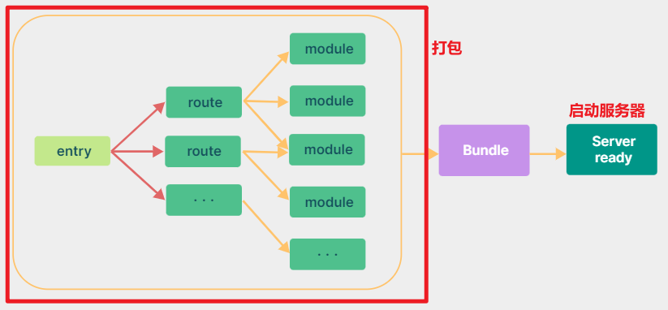
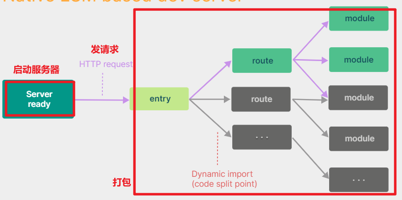

# vite

由尤雨溪团队开发的打包工具，类似于webpack，专属于vue使用，目的在于替换掉webpack。

对比webpack：

webpack打包如下图：

 

vite打包如下图：

 

从上面两张图可以看出，为什么webpack打包的vue项目会很慢 ，而vite具备了更加优秀的用户体验感。

vite的实现原理是利用ES6的import会发送请求去加载文件的特性，拦截这些请求，做一些预编译，省去webpack冗长的打包时间。

创建项目命令：

```shell
npm create vite@latest my-vue-app -- --template vue
```

第一次使用会提示，是否安装creat-vite，敲回车确定，这是vite的创建工具。

接下来vite会提示，让我们选择安装什么框架，然后再选择是否安装ts。

然后项目就安装好了。

启动命令：

```json
"scripts": {
    "dev": "vite --open --port 8888",
    "build": "vite build",
    "preview": "vite preview --open"
}
```

preview是启动打包好的项目。

<font color="red">**注意：这样安装的项目，没有vue-router，没有vuex，一切都需要自己手动配置。**</font> 

选择创建配置好的项目：

```shell
npm init vue
```


默认我们在vue项目中无法使用`@`作为src的路径，需要配置，在vite.config.js中：

```js
import {resolve} from 'path'
在 ts 模块中加载 node 核心模块，需要安装 node 的类型补充模块：npm i @types/node
// 配置
export default defineConfig({
  plugins: [vue()],
    resolve: {
        alias: {
            '@': resolve(__dirname, 'src')
        }
    }
})
```

服务器配置：

```js
export default defineConfig({
  server: {
      open: true,
      port: 端口号,
      proxy: {
          '/api': {
            target: 'http://jsonplaceholder.typicode.com',
            changeOrigin: true,
            rewrite: (path) => path.replace(/^\/api/, ''),
          },
          '/foo': 'http://localhost:4567',
          
      }
  }
})
```

