# 项目打包

## 一、打包介绍

我们知道vue项目中有后缀为`.vue`的文件，是无法直接运行在浏览器中的。在开发中能在浏览器中打开，是因为vue项目中内置了编译的功能，将整个项目进行编译，然后引入到public的index.html文件中，然后通过服务器打开的。

编译的结果在内存中，并没有保存下来，因为处于开发过程中，所以需要时常进行调试，就不保存在磁盘中了。

当项目完成后，我们就需要将整个项目编译生成文件，才能上传到服务器上进行上线。

vue项目搭建好之后，vue就提供了两个命令：

- 开发阶段在浏览器中查看页面的命令
- 开发完成后，将整个项目打包成实际文件的命令

命令在package.json中：

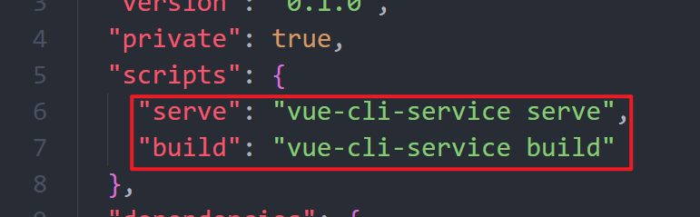 

所以在我们项目完成后，就需要使用下面的build命令进行打包：

```shell
npm run build
```

运行结果：

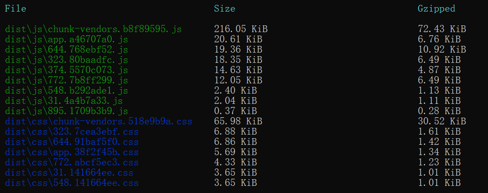  

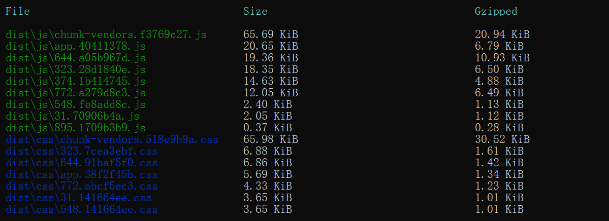

在项目根目录下，会生成一个dist文件夹，用于存放打包后的所有文件：

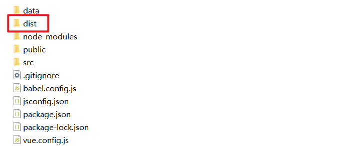 

其中的文件结构如下：

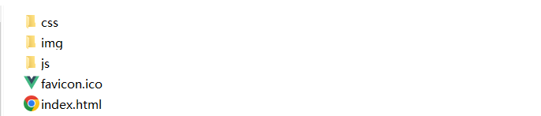 

最终打包后的项目文件包含：css、js、图片、index.html、网站图标。

我们平常在浏览器上看到的其实就是dist中的index.html，其中的样式是引入css文件夹中的css文件，其中的功能以及我们写的js代码都在js文件夹下的js文件中，项目中用到的静态资源图片，都在img文件夹中。

在我们项目中用到了很多服务器的操作，例如发送请求等，所以dist文件夹中的index.html直接在浏览器中打开是无法正常运行的，我们需要将整个文件夹作为服务器根目录打开才行，例如通过`http-server`工具。

打包后的js文件有两个：

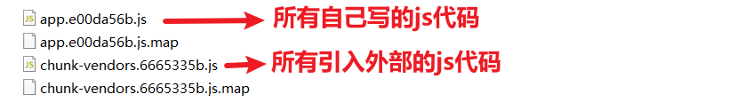 

引入外部的js代码中，包含我们通过npm下载的vue、vuex、vue-router、axios、swiper等文件。

项目使用的外部代码较多的话，打包后的这个js文件甚至能达到几十MB大小。

为了打包后的js文件体积变小，通常需要进行打包优化。

## 二、打包优化

优化思路：

将外部引入的这些文件，使用cdn的链接来代替，打包时，配置项目不打包这些js文件，从而减小打包后的js文件体积。

具体做法：

1. 配置打包忽略

   在vue.config.js文件中，新增键值对：

   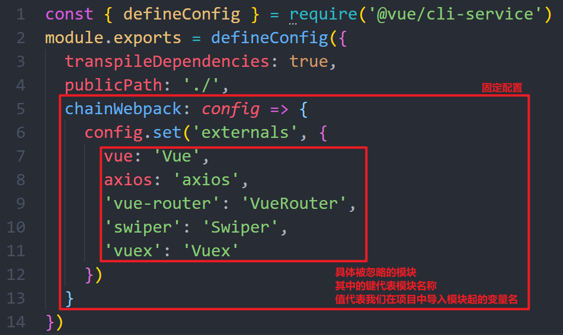 

   其中的key，代表我们要忽略打包的模块名称；value代表这个模块在项目中用的是什么名字。 

2. 在public下的index.html中引入被忽略的文件的cdn链接

   ```html
   <!DOCTYPE html>
   <html lang="">
     <head>
       <meta charset="utf-8">
       <meta http-equiv="X-UA-Compatible" content="IE=edge">
       <meta name="viewport" content="width=device-width,initial-scale=1.0">
       <link rel="icon" href="<%= BASE_URL %>favicon.ico">
       <link href="https://cdn.bootcdn.net/ajax/libs/Swiper/8.4.5/swiper-bundle.min.css" rel="stylesheet">
       <title><%= htmlWebpackPlugin.options.title %></title>
     </head>
     <body>
       <noscript>
         <strong>We're sorry but <%= htmlWebpackPlugin.options.title %> doesn't work properly without JavaScript enabled. Please enable it to continue.</strong>
       </noscript>
       <div id="app"></div>
       <!-- built files will be auto injected -->
       <script src="https://cdn.bootcdn.net/ajax/libs/vue/2.6.14/vue.min.js"></script>
       <script src="https://cdn.bootcdn.net/ajax/libs/vuex/3.6.2/vuex.min.js"></script>
       <script src="https://cdn.bootcdn.net/ajax/libs/vue-router/3.5.1/vue-router.min.js"></script>
       <script src="https://cdn.bootcdn.net/ajax/libs/axios/1.2.1/axios.min.js"></script>
       <script src="https://cdn.bootcdn.net/ajax/libs/Swiper/8.4.5/swiper-bundle.min.js"></script>
     </body>
   </html>
   
   ```

然后重新进行打包，打包结果：

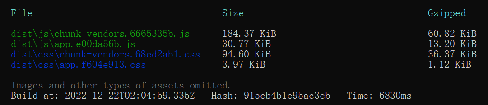 

两相对比，体积小了，且所需时间也短了，dist中的文件还是可以正常运行的。

## 三、制作APP

因为我们做的是移动端app项目，所以最终可以将这个项目打包成手机APP使用。

打包工具使用HBuilder。

打包具体步骤：

1. 在HBuilder中新建一个项目

2. 将新项目中的css、js、img、index.html删除，放入dist下的所有文件

3. 在`发行`菜单中选择`原生APP-云打包`

4. 在打开的菜单中，选择或输入自己的内容：

   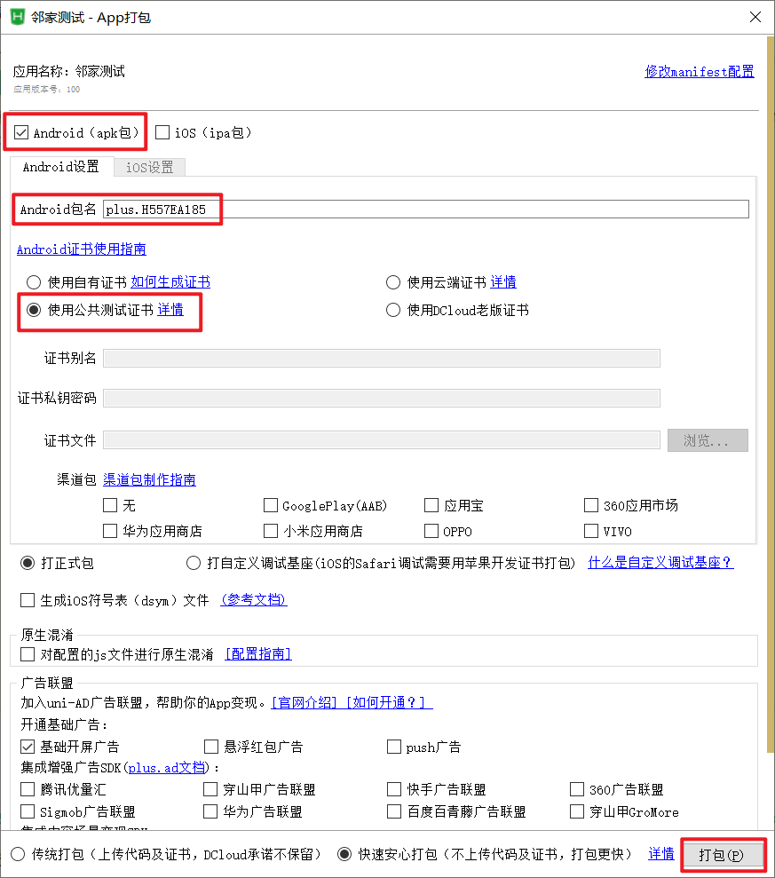 

最后点击打包，等待几分钟，打包成功后，可以从项目的   unpackage\release\apk 文件夹中，找到对应的apk，传递到手机上安装即可使用。

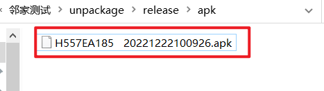 

过程简单，但是有一定的前提和注意事项：

不要急着打包，项目中有些代码放在手机APP中无法正常运行，所以需要修改：

- 手机APP无法使用cookie，需要换成本地存储，所以需要将封装好的cookie.js中的代码改成本地存储的操作

  ```js
  export function setCookie(key, value, seconds, path = '/') {
      // var date = new Date()
      // date.setTime(date.getTime() - 8*3600*1000 + seconds * 1000)
      // document.cookie = key + '='+value+';expires='+date+';path=' + path
  
      localStorage.setItem(key, value)
  }
  
  export function getCookie(key) {
      // var cookies = document.cookie // 所有cookie == 'key=value; key=value; key=value'
      // if(!cookies) return
      // var arr = cookies.split('; ')
      // for(var a = 0; a < arr.length; a++) {
      //     var brr = arr[a].split('=')
      //     if(brr[0] === key) {
      //         return brr[1]
      //     }
      // }
  
      return localStorage.getItem(key)
  }
  
  export function removeCookie(key, path = '/') {
      // setCookie(key, null, -1, path)
      
      localStorage.removeItem(key)
  }
  ```

  

- 项目需要用到数据服务器，所以手机和电脑要保持同一个网段（连接同一个路由器的wifi），数据服务器`json-server`需要重新制定ip地址启动：

  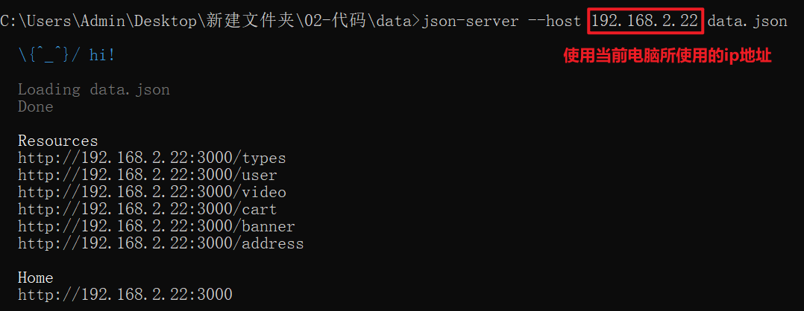 

  然后修改axios.js中的baseURL：

  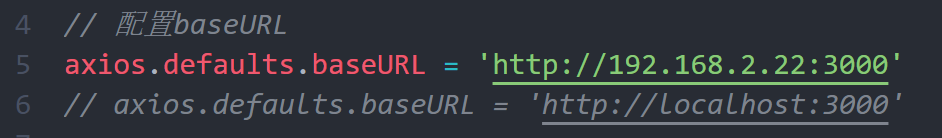  

- data.json文件中，有些视屏的链接，少写了协议和冒号，需要补全

  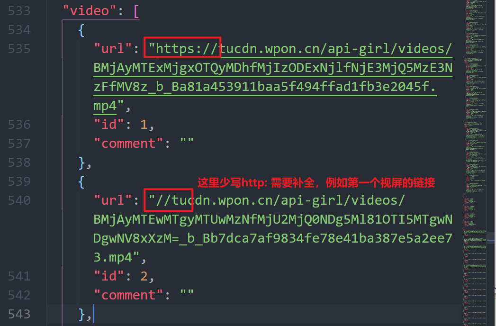 

  

- 打包后的index.html引入静态资源的链接，是以`/`开头的，需要在打包前配置，使用`./`才能用：

  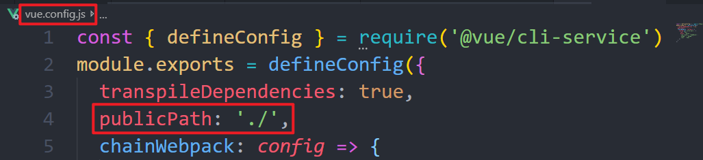 

- 打包的时候，需要有打包的账号和密码

  网址：https://dev.dcloud.net.cn/pages/app/list，如果没有账号，需要先注册账号，并实名认证

  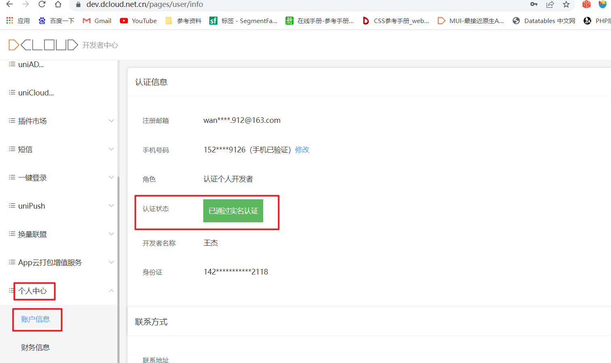 

  如果打包提示，通讯录权限问题，需要修改打包权限配置：

  打包时选择`修改mainfest配置`，如下图：

  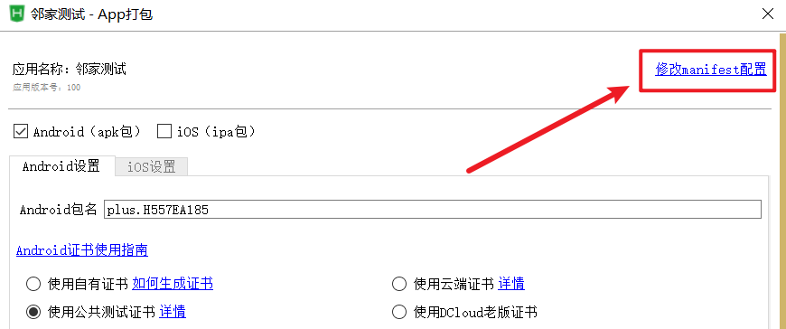 

  打开配置后，选择`权限配置`，如下图： 

  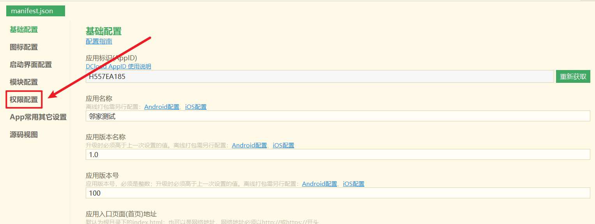 

  滚动条滚动到通讯配置，取消选中，如下图：

  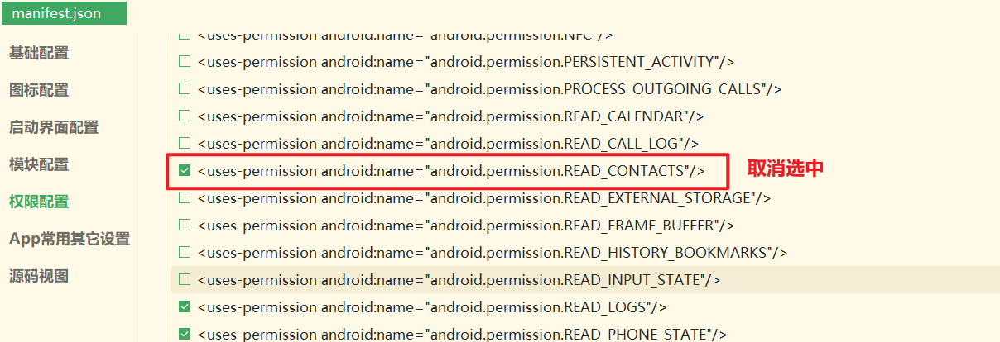 

  然后记得ctrl+s保存。

  接下来重新再次打包。

  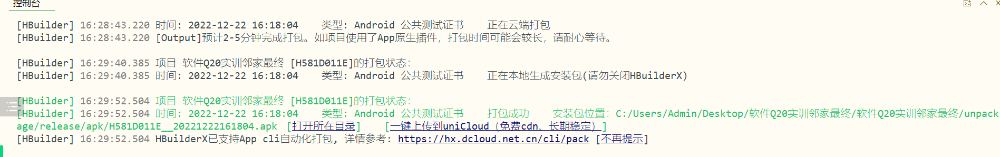 

HBuilder打包手机APP是免费的，但一天仅限5次，次数要再多就需要花钱。
