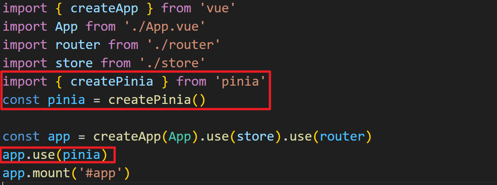

# pinia

pinia是新一代状态管理工具，适用于多个框架，但和vue3是黄金搭档。

我们可以理解为下一代的vuex。

下载安装：

```shell
npm install pinia
```

使用步骤：

1. 在main.js中，将pinia挂载到根实例上

    

2. 创建仓库数据

   ```ts
   import { defineStore } from 'pinia'
   // useLoginStore是自定义的变量 - 通常都是用use开头的
   // defineStore是从pinia中解构的方法，固定的
   // loginStore是自定义的字符串 - 表示当前仓库的唯一标识符
   export const useLoginStore = defineStore('loginStore', {
       // state表示存放数据的地方
       // state的值是一个函数，返回的对象中存放具体的数据
       state: () => ({
           count: 0,
           isLogin: false 
       }),
       // getters表示过滤器的意思 - 也可以理解为计算属性
       getters: {
           // getters中操作state数据用state做参数
           double: (state) => (state.count + 1) * 2,
       },
       // actions表还是存放方法的地方
       actions: {
           // 方法中操作state数据用this
           increment() {
               this.count++
           },
           changeStatus(bool:boolean) {
               this.isLogin = bool
           }
       }
   })
   ```

   

3. 使用仓库数据

   - 在组件中使用state数据

     1. 导入创建好的仓库

        ```js
        import {useLoginStore} from '@/store/piniaStore'
        ```

        

     2. 为了保证数据是响应式的，从pinia中解构storeToRefs方法

        ```js
        import {storeToRefs } from 'pinia'
        ```

        

     3. 通过导入的仓库名称，得到仓库

        ```js
        const store = useLoginStore()
        ```

        

     4. 将仓库使用storeToRefs变成响应式的，从中解构出要使用的数据

        ```js
        let {isLogin, count } = storeToRefs(store)
        ```

        

   - 在组件中使用getters - 跟state的使用方式一样，从响应式数据中解构就好

     ```js
     let {double } = storeToRefs(store)
     ```

     

   - 在组件中使用actions中的方法

     1. 导入仓库名称

        ```js
        import {useLoginStore} from '@/store/piniaStore'
        ```

        

     2. 根据仓库名称得到仓库

        ```js
        const store = useLoginStore()
        ```

        

     3. 从仓库中直接解构得到actions中要使用的方法就可以调用

        ```js
        let {changeStatus} = store
        changeStatus(true)
        console.log(111, isLogin.value);
        ```

        

