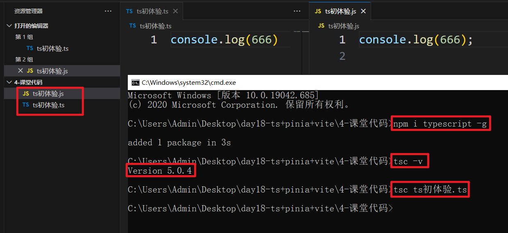
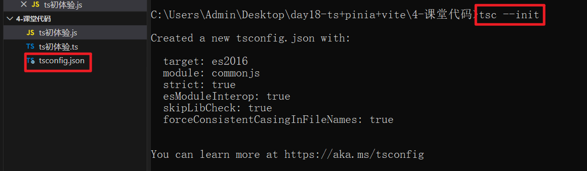

# ts

## 一、简介

1. TypeScript是由微软开发的一款开源的编程语言。 

2. TypeScript是JavaScript的超集，遵循最新的es6、es5规范。TypeScript扩展了JavaScript的语法。 

3. TypeScript更像后端java、C#这样的面向对象语言，可以让js开发大型企业项目。 

4. 谷歌也在大力支持TypeScript的推广，谷歌的angular2.x+就是基于TypeScript语法。 

5. 最新的vue、React也可以集成TypeScript。 

6. nodeJs矿建Nestjs、midway中用的就是TypeScript语法。

简单来说，ts就是有严格的类型显示的js。

因为js是弱类型语言，写出来的代码不够严谨，用ts写来约束类型，当类型不对的时候，ts会报错，代码更严谨。

## 二、安装编译

ts无法独立运行，必须将ts编译为js才能使用，编译工具叫typescript。

下载安装：

```shell
npm i typescript -g
```

测试：

```shell
tsc -v
```

编译命令：

```shell
tsc ts文件名
tsc 被编译的文件 --outFile 编译后的文件路径
```

例：

 

为了方便我们使用ts开发，通常会使用ts的监视命令，当ts文件发生变化时，自动编译生成js文件，不用很频繁的对ts进行编译。

监视命令步骤如下：

1. 初始ts - 生成ts的配置文件

   ```shell
   tsc --init
   ```

    

2. 修改配置文件

   ```json
   "outDir": "./js",   // 出口文件夹
   "rootDir": "./ts",  // 入口文件夹
   "module": "ES6",    // 选择模块化标准
   "target": "es5",    // 目标js版本
   ```

   

3. 执行监视编译命令

   ```shell
   tsc -w
   ```

   

## 三、ts中的类型

### 1、数字类型

```ts
let 变量名:number = 值
```

### 2、布尔类型

```ts
let 变量名:boolean = true/false
```

### 3、字符串类型

```ts
let 变量名:string = ''
```

### 4、数组类型

```ts
let 变量名:类型[] = [...]
let 变量名:Array<类型> = [...]
```

上面的类型，表示数组中存放的数据的类型

### 5、元组类型

ts中的元组，在js中表示为多种类型数据组成的数组。

```ts
let 变量名: [类型1, 类型2] = [类型1对应的数据, 类型2对应的数据]
```

注意：元组类型在定义的时候就规定了长度，且顺序必须对应。

### 6、枚举类型

枚举类型表示现有的几个数据当中，必须选择其中一个。

定义枚举类型：

```ts
enum 类型名称 {指定的多个数据, ...}
```

定义变量为这个枚举类型：

```ts
let 变量名: 枚举类型名称 = 类型.数据
```

例：

```ts
enum Color {Red, Green, Blue}
let a: Color = Color.Red
console.log(a); // 0
```

默认获取到的是数字，如果要获取自定义的其他类型数，需要在定义枚举类型的时候，给每个数据赋值。

例：

```ts
enum Color {Red = 'red', Green = 'green', Blue = 'blue'}
let a: Color = Color.Red
console.log(a); // red
```

### 7、任意类型

如果有些数据比较复杂，我们实在无力定义这个类型的话，可以使用任意类型，但要注意，任意类型对数据是没有约束性的。

```ts
let 变量名:any = 任意数据
```

### 8、void类型

当我们定义一个函数的返回值的时候，如果一个函数没有返回值，就可以使用void来表示。

```ts
function fn():void {
    let a = 10
}
```

### 9、undefined类型

通常用于修饰参数和返回值，且通常会配合其他类型使用，因为一个变量定义为undefined类型后，今后只能是undefined，无法再赋值为其他类型的数据了。

```js
function fn(b: number|undefined):number|undefined { // |表示或者的意思
    let a = 10
    return a
}
```

此时的函数在调用的时候，必须传入实参，实参必须是数字或undefined。

如果我们想表示这个参数可传可不传，就需要在参数后添加`?`来表示

### 10、null类型

null表示没有的意思，通常用于将一个变量销毁。

```ts
let a:number|null = 10
a = null
```

### 11、never类型

never表示从来没有的意思，通常用于抛出错误的函数返回值，或有一个死循环的函数返回值。

```ts
function captureErr() :never {
    throw new Error('错误信息')
}

function loop() :never {
    while(true) {

    }
}
```

### 12、Object类型

Object类型表示对象类型，但这个对象不允许添加新属性，不允许修改数据，只能读取数据。

```ts
let a:Object = {
    name: '张三'
}
```

## 四、类型断言

有的变量可能会有多种类型，当进行某一个类型的运算时，因为有另一种可能，所以可能会报错。

此时就需要我们告诉程序，我断定这个变量确定是这个类型，放心进行运算即可。

```ts
变量 as 类型
```

例：

```ts
function fn(a:number|null):number {
    // 断言 - 虽然这个变量可能会有其他类型，用来做数学运算会报错，但是我们可以断定这个变量肯定是数字，让程序放心计算
    let b:number = a as number + 5
    return b
}
```

## 五、类 

### 1、普通类

ts中的类和es6的类写法差不多，但是属性和方法多了几个修饰符：

- public - 公有的：在类中、子类中、类外都可以通过实例对象访问到
- private - 私有的：在类中可以通过实例对象访问到；类外、子类中都不可以访问到
- protected - 受保护的：在类中、子类中都可以访问到；类外不可以访问到
- static - 必须通过类名直接访问，其中无法访问到普通的属性和方法，只能通过类名访问到静态的属性和方法

例：

```ts
class Person{
    public type: string = '人类'
    public static height:number = 180
    public constructor() {
        this.type = '人'
    }
    protected props() :number {
        return 100
    }
    private money() {
        return 20
    }
    static weight():number {
        return 120
    }
}

class Man extends Person{

}

let p = new Person()
let m = new Man()
```

### 2、抽象类

在工作当中，通常会有组长写好大纲，组员根据大纲实现功能，组长是只提供大纲，不实现具体业务。

这里所指的大纲通常是抽象类。

抽象类也是一种类，只是通常没有具体的实现方法，他的出现只有一个目的 - 被继承。继承了抽象类后，必须实现其中定义好的没有实现具体业务的方法。

定义：

```ts
abstract class 类名{
    可以有普通属性和方法
    通常会有抽象方法 - 只有方法头，没有具体的实现
	abstract 方法名称()
}
```

例：

```ts
abstract class Animal{
    public name:string
    constructor(name: string) {
        this.name = name
    }
    abstract eat():void
}

class Dog extends Animal{
    constructor(name: string) {
        super(name)
    }
    eat():void {
        console.log(this.name + '吃')
    }
}
```

## 六、接口

对象类型的键值对无法扩展，为了能让键值对进行扩展，ts提供了接口类型。

### 1、键值对接口

```ts
interface 接口名称 {
    属性名: 类型;
    属性名: 类型;
}
```

例：

```ts
interface obj {
    name: string;
    age: number
}

let man:obj = {
    name: '张三',
    age: 12
}
```

对象中的键值对顺序可以调整，属性名必须是经过接口定义过的，否则报错。

如果某个键值对要定义为可选项，需要在属性名后加`?`

```ts
interface obj {
    name: string;
    age?: number
}
```

### 2、函数接口

函数的类型格式也可以使用接口做限制：

```ts
interface 函数类型 {
    (参数1: 类型, 参数2: 类型) :返回值类型
}
```

例：

```ts
interface encrypt {
    (key: string, value: number|string): string;
}

let md5:encrypt = function(key: string, value:number|string):string {
    return key + value
}

md5('name', 'zhangsan')
```

### 3、可索引接口

要定义更灵活的数组类型和对象，可以使用可索引接口：

```ts
interface arr {
    [index: number] :string
}
```

例：

数组

```ts
interface arr {
    [index:number]:string
}

let a:arr = ['a', 'b', 'c']
```

对象

```ts
interface obj {
    [index:string]:string
}

let b:obj = {
    name: '张三',
    age: '12'
}
```

### 4、接口继承

一个接口可以继承一个接口，也可以让类实现接口的具体的定义：

```ts
interface Animal {
    eat():void
}
// 接口继承接口
interface Person extends Animal{
    work():void
}
// 类实现接口
class Man implements Person {
    eat() {}
    work(){}
}
```

既继承类，又实现接口，一起进行：

```ts
interface Animal{
    eat():void
}

abstract class Person {
    abstract work():void
}

class Man extends Person implements Animal {
    public age:number
    constructor(age:number) {
        super()
        this.age = age
    }
    work():void {
        console.log('写代码');
    }
    eat() {
        console.log('吃饭');
    }
}
```

注意：必选先继承类，再实现接口

## 七、泛型

为了让函数或类中有统一的类型约束，ts提供了泛型。

函数泛型：

```ts
function 函数名<T>(value:T):T{
    return value
}
```

代码中的T，表示一种类型，在调用的时候提前指定这是什么类型，后续代码中参数和返回值都必须是同样的类型：

```ts
function getData<T>(params:T):T {
    return params
}

getData<number>(123)
getData<string>('abc')
```

泛型类：

```ts
class Person<T>{
    eat(food:T) {
        console.log(food)
    }
    sport(str:T):T {
        return str
    }
}

let p1:Person<string> = new Person()
p1.eat('12')
p1.sport('123')
```

## 八、模块化

跟es6的模块化一样。

## 九、命名空间

在ts中不允许函数或类同名，但项目大了，难免有顾及不到的地方会重名，此时可以使用命名空间解决。

命名空间：一个假的空间，形成独立的作用域，不同作用域中可以有同名的类或方法。

```ts
namespace A {
    export class Animal{
        public name:string
        constructor(name:string) {
            this.name = name
        }
    }

    export function fn() {
        console.log(111);
    }
}

namespace B {
    export class Animal{
        public name:string
        constructor(name:string) {
            this.name = name
        }
    }

    export function fn(){
        console.log(222);
    }
}

let a1:A.Animal = new A.Animal('张三')
let a2:B.Animal = new B.Animal('李四')
console.log(a1);
console.log(a2);

A.fn()
B.fn()
```

命名空间是一个独立的区域，其中的数据必须经过导出。


