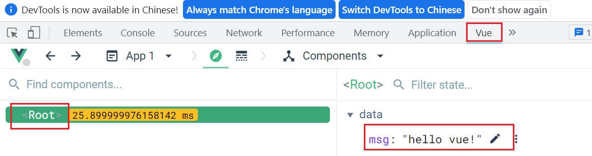

# vue1

## 一、vue介绍

### 1、简介

vue是前端开发过程中基于数据驱动的一个渐进式的框架。

数据驱动：指我们在开发过程中，不需要操作DOM结构，只需要通过操作数据，就能驱动DOM结构的渲染。

渐进式：vue框架中的很多东西都是独立的，项目小，就少用一点，项目大，就用多一些。

框架：使用这套代码可以开发一个完成的项目。对比插件和库。

插件：只能实现项目中某一个功能，例如swiper。

库：封装了很多函数或方法，不能独立实现功能和项目，例如工具库。

作者：尤雨溪，中国人。

 

官网：https://cn.vuejs.org/

### 2、vue的开发模式

vue框架中主要封装的内容：MVVM中的VM，即视图和数据绑定。

 

- M：全称Model，代表数据
- V：全称View，代表视图，即我们在页面中看到的内容展示
- VM：全称ViewModel，即视图和数据绑定。数据驱动视图，视图改变也会驱动数据。

<font color="red">**注意事项：改变做功能做案例做效果的思想 - 在vue中不操作DOM，只操作数据，不操作DOM，只操作数据，不操作DOM，只操作数据。**</font> 

### 3、vue初体验

- 下载vue

  ```js
  npm i vue@2
  ```

  

- 引入vue文件

  ```html
  <script src="./node_modules/vue/dist/vue.min.js"></script>
  ```

  vue文件中提供了一个全局的Vue构造函数

- 调用函数创建实例并指定挂载的模板范围、定义数据

  ```js
  new Vue({
      el: '#app',
      data: {
      	msg: 'hello vue!'
      }
  })
  ```

  

- 模板中显示数据

  ```html
  <div id="app">
      <p>{{msg}}</p>
  </div>
  ```

  

### 4、调试工具

为了可以体验vue的数据驱动，我们需要安装vue调试工具。

 

然后打开详情，在详情中勾选"允许访问文件网址"，这样我们才能在任意打开文件的页面中使用调试工具。

 

我们重新打开页面后，在检查中最后多了一项vue，打开vue，点击左边的Root，可以看到其中的数据，在这里可以对数据进行修改：

 

当修改数据后，视图自然会跟随发生变化。

## 二、vue语法之模板语法

从上面的代码中可以看出，我们在html中写的内容，已经不是单纯的html页面了，而成为了模板。

也就是说我们写的内容，并不是直接展示的，而是需要进行编译，编译成html后展示的浏览器的，这个编译的过程，vue框架中封装的。

我们需要学习模板中书写的语法，才能更好的在模板中展示出想要的内容。

### 1、插值表达式

模板中的双大括号，我们叫插值表达式。

插值表达式中可以写变量，也可以写部分js的语法，例如：三元运算、字符串方法、函数调用、运算符等等，但不能写变量定义、分支语句、循环语句等代码。

例：

```html
<body>
<div id="app">
    <!-- 展示变量 -->
    <p>{{name}}</p>
    <!-- 字符串拼接 -->
    <p>{{name + '真漂亮！'}}</p>
    <!-- 三元运算 -->
    <p>{{isMan ? '男' : '女'}}</p>
    <!-- 字符串方法 -->
    <p>{{motto.slice(0, 10)}}</p>
    <!-- 数学运算 -->
    <p>{{name}}明年是{{age + 1}}岁</p>
</div>
</body>
<script>
new Vue({
    el: '#app',
    data: {
        name: '翠花',
        age: 12,
        isMan: false,
        motto: '学习如逆水行舟，不进则退'
    }
})
</script>
```

页面效果：

 

### 2、指令

在vue封装的底层，对模板中标签的一些属性赋予了特殊的含义，这种带有特殊含义的标签属性就叫做指令。

指令初体验：

```html
<div id="app">
    <p v-text="msg"></p>
</div>
```

虽然我们没有给p标签添加内容，但是页面中p标签中能有内容。

内容是由p标签的v-text给展示出来的，v-text作为p标签的属性，能具有展示内容的功能，v-text就属于指令。

- v-html

  插值表达式和v-text不能解析带标签的内容，所以需要v-html解析带标签的内容。

  例：

  ```html
  <body>
  <div id="app">
      <!-- 默认，v-text和插值表达式都不能解析标签 -->
      <p v-text="jiaocheng"></p>
      <p>{{jiaocheng}}</p>
      <!-- v-html虽然能解析标签，但不建议使用 - 有安全隐患,xss攻击 -->
      <p v-html="jiaocheng"></p>
  </div>
  </body>
  <script>
  new Vue({
      el: '#app',
      data: {
          jiaocheng: '<b>js教程</b>',
      }
  })
  </script>
  ```

  

- v-pre

  让某个插值表达式不被编译，原样显示。

  例：写一个关于vue教程的文档。

  ```html
  <div id="app">
      <!-- v-pre 指令 让模板中的插值表达式原样输出，不解析 -->
      <p v-pre>vue教程：vue的模板中使用{{数据名称}}，默认数据就能被解析并显示</p>
  </div>
  ```

  

- v-once

  当页面显示后，如果改变数据不希望模板中内容发生改变，就使用v-once。

  例：

  ```html
  <body>
  <div id="app">
      <!-- 数据和视图一直保持双向绑定，会一直占用内存 -->
      <p>{{msg}}</p>
      <!-- 如果数据只为了显示这一次，后续数据就不再改变了，双向绑定就没有必要继续保持了 - 提高性能 -->
      <!-- v-once - 当数据在视图中显示后，会断开双向绑定 -->
      <p v-once>{{msg}}</p>
  </div>
  </body>
  <script>
  new Vue({
      el: '#app',
      data: {
          msg: 'hello'
      }
  })
  </script>
  ```

  改变数据后，只有第一个p标签会变化，第二个已经断开双向绑定了。

- v-cloak

  添加了这个属性的标签，当内容被编译显示之后，这个属性会自动消失。

  例：网速较慢，内容回来较慢，会有明显的页面闪烁效果，为了提高用户体验感，给闪烁的标签添加这个属性，并用这个属性选择标签，设置隐藏样式。

  ```html
  <style>
      [v-cloak]{
          display: none;
      }
  </style>
  <body>
  <div id="app">
      <!-- 解决闪烁问题 -->
      <!-- v-cloak 属性是内容在渲染成功之前会显示，内容显示之后就会隐藏 -->
      <!-- 利用这个指令的特性，用属性选择器给这个标签设置隐藏 -->
      <p v-cloak>{{msg}}</p>
  </div>
  </body>
  <script>
  new Vue({
      el: '#app',
      data: {
          msg: 'hello'
      }
  })
  </script>
  ```

  

- <font color="red">**v-bind**</font> 

  如果一个标签的属性值要使用定义好的数据，就可以给这个属性添加v-bind。使用语法：

  ```html
  <body>
  <div id="app">
      <!-- 当标签上的属性要使用数据的时候，这个属性要被v-bind指令修饰 -->
      
      <!-- 因为v-bind指令很常用，所以vue提供了一个简写语法：在属性前加冒号即可 -->
      
  </div>
  </body>
  <script>
  new Vue({
      el: '#app',
      data: {
          msg: 'hello',
          imgPath: 'https://t7.baidu.com/it/u=1109365764,3421420386&fm=218&app=126&size=f242,150&n=0&f=JPEG&fmt=auto?s=F4D07C85CE1275CC6B8C14A803003090&sec=1683306000&t=b140e9d2d68bba81068c66a29f5897da'
      }
  })
  </script>
  ```

  例：模板中的img标签的src属性要使用数据中的一个路径，此时img的src属性就需要添加v-bind修饰。

   

  添加了v-bind的属性，值可以使用变量，也可以使用简单的js代码。

  <font color="blue">**简写：在属性名前面加冒号**</font>  

- <font color="red">**v-on**</font> 

  用于给标签添加事件。使用语法：

  ```html
  <body>
  <div id="app">
      <!-- 如果标签要绑定事件，vue中是不操作dom的，使用v-on来绑定事件 -->
      <!-- <p v-on:事件类型="函数名称">{{msg}}</p> -->
      <p v-on:click="fn">{{msg}}</p>
      <p v-on:mouseover="fn">{{msg}}</p>
  </div>
  </body>
  <script>
  new Vue({
      el: '#app',
      // data中只能放属性，不能方法方法
      data: {
          msg: 'hello'
      },
      // 要放模板中使用的函数 - 放在methods中
      methods: {
          // fn: function() {
          //     alert(123)
          // }
          // fn() {
          //     alert(123)
          // }
          fn: () => {
              alert(123)
          }
      }
  })
  ```

  事件中需要调用的函数，我们可以在data属性下，定义methods，methods中写所有模板中用到的函数。

  案例：跑马灯案例

  <font color="blue">**简写：在事件名前面加@**</font> 

  事件函数传参注意点：

  $event - 事件对象

  this - window

  事件类型后可以有修饰符：

  stop - 阻止冒泡

  prevent - 阻止默认行为

  enter - 回车键

- <font color="red">**v-for**</font> 

  用于遍历数组或对象。使用语法：

  ```html
  <div id="app">
      <ul>
          <!-- v-for在模板中使用，目的是为了遍历数据，让模板也能批量显示
              语法：
              v-for="(代表值的变量, 代表下标的变量) in 数组" :key="这个数据唯一的标识符"
          -->
          <!-- <li v-for="v in arr" v-bind:key="v">{{v}}</li> -->
          <!-- <li v-for="v in arr" :key="v">{{v}}</li> -->
          <!-- <li v-for="(v, i) in arr" :key="v">{{v}} --- {{i}}</li> -->
  
          <li v-for="(v, k) in wife" :key="k">{{v}} --- {{k}}</li>
      </ul>
  </div>
  </body>
  <script>
  new Vue({
      el: '#app',
      data: {
          arr: ['Vue', 'React', 'Angular'],
          wife: {
              name: '翠花',
              age: 12,
              sex: '女'
          }
      }
  })
  </script>
  ```

  <font color="blue">**注意：为了保证数据唯一，一定要添加v-bind:key属性，值是数据唯一的值，例如对象，就将数据的key作为这里的值。**</font> 

  例：简单购物车数据渲染和操作

- <font color="red">**v-if**</font> 

  用于做判断。使用语法：

  ```html
  <body>
  <div id="app">
      <!-- 如果age>=18就显示div -->
      <!-- <div v-if="age >= 18">哈哈哈</div> -->
      <!-- <a href="">asdfasdf</a> -->
      <!-- 如果age<18就显示p -->
      <!-- 注意：v-else必须紧跟v-if，否则会报错 -->
      <!-- <p v-else>嘿嘿嘿</p> -->
  
      <div v-if="score >= 90 && score <= 100">甲</div>
      <!-- <p>asdfasfd</p> -->
      <!-- 注意：v-else-if 必须紧跟v-if，否则报错 -->
      <div v-else-if="score >= 80 && score < 90">乙</div>
      <div v-else-if="score >= 70 && score < 80">丙</div>
      <div v-else-if="score >= 60 && score < 70">丁</div>
      <div v-else>不及格</div>
  </div>
  </body>
  <script>
  new Vue({
      el: '#app',
      data: {
          // age: 90
  
          score: 80
      }
  })
  </script>
  ```

  <font color="blue">**注意：v-else和v-else-if必须紧跟v-if所在标签，两个标签中间不能有其他内容，否则报错。**</font> 

  <font color="blue">**v-if使用节点的创建和删除来控制标签的显示和隐藏，如果操作比较频繁，性能较低，例如tab切换。**</font>   

- <font color="red">**v-show**</font> 

  用于控制标签显示隐藏。使用语法：

  ```html
  <body>
  <div id="app">
      <div v-show="age >= 18">哈哈哈</div>
      <div v-show="age < 18">嘿嘿嘿</div>
  </div>
  </body>
  <script>
  new Vue({
      el: '#app',
      data: {
          age: 20
      }
  })
  </script>
  ```

  <font color="blue">**注意：v-show使用display样式控制标签显示和隐藏，频繁操作的话，性能比v-if好。**</font> 

- <font color="red">**v-model**</font> 

  用于实现表单元素和数据的双向绑定，使用后，表单元素的value属性将失效。使用语法：

  ```html
  <div id="app">
      <!-- 文本框
          文本框有了v-model，value就无效了
      -->
      <!-- <input type="text" value="嘿嘿" v-model="msg"> -->
  
      <!-- 密码框 -->
      <!-- <input type="password" v-model="pass"> -->
  
      <!-- 文本域
      
          使用插值表达式无法实现双向绑定
      -->
      <!-- <textarea id="" cols="30" rows="10">{{msg}}</textarea> -->
      <textarea id="" cols="30" rows="10" v-model="msg"></textarea>
  </div>
  </body>
  <script>
  new Vue({
      el: '#app',
      data: {
          // msg: '哈哈'
          // pass: '123456'
          msg: '阿斯蒂芬金坷垃撒旦法UI及我饿UR及后期维护添加水电费就看哈水电费那描述符就开启文化人NB阿萨德副科级拉水电费看剧吧函数的非建安收保护费卡斯柏和对方卡士大夫'
      }
  })
  </script>
  ```

  不同的表单元素，v-model实现的功能不同，例如文本框和文本域实现的是内容，单选框和复选框以及下拉框实现的选中与否。

  v-model的修饰符：

  - lazy - 将双向绑定使用的事件从input变成change
  - number - 将数据从字符串变成数字
  - trim - 去除左右两端空格

### 3、样式操作

#### 3.1、class操作类名

##### 3.1.1、数组做class的值

```html
<标签 :class="[代表类名的数据1, 代表类名的数据2, ...]"></标签>
```

例：

```html
<head>
    <meta charset="UTF-8">
    <title>Document</title>
    <script src="./node_modules/vue/dist/vue.js"></script>
    <style>
        .box{
            width: 100px;
            height: 100px;
            border: 1px solid #000;
        }
        .red{
            background-color: #f00;
        }
    </style>
</head>
<body>
<div id="app">
    <!-- <div class="box red">盒子</div> -->
    <!-- 如果class对应的值是一个数组， :class="数组"   数组是由多个类名组成的 -->
    <!-- <div :class="arr">盒子</div> -->
    <!-- <div :class="['box', 'red']">盒子</div> -->
</div>
</body>
<script>
new Vue({
    el: '#app',
    data: {
        // class的数据 有两种
        // 数组
        // arr: ['box', 'red']

        bool: false
    }
})
</script>
```


##### 3.1.2、对象做class的值

```html
<标签 :class="{类名1: 布尔值, 类名2: 布尔值, ...}"></标签>
```

例：

```html
<head>
    <meta charset="UTF-8">
    <title>Document</title>
    <script src="./node_modules/vue/dist/vue.js"></script>
    <style>
        .box{
            width: 100px;
            height: 100px;
            border: 1px solid #000;
        }
        .red{
            background-color: #f00;
        }
    </style>
</head>
<body>
<div id="app">
    <!-- <div class="box red">盒子</div> -->

    <!-- <div :class="obj">盒子</div> -->
    <!-- <div :class="{box: true, red: true}">盒子</div> -->
    <!-- <div :class="{box: !bool, red: bool}">盒子</div> -->
</div>
</body>
<script>
new Vue({
    el: '#app',
    data: {
        // class的数据 有两种
        // 对象
        obj: {
            box: true,
            red: true
        },
        bool: false
    }
})
</script>
```

案例：tab切换

#### 3.2、style操作样式

##### 3.2.1、数组做style的值

```html
<标签 :style="[css键值对组成的对象的数据名称1, css键值对组成的对象的数据名称2, ...]"></标签>
```

例：

```html
<body>
<div id="app">
    <!-- <div style="width: 100px; height: 100px; border: 1px solid #000;">盒子</div> -->
    <!-- 
        style修饰样式，也有两种数据
        数组 - []
     -->
    <!-- <div :style="arr">盒子</div> -->
    <!-- <div :style="[{'background-color': 'blue'}]">盒子</div> -->
</div>
</body>
<script>
new Vue({
    el: '#app',
    data: {
        arr: [
            {
                width: '100px',
                'background-color': 'red'
            },
            {
                height: '100px'
            },
            {
                'border': '1px solid #000'
            }
        ]
    }
})
</script>
```


##### 3.2.2、对象做style的值

```html
<标签 :style="{css键: 值使用的数据名称, ...}"></标签>
```

例：

```html
<body>
<div id="app">
    <!-- <div style="width: 100px; height: 100px; border: 1px solid #000;">盒子</div> -->
    <!-- 
        style修饰样式，也有两种数据
        对象 - {}
     -->
    <!-- <div :style="obj">盒子</div> -->
    <div :style="{'background-color': '#ff0'}">盒子</div>
</div>
</body>
<script>
new Vue({
    el: '#app',
    data: {
        obj: {
            width: '100px',
            'background-color': 'red',
            height: '100px',
            'border': '1px solid #000'
        }
    }
})
</script>
```

案例：tab切换

