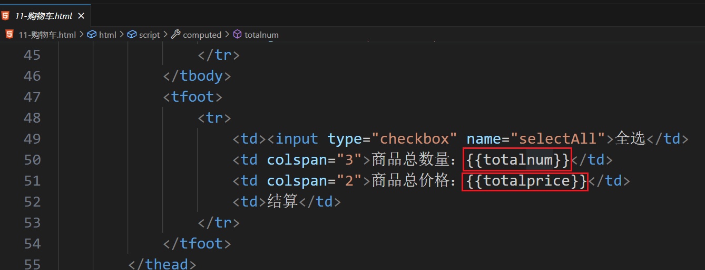
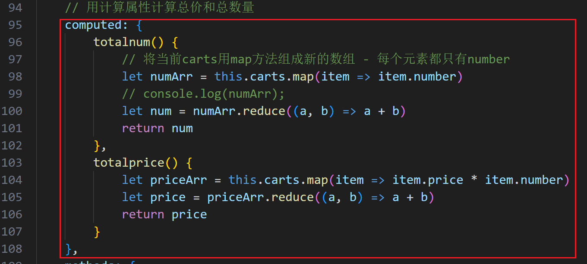
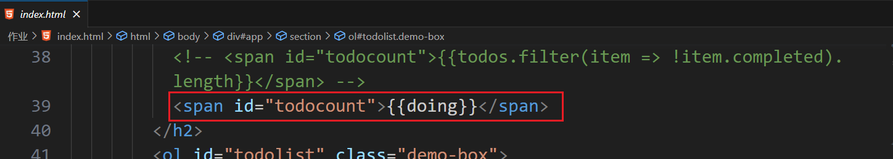
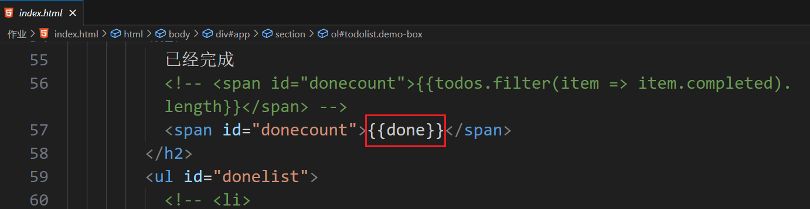
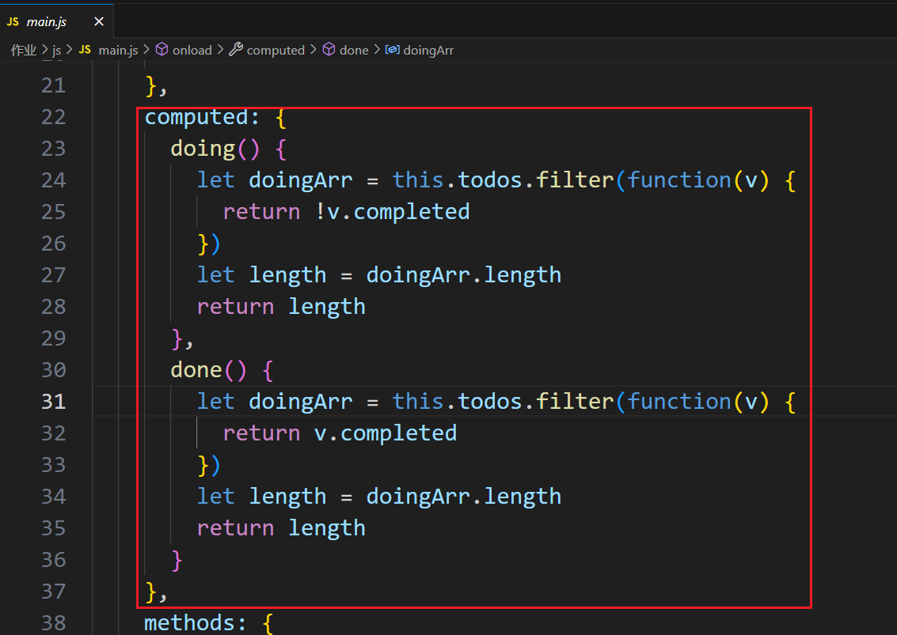

# vue常用属性

在vue实例中，我们接触了几个常见的属性：

> el：指定vue实例监管范围
>
> data：定义vue实例中要使用的数据
>
> methods：定义vue实例中要使用的函数

## 自定义指令

之前学习的指令，都是vue自带的，vue还允许我们自定义指令，实现自己的功能。

自定义指令使用的属性是directives，在vue实例中定义的指令，只能在当前vue实例监管的模板范围内使用。

指令定义：

```js
new Vue({
	el: '', // 监管范围
    data: {}, // 数据
    directives: {
        指令名称: {
            bind: () => {}, // 该指令第一次绑定到元素时调用 - 常用
            inserted: () => {}, // 使用该指令的元素插入到父节点时调用
            update: () => {}, // 使用该指令的标签 其中的数据更新的时候调用 - 常用
            componentUpdated: () => {}, // 使用该指令的标签 其子节点更新完成后会触发
            unbind: () => {}, // 取消绑定后触发
        }
    }
})
```

指令使用：

```html
<div v-指令名称>
	标签内容	
</div>
```

定义指令的方法中，有两个参数：

> bind:(el, binding) => {}
>
> el：当前使用指令的标签
>
> binding：对象，记录了当前指令的详细信息
>
> binding.name - 指令名称
>
> binding.value - 指令名称对应的值解析后的数据
>
> binding.expression - 指令的值
>
> binding.modifiers - 指令的修饰符
>
> binding.arg - 指令的参数：指令名后面冒号后面的内容

当bind方法和update方法执行相同的代码时，可以将自定义指令的值简写为一个函数：

```js
new Vue({
	el: '', // 监管范围
    data: {}, // 数据
    directives: () => {}
    }
})
```


为了让指令中封装的功能，可以被多个实例使用，自定义除了上述局部使用外还有全局使用。

```js
Vue.directive(指令名称, {
    bind: () => {},
    inserted: () => {},
    ...
})
```

这段代码以下的所有vue实例都可以使用这个指令。

案例：设置全局自定义指令：`v-red`和`v-color`，实现标签的颜色设置。`v-red`将标签颜色变成红色；`v-color`传递的什么颜色的参数，就将标签设置为什么颜色。

```html
<body>
<div id="app">
    <p v-red>{{msg}}</p>
    <p v-color:green>
        <b>{{msg}}</b>
    </p>
    <p v-color:blue>{{msg}}</p>
</div>
</body>
<script>
// 全局自定义指令
Vue.directive('red', (el) => {
    el.style.color = 'red'
})

Vue.directive('color', (el, binding) => {
    console.log(el, binding);
    el.style.color = binding.arg
})
new Vue({
    el: '#app',
    data: {
        msg: '你好vue！'   
    }
})
</script>
```


案例：使用自定义指令完成表单验证

初版：

```html
<body>
<div id="app">
    <input type="text" v-model="username" v-username>
</div>
</body>
<script src="./node_modules/vue/dist/vue.js"></script>
<script>
Vue.directive('username', {
    bind: (el) => {
        let color = 'black'
        if(el.value.length < 3 || el.value.length > 10){
            color = 'red'
        }
        el.style.color = color
    },
    update: (el) => {
        let color = 'black'
        if(el.value.length < 3 || el.value.length > 10){
            color = 'red'
        }
        el.style.color = color
    }
})
const vm = new Vue({
    el: '#app',
    data: {
        username: 'cuihua'
    }
})
</script>
```

升级封装：

```html
<body>
<div id="app">
    <input type="text" v-model="username" v-username>
</div>
</body>
<script src="./node_modules/vue/dist/vue.js"></script>
<script>
Vue.directive('username', (el) => {
    let color = 'black'
    if(el.value.length < 3 || el.value.length > 10){
        color = 'red'
    }
    el.style.color = color
})
const vm = new Vue({
    el: '#app',
    data: {
        username: 'cuihua'
    }
})
</script>
```

更加灵活的验证：

```html
<body>
<div id="app">
    <input type="text" v-model="username" v-username="{min: 3, max: 10}">
</div>
</body>
<script src="./node_modules/vue/dist/vue.js"></script>
<script>
Vue.directive('username', (el, args) => {
    console.log(args); // args.value表示接收到指令的值
    let color = 'black'
    if(el.value.length < args.value.min || el.value.length > args.value.max){
        color = 'red'
    }
    el.style.color = color
})
const vm = new Vue({
    el: '#app',
    data: {
        username: 'cuihua'
    }
})
</script>
```

适用性更强的验证：

```html
<body>
<div id="app">
    <input type="text" v-model="username" v-validate.username="{min: 3, max: 10}">
    <input type="text" v-model="phone" v-validate.phone="{min: 11, max: 11}">
    <input type="text" v-model="password" v-validate.password="{min: 6, max: 12}">
</div>
</body>
<script src="./node_modules/vue/dist/vue.js"></script>
<script>
let validation = {
    currency(el, args) {
        if(el.value.length < args.value.min || el.value.length > args.value.max){
            return false
        }else{
            return true
        }
    },
    username(el, args) {
        let color = 'black'
        if(!validation.currency(el, args)){
            color = 'red'
        }
        el.style.color = color
    },
    phone(el, args) {
        let color = 'black'
        if(!/^1[3-9]\d{9}$/.test(el.value) || !validation.currency(el, args)) {
            color = 'red'
        }
        el.style.color = color
    },
    password(el, args) {
        let color = 'black'
        if(!validation.currency(el, args)) {
            color = 'red'
        }
        el.style.color = color
    }
}
Vue.directive('validate', (el, args) => {
    console.log(args); // args.modifiers表示接收到指令的修饰符
    let key = Object.keys(args.modifiers) ? Object.keys(args.modifiers)[0] : ''
    if(key) validation[key](el, args)
})
const vm = new Vue({
    el: '#app',
    data: {
        username: 'cuihua',
        phone: '',
        password: ''
    }
})
</script>
```

加提示内容：

```html
<body>
<div id="app">
    <input type="text" v-model="username" v-validate.username="{min: 3, max: 10, fn: setMsg}">
    <span>{{msg}}</span>
</div>
</body>
<script src="./node_modules/vue/dist/vue.js"></script>
<script>
let validation = {
    currency(el, args) {
        let fn = args.value.fn || ''
        if(el.value.length < args.value.min || el.value.length > args.value.max){
            fn('长度不合适')
            return false
        }else{
            fn('')
            return true
        }
        
    },
    username(el, args) {
        let color = 'black'
        if(!validation.currency(el, args)){
            color = 'red'
        }
        el.style.color = color
    }
}
Vue.directive('validate', (el, args) => {
    console.log(args); // args.modifiers表示接收到指令的修饰符
    let key = Object.keys(args.modifiers) ? Object.keys(args.modifiers)[0] : ''
    if(key) validation[key](el, args)
})
const vm = new Vue({
    el: '#app',
    data: {
        username: 'cuihua',
        phone: '',
        password: '',
        msg: ''
    },
    methods: {
        setMsg(message = '') {
            this.msg = message
        }
    }
})
</script>
```


## 计算属性

当模板中显示的内容是通过一些数据进行运算得到的时候，如果我们直接将运算放在插值表达式中，会使得模板内容变得过重而难以维护。例如：

```html
当前选中的商品名称：{{cartlist.find(item => item.checked)?cartlist.find(item => item.checked).goodsName : '暂无选中商品'}}
```

此时为了让模板变得更加简洁且易于维护，vue提供了计算属性。

计算属性是vue实例的computed属性。计算属性定义：

```js
new Vue({
	el: '',
    data: {},
    computed: {
        数据名称: () => {
            // computed中的函数必须返回一个值，返回的值就是我们在模板中要显示的内容
            return 值 // 当返回的值依赖的数据发生变化的时候，会自动重新计算
        }
    }
})
```

计算属性在模板中使用：

```html
{{数据名称}}
```

案例：购物车中的总价和总数量、todomvc中的统计、输入姓和名自动生成姓名。

 

 

 

 

 

```html
<body>
<div id="app">
    姓：<input type="text" v-model="firstname">
    <br>
    名：<input type="text" v-model="secondname">
    <br>
    姓名：<input type="text" v-model="name">
</div>
</body>
<script>
new Vue({
    el: '#app',
    data: {
        firstname: '',
        secondname: ''
    },
    // 计算属性得到姓名
    computed: {
        name() {
            return this.firstname + this.secondname
        }
    }
})
</script>
```


如果要修改计算属性的值，可以将计算属性分为get和set：

```js
计算属性名称: {
    get() {
        return 计算得到的值
    },
    set(val) { // 即将改变的计算属性的值
        改变计算属性的值之后执行的代码
    }
}
```

修改计算属性得到的姓名：

````html
<body>
<div id="app">
    姓：<input type="text" v-model="firstname">
    <br>
    名：<input type="text" v-model="secondname">
    <br>
    姓名：<input type="text" v-model="name">
</div>
</body>
<script>
new Vue({
    el: '#app',
    data: {
        firstname: '',
        secondname: ''
    },
    // 计算属性得到姓名
    computed: {
        // 计算属性得到的数据 - 我们需要修改，没有办法实现双向绑定了 - 此时就需要使用计算属性的get和set了
        // 默认，计算属性只有get没有set
        // name() {
        //     return this.firstname + this.secondname
        // }
        name: {
            get() {
                return this.firstname + this.secondname
            },
            set(val) {
                console.log(val);
                // this.name = val
                this.firstname = val.slice(0, 1)
                this.secondname = val.slice(1)
            }
        }
    }
})
</script>
````

案例：全选和单选

```html
<body>
<div id="app">
    <table>
        <tr>
            <td><input type="checkbox" v-model="selectAll"><b>全选</b></td>
        </tr>
        <tr v-for="item in arr" :key="item.name">
            <td><input type="checkbox" v-model="item.checked">{{item.name}}</td>
        </tr>
        <tr>
            <td><input type="checkbox" v-model="selectAll"><b>全选</b></td>
        </tr>
    </table>
</div>
</body>
<script>
new Vue({
    el: '#app',
    data: {
        arr: [
            {
                name: '游泳',
                checked: false
            },
            {
                name: '跑步',
                checked: false
            },
            {
                name: '唱歌',
                checked: false
            },
            {
                name: '跳舞',
                checked: false
            },
            {
                name: '打篮球',
                checked: false
            },
        ]
    },
    computed: {
        selectAll: {
            get() {
                let bool = this.arr.every(item => item.checked)
                return bool
            },
            set(val) {
                this.arr.forEach(item => item.checked = val)
            }
        }
    }
})
</script>
```


## 监听器

当某个数据变化后，我们要执行一段代码，就需要使用vue提供的监听器了，例如卖座网的影院详情。

监听器在vue实例中使用watch属性：

```js
new Vue({
    el: '',
    data: {},
    watch: {
        被监听的数据: () => {}, // 数据改变后，执行对应的函数
    }
})
```

如果被监听的数据是引用数据类型，这种监听方式监听不到其中数据的变化，此时需要使用深度监听语法：

```js
new Vue({
    el: '',
    data:{
        msg: '数据'
    },
    watch:{
        被监听的数据名称: {
            handler(newVal, oldVal){
                // newVal代表改变的新的值，oldVal代表原来的值
            },
            deep: true
        }
    }
})
```

> 被监听的数据也可以写成：对象.键

<font color="green">**面试题：计算属性和监听器的区别。**</font> 

## 过滤器

如果模板中要显示的内容是data中的数据处理后的结果，就需要在模板中使用过滤器。例如：data中定义的是时间戳，模板中要显示的是其他格式。

定义过滤器：

```js
new Vue({
    el: '',
    data:{},
    filters: {
        过滤器名称: function(val, arg1, arg2, ...){ // val是需要处理的数据，arg是使用过滤器传递来的参数
            return 处理结果
        }
    }
})
```

过滤器在模板中使用：

```html
<p>{{源数据 | 过滤器名称(参数)}}</p>
```

上述局部过滤器只能在当前实例中使用，如果一个过滤器封装的功能，需要在多个实例中都使用，就要使用全局过滤器了：

```js
Vue.filter('过滤器名称', function(val, arg1, arg2, ...){
    return 处理结果
})
```


## 混入

混入的意思是将一个半成品vue实例，混合到另vue实例中使用。

我们通常将多个实例共同的内容，封装到一个半成品中，然后被多个实例混入使用。

全局混入：

```js
Vue.mixin(vue实例对象 - 不完整)
```

例：

```js
Vue.mixin({
    methods: {
        fn(){
            console.log("vue实例的点击事件");
        }
    }
})
```

全局混入是强行混入，后续实例必须使用。

局部混入：

```js
const world = {
    methods: {
        fn(){
            console.log("vue实例的点击事件");
        }
    }
}
new Vue({
    el: '#app',
    data: {
        msg: 'hello vue'
    },
    // 局部混入
    mixins: [world]
})
```

局部混入是按需混入。


