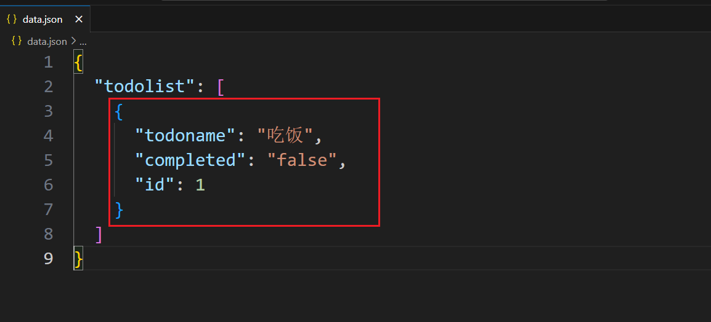

json-server工具：快速的依赖一个json文件就能启动一个后端服务器接口。

下载：

```shell
npm i json-server -g
```

检测是否能用：

```shell
json-server --version
```

先创建data.json文件，其中必须是一个对象，一定要有一个键值对。

启动：

```shell
json-server json文件
```

 

使用：

post请求 - 新增数据

 

 

get请求 - 查询数据

查询所有数据

 

查询一条数据

 

put请求 - 修改数据

 

 

delete请求 - 删除数据

 

# 组件

## 概念

我们在项目开发中，通常是进行模块化开发的。在vue项目中，可以对整个页面进行模块化，组件就是页面中的一个模块。

我们将整个页面的一部分单独封装在一个页面中，当需要用到的时候，导入即可。

## 语法

### 全局组件

全局组件创建好以后，后续的每个vue实例都可以直接使用。

```js
Vue.component(组件名称， {
	data() {
    	return {数据}
	},             
    template: '组件的模板内容'
})
```

注意：组件中的数据，不能是data对象，必须是data函数返回的对象。

### 局部组件

局部组件创建好以后，只能在当前实例中使用，其他实例中无法使用。

```js
new Vue({
    el: '',
    data:{},
    components: {
        组件名称: {
            data(){
                return {}
            },
            template: `模板`
        }
    }
})
```

### 使用

将组件名称当做自定义标签使用。

```html
<hello></hello>
<hello />
```

单标签和双标签都可以。

案例：加载层。

## 事件修饰符native

当我们给自定义组件标签中绑定的时候，这个事件是没有办法触发，因为，这个自定义标签上绑定的事件，我们无法确定是父组件的事件还是子组件的事件。

如果细分析，我们会觉得这个事件应该属于父组件，因为如果是子组件的事件就应该写在子组件内部，而不应该写在父组件中了。

此时我们可以给事件加上`native`修饰符，这个事件就作为父组件的事件触发了。

```html
<body>
<div id="app">
    <hello @click="fn"></hello>
    <hello @click.native="fn"></hello>
</div>
</body>
<script src="./node_modules/vue/dist/vue.js"></script>
<script>
Vue.component('hello', {
    template: `
        <div>你好</div>
    `,
    methods: {
        fn(){
            console.log(222);
        }
    }
})
const vm = new Vue({
    el: '#app',
    data: {
        
    },
    methods: {
        fn(){
            console.log(111);
        }
    }
})
</script>
```

注意：native修饰符给普通标签是没有意义的，且会报错造成事件无法触发。

## 组件传值

### 父传子

父组件中的数据传递给子组件，也就是在子组件中使用父组件的数据。具体使用步骤如下：

1. 在子组件自定义标签中，通过`v-bind`指令添加自定义属性，值为父组件数据
2. 在子组件实例中，通过`props`属性，接收自定义属性中的数据
3. 在子组件模板中，使用接收回来的数据，使用方式跟data中数据的使用方式一样

例：

```js
<body>
<div id="app">
    <h1>{{title}}</h1>
    <!-- 子组件 -->
    <!-- 自定义属性名称，值为父组件中的数据 -->
    <hello :fatherdata="title"></hello>
</div>
</body>
<script src="./node_modules/vue/dist/vue.js"></script>
<script>
Vue.component("hello", {
    data(){
        return {
            msg: '子组件'
        }
    },
    // 模板中使用props的数据
    template: `
        <div>
            <h3>{{msg}}</h3>
            <p>{{fatherdata}}</p>
        </div>
    `,
    // 接收属性中的数据
    props: ['fatherdata']
})
new Vue({
    el: '#app',
    data: {
        title: '父组件中的数据'
    }
})
</script>
```

子组件实例中，使用props接收属性中数据的时候，除了有数组形式外，还可以有对象形式：

```html
<body>
<div id="app">
    <h1>{{title}}</h1>
    <!-- 子组件 -->
    <!-- 自定义属性名称，值为父组件中的数据 -->
    <hello :fatherdata="title"></hello>
</div>
</body>
<script src="./node_modules/vue/dist/vue.js"></script>
<script>
Vue.component("hello", {
    data(){
        return {
            msg: '子组件'
        }
    },
    // 模板中使用props的数据
    template: `
        <div>
            <h3>{{msg}}</h3>
            <p>{{fatherdata}}</p>
        </div>
    `,
    // 接收属性中的数据
    props: {
        // 键为要接收的属性名称，值为对象
        fatherdata: {
            // 对象中可以有type和default两个键值对
            type: String, // type用来限制数据的类型
            default: '哈哈' // default用来设置没有数据时的默认值
        }
    }
})
new Vue({
    el: '#app',
    data: {
        title: '父组件中的数据'
    }
})
</script>
```

对象形式比较数组形式，可以限制类型，可以设置默认值，更加严谨，在使用的时候，如果组件是自己定义的，就没有必要限制类型和默认值，如果组件是别人定义的，就可以使用对象来限制。在实际开发中，我们通常会使用数组形式来接收数据，因为组件是自己定义的。

注意：父传子的数据是单向传送，也就是说子组件接收到父组件的数据，只能展示，不能对这个数据进行修改。

### 子传父

子组件的数据传递给父组件，步骤如下：

1. 在子组件自定义标签上绑定自定义事件，事件函数为父组件的函数
2. 在子组件实例中，调用$emit触发父组件给绑定的事件并传递参数(数据)
3. 事件被触发后，父组件函数通过参数接收数据

```js
<body>
<div id="app">
    <h1>{{title}}</h1>
    <!-- 子组件 -->
    <!-- 父组件给子组件添加自定义事件send，对应的事件函数为getData -->
    <hello @send="getData"></hello>
</div>
</body>
<script src="./node_modules/vue/dist/vue.js"></script>
<script>
Vue.component("hello", {
    data(){
        return {
            msg: '子组件'
        }
    },
    // 在子组件中绑定单击事件，对应的处理函数为childChild
    template: `
        <div>
            <h3 @click="clickChild">{{msg}}</h3>
        </div>
    `,
    methods: {
        // 子组件中点击事件的处理函数
        clickChild() {
            // 触发父组件给绑定的自定义事件send，并传入数据 - 子组件中的msg
            this.$emit("send", this.msg)
        }
    }
})
new Vue({
    el: '#app',
    data: {
        title: '父组件中的数据'
    },
    methods: {
        // 自定义事件send的处理函数
        // 当事件被触发后，执行这个函数，因为有参数，使用形参来接收
        getData(res){
            // res为最后接收到子组件传递来的数据
            console.log(res);
        }
    }
})
</script>
```

案例：todomvc组件版

### 非父子

非父子的两个组件要进行数据传递，需要通过这两个组件能共同访问到的全局组件进行。

vue提供了一个EventBus，是一个全局的vue实例，用来调控其他组件的数据交互。

实现步骤：

1. 定义全局vue实例EventBus
2. 接收数据的组件中，给EventBus通过$on方法绑定自定义事件，事件函数通过参数接收数据
3. 传送数据的组件中，通过$emit触发EventBus的自定义事件，并传入参数(传递的数据)

例：

```js
<div id="app">
    <h1>非父子传值</h1>
    <!-- 组件jack -->
    <jack></jack>
    <!-- 组件rose -->
    <rose></rose>
</div>
</body>
<script src="./node_modules/vue/dist/vue.js"></script>
<script>
const EventBus = new Vue()
Vue.component('jack', {
    data(){
        return {
            msg: 'If you jump, I jump!'
        }
    },
    template: `
        <div>
            <button @click="say">对Rose说</button>
        </div>
    `,
    methods: {
        say(){
            EventBus.$emit('bus', this.msg)
        }
    }
})

Vue.component('rose', {
    data(){
        return {
            info: 'Rose听到Jack说：'
        }
    },
    template: `
        <div>
            <p>{{info}}</p>
        </div>
    `,
    created(){
        EventBus.$on('bus', res=>{
            this.info += res
        })
    }
})

new Vue({
    data:{

    },
    el: '#app'
})
</script>
```

案例：开关灯案例

### ref

在vue中，标签的属性ref具有特殊含义，可以让父组件获取到子组件所有的信息。

例：

```js
<body>
<div id="app">
    <h1 ref="title">父组件</h1>
    <hello ref="child"></hello>
</div>
</body>
<script src="./node_modules/vue/dist/vue.js"></script>
<script>
Vue.component('hello', {
    data(){
        return {
            msg: '子组件数据'
        }
    },
    template: `
        <div>
            <p>{{msg}}</p>
        </div>
    `
})
new Vue({
    el: '#app',
    data:{},
    mounted(){
        // 获取到el内所有带有ref属性的标签/组件对象
        console.log(this.$refs);
        console.log(this.$refs.title); // 通过标签的ref获取到dom对象
        console.log(this.$refs.child); // 通过组件的ref获取到组件对象
        console.log(this.$refs.child.msg); // 通过组件的ref获取到组件对象上的数据
    }
})
</script>
```

总结：

1. 给标签添加ref属性，获取到的是这个标签的dom对象
2. 给子组件添加ref属性，获取到的是这个子组件的实例对象，子组件中所有数据都在子组件实例对象上

应用：通常用在表单，父组件获取子组件表单元素数据

### 插槽

举例：游戏机的插槽上，插上不同的卡，就可以玩不同的游戏。

子组件中定义插槽，父组件给不同的内容，子组件就可以显示不同的内容。

#### 匿名插槽

没有名字的插槽。

子组件通过slot标签，定义插槽，可以接收父组件给子组件自定义标签中放入的内容。

例：

```js
<body>
<div id="app">
    <h2>父组件</h2>
    <hr>
    <child>
        <h4>父组件给子组件放的内容</h4>
    </child>
</div>
</body>
<script src="./node_modules/vue/dist/vue.js"></script>
<script>
Vue.component('child', {
    template: `
        <div>
            <slot>默认内容</slot>
        </div>
    `
})
new Vue({
    el: '#app',
})
</script>
```

父组件没有给子组件放内容的时候，就默认显示slot中的内容。

案例：只有内容的模态框

#### 具名插槽

匿名插槽会将父组件给的内容放在同一个位置。

如果父组件给了多个内容，子组件要将多个内容放在不同位置的话，子组件就需要有多个插槽，为了识别多个插槽，每个插槽就需要有名字。

子组件定义插槽的时候，通过name属性，定义该插槽的名字。

父组件放内容的时候，通过slot属性的值，对应插槽的名字。

例：

```html
<body>
<div id="app">
    <h2>父组件</h2>
    <hr>
    <child>
        <h4 slot="title">第一个标题</h4>
        <p slot="content">第一个提示内容</p>
    </child>
</div>
</body>
<script src="./node_modules/vue/dist/vue.js"></script>
<script>
Vue.component('child', {
    template: `
        <div>
            <slot name="title">默认标题</slot>
            <slot name="content">默认内容</slot>
        </div>
    `
})
new Vue({
    el: '#app',
})
</script>
```

案例：有标题有内容的模态框。

#### 作用域插槽

含义：父组件对子组件的值进行加工处理。

作用域插槽不是父传子，而是子传父。通常是子组件将数据传给父组件，父组件接收到数据做处理。

使用步骤：

1. 子组件的模板`template`中，使用slot标签，在标签上通过一个自定义属性，将数据作为属性的值
2. 在父组件的视图中，子组件对应的自定义标签中，添加一个标签，使用`slot-scope`属性接收所有子组件绑定的数据。因为这个属性在子组件的自定义标签上，所以父组件的方法中是可以操作到这个数据的。

例：

```html
<body>
<div id="app">
    <h2>父组件</h2>
    <hr>
    <child :oldname="name">
        <div slot-scope="data">
            <button @click="changename(data.text)">改名字</button>
        </div>
    </child>
</div>
</body>
<script src="./node_modules/vue/dist/vue.js"></script>
<script>
Vue.component('child', {
    data(){
        return {
            newName: '太白金星'
        }
    },
    props: ['oldname'],
    template: `
        <div>
            <h3>子组件</h3>
            <p>名字是：{{oldname}}</p>
            <slot :text="newName"></slot>
        </div>
    `
})
new Vue({
    el: '#app',
    data:{
        name: '李白'
    },
    methods: {
        changename(newname){
            this.name = newname
        }
    }
})
</script>
```


### 动态组件

含义：在一个位置，根据需求在多个组件中渲染其中一个。类似于tab切换

使用步骤：

1. 多个组件中的一个放在一个位置，这个位置使用`component`标签占位
2. `component`组件必须有一个`v-bind:is`属性，值为要展示的组件的名称

例：tab切换

```html
<body>
<div id="app">
    <button @click="show(0)">主页</button>
    <button @click="show(1)">列表页</button>
    <button @click="show(2)">详情页</button>
    <hr>
    <component :is="com"></component>
</div>
</body>
<script src="./node_modules/vue/dist/vue.js"></script>
<script>
Vue.component('home', {
    template: `
        <div>
            <h2>主页内容</h2>
        </div>
    `
})
Vue.component('list', {
    template: `
        <div>
            <h2>列表页内容</h2>
        </div>
    `
})
Vue.component('detail', {
    template: `
        <div>
            <h2>详情页内容</h2>
        </div>
    `
})
new Vue({
    el: '#app',
    data: {
        coms: ['home', 'list', 'detail'],
        com: 'home'
    },
    methods: {
        show(index){
            this.com = this.coms[index]
        }
    }
})
```

动态组件有缓存的特性，可以让动态组件不用频繁的创建和销毁。

正常的组件在展示和不展示之间，会有从创建到销毁的生命周期：

```html
<body>
<div id="app">
    <button @click="show(0)">主页</button>
    <button @click="show(1)">列表页</button>
    <button @click="show(2)">详情页</button>
    <hr>
    <component :is="com"></component>
</div>
</body>
<script src="./node_modules/vue/dist/vue.js"></script>
<script>
Vue.component('home', {
    template: `
        <div>
            <h2>主页内容</h2>
        </div>
    `,
    created() {
        console.log('home组件创建');
    },
    destroyed() {
        console.log('home组件销毁');
    }
})
Vue.component('list', {
    template: `
        <div>
            <h2>列表页内容</h2>
        </div>
    `,
    created() {
        console.log('list组件创建');
    },
    destroyed() {
        console.log('list组件销毁');
    }
})
Vue.component('detail', {
    template: `
        <div>
            <h2>详情页内容</h2>
        </div>
    `,
    created() {
        console.log('detail组件创建');
    },
    destroyed() {
        console.log('detail组件销毁');
    }
})
new Vue({
    el: '#app',
    data: {
        coms: ['home', 'list', 'detail'],
        com: 'home'
    },
    methods: {
        show(index){
            this.com = this.coms[index]
        }
    }
})
</script>
```

每次在切换组件的过程中，都会先触发当前展示的组件的created，然后触发上一个组件的destroyed。

在频繁的切换过程中，组件频繁的创建和销毁会影响到性能，所以vue给动态组件提供了指定了标签，可以让组件创建以后，不展示也可以不销毁，而是缓存到内存中，这个标签就是：`keep-alive`，例：

```html
<keep-alive>
    <component :is="com"></component>
</keep-alive>
```

此时，组件在切换过程中，每个组件第一次展示都会触发created，但都不会触发destroyed。

vue提供了两个钩子函数，用来在进入每个缓存组件和离开缓存组件的时候，方便执行代码，这两个钩子函数是：`activated`和`deactivated`。

例：

```html
<body>
<div id="app">
    <button @click="show(0)">主页</button>
    <button @click="show(1)">列表页</button>
    <button @click="show(2)">详情页</button>
    <hr>
    <keep-alive>
        <component :is="com"></component>
    </keep-alive>
</div>
</body>
<script src="./node_modules/vue/dist/vue.js"></script>
<script>
Vue.component('home', {
    template: `
        <div>
            <h2>主页内容</h2>
        </div>
    `,
    created() {
        console.log('home组件创建');
    },
    destroyed() {
        console.log('home组件销毁');
    },
    activated(){
        console.log('进入缓存的home组件');
    },
    deactivated(){
        console.log('离开缓存的home组件');
    }
})
Vue.component('list', {
    template: `
        <div>
            <h2>列表页内容</h2>
        </div>
    `,
    created() {
        console.log('list组件创建');
    },
    destroyed() {
        console.log('list组件销毁');
    },
    activated(){
        console.log('进入缓存的list组件');
    },
    deactivated(){
        console.log('离开缓存的list组件');
    }
})
Vue.component('detail', {
    template: `
        <div>
            <h2>详情页内容</h2>
        </div>
    `,
    created() {
        console.log('detail组件创建');
    },
    destroyed() {
        console.log('detail组件销毁');
    },
    activated(){
        console.log('进入缓存的detail组件');
    },
    deactivated(){
        console.log('离开缓存的detail组件');
    }
})
new Vue({
    el: '#app',
    data: {
        coms: ['home', 'list', 'detail'],
        com: 'home'
    },
    methods: {
        show(index){
            this.com = this.coms[index]
        }
    }
})
</script>
```

此时，我们可以从效果中，看到当activated和deactivated被触发时，destroyed就不会被触发了，也就是说，动态的销毁和缓存两中钩子函数是2选1的执行流程。

总结：

- 在动态组件中存在activated和deactivated两个生命周期的钩子函数，但这个函数需要`keep-alive`标签支持。
- 有了`keep-alive`以后，组件就不会被销毁了，而是被缓存起来了
- 缓存的两个生命周期函数和销毁的两个生命周期函数，必须是2选1的执行流程，要么是销毁，要么是缓存(取决于是否有keep-alive)
- 有了keep-alive以后，只有第一次加载组件会执行前4个生命周期函数，后续在切换过程中就不会执行前面4个生命周期函数了

### 父子组件的生命周期