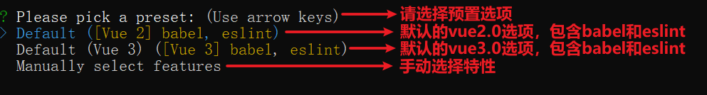
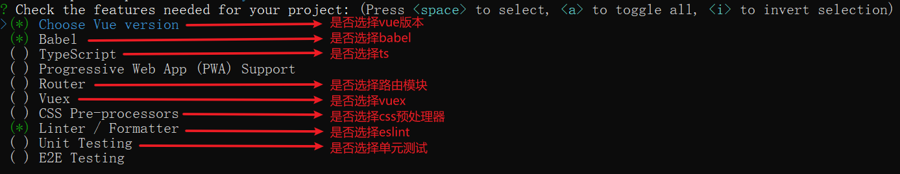
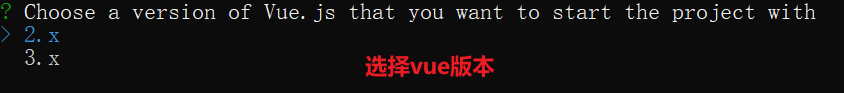
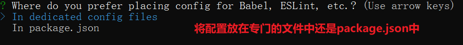
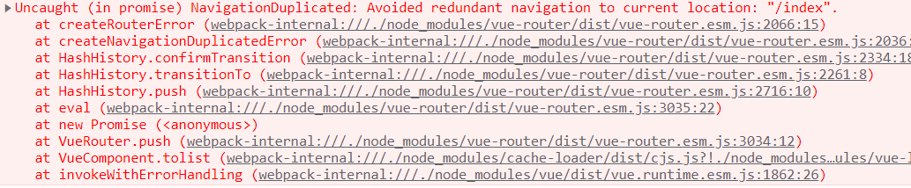

# 脚手架和路由

## 脚手架

### 概念

脚手架是为了更加快速的架构整个项目的结构和基础业务，开发者开发出来的一个工具。利用该工具可以执行一行命令就将项目的结构以及基础的业务架构好。

express有脚手架，可以快速搭建后端接口项目的结构，以及基础的用户请求模块。。。

vue也有vue的脚手架，可以快速搭建vue项目的结构和基础业务。。。

vue的脚手架：

- vue-cli - 旧版，现在基本不用
- @vue/cli - 新生代，现在还有很多在用，也有人在用更新的

### 脚手架的使用

下载安装：

```shell
npm i @vue/cli -g
```

检查版本：

```shell
vue --version # 简写 vue -V(大写)
```

创建项目：

```shell
vue create 项目名称（用英文）
```

 

  

 

 

 

当使用npm多次下载失败的时候，cnpm比npm牛逼，yarn更牛逼，用流量是万能的。

### 项目目录结构

public存放了一个现在正运行的index.html，不要改动

src项目主要文件夹：

assets存放静态资源的文件夹

components存放所有组件的文件夹

App.vue根组件，将来我们自己写的其他组件最终都会在这个根组件中显示

main.js项目入口文件，默认显示根组件是这个文件配置的

### 项目运行

进入项目目录执行命令：

 ```shell
npm run serve
 ```

这个命令是在开发阶段使用的，我们看到的页面是将代码打包到内存中运行的。

当项目开发完成以后，项目需要打包，将打包好的文件上线，此时需要执行打包命令：

```shell
npm run build	
```

### 单文件组件

vue项目其实是一个单页面应用程序，所有的文件互相引入，最终都被引入到了一个文件中main.js中，然后这个文件被打包好，引入到public下的index.html中使用。

我们通过脚手架创建的项目结构中，src文件夹下大多都是vue后缀的文件，这种文件其实都被引入到其他文件中使用了，一个vue文件属于一个独立的组件，我们称之为单文件组件。

单文件组件中要求要有3部分内容：

- emplate标签 - 写html结构
- script标签 - 写当前组件中的逻辑
- style标签 - 写当前组件中的样式

例如：App.vue

### eslint规范

- 每行结束不允许加分号
- 函数定义的小括号左右要有空格
- 分支语句的小括号和大括号左右要有空格
- 箭头函数的箭头和小括号以及大括号左右要有空格
- 键值对的冒号和值之间要有空格
- 循环语句的小括号和大括号左右要有空格
- for循环语句小括号中的三要素之间要有空格
- js中所有引号使用单引号
- 运算符左右要有空格
- template、script和style标签之间要有空行
- 所有导入文件的语句要放在代码最前面
- 缩进等同于2个空格，不能是1个和4个
- 数组和对象的值之间要有空格
- 文件末尾要有空行

## 路由

### 介绍

路由指的是页面显示的内容跟请求使用的路径之间的对应关系。例如：我们在nodejs后端项目中，指定某个路径来请求，响应对应的内容，就叫路由。

路由分为两种：前端路由和后端路由。

后端通过请求路径和内容对应，前端路由通过事件触发控制不同的内容显示。

### 前端路由实现

前端路由通常有两种：hash模式和history模式。

### hash模式

hash使用锚点控制不同的内容显示。

页面监听锚点变化，当锚点发生变化的时候，让对应的内容显示。事件名 - hashchange

例：

```html
<body>
    <a href="#/index">首页</a><hr>
    <a href="#/list">列表页</a><hr>
    <a href="#/detail">详情页</a><hr>

    <div id="route-view"></div>
</body>

<script type="text/javascript">
    // 获取元内容素
    var ctn = document.getElementById('route-view')
    // 默认渲染
    render('/index')
    // 监听hashchange事件
    window.addEventListener('hashchange',function(){
        render(location.hash.slice(1))
    })
    function render(router){
        switch (router) {
            case '/index':
                ctn.innerHTML = '这是首页'
                break;
            case '/list':
                ctn.innerHTML = '这是列表页'
                break;
            case '/detail':
                ctn.innerHTML = '这是详情页'
                break;
            default:
                ctn.innerHTML = '404页面'
            break;
        }
    }
</script>
```

### history模式

history模式通过监听历史记录切换，然后更改当前地址实现路由跳转。事件类型 - popstate。

改变当前地址 - history.pushState()

例：

```html
<body>
<button class="index" href="/index">首页</button>
<button class="list" href="/list">列表页</button>
<button class="detail" href="/detail">详情页</button>
<div id="app">
    内容区域
</div>
</body>
<script>
var btns = document.querySelectorAll('button');
for(var i=0;i<btns.length;i++){
    btns[i].onclick = function(){
        var link = this.getAttribute('href')
        history.pushState({link},null,link)
        render(link)
    }
}
function render(link){
    switch(link){
        case '/index':
            app.innerHTML = '<h1>这是首页</h1>';
        break;
        case '/list':
            app.innerHTML = '<h1>这是列表页</h1>';
        break;
        case '/detail':
            app.innerHTML = '<h1>这是详情页</h1>';
        break;
    }
}
window.addEventListener('popstate',(e)=>{
    console.log(666);
    render(location.pathname)
})
render('/index')
</script>
```

注意：对于历史记录的监听和更改，必须在服务器环境访问有效。

### VueRouter

vue-router是vue.js官方提供的路由管理器，让vue在实现单页面应用程序的时候，变得更加简单。作用就是指定当前是哪个锚点，需要在页面加载哪个组件。提供一套指路的路由规则。

#### 基本使用

下载安装：

```shell
npm i vue-router -S
```

在src中新建router文件夹，用于写路由文件。在router中新建index.js来创建路由配置文件：

```js
// 1.导入vue和vue-router
import Vue from "vue"
import VueRouter from "vue-router"
// 4.导入单文件组件
import Friend from "@components/Friend"
import Music from "@components/Music"
// 2.通过vue使用VueRouter - 让VueRouter在vue中生效
Vue.use(VueRouter)
// 3.配置路由规则
const routes = [
  {
    path: '/friend',
    component: Friend
  },
  {
    path: '/music',
    component: Music
  }
]
// 5.定义路由对象
const router = new VueRouter({
  routes,
  // 切换路由模式，默认是hash
  mode: 'history'
})
// 6.导出路由对象
export default router
```

在main.js入口文件中配置路由并使之生效

```js
import Vue from 'vue'
import App from './App.vue'
// 导入路由对象
import router from '@router/index'

Vue.config.productionTip = false

new Vue({
  render: h => h(App),
  // 将路由对象配置到vue实例中
  router
}).$mount('#app')
```

在组件中放置路由出口 - 显示某个路由组件的内容

```html
<router-views></router-views>
```

定义两个路由对应的单文件组件。然后就可以在浏览器中通过锚点来访问了。

#### 导航方式

含义：从一个地址跳转到另一个地址/从一个组件切换到另一个组件。

##### 声明式导航

含义：通过点击链接跳转的方式，比如html中的a标签。

声明式导航的原理就是a标签，只是在vue中，对a标签进行组件封装，语法如下：

```html
<router-link to="/index">首页</router-link>
```

当点击这个链接的时候，就能将地址栏中的锚点换成`#/index`

如果需要传参，直接将参数跟在地址的`?`后面


还可以使用v-bind指令：

```html
<router-link :to="{path: '/index'}">首页</router-link>
```

这种方式要传参的话，可以在对象中添加`query`属性：

```html
<router-link :to="{path: '/index', query: {id: 10}}">首页</router-link>
```


参数数据传递到另一个组件中， 不同的传递方式，接收数据的时候方式也是不同的，通过地址后加`?`和path配合query传的数据，在组件的方法中使用以下方式接收：

```js
this.$route.query
```

在模板中使用以下方式接收：

```html
{{$route.query}
```


默认情况下，`router-link`标签编译成html以后就是a标签，但是vue给`router-link`标签提供了一个属性，可以让`router-link`标签编译成其他标签，这个属性叫`tag`，例：

```html
<router-link :to="{path: '/index', query: {id: 10}}" tag="p">首页</router-link>
```

点击同样可以切换组件，可是编译后的标签却不是a标签，而是指定的p标签。不用a标签的好处就是能灵活的设置样式。

##### 编程式导航

含义：通过js跳转。

语法如下：

```js
this.$router.push("/login"); // 传参也可以在地址后面加?加参数
this.$router.push({path: "/login"});
this.$router.push({path: '/login', query: {id: 10}});
this.$router.go(n); // 使用方式跟history.go()一样
this.$router.back(); // 返回上一个页面
```

如果使用编程式导航跳转到当前页的时候，会有一个报错提示，但不影响效果：

 

  如果不想让这个报错发生，可以在路由配置文件：`router/index.js`中配置屏蔽这个错误：

```js
// 该段代码不需要记，理解即可
const originalPush = VueRouter.prototype.push;
VueRouter.prototype.push = function push(location) {
    return originalPush.call(this, location).catch((err) => err);
};
```

#### 命名路由

含义：给路由定义名称，有名称的路由。

当一个路由又了名称之后，我们在跳转的时候就可以使用路由的名称来指定跳转哪个路由。

给路由指定名称使用name键：

```js
const routes = [
    {
        name: 'index',
        path: '/index',
        component: Index
    },
    {
        name: 'list',
        path: '/list',
        component: List
    },
    {
        path: '/detail',
        name: 'detail',
        component: Detail
    }
]
```

跳转时，通过路由名称跳转：

```html
<router-link :to="{name: 'index'}">首页</router-link>
```

如果要传递参数，必须使用params键配合name键：

```html
<router-link :to="{name: '/index', params: {id: 10}}">首页</router-link>
```

编程式导航中也可以使用命名路由：

```js
this.$router.push({name: 'login‘);
this.$router.push({name: 'login', params: {id: 10}});
```


使用name配合params传值的，在组件的方法中使用以下方式接收：

```js
this.$route.params
```

在模板中使用以下方式接收：

```html
{{$route.params}}
```


#### 路由重定向

含义：将原本要跳转的路由，强制跳转到另一个路由中。例如：我们要请求到购物车页面，但是没有登录，就会被强制跳转到登录页面。也就是当我们访问路由`/cart`，但浏览器会将url替换成`/login`

实现方式：在路由规则中添加redirect键，值为新的路由。

语法如下：

```js
const routes = [
    {
        path: '/cart',
        redirect: '/login'
    }
]
```

上面代码表示，当访问`/a`路由的时候，会被强制跳转到`/login`路由

redirect的值可以是一个指定的路由地址，也可以指定路由的名称：

```js
const routes = [
    {
        path: '/cart',
        redirect: {
            name: 'login'
        }
    },
    {
        path: '/login',
        name: 'login',
        component: Login
    }
]
```


#### 路由嵌套

在实际的项目中，很多组件中的内容也都是由多个小模块组成的，每个小模块可以当做是一个组件，每个组件可以对应一个路由。

一个项目由多个组件组成，每个组件都可以通过路由访问到。

每个组件由多个小组件组成，每个小组件也可以通过路由访问到。

这样就形成了路由的嵌套了。路由嵌套通过路由对象的children键设置。语法如下：

```js
const routes = [
    {
        path: '/user',
        component: User
        children: [
            {
                path: 'index',
            	component: UserIndex
            },
            {
                path: 'add',
            	component: UserAdd
            },
            {
                path: 'edit',
            	component: UserEdit
            }
        ]
    },
    {
    	path: '/goods',
        component: Goods
    }
]
```

上面的规则表示，当访问`/user`路由的时候，显示User组件，当访问`/user/add`路由的时候，就可以在User组件中显示UserAdd组件，当访问`user/index`路由的时候就可以在User组件中显示UserIndex组件。。。

使用时需要在组件中添加显示子组件视图的标签。

子路由在定义的时候path路径中不能包含`/`，否则代表从根路由开始

例：

定义上面的路由规则。创建Goods组件和User组件，User组件内容如下：

```html
<template>
    <div>
        <h3>用户页</h3>
        <router-view></router-view>
    </div>
</template>

<script>
export default {
    
}
</script>

<style scoped>

</style>

```

分别创建User组件文件、Goods组件文件、UserIndex组件、UserAdd组件、UserEdit组件，然后在浏览器中通过路径访问。


#### 404路由

含义：当访问的路径在所有路由配置中都找不到，在浏览器中会报错，为了给用户有更好的体验感，我们可以指定，当匹配不到路由的时候，显示一个比较友好的提示。

使用方式，就是在路由配置的最下面，添加path键为`*`的路由，交给指定的组件来处理

vue中的路由是从上到下匹配的，匹配不到路由，是从上到下将所有路由都进行匹配过才得到的，所以404路由会在所有路由的最下面。

例：

```js
const routes = [
    { path: "/about", component: About },
    { path: "/news", component: News },
    // 404路由
    { path: "*", component: NotFound },
];
```


#### 动态路由匹配

含义：动态路由指的是在路由规则中，有部分的规则是动态的，会发生变化的，不是固定的值。这种路由就叫做动态路由。

动态路由主要是针对于restful的。

路由定义语法：

```js
// 传递参数id
var router = new VueRouter({
    // routes是路由规则数组 
    routes: [
        { path: '/user/:id', component: User },
        // 此处的“:”只是在声明的时候写，在使用的时候不需要写“:”
    ]
})
```

获取动态路由传递的参数：

```js
// 组件视图中获取id值（html-vue形式组件）
const User = {
    template: '<div>User ID is {{$route.params.id}}</div>'
}
```

可选参数的定义：

```js
{ path: "showdetail/:id?", component: ShowDetail },
```

