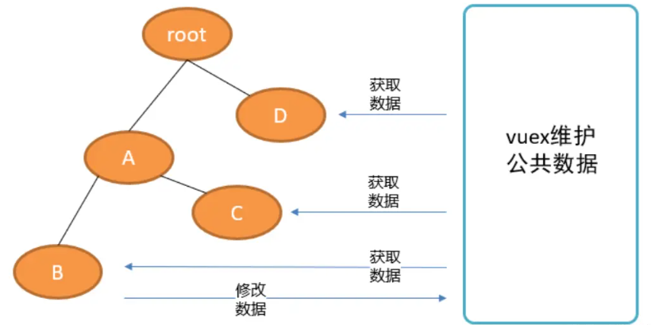

# vuex

## 介绍

在企业开发的项目当中，通常组件非常多，都是错综复杂的，如果用之前学习的组件传值方式，进行数据传递的话，会让项目变得臃肿且难以维护，所以vue提供了相关的模块，专门来维护整个项目的数据。

vuex可以让各个组件之间共享数据。

 

## 使用

### 下载安装

vue2和vuex3配合

vue3和vuex4配合

```shell
npm i vuex
```

### 创建模块

在项目文件夹下的src文件件下新建文件夹store，在store文件夹中新建index.js作为vuex的配置文件，代码如下：

```js
import Vue from 'vue'

import vuex from 'vuex'

Vue.use(vuex)
const store = new vuex.Store({
  // vuex中有5个配置
  state: {
   
  },
  mutations: {
    
  },
  actions: {

  },
  getter: {

  },
  modules: {

  }
})
export default store

```


### 使用模块

在入口文件main.js中使用vuex模块，两个步骤：

1. 导入模块

   ```js
   import store from '@/store/index'
   ```

   

2. 挂在到vue根实例中

   在实例中使用store键，值为导入的vuex模块

入口文件的完整代码如下：

```js
import Vue from 'vue'
import App from './App.vue'
import router from '@/router/index'
import store from '@/store/index'
Vue.config.productionTip = false

new Vue({
  render: h => h(App),
  router,
  store
}).$mount('#app')
```


### 组件中操作

在子组件中对于vuex的使用，有两种方式：

1. 直接使用或调用
2. 导入使用

## 属性介绍

### state

vuex中state配置，用来设置所有组件共享的数据，和vue实例中的data属性语法一样，只是这里的数据是所有子组件都可以访问的，例：

vuex的state配置：

```js
state: { // 类似于vue组件中的data数据
    num: 5
},
```

子组件中的使用：

1. 直接使用：

   - vue的方法中：

     ```js
     created () {
         // 组件中使用
         console.log(this.$store.state.num)
       },
     ```

     

   - 模板中：

     ```html
     <div>数据：{{$store.state.num}}</div>
     ```

     

2. 导入使用：

   - 导入

     ```js
     import { mapState } from 'vuex'
     ```

     注意：导入的时候，导入vuex，需要将state解构为mapState

   - 挂载

     ```js
     computed: {
         ...mapState(['num'])
       },
     ```

     注意：挂载的时候，必须通过`...`运算符将数据展开，且必须挂载到computed属性中作为数据，方法中数组中，写的是state中定义的数据的键，这个键就作为数据的键了。

   - 使用

     ```html
     <i>{{num}}</i>
     ```

一个子组件中是这样操作的，其他子组件中都可以这样操作，因为vuex的数据是所有子组件共享的。

### getters

getters配置用来定义共享的数据的过滤器，和vue中的filter意义是一样的，在getter中定义过滤器其实就是在getters中定义过方法，例：

vuex中的getters配置：

```js
getters: {
    tofix (state) {
        return state.num.toFixed(3)
    }
}
```

子组件中的使用：

1. 直接使用
   - vue方法中使用

     ```js
     created () {
         this.num1 = this.$store.getters.tofix
     }
     ```

     

   - 模板中使用

     ```html
     <p><span>模板使用：</span>{{$store.getters.tofix}}</p>
     ```

   把getters中的方法名称，当做数据使用即可。
2. 导入使用
   - 导入

     ```js
     import {mapGetters} from 'vuex'
     ```

     

   - 挂载

     ```js
     computed: {
         ...mapGetters(['tofix'])
     },
     ```

     

   - 使用

     ```html
     <p><span>导入使用：</span>{{tofix}}</p>
     ```

     

### mutations

mutations配置用来定义操作state数据的方法，也就是说，子组件不能修改state中的数据，若必须要修改，就需要使用mutations中的方法。mutations中的方法对于state数据的修改，操作是同步的。例：

vuex中的mutations配置：

```js
mutations: {
    addOne (state) { // 不带参数
        state.num += 1
    },
    reduceTwo (state, n) { // 带参数
        state.num -= n
    }
}
```

子组件中的使用：

1. 直接使用
   - vue方法中使用不传参

     ```html
     <p @click="add">点击增加num</p>
     
     methods: {
         add () {
         	this.$store.commit('addOne')
         },
     }
     ```

     

   - vue方法中使用传参

     ```html
     <p @click="reduce(2)">点击减少num</p>
     
     methods: {
         reduce (n) {
         	this.$store.commit('reduceTwo', n)
         }
     }
     ```

2. 导入使用
   - 导入

     ```js
     import {mapMutations} from 'vuex'
     ```

     

   - 挂载

     ```js
     methods: {
         ...mapMutations(['addOne', 'reduceTwo'])
     }
     ```

     mutations是挂载到methods中，挂载以后就相当于当前实例也有了数组中的方法了。

   - 使用

     ```js
     <p @click="add">增加值</p>
     <p @click="reduce(2)">减少值</p>
     
     methods: {
         ...mapMutations(['addOne', 'reduceTwo']),
         add () {
             this.addOne()
         },
         reduce (n) {
             this.reduceTwo(n)
         }
     }
     ```

     

### actions

actions配置用来定义操作state数据的方法，跟mutations的作用一样，但是如果碰到异步的修改就必须使用actions中的方法实现，actions中的方法对于state数据的修改，操作是异步的。

actions中和mutations中语法一样，都是定义方法，但actions中的方法最终对于数据的修改一定是在调用mutations中的方法实现的，例：

vuex中的actions配置：

```js
actions: {
    asyncAddFour (store) {
        setTimeout(() => {
            store.commit('add')
        }, 2000)
    },
        asyncReduceFive (store, n) {
            setTimeout(() => {
                store.commit('reduce', n)
            }, 3000)
        }
}
```

子组件中的使用：

1. 直接使用
   - vue方法中使用不传参

     ```html
     <button @click="add">加4</button>
     
     methods: {
     	add () {
     		this.$store.dispatch('asyncAddFour')
     	}
     }
     ```

     

   - vue方法中使用传参

     ```html
     <button @click="reduce(5)">减5</button>
     
     methods: {
         reduce (n) {
         	this.$store.dispatch('asyncReduceFive', n)
         }
     }
     ```

2. 导入使用
   - 导入

     ```js
     import {mapActions} from 'vuex'
     ```

     

   - 挂载

     ```js
     methods: {
         ...mapActions(['asyncAddFour', 'asyncReduceFive'])
     }
     ```

     actions也是挂载到methods中，挂载后就相当于当前实例中有了数组中的两个方法了。

   - 使用

     ```html
     <button @click="add">加4</button>
     <button @click="reduce(5)">减5</button>
     
     methods: {
         ...mapActions(['asyncAddFour', 'asyncReduceFive']),
         add () {
         	this.asyncAddFour()
         },
         reduce (n) {
         	this.asyncReduceFive(n)
         }
     }
     ```

为什么有了mutations还会有actions呢？因为mutations也可以进行异步修改，但是在调试工具中数据显示不准确，所以用actions能解决这个数据显示不准确的问题。

### modules

modules配置，用来将vuex中的数据进行模块化，方便我们更好的分类管理vuex中的数据。

如果我们项目较大，数据较多，操作也比较多，操作的人也比较多，可能会有很多的方法或数据名称产生冲突。比如有user数据和goods数据，都需要很多方法来操作，那就可以将vuex中的对于user和goods的数据分模块管理。

使用步骤：

在store文件夹中新建文件夹modules，在modules文件夹中新建user.js和goods.js文件，这两个文件中，导出vuex的配置即可，代码如下：

```js
export default {
    namespaced: true,
    state: {
        list: []
    },
    getters: {},
    mutations: {},
    actions: {}
    // 在这里只要4个配置不需要module配置
}
```

多个模块之间的方法名称和数据名称可能会产生冲突，为了避免冲突发生，我们会给单个的模块设置命名空间来解决这个问题，命名空间类似于是一个虚拟的作用域。

然后在store的index.js中导入这两个文件，并配置在index.js的modules中，代码如下：

导入：

```js
import user from './modules/user'
import goods from './modules/goods'
```

配置：

````js
modules: {
    user, // 配置中的键为命名空间，值为导入的数据
    goods 
}
````

配置模块时，键为命名空间名称，也就是虚拟出来的作用域，这个在组件中使用的时候，会用到，如果不单独指定命名空间名称的话，默认的命名空间名称就是导入的模块名称。

如果没有命名空间，就可能会产生冲突，产生冲突后，vuex有合并原则可以解决问题，但是合并原则解决不了getters冲突的问题：

其他4个配置发生冲突以后，会将多个同样的数据或方法一起访问，但getters冲突后会报错；

发生冲突后，默认会先执行文件名称为index的代码，然后才找其他文件的代码执行(名字叫index的文件，在冲突发生后，会优先执行)

使用：

- state
  - this形式：this.$store.state.空间名.xxxx
  - map系列：...mapSate(空间名,[xxxx,yyyy,zzzz...])
- mutations
  - this形式：this.$store.commit("空间名/方法名", "参数");
  - map系列：...mapMutations("空间名",["方法名",...]),
- actions
  - this形式：this.$store.dispatch("空间名/方法名", "参数");
  - map系列：...mapActions("空间名",["方法名",...]),
- getters
  - this形式：this.$store.getters["空间名/属性名"]
  - map形式：...mapActions("空间名", ["属性名",....]),