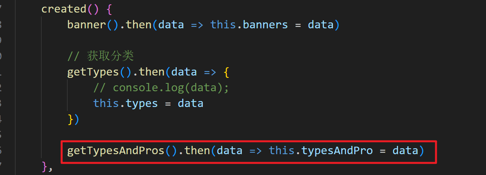
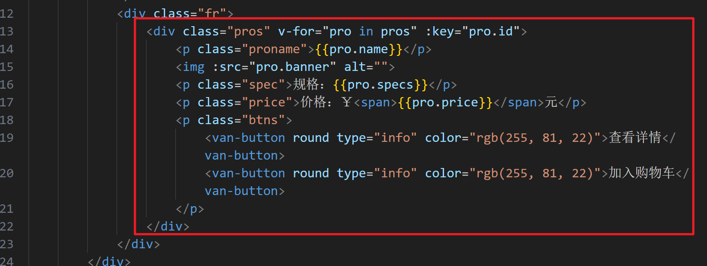
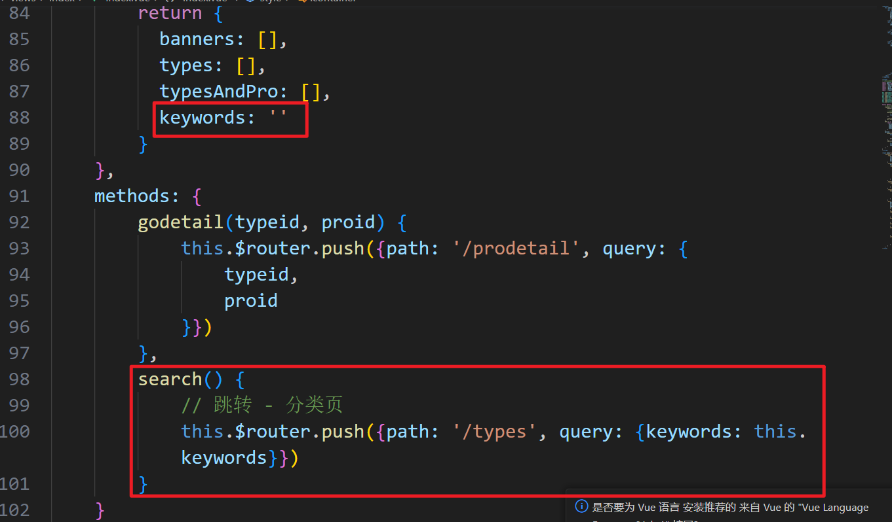

# shop

## 删除无用文件和代码

搭建项目后，进入这个项目文件夹，将App.vue中没有用的内容删除：

 

将views中默认创建好的HomeView文件和AboutView文件删除，将components中的HelloWorld文件删除。

 

将路由文件中的默认路由规则删除：

 

## 切换项目启动端口号

如果我们的项目，使用的端口号不要默认的8080，就在vue.config.js中配置：

 

当我们重新启动项目后，就使用这个端口号访问项目了。

## 配置路由

配置路由规则：

```js
const routes = [
  // 5个路由
  {
    // 首页
    path: '/',
    redirect: '/index'
  },
  {
    path: '/index',
    component: Index,
    // 商品详情子路由
    children: [
      {
        path: 'prodetail',
        component: Prodetail
      }
    ]
  },
  {
    // 分类
    path: '/types',
    component: Types
  },
  {
    // 购物车
    path: '/cart',
    component: Cart
  },
  {
    // 视频
    path: '/video',
    component: Video
  },
  {
    // 我的
    path: '/my',
    component: My,
    // 用户详情
    children: [
      {
        path: 'detail',
        component: UserDetail
      },
      {
        path: 'address',
        component: UserAddress
      }
    ]
  }
]
```

路由规则中使用的组件，在路由规则上方导入：

```js
// 导入组件
import Index from '@/views/Index'
import Prodetail from '@/views/Index/Prodetail'
import Types from '@/views/Types'
import Cart from '@/views/Cart'
import Video from '@/views/Video'
import My from '@/views/My'
import UserDetail from '@/views/My/UserDetail'
import UserAddress from '@/views/My/UserAddress'
```

组件还都没有创建：

 

给所有文件都添加内容：

 

测试主路由，没问题。

## 首页

### 配置vant

打开vant官网，切换到版本2，复制了下载命令，执行了。

 

使用官网推荐的引入方式：

 

 

测试使用了button，

 

发现不行，重启项目ok。

 

### 搭建页面

第一部分，是顶部logo，需要图片，给assets中放入了图片

 

#### 顶部

创建了div，设置样式。

 

 

有效果了。

 

#### 搜索框

到vant中找对应的组件(https://vant-contrib.gitee.io/vant/v2/#/zh-CN/search)，使用：

 

复制了结构

 

效果就好了

 

#### 轮播图

找轮播图组件：https://vant-contrib.gitee.io/vant/v2/#/zh-CN/swipe

复制了引入：

 

复制了结构：

 

复制了样式

 

我们发现我们需要的不是 1 2 3 4，我们要图片，接口中才有图片提供，需要发请求

启动后端服务器。找到data.json所在文件夹，json-server启动它：

```shell
json-server data.json
```

 

发请求需要用axios，下载安装axios。

在项目文件夹中

 

在根组件中导入axios，并将axios作为vue实例原型上的方法

 

在首页组件文件中发请求。在created中发送请求：

 

根据数据渲染页面，并设置样式和属性

 

样式修改了

 

## 配置axios

在src新建request文件夹，下新建index.js文件，给axios做配置

```js
// 导入axios
import axios from 'axios'

// 全局基准地址配置
axios.defaults.baseURL = 'http://localhost:3000';

// 添加请求拦截器
axios.interceptors.request.use(function (config) {
    // 在发送请求之前做些什么
    return config;
  }, function (error) {
    // 对请求错误做些什么
    return Promise.reject(error);
  });

// 添加响应拦截器
axios.interceptors.response.use(function (response) {
    // 2xx 范围内的状态码都会触发该函数。
    // 对响应数据做点什么
    return response.data;
  }, function (error) {
    // 超出 2xx 范围的状态码都会触发该函数。
    // 对响应错误做点什么
    return Promise.reject(error);
});

// 导出配置好的axios
export default axios
```

希望在组件中使用的是配置好的axios，就在根组件导入配置好axios，在main.js修改axios的导入

 

修改首页组件中发请求的代码：

 

封装发请求的函数，在request下新建了request.js，导出封装的函数

 

在首页组件中使用他：

 

 

main.js中给原型上添加的axios没有用了，删除

 

为了方便使用接口，将请求地址封装在一个文件中了：

 

在封装请求函数的文件中，导入地址

 


# 首页

## 所有分类

封装获取所有分类的函数，在request/request.js

 

在首页组件中，导入这个函数

 

在created中发送请求获取数据，将请求回来的数据作为自己组件的数据

 

渲染页面，使用vant中的宫格：

导入

 

复制了模板

 

修饰了样式

 

页面ok

 

## 分类和商品

封装获取所有分类和商品的函数，在request/request.js中：

 

首页组件中，解构进来

 

在created中发请求，获取数据，作为自己组件的数据

 

渲染页面，使用了vant中的button

 

页面结构

 

修饰样式

```scss
.pros{
    border: 1px solid #ccc;
    margin: 5px;
    border-radius: 5px;
    padding: 10px;
    p{
        text-align: center;
    }
    img{
        width: 100%;
        height: 100%;
        border-radius: 5px;
    }
    p.proname{
        font-weight: bold;
        font-size: 16px;
    }
    p.spec{
        color: #999;
    }
    p.price{
        color: #f00;
        span{
            font-weight: bold;
            font-size: 20px;
        }
    }
    p.btns{
        display: flex;
        justify-content: space-around;
        .van-button{
            width: 200px;
        }
    }
}
```

页面搞定

 

## 底部

使用vant中导航组件。

导入：

 

复制模板，将他修改成遍历

 

定义数据：其中的active和footerNav是我们刚刚定义的。

```js
data () {
    return {
        banners: [],
        types: [],
        typesAndPro: [],
        active: 0,
        // 定义底部导航名称
        footerNav: [
            {
                name: '首页',
                id: 1,
                icon: 'home-o',
                url: '#/index'
            },
            {
                name: '分类页',
                id: 2,
                icon: 'label-o',
                url: '#/types'
            },
            {
                name: '视频',
                id: 3,
                icon: 'video-o',
                url: '#/video'
            },
            {
                name: '购物车',
                id: 4,
                icon: 'cart-o',
                url: '#/cart'
            },
            {
                name: '用户',
                id: 5,
                icon: 'manager-o',
                url: '#/my'
            },

        ]
    }
},
```

页面效果

 

## 底部封装

每个页面都要使用底部，就将底部封装为公共组件

将底部代码放在components下的FooterNav文件

 

改变active的值，active 的值是多个组件公共使用的，就使用了vuex

 

在底部组件中将vuex数据放进去，并在created阶段修改

```js
import Vue from 'vue';
import { Tabbar, TabbarItem } from 'vant';
import {mapState} from 'vuex'

Vue.use(Tabbar);
Vue.use(TabbarItem);
export default {
    created() {
        // 获取当前路径
        // console.log(this.$route);
        // console.log(this.$route.path);
        let currentPath = this.$route.path
        // 找下标
        let index = this.footerNav.findIndex(item => item.url === '#' + currentPath)
        // 将index赋值为当前数据index
        this.index = index
        // 改变vuex中的active
        this.$store.commit('changeActive', this.index)

    },
    computed: {
        // ...mapState(['active'])
        active: {
            get() {
                return this.$store.state.active
            },
            set() {
                this.$store.commit('changeActive', this.index)
            }
        }
    },
    data () {
        return {
            index: 0,
            // 定义底部导航名称
            footerNav: [
            {
                name: '首页',
                id: 1,
                icon: 'home-o',
                url: '#/index'
            },
            {
                name: '分类页',
                id: 2,
                icon: 'label-o',
                url: '#/types'
            },
            {
                name: '视频',
                id: 3,
                icon: 'video-o',
                url: '#/video'
            },
            {
                name: '购物车',
                id: 4,
                icon: 'cart-o',
                url: '#/cart'
            },
            {
                name: '用户',
                id: 5,
                icon: 'manager-o',
                url: '#/my'
            },
            
            ]
        }
    },
    methods: {
        
    }
}
```

效果实现了，但是有瑕疵，页面能跳转，底部不变了，使用导航守卫中的前置导航。

router/index.js中，添加了前置守卫

 

搞定。

# 分类页

## 顶部

引入：

```js
import Vue from 'vue';
import { Search } from 'vant';
Vue.use(Search);
```

粘贴模板：

```html
<div class="search">
    <van-search placeholder="请输入搜索关键词" />
</div>
```

## 左侧

引入：

```js
import { Sidebar, SidebarItem } from 'vant';
import {getTypes} from '@/request/request.js'

Vue.use(Sidebar);
Vue.use(SidebarItem);
```

在created阶段发请求，并将数据作为自己的数据：

 

 

模板显示：

 

## 右侧

封装请求函数getPros

 

引入：

 

发请求：

 

定义数据：

 

模板显示：

 

分类页所有样式：

```scss
.fl{
    float: left;
    position: fixed;
    top: 50px;
    left: 0;
}
.fr{
    float: right;
    margin-right: 20px;
}
.search{
    position: fixed;
    left: 0;
    top: 0;
    width: 100%;
    height: 50px;
    z-index: 99999999999;
}
.pros{
    width: 350px;
    border: 1px solid #ccc;
    margin: 5px;
    border-radius: 5px;
    padding: 10px;
    p{
        text-align: center;
    }
    img{
        width: 100%;
        height: 100%;
        border-radius: 5px;
    }
    p.proname{
        font-weight: bold;
        font-size: 16px;
    }
    p.spec{
        color: #999;
    }
    p.price{
        color: #f00;
        span{
            font-weight: bold;
            font-size: 20px;
        }
    }
    p.btns{
        display: flex;
        justify-content: space-around;
        .van-button{
            width: 200px;
        }
    }
}
```

# 视频页

封装发请求的函数：

 

vue组件页面代码：

```vue
<template>
    <div class="container">
        <van-swipe :show-indicators="false" style="height: 100%; width: 100%;" vertical>
            <van-swipe-item v-for="video in videos" :key="video.id">
                <video :src="video.url" autoplay></video>
            </van-swipe-item>
        </van-swipe>
    </div>
</template>

<script>
import Vue from 'vue';
import { Swipe, SwipeItem } from 'vant';
import {getVideo} from '@/request/request.js'

Vue.use(Swipe);
Vue.use(SwipeItem);
export default {
    created() {
        getVideo().then(data => this.videos = data)
    },
    data () {
        return {
            videos: []
        }
    },
    methods: {
        
    }
}
</script>

<style lang="scss" scoped>
html,body{
    width: 100%;
    height: 100%;
}
#app{
    height: 100%;
}
.container{
    height: 100%;
}
.van-swipe{
    >div{
        height: 100% !important;
        .van-swipe-item{
            width: 100%;
            height: 100% !important;
            video{
                width: 100%;
                height: 100%;
            }
        }
    }
}
    
</style>

```

# 注册页

封装注册函数：


注册页代码：

```vue
<template>
    <div>
        <h1 style="text-align:center;">注册</h1>
        <van-form @submit="onSubmit">
            <van-field
                v-model="username"
                name="username"
                label="用户名"
                placeholder="用户名"
                :rules="rules.username"
            />
            <van-field
                v-model="password"
                type="password"
                name="password"
                label="密码"
                placeholder="密码"
                :rules="rules.password"
            />
            <van-field
                v-model="repass"
                type="password"
                name="repass"
                label="确认密码"
                placeholder="确认密码"
                :rules="rules.repass"
            />
            <van-field
                v-model="email"
                name="email"
                label="邮箱"
                placeholder="邮箱"
                :rules="rules.email"
            />
            <van-field
                v-model="tel"
                name="tel"
                label="手机号"
                placeholder="手机号"
                :rules="rules.tel"
            />
            <div style="margin: 16px;">
                <van-button round block type="info" native-type="submit">提交</van-button>
            </div>
        </van-form>
    </div>
</template>

<script>
import Vue from 'vue';
import { Form, Field, Button } from 'vant';
import {register} from '@/request/request.js'
import { Toast } from 'vant';

Vue.use(Toast);
Vue.use(Form);
Vue.use(Field);
Vue.use(Button);
export default {
    data () {
        return {
            rules: {
                username: [
                    { required: true, message: '请填写用户名' }
                ],
                password: [
                    { required: true, message: '请填写密码' }
                ],
                repass: [
                    { required: true, message: '请再次填写密码' }
                ],
                email: [
                    {pattern: /^([1-9]\d{4,9}@qq\.com|[a-zA-Z]\w{5,17}@((126|163)\.com|yeah\.net))$/, message: '请输入正确的邮箱'}
                ],
                tel: [
                    {pattern: /^1[3-9]\d{9}$/, message: '请输入正确的手机号'}
                ]
            },
            username: '',
            password: '',
            repass: '',
            tel: '',
            email: ''
        }
    },
    methods: {
        onSubmit(values) {
            // console.log('submit', values);
            delete values.repass
            register(values).then(data => {
                // console.log(data);
                Toast.success({
                    message: '注册成功',
                    onClose: () => {
                        this.$router.push('/login')
                    }
                });
            })
        },
    }
}
</script>

<style>
    
</style>

```

# 登录页

将注册页粘贴到登录页，删除确认密码、邮箱、手机号 的 模板+规则+数据

将调用的register函数换成login，将导入的register函数换成导入login函数。

定义login函数：

 

提交表单后，需要做判断：

 


# 电商demo功能

## 搜索功能

给搜索框，添加了v-model，双向绑定一个数据 - 将来获取输入的关键字

给搜索框绑定了事件(keyup.enter) - 事件函数search - 发请求

封装发请求函数 - request/request.js

 

在search函数中调用函数，得到数据，赋值给pros数据

 

事件函数发现没有触发 - 使用的不是html的input标签，是vant提供的组件，需要使用vant提供的事件

 

## 点击分类显示对应的所有商品

从vant中找到点击分类要执行的事件 - 给标签添加事件，创建对应的事件函数

 

创建了typePros函数 - 在函数中要发请求，封装了请求函数

 

发请求，给pros数据赋值，就能获取到对应的所有商品，还要判断，如果点击的是全部，就要获取所有的商品

 

将获取所有商品封装成一个方法 - getAllPros

 

在created中，将之前的请求换成这个函数

 

## 首页搜索

给搜索框添加数据绑定和事件

 

新建数据和函数

 

在分类页接收参数，触发搜索事件

 

## 首页点击分类

给分类添加点击事件

 

 

分类页处理

js代码改动较多

```js
export default {
    async created() {
        this.types = await getTypes()
        this.types.unshift({
            id: +new Date(),
            name: '全部'
        })
        this.pros = await getPros()
        // 如果地址栏有keywords数据 - 接收
        let keywords = this.$route.query.keywords
        // console.log(keywords);
        if(keywords) {
            this.keywords = keywords
            this.search()
        }

        // 接收地址栏的typeindex
        let typeid = this.$route.query.typeid
        if(typeid != undefined) {
            this.pros = await getTypePros(typeid)
        }
    },
    data () {
        return {
           activeKey: 0, 
           types: [],
           pros: [],
           keywords: ''
        }
    },
    methods: {
        async search() {
            console.log(666);
            // 发请求获取数据，赋值给数据pros
            this.pros = await searchPros(this.keywords)
            console.log(this.pros);
        },
        // 获取所有商品
        // getAllPros() {
        //     // console.log(222);
        //     getPros().then(data => this.pros = data)
        // },
        typePros(index) {
            console.log(333);
            // console.log(888, index);
            if(index === 0) {
                getPros().then(data => this.pros = data)
                return
            }
            let typeid = this.types[index].id
            getTypePros(typeid).then(data => {
                // console.log(data);
                this.pros = data
            })
        }
    }
}
```

 

 

## 分类页跳转详情

绑定点击事件

 

事件函数：

```js
godetail(proid) {
            // 发请求获取分类id
            /*
            所有分类带商品
            [
                {
                    id: '', - 求分类id
                    name: '分类名称',
                    products: [
                        {
                            id: '', - 已知
                            name: '商品名称'
                        }
                    ]
                },
                {}
            ]
            */
            getTypesAndPros().then(data => {
                // data所有数据
                let typeid = ''
                // 遍历所有数据 - item
                /*
                {
                    id: '', - 求分类id
                    name: '分类名称',
                    products: [
                        {
                            id: '', - 已知
                            name: '商品名称'
                        }
                    ]
                },
                */
                data.forEach(item => {
                    // 从每一个item中找对应的商品数据
                    let pro = item.products.find(v => v.id === proid)
                    /*
                    pro
                    {
                        id: '', - 已知
                        name: '商品名称'
                    }
                    */
                   // 判断pro是否找到
                    if(pro) {
                        // 需要item.id
                        typeid = item.id
                    }
                })
                this.$router.push({path: '/prodetail', query: {
                    typeid,
                    proid
                }})
            })
        },
```

## 添加购物车

绑定事件，添加事件函数

 

事件函数

```js
addcart(pro) {
            // 判断用户是否登录
            let username = getCookie('username')
            if(!username) {
                Toast.fail({
                    message: '请先登录！',
                    onClose:() => {
                        this.$router.push({
                            path: '/login',
                            query: {
                                url: this.$route.path
                            }
                        })
                    }
                });
                return
            }
            // 能加入
            // console.log(pro);
            let clonePro = JSON.parse(JSON.stringify(pro))
            delete clonePro.id
            addcarts({
                ...clonePro,
                proid: pro.id,
                username,
                number: 1
            }).then(data => {
                // console.log(data);
                // console.log('成功');
                Toast.success('购物车添加成功')
            })
        }
```

请求函数

```js
// 加入购物车
export function addcarts(data) {
    // 查 - 是否有当前用户的当前商品id这个数据
    return getCarts().then(item => {
        // 获取当前用户的所有购物车数据 - 从这个数据中找是否有当前商品id的数据
        let currentData = item.find(v => v.proid === data.proid)
        // 判断
        if(currentData) {
            // 让购物车中的数据 ++
            currentData.number++
            // 将这个数据修改 原数据
            console.log(cart + '/' + currentData.id);
            return axios(cart + '/' + currentData.id, {
                method: 'put',
                headers: {
                    'Content-Type': 'application/x-www-form-urlencoded'
                },
                data: currentData
            })
        }
        // 不存在 - 新增
        return axios(cart, {
            method: 'post',
            headers: {
                'Content-Type': 'application/x-www-form-urlencoded'
            },
            data
        })
    })
}
```

## 地址显示和新增

改路由：

```js
{
    path: '/my',
    component: My,
    redirect: '/my/index',
    // 用户详情
    children: [
      {
        // 我的
        path: 'index',
        component: MyIndex,
      },
      {
        path: 'detail',
        component: UserDetail
      },
      {
        path: 'address',
        component: UserAddress
      }
    ]
  },
```

上面有引入MyIndex - 新建了MyIndex

修改My/index.vue文件

 

通过路由进入地址页 - 显示内容，找到vant中的地址列表，

引入

 

复制模板

 

复制数据

 

发请求获取地址数据

 

封装了请求函数

 

新增，修改了模板，让新增和列表不同时显示

 

复制了一些新增的模板、数据、导入

新增点击保存，发请求

 

新增了请求函数

 
