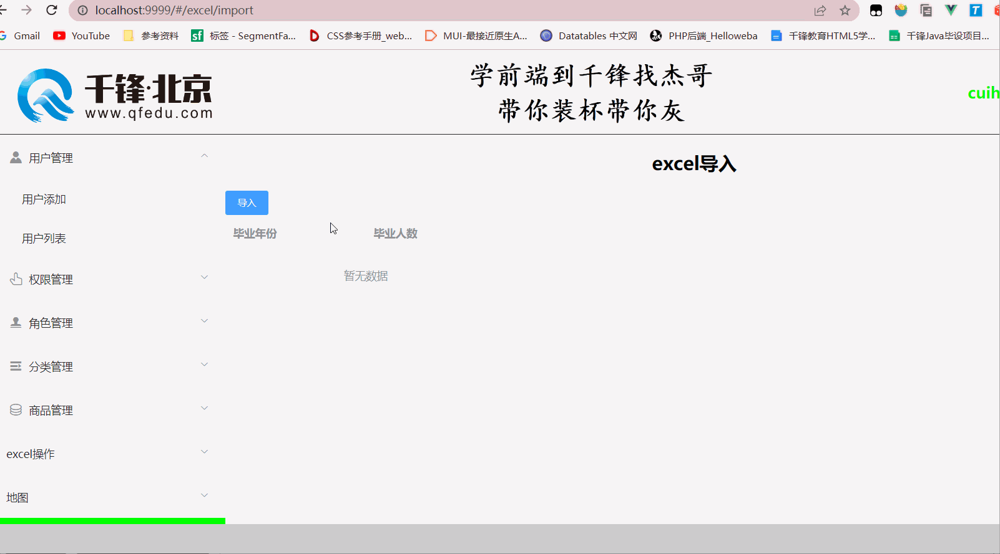

# excel导入

excel导入需要依赖elementui的上传组件，将上传的文件获取到以后，将文件的数据读取出来，解析成json格式，然后转换成我们可以显示的表格数据，然后展示在表格中。

## 文件上传组件

```vue
<el-upload
           class="upload-demo"
           action
           :on-change="onChange"
           accept=".xlsx,.xls"
           :auto-upload="false"
           :show-file-list="false"
           >
    <el-button size="small" type="primary">导入</el-button>
</el-upload>
```

其中的on-change表示选择的文件信息发生变化的时候会触发的方法，所以需要在methods中定义onChange方法：

```js
// file是当前选择的文件，fileList是所有选择的文件组成的数组
onChange(file, fileList) {
    // console.log(file, fileList);
    
    // file.raw是文件数据 - 可以读取的文件数据
    // console.log(file.raw);
    
    // FileReader是js内置的读取文件的构造函数
    let reader = new FileReader();
    
    // 异步按字节读取文件内容，结果为文件的二进制串
    reader.readAsBinaryString(file.raw);
    
    // 读取结束后会执行的事件
    reader.onload = (ev) => {
        // console.log(ev.target.result); // 读取到的结果
        // console.log('-----------------------------------');
        // console.log(reader.result); // 读取到的结果
        
    };
},
```

当读取到文件数据后，需要依赖第三方模块xlsx处理数据：

下载：

```shell
npm i xlsx
```

导入并解构需要用到的方法：

```js
import {read, utils} from 'xlsx'
```

使用第三方模块处理数据：

```js
// 读取文件的二进制数据
let workbook = read(文件二进制数据, { type: "binary" })
// console.log(workbook); // 读到excel对象

// 遍历excel对象中所有的工作表 - 一个excel可能会有多个工作表
workbook.SheetNames.forEach((item, index) => {
    // 获取工作表数据
    let worksheet = workbook.Sheets[item];
    
    //把工作表数据转化为json数据格式
    let data = utils.sheet_to_json(worksheet);
    // console.log(data);
    
    // 如果能读取到数据
    if(data.length) {
        // 将数据转成可以在table中显示的数据 - 并赋值给当前组件中的tableData
        this.tableData = data.map(v => {
            return {
                year: v.毕业年份,
                number: v.毕业人数,
            }
        })
    }
})
```

接下来根据当前组件中的表格数据显示表格即可：

```vue
<el-table
          :data="tableData"
          style="width: 100%">
    <el-table-column
                     prop="year"
                     label="毕业年份"
                     width="180">
    </el-table-column>
    <el-table-column
                     prop="number"
                     label="毕业人数"
                     width="180">
    </el-table-column>
</el-table>
```

表格数据如下图：

 

效果如图所示：

 

# excel导出

excel导出也是依赖第三方模块xlsx，过程是将数据展示在表格中，然后转换表格数据为excel数据，创建excel工作表，将数据写入工作表中，将excel下载到本地即可。

展示表格：

```vue
<el-button type="success" @click="tableExport">导出</el-button>
<el-table
          :data="tableData"
          style="width: 100%">
    <el-table-column
                     prop="year"
                     label="毕业年份"
                     width="180">
    </el-table-column>
    <el-table-column
                     prop="number"
                     label="毕业人数"
                     width="180">
    </el-table-column>
</el-table>
```

点击导出按钮执行导出操作，在methods中定义了tableExport方法，方法中使用xlsx操作数据。

导入：

```js
import {utils, writeFile} from 'xlsx'
```

方法中操作数据并导出excel：

```js
tableExport() {
    // 将表格数据转成excel数据
    let arr = this.tableData.map(item => {
        return {
            '毕业年份': item.year,
            '毕业人数': item.number
        }
    })
    // console.log(arr);
    
    // 将json转为excel数据
    let sheet = utils.json_to_sheet(arr);
    
    // 创建一个新的 Excel 工作簿对象它返回一个空白的工作簿，可以向其中添加工作表和单元格数据
    let book = utils.book_new();
    // 给excel添加一个工作簿，并放上数据
    utils.book_append_sheet(book, sheet, "毕业统计");
    // 将工作簿下载到本地
    writeFile(book, `毕业统计.xls`);
},
```

效果如下图：


# echart图表的使用

echarts是基于canvas封装而成的一个专业做统计图表的js库，使用方式非常简单：

1. 下载并导入echars
2. echarts初始化一个dom标签
3. echarts设置配置项

例：

下载

```shell
npm i echarts
```

导入

```js
import * as echarts from "echarts";
```

数据

```js
list: [
    {
        year: '2018',
        number: 1
    },
    {
        year: '2019',
        number: 2
    },
    {
        year: '2020',
        number: 2
    },
    {
        year: '2021',
        number: 7
    },
    {
        year: '2022',
        number: 18
    },
    {
        year: '2023',
        number: 16
    },
    {
        year: '2024',
        number: 1
    }
],
```

初始化echarts一个dom标签

```js
mounted() {
	this.charts = echarts.init(document.querySelector('#chart'))
},
```

转换数据成柱状图需要的配置项：

```js
this.chartsOption = {
    xAxis: {
        data: [...this.list.map(item => item.year)]
    },
    yAxis: {},
    series: [
        {
            type: 'bar',
            data: [...this.list.map(item => item.number)]
        }
    ]
}
```

给echarts设置配置项：

```js
this.charts.setOption(this.chartsOption)
```

其他不同图表的配置项，参考官网：https://echarts.apache.org/examples/zh/index.html#chart-type-line

# 地图

下载地图数据：https://datav.aliyun.com/portal/school/atlas/area_selector

下载echarts

导入echart

导入地图数据

```js
let myCharts = echarts.init(标签)

echarts.registerMap(地图名称, 导入的地图数据)

设置option - geo

myCharts.setOption(option)
```


# 今日作业

1. 将echarts封装成一个组件，给子组件传入不同的配置项，显示不同类型的图标
2. 熟悉柱状图、饼状图、折线图最少5个属性