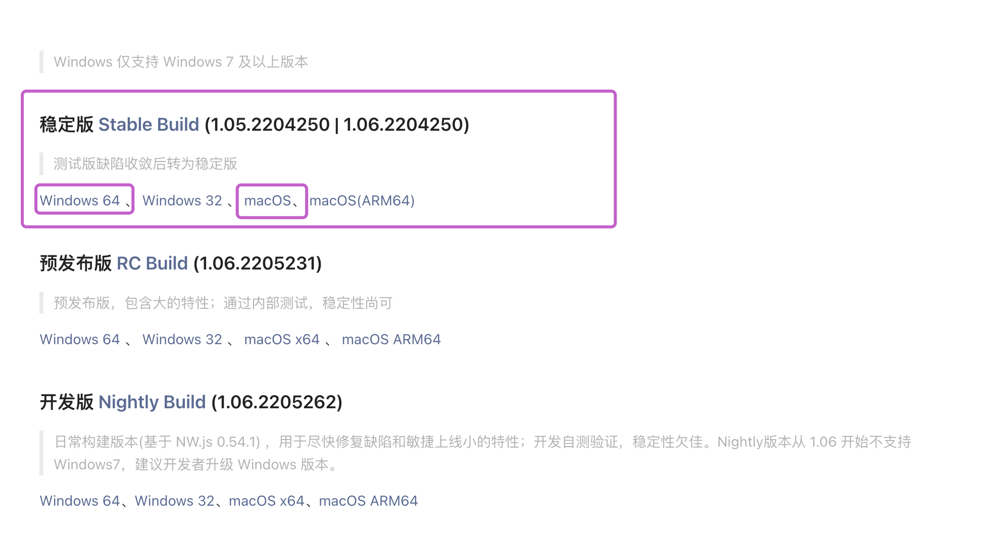
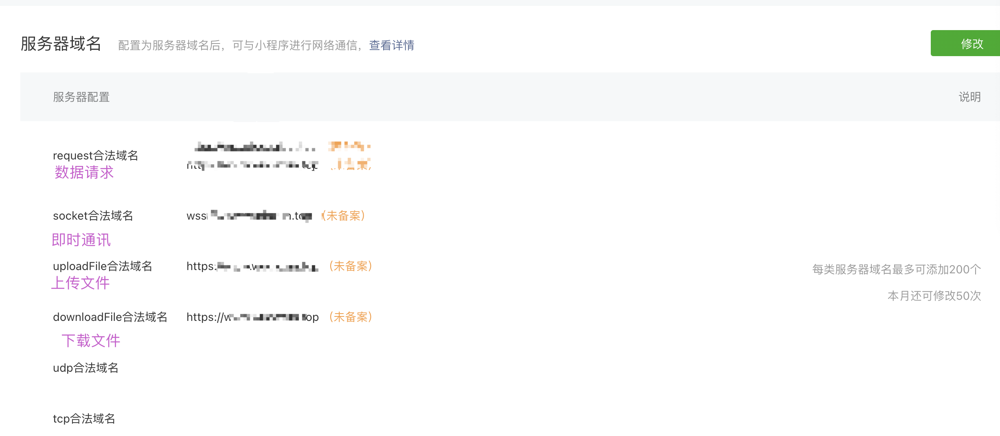

# 1.小程序介绍

https://mp.weixin.qq.com/

小程序是一种不需要下载安装即可使用的应用，它实现了应用“触手可及”的梦想，用户扫一扫或者搜一下即可打开应用。也体现了“用完即走”的理念，用户不用关心是否安装太多应用的问题。应用将无处不在，随时可用，但又无需安装卸载。

小程序种类

* 微信小程序
* 支付宝小程序
* 百度小程序
* 字节跳动小程序
* qq小程序
* 京东小程序
* .....

本课程主要学习微信小程序，只要学会微信小程序，其他小程序就会很快上手，微信小程序是小程序界的标准。

随着技术的发展，现在已经不满足只写某一个类型的小程序，这样开发成本太高，所以现在很多公司倾向于 使用一套代码同时部署到不同的小程序平台，简单一点来说就是，一次开发，多端运行，典型的代表有 uniapp，taro


要想学好uniapp，前提条件是得学习vue以及微信小程序

# 2.准备小程序的账号

打开网址：https://mp.weixin.qq.com/

账号分类---小程序 ---- 鼠标移动上去 --- 查看详情 --- 滑动页面至底部 ---- 前往注册

也可以直接点击 网址进行注册： https://mp.weixin.qq.com/wxopen/waregister?action=step1

> 账号选择个人即可
>
> 账号类型一定要选择微信小程序

# 3.准备小程序开发者工具

下载地址： https://developers.weixin.qq.com/miniprogram/dev/devtools/download.html



# 4.查看小程序的后台界面

打开网址：https://mp.weixin.qq.com/

* 账户名密码登录
* 扫码登录：扫码完成，选择自己的小程序项目即可


## 4.1 首页

可视化说明小程序统计数据

## 4.2 管理

**版本管理**

* 开发版本：主要通过微信开发者工具开发，然后通过开发者工具上传即可显示体验二维码，只有项目成员和体验成员才可扫码查看效果
* 审核版本：开发版本点击 提交审核 按钮，填写审核的信息，然后交给微信审核即可
* 线上版本：微信审核通过，即可点击项目上线，所有人可以搜索微信小程序的名字从而使用小程序

**成员管理**

	可以添加项目成员以及体验成员

* 项目成员：运营者，开发者，数据分析者，一个小程序项目最多含有15个项目成员

* 体验成员：只是拥有体验权限，一个小程序项目最多含有15个体验成员

  > 添加时注意要添加的是 成员的 微信号，记住不是微信绑定的手机号

**用户反馈**

## 4.3 统计

统计一般跟开发者无太大关系，数据分析者需要多加关注，通过数据分析，解析新的需求以及需要的改进点，项目组提出新的方案，再由开发者实现

## 4.4 功能

* 微信搜一搜
* 客服
* 订阅消息
* 页面内容接入
* 实验工具
* 小程序联盟

## 4.5 开发

* 开发管理

  * 运维中心
  * 监控告警
  * 开发设置 **

  

  > 如果小程序项目要上线，就必须的配置 开发管理 - 开发设置 - 服务器域名

  

  * 接口设置 ** 
  * 安全中心

* 开发工具

* 云服务

## 4.6 设置

* 基础设置

> 根据小程序的业务需求，选择合适的 服务类目，否则小程序提交审核是会不通过


# 5.使用微信开发者工具


微信扫码登录即可


稍等一会


# 6.熟悉微信开发者工具


* 模拟器
* 编辑器
* 调试器
* 可视化：不建议使用-拖拽布局页面
* 云开发：不需要单独的后端的接口，包含 数据库、存储、云函数、云托管
* 小程序模式：另一个插件模式
* 普通编译：小程序每次热更新都会让小程序从第一个页面开始渲染，那么为了提高开发效率，可以选择添加编译模式，从而快速调试页面
* 预览：拥有开发权限和体验权限的人，可以直接查看在手机上的实际的运行结果，它跟小程序的线上版本保持一致
* 真机调试：拥有开发权限和体验权限的人，可以直接查看在手机上的实际的运行结果，它跟小程序开发者工具中的模拟器效果保持一致（因为真机调试可以不需要后台配置服务器域名等就可以查看效果）
* 清缓存：清除模拟的缓存信息
* 上传：点击上传即可将项目进入 后台系统中的 开发版本和体验版本


* 版本管理：默认使用 git 作为代码版本管理工具，方便多人合作

* 详情

  * 基本信息
  * 性能分析
  * 本地设置
    * 调试基础库：非常关键
    * 开发阶段：勾选不校验合法域名、web-view（业务域名）、TLS版本以及HTTPs证书
  * 项目配置
    * 高级配置
      * 代码包总大小（使用分包）   20M
      * 代码包总大小（不使用分包） 2M
      * 单个分包/主包大小                   2M
      * Tabbar最小个数					           2
      * Tabbar最大个数                           5
      * Tabbar的icon大小限制          40KB

* 消息

* 页面路径

  * 页面路径：路由，当前页面展示的一个标识
  * 页面参数：列表进入详情，详情区分产品的标识
  * 场景值：进入查看小程序的途径

  

# 7.熟悉小程序代码

```
- miniprogram
    - pages  存放该小程序所对应的页面，每个页面一个文件夹
        - index  index页面
            index.ts  index页面的逻辑文件
            index.json index页面的配置文件
            index.wxml  index页面的结构文件
            index.scss  index页面的样式文件
        - logs   logs 页面
            logs.ts
            logs.json
            logs.wxml
            logs.scss
    - utils 自定义的工具包
        util.js 自定义的函数
    app.ts 全局的逻辑文件
    app.json 全局的配置文件
    app.wxss 全局的样式文件
    sitemap.json 被搜索的配置文件
- typings
  - types
  	- wx
  	  index.d.ts
  	  lib.wx.api.d.ts
  	  lib.wx.app.d.ts
  	  lib.wx.behavior.d.ts
  	  lib.wx.cloud.d.ts
  	  lib.wx.component.d.ts
  	  lib.ex.event.d.ts
  	  lib.wx.page.d.ts
  	index.d.ts
  index.d.ts
.eslintrc.js js代码的规则描述
 project.config.json 项目的配置文件
 project.private.config.json 项目私有的配置文件
 tsconfig.json
```

# 8.小程序代码的构成

https://developers.weixin.qq.com/miniprogram/dev/framework/

> 学习思路，从起步 - 小程序代码构成 开始，如果见到有链接，就跳转过去学习完整的知识

## 8.1 JSON配置

JSON 是一种数据格式，并不是编程语言，在小程序中，JSON扮演的静态配置的角色

### 8.1.1 小程序的配置 app.json

`app.json` 是当前小程序的全局配置，包括了小程序的所有页面路径、界面表现、网络超时时间、底部 tab 等

https://developers.weixin.qq.com/miniprogram/dev/framework/config.html

https://developers.weixin.qq.com/miniprogram/dev/reference/configuration/app.html

小程序根目录下的 `app.json` 文件用来对微信小程序进行全局配置。文件内容为一个 JSON 对象，有以下属性：

| 属性                                                         | 类型            | 必填 | 描述                                                         | 最低版本                                                     |
| :----------------------------------------------------------- | :-------------- | :--- | :----------------------------------------------------------- | :----------------------------------------------------------- |
| [entryPagePath](https://developers.weixin.qq.com/miniprogram/dev/reference/configuration/app.html#entryPagePath) | string          | 否   | 小程序默认启动首页                                           |                                                              |
| [pages](https://developers.weixin.qq.com/miniprogram/dev/reference/configuration/app.html#pages) | string[]        | 是   | 页面路径列表                                                 |                                                              |
| [window](https://developers.weixin.qq.com/miniprogram/dev/reference/configuration/app.html#window) | Object          | 否   | 全局的默认窗口表现                                           |                                                              |
| [tabBar](https://developers.weixin.qq.com/miniprogram/dev/reference/configuration/app.html#tabBar) | Object          | 否   | 底部 `tab` 栏的表现                                          |                                                              |
| [networkTimeout](https://developers.weixin.qq.com/miniprogram/dev/reference/configuration/app.html#networkTimeout) | Object          | 否   | 网络超时时间                                                 |                                                              |
| [debug](https://developers.weixin.qq.com/miniprogram/dev/reference/configuration/app.html#debug) | boolean         | 否   | 是否开启 debug 模式，默认关闭                                |                                                              |
| [functionalPages](https://developers.weixin.qq.com/miniprogram/dev/reference/configuration/app.html#functionalPages) | boolean         | 否   | 是否启用插件功能页，默认关闭                                 | [2.1.0](https://developers.weixin.qq.com/miniprogram/dev/framework/compatibility.html) |
| [subpackages](https://developers.weixin.qq.com/miniprogram/dev/reference/configuration/app.html#subpackages) | Object[]        | 否   | 分包结构配置                                                 | [1.7.3](https://developers.weixin.qq.com/miniprogram/dev/framework/compatibility.html) |
| [workers](https://developers.weixin.qq.com/miniprogram/dev/reference/configuration/app.html#workers) | string          | 否   | `Worker` 代码放置的目录                                      | [1.9.90](https://developers.weixin.qq.com/miniprogram/dev/framework/compatibility.html) |
| [requiredBackgroundModes](https://developers.weixin.qq.com/miniprogram/dev/reference/configuration/app.html#requiredBackgroundModes) | string[]        | 否   | 需要在后台使用的能力，如「音乐播放」                         |                                                              |
| [plugins](https://developers.weixin.qq.com/miniprogram/dev/reference/configuration/app.html#plugins) | Object          | 否   | 使用到的插件                                                 | [1.9.6](https://developers.weixin.qq.com/miniprogram/dev/framework/compatibility.html) |
| [preloadRule](https://developers.weixin.qq.com/miniprogram/dev/reference/configuration/app.html#preloadRule) | Object          | 否   | 分包预下载规则                                               | [2.3.0](https://developers.weixin.qq.com/miniprogram/dev/framework/compatibility.html) |
| [resizable](https://developers.weixin.qq.com/miniprogram/dev/reference/configuration/app.html#resizable) | boolean         | 否   | PC 小程序是否支持用户任意改变窗口大小（包括最大化窗口）；iPad 小程序是否支持屏幕旋转。默认关闭 | [2.3.0](https://developers.weixin.qq.com/miniprogram/dev/framework/compatibility.html) |
| [usingComponents](https://developers.weixin.qq.com/miniprogram/dev/reference/configuration/app.html#usingComponents) | Object          | 否   | 全局[自定义组件](https://developers.weixin.qq.com/miniprogram/dev/framework/custom-component/)配置 | 开发者工具 1.02.1810190                                      |
| [permission](https://developers.weixin.qq.com/miniprogram/dev/reference/configuration/app.html#permission) | Object          | 否   | 小程序接口权限相关设置                                       | 微信客户端 7.0.0                                             |
| [sitemapLocation](https://developers.weixin.qq.com/miniprogram/dev/reference/configuration/app.html#sitemapLocation) | string          | 是   | 指明 sitemap.json 的位置                                     |                                                              |
| [style](https://developers.weixin.qq.com/miniprogram/dev/reference/configuration/app.html#style) | string          | 否   | 指定使用升级后的 weui 样式                                   | [2.8.0](https://developers.weixin.qq.com/miniprogram/dev/framework/compatibility.html) |
| [useExtendedLib](https://developers.weixin.qq.com/miniprogram/dev/reference/configuration/app.html#useextendedlib) | Object          | 否   | 指定需要引用的扩展库                                         | [2.2.1](https://developers.weixin.qq.com/miniprogram/dev/framework/compatibility.html) |
| [entranceDeclare](https://developers.weixin.qq.com/miniprogram/dev/reference/configuration/app.html#entranceDeclare) | Object          | 否   | 微信消息用小程序打开                                         | 微信客户端 7.0.9                                             |
| [darkmode](https://developers.weixin.qq.com/miniprogram/dev/reference/configuration/app.html#darkmode) | boolean         | 否   | 小程序支持 DarkMode                                          | [2.11.0](https://developers.weixin.qq.com/miniprogram/dev/framework/compatibility.html) |
| [themeLocation](https://developers.weixin.qq.com/miniprogram/dev/reference/configuration/app.html#themeLocation) | string          | 否   | 指明 theme.json 的位置，darkmode为 true 为必填               | 开发者工具 1.03.2004271                                      |
| [lazyCodeLoading](https://developers.weixin.qq.com/miniprogram/dev/reference/configuration/app.html#lazyCodeLoading) | string          | 否   | 配置自定义组件代码按需注入                                   | [2.11.1](https://developers.weixin.qq.com/miniprogram/dev/framework/compatibility.html) |
| [singlePage](https://developers.weixin.qq.com/miniprogram/dev/reference/configuration/app.html#singlePage) | Object          | 否   | 单页模式相关配置                                             | [2.12.0](https://developers.weixin.qq.com/miniprogram/dev/framework/compatibility.html) |
| supportedMaterials                                           | Object          | 否   | [聊天素材小程序打开](https://developers.weixin.qq.com/miniprogram/dev/framework/material/support_material.html)相关配置 | [2.14.3](https://developers.weixin.qq.com/miniprogram/dev/framework/compatibility.html) |
| serviceProviderTicket                                        | string          | 否   | [定制化型服务商](https://developers.weixin.qq.com/doc/oplatform/Third-party_Platforms/2.0/operation/thirdparty/customized_service_platform_guidelines.html)票据 |                                                              |
| [embeddedAppIdList](https://developers.weixin.qq.com/miniprogram/dev/reference/configuration/app.html#embeddedAppIdList) | string[]        | 否   | 半屏小程序 appId                                             | [2.20.1](https://developers.weixin.qq.com/miniprogram/dev/framework/compatibility.html) |
| [halfPage](https://developers.weixin.qq.com/miniprogram/dev/reference/configuration/app.html#halfPage) | Object          | 否   | 视频号直播半屏场景设置                                       | [2.18.0](https://developers.weixin.qq.com/miniprogram/dev/framework/compatibility.html) |
| [debugOptions](https://developers.weixin.qq.com/miniprogram/dev/reference/configuration/app.html#debugOptions) | Object          | 否   | 调试相关配置                                                 | [2.22.1](https://developers.weixin.qq.com/miniprogram/dev/framework/compatibility.html) |
| [enablePassiveEvent](https://developers.weixin.qq.com/miniprogram/dev/reference/configuration/app.html#enablePassiveEvent) | Object或boolean | 否   | touch 事件监听是否为 passive                                 | [2.24.1](https://developers.weixin.qq.com/miniprogram/dev/framework/compatibility.html) |
| [resolveAlias](https://developers.weixin.qq.com/miniprogram/dev/reference/configuration/app.html#resolveAlias) | Object          | 否   | 自定义模块映射规则                                           |                                                              |

* **entryPagePath**

设置小程序默认的启动页面，如果不作设置，那么将会取pages数组 的第一项为默认启动项，开发过程中，一般不建议这么使用，你可以使用开发者工具中 添加编译模式 快速解决问题


* **pages**

用于指定小程序由哪些页面组成，每一项都对应一个页面的 路径（含文件名） 信息。文件名不需要写文件后缀，框架会自动去寻找对应位置的 `.json`, `.js`, `.wxml`, `.wxss` 四个文件进行处理。

如何给小程序快速添加页面,写好页面后直接保存即可

```json
{
	"pages":[
    "pages/home/home",
    "pages/index/index",
    "pages/logs/logs",
    "pages/kind/kind",
    "pages/cart/cart",
    "pages/user/user"
  ],
  ...
}
```

* **window**

用于设置小程序的状态栏、导航条、标题、窗口背景色。

| 属性                                                         | 类型     | 默认值   | 描述                                                         | 最低版本                                                     |
| :----------------------------------------------------------- | :------- | :------- | :----------------------------------------------------------- | :----------------------------------------------------------- |
| navigationBarBackgroundColor                                 | HexColor | #000000  | 导航栏背景颜色，如 `#000000`                                 |                                                              |
| navigationBarTextStyle                                       | string   | white    | 导航栏标题颜色，仅支持 `black` / `white`                     |                                                              |
| navigationBarTitleText                                       | string   |          | 导航栏标题文字内容                                           |                                                              |
| navigationStyle                                              | string   | default  | 导航栏样式，仅支持以下值： `default` 默认样式 `custom` 自定义导航栏，只保留右上角胶囊按钮。参见注 2。 | iOS/Android 微信客户端 6.6.0，Windows 微信客户端不支持       |
| backgroundColor                                              | HexColor | #ffffff  | 窗口的背景色                                                 |                                                              |
| backgroundTextStyle                                          | string   | dark     | 下拉 loading 的样式，仅支持 `dark` / `light`                 |                                                              |
| backgroundColorTop                                           | string   | #ffffff  | 顶部窗口的背景色，仅 iOS 支持                                | 微信客户端 6.5.16                                            |
| backgroundColorBottom                                        | string   | #ffffff  | 底部窗口的背景色，仅 iOS 支持                                | 微信客户端 6.5.16                                            |
| enablePullDownRefresh                                        | boolean  | false    | 是否开启全局的下拉刷新。 详见 [Page.onPullDownRefresh](https://developers.weixin.qq.com/miniprogram/dev/reference/api/Page.html#onpulldownrefresh) |                                                              |
| onReachBottomDistance                                        | number   | 50       | 页面上拉触底事件触发时距页面底部距离，单位为 px。 详见 [Page.onReachBottom](https://developers.weixin.qq.com/miniprogram/dev/reference/api/Page.html#onreachbottom) |                                                              |
| pageOrientation                                              | string   | portrait | 屏幕旋转设置，支持 `auto` / `portrait` / `landscape` 详见 [响应显示区域变化](https://developers.weixin.qq.com/miniprogram/dev/framework/view/resizable.html) | [2.4.0](https://developers.weixin.qq.com/miniprogram/dev/framework/compatibility.html) (auto) / [2.5.0](https://developers.weixin.qq.com/miniprogram/dev/framework/compatibility.html) (landscape) |
| [restartStrategy](https://developers.weixin.qq.com/miniprogram/dev/reference/configuration/app.html#restartStrategy) | string   | homePage | 重新启动策略配置                                             | [2.8.0](https://developers.weixin.qq.com/miniprogram/dev/framework/compatibility.html) |
| initialRenderingCache                                        | string   |          | 页面[初始渲染缓存](https://developers.weixin.qq.com/miniprogram/dev/framework/view/initial-rendering-cache.html)配置，支持 `static` / `dynamic` | [2.11.1](https://developers.weixin.qq.com/miniprogram/dev/framework/compatibility.html) |
| visualEffectInBackground                                     | string   | none     | 切入系统后台时，隐藏页面内容，保护用户隐私。支持 `hidden` / `none` | [2.15.0](https://developers.weixin.qq.com/miniprogram/dev/framework/compatibility.html) |
| handleWebviewPreload                                         | string   | static   | 控制[预加载下个页面的时机](https://developers.weixin.qq.com/miniprogram/dev/framework/performance/tips/runtime_nav.html#_2-4-控制预加载下个页面的时机)。支持 `static` / `manual` / `auto` | [2.15.0](https://developers.weixin.qq.com/miniprogram/dev/framework/compatibility.html) |

```json
{
	...,
	"window": {
        "navigationBarBackgroundColor": "#f66",
        "navigationBarTextStyle": "white",
        "navigationBarTitleText": "嗨购",
        "navigationStyle": "default",
        "homeButton": true,
        "backgroundColor": "#123123",
        "backgroundTextStyle": "dark",
        "enablePullDownRefresh": true,
        "pageOrientation": "portrait"
      },
  ....
}
```

* **tabBar**

如果小程序是一个多 tab 应用（客户端窗口的底部或顶部有 tab 栏可以切换页面），可以通过 tabBar 配置项指定 tab 栏的表现，以及 tab 切换时显示的对应页面。

| 属性            | 类型     | 必填 | 默认值 | 描述                                                         | 最低版本                                                     |
| :-------------- | :------- | :--- | :----- | :----------------------------------------------------------- | :----------------------------------------------------------- |
| color           | HexColor | 是   |        | tab 上的文字默认颜色，仅支持十六进制颜色                     |                                                              |
| selectedColor   | HexColor | 是   |        | tab 上的文字选中时的颜色，仅支持十六进制颜色                 |                                                              |
| backgroundColor | HexColor | 是   |        | tab 的背景色，仅支持十六进制颜色                             |                                                              |
| borderStyle     | string   | 否   | black  | tabbar 上边框的颜色， 仅支持 `black` / `white`               |                                                              |
| list            | Array    | 是   |        | tab 的列表，详见 `list` 属性说明，最少 2 个、最多 5 个 tab   |                                                              |
| position        | string   | 否   | bottom | tabBar 的位置，仅支持 `bottom` / `top`                       |                                                              |
| custom          | boolean  | 否   | false  | 自定义 tabBar，见[详情](https://developers.weixin.qq.com/miniprogram/dev/framework/ability/custom-tabbar.html) | [2.5.0](https://developers.weixin.qq.com/miniprogram/dev/framework/compatibility.html) |

其中 list 接受一个数组，**只能配置最少 2 个、最多 5 个 tab**。tab 按数组的顺序排序，每个项都是一个对象，其属性值如下：

| 属性             | 类型   | 必填 | 说明                                                         |
| :--------------- | :----- | :--- | :----------------------------------------------------------- |
| pagePath         | string | 是   | 页面路径，必须在 pages 中先定义                              |
| text             | string | 是   | tab 上按钮文字                                               |
| iconPath         | string | 否   | 图片路径，icon 大小限制为 40kb，建议尺寸为 81px * 81px，不支持网络图片。 **当 `position` 为 `top` 时，不显示 icon。** |
| selectedIconPath | string | 否   | 选中时的图片路径，icon 大小限制为 40kb，建议尺寸为 81px * 81px，不支持网络图片。 **当 `position` 为 `top` 时，不显示 icon。** |

> 如何获取项目需要的图片
>
> https://www.iconfont.cn/
>
> 搜索图标 - 加入购物车 - 点击购物车 - 下载素材
>
> 输入颜色 #333333 和 #ff6666。选择大小为81px，下载png图片即可
>
> 

```json
{
	...,
	"tabBar": {
        "color": "#333",
        "selectedColor": "#f66",
        "backgroundColor": "#efefef",
        "borderStyle": "black",
        "list": [
          {
            "pagePath": "pages/home/home",
            "text": "首页",
            "iconPath": "resources/tabBar/home.png",
            "selectedIconPath": "resources/tabBar/home_active.png"
          },
          {
            "pagePath": "pages/kind/kind",
            "text": "分类",
            "iconPath": "resources/tabBar/kind.png",
            "selectedIconPath": "resources/tabBar/kind_active.png"
          },
          {
            "pagePath": "pages/cart/cart",
            "text": "购物车",
            "iconPath": "resources/tabBar/cart.png",
            "selectedIconPath": "resources/tabBar/cart_active.png"
          },
          {
            "pagePath": "pages/user/user",
            "text": "我的",
            "iconPath": "resources/tabBar/user.png",
            "selectedIconPath": "resources/tabBar/user_active.png"
          }
        ]
      },
  ...
}
```

* **networkTimeout**

各类网络请求的超时时间，单位均为毫秒。

```json
{
	...,
	"networkTimeout": {
        "request": 6000,
        "connectSocket": 4000,
        "uploadFile": 600000,
        "downloadFile": 6000000
      },
  ....
}
```

* debug

可以在开发者工具中开启 `debug` 模式，在开发者工具的控制台面板，调试信息以 `info` 的形式给出，其信息有 Page 的注册，页面路由，数据更新，事件触发等。可以帮助开发者快速定位一些常见的问题。

```
{
	...,
	"debug": false,
	....
}
```

> 底部tab选项卡对应的页面，会自动添加类似vue中的 keep-alive的功能，原来的activated 和 deactivated 分别对应小程序中的。onShow 和 onHide

* **subpackages**

启用[分包加载](https://developers.weixin.qq.com/miniprogram/dev/framework/subpackages.html)时，声明项目分包结构。

> 分包加载：
>
> - 整个小程序所有分包大小不超过 20M
> - 单个分包/主包大小不能超过 2M
>
> **使用分包**
>
> **独立分包**
>
> ```json
> "subPackages": [
>  {
>    "root": "pckSearch",
>    "name": "search",
>    "pages": [
>      "pages/search/search",
>      "pages/result/result"
>    ],
>    "independent": true 
>  },
>  {
>    "root": "pckUser",
>    "name": "user",
>    "pages": [
>      "pages/login/login",
>      "pages/register/register"
>    ]
>  }
> ],
> "debug": true,
> ```
>
> > **开启debug模式，添加编译模式，调试分包的页面，观察 独立分包和 非独立分包的效果，通过控制台的console查看**
>
> **分包预下载**
>
> 开发者可以通过配置，在进入小程序某个页面时，由框架自动预下载可能需要的分包，提升进入后续分包页面时的启动速度。
>
> > 做一个电商类型的小程序，大部分的用户一定回去搜索，所以可以把搜索相关业务写到分包，当用户打开主包时，预下载 搜索的分包
>
> ```json
> {
> 	...,
> 	"subPackages": [
>      {
>        "root": "pckSearch",
>        "name": "pckSearch",
>        "pages": [
>          "pages/search/search",
>          "pages/result/result"
>        ],
>        "independent": true 
>      },
>      {
>        "root": "pckUser",
>        "name": "pckUser",
>        "pages": [
>          "pages/login/login",
>          "pages/register/register"
>        ]
>      }
>    ],
>   "preloadRule": {
>     "pages/home/home": {
>       "network": "all",
>       "packages": [
>        "pckSearch"
>       ]
>     }
>   },
> ...
> }
> ```
>
> 

整体的全局配置文件如下：

```json
{
  "pages": [
    "pages/home/home",
    "pages/kind/kind",
    "pages/cart/cart",
    "pages/user/user",
    "pages/detail/detail",
    "pages/index/index",
    "pages/logs/logs"
  ],
  "window": {
    "navigationBarBackgroundColor": "#f66",
    "navigationBarTextStyle": "white",
    "navigationBarTitleText": "嗨购",
    "navigationStyle": "default",
    "backgroundColor": "#efefef",
    "backgroundTextStyle": "dark",
    "restartStrategy": "homePageAndLatestPage",
    "visualEffectInBackground": "hidden"
  },
  "tabBar": {
    "color": "#333",
    "selectedColor": "#f66",
    "backgroundColor": "#efefef",
    "borderStyle": "black",
    "list": [
      {
        "pagePath": "pages/home/home",
        "text": "首页",
        "iconPath": "tabBar/home.png",
        "selectedIconPath": "tabBar/home_active.png"
      },
      {
        "pagePath": "pages/kind/kind",
        "text": "分类",
        "iconPath": "tabBar/kind.png",
        "selectedIconPath": "tabBar/kind_active.png"
      },
      {
        "pagePath": "pages/cart/cart",
        "text": "购物车",
        "iconPath": "tabBar/cart.png",
        "selectedIconPath": "tabBar/cart_active.png"
      },
      {
        "pagePath": "pages/user/user",
        "text": "我的",
        "iconPath": "tabBar/user.png",
        "selectedIconPath": "tabBar/user_active.png"
      }
    ]
  },
  "networkTimeout": {
    "request": 6000,
    "connectSocket": 6000,
    "uploadFile": 60000,
    "downloadFile": 60000
  },
  "subpackages": [
    {
      "root": "packageSearch",
      "name": "packageSearch",
      "independent": true,
      "pages": [
        "pages/search/search",
        "pages/result/result"
      ]
    },
    {
      "root": "packageUser",
      "name": "packageUser",
      "pages": [
        "pages/register/register",
        "pages/login/login"
      ]
    }
  ],
  "preloadRule": {
    "pages/home/home": {
      "network": "all",
      "packages": ["packageSearch"]
    }
  },
  "debug": false,
  "style": "v2",
  "sitemapLocation": "sitemap.json"
}
```

### 8.1.2 工具配置 project.config.json

https://developers.weixin.qq.com/miniprogram/dev/devtools/projectconfig.html

### 8.1.3 页面配置 page.json

https://developers.weixin.qq.com/miniprogram/dev/reference/configuration/page.html

| 属性                         | 类型            | 默认值   | 描述                                                         | 最低版本                                                     |
| :--------------------------- | :-------------- | :------- | :----------------------------------------------------------- | :----------------------------------------------------------- |
| navigationBarBackgroundColor | HexColor        | #000000  | 导航栏背景颜色，如 `#000000`                                 |                                                              |
| navigationBarTextStyle       | string          | white    | 导航栏标题颜色，仅支持 `black` / `white`                     |                                                              |
| navigationBarTitleText       | string          |          | 导航栏标题文字内容                                           |                                                              |
| navigationStyle              | string          | default  | 导航栏样式，仅支持以下值： `default` 默认样式 `custom` 自定义导航栏，只保留右上角胶囊按钮。 | iOS/Android 微信客户端 7.0.0，Windows 微信客户端不支持       |
| backgroundColor              | HexColor        | #ffffff  | 窗口的背景色                                                 |                                                              |
| backgroundTextStyle          | string          | dark     | 下拉 loading 的样式，仅支持 `dark` / `light`                 |                                                              |
| backgroundColorTop           | string          | #ffffff  | 顶部窗口的背景色，仅 iOS 支持                                | 微信客户端 6.5.16                                            |
| backgroundColorBottom        | string          | #ffffff  | 底部窗口的背景色，仅 iOS 支持                                | 微信客户端 6.5.16                                            |
| enablePullDownRefresh        | boolean         | false    | 是否开启当前页面下拉刷新。 详见 [Page.onPullDownRefresh](https://developers.weixin.qq.com/miniprogram/dev/reference/api/Page.html#onpulldownrefresh) |                                                              |
| onReachBottomDistance        | number          | 50       | 页面上拉触底事件触发时距页面底部距离，单位为px。 详见 [Page.onReachBottom](https://developers.weixin.qq.com/miniprogram/dev/reference/api/Page.html#onreachbottom) |                                                              |
| pageOrientation              | string          | portrait | 屏幕旋转设置，支持 `auto` / `portrait` / `landscape` 详见 [响应显示区域变化](https://developers.weixin.qq.com/miniprogram/dev/framework/view/resizable.html) | [2.4.0](https://developers.weixin.qq.com/miniprogram/dev/framework/compatibility.html) (auto) / [2.5.0](https://developers.weixin.qq.com/miniprogram/dev/framework/compatibility.html) (landscape) |
| disableScroll                | boolean         | false    | 设置为 `true` 则页面整体不能上下滚动。 只在页面配置中有效，无法在 `app.json` 中设置 |                                                              |
| usingComponents              | Object          | 否       | 页面[自定义组件](https://developers.weixin.qq.com/miniprogram/dev/framework/custom-component/)配置 | [1.6.3](https://developers.weixin.qq.com/miniprogram/dev/framework/compatibility.html) |
| initialRenderingCache        | string          |          | 页面[初始渲染缓存](https://developers.weixin.qq.com/miniprogram/dev/framework/view/initial-rendering-cache.html)配置，支持 `static` / `dynamic` | [2.11.1](https://developers.weixin.qq.com/miniprogram/dev/framework/compatibility.html) |
| style                        | string          | default  | 启用新版的组件样式                                           | [2.10.2](https://developers.weixin.qq.com/miniprogram/dev/framework/compatibility.html) |
| singlePage                   | Object          | 否       | 单页模式相关配置                                             | [2.12.0](https://developers.weixin.qq.com/miniprogram/dev/framework/compatibility.html) |
| restartStrategy              | string          | homePage | 重新启动策略配置                                             | [2.8.0](https://developers.weixin.qq.com/miniprogram/dev/framework/compatibility.html) |
| handleWebviewPreload         | string          | static   | 控制[预加载下个页面的时机](https://developers.weixin.qq.com/miniprogram/dev/framework/performance/tips/runtime_nav.html#_2-4-控制预加载下个页面的时机)。支持 `static` / `manual` / `auto` | [2.15.0](https://developers.weixin.qq.com/miniprogram/dev/framework/compatibility.html) |
| visualEffectInBackground     | string          | 否       | 切入系统后台时，隐藏页面内容，保护用户隐私。支持 `hidden` / `none`，若对页面单独设置则会覆盖全局的配置，详见 [全局配置](https://developers.weixin.qq.com/miniprogram/dev/reference/configuration/app.html) | [2.15.0](https://developers.weixin.qq.com/miniprogram/dev/framework/compatibility.html) |
| enablePassiveEvent           | Object或boolean | 否       | 事件监听是否为 passive，若对页面单独设置则会覆盖全局的配置，详见 [全局配置](https://developers.weixin.qq.com/miniprogram/dev/reference/configuration/app.html) | [2.24.1](https://developers.weixin.qq.com/miniprogram/dev/framework/compatibility.html) |

// pages/home/home.json

```json
{
  "navigationBarTitleText": "嗨购-首页",
  "usingComponents": {}
}
```

## 8.2 WXML模版

https://developers.weixin.qq.com/miniprogram/dev/framework/view/wxml/

WXML（WeiXin Markup Language）是框架设计的一套标签语言，结合[基础组件](https://developers.weixin.qq.com/miniprogram/dev/component/)、[事件系统](https://developers.weixin.qq.com/miniprogram/dev/framework/view/wxml/event.html)，可以构建出页面的结构

https://developers.weixin.qq.com/miniprogram/dev/reference/wxml/

### 8.2.1 数据绑定

WXML 中的动态数据均来自对应 Page 的 data。

```json
// app.json
{
	pages: [
		"pages/test/test",
		....
	]
}
```

* **简单绑定**

****

* **组件属性(需要在双引号之内)**

* **控制属性(需要在双引号之内)**

* **关键字(需要在双引号之内)**

> `true`：boolean 类型的 true，代表真值。
>
> `false`： boolean 类型的 false，代表假值。

### 8.2.2 列表渲染

### 8.2.3 条件渲染

### 8.2.4 模版

WXML提供模板（template），可以在模板中定义代码片段，然后在不同的地方调用。

### 8.2.5 引用

WXML 提供两种文件引用方式`import`和`include`。

> 以上代码参照 pages/test/test.wxml 以及 pages/test/test.js 

```html
<!--pages/test/test.wxml-->
<view class="h1">数据绑定</view>
<view>{{ message }}</view>
<rich-text nodes="{{message}}"></rich-text>
<view obj = "{{ {a: 1, b: 2} }}"></view>
<view class="h1">列表渲染</view>
<view>
	<view wx:for="{{list}}" wx:key="*this">{{item}}</view>
</view>
<view>
	<view wx:for="{{arr}}" wx:key="id">{{ index }} - {{item.name}}</view>
</view>
<view>
	<view wx:for="{{cars}}" wx:key="brand">
		{{ index }} - {{item.brand}}
		<!-- <view wx:for="{{ item.list }}" wx:key="*this">
			{{ index }} - {{ item }}
		</view> -->
		<view wx:for="{{ item.list }}" wx:key="*this" wx:for-item="itm" wx:for-index="idx">
			{{ idx }} - {{ itm }}
		</view>
	</view>
</view>
<view class="h1">条件渲染</view>
<!-- <input type="text" model:value="{{name}}"/>{{ name }} -->
<input type="text" value="{{name}}" bindinput="changeName"/>{{ name }}
<view wx:if="{{ name.length < 5}}">字段长度小于5</view>
<view wx:elif="{{ name.length >= 5 && name.length < 10}}">字段长度大于等于5小于10</view>
<view wx:else="{{ name.length >= 10 }}">字段长度大于等于10</view>

<view class="h1">模板</view>
<template name="msgItem">
  <view>{{ index}} - {{ msg }} - {{ time }}</view>
</template>
<!-- <template is="msgItem" data="{{ index: 1, msg: 'minpro', time: 11 }}"></template> -->
<!-- <template is="msgItem" data="{{ ...obj }}"></template> -->
<template is="msgItem" data="{{ ...obj, index: 1, msg: 'minpro', time: 11 }}"></template>

<view class="h1">引用</view>
<import src="./item.wxml" />
<block wx:for="{{ arr }}" wx:key="id">
	<template is="showName" data="{{ ...item }}"></template>
</block>

<include src="./header" />
<include src="./footer" />
```

```js
// pages/test/test.ts
Page({
  data: {
    message: "<mark><i>hello minpro</i></mark>",
    list: ['a', 'b', 'c', 'd'],
    arr: [
      { id: 1, name: '曹喜龙' },
      { id: 2, name: '段泽楷' },
      { id: 3, name: '王喜珍' }
    ],
    cars: [
      {
        brand: '奔驰',
        list: [ '大G', 'c260' ]
      },
      {
        brand: '宝马',
        list: [ 'X1', 'X3' ]
      }
    ],
    name: '',
    obj: {
      index: '0',
      msg: 'vue',
      time: '00'
    }
  },
  // changeName (event: { detail: {value: string }}) {
  changeName (event: WechatMiniprogram.CustomEvent) {
    console.log(event)
    this.setData({
      name: event.detail.value
    })
  }
})
```

```
<!-- pages/test/header.wxml -->
<view>这里是头部</view>
```

```html
<!-- pages/test/footer.wxml -->
<view>这里是底部</view>
```

```html
<!-- pages/test/item.wxml -->
<template name="showName">
	<view>{{ id }} - {{ name }}</view>
</template>
```

## 8.3 WXSS 样式

`WXSS` 具有 `CSS` 大部分的特性，小程序在 `WXSS` 也做了一些扩充和修改

1. 新增了尺寸单位。在写 `CSS` 样式时，开发者需要考虑到手机设备的屏幕会有不同的宽度和设备像素比，采用一些技巧来换算一些像素单位。`WXSS` 在底层支持新的尺寸单位 `rpx` ，开发者可以免去换算的烦恼，只要交给小程序底层来换算即可，由于换算采用的浮点数运算，所以运算结果会和预期结果有一点点偏差。
2. 提供了全局的样式和局部样式。和前边 `app.json`, `page.json` 的概念相同，你可以写一个 `app.wxss` 作为全局样式，会作用于当前小程序的所有页面，局部页面样式 `page.wxss` 仅对当前页面生效。
3. 此外 `WXSS` 仅支持部分 `CSS` 选择器

https://developers.weixin.qq.com/miniprogram/dev/framework/view/wxss.html

- rpx（responsive pixel）: 可以根据屏幕宽度进行自适应。规定屏幕宽为750rpx。如在 iPhone6 上，屏幕宽度为375px，共有750个物理像素，则750rpx = 375px = 750物理像素，1rpx = 0.5px = 1物理像素。

| 设备         | rpx换算px (屏幕宽度/750) | px换算rpx (750/屏幕宽度) |
| :----------- | :----------------------- | :----------------------- |
| iPhone5      | 1rpx = 0.42px            | 1px = 2.34rpx            |
| iPhone6      | 1rpx = 0.5px             | 1px = 2rpx               |
| iPhone6 Plus | 1rpx = 0.552px           | 1px = 1.81rpx            |

**建议：** 开发微信小程序时设计师可以用 iPhone6 作为视觉稿的标准。

> 假如设计是给我们的设计稿，打开以后，发现 设计稿的宽度是 750px，那么我们在wxss中写宽度和高度时，可以直接写量取的数据，单位 rpx
>
> 如果设计师给的设计稿为375px，假设量取的宽度为100px，那么建议将wxss的单位写为  200rpx

**注意：** 在较小的屏幕上不可避免的会有一些毛刺，请在开发时尽量避免这种情况。

## 8.4 js逻辑交互

### 8.4.1 什么是事件

- 事件是视图层到逻辑层的通讯方式。
- 事件可以将用户的行为反馈到逻辑层进行处理。
- 事件可以绑定在组件上，当达到触发事件，就会执行逻辑层中对应的事件处理函数。
- 事件对象可以携带额外信息，如 id, dataset, touches。

> 切记，自定义的事件是需要写到 js中的 选项中的

### 8.4.2 如何给事件传递参数

> 传递参数时，id具有特殊性，其余数据通过 data-params 属性传值

### 8.4.3 冒泡

> biantap并不会阻止事件冒泡
>
> catchtap 会阻止冒泡

```html
<!--pages/com/com.wxml-->
<!-- 如果属性的值为变量 boolean类型 number类型 对象  数组 ，使用 {{}} 包裹 -->
<view class="myid{{id}}" flag="{{true}}" num="{{200}}" arr="{{ [1, 2, 3, 4] }}" obj="{{ {a: 1, b: 2} }}">
	{{ message }}
</view>

<!-- 
	index 默认的索引值，item 默认的元素名
	使用 wx:for-item 可以指定数组当前元素的变量名，
	使用 wx:for-index 可以指定数组当前下标的变量名：

	wx:key 的值以两种形式提供
	字符串，代表在 for 循环的 array 中 item 的某个 property，该 property 的值需要是列表中唯一的字符串或数字，且不能动态改变。
	保留关键字 *this 代表在 for 循环中的 item 本身，这种表示需要 item 本身是一个唯一的字符串或者数字。
-->
<view wx:for="{{arr}}" wx:key="*this">
	{{ index }}: {{ item }}
</view>
<view wx:for="{{arr}}" wx:key="*this" wx:for-item="itm" wx:for-index="idx">
	{{ idx }}: {{ itm }}
</view>
<view wx:for="{{list}}" wx:key="brand">
	{{ item.brand }}
	<view wx:for="{{item.arr}}" wx:key="*this" wx:for-item="itm" wx:for-index="idx">
		{{ itm }}
	</view>
</view>

<view class="myBorder">
	盒子下边框为 1rpx，上边框为 1px
</view>

<!-- 
	WXML提供模板（template），可以在模板中定义代码片段，然后在不同的地方调用。
 -->
 <!-- 定义模版 -->
<template name="msgItem">
	<view>
    <text> {{index}}: {{msg}} </text>
    <text> Time: {{time}} </text>
  </view>
</template>
<!-- 使用模版 -->
<template is="msgItem" data="{{...item}}"/>
<template is="msgItem" data="{{ index: 300, msg: 'hi', time: '2022年2月27日'}}"/>

<!-- 
	引用 - import
 -->
<import src="./item.wxml" />
<template is="myItem" data="{{...item}}"/>

<!-- 
	引用 - include
 -->
<include src="./header.wxml" />
<include src="./footer.wxml" />

<!-- 
	事件处理
	冒泡  catchtap 代替bindtap
 -->
<button bindtap="changeMsg">改变msg</button>
<button data-params="hi minpro" bindtap="changeParamsMsg">传递参数改变msg</button>

<view class="box" bindtap="clickBox">
	box
	<view class="myBox" catchtap="clickMyBox">
		myBox
	</view>
</view>
```

```js
// pages/com/com.ts
Page({

  /**
   * 页面的初始数据
   */
  data: {
    message: 'hello minpro',
    id: 100,
    arr: ['aaa', 'bbb', 'ccc'],
    list: [
      {
        brand: '宝马',
        arr: ['X5', 'X6']
      },
      {
        brand: '奥迪',
        arr: ['Q7', 'A8']
      }
    ],
    item: {
      index: 100,
      msg: 'hello',
      time: '2022-02-27'
    }
  },
  // 自定义事件
  changeMsg () {
    this.setData({ message: 'hello world'})
  },
  changeParamsMsg (event) {
    console.log(event)
    this.setData({ message: event.currentTarget.dataset.params})
  },
  clickMyBox () {
    console.log('mybox')
  },
  clickBox () {
    console.log('box')
  },
  /**
   * 生命周期函数--监听页面加载
   */
  onLoad() {

  },

  /**
   * 生命周期函数--监听页面初次渲染完成
   */
  onReady() {

  },

  /**
   * 生命周期函数--监听页面显示
   */
  onShow() {

  },

  /**
   * 生命周期函数--监听页面隐藏
   */
  onHide() {

  },

  /**
   * 生命周期函数--监听页面卸载
   */
  onUnload() {

  },

  /**
   * 页面相关事件处理函数--监听用户下拉动作
   */
  onPullDownRefresh() {

  },

  /**
   * 页面上拉触底事件的处理函数
   */
  onReachBottom() {

  },

  /**
   * 用户点击右上角分享
   */
  onShareAppMessage() {

  }
})
```

```css
/* pages/com/com.wxss */
.myBorder {
	border-bottom: 1rpx solid #000;
	border-top: 1px solid #000;
}

.box {
	width: 200px;
	height: 200px;
	background-color: #efefef;
}

.myBox {
	width: 100px;
	height: 100px;
	background-color: #f66;
}
```


# 9.小程序的宿主环境

## 9.1 渲染层和逻辑层

WXML 模板和 WXSS 样式工作在渲染层

JS 脚本工作在逻辑层

### 9.1.1 注册小程序

每个小程序都需要在 `app.js` 中调用 `App` 方法注册小程序实例，绑定生命周期回调函数、错误监听和页面不存在监听函数等

https://developers.weixin.qq.com/miniprogram/dev/reference/api/App.html

注册小程序。接受一个 `Object` 参数，其指定小程序的生命周期回调等。

**App() 必须在 `app.js` 中调用，必须调用且只能调用一次。不然会出现无法预期的后果。**

| 属性                                                         | 类型     | 默认值 | 必填 | 说明                                                         | 最低版本                                                     |
| :----------------------------------------------------------- | :------- | :----- | :--- | :----------------------------------------------------------- | :----------------------------------------------------------- |
| [onLaunch](https://developers.weixin.qq.com/miniprogram/dev/reference/api/App.html#onLaunch-Object-object) | function |        | 否   | 生命周期回调——监听小程序初始化。                             |                                                              |
| [onShow](https://developers.weixin.qq.com/miniprogram/dev/reference/api/App.html#onShow-Object-object) | function |        | 否   | 生命周期回调——监听小程序启动或切前台。                       |                                                              |
| [onHide](https://developers.weixin.qq.com/miniprogram/dev/reference/api/App.html#onHide) | function |        | 否   | 生命周期回调——监听小程序切后台。                             |                                                              |
| [onError](https://developers.weixin.qq.com/miniprogram/dev/reference/api/App.html#onError-String-error) | function |        | 否   | 错误监听函数。                                               |                                                              |
| [onPageNotFound](https://developers.weixin.qq.com/miniprogram/dev/reference/api/App.html#onPageNotFound-Object-object) | function |        | 否   | 页面不存在监听函数。                                         | [1.9.90](https://developers.weixin.qq.com/miniprogram/dev/framework/compatibility.html) |
| [onUnhandledRejection](https://developers.weixin.qq.com/miniprogram/dev/reference/api/App.html#onUnhandledRejection-Object-object) | function |        | 否   | 未处理的 Promise 拒绝事件监听函数。                          | [2.10.0](https://developers.weixin.qq.com/miniprogram/dev/framework/compatibility.html) |
| [onThemeChange](https://developers.weixin.qq.com/miniprogram/dev/reference/api/App.html#onThemeChange-Object-object) | function |        | 否   | 监听系统主题变化                                             | [2.11.0](https://developers.weixin.qq.com/miniprogram/dev/framework/compatibility.html) |
| 其他                                                         | any      |        | 否   | 开发者可以添加任意的函数或数据变量到 `Object` 参数中，用 `this` 可以访问 |                                                              |

```js
// app.js
// app.js
App({
  onLaunch() {
    console.log('onLaunch')
    // 展示本地存储能力
    const logs = wx.getStorageSync('logs') || []
    logs.unshift(Date.now())
    wx.setStorageSync('logs', logs)

    // 登录
    wx.login({
      success: res => {
        // 发送 res.code 到后台换取 openId, sessionKey, unionId
      }
    })
  },
  // 其他
  globalData: {
    userInfo: null
  },
  onShow () {
    console.log('onShow')
  },
  onHide () {
    console.log('onHide')
  },
  onError () {
    console.log('onError')
  }
})

```


### 9.1.2 注册页面

对于小程序中的每个页面，都需要在页面对应的 `js` 文件中进行注册，指定页面的初始数据、生命周期回调、事件处理函数等。

| 属性                                                         | 类型         | 默认值 | 必填 | 说明                                                         |
| :----------------------------------------------------------- | :----------- | :----- | :--- | :----------------------------------------------------------- |
| [data](https://developers.weixin.qq.com/miniprogram/dev/reference/api/Page.html#data) | Object       |        |      | 页面的初始数据                                               |
| options                                                      | Object       |        |      | 页面的组件选项，同 [`Component` 构造器](https://developers.weixin.qq.com/miniprogram/dev/reference/api/Component.html) 中的 `options` ，需要基础库版本 [2.10.1](https://developers.weixin.qq.com/miniprogram/dev/framework/compatibility.html) |
| [behaviors](https://developers.weixin.qq.com/miniprogram/dev/framework/custom-component/behaviors.html) | String Array |        |      | 类似于 mixins 和traits的组件间代码复用机制，参见 [behaviors](https://developers.weixin.qq.com/miniprogram/dev/framework/custom-component/behaviors.html)，需要基础库版本 [2.9.2](https://developers.weixin.qq.com/miniprogram/dev/framework/compatibility.html) |
| [onLoad](https://developers.weixin.qq.com/miniprogram/dev/reference/api/Page.html#onLoad-Object-query) | function     |        |      | 生命周期回调—监听页面加载                                    |
| [onShow](https://developers.weixin.qq.com/miniprogram/dev/reference/api/Page.html#onShow) | function     |        |      | 生命周期回调—监听页面显示                                    |
| [onReady](https://developers.weixin.qq.com/miniprogram/dev/reference/api/Page.html#onReady) | function     |        |      | 生命周期回调—监听页面初次渲染完成                            |
| [onHide](https://developers.weixin.qq.com/miniprogram/dev/reference/api/Page.html#onHide) | function     |        |      | 生命周期回调—监听页面隐藏                                    |
| [onUnload](https://developers.weixin.qq.com/miniprogram/dev/reference/api/Page.html#onUnload) | function     |        |      | 生命周期回调—监听页面卸载                                    |
| [onPullDownRefresh](https://developers.weixin.qq.com/miniprogram/dev/reference/api/Page.html#onPullDownRefresh) | function     |        |      | 监听用户下拉动作                                             |
| [onReachBottom](https://developers.weixin.qq.com/miniprogram/dev/reference/api/Page.html#onReachBottom) | function     |        |      | 页面上拉触底事件的处理函数                                   |
| [onShareAppMessage](https://developers.weixin.qq.com/miniprogram/dev/reference/api/Page.html#onShareAppMessage-Object-object) | function     |        |      | 用户点击右上角转发                                           |
| [onShareTimeline](https://developers.weixin.qq.com/miniprogram/dev/reference/api/Page.html#onShareTimeline) | function     |        |      | 用户点击右上角转发到朋友圈                                   |
| [onAddToFavorites](https://developers.weixin.qq.com/miniprogram/dev/reference/api/Page.html#onAddToFavorites-Object-object) | function     |        |      | 用户点击右上角收藏                                           |
| [onPageScroll](https://developers.weixin.qq.com/miniprogram/dev/reference/api/Page.html#onPageScroll-Object-object) | function     |        |      | 页面滚动触发事件的处理函数                                   |
| [onResize](https://developers.weixin.qq.com/miniprogram/dev/reference/api/Page.html#onResize-Object-object) | function     |        |      | 页面尺寸改变时触发，详见 [响应显示区域变化](https://developers.weixin.qq.com/miniprogram/dev/framework/view/resizable.html#在手机上启用屏幕旋转支持) |
| [onTabItemTap](https://developers.weixin.qq.com/miniprogram/dev/reference/api/Page.html#onTabItemTap-Object-object) | function     |        |      | 当前是 tab 页时，点击 tab 时触发                             |
| [onSaveExitState](https://developers.weixin.qq.com/miniprogram/dev/reference/api/Page.html#onSaveExitState) | function     |        |      | 页面销毁前保留状态回调                                       |
| 其他                                                         | any          |        |      | 开发者可以添加任意的函数或数据到 `Object` 参数中，在页面的函数中用 `this` 可以访问。**这部分属性会在页面实例创建时进行一次深拷贝**。 |


### 9.1.3页面路由

* 编程式导航路由

  * wx.switchTab({})  跳转到 tabBar 页面，并关闭其他所有非 tabBar 页面

  * wx.reLaunch({}) 关闭所有页面，打开到应用内的某个页面

  * wx.redirectTo({}) 关闭当前页面，跳转到应用内的某个页面。但是不允许跳转到 tabbar 页面

  * wx.navigateTo({}) 保留当前页面，跳转到应用内的某个页面。但是不能跳到 tabbar 页面。使用 [wx.navigateBack](https://developers.weixin.qq.com/miniprogram/dev/api/route/wx.navigateBack.html) 可以返回到原页面。小程序中页面栈最多十层。

  * wx.navigateBack({}) 关闭当前页面，返回上一页面或多级页面。可通过 [getCurrentPages](https://developers.weixin.qq.com/miniprogram/dev/reference/api/getCurrentPages.html) 获取当前的页面栈，决定需要返回几层

    

* 声明式导航路由

`<navigator url="" open-type=""></navigator>`

下面为open-type的属性值

| 合法值       | 说明                                                         | 最低版本                                                     |
| :----------- | :----------------------------------------------------------- | :----------------------------------------------------------- |
| navigate     | 对应 [wx.navigateTo](https://developers.weixin.qq.com/miniprogram/dev/api/route/wx.navigateTo.html) 或 [wx.navigateToMiniProgram](https://developers.weixin.qq.com/miniprogram/dev/api/navigate/wx.navigateToMiniProgram.html) 的功能 |                                                              |
| redirect     | 对应 [wx.redirectTo](https://developers.weixin.qq.com/miniprogram/dev/api/route/wx.redirectTo.html) 的功能 |                                                              |
| switchTab    | 对应 [wx.switchTab](https://developers.weixin.qq.com/miniprogram/dev/api/route/wx.switchTab.html) 的功能 |                                                              |
| reLaunch     | 对应 [wx.reLaunch](https://developers.weixin.qq.com/miniprogram/dev/api/route/wx.reLaunch.html) 的功能 | [1.1.0](https://developers.weixin.qq.com/miniprogram/dev/framework/compatibility.html) |
| navigateBack | 对应 [wx.navigateBack](https://developers.weixin.qq.com/miniprogram/dev/api/route/wx.navigateBack.html) 的功能 | [1.1.0](https://developers.weixin.qq.com/miniprogram/dev/framework/compatibility.html) |
| exit         | 退出小程序，`target="miniProgram"`时生效                     | [2.1.0](https://developers.weixin.qq.com/miniprogram/dev/framework/compatibility.html) |

### 9.1.4 模块化

可以将一些公共的代码抽离成为一个单独的 js 文件，作为一个模块。

* 方式1:使用commonjs规范，模块只有通过 [`module.exports`](https://developers.weixin.qq.com/miniprogram/dev/reference/api/module.html) 或者 `exports` 才能对外暴露接口。

```js
// pages/test/common.js
function sayHello(name) {
  console.log(`Hello ${name} !`)
}
function sayGoodbye(name) {
  console.log(`Goodbye ${name} !`)
}

module.exports.sayHello = sayHello
exports.sayGoodbye = sayGoodbye
```

```js
// pages/test/test.js
var common = require('common.js')
Page({
  ...,
	onLoad () {
		common.sayHello('千锋教育')
		common.sayGoodbye('吴大勋')
	},
  ...
})
```

* 方式2:使用es6模块化规范

```js
// pages/test/es6md.js
export function sayHello(name) {
  console.log(`Hello ${name} !`)
}
export function sayGoodbye(name) {
  console.log(`Goodbye ${name} !`)
}
```

```js
// pages/test/test.js
import { sayHello, sayGoodbye } from './es6md'
Page({
	...,
	onLoad () {
		sayHello('千锋教育 - 太原')
    sayGoodbye('吴大勋 - HTML5')
	},
    ...
})
```

## 9.2 组件

https://developers.weixin.qq.com/miniprogram/dev/component/

搭建小程序页面时，参照组件篇章

通过给` app.json`的pages选项添加`pages/com/com`测试小程序的常用组件

## 9.3 API

https://developers.weixin.qq.com/miniprogram/dev/api/

通过小程序调用微信的功能时，参照API章节

通过给` app.json`的pages选项添加`pages/api/api`测试小程序的常用组件

# 10小程序的自定义组件

https://developers.weixin.qq.com/miniprogram/dev/framework/custom-component/

pages/com/components/child

# 11.构建电商类型的小程序

## 11.1 准备对应的小程序UI库

所谓的UI库就是第三方创建的一些自定义的组件，我们可以拿来直接使用

https://youzan.github.io/vant-weapp/#/home

### 11.1.1 配置UI库

**安装UI库**


```sh

$ npm i @vant/weapp -S --production
```

> 一定要进入miniprogram 目录内 先执行 `npm init -y`

**修改App.json**

> 将 app.json 中的 `"style": "v2"` 去除

### 修改 project.config.json

开发者工具创建的项目，`miniprogramRoot` 默认为 `miniprogram`，`package.json` 在其外部，npm 构建无法正常工作。

需要手动在 `project.config.json` 内添加如下配置，使开发者工具可以正确索引到 npm 依赖的位置。

```json
{
  ...
  "setting": {
    ...
    "packNpmManually": true,
    "packNpmRelationList": [
      {
        "packageJsonPath": "./package.json",
        "miniprogramNpmDistDir": "./miniprogram/"
      }
    ]
  }
}
```

注意： 由于目前新版开发者工具创建的小程序目录文件结构问题，npm构建的文件目录为miniprogram_npm，并且开发工具会默认在当前目录下创建miniprogram_npm的文件名，所以新版本的miniprogramNpmDistDir配置为'./'即可

**构建 npm 包**


> 此时就可以删除 当前项目文件夹下的 node_modules 文件夹了
>
> miniprogram_npm 文件夹就是vantweapp 为我们所提供的自定义的组件库

> 如果大家没有安装过node，也没有yarn，说明没有安装，如果不想安装，那么大家可以直接拷贝 miniprogram_npm 文件夹至你的项目即可

### typescript 支持

如果你使用 typescript 开发小程序，还需要做如下操作，以获得顺畅的开发体验。

#### 安装 miniprogram-api-typings

```bash
# 通过 npm 安装
npm i -D miniprogram-api-typings

# 通过 yarn 安装
yarn add -D miniprogram-api-typings
```

#### 在 tsconfig.json 中增加如下配置，以防止 tsc 编译报错。

请将`path/to/node_modules/@vant/weapp`修改为项目的 `node_modules` 中 @vant/weapp 所在的目录。

```json
{
  ...
  "compilerOptions": {
    ...
    "baseUrl": ".",
    "types": ["miniprogram-api-typings"],
    "paths": {
      "@vant/weapp/*": ["./node_modules/@vant/weapp/dist/*"]
    },
    "lib": ["ES6"]
  }
}
```

## 11.2 构建小程序的首页

准备接口文档：http://121.89.205.189:3000/apidoc/

### 11.2.1 构建轮播图

```ts
// utils/request.ts
// https://developers.weixin.qq.com/miniprogram/dev/api/network/request/wx.request.html
// const request = {
// 	get () {},
// 	post () {}
// }
// request.get()
// request.post()
// 继承中间类型，data声明为any
interface AnyResult extends WechatMiniprogram.RequestSuccessCallbackResult {
  data: any
}
// 从中间类型继承一个泛型接口，data声明为泛型
export interface SpecResult<T> extends AnyResult {
  data: T
}
// 声明业务数据类型
export interface IMyData {
  code: string
  msg: string
  data?: any
}

export default function request (config: WechatMiniprogram.RequestOption) {
	// 显示loading动画
	wx.showLoading({
		title: '加载中'
	})
	const { url = '', data = {}, method = 'GET', header = {}} = config
	// Promise<SpecResult<IMyData>> 声明resolve参数的数据类型
	return new Promise<SpecResult<IMyData>>((resolve, reject) => {
		wx.request({
			url: 'http://121.89.205.189:3000/api' + url,
			method,
			data,
			header,
			success: (res: SpecResult<IMyData>) => {
				resolve(res)
			},
			fail: () => {
				reject()
			},
			complete: () => {
				// 取消loading动画
				wx.hideLoading()
			}
		})
	})
}
```

```ts
// api/home.ts
import request from '../utils/request'
export function getBannerList () {
	return  request({
		url: '/banner/list'
	})
}

export function getProList (params?: { count?: number; limitNum?: number }) {
	return  request({
		url: '/pro/list',
		data: params
	})
}

export function getSeckillList () {
	return  request({
		url: '/pro/seckilllist'
	})
}
```


```js
// pages/home/home.ts
import { getBannerList } from '../../api/home'
interface IBanner {
  bannerid: string
  img: string
  alt: string
  link: string
}
interface IData {
  data: {
    bannerList: IBanner[]
  }
}
Page<IData, any>({

  /**
   * 页面的初始数据
   */
  data: {
    bannerList: []
  },

  /**
   * 生命周期函数--监听页面加载
   */
  onLoad() {
    getBannerList().then(res => {
      console.log(res)
      this.setData({
        bannerList: res.data.data
      })
    })
  },

  /**
   * 生命周期函数--监听页面初次渲染完成
   */
  onReady() {

  },

  /**
   * 生命周期函数--监听页面显示
   */
  onShow() {

  },

  /**
   * 生命周期函数--监听页面隐藏
   */
  onHide() {

  },

  /**
   * 生命周期函数--监听页面卸载
   */
  onUnload() {

  },

  /**
   * 页面相关事件处理函数--监听用户下拉动作
   */
  onPullDownRefresh() {

  },

  /**
   * 页面上拉触底事件的处理函数
   */
  onReachBottom() {

  },

  /**
   * 用户点击右上角分享
   */
  onShareAppMessage() {

  }
})
```

// home 页面下创建组件 components/banner/banner

```jspn
{
  "navigationBarTitleText": "喜购-首页",
  "navigationBarBackgroundColor": "#f00",
  "enablePullDownRefresh": true,
  "usingComponents": {
    "my-banner": "./components/banner/banner"
  }
}
```

```html
<!--pages/home/home.wxml-->
<my-banner list="{{ bannerList }}"></my-banner>

```


```ts
// pages/home/components/banner/banner.ts
Component({
  /**
   * 组件的属性列表
   */
  properties: {
    list: Array
  },

  /**
   * 组件的初始数据
   */
  data: {

  },

  /**
   * 组件的方法列表
   */
  methods: {

  }
})

```

```html
<!--pages/home/components/banner/banner.wxml-->
<swiper
	autoplay
	circular
	indicator-dots
	indicator-color="#fff"
	indicator-active-color="#f66"
>
	<swiper-item wx:for="{{ list }}" wx:key="bannerid">
		<image class="bannerImg" src="{{ item.img }}" ></image>
	</swiper-item>
</swiper>
```

```css
/* pages/home/components/banner/banner.wxss */
.bannerImg {
	width: 100%;
}
```

### 12.2.2 构建nav导航

// home 页面下创建组件 components/nav/Nav

```ts
// utils/nav.ts
const navList = [
  { navid: 1, title: '嗨购超市', imgurl: 'https://m.360buyimg.com/mobilecms/s120x120_jfs/t1/125678/35/5947/4868/5efbf28cEbf04a25a/e2bcc411170524f0.png' },
  { navid: 2, title: '数码电器', imgurl: 'https://m.360buyimg.com/mobilecms/s120x120_jfs/t1/178015/31/13828/6862/60ec0c04Ee2fd63ac/ccf74d805a059a44.png' },
  { navid: 3, title: '嗨购服饰', imgurl: 'https://m.360buyimg.com/mobilecms/s120x120_jfs/t1/41867/2/15966/7116/60ec0e0dE9f50d596/758babcb4f911bf4.png' },
  { navid: 4, title: '嗨购生鲜', imgurl: 'https://m.360buyimg.com/mobilecms/s120x120_jfs/t1/177902/16/13776/5658/60ec0e71E801087f2/a0d5a68bf1461e6d.png' },
  { navid: 5, title: '嗨购到家', imgurl: 'https://m.360buyimg.com/mobilecms/s120x120_jfs/t1/196472/7/12807/7127/60ec0ea3Efe11835b/37c65625d94cae75.png' },
  { navid: 6, title: '充值缴费', imgurl: 'https://m.360buyimg.com/mobilecms/s120x120_jfs/t1/185733/21/13527/6648/60ec0f31E0fea3e0a/d86d463521140bb6.png' },
  { navid: 7, title: '9.9元拼', imgurl: 'https://m.360buyimg.com/mobilecms/s120x120_jfs/t1/36069/14/16068/6465/60ec0f67E155f9488/595ff3e606a53f02.png' },
  { navid: 8, title: '领券', imgurl: 'https://m.360buyimg.com/mobilecms/s120x120_jfs/t1/186080/16/13681/8175/60ec0fcdE032af6cf/c5acd2f8454c40e1.png' },
  { navid: 9, title: '领金贴', imgurl: 'https://m.360buyimg.com/mobilecms/s120x120_jfs/t1/196711/35/12751/6996/60ec1000E21b5bab4/38077313cb9eac4b.png' },
  { navid: 10, title: 'plus会员', imgurl: 'https://m.360buyimg.com/mobilecms/s120x120_jfs/t1/37709/6/15279/6118/60ec1046E4b5592c6/a7d6b66354efb141.png' }
]

export default navList
```

```json
// pages/home/components/nav.json
{
  "component": true,
  "usingComponents": {
    "van-grid": "/miniprogram_npm/@vant/weapp/grid/index",
    "van-grid-item": "/miniprogram_npm/@vant/weapp/grid-item/index"
  }
}
```

```ts
// pages/home/components/nav/nav.ts
Component({
  /**
   * 组件的属性列表
   */
  properties: {
    list: Array
  },

  /**
   * 组件的初始数据
   */
  data: {

  },

  /**
   * 组件的方法列表
   */
  methods: {

  }
})

```

```html
<!--pages/home/components/nav/nav.wxml-->
<van-grid  column-num="5">
  <van-grid-item wx:for="{{list}}" icon="{{ item.imgurl }}" text="{{ item.title }}" wx:key="navid" />
</van-grid>

```

```json
// pages/home/home.json
{
  "navigationBarTitleText": "喜购-首页",
  "navigationBarBackgroundColor": "#f00",
  "enablePullDownRefresh": true,
  "usingComponents": {
    "my-banner": "./components/banner/banner",
    "my-nav": "./components/nav/nav"
  }
}
```


```js
// pages/home/home.ts
import { getBannerList } from '../../api/home'
import navList from '../../utils/nav'
interface IBanner {
  bannerid: string
  img: string
  alt: string
  link: string
}
interface IData {
  data: {
    bannerList: IBanner[],
    navList: any[]
  }
}
Page<IData, any>({

  /**
   * 页面的初始数据
   */
  data: {
    bannerList: [],
    navList
  },

  /**
   * 生命周期函数--监听页面加载
   */
  onLoad() {
    getBannerList().then(res => {
      console.log(res)
      this.setData({
        bannerList: res.data.data
      })
    })
  },

  /**
   * 生命周期函数--监听页面初次渲染完成
   */
  onReady() {

  },

  /**
   * 生命周期函数--监听页面显示
   */
  onShow() {

  },

  /**
   * 生命周期函数--监听页面隐藏
   */
  onHide() {

  },

  /**
   * 生命周期函数--监听页面卸载
   */
  onUnload() {

  },

  /**
   * 页面相关事件处理函数--监听用户下拉动作
   */
  onPullDownRefresh() {

  },

  /**
   * 页面上拉触底事件的处理函数
   */
  onReachBottom() {

  },

  /**
   * 用户点击右上角分享
   */
  onShareAppMessage() {

  }
})
```

```html
<!--pages/home/home.wxml-->
<my-banner list="{{ bannerList }}"></my-banner>
<my-nav list="{{navList}}"></my-nav>

```

> 如果项目不出效果，建议清楚缓存之后查看效果

### 12.2.3 秒杀列表

### 12.2.4 产品列表展示

home 页面下创建组件 components/proList/ProList

````ts
// pages/home/home.ts
import { getBannerList, getProList } from '../../api/home'
import navList from '../../utils/nav'
interface IBanner {
  bannerid: string
  img: string
  alt: string
  link: string
}
interface IData {
  data: {
    bannerList: IBanner[],
    navList: any[]
  }
}
Page<IData, any>({

  /**
   * 页面的初始数据
   */
  data: {
    bannerList: [],
    navList,
    proList: []
  },

  /**
   * 生命周期函数--监听页面加载
   */
  onLoad() {
    getBannerList().then(res => {
      console.log(res)
      this.setData({
        bannerList: res.data.data
      })
    })
    getProList().then(res => {
      this.setData({
        proList: res.data.data
      })
    })
  },

  /**
   * 生命周期函数--监听页面初次渲染完成
   */
  onReady() {

  },

  /**
   * 生命周期函数--监听页面显示
   */
  onShow() {

  },

  /**
   * 生命周期函数--监听页面隐藏
   */
  onHide() {

  },

  /**
   * 生命周期函数--监听页面卸载
   */
  onUnload() {

  },

  /**
   * 页面相关事件处理函数--监听用户下拉动作
   */
  onPullDownRefresh() {

  },

  /**
   * 页面上拉触底事件的处理函数
   */
  onReachBottom() {

  },

  /**
   * 用户点击右上角分享
   */
  onShareAppMessage() {

  }
})
````

```json
{
  "navigationBarTitleText": "喜购-首页",
  "navigationBarBackgroundColor": "#f00",
  "enablePullDownRefresh": true,
  "usingComponents": {
    "my-banner": "./components/banner/banner",
    "my-nav": "./components/nav/nav",
    "my-pro-list": "./components/proList/ProList"
  }
}
```

```html
<!--pages/home/home.wxml-->
<my-banner list="{{ bannerList }}"></my-banner>
<my-nav list="{{navList}}"></my-nav>
<my-pro-list list="{{ proList }}"></my-pro-list>

```

````ts
// pages/home/components/proList/ProList.ts
Component({
  /**
   * 组件的属性列表
   */
  properties: {
    list: Array
  },

  /**
   * 组件的初始数据
   */
  data: {

  },

  /**
   * 组件的方法列表
   */
  methods: {

  }
})

````

```json
// pages/home/components/proList/ProList.json
{
  "component": true,
  "usingComponents": {
    "van-card": "/miniprogram_npm/@vant/weapp/card/index"
  }
}
```

```html
<!--pages/home/components/proList/ProList.wxml-->
<van-card
	wx:for="{{list}}"
	wx:key="proid"
  price="{{ item.originprice }}"
  title="{{ item.proname }}"
  thumb="{{ item.img1 }}"
/>

```

### 12.2.5 首页实现上拉加载效果

> 小程序自带一个上拉加载的实现的事件
>
> 分析接口文档，发现列表的数据，可以分页 http://121.89.205.189:3000/apidoc/#api-Pro-GetProList
>
> 只需要不停的变换 页码即可

```js
// pages/home/home.ts
import { getBannerList, getProList } from '../../api/home'
import navList from '../../utils/nav'
interface IBanner {
  bannerid: string
  img: string
  alt: string
  link: string
}
interface IData {
  data: {
    bannerList: IBanner[],
    navList: any[]
  }
}
Page<IData, any>({

  /**
   * 页面的初始数据
   */
  data: {
    bannerList: [],
    navList,
    proList: [],
    count: 2
  },

  /**
   * 生命周期函数--监听页面加载
   */
  onLoad() {
    getBannerList().then(res => {
      console.log(res)
      this.setData({
        bannerList: res.data.data
      })
    })
    getProList().then(res => {
      this.setData({
        proList: res.data.data
      })
    })
  },

  
  /**
   * 页面相关事件处理函数--监听用户下拉动作
   */
  onPullDownRefresh() {

  },

  /**
   * 页面上拉触底事件的处理函数
   */
  onReachBottom() {
    console.log('0')
    getProList({ count: this.data.count }).then(res => {
      if (res.data.data.length === 0) {
        wx.showToast({
          title: '没有更多数据了',
          icon: 'none'
        })
      } else {
        this.setData({
          proList: [...this.data.proList, ...res.data.data],
          count: this.data.count + 1
        })
      }
    })
  }

})
```

### 12.2.6下拉刷新

// pages/home/home.json

```json
{
  "navigationBarTitleText": "喜购-首页",
  "navigationBarBackgroundColor": "#f00",
  "enablePullDownRefresh": true,
  "usingComponents": {
    "my-banner": "./components/banner/banner",
    "my-nav": "./components/nav/nav",
    "my-pro-list": "./components/proList/ProList"
  }
}
```

```js
// pages/home/home.ts
import { getBannerList, getProList } from '../../api/home'
import navList from '../../utils/nav'
interface IBanner {
  bannerid: string
  img: string
  alt: string
  link: string
}
interface IData {
  data: {
    bannerList: IBanner[],
    navList: any[]
  }
}
Page<IData, any>({

  /**
   * 页面的初始数据
   */
  data: {
    bannerList: [],
    navList,
    proList: [],
    count: 2
  },

  /**
   * 生命周期函数--监听页面加载
   */
  onLoad() {
    getBannerList().then(res => {
      console.log(res)
      this.setData({
        bannerList: res.data.data
      })
    })
    getProList().then(res => {
      this.setData({
        proList: res.data.data
      })
    })
  },

  
  /**
   * 页面相关事件处理函数--监听用户下拉动作
   */
  onPullDownRefresh() {
    getProList().then(res => {
      this.setData({
        proList: res.data.data,
        count: 2
      })
      wx.stopPullDownRefresh()
    })
  },

  /**
   * 页面上拉触底事件的处理函数
   */
  onReachBottom() {
    console.log('0')
    getProList({ count: this.data.count }).then(res => {
      if (res.data.data.length === 0) {
        wx.showToast({
          title: '没有更多数据了',
          icon: 'none'
        })
      } else {
        this.setData({
          proList: [...this.data.proList, ...res.data.data],
          count: this.data.count + 1
        })
      }
    })
  }

})
```

### 12.2.7 返回顶部

// pages/home/home.json

```json
{
  "navigationBarTitleText": "喜购-首页",
  "navigationBarBackgroundColor": "#f00",
  "enablePullDownRefresh": true,
  "usingComponents": {
    "my-banner": "./components/banner/banner",
    "my-nav": "./components/nav/nav",
    "my-pro-list": "./components/proList/ProList",
    "van-icon": "/miniprogram_npm/@vant/weapp/icon/index"
  }
}
```

```html
<!--pages/home/home.wxml-->
<my-banner list="{{ bannerList }}"></my-banner>
<my-nav list="{{navList}}"></my-nav>
<my-pro-list list="{{ proList }}"></my-pro-list>

<view class="backTop" wx:if="{{top > 300}}" bindtap="backTop">
	<van-icon name="back-top" size="32"/>
</view>
```

```ts
// pages/home/home.ts
import { getBannerList, getProList } from '../../api/home'
import navList from '../../utils/nav'
interface IBanner {
  bannerid: string
  img: string
  alt: string
  link: string
}
interface IData {
  data: {
    bannerList: IBanner[],
    navList: any[]
  }
}
Page<IData, any>({

  /**
   * 页面的初始数据
   */
  data: {
    bannerList: [],
    navList,
    proList: [],
    count: 2,
    top: 0
  },

  /**
   * 生命周期函数--监听页面加载
   */
  onLoad() {
    getBannerList().then(res => {
      console.log(res)
      this.setData({
        bannerList: res.data.data
      })
    })
    getProList().then(res => {
      this.setData({
        proList: res.data.data
      })
    })
  },

  
  /**
   * 页面相关事件处理函数--监听用户下拉动作
   */
  onPullDownRefresh() {
    getProList().then(res => {
      this.setData({
        proList: res.data.data,
        count: 2
      })
      wx.stopPullDownRefresh()
    })
  },

  /**
   * 页面上拉触底事件的处理函数
   */
  onReachBottom() {
    console.log('0')
    getProList({ count: this.data.count }).then(res => {
      if (res.data.data.length === 0) {
        wx.showToast({
          title: '没有更多数据了',
          icon: 'none'
        })
      } else {
        this.setData({
          proList: [...this.data.proList, ...res.data.data],
          count: this.data.count + 1
        })
      }
    })
  },
  onPageScroll ({ scrollTop }: { scrollTop: number }) {
    console.log(scrollTop)
    this.setData({
      top: scrollTop
    })
  }, 
  backTop () {
    wx.pageScrollTo({
      scrollTop: 0,
      duration: 300
    })
  }
})
```

```scss
/* pages/home/home.wxss */
.backTop {
	position: fixed;
	right: 10px;
	bottom: 10px;
	z-index: 99;
	width: 36px;
	height: 36px;
	background-color: #fff;
	display: flex;
	justify-content: center;
	align-items: center;
	border-radius: 50%;
	/* display: none; */
}
```

### 12.2.8 自定义首页头部 - 作业

```ts
/// <reference path="./types/index.d.ts" />

interface IAppOption {
  globalData: {
    statusBarHeight: number,
    pixelRatio: number,
    userInfo?: WechatMiniprogram.UserInfo
  }
  userInfoReadyCallback?: WechatMiniprogram.GetUserInfoSuccessCallback,
}
```

```ts
// app.ts
App<IAppOption>({
  globalData: {
    statusBarHeight: 20,
    pixelRatio: 1
  },
  onShow() {
    console.log('小程序显示')
  },
  onHide() {
    console.log('小程序隐藏')
  },
  onLaunch() {
    // 获取设备信息
    const res = wx.getSystemInfoSync()
    console.log(res)
    this.globalData.statusBarHeight = res.statusBarHeight
    this.globalData.pixelRatio = res.pixelRatio
    // 展示本地存储能力
    const logs = wx.getStorageSync('logs') || []
    logs.unshift(Date.now())
    wx.setStorageSync('logs', logs)

    // 登录
    wx.login({
      success: res => {
        console.log(res.code)
        // 发送 res.code 到后台换取 openId, sessionKey, unionId
      },
    })
  },
})
```


```html
<!--pages/home/home.wxml-->
<!-- 自定义头部 -->
<view class="slider-bg" >

</view>
<view class="box" style="height: {{statusBarHeight }}px"></view>
<view class="top" style="top: {{statusBarHeight }}px">首页</view>
<view class="bottom" style="top: {{ 44 + statusBarHeight }}px">搜索框</view>
<view style="height: {{ statusBarHeight + 88}}px;"></view>
<!-- 轮播图 -->
<my-banner list="{{ bannerList }}"></my-banner>
<!-- nav导航 -->
<my-nav list="{{ navList }}"></my-nav>
<!-- 产品列表 -->
<pro-list list="{{ proList }}"></pro-list>

<view 
	class="backTop"
	bindtap="backTop"
	wx:if="{{ scrollTop > 300 }}"
>
	<van-icon name="arrow-up" size="24"/>
</view>

```

```css
/* pages/home/home.wxss */
.backTop {
	position: fixed;
	bottom: 10px;
	right: 10px;
	width: 32px;
	height: 32px;
	border: 1rpx solid #ccc;
	background-color: #fff;
	border-radius: 50%;
	display: flex;
	justify-content: center;
	align-items: center;
}
.slider-bg {
	background-image: -webkit-gradient(linear,left bottom,left top,from(#f1503b),color-stop(100%,#c82519));
	background-image: -webkit-linear-gradient(bottom,#f1503b,#c82519 100%);
	background-image: linear-gradient(0deg,#f1503b,#c82519 100%);
	position: absolute;
	top: 0;
	left: -25%;
	height: 400rpx;
	width: 150%;
	border-bottom-left-radius: 100%;
	border-bottom-right-radius: 100%;
	z-index:-1;
	
}
.box {
	position: fixed;
	z-index: 99;
	top: 0;
	left: 0;
	width: 100%;
	background-color: #c82519;
}
.top {
	position: fixed;
	top: 0;
	left: 0;
	width: 100%;
	height: 88rpx;
	background-color: #c82519;
	z-index: 99;
}
.bottom {
	position: fixed;
	top: 88rpx;
	left: 0;
	width: 100%;
	height: 88rpx;
	background-color: #f1503b;
	z-index: 99;
}
```

## 11.3 点击列表进入产品的详情页面并且渲染

构建详情页面  "pages/detail/detail"

### 11.3.1 跳转页面

**声明式跳转**

**编程式跳转**

```html
<!--pages/home/components/proList/ProList.wxml-->
<van-card
	wx:for="{{list}}"
	wx:key="proid"
  price="{{ item.originprice }}"
  title="{{ item.proname }}"
  thumb="{{ item.img1 }}"
  bindtap="toDetail"
  data-proid="{{ item.proid }}"
/>

```

```js
// pages/home/components/proList/ProList.ts
Component({
  /**
   * 组件的属性列表
   */
  properties: {
    list: Array
  },

  /**
   * 组件的初始数据
   */
  data: {

  },

  /**
   * 组件的方法列表
   */
  methods: {
    toDetail (event: WechatMiniprogram.BaseEvent) {
      console.log('1')
      wx.navigateTo({
        url: '/pages/detail/detail?proid=' + event.currentTarget.dataset.proid
      })
    }
  }
})

```

### 12.3.2 详情页面获取参数并且请求相关数据

> 当页面跳转到详情时，添加一个新的针对详情的编译模式

**请求数据**

```ts
// api/detail.ts
import request from '../utils/request'

export function getProDetail (proid: string) {
	return request({
		url: '/pro/detail/' + proid
	})
}

```

```jsj s
import { getProDetail } from "../../api/detail"

// pages/detail/detail.ts
Page({

  /**
   * 页面的初始数据
   */
  data: {
    banners: [],
    proid: '',
    proname: '',
    originprice: 0,
    current: 0
  },
  changeSwiper (event: WechatMiniprogram.CustomEvent) {
    this.setData({
      current: event.detail.current
    })
  },
  /**
   * 生命周期函数--监听页面加载
   */
  onLoad(options) {
    console.log(options)
    const proid = options.proid
    getProDetail(proid!).then(res => {
      console.log(res.data.data)
      this.setData({
        proid,
        proname: res.data.data.proname,
        originprice: res.data.data.originprice,
        banners: res.data.data.banners[0].split(',')
      })
    })
  },

  /**
   * 生命周期函数--监听页面初次渲染完成
   */
  onReady() {

  },

  /**
   * 生命周期函数--监听页面显示
   */
  onShow() {

  },

  /**
   * 生命周期函数--监听页面隐藏
   */
  onHide() {

  },

  /**
   * 生命周期函数--监听页面卸载
   */
  onUnload() {

  },

  /**
   * 页面相关事件处理函数--监听用户下拉动作
   */
  onPullDownRefresh() {

  },

  /**
   * 页面上拉触底事件的处理函数
   */
  onReachBottom() {

  },

  /**
   * 用户点击右上角分享
   */
  onShareAppMessage() {

  }
})
```

**渲染数据**

// pages/detail/detail.json

```json
{
  "usingComponents": {
    "van-goods-action": "/miniprogram_npm/@vant/weapp/goods-action/index",
    "van-goods-action-icon": "/miniprogram_npm/@vant/weapp/goods-action-icon/index",
    "van-goods-action-button": "/miniprogram_npm/@vant/weapp/goods-action-button/index"
  }
}
```

```html
<!--pages/detail/detail.wxml-->
<swiper 
	style="height: 300px;"
	current="{{ current }}"
	bindchange="changeSwiper">
	<swiper-item
		wx:for="{{ banners }}"
		wx:key="*this"
	>
		<image src="{{item}}"></image>
	</swiper-item>
</swiper>
<view>
	{{ current + 1 }} / {{ banners.length }}
</view>
<view>
	{{ proname }}
</view>
<view>
	{{ originprice }}
</view>

<van-goods-action>
  <van-goods-action-icon icon="chat-o" text="客服" dot />
  <van-goods-action-icon icon="cart-o" text="购物车" info="5" />
  <van-goods-action-icon icon="shop-o" text="店铺" />
  <van-goods-action-button text="加入购物车" type="warning" />
  <van-goods-action-button text="立即购买" />
</van-goods-action>
```

### 12.3.3 详情图片预览

```html
<!--pages/detail/detail.wxml-->
<swiper 
	style="height: 300px;"
	current="{{ current }}"
	bindchange="changeSwiper">
	<swiper-item
		bindtap="previewImage"
		wx:for="{{ banners }}"
		wx:key="*this"
	>
		<image src="{{item}}"></image>
	</swiper-item>
</swiper>
<view class="tip">
	{{ current + 1 }} / {{ banners.length }}
</view>
<view>
	{{ proname }}
</view>
<view>
	{{ originprice }}
</view>

<van-goods-action>
  <van-goods-action-icon icon="chat-o" text="客服" dot />
  <van-goods-action-icon icon="cart-o" text="购物车" info="5" />
  <van-goods-action-icon icon="shop-o" text="店铺" />
  <van-goods-action-button text="加入购物车" type="warning" />
  <van-goods-action-button text="立即购买" />
</van-goods-action>
```

```js
import { getProDetail } from "../../api/detail"

// pages/detail/detail.ts
Page({

  /**
   * 页面的初始数据
   */
  data: {
    banners: [],
    proid: '',
    proname: '',
    originprice: 0,
    current: 0
  },
  changeSwiper (event: WechatMiniprogram.CustomEvent) {
    this.setData({
      current: event.detail.current
    })
  },
  previewImage () {
    wx.previewImage({
      urls: this.data.banners,
      current: this.data.banners[this.data.current]
    })
  },
  /**
   * 生命周期函数--监听页面加载
   */
  onLoad(options) {
    console.log(options)
    const proid = options.proid
    getProDetail(proid!).then(res => {
      console.log(res.data.data)
      this.setData({
        proid,
        proname: res.data.data.proname,
        originprice: res.data.data.originprice,
        banners: res.data.data.banners[0].split(',')
      })
    })
  },

  /**
   * 生命周期函数--监听页面初次渲染完成
   */
  onReady() {

  },

  /**
   * 生命周期函数--监听页面显示
   */
  onShow() {

  },

  /**
   * 生命周期函数--监听页面隐藏
   */
  onHide() {

  },

  /**
   * 生命周期函数--监听页面卸载
   */
  onUnload() {

  },

  /**
   * 页面相关事件处理函数--监听用户下拉动作
   */
  onPullDownRefresh() {

  },

  /**
   * 页面上拉触底事件的处理函数
   */
  onReachBottom() {

  },

  /**
   * 用户点击右上角分享
   */
  onShareAppMessage() {

  }
})
```

### 12.3.4 指示器实现

```
/* pages/detail/detail.wxss */
.tip {
  position: absolute;
  right: 0;
  width: 50px;
  height: 30px;
  background-color: #efefef;
  margin-top: -40px;
  display: flex;
  justify-content: center;
  align-items: center;
  z-index: 9999;
  border-radius: 15px 0 0 15px;
}
```

### 12.3.5 自定义头部

// pages/detail/detail.json

```
{
  "usingComponents": {
    "van-goods-action": "@vant/weapp/goods-action/index",
    "van-goods-action-icon": "@vant/weapp/goods-action-icon/index",
    "van-goods-action-button": "@vant/weapp/goods-action-button/index",
    "van-icon": "@vant/weapp/icon/index"
  },
  "navigationStyle": "custom"
}

```

## 11.4 登录

```html
<!--packageUser/pages/login/login.wxml-->

<van-field
	value="{{ loginname }}"
	placeholder="用户名/邮箱/手机号"
	border="{{ true }}"
	bind:change="onLoginNameChange"
	clearable
/>

<van-field
	value="{{ password }}"
	placeholder="密码"
	border="{{ true }}"
	bind:change="onPasswordChange"
	clearable
/>

<van-button disabled="{{ loginname === '' || password === ''}}" color="linear-gradient(to right, #ff6034, #ee0a24)" 
block
bind:click="login">
	登录
</van-button>
{{ loginname }} - {{ password }}
```

```js
// packageUser/pages/login/login.ts
import { loginFn } from "../../../api/user"
const app = getApp()
Page({

  /**
   * 页面的初始数据
   */
  data: {
    loginname: '18818007814',
    password: 'Ty2206'
  },
  onLoginNameChange (event: WechatMiniprogram.CustomEvent) {
    console.log(event.detail)
    this.setData({
      loginname: String(event.detail)
    })
  },
  onPasswordChange (event: WechatMiniprogram.CustomEvent) {
    this.setData({
      password: String(event.detail)
    })
  },

  login () {
    console.log('login')
    loginFn({
      loginname: this.data.loginname,
      password: this.data.password
    }).then(res => {
      if (res.data.code === '10011') {
        wx.showToast({
          title: '密码错误',
          icon: 'none'
        })
      } else if (res.data.code === '10010') {
        wx.showToast({
          title: '该用户还未注册',
          icon: 'none'
        })
      } else {
        wx.showToast({
          title: '登录成功'
        })
        // 保存数据到本地
        wx.setStorageSync('loginState', true)
        wx.setStorageSync('userid', res.data.data.userid)
        wx.setStorageSync('token', res.data.data.token)
        // 保存数据到全局的状态
        app.globalData.loginState = true
        app.globalData.userid = res.data.data.userid
        app.globalData.token = res.data.data.token
        // 返回上一页
        wx.navigateBack()
       
      }
    })
  },
  /**
   * 生命周期函数--监听页面加载
   */
  onLoad() {

  },

  /**
   * 生命周期函数--监听页面初次渲染完成
   */
  onReady() {

  },

  /**
   * 生命周期函数--监听页面显示
   */
  onShow() {

  },

  /**
   * 生命周期函数--监听页面隐藏
   */
  onHide() {

  },

  /**
   * 生命周期函数--监听页面卸载
   */
  onUnload() {

  },

  /**
   * 页面相关事件处理函数--监听用户下拉动作
   */
  onPullDownRefresh() {

  },

  /**
   * 页面上拉触底事件的处理函数
   */
  onReachBottom() {

  },

  /**
   * 用户点击右上角分享
   */
  onShareAppMessage() {

  }
})
```

```ts
// /api/user.ts
import request from '../utils/request'

export function loginFn (data: { loginname: string; password: string }) {
	return request({
		url: '/user/login',
		data: data,
		method: 'POST'
	})
}
```

```ts
// app.ts
App<IAppOption>({
  // 可以充当状态管理器
  globalData: {
    loginState: wx.getStorageSync('loginState') || false,
    token: wx.getStorageSync('token') || '',
    userid: wx.getStorageSync('userid') || ''
  },
  onLaunch() {
    // 展示本地存储能力
    const logs = wx.getStorageSync('logs') || []
    logs.unshift(Date.now())
    wx.setStorageSync('logs', logs)

    // 登录
    wx.login({
      success: res => {
        console.log(res.code)
        // 发送 res.code 到后台换取 openId, sessionKey, unionId
      },
    })
  },
})
```

```ts
// typings/index.d.ts
/// <reference path="./types/index.d.ts" />

interface IAppOption {
  globalData: {
    userInfo?: WechatMiniprogram.UserInfo,
    loginState?: boolean,
    token?: string,
    userid?: string
  }
  userInfoReadyCallback?: WechatMiniprogram.GetUserInfoSuccessCallback,
}
```


## 11.5 加入购物车

> 首先前端自我校验登录状态，如果已登录，调用加入购物车的接口，如果未登录，直接跳转至登录页面

```html
<!--pages/detail/detail.wxml-->
<swiper 
	style="height: 300px;"
	current="{{ current }}"
	bindchange="changeSwiper">
	<swiper-item
		bindtap="previewImage"
		wx:for="{{ banners }}"
		wx:key="*this"
	>
		<image src="{{item}}"></image>
	</swiper-item>
</swiper>
<view class="tip">
	{{ current + 1 }} / {{ banners.length }}
</view>
<view>
	{{ proname }}
</view>
<view>
	{{ originprice }}
</view>

<van-goods-action>
  <van-goods-action-icon icon="chat-o" text="客服" dot />
  <van-goods-action-icon icon="cart-o" text="购物车" info="5" />
  <van-goods-action-icon icon="shop-o" text="店铺" />
  <van-goods-action-button  bind:click="addCartFn" text="加入购物车" type="warning" />
  <van-goods-action-button text="立即购买" />
</van-goods-action>
```

```js
// pages/detail/detail.ts
import { addCartData } from "../../api/cart"
import { getProDetail } from "../../api/detail"
const app = getApp()
Page({

  /**
   * 页面的初始数据
   */
  data: {
    banners: [],
    proid: '',
    proname: '',
    originprice: 0,
    current: 0
  },
  changeSwiper (event: WechatMiniprogram.CustomEvent) {
    this.setData({
      current: event.detail.current
    })
  },
  previewImage () {
    wx.previewImage({
      urls: this.data.banners,
      current: this.data.banners[this.data.current]
    })
  },
  /**
   * 生命周期函数--监听页面加载
   */
  onLoad(options) {
    // console.log(options)
    const proid = options.proid
    getProDetail(proid!).then(res => {
      // console.log(res.data.data)
      this.setData({
        proid,
        proname: res.data.data.proname,
        originprice: res.data.data.originprice,
        banners: res.data.data.banners[0].split(',')
      })
    })
  },
  addCartFn () {
    const loginState = app.globalData.loginState
    if (loginState) {
      const userid = app.globalData.userid
      addCartData({
        userid,
        proid: this.data.proid,
        num: 1
      }).then(res => {
        wx.showToast({
          title: '加入购物车成功'
        })
      })

    } else {
      wx.navigateTo({
        url: '/packageUser/pages/login/login'
      })
    }

  },
  /**
   * 生命周期函数--监听页面初次渲染完成
   */
  onReady() {

  },

  /**
   * 生命周期函数--监听页面显示
   */
  onShow() {

  },

  /**
   * 生命周期函数--监听页面隐藏
   */
  onHide() {

  },

  /**
   * 生命周期函数--监听页面卸载
   */
  onUnload() {

  },

  /**
   * 页面相关事件处理函数--监听用户下拉动作
   */
  onPullDownRefresh() {

  },

  /**
   * 页面上拉触底事件的处理函数
   */
  onReachBottom() {

  },

  /**
   * 用户点击右上角分享
   */
  onShareAppMessage() {

  }
})
```

```ts
// api/cart.ts
import request from '../utils/request'

export function addCartData (data: { userid: string; proid: string; num: number}) {
	return request({
		url: '/cart/add',
		data: data,
		method: 'POST'
	})
}

```

```ts
// utils/request.ts
// https://developers.weixin.qq.com/miniprogram/dev/api/network/request/wx.request.html
// const request = {
// 	get () {},
// 	post () {}
// }
// request.get()
// request.post()
// 继承中间类型，data声明为any
interface AnyResult extends WechatMiniprogram.RequestSuccessCallbackResult {
  data: any
}
// 从中间类型继承一个泛型接口，data声明为泛型
export interface SpecResult<T> extends AnyResult {
  data: T
}
// 声明业务数据类型
export interface IMyData {
  code: string
  msg: string
  data?: any
}

export default function request (config: WechatMiniprogram.RequestOption) {
	// 显示loading动画
	wx.showLoading({
		title: '加载中'
	})
	const { url = '', data = {}, method = 'GET', header = {}} = config
	// Promise<SpecResult<IMyData>> 声明resolve参数的数据类型
	return new Promise<SpecResult<IMyData>>((resolve, reject) => {
		wx.request({
			url: 'http://121.89.205.189:3000/api' + url,
			method,
			data,
			header: {
				'content-type': 'application/json', // 默认值
				token: wx.getStorageSync('token') || ''
			},
			success: (res: SpecResult<IMyData>) => {
				if (res.data.code === '10119') {
					wx.navigateTo({
						url: '/packageUser/pages/login/login'
					})
					// resolve(res)
				} else {
					resolve(res)
				}
			},
			fail: () => {
				reject()
			},
			complete: () => {
				// 取消loading动画
				wx.hideLoading()
			}
		})
	})
}
```


> 渲染购物车页面，需要注意渲染的是哪一个用户的购物车数据 --- 登录状态
>
> tabBar页面它会默认带有缓存效果，只有第一次打开时会销毁和创建页面，其余时刻不会销毁，所以当要保证数据的实时更新，那么就不要使用 onLoad 函数请求数据，可以使用 小程序页面的 onShow 函数请求数据，这个是实时的

## 11.6 渲染购物车数据

### 11.7.1 渲染购物车的基本数据

// pages/cart/cart.json

```json
{
  "usingComponents": {
    "van-empty": "@vant/weapp/empty/index",
    "van-button": "@vant/weapp/button/index",
    "van-card": "@vant/weapp/card/index"
  }
}
```

```html
<!--pages/cart/cart.wxml-->
<van-empty description="购物车空空如也" wx:if="{{empty}}">
  <van-button round type="danger" class="bottom-button">立即购物</van-button>
</van-empty>
<view wx:else>
  <van-card
    wx:for="{{ cartList }}"
    wx:key="cartid"
    num="{{ item.num }}"
    price="{{ item.originprice}}"
    title="{{ item.proname }}"
    thumb="{{ item.img1 }}"
  />
</view>

```

```ts
// api/cart.ts
import request from '../utils/request'

export function addCartData (data: { userid: string; proid: string; num: number}) {
	return request({
		url: '/cart/add',
		data: data,
		method: 'POST'
	})
}


export function getCartListData (data: { userid: string }) {
	return request({
		url: '/cart/list',
		data: data,
		method: 'POST'
	})
}

```


```js
import { getCartListData } from "../../api/cart"
const app = getApp()
// pages/cart/cart.ts
Page({

  /**
   * 页面的初始数据
   */
  data: {
    cartList: [],
    empty: true
  },
  getCartList () {
    getCartListData({ userid: app.globalData.userid }).then(res => {
      if (res.data.code === '10020') {
        // 购物车没有数据
        this.setData({
          cartList: [],
          empty: true
        })
      } else {
        this.setData({
          cartList: res.data.data,
          empty: false
        })
      }
    })
  },
 
  /**
   * 生命周期函数--监听页面显示
   */
  onShow() {
    this.getCartList()
  },

  /**
   * 生命周期函数--监听页面隐藏
   */
  onHide() {

  },

  /**
   * 生命周期函数--监听页面卸载
   */
  onUnload() {

  },

  /**
   * 页面相关事件处理函数--监听用户下拉动作
   */
  onPullDownRefresh() {

  },

  /**
   * 页面上拉触底事件的处理函数
   */
  onReachBottom() {

  },

  /**
   * 用户点击右上角分享
   */
  onShareAppMessage() {

  }
})
```

### 11.7.2 删除购物车数据

```ts
// api/cart.ts
import request from '../utils/request'

export function addCartData (data: { userid: string; proid: string; num: number}) {
	return request({
		url: '/cart/add',
		data: data,
		method: 'POST'
	})
}


export function getCartListData (data: { userid: string }) {
	return request({
		url: '/cart/list',
		data: data,
		method: 'POST'
	})
}

export function deleteCartItem (data: { cartid: string }) {
	return request({
		url: '/cart/remove',
		data: data,
		method: 'POST'
	})
}


export function updateCartItem (data: { cartid: string, num: number }) {
	return request({
		url: '/cart/updatenum',
		data: data,
		method: 'POST'
	})
}

```


```html
<!--pages/cart/cart.wxml-->
<van-empty description="购物车空空如也" wx:if="{{empty}}">
  <van-button round type="danger" class="bottom-button">立即购物</van-button>
</van-empty>
<view wx:else>
  <van-card
    wx:for="{{ cartList }}"
    wx:key="cartid"
    num="{{ item.num }}"
    price="{{ item.originprice}}"
    title="{{ item.proname }}"
    thumb="{{ item.img1 }}"
  >
    <view slot="footer">
      <van-button size="mini" data-cartid="{{item.cartid}}" bindtap="removeItem">删除</van-button>
    </view>
  </van-card>
</view>

```

```js
// pages/cart/cart.js
Page({

  /**
   * 页面的初始数据
   */
  data: {
    cartList: [],
    empty: true
  },

  /**
   * 生命周期函数--监听页面加载
   */
  onLoad(options) {
    console.log('cart onLoad')
  },

  /**
   * 生命周期函数--监听页面初次渲染完成
   */
  onReady() {

  },
  getCartList (userid, token) {
    wx.request({
      url: 'http://121.89.205.189:3001/api/cart/list',
      method: 'POST',
      data: {
        userid: userid
      },
      header: {
        token: token
      },
      success: res => {
        console.log(res.data)
        // 判断购物车有没有数据
        if (res.data.code === '10020') {
          // 购物车没有数据
          this.setData({
            cartList: [],
            empty: true
          })
        } else {
          this.setData({
            cartList: res.data.data,
            empty: false
          })
        }
      }
    })
  },
  removeItem (event) { // ++++++++++++++++++++
    const token = wx.getStorageSync('token')
    const userid = wx.getStorageSync('userid')
    wx.request({
      url: 'http://121.89.205.189:3001/api/cart/remove',
      method: 'POST',
      data: {
        cartid: event.currentTarget.dataset.cartid
      },
      header: {
        token: token
      },
      success: () => {
        this.getCartList(userid, token)
      }
    })
  },
  /**
   * 生命周期函数--监听页面显示
   */
  onShow() {
    console.log('cart onShow')
    const loginState = wx.getStorageSync('loginState')
    const token = wx.getStorageSync('token')
    const userid = wx.getStorageSync('userid')
    if (loginState) {
      this.getCartList(userid, token)
    } else {
      wx.navigateTo({
        url: '/packageUser/pages/login/login',
      })
    }
  },

  /**
   * 生命周期函数--监听页面隐藏
   */
  onHide() {

  },

  /**
   * 生命周期函数--监听页面卸载
   */
  onUnload() {

  },

  /**
   * 页面相关事件处理函数--监听用户下拉动作
   */
  onPullDownRefresh() {

  },

  /**
   * 页面上拉触底事件的处理函数
   */
  onReachBottom() {

  },

  /**
   * 用户点击右上角分享
   */
  onShareAppMessage() {

  }
})
```

### 11.7.3 购物车数量的加减

// pages/cart/cart.json

```json

{
  "usingComponents": {
    "van-empty": "@vant/weapp/empty/index",
    "van-button": "@vant/weapp/button/index",
    "van-card": "@vant/weapp/card/index",
    "van-stepper": "@vant/weapp/stepper/index"
  }
}
```

```html
<!--pages/cart/cart.wxml-->
<van-empty description="购物车空空如也" wx:if="{{empty}}">
  <van-button round type="danger" class="bottom-button">立即购物</van-button>
</van-empty>
<view wx:else>
  <van-card
    wx:for="{{ cartList }}"
    wx:key="cartid"
    price="{{ item.originprice}}"
    title="{{ item.proname }}"
    thumb="{{ item.img1 }}"
  >
    <view slot="footer">
      <van-button size="mini" data-cartid="{{item.cartid}}" bindtap="removeItem">删除</van-button>
    </view>
    <view slot="num">
      <van-stepper data-cartid="{{ item.cartid }}" value="{{ item.num }}" bind:change="onNumChange" />
    </view>
  </van-card>
</view>

```

```js
// pages/cart/cart.js
Page({

  /**
   * 页面的初始数据
   */
  data: {
    cartList: [],
    empty: true
  },

  /**
   * 生命周期函数--监听页面加载
   */
  onLoad(options) {
    console.log('cart onLoad')
  },

  /**
   * 生命周期函数--监听页面初次渲染完成
   */
  onReady() {

  },
  getCartList (userid, token) {
    wx.request({
      url: 'http://121.89.205.189:3001/api/cart/list',
      method: 'POST',
      data: {
        userid: userid
      },
      header: {
        token: token
      },
      success: res => {
        console.log(res.data)
        // 判断购物车有没有数据
        if (res.data.code === '10020') {
          // 购物车没有数据
          this.setData({
            cartList: [],
            empty: true
          })
        } else {
          this.setData({
            cartList: res.data.data,
            empty: false
          })
        }
      }
    })
  },
  onNumChange (event) { // ++++++++++++++++
    const token = wx.getStorageSync('token')
    const userid = wx.getStorageSync('userid')
    console.log(event.detail)
    wx.request({
      url: 'http://121.89.205.189:3001/api/cart/updatenum',
      method: 'POST',
      header: {
        token
      },
      data: {
        cartid: event.currentTarget.dataset.cartid,
        num: event.detail
      },
      success: () => {
        this.getCartList(userid, token)
      }
    })
  },
  removeItem (event) {
    const token = wx.getStorageSync('token')
    const userid = wx.getStorageSync('userid')
    wx.request({
      url: 'http://121.89.205.189:3001/api/cart/remove',
      method: 'POST',
      data: {
        cartid: event.currentTarget.dataset.cartid
      },
      header: {
        token: token
      },
      success: () => {
        this.getCartList(userid, token)
      }
    })
  },
  /**
   * 生命周期函数--监听页面显示
   */
  onShow() {
    console.log('cart onShow')
    const loginState = wx.getStorageSync('loginState')
    const token = wx.getStorageSync('token')
    const userid = wx.getStorageSync('userid')
    if (loginState) {
      this.getCartList(userid, token)
    } else {
      wx.navigateTo({
        url: '/packageUser/pages/login/login',
      })
    }
  },

  /**
   * 生命周期函数--监听页面隐藏
   */
  onHide() {

  },

  /**
   * 生命周期函数--监听页面卸载
   */
  onUnload() {

  },

  /**
   * 页面相关事件处理函数--监听用户下拉动作
   */
  onPullDownRefresh() {

  },

  /**
   * 页面上拉触底事件的处理函数
   */
  onReachBottom() {

  },

  /**
   * 用户点击右上角分享
   */
  onShareAppMessage() {

  }
})
```

### 11.7.4 购物车全选

// pages/cart/cart.json

```json
{
  "usingComponents": {
    "van-empty": "@vant/weapp/empty/index",
    "van-button": "@vant/weapp/button/index",
    "van-card": "@vant/weapp/card/index",
    "van-stepper": "@vant/weapp/stepper/index",
    "van-submit-bar": "@vant/weapp/submit-bar/index",
    "van-checkbox": "@vant/weapp/checkbox/index",
    "van-row": "@vant/weapp/row/index",
    "van-col": "@vant/weapp/col/index"
  }
}
```

```html
<!--pages/cart/cart.wxml-->
<van-empty description="购物车空空如也" wx:if="{{empty}}">
  <van-button round type="danger" class="bottom-button">立即购物</van-button>
</van-empty>
<view wx:else>
  <van-row wx:for="{{ cartList }}"
    wx:key="cartid">
    <van-col span="2">
      <van-checkbox value="{{ item.flag }}" data-cartid="{{item.cartid}}" bind:change="onItemChange" ></van-checkbox>
    </van-col>
    <van-col span="22">
      <van-card
        price="{{ item.originprice}}"
        title="{{ item.proname }}"
        thumb="{{ item.img1 }}"
      >
        <view slot="footer">
          <van-button size="mini" data-cartid="{{item.cartid}}" bindtap="removeItem">删除</van-button>
        </view>
        <view slot="num">
          <van-stepper data-cartid="{{ item.cartid }}" value="{{ item.num }}" bind:change="onNumChange" />
        </view>
      </van-card>
    </van-col>
  </van-row>
  
  <van-submit-bar
    price="{{ 3050 }}"
    button-text="提交订单"
  >
  <van-checkbox value="{{ checked }}" bind:change="onAllChange">全选</van-checkbox>
  </van-submit-bar>
</view>

```

```js
// pages/cart/cart.js
Page({

  /**
   * 页面的初始数据
   */
  data: {
    cartList: [],
    empty: true,
    checked: false
  },

  /**
   * 生命周期函数--监听页面加载
   */
  onLoad(options) {
    console.log('cart onLoad')
  },

  /**
   * 生命周期函数--监听页面初次渲染完成
   */
  onReady() {

  },
  getCartList (userid, token) {
    wx.request({
      url: 'http://121.89.205.189:3001/api/cart/list',
      method: 'POST',
      data: {
        userid: userid
      },
      header: {
        token: token
      },
      success: res => {
        console.log(res.data)
        // 判断购物车有没有数据
        if (res.data.code === '10020') {
          // 购物车没有数据
          this.setData({
            cartList: [],
            empty: true
          })
        } else {
          // every表示所有的返回值都为真，其结果的值才为真
          const checked = res.data.data.every(item => {
            return item.flag
          })
          this.setData({
            cartList: res.data.data,
            empty: false,
            checked: checked
          })
        }
      }
    })
  },
  onItemChange (event) {
    console.log(event)
    const token = wx.getStorageSync('token')
    const userid = wx.getStorageSync('userid')
    wx.request({
      url: 'http://121.89.205.189:3001/api/cart/selectone',
      method: 'POST',
      header: {
        token
      },
      data: {
        cartid: event.currentTarget.dataset.cartid,
        flag: event.detail
      },
      success: () => {
        this.getCartList(userid, token)
      }
    })
  },
  onAllChange (event) {
    console.log(event)
    const token = wx.getStorageSync('token')
    const userid = wx.getStorageSync('userid')
    // this.setData({
    //   checked: event.detail
    // })
    wx.request({
      url: 'http://121.89.205.189:3001/api/cart/selectall',
      method: 'POST',
      header: {
        token
      },
      data: {
        userid: userid,
        type: event.detail
      },
      success: () => {
        this.getCartList(userid, token)
      }
    })
  },
  onNumChange (event) {
    const token = wx.getStorageSync('token')
    const userid = wx.getStorageSync('userid')
    console.log(event.detail)
    wx.request({
      url: 'http://121.89.205.189:3001/api/cart/updatenum',
      method: 'POST',
      header: {
        token
      },
      data: {
        cartid: event.currentTarget.dataset.cartid,
        num: event.detail
      },
      success: () => {
        this.getCartList(userid, token)
      }
    })
  },
  removeItem (event) {
    const token = wx.getStorageSync('token')
    const userid = wx.getStorageSync('userid')
    wx.request({
      url: 'http://121.89.205.189:3001/api/cart/remove',
      method: 'POST',
      data: {
        cartid: event.currentTarget.dataset.cartid
      },
      header: {
        token: token
      },
      success: () => {
        this.getCartList(userid, token)
      }
    })
  },
  /**
   * 生命周期函数--监听页面显示
   */
  onShow() {
    console.log('cart onShow')
    const loginState = wx.getStorageSync('loginState')
    const token = wx.getStorageSync('token')
    const userid = wx.getStorageSync('userid')
    if (loginState) {
      this.getCartList(userid, token)
    } else {
      wx.navigateTo({
        url: '/packageUser/pages/login/login',
      })
    }
  },

  /**
   * 生命周期函数--监听页面隐藏
   */
  onHide() {

  },

  /**
   * 生命周期函数--监听页面卸载
   */
  onUnload() {

  },

  /**
   * 页面相关事件处理函数--监听用户下拉动作
   */
  onPullDownRefresh() {

  },

  /**
   * 页面上拉触底事件的处理函数
   */
  onReachBottom() {

  },

  /**
   * 用户点击右上角分享
   */
  onShareAppMessage() {

  }
})
```

### 11.7.5 计算总价

> 选中的数据才计算

```html
<!--pages/cart/cart.wxml-->
<van-empty description="购物车空空如也" wx:if="{{empty}}">
  <van-button round type="danger" class="bottom-button">立即购物</van-button>
</van-empty>
<view wx:else>
  <van-row wx:for="{{ cartList }}"
    wx:key="cartid">
    <van-col span="2">
      <van-checkbox value="{{ item.flag }}" data-cartid="{{item.cartid}}" bind:change="onItemChange" ></van-checkbox>
    </van-col>
    <van-col span="22">
      <van-card
        price="{{ item.originprice}}"
        title="{{ item.proname }}"
        thumb="{{ item.img1 }}"
      >
        <view slot="footer">
          <van-button size="mini" data-cartid="{{item.cartid}}" bindtap="removeItem">删除</van-button>
        </view>
        <view slot="num">
          <van-stepper data-cartid="{{ item.cartid }}" value="{{ item.num }}" bind:change="onNumChange" />
        </view>
      </van-card>
    </van-col>
  </van-row>
  
  <van-submit-bar
    price="{{ totalPrice }}"
    button-text="提交订单"
  >
  <van-checkbox value="{{ checked }}" bind:change="onAllChange">全选</van-checkbox>
  </van-submit-bar>
</view>

```

```js
// pages/cart/cart.js
Page({

  /**
   * 页面的初始数据
   */
  data: {
    cartList: [],
    empty: true,
    checked: false,
    totalPrice: 0
  },

  /**
   * 生命周期函数--监听页面加载
   */
  onLoad(options) {
    console.log('cart onLoad')
  },

  /**
   * 生命周期函数--监听页面初次渲染完成
   */
  onReady() {

  },
  getTotalPrice () { // +++++++++++++++++++++++
    const totalPrice = this.data.cartList.reduce((sum, item) => {
      return item.flag ? sum += item.originprice * item.num : sum += 0
    }, 0) * 100
    this.setData({
      totalPrice
    })
  },
  getCartList (userid, token) {
    wx.request({
      url: 'http://121.89.205.189:3001/api/cart/list',
      method: 'POST',
      data: {
        userid: userid
      },
      header: {
        token: token
      },
      success: res => {
        console.log(res.data)
        // 判断购物车有没有数据
        if (res.data.code === '10020') {
          // 购物车没有数据
          this.setData({
            cartList: [],
            empty: true
          })
        } else {
          // every表示所有的返回值都为真，其结果的值才为真
          const checked = res.data.data.every(item => {
            return item.flag
          })
          this.setData({
            cartList: res.data.data,
            empty: false,
            checked: checked
          })
          this.getTotalPrice()
        }
      }
    })
  },
  onItemChange (event) {
    console.log(event)
    const token = wx.getStorageSync('token')
    const userid = wx.getStorageSync('userid')
    wx.request({
      url: 'http://121.89.205.189:3001/api/cart/selectone',
      method: 'POST',
      header: {
        token
      },
      data: {
        cartid: event.currentTarget.dataset.cartid,
        flag: event.detail
      },
      success: () => {
        this.getCartList(userid, token)
      }
    })
  },
  onAllChange (event) {
    console.log(event)
    const token = wx.getStorageSync('token')
    const userid = wx.getStorageSync('userid')
    // this.setData({
    //   checked: event.detail
    // })
    wx.request({
      url: 'http://121.89.205.189:3001/api/cart/selectall',
      method: 'POST',
      header: {
        token
      },
      data: {
        userid: userid,
        type: event.detail
      },
      success: () => {
        this.getCartList(userid, token)
      }
    })
  },
  onNumChange (event) {
    const token = wx.getStorageSync('token')
    const userid = wx.getStorageSync('userid')
    console.log(event.detail)
    wx.request({
      url: 'http://121.89.205.189:3001/api/cart/updatenum',
      method: 'POST',
      header: {
        token
      },
      data: {
        cartid: event.currentTarget.dataset.cartid,
        num: event.detail
      },
      success: () => {
        this.getCartList(userid, token)
      }
    })
  },
  removeItem (event) {
    const token = wx.getStorageSync('token')
    const userid = wx.getStorageSync('userid')
    wx.request({
      url: 'http://121.89.205.189:3001/api/cart/remove',
      method: 'POST',
      data: {
        cartid: event.currentTarget.dataset.cartid
      },
      header: {
        token: token
      },
      success: () => {
        this.getCartList(userid, token)
      }
    })
  },
  /**
   * 生命周期函数--监听页面显示
   */
  onShow() {
    console.log('cart onShow')
    const loginState = wx.getStorageSync('loginState')
    const token = wx.getStorageSync('token')
    const userid = wx.getStorageSync('userid')
    if (loginState) {
      this.getCartList(userid, token)
    } else {
      wx.navigateTo({
        url: '/packageUser/pages/login/login',
      })
    }
  },

  /**
   * 生命周期函数--监听页面隐藏
   */
  onHide() {

  },

  /**
   * 生命周期函数--监听页面卸载
   */
  onUnload() {

  },

  /**
   * 页面相关事件处理函数--监听用户下拉动作
   */
  onPullDownRefresh() {

  },

  /**
   * 页面上拉触底事件的处理函数
   */
  onReachBottom() {

  },

  /**
   * 用户点击右上角分享
   */
  onShareAppMessage() {

  }
})
```