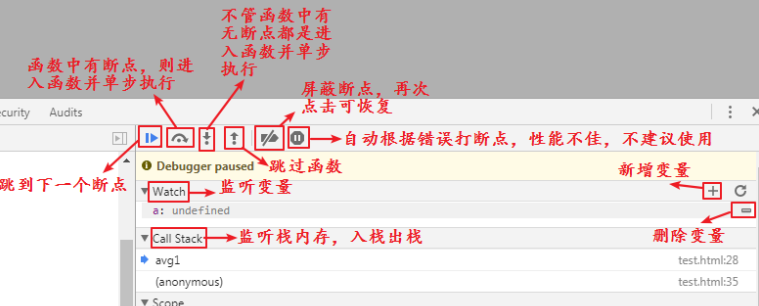

# 函数-上

引入：

先问大家一个问题，大家洗过衣服吧？

手动怎么洗？拿个盆，接水，放衣服，倒洗衣粉，洗，涮，拧干

挺费劲的，有没有简便的方法？

使用洗衣机，衣服放进去，倒上洗衣粉，按开关，一切就都搞定了

在生活中这样的例子有很多，大到洗衣机空调，小到水龙头剪刀。每个工具都有自己不同的功能。为了生活方便简洁，就会使用这些工具。

程序员是一群很会享受生活的群体，所以在代码中也有很多这样的工具，就是咱们今天要学习的函数。

总结：代码中工具----函数

## 一、概念：

函数就是具备某个功能的一个工具。是完成某个功能的一段代码。

大家以前有没有用过函数呀？

parseInt() alert()  这都是函数，是系统提供的，直接拿来就能用。

系统提供了很多函数，但是并不能包含所有的功能，所以有些功能需要我们自己来写----自定义函数。函数定义好以后，就可以像系统函数一样使用了，不用再重复写了。

所以经常写的代码，就写一个函数，需要的时候调一下好了。

自定义函数怎么写？

## 二、函数语法

### 1、定义语法：

```shell
function 函数名(){
	代码段
}
# function是一个关键字，函数名自定义，定义规则和变量的定义规则相同
```

当我们定义好函数，并在页面中刷新的时候，会发现这段代码并没有被执行。因为函数定义好后，是不会自动执行的，需要我们进行调用。

### 2、函数的调用：

```shell
语法：
	函数名()
```

调用的语法很简单，这样我们以后还需要执行函数中的代码的时候，就不用再重写那么多的代码了，只需要简单的将原来定义好的函数进行调用即可。

```javascript
// 定义函数:求两个数的和
function fn(){
    var a = 1;
    var b = 2;
    var c = a + b;
    console.log(c);
}
// 函数定义好以后，不会自动执行，需要手动调用
fn();
```

### 3、带参数的函数：

函数代码中会发生改变的值用变量来代替，入口是声明函数时的小括号

```js
function zizeng(a){  // 叫做形参 - 形式上的参数
    var b = a + 1;
    console.log(b);
}
```


调用函数的时候，需要给参数赋值

```js
zizeng(1); // 实参 - 实际上的参数，实参其实就是给形参赋值
```

声明函数时候带进去的那个参数叫形参

调用函数的时候给形参进行赋值的实际值是实参

## 三、函数的本质

当我们去调用函数的时候，通过函数的名称就可以调用到，那说明我们在定义函数的时候，函数就已经保存起来了，所以下面才能调用出来。

函数定义在内存中的体现：

```js
function fn(){
    console.log(11)
}
```

这段代码，在内存创建了一个空间，名字叫fn，这个空间中存储的数据是函数这整段代码。

调用函数，就相当于将这段代码拿出来执行。

## 四、匿名函数

既然函数的定义跟变量的定义过程差不多，那函数的定义就可以像变量一样进行。

```js
var f = function fn(){
	console.log(12)
}
```

这是定义一个变量，将函数代码放到变量空间中，这样的函数也是可以正常进行调用的，就使用变量的名称就行：

```js
f() // 12
```

那fn这个函数的名字还能进行调用吗：

```js
fn() // fn is not defined
```

这就说明，当将一个函数赋值给一个变量的时候，这个函数的名字就没有用了，所以我们可以将这个函数名称省略：

```js
var f = function(){
	console.log(12)
}
```

这样还是可以正常调用的：

```js
f()
```

这种没有名字的函数就叫做匿名函数。

匿名函数不能单独存在，会报错：

```js
function(){
    console.log(13)
}
```

除非将这个函数用小括号括起来：

```js
(function(){
    console.log(13)
})
```

但是这种没有名字的函数就无法调用了，js提供了一个专门用来调用匿名函数的语法：

```js
(function(){
    console.log(13)
})()
```

后面加小括号就表示调用，这种定义并调用函数的语法，叫做自调用函数。即，函数定义好立即调用。

自调用函数也可以不给函数加小括号，在函数前加感叹号或波浪线：

```js
!function(){
    console.log(14);
}()

~function(){
    console.log(14);
}()
```

同样是立即执行的函数。

这种函数也是可以传参数的：

```js
(function(a,b){
    var c = a + b;
    document.write(c);
})(1,2);
```

## 五、带返回值的函数

之前的函数，在调用后，就是将函数中的代码执行了，没有得到一个结果，如果我们希望函数调用后得到一个结果，在后续的代码中，需要用到这个结果，例：

```js
// 求三门成绩的和
function add(ch,math,en){
    var sum = ch + math + en;
    console.log(sum)
}
// 根据函数中求出的和，计算平均数
var avg = add(20,30,40)
```

上面的函数是没有办法实现的，此时，需要使用函数的返回。

不是所有的程序的结果都需要输出在页面中，有时候，我们只是想让这一段代码得出一个结果，后续代码得到这个结果后进行后续处理。那么上面的函数显然已经不适用了。我们需要使用函数的返回。

函数返回结果，在函数中使用return关键字，后面跟要得到的结果。

```js
function add(ch,math,en){
    var sum = ch + math + en;
    return sum
}
```

此时调用函数，就得到一个结果，可以将这个结果赋值给变量或进行下一步操作。

```js
function add(ch,math,en){
    var sum = ch + math + en;
    return sum
}
var a = add(20,30,40)
var avg = add(20,30,40)/3
```

return关键字除了可以给函数调用返回结果，还可以结束函数运行：

```js
function add(ch,math,en){
    var sum = ch + math + en;
    return sum
    console.log(sum)
}
add(20,30,40)
```

我们发现，调用函数后，函数中的输出代码没有执行，也就是return将函数结束了。

return在返回结果的时候，只能返回一个结果，不能返回多个：

```js
function add(ch,math,en){
    var sum1 = ch + math
    var sum2 = ch + math + en
    return sum1,sum2
}
var res = add(20,30,40)
console.log(res) // 90
```

调用后的res值得到一个90的结果，就说明return只能得到一个结果，不能得到多个。

return总结：

1. 终止代码继续运行
2. 函数运行后返回一个结果，只能返回一个

## 六、预解析

```javascript
console.log(a); // 因为变量a没有声名过，所以会报错
test(); // 函数未定义，所以报错
```

所以在正常情况下，变量要使用或函数要调用，都需要提前定义变量或函数。

```js
var a = 10;
console.log(a)
function test(){
    console.log("this is test function")
}
test()
```

但我们发现一件比较有意思的事情：先输出变量，然后再定义变量，浏览器不报错；先调用函数，再定义函数，不报错，函数能调用

```js
console.log(a)
var a = 10;
test()
function test(){
    console.log("this is test function")
}
```

原因是浏览器执行js代码之前，会有一个预解析的过程：

浏览器中有一段程序专门用来解析js代码， 叫做js解析器。js解析器在执行js代码的时候，分两步进行：

1. 预解析js代码

   预解析的过程，就是查找代码中的var和function这两个关键字，找到以后，将变量和函数提前存到内存中，并给他们赋一个初始值，变量的初始值为undefined，函数的初始值为代码段。

2. 开始按顺序一行一行解读代码

   解读代码的时候，会略过变量和函数的定义，因为变量和函数的定义已经提前放在内存中了，提前储存的变量和函数的值会随着代码的解读而发生变化，也就是变量的赋值和函数的调用。

预解析分为变量的预解析和函数的预解析，也就是代码在执行之前先进行解析，将变量和函数的定义放在内存中。

但是在打印之后声名过变量的话，情况就不一样了。

```javascript
console.log(a)
var a = 10;
test()
function test(){
    console.log("this is test function")
}
```

代码执行之前先预解析：

```js
// 先将变量和函数的定义放在内存中
var a
function test(){
    console.log("this is test function")
}
// 下面就忽略掉定义的过程
console.log(a)
a = 10;
test()
```

开始按照预解析后顺序执行：

```js
var a
function test(){
    console.log("this is test function")
}
console.log(a) // 前面有定义过变量a，没有赋值，所以变量的值为undefined
a = 10; // 将a的值改变为10
test() // 前面有定义过函数，内存中能找到，所以调用成功
```

面试题：

```javascript
// 第1题
console.log(num)
var num = 100
// 第2题
fn();
function fn() {
	console.log(123);
}
// 第3题
console.log(fn)
fn()
var fn = function () {
	console.log(123);
}
// 第4题
fun()
var fn = function () {
	console.log('我是 fn 函数')
}
function fun() {
	console.log('我是 fun 函数')
}
fn()
fn = 100
fn()
// 第5题
fn()
function fn() {
	console.log('我是一个 fn 函数')
}
fn()
var fn = 100
fn()
// 第6题
var fun = 200
fun()
var fun = function () {
console.log('我是一个 fun 函数')
}
fun()
// 第7题
var a = b
a = 0
b = 0
console.log(a)
console.log(b)
// 第8题
console.log(num)
if (false) {
	var num = 100
}
```

预解析总结：

1. 匿名函数赋值给变量的定义方式，预解析时遵循变量的预解析规则，不会将函数代码预解析

2. 预解析的时候，会将定义提前放在内存中，不会提前将赋值放在内存中

3. 如果变量名和函数名同名了，保留函数预解析，忽略变量预解析

   因为函数预解析其实包含了赋值的过程，函数定义放在内存中的时候将函数的代码也放在内存中

   变量的预解析只有空间，没有值，所以如果是先预解析变量，那后面的函数预解析赋值就将空间中放入了值，如果是先预解析的函数，再次预解析变量的时候，空间已经存在了，再次定义空间也是没有意义的。

4. 省略var定义的变量是不会有预解析的

5. js代码如果报错了，那后面的代码就不会执行了

6. 不会执行的代码中有变量或函数定义也会预解析，因为预解析在执行之前。

## 七、函数的嵌套

函数结构中的大括号，里面放的是代码段，既然是代码段，就可以写判断、循环甚至函数代码，这样就形成了函数的嵌套。

函数的大括号中可以写函数的定义，可以写函数的调用：

```js
function fn(){
    console.log(1)
    function fun(){
        console.log(2)
    }
    fun()
}
fn()

function fn(){
    console.log(1)
}
function fun(){
    fn()
    console.log(2)
}
fun()
```

## 八、函数的调试

| 示意图                                    |
| ----------------------------------------- |
|  |
