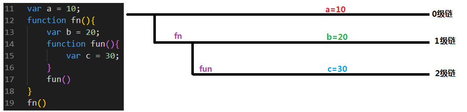
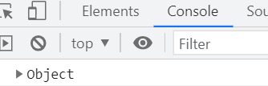
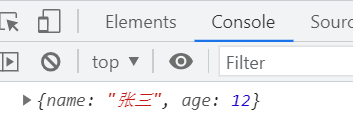
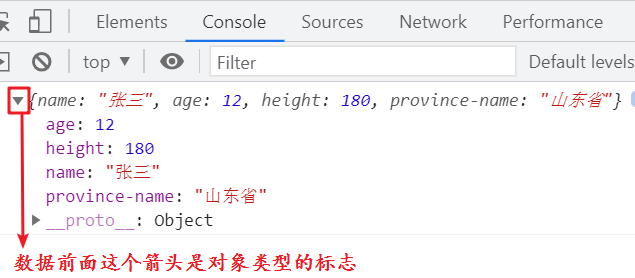
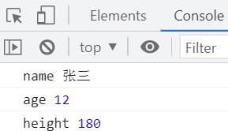
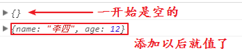
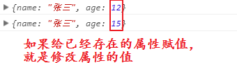
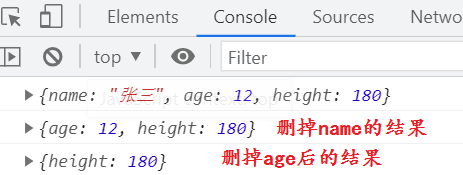
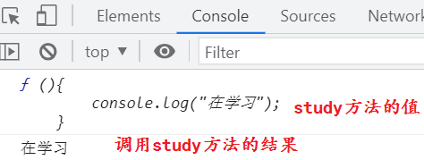

typora-copy-images-to: media

# 函数-下

## 一、作用域

能起到作用的区域就叫做作用域。定义在不同区域的变量，他的作用域是不一样的。

不在任何一个函数中定义的变量叫全局变量。他的作用域是定义之后的所有文档区域。

例：

```html
<script>
var a = 10
</script>
<script>
console.log(a); // 后面的script标签能用
function fn(){
    console.log(a); // 后面的函数中能用
}
fn()
</script>
```

在函数中定义的变量叫局部变量。他的作用域是当前这个函数中，函数外不能使用。
例：

```js
function fn(){
    var a = 10
}
fn()
console.log(a); // 报错：a is not defined
```

如果全局和局部都有同名的变量，局部输出时如何输出呢？

```js
var a = 10;
function fn(){
    var a = 20;
    console.log(a) // 20
}
fn()
```

变量在输出时，首先考虑当前作用域，当前作用域中就会输出当前作用域中的变量，如果当前作用域中没有，才会考虑外面的全局。

## 二、作用域链

### 1、作用域链规则

函数是写在全局中，也就是说，局部作用域是被嵌套全局作用域中的。函数中也是可以定义函数的，也就是局部作用域中可以再有局部作用域，这样就形成了作用域的嵌套，我们将这个链式结构叫做作用域链。

例：

```js
var a = 10;
function fn(){
    var b = 20;
    function fun(){
        var c = 30;
    }
    fun()
}
fn()
```

这段代码的作用域链如下：

 

作用域链有助于我们分析变量的使用以及赋值规则，规则如下：

1. 当使用变量(将变量当做值赋值，输出变量，使用变量计算)的时候，先在当前作用域中找是否定义过变量，如果定义过，就使用；如果没有定义过，就去上一级作用域中找是否定义过，定义过就使用，没有定义就继续去上级作用域中找，......直到找到全局，全局中如果定义过，使用的就是全局中的变量；**如果全局中没有定义过，报错：XXX is not defined**
2. 当给一个变量赋值的时候，先在当前作用域中找是否定义过这个变量，如果定义过，就给这个变量赋值；如果没有定义过，就去上级作用域中找是否定义过，找到就赋值，没找到就继续去上级作用域中找，......直到找到全局，全局中定义过，就给这个全局变量赋值，**如果全局没有定义过，就在全局定义这个变量并赋值**

### 2、作用域练习

```js
function fn() {
    console.log(num)
    return
    var num = 100
}
fn()

var num = 10;
fn1();
function fn1() {
    console.log(num);
    var num = 20;
}

var a = 18;
fn2();
function fn2() {
    var b = 9;
    console.log(a);
    console.log(b);
}

fn3();
console.log(c);
console.log(b);
console.log(a);
function fn3() {
    var a = b = c = 9;
    console.log(a);
    console.log(b);
    console.log(c);
}

var a = 4;
console.log(a);
a = 6;
console.log(a);
function a() {
    console.log('哈');
}
a();
a = 10;
console.log(a);

function fn(a) {
    console.log('我是 fn 函数')
    a()
    function a() {
        console.log('我是函数 a')
    }
}
fn(10)
```

结论：

1. 全局中有预解析，局部中也有预解析，局部的预解析，只能在局部中进行，不会将变量提升到全局
2. 使用连等的方式定义变量并赋值，只有第一个有定义过程，其余的都是直接赋值
3. 函数定义好以后，函数名就跟变量名一样，可以使用函数名修改这个空间中的值
4. 局部的预解析会在形参赋值之后，预解析中的函数会覆盖掉形参赋的值

## 三、递归函数

递归函数就是在函数中调用自己。

```javascript
// 求10的阶和，即：10+9+8+...+1
function facSum(num){
	if(num == 1){
		return 1;
	}
	return num + facSum(num-1);
}
var res = facSum(10);
console.log(res); // 55
```

## 四、事件

### 1、概念

js中的事件指的是用户在网页中的行为，例如：鼠标点击、鼠标移动、。。。。。。

事件通常由3个要素组成：

1. 事件源：触发事件的标签元素，例如，点击的是div、还是button 。。。
2. 事件类型：行为的类型，是单击还是双击，还是右击。。。
3. 事件处理程序：事件触发后要做的事情 - 函数

### 2、语法

```js
事件源.on事件类型 = 函数
```

例：

```html
<button id="btn">按钮</button>
<script type="text/javascript">
	btn.onclick = function(){
		alert("点击了按钮！");
	}
</script>
```

事件类型

| 事件        | 备注                             |
| ----------- | -------------------------------- |
| onclick     | 当鼠标左键单击                   |
| ondblclick  | 当鼠标左键双击                   |
| onmouseover | 当光标在指定的内容上面           |
| onmouseout  | 当光标离开指定的内容             |
| onkeydown   | 当键盘按下的那一刻               |
| onkeyup     | 当键盘抬起的那一刻               |
| onfocus     | 当输入框得到焦点                 |
| onblur      | 当输入框失去焦点                 |
| onchange    | 当指定的标签里面内容有变化的时候 |
| onsubmit    | 提交事件                         |
| onload      | 当整个网页加载完成后             |

事件的其他写法：

```js
// 给事件赋值函数名称
btn.onclick = fn
function fn(){
	console.log('点击了按钮')
}
// 给事件赋值变量名 - 值是函数
var fn = function(){
    console.log('点击了按钮')
}
```

注意：如果给事件赋值函数名，千万不能加小括号调用

事件还可以写在行内：

```html
<!-- 直接在行内写js代码 -->
<button onclick="console.log('点击了按钮')">按钮</button>
<!-- 可以在行内调用函数 -->
<button onclick="fn()">按钮</button>
<script>
    function fn(){
        console.log('点击了按钮')
    }
</script>
```

注意：在行内的事件中调用函数一定要加小括号调用才行

js可以像css一样有3种写法：

- 行内写法：事件

- 内联写法：平常写的代码

- 外联写法：项目中要将js代码放在一个文件中，在html中引入js文件

  ```html
  <script src="js文件路径"></script>
  ```

  

## 五、对象

### 1、概念

如果我们存储一个人信息的姓名和年龄，需要两个变量：

```js
var name = '张三'
var age = 12
```

如果存储另一个人的信息，需要再次定义两个变量，但是变量名不能重复，因为重复会覆盖掉上面的变量：

```js
var name1 = '李四'
var age1 = 13
```

从上面4个变量，可以看出来，每个变量都是独立的，互相之间是没有联系的，如果要将多个变量组合在一起去描述一个人的信息，变量之间没有关系是很容易弄错的。

为了让多个值之间有联系，确保多个值就是用来描述一个人的，就需要对象这种数据来处理。

在学习数据类型的时候，学习过对象这种数据类型，他的表现形式：

```js
var arr = [];
var obj = {};
var none = null;
```

这三种不同的表现形式指的都是对象。我们让多个不同的值描述一个人，重点看使用`{}`定义的对象。

### 2、定义

```js
var obj = {};
```

这样定义的对象是空数据，其中什么也没有。对象中的值，是由键值对组成。

键值对是指在描述一个事物的时候，需要一个名字，对应一个值，例如：

```js
姓名:张三 // 姓名是键，张三是值
width:100px // width是键，100px是值
border=1 // border是键，1是值
```

定义有数据的对象，键和值之间使用冒号隔开，键值对之间使用逗号隔开：

```js
var obj = {
    name:"张三",
    age:12
}
```

 

对象有一个特性，第一次打开的时候，只能看到Object，再次刷新页面， 会显示里面的数据：

 

对象中键值对的数量没有限制，可以有任意多个：

```js
var obj = {
    name:"张三",
    age:12,
    height:180,
    weight:150
};
```

对象中的键都是字符串，只是正常情况下可以省略引号，但如果键中包含连字符，就不能省略引号了：

```js
var obj = {
    "name":"张三",
    age:12,
    height:180,
    "province-name":"山东省"
};
console.log(obj);
```

 

从输出的结果中能看到，书写顺序和显示的顺序是不同的，因为对象中的键值对是没有顺序的。

### 3、对象的基本操作

访问对象中的值：

```shell
对象.键 # 这种方式的属性名不用加引号
# 或
对象[键] # 这种方式的属性名必须加引号
```

例：

```js
var obj = {
    name:"张三",
    age:12
};
console.log(obj.name);
console.log(obj["age"]);
```

对象的遍历：

遍历的意思就是将每一个值都访问一遍。

js提供了专门用来遍历对象的操作语法：

```shell
for(var attr in obj){
    # 这里的attr代表对象属性名
    # obj表示这个对象
}
```

例：

```js
var obj = {
    name:"张三",
    age:12,
    height:180
};
for(var i in obj){ 
    // 这里的i表示对象的属性名，是一个字符串
    console.log(i,obj[i]);
}
```

 

**注意：遍历对象时，输出对象中的值，必须使用`对象[代表键的变量]`这种形式来输出**。

因为，如果使用`.`来访问的话，是有歧义的：

```js
var obj = {
    name:"张三",
    age:12,
    height:180
};
// 输出张三
console.log( obj.name );
```

如果使用一个变量来代替`name`这个键：

```js
var obj = {
    name:"张三",
    age:12,
    height:180
};
// 输出张三
console.log( obj.name );
var a = 'name'
console.log( obj.a ); // undefined
```

此时，浏览器会将`obj.a`识别为：我们正在访问obj中键为`a`的值，`.`后面的内容，表示对象中的键的名称，所以此时只能使用`[]`的形式来访问：

```js
var obj = {
    name:"张三",
    age:12,
    height:180
};
// 输出张三
console.log( obj.name );
var a = 'name'
console.log( obj[a] ); // 张三
```

此时`[]`中的`a`是一个变量，因为没有加引号，代表`['name']`。

给对象添加属性：

```js
var obj = {};
console.log(obj);
obj.name = '李四';
obj["age"] = 12;
console.log(obj);
```

打印对象的结果：

| 访问结果                                  |
| ----------------------------------------- |
|  |

如果设置的属性名是对象中已经存在的呢？

```js
var obj = {
    name:"张三",
    age:12
}
console.log(obj);
obj.age = 15;
console.log(obj);
```

打印结果：

| 访问结果                                  |
| ----------------------------------------- |
|  |

删除对象中的键值对：

```js
delete 对象.键
delete 对象[键]
```

例：

```js
var obj = {
    name:"张三",
    age:12,
    height:180
};
console.log(obj);
delete obj.name;
console.log(obj);
delete obj['age']
console.log(obj);
```

 

### 4、方法概念

对象中值的类型是没有限制的，可以是任意类型。当值不是函数的时候，我们将这个键值对叫做对象的属性，当值是一个函数的时候，我们将这个键值对叫做对象的方法。

```js
var obj2 = {
    name:'王五',
    study:function(){
		console.log("在学习");
    }
}
console.log(obj2);
```

`name`就是对象`obj2`的属性，`study`就是对象`obj2`方法

方法的访问和属性是一样的：

```js
console.log(obj2.study)
obj2.study(); // 因为函数执行需要调用，所以需要加小括号
```

 

