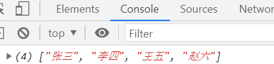

# 数组

## 一、概念

对象中可以通过键值对存储多个数据，且数据的类型是没有限制的，所以通常会存储一个商品的信息或一个人的信息：

```js
var obj = {
    goodsname:"手机",
    price:"5000",
    introduce:"手机很时尚，很漂亮！"
}

var person = {
    name:"张三",
    age:12,
    sex:"男"
}
```

但对象在存储同类型数据的时候比较困难，例如，存储一个班级所以人的姓名：

```js
var obj = {
    name1:"张三",
    name2:"李四",
    name3:"王五",
    ...
}
```

这种存储方式我们没有办法通过一个人的姓名获取到这个人的编号，也没有办法通过一个编号获取到某个人的姓名。

js提供了另外一种对象类型的数据，可以通过编号来存储数据：数组。也是对象3种表现形式中的另外一种，`[]`定义的对象。

## 二、数组定义

```js
var arr = []
```

这是一个空数组，定义带数据的数组：

```js
var arr = ['张三','李四','王五','赵六']
```

输出结果：

 

数组中的数据类型没有限制，在实际项目中，数组中通常会存储同一类型的数据。

```js
var arr = ['a',2,false,undefined,{name:"张三"}];
```

 

数组这种数据，相当于在一个大空间中，有很多小空间，每个值前面的数字，表示这个小空间的编号，专业术语叫下标。第一个下标永远是0，依次向后递增，最后一个下标是值的个数-1

也就是说，数组这种数据中每个值是有顺序的。

js还提供了一个构造函数，用来创建数组：

```js
var arr = new Array("张三","李四","王五")
```

这两种方式定义的数据是一样的。

有一种情况，这两种定义方式是不一样的：

```js
var arr = [5]
var brr = new Array(5)
console.log(arr,brr)
```

 

`[]`形式定义的是一个数组中有一个小空间，其中的值是5；构造函数方式定义的，表示有5个空的小空间。

数组的规律：

第一个值的下标永远是0;

最后一个值的下标永远是值的个数-1。

## 三、数组基本操作

数组中值的个数：`数组.length`

```js
var arr = ['张三',"李四","王五","赵六"];
var arr1 = [1,2,3,4,5,6];
console.log(arr.length); // 4
console.log(arr1.length); // 6
```

访问数组中的元素：`数组[下标]`

例：

```js
var arr = ["张三","李四","王五"];
console.log(arr[1]); // 李四
```

第一个值永远是：`数组[0]`；最后一个值永远是：`数组[数组.length-1]`

添加元素：`数组[下标] = 值`

例：

```js
var arr = ["张三","李四"];
arr[2] = "王五";
console.log(arr); // (3) ["张三", "李四", "王五"]
arr[10] = "赵六";
console.log(arr); // (11) ["张三", "李四", "王五", empty × 7, "赵六"] 中间还有7个空元素
```

修改元素：`数组[下标] = 值`

例：

```js
var arr = ["张三","李四"];
arr[0] = "王五";
console.log(arr); // (2) ["王五", "李四"]
```

使用说明：如果下标是已经存在的，那赋值操作就是修改数组元素的值，如果下标是不存在，那赋值操作就给数组添加元素。

删除元素：`delete 数组[下标]`

```js
var arr = [1,2,3];
delete arr[0];
console.log(arr)
```

 

这种删除方式，只能删除值，并不能删除小空间。

数组长度的赋值：

```js
var arr = [1,2,3];
arr.length = 0;
console.log(arr) // []

var arr = [1,2,3];
arr.length = 10;
console.log(arr)
```

 

```js
var arr = [1,2,3];
arr.length = 1;
console.log(arr) // [1]
```

遍历数组：

如果要将数组中的所有元素都输出，操作如下：

```js
var arr = ["张三","李四","王五","赵六"];
console.log(arr[0]); // 张三
console.log(arr[1]); // 李四
console.log(arr[2]); // 王五
console.log(arr[3]); // 赵六
```

从上面输出的代码中可以看出，多次输出是在进行重复动作，并且多次重复之间是有规律可循的，所以可以使用循环进行这个重复动作：

```js
var arr = ["张三","李四","王五","赵六"];
var length = arr.length;
for(var i=0;i<length;i++){ 
	console.log(arr[i]);
}
```

结果：

| 循环输出数组中的每个值                    |
| ----------------------------------------- |
|  |

这种使用循环将数组中每个元素输出的操作叫做数组的遍历 - 每个元素都经历一次

遍历对象的`for in`语法也可以遍历数组：

```js
var arr = ["张三","李四","王五","赵六"];
for(var i in arr){ 
	console.log(arr[i]);
}
```

 

两种遍历方式有区别：

```js
var arr = ['a','b','c'];
arr[5] = 'd'
console.log(arr);
for(var i=0;i<arr.length;i++){
    console.log(arr[i]);
}
```

 

空的空间会遍历出undefined

```js
var arr = ['a','b','c'];
arr[5] = 'd'
console.log(arr);
for(var i in arr){
    console.log(arr[i]);
}
```

 

空的空间不会被遍历。

```js
var arr = ['a','b','c'];
for(var i=0;i<arr.length;i++){
    console.log(i);
}
```

 

下标是数字。

```js
var arr = ['a','b','c'];
for(var i in arr){
    console.log(i);
}
```

 

下标是字符串。所以`for in`的语法更适合遍历对象，为了避免不必要的错误，尽量不要用这种语法来遍历数组。

## 四、数组练习

1. 利用for循环求数字数组中所有元素的和

   ```js
   var arr = [10,20,30,40,50];
   var sum = 0;
   for(var i = 0;i < arr.length; i++){
   	sum += arr[i];
   }
   console.log(sum);
   ```

2. 有一个数组，具体内容如下：

   ```js
   var arr = [
       "越南被曝咖啡造假：咖啡粉里掺加电池芯",
       "抗日神剧被当教材：机密文件居然有女优名字",
       "王俊凯任联合国大使：系最年轻的联合国大使",
       "行人闯红灯遭水喷 目前还在测试阶段",
       "68条鱼估价超600万 什么鱼要这么贵？"
   ]
   ```

   利用循环使用js做出如下图效果：

    

   ```js
   var arr = [
       "越南被曝咖啡造假：咖啡粉里掺加电池芯",
       "抗日神剧被当教材：机密文件居然有女优名字",
       "王俊凯任联合国大使：系最年轻的联合国大使",
       "行人闯红灯遭水喷 目前还在测试阶段",
       "68条鱼估价超600万 什么鱼要这么贵？"
   ];
   document.write("<ul>");
   for(var i=0;i<arr.length;i++){
   	document.write("<li>"+arr[i]+"</li>");
   }
   document.write("</ul>")
   ```

3. 求数组中的最大值

   ```js
   var arr = [1,9,3,6,8,5,4,7,2,12];
   // 求出最大值
   var length = arr.length;
   var max = arr[0];
   for(var i=1;i<length;i++){
       if(max<arr[i]){
           max = arr[i];
       }
   }
   console.log(max);
   ```

4. 把1~100这个100个数字存到数组中

   ```js
   var arr = [];
   for(var i=1;i<=100;i++){
       arr[arr.length] = i
   }
   ```

5. 整理数组数据，模拟京东的商品列表

    

   ```html
   <script>
       var arr = [
       {
           goodsImg:'https://img30.360buyimg.com/seckillcms/s140x140_jfs/t1/186995/37/12433/183771/60e7ffb3E1b78db87/c5696abfd650ef64.jpg.webp',
           goodsname:'荣耀畅玩20 手机 老人机 学生智能机 【咨询加赠华为原装Type-C线】 幻夜黑 全网通(6G+128G)',
           goodsoldprice:'1399',
           goodsnowproce:'1029'
       },
       {
           goodsImg:'https://img20.360buyimg.com/seckillcms/s140x140_jfs/t1/116335/26/233/214256/5e8998c4E3b5fc871/ec122a9622175d7e.jpg.webp',
           goodsname:'【纯银999十二生肖七彩建盏】【配银饰鉴定证+礼盒+礼盒袋+收藏证书】天目釉原矿铁胎茶盏主人杯茶具茶 纯手工七彩盏-莲花纯银999',
           goodsoldprice:'659',
           goodsnowproce:'199'
       },
       {
           goodsImg:'https://img12.360buyimg.com/seckillcms/s140x140_jfs/t1/182318/5/13135/123400/60e55430E14b60a71/070af11351a8de90.jpg.webp',
           goodsname:'风味坐标 手撕牛肉干 400g(经典原味)  内蒙古锡林浩特特产 高蛋白休闲零食',
           goodsoldprice:'229',
           goodsnowproce:'69'
       },
       {
           goodsImg:'https://img11.360buyimg.com/seckillcms/s140x140_jfs/t1/185818/10/12878/72765/60e41060Ed9ebc1a3/5fa7730180a53328.jpg.webp',
           goodsname:'蔬果园蓝风铃香水洗衣液除菌液母婴可用持久留香酵素英式香氛香味洗衣液洁净家庭组合套装 蓝风铃2kg*3+500g*5袋+留香珠18g*2',
           goodsoldprice:'159',
           goodsnowproce:'119'
       },
   ];
   // 遍历数组，输出标签
   for(var i=0;i<arr.length;i++){
       document.write('<li>');
       document.write('');
       document.write('<h4>'+arr[i].goodsname+'</h4>');
       document.write('<b>'+arr[i].goodsnowproce+'</b>');
       document.write('<span>'+arr[i].goodsoldprice+'</span>');
       document.write('</li>');
   }
   </script>
   <style>
   li{
       list-style-type: none;
       padding: 0;
       margin: 0;
       width: 140px;
       height: 190px;
       border:1px solid #000;
       float:left;
       margin:0 10px;
   }
   li h4{
       width: 140px;
       white-space: nowrap;
       overflow: hidden;
       text-overflow: ellipsis;
       padding: 0;
       margin: 0;
   }
   </style>
   ```

## 五、基础类型和引用类型

js中允许出现的数据：number、string、boolean、null、undefined、{}、[]、function

根据不同类型的数据存储方式以及赋值方式的不同，我们将数据分为两类：基本类型和引用类型。

基础数据类型：number、string、boolean、undefined、null

引用数据类型：[]、function, {}

基础类型和引用类型的区别：

1. 存储方式不同

   基础类型将值存在栈内存中；引用类型将值存在堆内存中，将堆内存的内存地址存在栈中。

   ```js
   var a = 1;
   var obj = {name:"张三",age:12}
   ```

    

2. 赋值过程不同

   基础类型赋值时，将值复制给另一个变量；引用类型赋值时，将栈中的地址复制给别的变量。

   ```js
   var a = 1
   var b = a;
   a = 2;
   console.log(b) // 2
   ```

    

   复制值以后，修改其中一个，另一个不会受到影响。

   ```js
   var arr = ['a','b','c'];
   var brr = arr;
   arr[0] = 'd'
   console.log(brr) // ['d','b','c'];
   ```

    

   当改变其中一个变量中的值，另一个变量中的值也会发生改变。

3. 全等的比较规则不同

   基础类型全等比较的时候，比较类型和值；

   ```js
   var a = 1;
   var b = 1;
   console.log(a === b)
   ```

   引用类型全等比较的时候比较栈中存的内存地址是否相同。

   ```js
   var arr = [1,2,3];
   var brr = [1,2,3]
   console.log(arr === brr)
   ```

注意：直接给变量赋值，一定会将变量栈空间中内容清空，然后重新放入新数据。

## 六、数组方法

如何给数组的开头添加一个元素？

```js
var arr = ['a','b','c']
for(var i=arr.length-1;i>=0;i++){
    arr[i+1] = arr[i]
}
arr[0] = 'd'
console.log(arr)
```

这样操作起来比较复杂。为了方便我们对数组进行操作，js提供了一些方法，可以快速的操作数组：

- unshift - 给数组开头添加一个或多个元素 - 返回数组新长度

  ```js
  var arr = ['a','b','c'];
  var l = arr.unshift('d')
  console.log(arr) // ['d','a','b','c']
  console.log(l) // 4
  ```

- push - 给数组的末尾添加一个或多个元素 - 返回数组新长度

  ```js
  var arr = ['a','b','c'];
  var l = arr.push('d')
  console.log(arr) // ['a','b','c','d']
  console.log(l) // 4
  ```

- shift - 删除数组的第一个元素 - 返回被删掉的元素

  ```js
  var arr = ['a','b','c'];
  var ele = arr.shift()
  console.log(arr) // ['b','c']
  console.log(ele) // 'a'
  ```

- pop - 删除数组最后一个元素 - 返回被删掉的元素


  ```js
  var arr = ['a','b','c'];
  var ele = arr.pop()
  console.log(arr) // ['a','b']
  console.log(ele) // 'c'
  ```

- splice - 对数组做增、删、改的操作

  ```js
  var arr = ['a','b','c']
  // 改 - 参数1：开始下标；参数2：删除的个数；参数3：在删除的位置放上的新的元素 - 可以是多个
  arr.splice(1,1,'d') // ['a','d','c']
  // 增
  arr.splice(1,0,'d') // ['a','d','b','c'] - 删除0个，就是不删除，然后放上新元素
  // 删 - 第三个参数可以省略
  arr.splice(1,0) // ['a','c']
  ```

- concat - 数组的拼接

  ```js
  var arr = ['a','b','c'];
  var brr = ['d','e','f'];
  // 将arr和brr合成一个更大的数组
  var crr = arr.concat(brr) // ['a','b','c','d','e','f']
  // 将一个或多个值和数组合并成一个大数组
  var crr = arr.concat(1,2,3)// ['a','b','c',1,2,3]
  ```

- sort - 数组的排序

  ```js
  var arr = [9,5,3,7,1,6,4,8,2];
  arr.sort() // 默认升序
  console.log(arr) // [1,2,3,4,5,6,7,8,9]
  arr.sort(function(a,b){ // a代表前面的数，b代表后面的数
      return a-b; // 升序 - 如果前面的数-后面的数>0，则交换位置
      return b-a; // 降序 - 如果后面的数-前面的数>0，则交换位置
  })
  ```

- reverse - 数组的反转

  ```js
  var arr = ['a','b','c'];
  arr.reverse()
  console.log(arr) // ['c','b','a']
  ```

- join - 将数组中的元素使用指定的连接符连接在一起

  ```js
  var arr = ['a','b','c'];
  var str = arr.join('_') // 参数是连接符
  console.log(str) // a_b_c
  
  var str = arr.join() // 默认使用逗号连接
  console.log(str) // a,b,c
  
  var str = arr.join('')
  console.log(str) // abc
  ```

- slice - 截取数组

  ```js
  var arr = ['a','b','c','d','e','f'];
  // 将数组中的 'b','c','d'截取出来，组成新的数组
  var brr = arr.slice(1,4) // 参数1是开始截取的下标，参数2是截取的结束下标，结果中不包含结束下标对应的元素
  console.log(brr) // ['b','c','d']
  // 如果省略第2个参数，默认从开始下标截取到数组末尾
  var crr = arr.slice(1)
  console.log(crr) // ['b','c','d','e','f']
  ```

- indexOf方法

  查找某个元素在数组中第一次出现的位置

  语法：

  ```shell
  arr.indexOf(元素,[开始查找的起始下标]);
  # 参数1：将要查找的元素
  # 参数2：可选项。从哪个下标开始往后查找
  # 返回值：如果找到了，就返回这个元素在数组中的下标，如果没有找到，就返回-1
  ```

  例：

  ```js
  var arr = [1,3,5,7,7,5,3,1];
  console.log(arr.indexOf(5)); // 2 - 查找数字5在数组中第一次出现的下标
  console.log(arr.lastIndexOf(5)); // 5 - 查找数字5在数组中最后一次出现的位置
  console.log(arr.indexOf(5,3)); // 5 - 从下标2开始查找数字5在数组中第一次出现的位置
  console.log(arr.lastIndexOf(5,4)); // 2 - 从下标4开始查找数字5在数组中最后一次出现的下标
  console.log(arr.indexOf("5")); // -1 - 数组中全是数字，找不到字符串5，所以返回-1
  ```

- forEach方法

  用于遍历数组

  语法：

  ```shell
  arr.forEach(function(值, 下标, 当前数组){
  	// 代码段
  });
  # 在这个方法中需要传入一个函数参数，这个函数的参数说明如下：
  # 参数1：数组遍历出来的每个值
  # 参数2：可选项。数组遍历出来的每个值对应的下标
  # 参数3：可选项。被遍历的当前数组
  ```

  例：

  ```js
  var arr = [1, 2, 3, 4, 5];
  arr.forEach(function(x, index, a){
  	console.log(x + '|' + index + '|' + (a === arr));
  });
  // 输出为：
  // 1|0|true
  // 2|1|true
  // 3|2|true
  // 4|3|true
  // 5|4|true
  ```

  使用说明：

  这个方法没有返回值，返回值为undefined，不会改变原来数组的值。

- map方法

  遍历数组，并将每个元素经过函数处理后，形成新的元素，所有新元素组成新数组返回

  语法：

  ```shell
  arr.map(function(值，下标，当前数组){
  	return 新的值 - 通常新的值是由旧的值处理以后得到
  });
  ```

  例：

  ```js
  var arr = [1, 2, 3, 4, 5];
  var arr2 = arr.map(function(item){
  	return item*item;
  });
  console.log(arr2); //[1, 4, 9, 16, 25]
  ```

  使用说明：

  这个方法主要用于以同样的规则处理数组中的每个值，并组成新的数组返回

- filter方法

  将数组中满足指定条件的值，组成新的数组返回

  语法：

  ```shell
  arr.filter(function(值, 下标, 当前数组){
  	return 筛选条件
  });
  ```

  例：

  ```js
  var arr = [1, 2, 3, 4, 5, 6, 7, 8, 9, 10];
  var arr2 = arr.filter(function(v, index) {
  	return v>5
  }); 
  console.log(arr2); //[6, 7, 8, 9, 10]
  ```

  使用说明：

  使用方法和功能跟map方法很像，只是运行规则不一样。map方法中的函数，用于返回新的元素，而filter方法中的函数，根据返回true或false来筛选元素

- reduce方法

  用于数组求和

  语法：

  ```js
  arr.reduce(function(a, b){
  	return a + b
  });
  ```

  其中a第一次的时候，表示第一个元素，第二次开始表示上一次返回的数据，b第一次表示第二个元素，第二个开始表示第三个元素、第四个元素。。。

- some - 判断数组中是否至少有一个元素是满足指定条件的，返回布尔值

  语法：

  ```js
  布尔值 = 数组.some(function(v,i,a){
      return 条件;
  })
  // 上面的i和a是可选参数
  ```

  例：判断所有成绩中是否有不及格的成绩

  ```javascript
  var arr = [68,95,78,56,86,63];
  var bool = arr.some(function(v,i,a){
      return v<60;
  });
  console.log(bool); // true
  ```

  some内置的原理，遍历数组，判断每个值是否满足条件，有满足的就返回true，并break循环，遍历完以后都没有一个是满足的，返回false

  ```js
  var arr = [68,95,78,56,86,63];
  var k = 0
  var bool = arr.some(function(v,i,a){
      k++
      return v<60;
  });
  console.log(bool); // true
  console.log(k); // 4
  
  var arr = [68,95,78,66,86,63];
  var k = 0
  var bool = arr.some(function(v,i,a){
      k++
      return v<60;
  });
  console.log(bool); // false
  console.log(k); // 6
  ```

  

- every - 判断数组中是否所有元素都满足指定的条件，返回布尔值

  语法：

  ```js
  布尔值 = 数组.every(function(){
      return 条件
  })
  // 上面的i和a是可选参数
  ```

  例：判断是否所有成绩都及格了

  ```js
  var arr = [68,95,78,56,86,63];
  var bool = arr.some(function(v,i,a){
      return v>60;
  });
  console.log(bool); // false
  ```

  every内置的原理，遍历数组，判断每个值是否满足条件，有不满足的就返回false，并break循环，遍历完以后都满足，返回true

  ```js
  var arr = [68,95,78,56,86,63];
  var k = 0
  var bool = arr.every(function(v,i,a){
      k++
      return v>60;
  });
  console.log(bool); // false
  console.log(k); // 4
  
  var arr = [68,95,78,66,86,63];
  var k = 0
  var bool = arr.every(function(v,i,a){
      k++
      return v>60;
  });
  console.log(bool); // true
  console.log(k); // 6
  ```

  

- find - 查找数组中第一个满足指定条件的值，找到返回值，找不到返回undefined

  语法：

  ```js
  值 = 数组.find(function(v,i,a){
      return 条件
  })
  // 上面的i和a是可选参数
  ```

  例：找出所有成绩中第一个不及格的成绩

  ```javascript
  var arr = [68,95,78,56,86,63];
  var ele = arr.find(function(v,i,a){
      return v<60
  })
  console.log(ele); // 56
  ```

  find的原理，遍历数组，判断每个元素是否满足条件，满足就返回这个元素，并break循环，如果遍历完了都没有满足条件的，就返回undefined

  ```js
  var arr = [68,95,78,56,55,86,63];
  var k = 0
  var ele = arr.find(function(v,i,a){
      k++
      return v<60;
  });
  console.log(ele); // 56
  console.log(k); // 4
  
  var arr = [68,95,78,66,86,63];
  var k = 0
  var ele = arr.find(function(v,i,a){
      k++
      return v<60;
  });
  console.log(ele); // undefined
  console.log(k); // 6
  ```

  

- findIndex - 查找数组中满足条件的第一个对应的下标，找到返回下标，找不到返回-1

  语法：

  ```javascript
  下标 = 数组.findIndex(function(v,i,a){
      return 条件
  })
  // 上面的i和a是可选参数
  ```

  例：找出所有成绩中第一个不及格的成绩的下标

  ```javascript
  var arr = [68,95,78,56,86,63];
  var index = arr.find(function(v,i,a){
      return v<60
  })
  console.log(index); // 3
  ```

  findIndex的原理，遍历数组，判断每个元素是否满足条件，满足就返回这个元素的下标，并break循环，如果遍历完了都没有满足条件的，就返回-1

  ```js
  var arr = [68,95,78,56,55,86,63];
  var k = 0
  var index = arr.find(function(v,i,a){
      k++
      return v<60;
  });
  console.log(index); // 3
  console.log(k); // 4
  
  var arr = [68,95,78,66,86,63];
  var k = 0
  var index = arr.find(function(v,i,a){
      k++
      return v<60;
  });
  console.log(index); // -1
  console.log(k); // 6
  ```

  

## 七、冒泡排序

相邻两个元素进行比较，将一个数组中的数字使用循环进行升序或降序的排列

 

```javascript
var arr = [3,2,1]; // ---> [1,2,3]
// 相邻的元素比较，就是下标i的元素跟下标i+1的元素比较 - 所以循环要比正常的遍历少一次
for(var i=0;i<arr.length-1;i++){
    // 如果前面的元素比后面的元素大
    if(arr[i]>arr[i+1]){
    	// 则交换位置
        var tmp = arr[i]
        arr[i] = arr[i+1]
		arr[i+1] = tmp
    }
}
// 这个循环结束后，arr变为：[2,1,3]
// 所以需要继续排列
for(var i=0;i<arr.length-1;i++){
    // 如果前面的元素比后面的元素大
    if(arr[i]>arr[i+1]){
    	// 则交换位置
        var tmp = arr[i]
        arr[i] = arr[i+1]
		arr[i+1] = tmp
    }
}
// 这个循环结束后，arr变为：[1,2,3]
// 两个循环代码是重复的，所以用循环处理。3个元素循环两次，4个元素循环3次，所以循环重复的次数也是数组长度-1
for(var j=0;j<arr.length-1;j++){
    for(var i=0;i<arr.length;i++){
        if(arr[i]>arr[i+1]){
        	var tmp = arr[i]
            arr[i] = arr[i+1]
            arr[i+1] = tmp
        }
    }
}
// 如果要降序排序，就将判断条件中的>改为<即可
```

## 八、选择排序

降序：先找最大值，排在最左边，再找第二大的值，往左边靠...，已经排好的，不再参与比较

 

```javascript
var arr = [3,2,1]; // ---》 [1,2,3]
// arr[0]放最小的值，所以将arr[0]跟后面所有值比较，如果有比arr[0]更小的，就跟arr[0]交换位置
for(var i=1;i<arr.length;i++){
    if(arr[0]>arr[i]){
    	var tmp = arr[0]
        arr[0] = arr[i]
        arr[i] = tmp
    }
}
// 此时的数组：[1,3,2]
// 第1个位置的数字排好了，排第2个位置上的数字
// arr[1]放剩下的数字中最小的，使用arr[1]跟后面的数字比较，如果有比arr[1]更小的，就跟arr[1]交换位置
for(var i=2;i<arr.length;i++){
    if(arr[1]>arr[i]){
    	var tmp = arr[1]
        arr[1] = arr[i]
        arr[i] = tmp
    }
}
// 此时的数组：[1,2,3]
// 重复代码用循环处理，3个数排2次，4个数排3次
for(var j=0;j<arr.length-1;j++){
    for(var i=j+1;i<arr.length;i++){
        if(arr[j]>arr[i]){
        	var tmp = arr[j]
            arr[j] = arr[i] 
            arr[i] = tmp
        }
    }
}
// 如果要进行降序排列，就将判断条件中的>换成<即可
```

