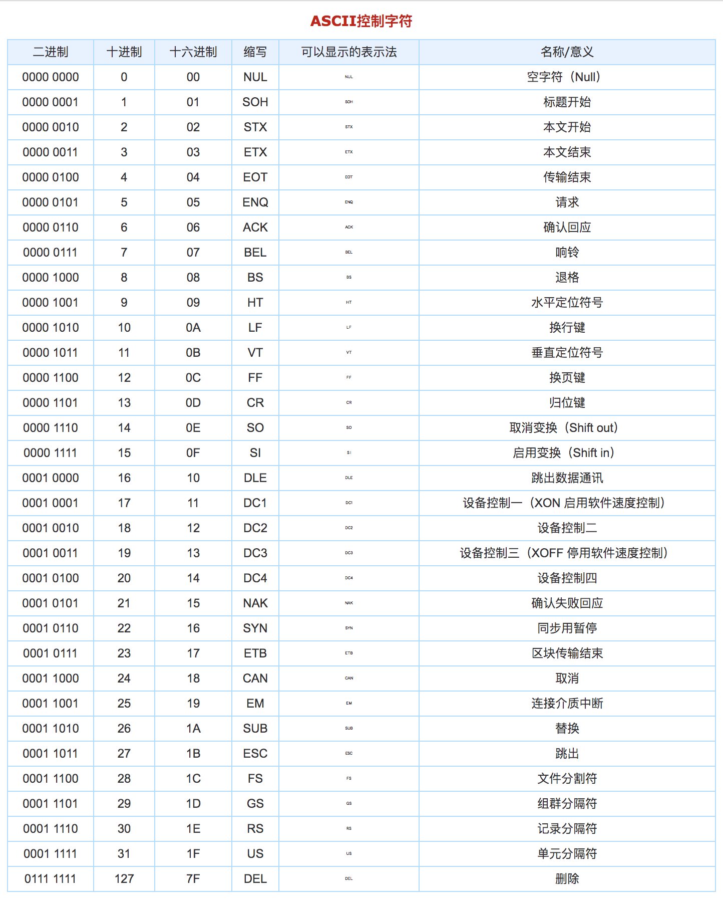
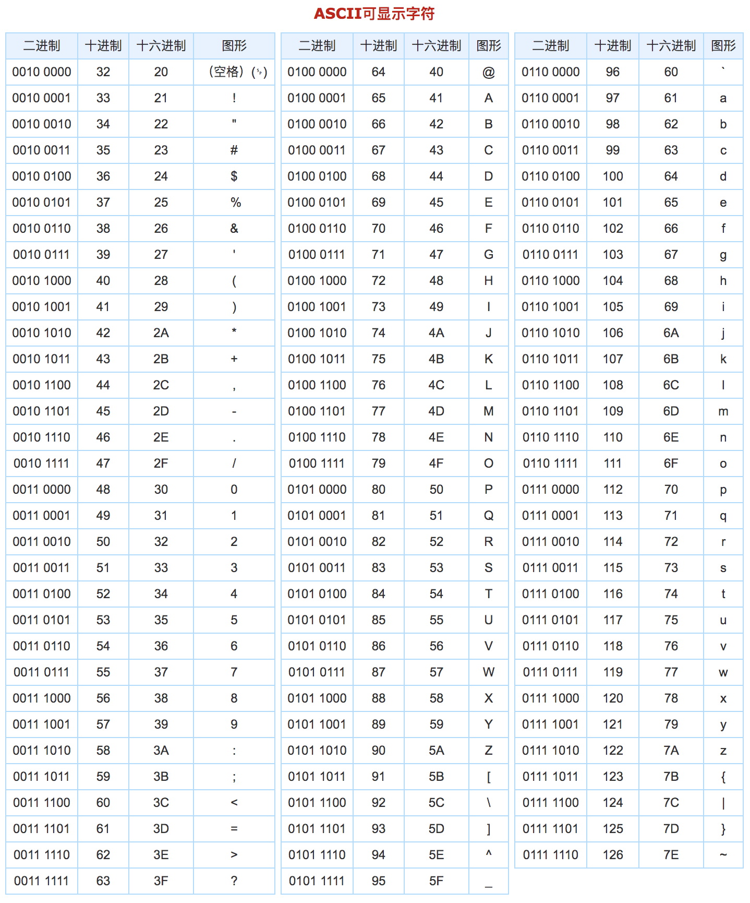

# ES5和字符串

## 一、ES5的语法

js在产生的时候，年代比较早，当时的web需求比较少，所以刚开始的js功能比较少，语法没有特别严谨。随着时代的发展和web应用的普及，js需要更多的功能，以及更严谨的语法，所以，js会有版本的升级。第一版的js是ECMA一开始统一了标准以后的版本。我们现在的所使用的语法，大多是ECMAScript版本3的语法，简称es3。到目前为止，已经有了es7,8,9,甚至es10 的版本了。近几年，基本每年都会有新的版本更新。

每个版本的更新，都需要浏览器支持才能运行，但浏览器不会在js更新之后，立马更新。所以有的版本出来之后，需要在很长时间之后，浏览器才会兼容他。到目前为止，我们公认，es5是兼容性最好的版本。

es5比起我们所正在使用的es3，语法没有什么变化，增加了一个严格模式，还有一些数组的方法。

### 1、严格模式

#### 1.1、概念

由于js的作用域和隐式声明变量等语法会造成很多预想不到的错误，所以ES5中新增了一个严格模式的语法，用于严格规范代码的书写。

#### 1.2、语法

使用语法：

```shell
"use strict";
```

使用说明：

1. 要放在代码的最前面，也就是在script标签中的第一行或者某个函数中的第一行，否则会失效
2. 严格模式可以规范当前script标签或者当前函数中的代码，不能规范别的script标签中的代码和别的函数

#### 1.3、作用

1. 不允许隐式声明变量
2. 禁止函数中的形参重名
3. 禁止函数中的this代表window

#### 1.4、好处

1. 可以让代码更加规范
2. 可以让代码运行起来更快，提高运行效率

## 二、字符串

### 1、字符串的重新认识

字符串定义：

```js
var str = '';
var str = "";
```

#### 1.1、字符串长度

字符串中字符的个数：`字符串.length`

#### 1.2、字符串取下标

字符串中获取某个字符的时候，可以根据下标来获取：

```js
var str = "abcdef";
var s = str[1]
console.log(s) // 'b'
var s1 = str[0] 
console.log(s1) // 'a'
```

所以字符串也是可以进行遍历的：

```js
var str = "abcdef";
for(var i=0;i<str.length;i++){
    console.log(str[i],i)
}
```

#### 1.3、字符串只读

那字符串是否也可以像数组一样，通过下标更改其中的某个字符呢？

```js
var str = 'abcdef';
str[str.length] = 'g'

str[0] = 'g'
console.log(str) // abcdef
```

操作后，字符串并没有新增和更改。

因为字符串是只读数据，只能读，不能增删改。

字符串可以进行比较，我们在前面的时候，有过这样的比较：

```js
console.log('12'>'5') // false
console.log('12'<'5') // true
```

字符串可以比较，但是规则跟数字比较是不一样的。

字符串比较的规则是逐字符进行比较，大小由阿斯克码来决定。

### 2、阿斯克码

#### 2.1、概念

计算机内部只能识别2进制数据，不能识别字母等字符。

为了能让计算机识别字符，科学家制定了一个对照表，当输入一段2进制指令的时候，就能显示成某个字符。

这个对照表叫做阿斯克码表，其中包含了128个常用字符跟2进制的对照关系。

|  |
| ---------------------------- |
|  |

通过阿斯克码表，我们可以得出一些字符串比较的规律：

1. 字母比数字大
2. 小写字母比大写字母大
3. 字母越靠后越大

#### 2.2、字符串比较

字符串能比较大小，中文汉字也是字符串，中文汉字也能比较大小：

```js
console.log('我'>'你') // true
console.log('你'>'我') // false
```

中文汉字的大小由unicode来决定。

阿斯克码总共128个，包含符号、大小写英文字母、数字。阿斯克码是由美国人创建的，所以对于英文的支持非常好。后来随着计算机的普及，各个国家在使用计算机的时候，没办法使用本国文字，这样用起来非常困难。所以众多国家的科学家一起制定了一个更大的对照表，包含各个国家的文字符号，所以称之为万国码，也叫作unicode。

其实unicode就是更大的阿斯克码。

### 3、字符串方法

- charCodeAt - 根据指定下标获取对应的字符的阿斯克码

  ```js
  var str = 'abcdef';
  // 获取下标为3的字符的阿斯克码
  var res = str.charCodeAt(0); // 参数为指定的下标
  console.log(res); // 97
  ```

- String.fromCharCode - 根据指定的阿斯克码得到对应的字符

  ```js
  // 获取98对应的字符
  var res = String.fromCharCode(98); // 参数为指定的阿斯克码
  console.log(res); // b
  ```

- indexOf - 查找字符或子字符串在大字符串中第一次出现的位置

  ```js
  var str = 'i love you';
  // 找到o字符在str中第一次出现的位置
  var s = str.indexOf('o'); // 参数为要查找的字符
  console.log(s); // 3
  
  var s = str.indexOf('o',4); // 参数2为开始查找的下标
  console.log(s) // 8
  
  var s = str.indexOf('a') // 查找a字符在字符串中第一次出现的下标
  console.log(s) // -1 - 找不到就返回-1
  ```

- lastIndexOf - 查找字符在字符串中最后一次出现的下标

  ```js
  var str = 'i love you';
  // 找到o字符在str中最后一次出现的位置
  var s = str.lastIndexOf('o');
  console.log(s); // 8
  
  var s = str.lastIndexOf('o',7) // 将下标7当做字符串末尾，查找字符o在字符串中最后一次出现的下标
  console.log(s) // 3
  
  var s = str.lastIndexOf('a')
  console.log(s) // -1 - 找不到就返回-1
  ```

- slice - 截取字符串

  ```js
  var str = 'abcdef';
  // 从下标1截取到下标4
  var s = str.slice(1,4) // 参数1是开始截取的下标，参数2是截取的结束下标
  console.log(s) // bcd - 结果中不包含结束下标对应的字符
  
  var s = str.slice(1) // 省略第二个参数，默认能截取到字符串末尾
  console.log(s) // bcdef
  
  var s = str.slice(-3,-1) // 下标可以使用负数表示，-3表示倒数第3个字符，-1表示倒数第1个字符
  console.log(s) // def
  
  var s = str.slice(-1,-3) // 如果开始下标比结束下标大，会截取到空
  console.log(s) // ''
  ```

- split - 将字符串使用指定的分隔符分割为数组

  ```js
  var str = 'a-b-c-d';
  var arr = str.split('-') // 参数为分隔符，使用-将字符串分割为一个数组
  console.log(arr) // ['a','b','c','d']
  
  var arr = str.split('-',3) // 参数2表示数组中要保留前几个元素
  console.log(arr) // ['a','b','c']
  
  var str = 'abcd';
  var arr = str.split() // 省略了分隔符，默认就不分割，将整个字符串当做一个元素放在数组中
  console.log(arr) // ['abcd']
  
  var arr = str.split('')
  console.log(arr) // ["a", "b", "c", "d"]
  ```

- replace - 使用新字符串将字符串中某一部分替换掉

  ```js
  var str = '你的头发还好吗？';
  str = str.replace('头发','眉毛') // 参数1是被替换的字符串中的部分，参数2是新内容
  console.log(str) // '你的眉毛还好吗？'
  
  str = str.replace('','哈哈') // 参数1为空，就会将新内容添加到原字符串的最前面
  console.log(str) // '哈哈你的眉毛还好吗？'
  ```

- trim - 去除字符串两端空白

  ```js
  var str = '    aaa          ';
  str = str.trim()
  console.log(str) // 'aaa' - 左右两端的空白被去掉了
  
  str = str.trimLeft() // 去除左边的空白
  console.log(str) // 'aaa          '
  
  str = str.trimRight() // 去除右边的空白
  console.log(str) // '    aaa'
  ```

- toUpperCase - 将字符串中字母转为大写

  ```js
  var str = 'i love you';
  str = str.toUpperCase()
  console.log(str) // 'I LOVE YOU'
  ```

- toLowerCase - 将字符串中字母转为小写

  ```js
  var str = 'I LOVE YOU';
  str = str.toLowerCase()
  console.log(str) // 'i love you'
  ```

- substr - 截取字符串

  ```js
  var str = 'abcdef';
  str = str.substr(1,3) // 参数1是开始截取的下标，参数2是截取的字符串长度
  console.log(str) // bcd
  
  str = str.substr(1) // 省略参数2默认截取到字符串末尾
  console.log(str) // bcdef
  
  str = str.substr(-4,2) // 开始截取的下标可以用负数表示
  console.log(str) // 'cd'
  
  str = str.substr(1,20) // 长度超出最大下标，就相当于省略了参数2
  console.log(str) // cdef
  ```

- substring - 截取字符串

  ```js
  var str = 'abcdef'
  str = str.substring(1,4) // 参数1是开始截取的下标，参数2是结束下标
  console.log(str) // bcd - 结果不包含结束下标对应的字符
  
  str = str.substring(1) // 省略参数2，默认截取到末尾
  console.log(str) // bcdef
  
  str = str.substring(1,1) // 开始下标和结束下标相等就截取到空字符串
  console.log(str) // ''
  
  str = str.substring(4,1) // 开始下标大于结束下标，就先交换两个参数位置，然后再截取
  console.log(str) // 'bcd'
  
  str = str.substring(-5,4) // 开始下标或结束下标是负数，就先替换为0，然后开始截取
  console.log(str) // abcd
  ```

- startsWith - 判断字符串是否以某个字符或小字符串开头

  ```js
  var str = 'abcdef'
  var bool1 = str.startsWith('a') // true
  var bool2 = str.startsWith('ab') // true
  var bool3 = str.startsWith('aa') // false
  ```

  

- endsWith - 判断字符串是否以某个字符或小字符串结尾

  ```js
  var str = 'abcdef'
  var bool1 = str.endsWith ('f') // true
  var bool2 = str.endsWith ('ef') // true
  var bool3 = str.endsWith ('ff') // false
  ```

  

- includes - 判断字符串中是否包含某个字符

  ```js
  var str = 'abcdef'
  var bool1 = str.endsWith ('cd') // true
  var bool2 = str.endsWith ('f') // true
  var bool3 = str.endsWith ('acd') // false
  ```

  

