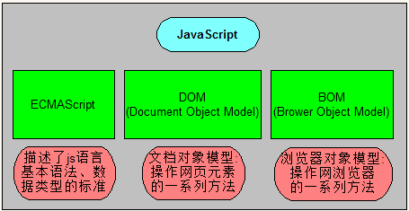
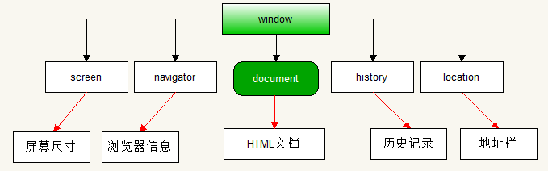
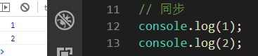
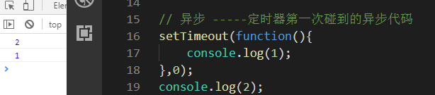
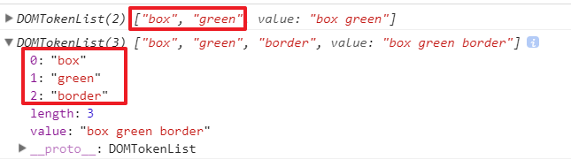
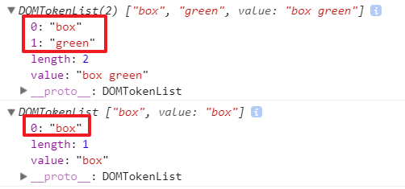
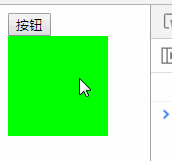
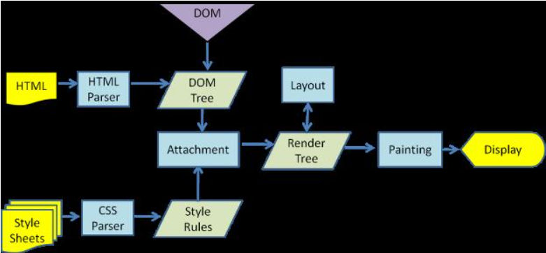

# BOM和DOM

| js的组成部分                              |
| ----------------------------------------- |
|  |

前面学习的部分是ECMAScript部分，都是基础语法部分。基础语法只是规定的代码如何写，并不能实现很多主流的操作，比如跳转页面，获取浏览器的尺寸等操作。再比如让HTML中的元素动起来。

所以需要学习BOM来操作浏览器。学习DOM来操作HTML标签。

## 一、BOM

### 1、BOM介绍

BOM是三个单词的首拼--Browser Object Model，即浏览器对象模型。

所谓对象模型，指的是用对象来描述的一个结构。

BOM意思是通过对象组成的结构来操作浏览器的。

| window对象中包含的对象                    |
| ----------------------------------------- |
|  |

### 2、浏览器的历史记录

历史记录的操作是window的子对象history。可以操作网页的前进和后退。

```shell
history.back(); # 返回到上一个页面，相当于浏览器的后退按钮
history.forward(); # 前进到下一个页面（下一个页面必须是点击以后的页面），相当于浏览器的前进按钮
history.go()
```

### 3、浏览器的地址栏信息

浏览器的地址栏操作，window对象交给了自己的子对象location对象去处理。

```js
console.log(location.hash); // 设置或返回从#开始的url --- 锚点
console.log(location.href); // 设置或返回完整的的url
console.log(location.search); // 设置或返回url中的参数部分
```

方法：

```shell
语法：
	location.assign("要跳转的地址"); # 这个方法是设置要跳转的地址
	location.reload(); # 重新加载本页面
	location.replace() # 使用新地址替换掉旧地址（跳转）
```

### 4、浏览器的弹出层

```js
window.alert("恭喜你！");
window.prompt("请输入数字：",1);
window.confirm("你确定要删除吗？")
```

### 5、浏览器窗口尺寸

- window.innerHeight - 浏览器窗口的高度
- window.innerWidth - 浏览器窗口的宽度

```js
var w = window.innerWidth;
console.log(w);
var h = window.innerHeight;
console.log(h);
```

说明：

1. 这两个属性返回的单位是像素
2. 这两个属性计算的范围包含滚动条的区域

### 6、浏览器的事件

onload事件：当网页中的所有资源都加在完成之后执行这个事件

```js
window.onload = function(){
	console.log("当网页中所有资源加载完成才打印");
}
```

使用说明：通常是将script标签放到head标签中的时候使用。因为放在head中默认是获取不到body中的内容的，但是有了这个事件后，就可以了。

onscroll 滚动事件：当网页滚动条的位置发生改变的时候触发这个事件

```js
window.onscroll = function () {
  console.log('浏览器滚动了')
}
```

使用说明：浏览器要有滚动条才行。

浏览器窗口改变事件：resize

```js
window.onresize = function(){
    // 当浏览器的窗口大小发生改变的时候触发这个事件
}
```

### 7、定时器

延迟执行：

```js
var timerId = setTimeout(function () {
  console.log('我执行了')
}, 1000)
console.log(timerId) // 1
```

使用说明：第一个参数是要执行的函数，第二个参数延迟的时间（单位毫秒）。返回一个数字，表示当前页面中第几个定时器。

每间隔一段时间执行：

```js
var timerId = setInterval(function () {
  console.log('我执行了')
}, 1000)
```

使用说明：第一个参数是要执行的函数，第二个参数是间隔的时间（单位毫秒）。返回一个数字，表示当前页面中第几个定时器。

关闭定时器：

定时器返回的数字，就是用来关闭定时器的

```js
clearTimeout(timerId); // 关闭延迟执行的定时器
clearInterval(timerId); // 关闭间隔执行的定时器
```

使用说明：其实这两个方法可以混用。

```js
var timerId = setTimeout(function () {
  console.log('倒计时定时器')
}, 1000)
// 关闭延迟执行定时器
clearInterval(timerId)

var timerId2 = setInterval(function () {
  console.log('间隔定时器')
}, 1000)
// 关闭间隔定时器
clearTimeout(timerId2)
```

### 8、异步操作

异步和同步的概念

张三叫李四一起去吃饭，张三说他还有作业没做完，让李四先去，李四去吃饭，张三在写作业，这两个人做的事情不一样，但是在同一时间段内，两个人的事情在同时做，这就是异步。

张三叫李四一起去吃饭，张三说他还有作业没做完，让李四等一下，李四就等张三做完作业后两个人才一起去吃饭。这就是同步。

同步意思是同一时间只能做一件事情，多件事情需要排队按照顺序执行。异步就是同一时间可以做多件事情。

我们平常写的代码都是同步代码，定时器我们接触到的第一个异步代码。

js的特点是单线程的，也就是同一时间只能做一件事情，所以js会将异步代码交给浏览器去处理，因为浏览器是多线程的。

js的线程，会先将所有同步代码执行完，与此同时，浏览器也在处理异步代码(例如正在等待时间)，当浏览器中的异步代码到了应该执行的时候了，会将需要执行的异步代码放在一个队列中，进行排队等候；当js线程将所有同步代码执行结束后，会从队列中拿出第一个需要执行的代码去执行，执行过一个以后，再次到队列中拿出第二个需要执行的代码去执行。。。。

<font color="red">js的异步操作，是在所有同步代码执行完成以后才执行异步代码</font>

一般情况代码是按顺序执行的，上一行代码执行结束之前，下一行代码一直在等待，这是同步机制

| 同步执行示意图                            |
| ----------------------------------------- |
|  |

异步代码是等待同步代码都执行完成以后，才运行异步代码，如下图：

| 异步执行示意图                            |
| ----------------------------------------- |
|  |

### 9、窗口控制

#### 9.1、打开新的窗口

语法：

```js
window.open(url, 窗口名称, 窗口风格)
```

参数说明：

```shell
如果url为空，会打开一个空的标签页；url不为空，就打开目标url页面
窗口名称是一个字符串
窗口风格：
	height：窗口高度，数字，不能小于100
	width：窗口高度，数字，不能小于100
	left：窗口左边距离，数字
	top：窗口上边距离，数字
```

返回新窗口的window

#### 9.2、关闭窗口

语法：

```js
window.close()
```


#### 9.3、设置窗口滚动

语法：

```js
window.scrollTo(x, y)
```

设置卷去的距离。

## 二、DOM

### 1、DOM介绍

DOM的全拼是：Document Object Model，叫做文档对象模型。

就是使用对象结构操作html文档。例如，改变标签的背景颜色，让标签移动产生动画。。。。

DOM中的顶级对象是document，言外之意，DOM其实是属于BOM的。

例如：

```javascript
window.document.write();
window.document.bgColor="red";
```

### 2、html基本结构的操作：

1. document.body :body比较常用, 并且在页面中是唯一的, 因此可以使用document.body直接获取   
2. document.documentElement :  可以获取html元素及其所有内容
3. document.head : 可以直接获取head元素
4. document.title : 可以直接获取title的文本

### 3、获取元素

在js中，标签的id名，可以当做是变量，直接就能代表这个标签元素，但是，id名可以随便定义，但是变量名不能随便定义，所以使用id名代表标签是有风险的。所以需要通过方法来获取到标签元素，自己定义给变量，可以避免这种风险。

通过document获取节点

```javascript
document.getElementById("标签id名"); // 通过标签的id名获取标签
document.getElementsByTagName("标签名"); // 通过标签名获取标签
document.getElementsByClassName("标签类名"); // 通类名获取标签
document.getElementsByName("标签的name属性的值"); // 通过标签的name属性获取标签
// 上述4种获取标签的方法，除了通过id可以准确获取到元素，别的方法都是只能获取到元素的集合（类数组）
```

使用css选择器获取元素：

```js
documen.querySelector(css选择器); // 获取到匹配css的第一个元素
documen.querySelectorAll(css选择器); // 获取到匹配css的所有元素
```

### 4、内容操作

```shell
语法：
	元素.innerHTML # 代表元素中的所有内容（包含标签）
	元素.innerText # 代表元素中的文本内容
	表单元素.value
	# 单标签操作内容其实就是在操作元素的属性
```

例：

```html
<body>
<div id="box" introduce="区域"><p>我是盒子</p></div>
</body>
<script type="text/javascript">
	document.getElementById("box").innerText = "今天你要嫁给我";
	var text = document.getElementById("box").innerText;
	document.write(text);
	document.getElementById("box").innerHTML = "<a href='http://www.baidu.com'>百度</a>";
	var content = document.getElementById("box").innerHTML;
	console.log(content);
```

### 5、样式操作

#### 5.1、设置样式

语法：

```js
元素.style.css属性名 = css属性值; # 给标签设置样式
```

例：

```html
<body>
<style type="text/css">
	#box{
		width:100px;
		height:100px;
		background:#f00;
	}
</style>
	<input type="button" id="btn" value="走你">
	<div id="box"></div>
</body>
<script type="text/javascript">
	var n = 0;
	document.getElementById("btn").onclick=function(){
		n += 100;
		document.getElementById("box").style.marginLeft = n + "px";
	}
</script>
```

这样设置的样式都是行内样式。

#### 5.2、获取样式

语法：

```js
window.getComputedStyle(标签)
```

返回所有样式键值对组成的对象。

### 6、元素类名

使用元素的className属性可以设置元素的类名，也可以获取类名

```html
<body>
  <div class="box"></div>

  <script>
    var div = document.querySelector('div')
   	div.className = 'test'
    console.log(div) // <div class="test"></div>
      
    console.log(div.className) // test
  </script>
</body>
```

classList类名操作：

添加类名，语法：`类名列表.add(类名)`

例：

```html
<style>
.box{
    width: 100px;
    height: 100px;
    background-color: #f00;
}
.green{
    background-color:#0f0;
}
.border{
    border:10px solid #00f;
}
</style>
<body>
<button>按钮</button>
<div class="box green"></div>
</body>
<script type="text/javascript">
// 获取标签元素
var box = document.querySelector(".box");
// 获取标签类名列表
var list = box.classList;
console.log(list);
// 获取按钮
var btn = document.querySelector("button");
// 给按钮绑定单击事件
btn.onclick = function(){
    // 给类名列表中添加一个类名
    list.add('border')
}
</script>
```

效果：

| 添加类名                                  |
| ----------------------------------------- |
|  |

删除类名，语法：`类名列表.remove(类名)`

```js
btn.onclick = function(){

    // 将green从类名列表中删除
    list.remove('green')
    console.log(box.classList)
}
```

效果：

| 删除类名                                  |
| ----------------------------------------- |
|  |

让类名在删除和添加之间切换，语法：`类名列表.toggle(类名)`

例：

```js
btn.onclick = function(){

    // 让green类名在删除和点击之间切换
    list.toggle('green')
}
```

效果：

| 切换类名                           |
| ---------------------------------- |
|  |

判断类名列表中是否包含指定类名：`类名列表.contains(类名)`

例：

```js
console.log(list.contains('green'))
```


### 7、属性操作

#### 7.1、标签属性

```shell
元素.setAttribute(属性名,属性值) # 设置元素的属性
元素.getAttribute(属性名); # 获取元素属性
元素.removeAttribute(属性名); # 删除元素属性
```

#### 7.2、对象属性

```shell
元素.属性名 = 值;
console.log(元素.属性名);
```

例：

```js
btn.onclick=function(){
    img.src = '2.jpg';
}
```

#### 7.3、H5的自定义属性操作

当给标签添加属性以`data-XXX`开头时，H5提供了一个快速操作属性的api：

```js
标签.dataset.XXX // 获取属性的值
```


### 8、页面卷去的距离

语法：

```js
document.documentElement.scrollTop
```

上面这个语法当html没有文档声明的时候，是获取不到的，彼时，需要用到另外一个语法来获取：

```js
document.body.scollTop
```

兼容写法 - 不管什么情况下都能获取到：

```js
var t = document.documentElement.scrollTop || document.body.scrollTop
```

### 9、短路运算

利用逻辑运算中的`&&`和`||`让赋值操作变得更灵活，并带有选择性。

```js
var 变量 = 数据1 && 数据2
```

当数据1为true，不能决定整个条件的结果，还需要进行到数据2，所以此时会将数据2赋值给变量。

当数据1为false，就已经知道整个条件的结果了，就没有必要进行到数据2了，所以此时会将数据1赋值给变量

```js
var 变量 = 数据1 || 数据2
```

当数据1为true，就已经能决定整个条件的结果了，就没有必要进行数据2了，此时就将数据1赋值给变量

当数1为false，还不能决定整个条件的结果，需要进行到数据2，此时就会将数据2赋值给变量

案例：

1. 随机点名
2. 实时显示当前时间
3. 全选全不选案例

### 10、节点操作

DOM 就是我们 html 结构中一个一个的节点构成的。不光我们的标签是一个节点，我们写的文本内容也是一个节点，注释，包括空格都是节点。

DOM节点分三种：元素节点、文本节点、属性节点。元素节点就是我们获取到的标签元素；标签里面的文本就是文本节点、标签上的属性就是属性节点。

#### 10.1、获取节点

获取所有子标签节点：

```js
父.children
```

获取到的是一个所有子标签组成的伪数组

获取第一个子标签节点：

```js
父.firstElementChild
```

获取最后一个子标签节点：

```js
父.lastElementChild
```

获取父标签节点：

```js
子.parentElement
```

获取上一个兄弟标签节点：

```js
标签.previouseElementSibling
```

获取上一个兄弟标签节点：

```js
标签.nextElemenetSibling
```


#### 10.2、创建标签

```js
document.createElement('标签名字符串')
```

返回创建好的标签

#### 10.3、插入节点

给父标签追加子标签：

```js
父.appendChild(子标签对象)
```

将新的子标签插入到某个旧的子标签前面：

```js
父.insertBefore(新的子标签, 旧的子标签)
```


#### 10.4、替换节点

使用新的子标签替换掉旧的子标签：

```js
父.removeChild(新的子标签, 旧的子标签)
```


#### 10.5、删除节点

父标签将指定的子标签删除：

```js
父.removeChild(子标签)
```


#### 10.6、克隆节点

将一个标签复制一份出来：

```js
标签.cloneNode()
```

返回一个标签对象，这样只能复制一个空的标签，没有内容。

```js
标签.cloneNode(true)
```

返回一个标签对象，这样可以将标签中的内容也复制出来。

### 11、获取标签尺寸

包含标签边框的尺寸：

```js
标签.offsetWidth
标签.offsetHeight
```

不包含边框的尺寸：

```js
标签.clientWidth
标签.clientHeight
```

返回纯数字。

### 12、获取元素位置

```js
标签.offsetLeft
标签.offsetTop
```

获取的是相对于设置过定位的父标签的左边距和上边距离，返回纯数字。

### 13、获取边框大小

```js
标签.clientTop
标签.clientLeft
```

获取到的是上边框和左边框的厚度，纯数字。

## 三、回流和重绘

我们在做案例的时候，通常一个标签要设置很多样式。为了方便我们批量设置样式，可以封装一个批量设置样式的函数：

```js
function setStyle(ele, styleObj) {
    for(var key in styleObj) {
        ele.style[key] = styleObj[key]
    }
}
```

这个函数在批量设置样式的时候，每遍历一次，设置一次样式，每次设置样式都设置在了行内，这样会造成多次回流，影响页面性能。

### 1、浏览器渲染过程

浏览器在渲染页面的时候，大致是以下几个步骤：

1. 解析html生成DOM树，解析css，生成CSSOM树，将DOM树和CSSOM树结合，生成渲染树；
2. 根据渲染树，浏览器可以计算出网页中有哪些节点，各节点的CSS以及从属关系 - 回流
3. 根据渲染树以及回流得到的节点信息，计算出每个节点在屏幕中的位置 - 重绘
4. 最后将得到的节点位置信息交给浏览器的图形处理程序，让浏览器中显示页面

如下图：

 

### 2、回流

回流：英文叫reflow，指的是当渲染树中的节点信息发生了大小、边距等问题，需要重新计算各节点和css具体的大小和位置。

例：在css中对一个div修饰的样式中，修饰了宽度、高度等样式，浏览器需要重新计算标签大小，这个计算的过程，就是回流的过程。

容易造成回流的操作：

- 布局流相关操作

  - 盒模型的相关操作会触发重新布局
  - 定位相关操作会触发重新布局
  - 浮动相关操作会触发重新布局

- 节点操作

  改变节点的结构或其中的文本结构会触发重新布局。

  对标签进行下面这些属性或方法操作的时候，会强行回流：

  - offsetTop
  - offsetLeft
  - offsetWidth
  - offsetHeight
  - scrollTop
  - scrollLeft
  - scrollWidth
  - scrollHeight
  - clientTop
  - clientLeft
  - clientWidth
  - clientHeight
  - getComputedStyle

  

- css

  - width
  - height
  - padding
  - border
  - margin
  - position
  - top
  - left
  - bottom
  - right
  - float
  - clear
  - text-align
  - vertical-align
  - line-height
  - font-weight
  - font-size
  - font-family
  - overflow
  - white-space

### 3、重绘

重绘：英文叫repaint，当节点的部分属性发生变化，但不影响布局，只需要重新计算节点在屏幕中的绝对位置并渲染的过程，就叫重绘。比如：改变元素的背景颜色、字体颜色等操作会造成重绘。

回流的过程在重绘的过程前面，所以回流一定会重绘，但重绘不一定会引起回流。

容易造成重绘操作的css：

- color
- border-style
- border-radius
- text-decoration
- box-shadow
- outline
- background

### 4、优化

不管是回流还是重绘，都会对浏览器的渲染造成影响，所以我们在项目中，尽量避免回流。

#### 4.1、合并样式修改

减少造成回流的次数，如果要给一个节点操作多个css属性，而每一个都会造成回流的话，尽量将多次操作合并成一个，例：

```js
var oDiv = document.querySelector('.box');
oDiv.style.padding = '5px';
oDiv.style.border = '1px solid #000';
oDiv.style.margin = '5px';
```

操作div的3个css属性，分别是padding、border、margin，此时就可以考虑将多次操作合并为一次。

方法1：使用style的cssText

```js
oDiv.style.cssText = 'padding:5px; border:1px solid #000; margin:5px;';
```

方法二：将这几个样式定义给一个类名，然后给标签添加类名：

```html
<style>
    .pbm{
        padding:5px; 
        border:1px solid #000; 
        margin:5px;
    }
</style>
<script>
    var oDiv = document.querySelector('.box');
    oDiv.classList.add('pbm');
</script>
```

#### 4.2、批量操作DOM

当对DOM有多次操作的时候，需要使用一些特殊处理减少触发回流，其实就是对DOM的多次操作，在脱离标准流后，对元素进行的多次操作，不会触发回流，等操作完成后，再将元素放回标准流。

例：

```js
var data = [
    {
        id:1,
        name:"商品1",
    },
    {
        id:2,
        name:"商品1",
    },
    {
        id:3,
        name:"商品1",
    },
    {
        id:4,
        name:"商品1",
    },
    // 假设后面还有很多
];
var oUl = document.querySelector("ul");
for(var i=0;i<data.length;i++){
    var oLi = document.createElement("li");
    oLi.innerText = data[i].name;
    oUl.appendChild(oLi);
}
```

这样每次给ul中新增一个li的操作，每次都会触发回流。

方法1：方法一：隐藏ul后，给ul添加节点，添加完成后再将ul显示

```js
oUl.style.display = 'none';
for(var i=0;i<data.length;i++){
    var oLi = document.createElement("li");
    oLi.innerText = data[i].name;
    oUl.appendChild(oLi);
}
oUl.style.display = 'block';
```

此时，在隐藏ul和显示ul的时候，触发了两次回流，给ul添加每个li的时候没有触发回流。

方法二：创建文档碎片，将所有li先放在文档碎片中，等都放进去以后，再将文档碎片放在ul中

```js
var fragment = document.createDocumentFragment();
for(var i=0;i<data.length;i++){
    var oLi = document.createElement("li");
    oLi.innerText = data[i].name;
    fragment.appendChild(oLi);
}
oUl.appendChild(fragment);
```

文档碎片就是一个虚拟的DOM节点。对文档碎片操作不会造成回流。

方法三：将ul拷贝一份，将所有li放在拷贝中，等都放进去以后，使用拷贝替换掉ul

```js
var newUL = oUl.cloneNode(true);
for(var i=0;i<data.length;i++){
    var oLi = document.createElement("li");
    oLi.innerText = data[i].name;
    newUL.appendChild(oLi);
}
oUl.parentElement.replaceChild(newUl, oUl);
```

#### 4.3、避免多次触发布局

如下回到顶部的操作：

```js
goBack.onclick = function(){
    setInterval(function(){
        var t = document.documentElement.scrollTop || document.body.scrollTop;
        t += 10;
        document.documentElement.scrollTop = document.body.scrollTop = t;
    },20)
}
```

每隔20毫秒都会重新获取滚动过的距离，每次都会触发回流，代码优化如下：

```js
goBack.onclick = function(){
    var t = document.documentElement.scrollTop || document.body.scrollTop;
    setInterval(function(){
        t += 10;
        document.documentElement.scrollTop = document.body.scrollTop = t;
    },20)
}
```

只获取一次，每次都让数字递增，避免每次都获取滚动过的距离。

对于页面中比较复杂的动画，尽量将元素设置为绝对定位，操作元素的定位属性，这样只有这一个元素会回流，如果不是定位的话，容易引起其父元素以及子元素的回流。

#### 4.4、修改批量设置样式函数

```js
function setStyle(ele, styleObj) {
    var cssText = ''
    for(var key in styleObj) {
        var cssProp = key
        for(var a = 0; a < cssProp.length; a++) {
            var charCode = cssProp.charCodeAt(a)
            if(charCode >= 65 && charCode <= 90) {
                cssProp = cssProp.slice(0, a) + '-' + cssProp[a].toLowerCase() + cssProp.slice(a+1)
            }
        }
        cssText += cssProp + ':' + styleObj[key] + ';'
    }
    ele.style.cssText = cssText
}
```


