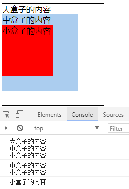

# 事件

## 一、事件复习

事件三要素： 事件源  + 事件名称 +  事件处理程序

- **事件源** : 谁触发这个事件 (按钮  btn)
- **事件名称** : 触发了什么事件 (点击click事件)
- **事件处理程序** : 事件触发后要执行的代码(函数形式)----可以是有名字的函数，要不要加小括号？不加

### 1、事件类型

#### 1.1、鼠标事件

| 事件        | 描述                             |
| ----------- | -------------------------------- |
| click       | 左键单击                         |
| contextmenu | 右键单击                         |
| dblclick    | 双击                             |
| mousedown   | 左键按下                         |
| mouseup     | 左键弹起                         |
| mouseover   | 鼠标放上去（在子元素上也会触发） |
| mouseout    | 鼠标离开                         |
| mouseenter  | 鼠标放上去                       |
| mouseleave  | 鼠标离开                         |
| mousemove   | 鼠标移动事件                     |
| mousewheel  | 鼠标滚轮事件                     |

案例：星星评分

```html
<body>


</body>
<script type="text/javascript">
var imgs = document.querySelectorAll("img");
for(var i=0;i<imgs.length;i++){
    imgs[i].index = i;
    imgs[i].onmouseover=function(){
        for(var j=0;j<=this.index;j++){
            if(j%2==0){
                imgs[j].src = './images/rank_1.gif'
            }else{
                imgs[j].src = './images/rank_2.gif'
            }
        }
        for(var j=this.index+1;j<imgs.length;j++){
            if(j%2==0){
                imgs[j].src = './images/rank_3.gif'
            }else{
                imgs[j].src = './images/rank_4.gif'
            }
        }
    }
}
</script>
```

效果图：

| 星星评分效果图              |
| --------------------------- |
|  |

#### 1.2、浏览器事件

| 事件   | 描述     |
| ------ | -------- |
| load   | 加载     |
| scroll | 滚动     |
| resize | 大小改变 |

#### 1.3、键盘事件

| 事件     | 描述 |
| -------- | ---- |
| keydown  | 按下 |
| keyup    | 弹起 |
| keypress | 敲打 |

键盘事件除了用window可以触发之外，还可以使用document，或者表单元素。总之是可以选中的元素。例如div就不行。

#### 1.4、表单事件

| 事件   | 描述               |
| ------ | ------------------ |
| submit | 提交表单           |
| focus  | 获取焦点           |
| blur   | 失去焦点           |
| change | 内容改变并失去焦点 |
| input  | input的value值改变 |

使用说明：input事件在低版本的IE中不兼容，使用`onpropertychange`代替。

## 二、事件流

每个事件发生的时候，都会有一个触发并执行的过程，也就是事件的传播过程，我们称之为事件流。

简单来说，事件流就是事件从发生到执行结束的流程。

事件流包含3个阶段：捕获阶段、目标阶段、冒泡阶段

事件捕获阶段：事件开始由顶层元素触发，然后逐级向下传播，直到目标元素，依次执行其身上绑定的事件。

事件目标阶段(处理阶段)：触发当前自身的事件。

事件冒泡阶段：事件由目标元素先接收，然后逐级向上传播，达到最顶层元素，依次执行其身上绑定的事件。

| 事件流                       |
| ---------------------------- |
|  |

事件执行的流程是先捕获阶段——》再目标元素阶段——》最后冒泡阶段。

目标元素的事件是在目标阶段执行，其他事件会在冒泡阶段执行。每个事件只会执行一次，也就是说如果在冒泡阶段执行了事件，就不会在捕获阶段执行。

例：

```html
<body>
<style>
    #big{
        width: 200px;
        height: 200px;
        border:1px solid #000;
    }
    #middle{
        width: 150px;
        height: 150px;
        background: #abcdef;
    }
    #small{
        width: 100px;
        height: 100px;
        background: red;
    }
</style>
<div id="big">
    大盒子的内容
    <div id="middle">
        中盒子的内容
        <div id="small">
            小盒子的内容
        </div>
    </div>
</div>
</body>
<script type="text/javascript">
big.onclick=function(){
    console.log(this.innerText);
    console.log("大盒子的内容完毕");
}
middle.onclick=function(){
    console.log(this.innerText);
    console.log("中盒子的内容完毕");
}
small.onclick=function(){
    console.log(this.innerText);
    console.log("小盒子的内容完毕");
}
</script>
```

访问效果：

| 冒泡示例图                                |
| ----------------------------------------- |
|  |

点击小盒子，发现小盒子事件完毕后，中盒子的事件也被触发了，接着大盒子的事件也被触发了。这就是说目标元素的事件在目标阶段执行，其他事件会在冒泡阶段执行。

<font color="blue">思考：如何让事件在捕获阶段执行？</font>

需要使用另外一种事件绑定方式。

## 三、事件侦听器

### 1、事件绑定

事件可以绑定在行内：

```html
<button onclick="alert(123)">按钮1</button>
<button onclick="fn()">按钮2</button>
<script>
    function fn(){
        alert(456)
    }
</script>
```

使用on加事件类型绑定事件：

使用on来绑定事件有弊端：同一个事件只能给一个元素绑定一次。

```html
<body>
<button id="btn">按钮</button>
</body>
<script>
btn.onclick=function(){
    console.log("第一次单击");
}
btn.onclick=function(){
    console.log("第二次单击");
}
</script>
```

访问效果：

| 事件覆盖                                  |
| ----------------------------------------- |
|  |

解决方案：

使用`addEventListener()`

语法：

```shell
obj.addEventListener(type,handle,false);
# 参数1：给元素绑定的事件类型，如：click，mouseover。。。
# 参数2：处理事件的函数
# 参数3：是否在冒泡阶段执行，true在捕获阶段执行，false在冒泡阶段执行
```

例：

```html
<body>
<button id="btn">按钮</button>
</body>
<script>
document.getElementById("btn").addEventListener("click",handle,false);
function handle(){
    console.log("第一次点击");
}
document.getElementById("btn").addEventListener("click",handle1,false);
function handle1(){
    console.log("第二次点击");
}
</script>
```

效果：

| 同一类型事件给元素绑定多次                |
| ----------------------------------------- |
|  |

让事件在捕获阶段执行：

```html
<body>
<style>
    #big{
        width: 200px;
        height: 200px;
        border:1px solid #000;
    }
    #middle{
        width: 150px;
        height: 150px;
        background: #abcdef;
    }
    #small{
        width: 100px;
        height: 100px;
        background: red;
    }
</style>
<div id="big">
    大盒子的内容
    <div id="middle">
        中盒子的内容
        <div id="small">
            小盒子的内容
        </div>
    </div>
</div>
</body>
<script>
document.getElementById("small").addEventListener("click",Click,true);
document.getElementById("middle").addEventListener("click",Click,true);
document.getElementById("big").addEventListener("click",Click,true);
function Click(){
    console.log(this.innerText);
}
</script>
```

执行效果：

| 捕获阶段执行事件                          |
| ----------------------------------------- |
|  |

点击小盒子的时候，先触发大盒子的事件，再触发中盒子的事件，最后触发小盒子的事件。

### 2、事件解绑

事件一旦绑定，会一直留在内存中。大部分事件都是执行一次就不需要了，此时，占用内存的事件就造成了内存的浪费。

所以事件绑定并执行结束，不需要再次执行的时候，是需要解绑的。

因为事件绑定方式有两种，一种通过`标签.on类型=函数`绑定，另一种是通过事件侦听器绑定，绑定方式不同，解绑的方式也是不同的。

`标签.on类型=函数`绑定的事件，是在给对象的`on类型`属性设置值为函数，未绑定前为null，所以这种绑定方式绑定的事件，可以将`标签.on类型`属性赋值为null即可解绑。例：

html页面结构：

```html
<button>按钮</button>
```

绑定前的标签对象属性：

js代码：

```js
var btn = document.querySelector('button')
console.dir(btn)
```

图示：

 

绑定后的标签对象属性：

js代码：

```js
var btn = document.querySelector('button')
btn.onclick = function() {
    console.log('这是按钮的单击事件')
}
console.dir(btn)
```

图示：

 

所以解绑就是将绑定后赋值的函数覆盖为null。

代码：

```js
var btn = document.querySelector('button')
btn.onclick = function() {
    console.log('这是按钮的单击事件')

    // 将给btn绑定的事件解绑
    btn.onclick = null
}
```

这样第一次点击可以输出，然后就将btn的事件解绑了，下次再点击就无效了。

通过事件侦听器绑定的事件，系统提供了对应的解绑函数：`removeEventListener(事件类型, 绑定的函数)`

例：

```js
btn.addEventListener('click', fn)
function fn() {
	console.log('这是btn的单击事件')
    // 将给btn绑定的事件解绑
    btn.removeEventListener('click', fn)
}
```

这样第一次点击可以输出，然后就将btn的事件解绑了，下次再点击就无效了。

<font color="red">**注意：通过事件侦听器绑定事件时，使用的函数为匿名函数，这个事件是无法解绑的。**</font>   

因为同样的匿名函数，每写一次，都是在定义一个新的匿名函数，两个匿名函数会在堆中创建两个空间存储。

<font color="blue">思考：如何让事件不冒泡？</font>

需要使用事件对象。

## 四、事件流

## 五、事件对象

浏览器为事件提供了一个对象，用来记录事件的各种具体信息，例如，鼠标点击的位置、鼠标按键的信息、键盘的键码。。。

这就是事件对象。

```html
<body>
<button id="btn">按钮</button>
</body>
<script type="text/javascript">
btn.onclick=function(){
    console.log(window.event);
}
</script>
```

点击访问结果：

| 事件对象                                  |
| ----------------------------------------- |
|  |

从结果中可以看出，这个事件对象中包含了事件的类型、鼠标点击的位置，在屏幕中和在浏览器中的位置。点开的话，里面还有很多信息。

还有另外一种写法：

```js
btn.onclick=function(e){
    console.log(e);
}
```

以前的时候，前面的写法是针对IE浏览器的，下面的写法是针对W3C标准浏览器的。上面的写法，现在基本都兼容了；下面这种写法，在IE低版本浏览器中还不兼容。

兼容所有浏览器的写法：

```js
btn.onclick = function(e){
    var ev = e || window.event
    console.log(ev);
}
```

如果是行内绑定的事件，就将事件对象当做参数传进来即可。<font color="red">且必须是event。</font>

例：

```html
<button onclcik="fn(event)">
    按钮
</button>
<script>
    function fn(e){
        console.log(e);
    }
</script>
```

### 1、获取事件类型

```js
e.type // 事件的类型
```

例：

```html
<button id="btn">
    按钮
</button>
<script>
    btn.onclick=function(e){
        var e = e || window.event;
        console.log(e.type); // MouseClick
    }
    btn.onmouseover=function(e){
        var e = e || window.event;
        console.log(e.type); // MouseOver
    }
</script>
```


### 2、获取鼠标按键码

```js
e.button // 鼠标按键的信息
```

0表示左键，1表示鼠标滚轮，2表示右键，例：

```html
<body>
<button id="btn">按钮</button>
</body>
<script type="text/javascript">
btn.onmousedown = function(e){
    var ev = e || window.event;
    var code = ev.button;
    if(code == 0){
       console.log("您点击的是左键");
    }else if(code == 1){
        console.log("您点击的滚轮");
    }else if(code == 2){
        console.log("您点击的是右键");
    }else{
        console.log("不知道你点击的是什么");
    }
}
</script>
```

### 3、获取键盘按键码

```js
e.keyCode // 键盘的键码
```

常见的按键码：

- 13： 回车键（enter）
- 32： 空格键（space）
- 数字和字母的键码是数字或字母对应的阿斯克码

例：

```html
<body>
<button id="btn">按钮</button>
</body>
<script type="text/javascript">
document.onkeypress=function(e){
    var ev = e || window.event;
    console.log(ev.keyCode);
}
</script>
```

组合按键的判断：

- `altKey` ：alt 键和别的键一起按下得到 true，否则得到 false
- `shiftKey` ：shift 键和别的键一起按下得到 true，否则得到 false
- `ctrlKey` ：ctrl 键和别的键一起按下得到 true，否则得到 false
- `metaKey`：win键和别的键一起按下返回true，否则返回false

```js
document.onkeyup = function (e) {
  e = e || window.event
  keyCode = e.keyCode
  
  if (e.shiftKey && keyCode === 97) {
    console.log('你同时按下了 shift 和 a')
  }
}
```

### 4、阻止事件冒泡

在事件对象中，有一个方法用来阻止事件冒泡，这个方法叫做stopPropagation。

例：

```html
<body>
<style>
    #big{
        width: 200px;
        height: 200px;
        border:1px solid #000;
    }
    #middle{
        width: 150px;
        height: 150px;
        background: #abcdef;
    }
    #small{
        width: 100px;
        height: 100px;
        background: red;
    }
</style>
<div id="big">
    大盒子的内容
    <div id="middle">
        中盒子的内容
        <div id="small">
            小盒子的内容
        </div>
    </div>
</div>
</body>
<script type="text/javascript">
big.onclick=function(){
    console.log(this.innerText);
    console.log("大盒子的内容完毕");
}
middle.onclick=function(){
    console.log(this.innerText);
    console.log("中盒子的内容完毕");
}
small.onclick=function(e){
    var ev = e || window.event;
    ev.stopPropagation();
    console.log(this.innerText);
    console.log("小盒子的内容完毕");
}
</script>
```

此时，点击小盒子，不再触发父元素的事件。

阻止事件冒泡在IE浏览器中有兼容问题，在低版本IE浏览器中，需要使用另外一种写法：

```shell
ev.cancelBubble=true; # IE低版本浏览器
```

例：

```js
small.onclick=function(e){
    var ev = e || window.event;
    ev.cancelBubble=true;
    console.log(this.innerText);
    console.log("小盒子的内容完毕");
}
```

为了兼容IE低版本浏览器，使用兼容写法：

```js
small.onclick=function(e){
    console.log(this.innerText);
    console.log("小盒子的内容完毕");
    var ev = e || window.event;
    if(ev.stopPropagation){
   		ev.stopPropagation
    }else{
        ev.cancelBubble=true;
    }
}
```

### 5、阻止默认行为

具有默认行为的常见的两个标签

```html
链接<a href="/index.php">点我</a>  往属性href指定的地址跳转
提交按钮<input type=”submit”>   往form表单属性action指定的地址跳转
```

阻止默认行为的方法：

1. 给链接地址设置为`javascript:;`或 `javascript:void(0)`

2. 在事件中最后`return false`

3. 通过对象阻止，代码如下：

   ```js
   function stopDefault(event) {
       var e = event || window.event; 
       if (e.preventDefault){
           e.preventDefault();   // w3c标准浏览器
       }else{
           e.returnValue = false; // IE浏览器
       }
   }
   ```

   

### 6、获取鼠标坐标点

从元素内部开始计算的坐标：`offsetX` 和 `offsetY`

```html
<body>
<style>
#box{
    width: 200px;
    height: 200px;
    border: 1px solid #000;
}
</style>
<div id="box"></div>
</body>
<script type="text/javascript">
box.onclick = function(e){
    var ev = e || window.event;
    console.log(ev.offsetX,ev.offsetY);
}
</script>
```

访问结果：

| 元素内部的点击坐标                        |
| ----------------------------------------- |
|  |

相对于浏览器的坐标，使用：`clientX`和`clientY`

```html
<body>
<style>
    #box{
        width: 200px;
        height: 200px;
        border: 1px solid #000;
        margin: 100px;
    }
</style>
<div id="box"></div>
</body>
<script type="text/javascript">
box.onclick = function(e){
    var ev = e || window.event;
    console.log(ev.clientX,ev.clientY);
}
</script>
```

访问结果：

| 相对于浏览器的坐标                        |
| ----------------------------------------- |
|  |

使用说明：不管页面滚动到哪里，都是根据窗口来计算坐标。（不会随着滚动条的滚动而发生改变）

相对于页面的坐标，会随着滚动条的滚动而加大，使用：`pageX`和`pageY`

```html
<body>
<style>
    #box{
        width: 20px;
        border: 1px solid #000;
        margin: 100px;
    }
</style>
<div id="box">
        没有什么能够阻挡
        你对自由的向往
        天马行空的生涯
        你的心了无牵挂
        穿过幽暗的岁月
        也曾感到彷徨
        当你低头的瞬间
        才发觉脚下的路
        心中那自由的世界
        如此的清澈高远
        盛开着永不凋零
        蓝莲花
</div>
</body>
<script type="text/javascript">
box.onclick = function(e){
    var ev = e || window.event;
    console.log(ev.pageY);
}
</script>
```

访问结果：

|                                           |
| ----------------------------------------- |
|  |

横向坐标也是一样的。

### 7、事件委托

事件委托也叫事件代理（看站谁的角度），使用事件委托技术能避免对每个子节点添加事件监听,相反把事件监听委托给父元素即可，这样可提高绑定事件的性能。

传统的给每个元素绑定事件：

```html
<ul>
	<li>首页</li>
	<li>公司介绍</li>
	<li>产品中心</li>
</ul>
<script>
var oLis = document.getElementsByTagName("li"); // 获取到所有li
for(var i in oLis){
	oLis[i].onclick = function(){
		alert(this.innerText);
	}
}
</script>
```

代码的缺点：

1. li标签比较多的时候，性能特别差，毕竟使用for循环相当于绑定了多次

2. 当动态给li添加元素的时候，新元素没有事件绑定

   ```html
   ul>
   	<li>首页</li>
   	<li>公司介绍</li>
   	<li>产品中心</li>
   </ul>
   <button id="btn">添加新元素</button>
   <script>
   btn.onclick = function(){
   	var oNewLi = document.createElement("li");
   	oNewLi.innerText = "新闻中心";
   	var oUl = document.getElementsByTagName("ul")[0];
   	oUl.appendChild(oNewLi)	
   }
   var oLis = document.getElementsByTagName("li"); // 获取到所有li
   for(var i in oLis){
   	oLis[i].onclick = function(){
   		alert(this.innerText);
   	}
   }
   </script>
   ```

   分析：当点击按钮给ul添加新元素以后，新元素不具备点击事件，点击没有效果

解决方案：使用事件委托，将所有子元素的点击事件委托给父元素

```html
<ul>
	<li>首页</li>
	<li>公司介绍</li>
	<li>产品中心</li>
</ul>
<button id="btn">添加新元素</button>
<script>
var oUl = document.getElementsByTagName("ul")[0];
btn.onclick = function(){
	var oNewLi = document.createElement("li");
	oNewLi.innerText = "新闻中心";
	oUl.appendChild(oNewLi)	
}
oUl.onclick = function(e){
	var ev = e || window.event;
	// 获取到单击的目标元素dom对象
	var target = ev.target || ev.srcElement;
	// 判断是否是li标签
	if(target.nodeName == "li"){
		// 完成业务逻辑
		alert(target.innerText);
	}
}
</script>
```

**使用事件委托的好处：**

1. 提高性能(事件委托中并没有使用循环给每个节点设置事件，只给一个父元素ul绑定事件)
2. 后续动态添加的节点也有事件的处理

 注意：事件委托底层就是通过事件冒泡来完成的，先触发父元素的事件，在通过事件对象的target属性找到具体的目标元素，进而在处理目标元素要执行的业务逻辑。
