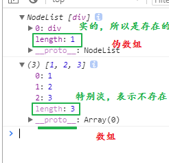
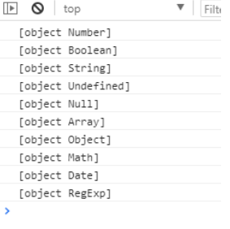
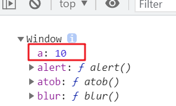
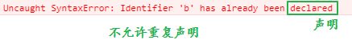
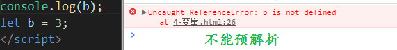
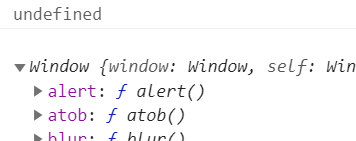
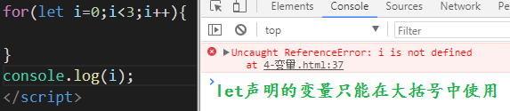
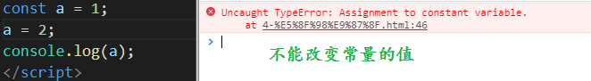
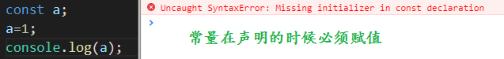
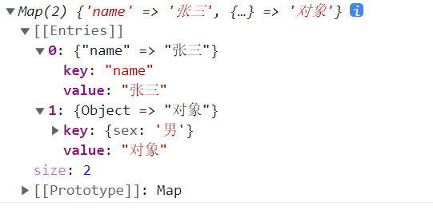

# this关键字和ES6

## 一、this关键字

### 1、this关键字的含义

#### 1.1、全局的this

```js
console.log(this)
```


#### 1.2、普通函数的this

```js
function fn() {
    console.log(this)
}

fn()
```

所谓普通函数，指的是直接拿函数名称调用的函数。

#### 1.3、自调用函数中的this

```js
(function() {
    console.log(this)
})()
```

#### 1.4、定时器中的this

```js
setTimeout(function() {
    console.log(this)
}, 1000)
```


#### 1.5、事件函数中的this

```js
<button id="btn">按钮</button>
btn.onclick = function() {
    console.log(this)
}
```

#### 1.6、对象方法中的this

```js
var obj = {
    name: '张三',
    age: 12,
    eat: function() {
        console.log(this)
    }
}

obj.eat()
```


### 2、this含义的理解

普通函数，大多都属于window的方法，所以普通函数调用就是调用window的方法；事件的绑定，其实就是在给标签对象添加方法，最终调用，其实也是在调用标签对象的方法；定时器属于window的方法，所以定时器的调用其实就是在调用window的方法

其实一个函数定义好以后，还不能确定其中的this代表什么，主要是看这个函数最终是如何调用的，例：

```js
function fn() {
    console.log(this)
}

// 将fn当做事件处理函数
btn.onclick = fn
// 此时fn中的this就代表事件源btn

// 将fn当做定时器的处理函数
setTimeout(fn, 1000)
// 此时fn中的this就代表window

// 将fn当做对象的方法
var obj = {
    name: '张三',
    age: 12,
    eat: fn
}
obj.eat()
// 此时fn中的this就代表对象obj
```

根据最终的调用方式，决定最终将函数当做了什么来调用的，才能决定this关键字的含义。

### 3、this含义的改变

js提供了3个函数来强行修改this关键字的含义：

#### 3.1、call方法

call方法有两个作用：调用函数以及改变函数中的this

##### 3.1.1、调用函数

语法：

```js
函数.call()
```

例：

```js
function fn() {
    console.log(111)
}

fn() // 111
fn.call() // 111
```

和正常的函数调用一模一样。

##### 3.1.2、改变this

call方法在调用函数的同时传递参数就可以改变this的含义：

```js
函数.call(新的this含义)
```

例：

```js
function fn() {
    console.log(this)
}

fn() // window
fn.call(document) // document
```

##### 3.1.3、参数处理

如果被调用的函数需要实参时，call方法从第二个参数开始给函数传递实参：

```js
函数.call(新的this含义, 实参1, 实参2, ...)
```

例：

```js
function fn(a, b) {
    var c = a + b
    console.log(c)
    console.log(this)
}

fn(1, 2) // 3 window
fn.call(document, 2, 3) // document 5
fn.call(null, 5, 6) // window 11
```

给call传递第一个参数为null，就表示将函数中的this改为了window

##### 3.1.4、伪数组

伪数组是一个对象。

这个对象中必须有length属性，如果length不为0，那么这个对象中必须有下标和对应的数据。

```js
var farr = {
    0:123;
    length:1;
}
```

这就是伪数组。

常见的伪数组有：

```js
arguments
DOM对象列表----HTMLCollection
```

伪数组转为数组的方法：将伪数组进行遍历放入数组中：

| 伪数组和数组的对比                        |
| ----------------------------------------- |
|  |

##### 3.1.5、使用场景

1. 让伪数组可以调用某些数组方法

   语法：

   ```js
   数组方法.call(伪数组)
   ```

   例：

   ```js
   var divs = document.querySelectorAll('div')
   var arr = []
   var newDivs = arr.slice.call(divs, 0)
   console.log(newDivs);
   ```

   通常用于将伪数组转成数组，方便调用数组方法处理元素。

   不是所有方法都可以这样做的，因为有些方法中是没有this关键字的。

2. 检测数据为对象时的精准类型

   语法：

   ```js
   对象.toString.call(数据)
   ```

   例：

   ```js
   var obj = {}
   console.log(obj.toString.call(123));
   console.log(obj.toString.call('abc'));
   console.log(obj.toString.call(true));
   console.log(obj.toString.call(undefined));
   console.log(obj.toString.call(null));
   console.log(obj.toString.call([]));
   console.log(obj.toString.call({}));
   console.log(obj.toString.call(function(){}));
   console.log(obj.toString.call(/^abc$/));
   console.log(obj.toString.call(new Date()));
   ```

   图示：

     

#### 3.2、apply方法

apply和call的作用是相同的，唯一不同的地方，在于传递实参。

call在调用函数时，给函数传递实参，是从call的第二个参数开始传递；apply给函数传递实参，是将所有实参组成一个数组作为apply的第二个参数传递的：

```js
函数.call(新的this含义, [实参1, 实参2, ...])
```

例：

```js
function fn(a, b) {
    var c = a + b
    console.log(c)
    console.log(this)
}

fn(1, 2) // 3 window
fn.apply(document, [2, 3]) // document 5
```

使用场景跟call也是一样的。

#### 3.3、bind方法

bind方法有两个作用：复制函数，并改变新函数中的this。

##### 3.3.1、复制函数

语法：

```js
函数.bind() // 返回新函数
```

例：

```js
function fn() {
    console.log(this)
}

var newFn = fn.bind()
console.log(newFn)
console.log(fn)
console.log(newFn === fn) // false
```

复制出来的新函数和原本的函数一模一样，但不是同一个。

##### 3.3.2、改变新函数的this

语法：

```js
函数.bind(新的this含义) // 返回的新函数中，this的含义会变成新的含义
```

例：

```js
function fn() {
    console.log(this)
}

var newFn = fn.bind(document)
fn() // window
newFn() // document
```

bind不加参数，新函数的this为window：

```js
var obj = {
    name: '张三',
    eat: function() {
        console.log(this);
    }
}
var fn = obj.eat.bind()
fn() // window
```

##### 3.3.3、bind使用场景

某些函数在使用的时候，希望其中的this为其他对象，可以将原函数通过bind复制使用，并改变其中的this：

```js
document.onclick = function() {
    setTimeout(function() {
        console.log(this)
    }, 1000)
}
// 此时this为window - 因为这是定时器中的this
// 将定时器中的this改为document
document.onclick = function() {
    setTimeout((function() {
        console.log(this)
    }).bind(this), 1000)
}
```


## 二、ES6

es6是ECMAScript的第6个版本，在2015年发布。也有的人将ECMAScript5之后版本，统称为es6。比起之前的语法，es6有很多新语法，让开发者在操作数据和函数的时候，功能既多，操作又简便。

### 1、变量

es6中新增了两个类似于var的关键字来定义变量，分别是let和const。

var定义的变量，其实属于`window`的属性，平常直接输出变量名，是一种简写，完整的写法应该是`window.变量名`

```js
var a = 10;
console.log(window)
```

 

let关键字

测试代码1：

```js
let b = 10;
let b = 20;
console.log(b)
```

 

结论：let不允许重复定义变量

测试代码2：

```js
console.log(b)
let b = 3;
```

 

结论：let定义的变量没有预解析

测试代码3：

```js
let a = 10;
console.log(window.a)
console.log(window)
```

 

测试代码4：

```js
for(let i=0;i<3;i++){
    
}
console.log(i)
```

 

结论：let定义的变量会自己创建一个块级作用域，将自己的作用域限制在大括号中。

总结：

let是声明变量的关键字，特点：

1. 不允许重复声明
2. 不存在预解析
3. 在大括号中声明的变量只能在大括号中使用，如if、for的大括号中声明的变量

const关键字也是用来定义变量的，具备let的所有特性，另外，const定义的变量的值不能修改。

| 不能改变值                                |
| ----------------------------------------- |
|  |

声明的时候必须赋值

| 声明的时候必须赋值                        |
| ----------------------------------------- |
|  |

### 2、箭头函数

es6中的箭头函数是用来简写函数的

```js
let fn = function(){
    console.log(111);
}
```

使用箭头函数简写

```js
let fn = ()=>{console.log(111);}
```

带参数的写法：

```js
let fn = function(a,b){
    console.log(a+b);
}
```

使用箭头函数改写

```js
let fn = (a,b)=>{console.log(a+b);}
```

<font color="red">注意：如果只有一个形参的时候，小括号可以省略：</font>

```js
let fn = function(a){
    console.log(a);
}
```

使用箭头改写

```js
let fn = a = > {console.log(a);}
```

<font color="red">注意：如果代码块中只有一行代码，箭头函数可以省略大括号，并将这行代码作为返回值</font>

```js
let fn = function(a){
    return a + 1;
}
```

箭头函数的写法

```js
let fn = a = > a+1;
```

例：使用箭头函数定义一个返回m到n范围内的随机数的函数：

```js
let fn = (m,n) => parseInt(Math.random()*(n-m+1))+m;
```

箭头函数使用注意事项：

1. 箭头函数中的this比较混轮，所以在函数和方法中使用到this的时候，就不要用箭头函数
2. 箭头函数中没有arguments

### 3、函数默认值

以前的函数不能有默认值，es6的函数中可以定义默认值：

```js
function add(a,b=2){
    return a + b;
}
console.log(add(5));
```

可以用箭头函数改写：

```js
let add = (a,b=2) => a+b;
console.log(add(5));
```

### 4、模板字符串

es6新增了定义字符串的方式，使用反引号

1. 可以换行书写，保持字符串中的换行和空格
2. 模板字符串中可以识别变量，使用美元符大括号：`${变量}`

### 5、解构赋值

解析一个数据结构并赋值，可以快速的从对象或数组中取出需要的内容，对象使用大括号，数组使用中括号

#### 5.1、解构对象

之前从对象中取到内容的方式

```js
let obj = {
    name:"张三",
    age:12,
    sex:"男",
}
let name = obj.name;
let age = obj.age;
```

解构的方式：

```js
let obj = {
    name:"张三",
    age:12,
    sex:"男",
}
let {name} = obj;
/*
表示从obj中获取name属性，并赋值给声明的name变量
*/
```

使用说明：

1. obj必须是一个对象
2. obj中必须有name属性

还可以一次性解构多个变量：

```js
let obj = {
    name:"张三",
    age:12,
    sex:"男",
}
let {name,age} = obj; // 声明并赋值了两个变量
```

可以将变量名换成一个别的名字：

```js
let obj = {
    name:"张三",
    age:12,
    sex:"男",
}
let {name:username,age:a} = obj; // 将obj的name属性值赋值给username变量，age属性值赋值给变量a
```

多级解构：

```js
let obj = {
    name:"张三",
    age:12,
    sex:"男",
    wife:{
        name:"翠花",
        age:11,
    }
}
let {wife} = obj;
let {name} = wife;
// 写为一行
let {wife:{name:wname}} = obj;
```

#### 5.2、解构数组

```js
let arr = [1,2,3];
let [num1] = arr; // 从数组中拿出第一个元素赋值给num1变量
```

使用说明：

> 解构数组的时候是按顺序取出数组中的值，解构一个变量，只能拿到第一个元素

解构多个元素：

``` js
let arr = [1,2,3];
let [num1,num2] = arr; // num1 = arr[0]   num2 = arr[1]
```

多维数组解构：

```js
let arr = [1,2,3,[4,5,6]];
let [a,b,c,[aa,bb]] = arr;
console.log(aa,bb); // 4 5
```

利用结构交换两个变量的值：

```js
let num1 = 1;
let num2 = 2;
[num2,num1] = [num1,num2]
```


### 6、展开运算符

将一个数组展开为多个变量赋值给多个形参

```js
let arr = [1,2,3];
function fn(a,b,c){
    console.log(a,b,c); // 1 2 3
}
fn(...arr);
```

利用展开运算求数组的最大值

```js
let arr = [5,3,6,9,8,1,7];
let max = Math.max(...arr); 
console.log(max); // 9
```

利用展开运算合并数组

```js
// 之前的写法
let arr = [1,2,3];
let arr1 = [4,5,6].concat(arr);
// 利用展开运算合并
let arr2 = [4,5,6].concat(...arr);
// 再简化
let arr3 = [4,5,6,...arr]
```

利用展开运算合并对象：

```js
const obj = {
    name:"Jack",
    age:20,
    sex:"男",
}
const obj1 = {
    ...obj,
    wife:{
        name:"Rose",
        age:18
    }
}
console.log(obj1);
```

### 7、合并运算符

将多个实参合并为一个数组

```js
function fn(...arr){
    console.log(arr);
}
fn(1,2,3); // [1,2,3]
```

箭头函数中没有arguments，可以使用合并运算符来模拟arguments

```js
var fn = (...arr) => {console.log(arr)};
fn(1,2,3); // [1,2,3]
```

### 8、对象的简写方式

```js
let name = '张三';
let age = 12;
let obj = {
    name,
    age
}
console.log(obj);
```

如果对象的属性名和变量名同名，则可以光写属性名

### 9、Map

map是es6提供的一种对象类型，用于存储键值对。跟object不同的地方在于：

- object键值对：字符串->值
- map键值对：值->值

定义map数据：

```js
var m = new Map()
```

例：

```js
var obj = {
    sex: '男'
}
var m = new Map([['name', '张三'], [obj, '对象']])
console.log(m);
```

输出结果：

 

map的结构使用`[]`，其中的数据也必须是`[]`，在里面的`[]`中第一个为键，第二个为值，如果只有键没有值，默认的值为undefined。

Map的操作方法：

设置键值对：`map.set(键, 值)`，如果map中已经有了当前指定的键，后面的值会覆盖前面的值。

添加键值对：

```js
var obj = {
    sex: '男'
}
var m = new Map([['name', '张三'], [obj, '对象']])
m.set('age', 12)
console.log(m);
```

根据键修改值：

```js
var obj = {
    sex: '男'
}
var m = new Map([['name', '张三'], [obj, '对象']])
m.set(obj, '哈哈')
console.log(m);
```

根据键获取值：`map.get(键)`。返回获取到的值。如果获取一个map中不存在的键，返回undefined。

```js
var obj = {
    sex: '男'
}
var m = new Map([['name', '张三'], [obj, '对象']])
console.log( m.get(obj) );
console.log( m.get('age') );
```

删除键值对：`map.delete(键)`。返回布尔值，代表是否删除成功。删除map中不存在的键，返回false。

```js
var obj = {
    sex: '男'
}
var m = new Map([['name', '张三'], [obj, '对象']])
var bool1 = m.delete('age')
console.log(bool1); // false
var bool2 = m.delete('name')
console.log(bool2); // true
console.log( m );
```

判断map中是否包含某个键值对：`map.has(键)`。返回布尔值

```js
var obj = {
    sex: '男'
}
var m = new Map([['name', '张三'], [obj, '对象']])
var bool1 = m.has('name')
console.log(bool1); // true
var bool2 = m.has('age')
console.log(bool2); // false
```

获取map中键值对的数量：`map.size()`，返回数字，例：

```js
var m = new Map([['name', '张三'], ['sex', '男']])
console.log( m.size ); // 2
```

清空map中的数据：`map.clear()`。没有返回值，例：

```js
var m = new Map([['name', '张三'], ['sex', '男']])
m.clear()
console.log(m);
```

获取所有键的集合：`map.keys()`，返回一个集合，例：

```js
var m = new Map([['name', '张三'], ['sex', '男']])
console.log( m.keys() );
```

获取所有值的集合：`map.values()`，返回一个集合，例：

```js
var m = new Map([['name', '张三'], ['sex', '男']])
console.log(m.values());
```

遍历map：`map.forEach((item, key) => {})`，例：

```js
var m = new Map([['name', '张三'], ['sex', '男']])
m.forEach((item, key) => {
    console.log(key, item);
})
```

### 10、Set

set是es6新增的一种对象类型，用于存储多个键。也就是说，set数据中不会有重复的数据。

定义语法：`new Set([多个数据])`。定义语法使用`[]`，如果`[]`中重复的数据，会被set去重。

例：

```js
var s = new Set([1,2,3,3])
console.log(s);
```

数组去重：

```js
var s = new Set([1,1,2,2,2,3,4,2,1])
console.log(s);
```

操作方法：

给set集合中添加值：`set.add(值)`。返回添加后的新set。如果添加的数据在set中存在，则添加不进去。例：

```js
var s = new Set([1,2])
var s1 = s.add(3)
console.log(s1, s);
```

已经存在的元素是添加不进去的：

```js
var s = new Set([1,2])
s.add(2)
console.log(s);
```

从set中删除元素：`set.delete(元素)`。返回布尔值，表示是否删除成功。例：

```js
var s = new Set([1,2])
var s1 = s.delete(2)
console.log(s1);
console.log(s);
```

查看set中数据的长度：`set.size`，返回数字。例：

```js
var s = new Set([1,2])
console.log(s.size); // 2
```

判断set中是否有某个数据：`set.has(数据)`。返回布尔值，例：

```js
var s = new Set([1,2])
var bool = s.has(2)
console.log(bool); // true
var bool1 = s.has(2)
console.log(boo1); // false
```

清空set中的数据：`set.clear()`。没有返回值，例：

```js
var s = new Set([1,2])
s.clear()
console.log(s);
```

遍历set：`set.forEach(item => {})`。例：

```js
var s = new Set([1,2])
s.forEach(item => {
    console.log(item); // 1 2
})
```

### 11、for...of

for in用来遍历键。可以遍历的数据如下：

- 可以遍历object类型，只要类型是object就能遍历，但能遍历的只有可遍历/可枚举的属性，（也就是enumerable属性为true的属性）；
- 可以遍历数组，但遍历出来的下标是字符串，遍历数组的时候会将数组的下标作为键
- 可以遍历字符串，遍历出来的下标也是字符串
- 如果对象的原型中有可遍历的属性，会将原型中的可遍历属性也遍历出来。如果原型中的可遍历属性和对象本身的可遍历属性重名，就只遍历对象本身的属性了。

for of用来遍历值。可以遍历的数据如下：

- 可以遍历数组，遍历出来的是数组中的每个元素
- 可以遍历字符串，遍历出来的是字符串中的每个字符
- 可以遍历set集合。
- 可以遍历Map集合
- 不可以遍历对象