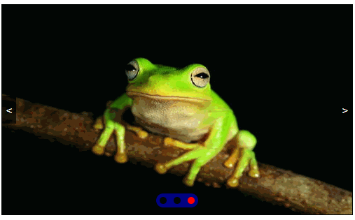

# DOM高级

我们在实际开发中，页面中有很多需要用到动画的效果，如果每一个效果都需要我们手动创建定时器来写的话，的，代码会冗余，逻辑也会变得很复杂，所以我们需要手动封装一个专门用于执行动画的函数。

以一个div点击后执行动画为例来封装。

## 一、简单的运动

html布局

```html
<style>
.box{
    width: 100px;
    height: 100px;
    background-color: pink;
    position:absolute;
    left: 0;
    top: 0;
}
</style>
<div class="box"></div>
```

js代码

```js
var box = document.querySelector(".box");
// 点击div让div向右移动200px
box.onclick=function(){
    // 获取当前样式
    var currentStyle = window.getComputedStyle(box)["left"];
    // 获取到的是字符串，转为数字
    currentStyle = parseInt(currentStyle);
    // 设置定时器，让当前样式每隔20毫秒增加5px
    var timer = setInterval(function(){
        currentStyle += 5;
        // 判断增加后的样式是否到达指定距离
        if(currentStyle >= 200){
            // 指定增加后的样式的最大值
            currentStyle = 200;
            // 清除定时器
            clearInterval(timer);
        }
        // 将增加后的样式重新设置到元素上
        box.style.left = currentStyle + 'px';
    },20);
}
```

## 二、简单封装

```js
var box = document.querySelector(".box");
// 点击div让div向右移动到200px
box.onclick=function(){
    animate(box,"left",200)
}

/*
 * @ele：要进行运动的元素
 * @attr：要进行运动css属性
 * @target：运动的目标位置 
*/
function animate(ele,attr,target){
    // 获取当前样式
    var currentStyle = window.getComputedStyle(ele)[attr];
    // 获取到的是字符串，转为数字
    currentStyle = parseInt(currentStyle);
    // 设置定时器，让当前样式每隔20毫秒增加5px
    var timer = setInterval(function(){
        currentStyle += 5;
        // 判断增加后的样式是否到达指定距离
        if(currentStyle >= target){
            // 清除定时器
            clearInterval(timer);
        }
        // 将增加后的样式重新设置到元素上
        ele.style.left = currentStyle + 'px';
    },20);
}
```

## 三、多属性动画

```js
var box = document.querySelector(".box");
// 点击div让div向右移动到200px
box.onclick=function(){
    animate(box,{"left":200,"top":300})
}

/*
 * @ele：要进行运动的元素
 * @attr：要进行运动css属性
 * @target：运动的目标位置 
*/
function animate(ele,obj){
    for(let attr in obj){ // 为了不让后面的定时器覆盖前面的，将var改为let
        let target = obj[attr]; // 为了多个属性不产生错误，将var改为let
        // 获取当前样式
        var currentStyle = window.getComputedStyle(ele)[attr];
        // 获取到的是字符串，转为数字
        currentStyle = parseInt(currentStyle);
        // 设置定时器，让当前样式每隔20毫秒增加5px
        let timer = setInterval(function(){ // 为了能将所有定时器都结束掉，将var改为let
            console.log(123);
            currentStyle += 5;
            // 判断增加后的样式是否到达指定距离
            if(currentStyle >= target){
                // 清除定时器
                clearInterval(timer);
            }
            // 将增加后的样式重新设置到元素上
            ele.style[attr] = currentStyle + 'px';
        },20);
    }
}
```

## 四、动画不均匀的处理

速度的不成比例所以造成运动不均与，所以速度应该用比例

```js
var box = document.querySelector(".box");
// 点击div让div向右移动到200px
box.onclick=function(){
    animate(box,{"left":200,"top":300})
}

/*
 * @ele：要进行运动的元素
 * @attr：要进行运动css属性
 * @target：运动的目标位置 
*/
function animate(ele,obj){
    for(let attr in obj){ // 为了不让后面的定时器覆盖前面的，将var改为let
        let target = obj[attr]; // 为了多个属性不产生错误，将var改为let
        // 获取当前样式
        let currentStyle = window.getComputedStyle(ele)[attr]; // 为了能让多属性均匀，将var改为let
        // 获取到的是字符串，转为数字
        currentStyle = parseInt(currentStyle);
        // 设置定时器，让当前样式每隔20毫秒增加5px
        let timer = setInterval(function(){ // 为了能将所有定时器都结束掉，将var改为let
            // 计算比例 - 每次运动剩余距离的 1/10
            var percent = (target - currentStyle)/10;
            // 为了能让定时器停止，需要处理比例
            if(percent>0){
                // 比例为正数的时候应该向上取整 - 例如：还有1px到目标位置，target-currentStyle=400-399=1，比例为0.1,移动了0.1，这样距离目标越来越近，但每次移动剩余距离的1/10是永远到不了目标位置的，所以要向上取整，移动了1px，就到了目标位置
                percent = Math.ceil(percent); // 向右运动
            }else{
                // 比例为负数的时候应该向下取整 - 例如：还有1px到目标位置，target-currentStyle = 0-1=-1,比例为-0.1，如果向上取整为0，相当于没有移动；向下取整移动了-1，然后才能到目标位置
                percent = Math.floor(percent); // 向左运动
            }
            // 当前样式不能都加5，否则不均与，所以加上比例
            currentStyle += percent;
            // 判断增加后的样式是否到达指定距离
            if(currentStyle == target){ // 为了能向左运动，将>=改为==
                // 清除定时器
                clearInterval(timer);
            }
            // 将增加后的样式重新设置到元素上
            ele.style[attr] = currentStyle + 'px';
        },20);
    }
}
```

## 五、透明度的处理

```js
var box = document.querySelector(".box");
// 点击div让div向右移动到200px
box.onclick=function(){
    animate(box,{"left":0,"top":300,"opacity":50}) // 为了方便计算，传入透明度*100
}

/*
 * @ele：要进行运动的元素
 * @attr：要进行运动css属性
 * @target：运动的目标位置 
*/
function animate(ele,obj){
    for(let attr in obj){ // 为了不让后面的定时器覆盖前面的，将var改为let
        let target = obj[attr]; // 为了多个属性不产生错误，将var改为let
        // 获取当前样式
        let currentStyle = window.getComputedStyle(ele)[attr]; // 为了能让多属性均匀，将var改为let
        // 当attr是透明度的时候，当前样式应该转为浮点数，并*100，因为传进来的目标是*100的
        if(attr == 'opacity'){
            currentStyle = parseFloat(currentStyle)*100;
        }else{
            // 获取到的是字符串，转为数字
            currentStyle = parseInt(currentStyle);
        }
        // 设置定时器，让当前样式每隔20毫秒增加5px
        let timer = setInterval(function(){ // 为了能将所有定时器都结束掉，将var改为let
            // 计算比例
            let percent = (target - currentStyle)/10;
            // 为了能让定时器停止，需要处理比例
            if(percent>0){
                percent = Math.ceil(percent); // 向右运动
            }else{
                percent = Math.floor(percent); // 向左运动
            }
            // 当前样式不能都加5，否则不均与，所以加上比例
            currentStyle += percent;
            // 判断增加后的样式是否到达指定距离
            if(currentStyle == target){ // 
                // 清除定时器
                clearInterval(timer);
            }
            // 样式属性是透明度的时候，最后的值应该/100，并且不需要 px单位
            if(attr == 'opacity'){
                ele.style[attr] = currentStyle/100;
            }else{
                // 将增加后的样式重新设置到元素上
                ele.style[attr] = currentStyle + 'px';
            }
        },20);
    }
}
```

效果没问题之后，再将透明度扩大的100倍缩小回来：

```js
var box = document.querySelector(".box");
// 点击div让div向右移动到200px
box.onclick=function(){
    sport(box,{"left":0,"top":300,"opacity":0.5}) // 为了方便计算，传入透明度*100
}
// 将透明度的扩大100倍缩小回来
/*
 * @ele：要进行运动的元素
 * @attr：要进行运动css属性
 * @target：运动的目标位置 
*/
function sport(ele,obj){
    for(let attr in obj){ // 为了不让后面的定时器覆盖前面的，将var改为let
        let target = obj[attr]; // 为了多个属性不产生错误，将var改为let
        // 获取当前样式
        let currentStyle = window.getComputedStyle(ele)[attr]; // 为了能让多属性均匀，将var改为let
        // 当attr是透明度的时候，当前样式应该转为浮点数，并*100，因为传进来的目标是*100的
        if(attr == 'opacity'){
            currentStyle = parseFloat(currentStyle)*100;
            // 传进来的目标缩小了100倍，所以这里再扩大100倍
            target = target * 100;
        }else{
            // 获取到的是字符串，转为数字
            currentStyle = parseInt(currentStyle);
        }
        // 设置定时器，让当前样式每隔20毫秒增加5px
        let timer = setInterval(function(){ // 为了能将所有定时器都结束掉，将var改为let
            // 计算比例
            let percent = (target - currentStyle)/10;
            // 为了能让定时器停止，需要处理比例
            if(percent>0){
                percent = Math.ceil(percent); // 向右运动
            }else{
                percent = Math.floor(percent); // 向左运动
            }
            // 当前样式不能都加5，否则不均与，所以加上比例
            currentStyle += percent;
            // 判断增加后的样式是否到达指定距离
            if(currentStyle == target){ // 
                // 清除定时器
                clearInterval(timer);
            }
            // 样式属性是透明度的时候，最后的值应该/100，并且不需要 px单位
            if(attr == 'opacity'){
                ele.style[attr] = currentStyle/100;
            }else{
                // 将增加后的样式重新设置到元素上
                ele.style[attr] = currentStyle + 'px';
            }
        },20);
    }
}
```


## 六、动画结束的处理

```js
// 点击div让div向右移动到200px
box.onclick=function(){
    sport(box,{"left":0,"top":300,"opacity":0.5},function(){
        box.style.background = 'red';
    }) // 为了方便计算，传入透明度*100
}
/*
 * @ele：要进行运动的元素
 * @attr：要进行运动css属性
 * @target：运动的目标位置 
 * @cb：运动结束后，要执行的函数
*/
function sport(ele,obj,cb){
    let timerObj = {}; // 将所有定时器都放到这个对象中
    for(let attr in obj){ // 为了不让后面的定时器覆盖前面的，将var改为let
        let target = obj[attr]; // 为了多个属性不产生错误，将var改为let
        // 获取当前样式
        let currentStyle = window.getComputedStyle(ele)[attr]; // 为了能让多属性均匀，将var改为let
        // 当attr是透明度的时候，当前样式应该转为浮点数，并*100，因为传进来的目标是*100的
        if(attr == 'opacity'){
            currentStyle = parseFloat(currentStyle)*100;
            // 传进来的目标缩小了100倍，所以这里再扩大100倍
            target = target * 100;
        }else{
            // 获取到的是字符串，转为数字
            currentStyle = parseInt(currentStyle);
        }
        // 设置定时器，让当前样式每隔20毫秒增加5px
        // 通过每个css属性来识别这个定时器
        timerObj[attr] = setInterval(function(){ // 为了能将所有定时器都结束掉，将var改为let
            // 计算比例
            let percent = (target - currentStyle)/10;
            // 为了能让定时器停止，需要处理比例
            if(percent>0){
                percent = Math.ceil(percent); // 向右运动
            }else{
                percent = Math.floor(percent); // 向左运动
            }
            // 当前样式不能都加5，否则不均与，所以加上比例
            currentStyle += percent;
            // 判断增加后的样式是否到达指定距离
            if(currentStyle == target){ // 
                // 清除定时器
                clearInterval(timerObj[attr]);
                // 每次结束一个定时器将这个定时器从定时器对象中删掉
                delete timerObj[attr];
                // 每次删掉定时器后，遍历定时器对象，计算定时器对象中定时器的个数.
                let k=0;
                for(let i in timerObj){
                    k++;
                }
                // 如果个数是0，表示所有定时器都删掉了，也就意味着所有属性的运动都结束了
                if(k==0){
                    console.log("运动结束了");
                    // 当运动结束后想要做的事情，可以调用一个函数
                    cb(); // 这个函数需要当做参数传进来
                }
            }
            // 样式属性是透明度的时候，最后的值应该/100，并且不需要 px单位
            if(attr == 'opacity'){
                ele.style[attr] = currentStyle/100;
            }else{
                // 将增加后的样式重新设置到元素上
                ele.style[attr] = currentStyle + 'px';
            }
        },20);
    }
}
```

## 七、滑动轮播图

html布局

```html
<div class="banner">
    <ul class="imgBox clearfix">
        <li>1</li>
        <li>2</li>
        <li>3</li>
        <li>4</li>
        <li>5</li>
    </ul>
    <ol class="point">
    </ol>
    <div class="leftRightTab">
        <a href="javascript:;" class="left"><</a>
        <a href="javascript:;" class="right">></a>
    </div>
</div>
```

css样式

```css
*{
    padding: 0;
    margin: 0;
}
ul,ol{
    list-style-type: none;
}
a{
    text-decoration:none;
}
.clearfix:after{
    content:"";
    display:block;
    clear:both;
}
.banner{
    width: 600px;
    height: 400px;
    border:2px solid #000;
    margin:auto;
    position:relative;
    overflow:hidden;
}
.banner ul{
    height: 100%;
    background-color: pink;
    position:absolute;
    left:0;
    top: 0;
}
.banner ul li{
    width: 600px;
    height: 100%;
    float:left;
    display:flex;
    justify-content: center;
    align-items:center;
    color:#fff;
    font-size:100px;
}
.banner ol{
    height: 20px;
    background-color: #999;
    opacity:0.5;
    border-radius:10px;
    position:absolute;
    bottom:40px;
    left:50%;
    transform:translateX(-50%);
    display: flex;
    justify-content: space-evenly;
    align-items: center;
}
.banner ol li{
    width: 10px;
    height: 10px;
    border-radius: 50%;
    background-color: #fff;
}
.banner ol li.active{
    background-color: #06a;
}
.banner div{
    width: 100%;
    height: 40px;
    position: absolute;
    left: 0;
    top: 50%;
    transform: translateY(-50%);
    display: flex;
    justify-content: space-between;
    align-items: center;
}
.banner div a{
    width: 20px;
    height: 40px;
    background-color: rgba(0,0,0,.4);
    color: #fff;
    display: flex;
    justify-content: center;
    align-items: center;
}
```

js代码

```js
// 1.获取元素
var banner = document.querySelector(".banner");
var imgBox = banner.querySelector("ul");
var pointBox = banner.querySelector("ol");
var btnBox = banner.querySelector(".leftRightTab");
var imgBoxLength = imgBox.children.length;
var imgWidth = imgBox.children[0].offsetWidth; // 记录每张图片的宽度
var onOff = true; // 设置开关，解决点击太快
// 2.设置焦点 -- 给ol设置宽度，添加里面的li
setPoint();
function setPoint(){
    // 焦点的个数是ul中li的元素个数
    var pointNum = imgBox.children.length;
    pointBox.style.width = pointNum*20+'px';
    for(var i=0;i<pointNum;i++){
        var li = document.createElement("li");
        // 给每隔li添加索引属性
        li.setAttribute("index",i+1);
        // 第一个li的类名是active
        if(i==0){
            li.className='active';
        }
        pointBox.appendChild(li);
    }
}
// 3.设置ul -- 头尾各加一个元素，设置宽度，设置left值
var index = 1; // 记录图片li的索引
handleUl();
function handleUl(){
    // 复制元素并添加到ul中
    var firstImgLi = imgBox.children[0].cloneNode(true);
    var lastImgLi = imgBox.children[imgBoxLength-1].cloneNode(true);
    imgBox.insertBefore(lastImgLi,imgBox.children[0]);
    imgBox.appendChild(firstImgLi);
    // 设置宽度和left值
    imgBox.style.width = imgWidth * imgBox.children.length + 'px';
    imgBox.style.left = -imgWidth*index + 'px';
}
// 4.设置轮播效果 -- 每隔1s让索引递增
autoLoop();
var timerId; // 记录定时器
function autoLoop(){
    timerId = setInterval(function(){
        index++;
        handleMove();
    },1000);
}
// 运动函数
function handleMove(){
    animate(imgBox,{left:-index*imgWidth},function(){
        // 运动结束后，改变ul的left值，以便可以继续轮播
        if(index == imgBox.children.length-1){
            index=1;
            imgBox.style.left = -index*imgWidth + 'px';
        }
        if(index==0){
            index = imgBoxLength;
            imgBox.style.left = -index*imgWidth + 'px';
        }
        // 设置焦点
        for(var i=0;i<pointBox.children.length;i++){
            pointBox.children[i].className = '';
        }
        pointBox.children[index-1].className = 'active';
        onOff = true;
    });
}
// 5. 设置鼠标移入移出
banner.onmouseover=function(){
    clearInterval(timerId);
}
banner.onmouseout=function(){
    autoLoop();
}
// 6.设置左右按钮点击
btnBox.onclick=function(e){
    if(!onOff){
        return
    }
    onOff = false;
    var e = e || window.event;
    var target = e.target || e.srcElement;
    if(target.className=='left'){
        index--;
    }
    if(target.className=='right'){
        index++;
    }
    handleMove();
}
// 7.焦点点击切换
pointBox.onclick=function(e){
    if(!onOff){
        return false;
    }
    var e = e || window.event;
    var target = e.target || e.srcElement;
    if(target.nodeName == 'LI'){
        onOff = false;
        index=target.getAttribute("index");
        handleMove();
    }
}

function animate(ele,obj,cb){
    let timerObj = {}; // 将所有定时器都放到这个对象中
    for(let attr in obj){ // 为了不让后面的定时器覆盖前面的，将var改为let
        let target = obj[attr]; // 为了多个属性不产生错误，将var改为let
        // 获取当前样式
        let currentStyle = window.getComputedStyle(ele)[attr]; // 为了能让多属性均匀，将var改为let
        // 当attr是透明度的时候，当前样式应该转为浮点数，并*100，因为传进来的目标是*100的
        if(attr == 'opacity'){
            currentStyle = parseFloat(currentStyle)*100;
            // 传进来的目标缩小了100倍，所以这里再扩大100倍
            target = target * 100;
        }else{
            // 获取到的是字符串，转为数字
            currentStyle = parseInt(currentStyle);
        }
        // 设置定时器，让当前样式每隔20毫秒增加5px
        // 通过每个css属性来识别这个定时器
        timerObj[attr] = setInterval(function(){ // 为了能将所有定时器都结束掉，将var改为let
            // 计算比例
            let percent = (target - currentStyle)/10;
            // 为了能让定时器停止，需要处理比例
            if(percent>0){
                percent = Math.ceil(percent); // 向右运动
            }else{
                percent = Math.floor(percent); // 向左运动
            }
            // 当前样式不能都加5，否则不均与，所以加上比例
            currentStyle += percent;
            // 判断增加后的样式是否到达指定距离
            if(currentStyle == target){ // 
                // 清除定时器
                clearInterval(timerObj[attr]);
                // 每次结束一个定时器将这个定时器从定时器对象中删掉
                delete timerObj[attr];
                // 每次删掉定时器后，遍历定时器对象，计算定时器对象中定时器的个数.
                let k=0;
                for(let i in timerObj){
                    k++;
                }
                // 如果个数是0，表示所有定时器都删掉了，也就意味着所有属性的运动都结束了
                if(k==0){
                    console.log("运动结束了");
                    // 当运动结束后想要做的事情，可以调用一个函数
                    cb(); // 这个函数需要当做参数传进来
                }
            }
            // 样式属性是透明度的时候，最后的值应该/100，并且不需要 px单位
            if(attr == 'opacity'){
                ele.style[attr] = currentStyle/100;
            }else{
                // 将增加后的样式重新设置到元素上
                ele.style[attr] = currentStyle + 'px';
            }
        },20);
    }
}
```

测试发现无法实现秒切，修改动画函数：

```js
function move(ele,obj,cb){
    let timerObj = {}; // 将所有定时器都放到这个对象中
    for(let attr in obj){ // 为了不让后面的定时器覆盖前面的，将var改为let
        let target = obj[attr]; // 为了多个属性不产生错误，将var改为let
        // 获取当前样式
        let currentStyle = window.getComputedStyle(ele)[attr]; // 为了能让多属性均匀，将var改为let
        // 当attr是透明度的时候，当前样式应该转为浮点数，并*100，因为传进来的目标是*100的
        if(attr == 'opacity'){
            currentStyle = parseFloat(currentStyle)*100;
            // 传进来的目标缩小了100倍，所以这里再扩大100倍
            target = target * 100;
        }else{
            // 获取到的是字符串，转为数字
            currentStyle = parseInt(currentStyle);
        }
        // 设置定时器，让当前样式每隔20毫秒增加5px
        // 通过每个css属性来识别这个定时器
        timerObj[attr] = setInterval(function(){ // 为了能将所有定时器都结束掉，将var改为let
            // 计算比例
            let percent = (target - currentStyle)/10;
            // 为了能让定时器停止，需要处理比例
            if(percent>0){
                percent = Math.ceil(percent); // 向右运动
            }else{
                percent = Math.floor(percent); // 向左运动
            }
            // 当前样式不能都加5，否则不均与，所以加上比例
            currentStyle += percent;
            // 判断增加后的样式是否到达指定距离
            if(currentStyle == target){ // 
                // 清除定时器
                clearInterval(timerObj[attr]);
                // 每次结束一个定时器将这个定时器从定时器对象中删掉
                delete timerObj[attr];
                // 每次删掉定时器后，遍历定时器对象，计算定时器对象中定时器的个数.
                let k=0;
                for(let i in timerObj){
                    k++;
                }
                 // 样式属性是透明度的时候，最后的值应该/100，并且不需要 px单位
                if(attr == 'opacity'){
                    ele.style[attr] = currentStyle/100;
                }else{
                    // 将增加后的样式重新设置到元素上
                    ele.style[attr] = currentStyle + 'px';
                }
                // 如果个数是0，表示所有定时器都删掉了，也就意味着所有属性的运动都结束了
                if(k==0){
                    console.log("运动结束了");
                    // 当运动结束后想要做的事情，可以调用一个函数
                    cb(); // 这个函数需要当做参数传进来
                }
            }else{
                // 样式属性是透明度的时候，最后的值应该/100，并且不需要 px单位
                if(attr == 'opacity'){
                    ele.style[attr] = currentStyle/100;
                }else{
                    // 将增加后的样式重新设置到元素上
                    ele.style[attr] = currentStyle + 'px';
                }
            }
            
        },20);
    }
}
```


最终效果：

| 最终的轮播效果            |
| ------------------------- |
|  |


## 八、swiper的使用

官网：https://www.swiper.com.cn/

1. 下载:https://www.swiper.com.cn/download/index.html#file1
2. 看文档，复制代码
3. 配置选项
   - 自动轮播

     ```js
     autoplay: {
         delay: 1000,//1秒切换一次
     },
     ```

     

   - 轮播方向

     ```js
     direction: 'horizontal',
     ```

     

   - 是否循环

     ```js
     loop: true,
     ```

     

   - 移入停止移出继续

     ```js
     var container = document.querySelector('.swiper-container')
     container.onmouseenter = function(){
         mySwiper.autoplay.stop();
     }
     container.onmouseleave = function(){
         mySwiper.autoplay.start();
     }
     ```

4. 查看API文档：https://www.swiper.com.cn/api/index.html

