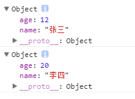
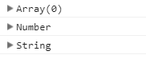
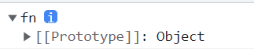
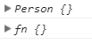
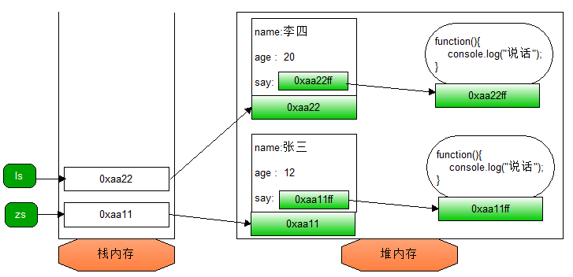
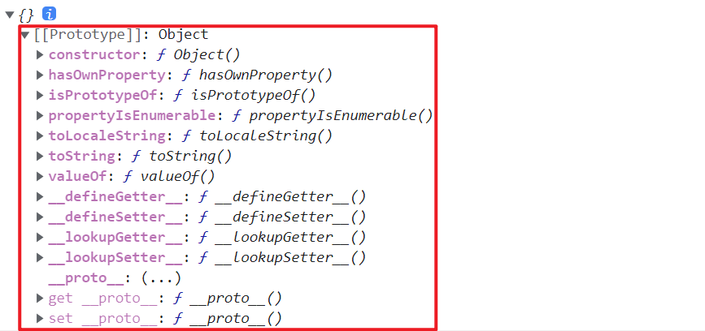
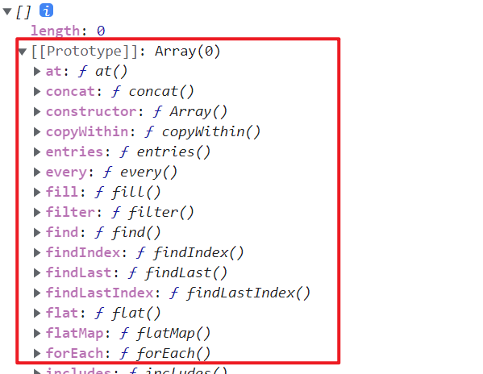
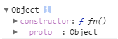
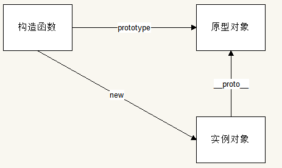
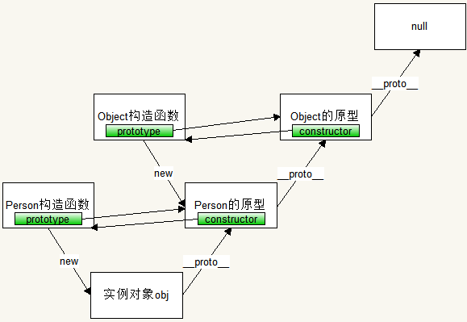

# 面向对象

## 一、对象的重要性

在js内部，也就是js的底层，对所有数据的处理，都是以对象形式来进行的，所以，js中所有数据都有两种定义方式：

1. 字面量方法

   字面量方式，就是直接定义，让我们可以一目了然的看出，这个数据的类型。例如：

   ```js
   var num = 10
   var str = 'abcdef'
   var bool = true
   ...
   ```

   这种定义方式，我们可以一眼就看出这是什么类型的数据。

2. 构造函数方式

   ```js
   var arr = new Array()
   var obj = new Object()
   var num = new Number()
   var str = new String()
   ...
   ```

   这种通过new的方式来定义对象的方式，就叫做构造函数方式。

   这种方式定义的数据，也是可以像字面量方式定义的数据一样，进行数学运算、字符串拼接等操作的。例：

   ```js
   var num = new Number(10)
   num += 5
   console.log(num) // 15
   
   var str = new String('abcd')
   str += 'ef'
   console.log(str) // 'abcdef'
   ```

这也就造成了，在js中，对象是无所不能的，无处不在的，对象是js最重要的组成部分。

## 二、面向对象

### 1、介绍

面向：脸面朝向

对象：js的重要组成部分

连在一起，就是脸面要朝向对象，也就是要重视对象。

面向对象是一种更加注重对象编程思想，是一种超脱的、高级的编程思想。

用专业术语来讲，面向对象又叫做OOP（Object Oriented Programming）

我们之前的编程思想叫做面向过程编程思想POP（Procedure Oriented Programming）。

### 2、面向过程和面向对象比较

拿我们日常生活来举例子：

#### 2.1、面向过程

下班回家，我们需要吃饭，想吃土豆丝，我们就去菜店买土豆，然后先削皮，用菜刀切成片，再切成丝，然后用水洗一洗，洗到没有淀粉，然后烧过起油，放入佐料葱姜蒜，撒点十三香，佐料爆出香味，倒入土豆丝，翻炒到所有土豆丝发热后，撒盐，翻炒到干锅，倒入酱油，继续翻炒到土豆丝软化，撒入少许白糖，翻炒到有些粘性了，撒些鸡精，翻炒到鸡精消融，出锅。开吃。

总结：要吃到美味的土豆丝，需要自己亲力亲为，重点把握做菜的每个细节。

#### 2.2、面向对象

下班回家，我们需要吃饭，想吃土豆丝，告诉保姆，我要吃土豆丝。等保姆做好以后，开吃。

总结：要吃到美味的土豆丝，不用亲力亲为，重点找好保姆即可。


通过对比，我们发现，面向对象确认要比面向对象更加高级，类似于一个屌丝跟富豪的区别。

所以说面向对象是更加高级的编程思想。

我们之前的编程思想：当做一个案例的时候，需要根据效果，分析实现效果的每个步骤，重点关注每个步骤的实现过程以及其中的逻辑。

面向对象编程思想：当做一个案例的时候，找到对应的对象，调用其中的方法即可。

### 3、创建对象

既然要面向对象，更加注重对象，就要先明白如何创建对象是最好的方式，如何给对象添加属性和方法才是最好的方式。

直接创建：

```js
var obj = {}
```

构造函数方式创建：

```js
var obj = new Object();
```

Object是一个系统提供的构造函数，这个构造函数专门用来创建对象使用的。

如下：保存多个人的信息，需要这样创建多次。

```js
var obj1 = {
    name: '张三',
    age: 12,
    sex: '男'
}

var obj2 = {
    name: '李四',
    age: 13,
    sex: '女'
}

var obj3 = {
    name: '王五',
    age: 11,
    sex: '女'
}
。。。
```

从上面的代码可以看出来，每次创建对象都是在重复动作

这时候，应该用函数来处理重复动作

### 4、工厂函数

定义一个函数，每次调用都能得到一个对象

```js
function createObj(name,age,sex){
    var obj = {
        name,
        age,
        sex
    }
    return obj;
}
var obj1 = createObj("张三",12,"男");
var obj2 = createObj("李四",13,"女");
var obj3 = createObj("王五",11,"女");
```

这种调用就能创建对象的函数，叫做工厂函数。创建出来的每个对象的结构一致，如：电商网站中的商品对象。

优点：可以同时创建多个对象

缺点：创建出来的没有具体的类型（比如是Array和Number），都是object类型的，但我们看到自己的对象只是object，不知道具体是什么类型。

代码：

```js
function factory(name,age){
    var obj = new Object();
    obj.naem = name;
    obj.age = age;
    return obj;
}
var zs = factory("张三",12);
var ls = factory("李四",20);
console.log(zs);
console.log(ls);
```

效果：

| 看不到具体类型的对象                      |
| ----------------------------------------- |
|  |

### 5、构造函数

从使用构造函数方式来看数字类型、字符串类型。。。

当我们定义好不同的数据，从外观上就能看出，这个数据的具体类型，例：

```js
var arr = new Array();
var obj = new Number();
var str = new String();
console.log(arr);
console.log(obj);
console.log(str);
```

输出结果：

| 系统内置函数创建出来的对象                |
| ----------------------------------------- |
|  |

这种专门用于new来创建对象的函数，叫做构造函数。

Number、String这种函数，除了可以用new创建对象外，还可以进行类型转换。

其实这样用new创建对象的函数，我们自定义的函数也是可以的：

```js
function fn() {}
var f = new fn()
console.log(f)
```

图示：

 

每个函数都可以这样做。当一个函数被用new来创建对象的时候，这个函数就叫做构造函数了。

通过上面代码，我们发现，如果使用自己定义的函数来创建对象的话，就可以立马看到这个对象的具体类型了。

所以，解决工厂函数的问题，就可以使用自定义的构造函数来实现。

例：

```js
function Person(){
   
}
var zs = new Person();
function fn(){

}
var ls = new fn();
console.log(zs);
console.log(ls);
```

输出结果：

| 使用构造函数创建出来的对象                |
| ----------------------------------------- |
|  |

### 6、自定义构造函数

```js
function Person(name,age,sex){
    this.name = name;
    this.age = age;
    this.sex = sex;
}
var obj1 = new Person("张三",12,"男");
var obj1 = new Person("李四",13,"女");
var obj1 = new Person("王五",11,"女");
```

这时候，我们会奇怪，因为函数并没有被对象调用，那this指的是谁？函数并没有返回值，得到的是什么？

构造函数和普通函数不同的地方在于使用new的时候，中间发生了很多看不见的过程：

1. 创建了一个新对象
2. this指向了这个新对象
3. 执行构造函数中的代码，给对象添加属性和方法
4. 返回这个新对象

使用new构造函数来创建对象的过程称之为<font color="red">**实例化**</font> 

**构造函数注意事项：**

1. 构造函数天生就是用来创建对象的，所以必须和new配合使用，否则就不具备创建对象的能力
2. 构造函数内部不能有return关键字，因为构造函数会自动返回对象。如果返回基本数据类型，和不加效果一样，如果返回复杂数据类型，构造函数就没意义了。
3. 如果new的时候，不需要参数，那么小括号可以省略
4. 人们通常将构造函数的首字母大写

此时的构造函数有个缺点：

从一个构造函数中创建出的对象，实现的是同一种功能，他们拥有的方法应该是一样的，也就是说，同一个构造函数中new实例化得到对象，应该具备同样的方法。

例：

```js
function Person(name){
	this.name = name;
    this.say=function(){
        console.log("说话");
    }
}
var obj1 = new Person("张三");
var obj2 = new Person("李四");
console.log(obj1.say == obj2.say); // false  表示这是两个空间
```

通过比较发现，方法是不一样的。造成了内存浪费。

存储对象方法的具体过程如下图：

| 对象方法存储示意图                        |
| ----------------------------------------- |
|  |

如果将方法定义在全局，可以解决这个问题。

```js
function Person(name,age){		
	this.name = name;
	this.age = age;
	this.sayHi = fn;
}
function fn(){
	console.log("我是" + this.name + "，今年" + this.age + "岁");
}
var zs = new Person("张三",12);
var ls = new Person("李四",13);
```

定义在全局的变量容易被覆盖，所以这个解决方案解决不彻底。

### 7、原型

#### 7.1、原型概念

任何一个对象提升自带一个属性：`__proto__`，这个属性对应的值是一个对象，这个对象叫做对象的原型，或叫做对象的原型对象。

```js
var obj = {}
console.log(obj)
```

图示：

 

#### 7.2、原型作用

原型中的属性和方法，默认就能被对象所访问。

```js
var arr = []
console.log(arr)
```

图示： 

 

我们平常使用的数字方法，其实都在数组的原型上，字符串方法也是一样的。

#### 7.3、构造函数访问原型

任何函数天生自带属性`prototype`，访问到的也是原型。

```js
function fn(){}
console.log(fn.prototype);
```

访问结果：

| 原型                                      |
| ----------------------------------------- |
|  |

构造函数对应的原型，和实例化对象的原型，是同一个对象。

```js
function Person(){
    
}
var obj = new Person();
console.log(obj.__proto__ === Person.prototype) // true
```

#### 7.4、三者关系

构造函数、实例对象、原型对象三者之间的关系如下图：

| 实例原型构造函数的关系                    |
| ----------------------------------------- |
|  |

### 8、面向对象代码

到这里，我们也就找到最佳的定义对象和给对象添加属性和方法的最好的方式了，即：

- 创建对象使用自定义构造函数
- 给对象添加属性，就在构造函数中进行
- 给对象添加方法，就利用构造函数将方法添加到原型上

例：

```js
function Person(name, age) {
	this.name = name
    this.age = age
}
Person.prototype.say = function(){
    console.log(this.name + '会说话')
}
var p1 = new Person('张三', 12)
var p2 = new Person('李四', 13)
console.log(p1.say === p2.say) // true
```

### 9、面向对象版Tab

```html
<!DOCTYPE html>
<html lang="en">
<head>
<meta charset="UTF-8">
<title>Document</title>
</head>
<style>
    .box{
        height:430px;
        width:500px;
        border:1px solid #000;
        overflow:hidden;
        cursor:pointer;
    }
    .box ul,.box ol{
        list-style: none;
        padding: 0;
        margin: 0;
        width:500px;
    }
    .box ul{
        height:30px;
        background:#ccc;
        line-height: 30px;
        display:flex;
        justify-content: space-evenly;
        color:#fff;
    }
    .box ul li{
        float:left;
        width:150px;
        background:#0f0;
        text-align:center;
    }   
    .box ol{
        height:400px;
    }
    .box ol li{
        display:none;
    }
    .box ol li.current{
        display:block;
    }
    .box ol li img{
        width:500px;
        height: 400px;
    }
    .box ul li.current{
        background:#999;
        display:block;
    }
</style>
<body>
<div class="box">
    <ul>
        <li class="current">绿色</li>
        <li>粉色</li>
        <li>蓝色</li>
    </ul>
    <ol>
        <li class="current"></li>
        <li></li>
        <li></li>
    </ol>
</div>
</body>
<script type="text/javascript">
function Tab(className){
    var box = document.querySelector("."+className);
    this.ulis = box.querySelectorAll(".box ul li");
    this.olis = box.querySelectorAll(".box ol li");
    for(var i=0;i<this.ulis.length;i++){
        this.ulis[i].index = i;
        var ele = this;
        this.ulis[i].onclick=function(){
            ele.toggle(this);
        }
    }
}
Tab.prototype.toggle=function(ele){
    for(var i=0;i<this.ulis.length;i++){
        this.ulis[i].className = '';
        this.olis[i].className = '';
    }
    ele.className = 'current';
    this.olis[ele.index].className = 'current';
}
var TabBox = new Tab("box");
</script>
</html>
```

### 10、构造器

每一个原型对象天生带有一个属性叫做`constructor`，这个属性指的是这个原型对象所对应的构造函数。

```js
function Person(){
    
}
var obj1 = new Person();
console.log(obj1.__proto__.constructor === Person); // true  
```

### 11、原型链

#### 11.1、概念

任何对象都会有原型，原型本质上是一个对象，只要是对象就会有原型。

所以，对象有原型，原型也有原型，原型的原型也有原型，。。。，这样形成一条链式结构就叫原型链。

例：

```js
function Person() {
    
}
var p = new Person()
console.log(p)
```

通过输出对象p，查看原型链。

通过一张图来描述原型链：

| 原型链                                    |
| ----------------------------------------- |
|  |

这样向上的一条链式结构，我们称之为原型链。

#### 11.2、作用

当我们访问对象上的属性和方法时，先在自己身上找,如果有,就访问到了,如果没有,顺着原型链往上找,找到了就使用,找不到就继续往上找,。。。，如果找到了null,都没有的话,就返回undefined;

但是<font color="red">**给对象属性赋值和原型没关系，有就修改，没有就增加。**</font> 

作业：使用面向对象将轮播图封装。