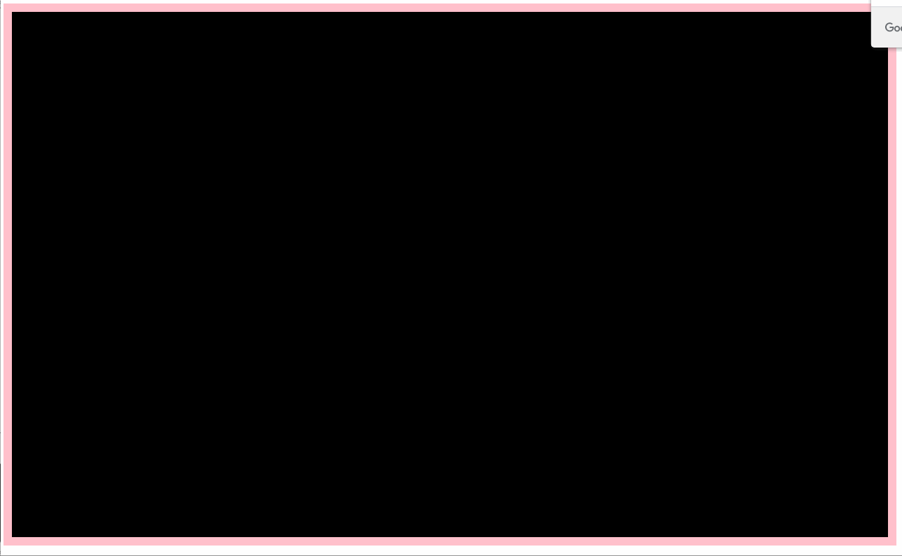

# 面向对象案例

## 一、放大镜

### 1、效果演示

 

### 2、布局分析

通过观察京东等电商网站的放大镜，看到右边的大图会将原本空白区域的内容覆盖显示，所以右边大图，选择从左边的盒子中定位到右边。

#### 2.1、结构

```html
<!-- 放大镜盒子开始 -->
<div class="enlarge">
    <!-- 左边盒子开始 -->
    <div class="middle">
        <!-- 中等图片 -->
        
        <!-- 遮罩 -->
        <div class="mask"></div>
        <!-- 右边大盒子 -->
        <div class="big"></div>
    </div>
    <!-- 左边盒子结束 -->
    <div class="small">
        
        
    </div>
</div>
<!-- 放大镜盒子结束 -->
```

右边盒子中的图片，有两种做法：

1. 给大盒子添加背景图片
2. 给大盒子放图片标签

#### 2.2、样式

```css
.enlarge .middle{
    width: 400px;
    height: 400px;
    border: 3px solid #aaa;
    position: relative;
}
.enlarge .middle .mask{
    width: 100px;
    height: 100px;
    background-color: rgba(255,255,0,0.7);
    position: absolute;
    left: 0;
    top: 0;
    display: none;
}
.enlarge .middle .mask{
    cursor: move;
}
.enlarge .middle .big{
    width: 400px;
    height: 400px;
    display: none;
    position: absolute;
    left: 105%;
    top: 0;
    background-image: url('./images/big1.jpg');
    background-size: 1600px 1600px;
    background-position: 0 0;
}
.small img{
    margin: 5px;
    border: 5px solid #000;
}
.small img:first-child{
    border-color: #f00;
}
```

注意：布局时必须遵循一个比例：
$$
\frac{中等图宽度}{遮罩宽度} = \frac{大图宽度}{大盒子宽度}
$$

$$
\frac{中等图高度}{遮罩高度} = \frac{大图高度}{大盒子高度}
$$

### 3、效果分析

#### 3.1、点击小图

每个小图都需要绑定单击事件，点击小图的时候，要将中等图和大图进行更换，要根据小图的路径更换中等图的大图的路径。

#### 3.2、移入移出中等盒子

鼠标移入中等盒子，要让遮罩和大盒子显示，移出隐藏。

#### 3.3、鼠标移动

鼠标移入中等盒子后，在中等盒子中移动，要设置大图的定位，让大图也跟随遮罩的比例进行移动。

### 4、代码

```js
// 构造函数 - 参数：大盒子类名
function Enlarge(cname) {
    // 获取标签作为对象属性
    this.box = document.querySelector('.'+ cname)
    this.middleBox = this.box.querySelector('.middle')
    this.middleImg = this.box.querySelector('.middle img')
    this.mask = this.box.querySelector('.middle .mask')
    this.bigBox = this.box.querySelector('.middle .big')
    this.smallImgs = this.box.querySelectorAll('.small img')
}
// 定义初始化方法 - 用来绑定事件
Enlarge.prototype.init = function() {
    // 小图点击事件
    // 为了能让事件中使用循环的变量，将var换成let
    for(let a=0; a<this.smallImgs.length; a++) {
        // 为了让事件函数中的this能代表实例对象，将事件函数写成箭头函数形式
        this.smallImgs[a].onclick = () => {
            // 将所有小图的边框颜色设置为黑色
            for(var b=0; b<this.smallImgs.length; b++) {
                this.smallImgs[b].style.borderColor = '#000'
            }
            // 给当前点击的小图设置边框颜色为红色
            this.smallImgs[a].style.borderColor = '#f00'
            // 获取当前小图的路径
            var smallImgPath = this.smallImgs[a].getAttribute('src')
            // 将其中的small换成middle变成中等图的路径
            var middleImgPath = smallImgPath.replace('small', 'middle')
            // 将中等图路径进行更换
            this.middleImg.setAttribute('src', middleImgPath)
            // 将小图路径中的small换成big，变成大图路径
            var bigImgPath = this.smallImgs[a].getAttribute('src')
            // 设置大盒子背景图片路径更换大图
            this.bigBox.style.backgroundImage = `url('${bigImgPath}')`
        }
    }
    // 中等盒子移入事件
    // 为了能让事件中的this代表实例化对象，将事件函数换成箭头函数
    this.middleBox.onmouseover = () => {
        // 遮罩和大盒子显示
        this.mask.style.display = 'block'
        this.bigBox.style.display = 'block'
        // 鼠标在中盒子中的移动事件 - 事件函数写成箭头函数
        this.middleBox.onmousemove = (e) => {
            // 获取鼠标在文档中的位置
            var x = e.pageX
            var y = e.pageY
            // 计算遮罩的位置
            var l = x - this.middleBox.offsetLeft - this.middleBox.clientLeft - this.mask.offsetWidth / 2
            var t = y - this.middleBox.offsetTop - this.middleBox.clientTop - this.mask.offsetHeight / 2
            // 限制最大值和最小值
            if(l < 0) {
                l = 0
            }
            if(t < 0) {
                t = 0
            }
            if(l > this.middleBox.clientWidth - this.mask.offsetWidth) {
                l = this.middleBox.clientWidth - this.mask.offsetWidth
            }
            if(t > this.middleBox.clientHeight - this.mask.offsetHeight) {
                t = this.middleBox.clientHeight - this.mask.offsetHeight
            }
            // 设置遮罩位置
            this.mask.left = l + 'px'
            this.mask.top = t + 'px'
            // 计算大图应该移动的比例 = 遮罩移动的比例
            var percentX = l / this.middleBox.clientWidth
            var percentY = t / this.middleBox.clientHeight
            // 根据比例计算大图应该移动的距离
            var bigLeft = percentX * parseInt(getComputedStyle(this.bigBox).backgroundSize.split(' '))[0]
            var bigTop = percentY * parseInt(getComputedStyle(this.bigBox).backgroundSize.split(' '))[1]
            // 设置大图定位
            this.bigBox.style.backgroundPosition = `-${bigLeft}px -${bigTop}px`
        }
    }
}

// 创建对象
var elg = new Enlarge('enlarge')
// 调用初始化方法让效果生效
elg.init()
```

## 二、烟花

### 1、效果演示

 

### 2、效果分析

1. 创建夜空
2. 在夜空大盒子中点击鼠标，记录鼠标在夜空中的坐标，根据坐标创建小盒子放在夜空底部
3. 给小盒子添加动画上升到鼠标点击位置
4. 在鼠标位置创建多个小div
5. 让每个小div移动到随机位置，到达目标位置后移除小div

### 3、代码

```js
// 创建构造函数
function FireWorks() {
    // 创建夜空
    this.nightSky = document.createElement('div')
    // 设置样式
    this.setStyle(this.nightSky, {
        width:"1000px",
        height:"600px",
        background:"#000",
        border:"10px solid pink",
        position:"relative"
    })
    // 放在body中
    document.body.appendChild(this.nightSky)
}
// 初始化方法
FireWorks.prototype.init = function() {
    // 给夜空绑定单击事件
    this.nightSky.onclick= e => {
        // 获取鼠标在夜空中的坐标
        var x = e.offsetX;
        var y = e.offsetY;
        // 生成一个小div
        this.createFire(x, y)
    }
}
// 创建一个小div的方法
FireWorks.prototype.createFire = function(x, y) {
    var div = document.createElement("div");
    this.setStyle(div,{
        width: "10px",
        height: "10px",
        position: "absolute",
        left: x + 'px',
        bottom: 0,
        background: this.getColor()
    });
    this.nightSky.appendChild(div);
    // 让小div上升到鼠标位置
    this.toUp(div, x, y)
}
// 让小div上升到鼠标位置
FireWorks.prototype.toUp = function(ele, x, y) {
    this.animate(ele, {
        top: x
    }, () => {
        // 删除当前小div
        ele.remove()
        // 创建多个小烟花
        this.createFires(x, y)
    })
}
// 创建很多小烟花的方法
FireWorks.prototype.createFires = function(x, y) {
    // 获取随机小烟花数量
    var num = this.getRandom(20, 50)
    // 循环创建
    for(var a=0; a<num; a++) {
        var div = document.createElement('div')
        // 设置样式
        this.setStyle(div,{
            width: "10px",
            height: "10px",
            position: "absolute",
            left: x + 'px',
            top: y + 'px',
            borderRadius: '50%',
            background: this.getColor()
        });
        // 放在夜空中
        this.nightSky.appendChild(div)
        // 让每个小烟花炸开
        this.boom(div)
    }
}
// 让小烟花炸开的方法
FireWorks.prototype.boom = function(ele) {
    this.animate(ele, {
        left: this.getRandom(this.nightSky.clientWidth - 10),
        top: this.getRandom(this.nightSky.clientHeight - 10)
    }, () => {
        // 小烟花消失
        ele.remove()
    })
}
// 产生动画的方法
FireWorks.prototype.animate = function(ele, animateObj, cb = function() {}) {
    var k = 0
    for(let key in animateObj) {
        k++
        let cssValue = getComputedStyle(ele)[key]
        let target = key === 'opacity' ? animateObj[key] * 100 : animateObj[key]
        cssValue = key === 'opacity' ? parseInt(cssValue * 100) : parseInt(cssValue)
        let timer = setInterval(function() {
            let speed = (target - cssValue) / 20
            speed = speed > 0 ? Math.ceil(speed) : Math.floor(speed)
            cssValue += speed
            ele.style[key] = key === 'opacity' ? cssValue / 100 : cssValue + 'px'
            if(target === cssValue) {   
                clearInterval(timer)
                k--
                k === 0 ? cb() : ''
            }
        }, 16)
    }
}
// 获取随机颜色的方法
FireWorks.prototype.getColor = function() {
    var color = '#'
    for(var a=0; a<3; a++) {
        var num = this.getRandom(256).toString(16)
        num = num.length === 1 ? '0' + num : num
        color += num
    }
    return color
}
// 获取随机数的方法
FireWorks.prototype.getRandom = function(a, b = 0) {
    return Math.floor(Math.random() * Math.abs(a - b)) + Math.min(a, b)
}
// 批量设置样式的方法
FireWorks.prototype.setStyle = function(ele, styleObj) {
    var cssText = ''
    for(var key in styleObj) {
        var reg = /[A-Z]/
        var value = styleObj[key]
        if(reg.test(key)) {
            var reg = /([a-z]+)([A-Z])([a-z]+)/g
            key = key.replace(reg, '$1-$2$3')
            key = key.toLowerCase()
        }
        cssText += key + ':' + value + ';'
    }
    ele.style.cssText = cssText
}
// 创建对象
var fire = new FireWorks()
// 调用初始化方法
fire.init()
```

## 三、贪吃蛇

### 1、效果分析

#### 1.1、地图

一个大div，控制食物和蛇的范围。

#### 1.2、食物

一个随机出现的小div，被吃掉后重新创建。

#### 1.3、蛇

有3个小div组成。需要有移动方向，被键盘控制。

3个小div可以移动，移动过程中，可以吃食物和撞墙或撞身体死亡。

### 2、代码

```js
// 地图构造函数
function Map() {
    // 创建地图div
    this.map = document.createElement('div')
    // 设置样式
    this.setStyle(this.map, {
        width: '1000px',
        height: '600px',
        backgroundColor: '#aaa',
        border: '10px solid #666',
        position: 'relative'
    })
    // 放在body中
    document.body.appendChild(this.map)
}
// 批量设置样式的方法
Map.prototype.setStyle = function(ele, styleObj) {
    var cssText = ''
    for(var key in styleObj) {
        var cssValue = styleObj[key]
        var reg = /[A-Z]/
        if(reg.test(key)) {
            var word = key.match(reg)[0]
            key = key.replace(word, '-' + word.toLowerCase())
        }
        cssText += key + ':' + cssValue + ';'
    }
    ele.style.cssText = cssText
}
// 创建地图对象
var m = new Map()

// 食物构造函数
function Food() {
    // 创建食物div
    this.food = document.createElement('div')
    // 设置样式
    m.setStyle(this.food, {
        width: '10px',
        height: '10px',
        backgroundColor: '#f00',
        position: 'absolute',
        left: this.getRandom(m.map.clientWidth - 10) + 'px',
        top: this.getRandom(m.map.clientHeight - 10) + 'px'
    })
    // 放在地图中
    m.map.appendChild(this.food)
}
// 获取随机数的函数
Food.prototype.getRandom = function(a, b = 0) {
    return Math.floor(Math.random() * Math.abs(a - b)) + Math.min(a, b)
}
// 创建食物对象
var f = new Food()

// 蛇构造函数
function Snake() {
    // 定义蛇身体的坐标
    this.body = [
        {
            x: 0,
            y: 0
        },
        {
            x: 10,
            y: 0
        },
        {
            x: 20,
            y: 0
        }
    ]
    // 定义蛇的移动方向
    this.direction = 'right'
    // 定时器返回值
    this.timer = 0
}
// 初始化方法
Snake.prototype.init = function() {
    this.changeDirection()
    this.move()
}
// 改变移动方向的方法
Snake.prototype.changeDirection = function() {
    document.onkeyup = e => {
        var word = String.fromCharCode(e.keyCode).toLowerCase()
        switch(word) {
            case 'w':
                this.direction = 'up'
            break
            case 'd':
                this.direction = 'right'
            break
            case 'a':
                this.direction = 'left'
            break
            case 's':
                this.direction = 'down'
            break
        }
    }
}
// 蛇显示身体的方法
Snake.prototype.show = function() {
    // 获取身体
    var snakes = m.map.querySelectorAll('.snake')
    // 判断是否获取到
    if(snakes) {
        // 遍历
        for(var a=0; a<snakes.length; a++) {
            snakes[a].remove()
        }
    }
    // 遍历身体数组
    for(var a=0; a<this.body.length; a++) {
        // 根据坐标创建div
        var div = document.createElement('div')
        // 设置样式
        m.setStyle(div, {
            width: '10px',
            height: '10px',
            backgroundColor: '#0ff',
            position: 'absolute',
            left: this.body[a].x + 'px',
            top: this.body[a].y + 'px'
        })
        // 放在地图中
        m.map.appendChild(div)
        // 给蛇头设置样式
        if(a === this.body.length - 1) {
            div.style.borderRadius = '50%'
            div.style.backgroundColor = '#00f'
        }
        // 给蛇身体div设置类名
        div.className = 'snake'
    }
}
// 蛇移动的方法
Snake.prototype.move = function() {
    // 设置定时器
    this.timer = setInterval(() => {
        // 遍历除蛇头外的身体坐标
        for(var a = 0; a < this.body.length - 1; a++) {
            this.body[a].x = this.body[a + 1].x
            this.body[a].y = this.body[a + 1].y
        }
        // 根据方向切换除了蛇头的坐标
        var snakeHead = this.body[this.body.length - 1]
        switch(this.direction) {
            case 'up':
                snakeHead.y -= 10
            break
            case 'down':
                snakeHead.y += 10
            break
            case 'left':
                snakeHead.x -= 10
            break
            case 'right':
                snakeHead.x += 10
            break
        }
        // 显示身体
        this.show()
        // 判断是否吃到食物
        this.eat()
        // 判断是否死亡
        this.die()
    }, 200)
}
// 吃食物的方法
Snake.prototype.eat = function() {
    var snakeHead = this.body[this.body.length - 1]
    // 判断蛇头是否撞墙
    if(snakeHead.x === f.food.offsetLeft && snakeHead.y === f.food.offsetTop) {
        this.body.unshift({
            x: this.body[0].x,
            y: this.body[0].y
        })
        f.food.remove()
        f = new Food()
    }
}
// 蛇死亡的方法
Snake.prototype.die = function() {
    var snakeHead = this.body[this.body.length - 1]
    // 判断蛇头是否撞墙
    if(snakeHead.x < 0 || snakeHead.y < 0 || snakeHead.x > m.map.clientWidth - 10 || snakeHead.y > m.map.clientHeight - 10) {
        alert('GAME OVER!!!')
        clearInterval(this.timer)
        this.show()
    }
    // 判断蛇头是否撞身体
    for(var a=0; a<this.body.length-1; a++) {
        if(snakeHead.x === this.body[a].x && snakeHead.y === this.body[a].y) {
            alert('GAME OVER!!!')
            clearInterval(this.timer)
            this.show()
            break
        }
    }
}
// 创建蛇对象
var s = new Snake()
// 调用初始化方法
s.init()
```

## 四、深拷贝和浅拷贝

### 1、需求

贪吃蛇案例中，我们发现一个问题，蛇在死亡后，最后一个动作是将蛇头走出地图。这个效果的用户体验感不好。

为了能让蛇在死亡后，蛇头不走出地图，我们需要一个新数组，用来记录蛇上一次走动后的坐标，当蛇死亡后，蛇头走出地图，我们可以通过记录的蛇上次走动的坐标，将蛇的位置还原到上一次的位置。

在蛇的构造函数中定义属性：

```js
function Snake() {
    // 定义蛇身体的坐标
    this.body = [
        {
            x: 0,
            y: 0
        },
        {
            x: 10,
            y: 0
        },
        {
            x: 20,
            y: 0
        }
    ]
    // 定义蛇的移动方向
    this.direction = 'right'
    // 定时器返回值
    this.timer = 0
    // 定义属性，记录上次走动的坐标，初始值为空
    this.oldBody = []
}

```

蛇每次走动都需要先记录上次的坐标，然后再走动：

```js
// 蛇移动的方法
Snake.prototype.move = function() {
    // 设置定时器
    this.timer = setInterval(() => {
        // 在给身体坐标赋值之前，先记录当前的坐标
        this.oldBody = this.body
        // 遍历除蛇头外的身体坐标
        for(var a = 0; a < this.body.length - 1; a++) {
            this.body[a].x = this.body[a + 1].x
            this.body[a].y = this.body[a + 1].y
        }
        // 根据方向切换除了蛇头的坐标
        var snakeHead = this.body[this.body.length - 1]
        switch(this.direction) {
            case 'up':
                snakeHead.y -= 10
            break
            case 'down':
                snakeHead.y += 10
            break
            case 'left':
                snakeHead.x -= 10
            break
            case 'right':
                snakeHead.x += 10
            break
        }
        // 显示身体
        this.show()
        // 判断是否吃到食物
        this.eat()
        // 判断是否死亡
        this.die()
    }, 200)
}
```

当赋值完成后，我们发现蛇的走动出了bug，因为这次的赋值属于引用数据类型的赋值，改变body其实也是在改变oldBody，因为两个属性共享同一个数据空间了。这就相当于没有记录。

此时，我们需要一个跟body一模一样的数据，但不要跟body共享同一个数据空间。

这就需要使用到深拷贝和浅拷贝了。

深拷贝和浅拷贝都是根据源数据拷贝一个新数据，新数据和源数据不共享同一个数据空间。

### 2、浅拷贝

浅拷贝：顾名思义，拷贝的比较浅。源数据和目标数据不共享同一个数据空间，如果源数据中包含引用数据类型，源数据中的引用数据和新数据中的引用数据还在共享同一个数据空间。

#### 2.1、数组浅拷贝

例：

```js
var arr = [1, false, {name: '张三', age: 12}, function() {}]
var brr = []

// 遍历
arr.forEach(item => brr.push(item))
// 或
var brr = [...arr]

// 数组方法
var brr = arr.slice()
var brr = arr.concat()

// 比较两个数据
cosnole.log(arr === brr) // false
// 比较其中的引用数据
console.log(arr[2] === brr[2]) // true
```

如果用到其中具体的引用数据，还是会造成两个数据一起改变，更严谨的做法是要进行深拷贝。

#### 2.2、对象浅拷贝

```js
var obj = {
	name: '张三',
    age: 12,
    wife: {
        name: '翠花',
        age: 13
    }
}
var pbj = {}

// 遍历
for(var key in obj) {
    pbj[key] = obj[key]
}
// 或
pbj = {...obj}

// 对象方法
pbj = Object.assign({}, obj)

// 比较
console.log(obj === pbj) // false
// 比较其中的引用数据
console.log(obj['wife'] === pbj['wife']) // true
```

assign方法用于将一个对象中的属性拷贝到另一个目标对象中，返回目标对象。

### 3、深拷贝

深拷贝：深层次的拷贝，新数据和源数据不共享同一个数据空间，其中包含的引用数据也不共享同一个数据空间。

#### 3.1、json方法

例：

```js
var arr = [1, false, {name: '张三', age: 12}]

// 利用json方法
var brr = JSON.parse(JSON.stringify(arr))

// 比较
console.log(arr === brr) // false
console.log(arr[2] === brr[2]) // false
```

json：一种数据格式，类似于数组和对象的数据格式。

我们在项目中存储数据，通常会使用json文件进行存储，一种后缀为`.json`的文件。

json文件格式要求：

例：

```json
{
    "name": "zhangsan",
    "age": 12
}
```

或：

```json
[12, "lisi"]
```

这种格式的数据叫做json。这种格式的字符串叫json字符串。

json方法：

```js
JSON.stringify(对象/数组) // 将对象或数组转成json字符串

JSON.parse(json字符串) // 将json字符串转成数组或对象
```

例：

```js
var obj = {
	name: '张三',
    age: 12,
    wife: {
        name: '翠花',
        age: 13
    },
    children: ['大毛', '二毛', '小明'],
    eat: function() {
        console.log('吃东西')
    }
}
var objStr = JSON.stringify(obj)
console.log(objStr)

var arr = [1, false, {name: '张三', age: 12}, function() {console.log('函数')}]
var arrStr = JSON.stringify(arr) 
console.log(arrStr)


var pbj = JSON.parse(objStr)
console.log(pbj)

var brr = JSON.parse(arrStr)
console.log(brr)
```

每次转换后，会得到一个新数据，所以可以利用json方法实现深拷贝。

但json方法的转换，会丢失函数。数组或对象中如果包含有函数，转换后的结果中是没有函数的。

为了在深拷贝过程中不丢失函数，我们需要自己手动封装一个递归函数，用于实现深拷贝。

#### 3.2、递归实现深拷贝

```js
function deepCopy(data) {
    var newData
    if(Object.prototype.toString.call(data) === '[object Object]') {
        newData = {}
    } else if(Object.prototype.toString.call(data) === '[object Array]') {
        newData = []
    } else {
        return data
    }
    for(var key in data) {
        if(typeof data[key] === 'object') {
            newData[key] = deepCopy(data[key])
        } else {
            newData[key] = data[key]
        }
    }
    return newData
}
var obj = {
	name: '张三',
    age: 12,
    wife: {
        name: '翠花',
        age: 13
    },
    children: ['大毛', '二毛', '小明'],
    eat: function() {
        console.log('吃东西')
    }
}
var pbj = deepCopy(obj)
console.log(pbj);
console.log(pbj === obj); // false
console.log(pbj['wife'] === obj['wife']); // false

var arr = [1, false, {name: '张三', age: 12}, function() {console.log('函数')}]
var brr = deepCopy(arr)
console.log(brr);
console.log(arr === brr); // false
console.log(arr[2] === brr[2]); // false
```

### 4、深拷贝完善贪吃蛇

在构造函数中，新定义一个数据用于存储蛇上一次的坐标：

```js
function Snake() {
    // 定义蛇身体的坐标
    this.body = [
        {
            x: 0,
            y: 0
        },
        {
            x: 10,
            y: 0
        },
        {
            x: 20,
            y: 0
        }
    ]
    // 定义蛇的移动方向
    this.direction = 'right'
    // 定时器返回值
    this.timer = 0
    // 定义属性，记录上次走动的坐标，初始值为空
    this.oldBody = []
}
```

蛇每次移动，将蛇上次的坐标进行记录：

```js
// 蛇移动的方法
Snake.prototype.move = function() {
    // 设置定时器
    this.timer = setInterval(() => {
        // 在给身体坐标赋值之前，先记录当前的坐标
        this.oldBody = JSON.parse(JSON.stringify(this.body))
        // 遍历除蛇头外的身体坐标
        for(var a = 0; a < this.body.length - 1; a++) {
            this.body[a].x = this.body[a + 1].x
            this.body[a].y = this.body[a + 1].y
        }
        // 根据方向切换除了蛇头的坐标
        var snakeHead = this.body[this.body.length - 1]
        switch(this.direction) {
            case 'up':
                snakeHead.y -= 10
            break
            case 'down':
                snakeHead.y += 10
            break
            case 'left':
                snakeHead.x -= 10
            break
            case 'right':
                snakeHead.x += 10
            break
        }
        // 显示身体
        this.show()
        // 判断是否吃到食物
        this.eat()
        // 判断是否死亡
        this.die()
    }, 200)
}
```

蛇死亡后，让蛇的身体坐标变成上次死亡之前的坐标：

```js
// 蛇死亡的方法
Snake.prototype.die = function() {
    var snakeHead = this.body[this.body.length - 1]
    // 判断蛇头是否撞墙
    if(snakeHead.x < 0 || snakeHead.y < 0 || snakeHead.x > m.map.clientWidth - 10 || snakeHead.y > m.map.clientHeight - 10) {
        alert('GAME OVER!!!')
        clearInterval(this.timer)
        this.body = JSON.parse(JSON.stringify(this.oldBody))
        this.show()
    }
    // 判断蛇头是否撞身体
    for(var a=0; a<this.body.length-1; a++) {
        if(snakeHead.x === this.body[a].x && snakeHead.y === this.body[a].y) {
            alert('GAME OVER!!!')
            clearInterval(this.timer)
        this.body = JSON.parse(JSON.stringify(this.oldBody))
            this.show()
            break
        }
    }
}
```


