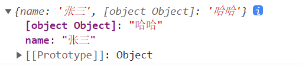

# 对象方法

## 一、Object原型方法

Object构造函数对应的原型中有很多方法，比较实用，如下：

```js
console.log(Object.prototype)
```

图示：

 

### 1、hasOwnProperty

用于判断某个对象是否具有某个自带属性。自带属性，指的是自身就有的，而非继承来的，语法：

```js
对象.hasOwnProperty(非继承属性) // 返回布尔值，true表示是，false表示否
```

例：

```js
function Person(name, age) {
    this.name = name
    this.age = age
}

Person.prototype.sex = '男'

var man = new Person('张三', 12)

console.log( man.hasOwnProperty('name') ); // true
console.log( man.hasOwnProperty('sex') ); // false
console.log( man.hasOwnProperty('height') ); // false
```

只有自己内非继承的属性才能返回true，继承的和不是自己的属性都是false。


### 2、isPrototypeOf

用于判断一个对象是否在另一个对象的原型链上。语法：

```js
对象a.isPrototypeOf(对象b) // 判断对象a是否在对象b的原型链上，返回布尔值
```

例：

```js
function Animal() {

}

var ani = new Animal()

function Bird() {

}

Bird.prototype = ani

var maque = new Bird()

console.log( Object.prototype.isPrototypeOf(maque) ); // true
console.log( ani.isPrototypeOf(maque) ); // true
var ani1 = new Animal()
console.log( ani1.isPrototypeOf(maque) ); // false
```


### 3、propertyIsEnumerable

用于判断是否可以从对象中遍历得到某个属性，语法：

```js
对象.propertyIsEnumerable(属性名) // 返回布尔值
```

例：

```js
function Person(name, age) {
    this.name = name
    this.age = age
}

Person.prototype.sex = '男'

var man = new Person('张三', 12)

console.log( man.propertyIsEnumerable('name') ) // true - 自己的属性可以遍历
console.log( man.propertyIsEnumerable('sex') ) // false - 继承来的属性无法遍历
```


### 4、toString

用于将对象转成字符串，语法：

```js
对象.toString() // 返回'[object Object]'
```


### 5、其他

`toLocaleString`和`valueOf`没有实际的效果，是为了让子原型能具备这些方法，来实现不同类型数据的功能。

`toLocaleString`给不同的数据调用会得到不同的数据：

```js
// 对象调用
var obj = {name: '张三', age: 123456}
console.log( obj.toLocaleString() ); // [object Object]

// 字符串调用
var str = 'abcdefg'
console.log( str.toLocaleString() );  // abcdefg

// 数字调用
var num = 123456789
console.log( num.toLocaleString() ); // 123,456,789

// 布尔值调用
var bool = true
console.log( bool.toLocaleString() ); // true

// 时间日期对象调用
var date = new Date()
console.log( date.toLocaleString() ); // 2022/11/4 09:20:01
```

只有数字和时间日期对象调用的时候，能起到作用，其他类型的数据调用后，会默认调用`toString`方法转成字符串而已。

`valueOf`给不同类型的对象调用功能是不同的：

```js
// 对象调用
var obj = {name: '张三', age: 123456}
console.log( obj.valueOf() ); // {name: '张三', age: 123456}

// 字符串调用
var str = new String('abcdefg')
console.log( str.valueOf() );  // abcdefg

// 数字调用
var num = new Number(123456789)
console.log( num.valueOf() ); // 123456789

// 布尔值调用
var bool = new Boolean(true)
console.log( bool.valueOf() ); // true

// 时间日期对象调用
var date = new Date()
console.log( date.valueOf() ); // 1667525014847
```

时间日期对象调用能获取到时间戳，其他类型的对象调用，会得到具体的值，相当于`console.log(数组/对象)`的值

## 二、Object方法

Object本身也有一些实用的方法：

```js
console.dir(Object)
```

图示：

 

### 1、assign

用于将一个对象中可遍历的属性复制到另一个目标对象中，返回目标对象，语法：

```js
var 新目标对象 = Object.assign(原目标对象, 被复制的对象)
```

例：

```js
var obj = {
    name: '张三',
    age: 12
}

var pbj = {
    sex: '男',
    height: 180
}

pbj.__proto__.weight = 150 // 不可遍历属性无法复制

var qbj = Object.assign(obj, pbj) // 将pbj中的属性复制到obj中

console.log(obj); // {name: '张三', age: 12, sex: '男', height: 180}
console.log(qbj); // {name: '张三', age: 12, sex: '男', height: 180}
console.log(obj === qbj); // true
```

通常用于做浅克隆，将一个对象中的属性复制在另一个空对象中。

### 2、create

用于创建一个对象，并指定这个对象的原型，语法：

```js
var 对象 = Object.create(指定的原型对象, {对象键值对的描述}) // 返回创建好的对象
```

参数1必填，例：

```js
var obj = Object.create()
```

报错如下：

 

表示参数1必填，且参数必须是一个对象或null。

参数2是可选项，默认是空对象

例：

```js
var obj = Object.create(null)
console.log(obj); // 这个对象没有原型
```

创建的是一个空对象，且这个对象没有原型，如下图：

 

```js
var pro = {
    name: '张三'
}

var obj = Object.create(pro)
console.log(obj);
```

创建的是一个空对象，原型为pro对象，如下图：

 

参数2中的键，是对象要拥有的键，值必须是一个对象，用于对属性的描述，描述的对象语法如下：

```js
{
  value: 123, // 属性的值
  writable: false, // 属性是否可修改
  enumerable: true, // 属性是否可遍历
  configurable: false, // 属性是否可删除
  get: undefined, // 访问属性值的时候执行什么程序
  set: undefined // 设置属性值的时候执行什么程序
}
```

例：

```js
var obj = Object.create(null, {
    age: {
        value: 12,
        writable: true,
        enumerable: true,
        configurable: true,
    },
})
console.log(obj);
```

对象结果：

 

### 3、defineProperties

用于给对象添加或修改一个属性，语法：

```js
Object.defineProperties(对象, {对象键值对的描述}) // 返回处理后的对象
```

例：

```js
var pro = {
    name: '张三'
}

var obj = Object.defineProperties(pro, {
    age: {
        value: 12,
        writable: true,
        enumerable: true,
        configurable: true,
    },
})
console.log(obj);
```

对象结果：

 

### 4、defineProperty

用于监视对象某个属性被访问或被修改的操作，语法：

```js
Object.defineProperty(对象, 属性名, {
    // 对象属性的描述
    writable: false, // 属性是否可修改
    enumerable: true, // 属性是否可遍历
    configurable: false, // 属性是否可删除
    get: undefined, // 访问属性值的时候执行什么程序
    set: undefined // 设置属性值的时候执行什么程序
})
```

例：

```js
Object.defineProperty(obj, 'name', {
    writable: false, // 属性是否可修改
    enumerable: true, // 属性是否可遍历
    configurable: false, // 属性是否可删除
    get: function() { // 访问属性值的时候执行什么程序
        return 值 // 当访问obj.name的时候会得到这个返回的值
    },
    set: function(val){ // 设置属性值的时候执行什么程序
        // 当给obj.name赋值的时候会在这里截获到他的值为val
    }
})
console.log( obj.name );
obj.name = '李四'
```

案例：数据和视图双向绑定

```html
<body>
<input type="text">
</body>
<script>
function ViewModel(msg) {
    this.msg = msg
}

var vm = new ViewModel('哈哈')

var input = document.querySelector('input')

input.value = vm.msg

Object.defineProperty(vm, 'msg', {
    configurable: false,
    enumerable: true,
    get: function() {
        return input.value
    },
    set: function(val) {
        input.value = val
    }
})

input.oninput = function() {
    vm.msg = this.value
}

</script>
```

改变文本框的值，对象的值会改变，改变对象的值，文本框的值也会改变。

### 5、entries

用于将对象中可遍历的键值对组成一个数组并返回，语法：

```js
Object.entries(对象) // 返回数组
```

例：

```js
var obj = {
    name: '张三',
    age: 12
}

Object.defineProperties(obj, {
    sex: {
        value: '男',
        enumerable: false,
    }
})

console.log(obj);

var arr = Object.entries(obj)

console.log(arr);
```

返回结果：

 

### 6、freeze

用于冻结一个对象，让对象不能新增、不能修改、不能删除、不能改原型，不能改属性的特性，语法：

```js
var 对象 = Object.freeze(对象) // 返回被冻结的对象
```

例：

```js
var obj = {
    name: '张三',
    age: 12
}

obj = Object.freeze(obj)

console.log(obj);

obj.sex = '男'
console.log(obj);

obj.name = '李四'
console.log(obj);

delete obj.age
console.log(obj);

obj.__proto__ = {height: 180}
console.log(obj.height);
```

输出结果：

 

如果对象中的值，是一个对象，里面的小对象是没有被冻结的，也就说这种冻结只是浅冻结：

```js
var obj = {
    name: '张三',
    age: 12,
    wife: {
        name: '翠花',
        age: 13
    }
}
obj = Object.freeze(obj) 

obj.wife.sex = '女'

console.log(obj);
```

结果：

 

若要深冻结，需要手动写递归函数实现：

```js
var obj = {
    name: '张三',
    age: 12,
    wife: {
        name: '翠花',
        age: 13
    }
}

function deepFreeze(data) {
    for(var key in data) {
        if({}.toString.call(data[key]) === '[object Object]') {
            deepFreeze(data[key])
        }
    }
    return Object.freeze(data)
}

obj = deepFreeze(obj)
console.log(obj);

obj.wife.sex = '女'
console.log(obj);
```

冻结数据可以提高性能，一个数据确保后面都不会修改的话，就可以将他冻结。

### 7、fromEntries

跟entries的作用相反，将一个map格式的数组（多个键值对组成的数组）转成一个对象，语法：

`````js
Object.fromEntries(map格式的数据) // 返回键值对组成的对象
`````

例：

```js
var arr = [
    ['name', '张三'], 
    [{age: 12}, '哈哈']
]

var obj = Object.fromEntries(arr)

console.log(obj);
```

结果：

 

可以将map转成对象。

### 8、getOwnPropertyDescriptors

获取对象中某个属性对应的描述对象。

### 9、getOwnPropertySymbols

将对象中所有symbol属性，组成一个数组。

### 10、getPrototypeOf

获取对象的原型对象。

### 11、hasOwn

判断一个属性是否属于某个对象，而不是被继承来的。跟hasOwnProperty的功能一样。

### 12、is

用来判断两个数据是否相等，但是跟`==`和`===`都不一样，基本类型数据，判断数据看起来是否相等，引用数据类型比较地址跟`===`一样，语法：

```js
Object.is(数据1, 数据2) // 返回布尔值
```

例：

```js
// 基本类型
var a = NaN
var b = NaN
console.log(a == b); // false
console.log( Object.is(a ,b) ); // true - 表面看起来一样

var a = -0
var b = +0
console.log(a === b); // true
console.log( Object.is(a, b) ); // false - 表名看起来不一样

// 引用类型
var a = {}
var b = {}
console.log(a === b); // false
console.log( Object.is(a, b) ); // false
```


### 13、isExtensible

用于判断一个对象是否可扩展（是否可以给对象添加属性）。冻结对象、密封对象不可以扩展。

### 14、isFrozen

用于判断一个对象是否被冻结。

### 15、keys

获取对象中所有键组成的数组。

### 16、preventExtensions

用于将一个对象变得不可扩展。

### 17、setPrototypeOf

用于给对象设置原型。

### 18、seal

封闭一个对象，让对象不能添加新属性、不能删除键值对，语法：

```js
Object.seal(要被封闭的对象) // 返回被封闭的对象
```

例：

```js
var obj = {
    name: '张三'
}

Object.seal(obj)

delete obj.name
console.log(obj);

obj.age = 12
console.log(obj);

obj.name = '李四'
console.log(obj);
```

效果：

 

### 19、values

获取对象中所有值组成的数组。

## 三、ES6的对象操作

### 1、Symbol

object的键都是字符串，且都是唯一的，不能重复。假设，我们使用一个别人提供的object，但是需要给这个object添加一个新的键值对，自己添加的键就有可能会跟object中原本的键冲突。symbol的主要作用就是创建对象中独一无二的键，可以从根本上防止对象中的键重复。

也就是说，对象中的键除了是字符串以外，还可以是symbol数据。

symbol数据通过Symbol函数生成，语法如下：

```js
var s = Symbol()
console.log(s);
console.log(typeof s);
```

输出结果：

 

Symbol是一个函数，但不是一个构造函数，如果将Symbol当做构造函数new使用，会报错。

```js
var s = new Symbol()
console.log(s);
```

 

Symbol函数可以接受字符串参数，同一个字符串得出的两个symbol是不相等的，这样就保证了每一个symbol数据都是独一无二的：

```js
var s = Symbol('name')
var s1 = Symbol('name')
console.log(s == s1); // false
```

如果symbol的参数是一个对象，会默认调用对象的toString方法得到字符串：

```js
var obj = {
    name: '张三'
}

var s = Symbol(obj)
console.log(s);

var pbj = {
    name: '李四',
    toString: function(){
        return this.name
    }
}

var s1 = Symbol(pbj)
console.log(s1);
```

 

symbol数据作为对象的键使用，可以保证每个键都是唯一的：

```js
var obj = {
    name: '张三',
    age: 12
}
// 想给对象添加name属性和age属性，可以对象中已经有了name属性和age属性了，此时就将name和age做成symbol数据，然后将symbol数据当做对象的键使用
// 通过name和age做成symbol数据
var nameSymbolKey = Symbol('name')
var ageSymbolKey = Symbol('age')
// 将symbol数据当做对象的键
obj[nameSymbolKey] = '李四'
obj[ageSymbolKey] = 13
console.log(obj);
```

 

symbol数据不能跟其他数据进行运算，不能进行隐形类型转换：

```js
var s = Symbol(0)
var sum = s + 2
console.log(sum);
```

 

其他隐形转换都会报错：

```js
var s = Symbol(0)
var str = s + 'abc' // 报错

console.log(Number(s)) // 报错
```

Symbol可以强制转换成字符串和布尔值：

```js
var s = Symbol()

console.log( String(s) );
console.log(s.toString());
console.log(Boolean(s));
```

 

通过symbol数据的description属性得到symbol数据创建时的字符串参数：

```js
var s = Symbol('abc')
console.log(s.description) // abc
```


### 2、Reflect

解决对象访问、修改、删除后我们无法知道是否成功的问题。

问题：当一个对象封闭后，无法添加属性，但我们并不知道是否添加成功

```js
var obj = {
    name: '张三'
}

Object.seal(obj)

obj.age = 12
console.log(obj);
```

结果没有给将age添加到obj上，假设我们并不知道这个对象是封闭的，添加了属性但没添加成功，我们会觉得莫名其妙。删除和修改同理。

使用Reflect进行添加、修改、删除就能知道是否成功了，语法：

```js
Reflect.get(对象, 键) // 返回值或undefined	
Reflect.set(对象, 键, 值) // 给对象添加键值对，返回布尔值
Reflect.deleteProperty(对象, 键) // 删除对象键值对，返回布尔值
```

例：

```js
ar obj = {
    name: '张三'
}

Object.seal(obj)

// 添加
var bool1 = Reflect.set(obj, 'age', 12)
console.log(bool1); // false

// 删除
var bool2 = Reflect.deleteProperty(obj, 'name')
console.log(bool2); // false

// 访问
var bool3 = Reflect.get(obj, 'name')
console.log(bool3); // '张三'

var bool3 = Reflect.get(obj, 'aaa')
console.log(bool3); // undefined

var pbj = {
    name: '李四'
}

// 添加
var bool1 = Reflect.set(pbj, 'age', 12)
console.log(bool1); // true

// 删除
var bool2 = Reflect.deleteProperty(pbj, 'name')
console.log(bool2); // true
```

Reflect是将对象基本操作换成了函数写法，有了返回值，方便我们进行判断了。

### 3、Proxy

创建一个被劫持/监听的对象，当访问、设置、删除对象键值对的时候会被监视到，和defineProoerty的功能是一样的。语法：

```js
var obj = {
    name: '张三'
}

var pbj = new Proxy(obj, {
    get(object, key) {
        console.log(object, key);
        return 111
    },
    set(object, key, val) {
        console.log(object, key, val);
    }
})

pbj.name = '张三' // {name: '张三'} 'name' '张三'

console.log( pbj.name ); // {name: '张三'} 'name'     111
```

实现数据和视图的双向绑定：

```html
<body>
<input type="text">
</body>
<script>
var input = document.querySelector('input')
var data = {
    msg: '哈哈'
}
input.value = data.msg
var vm = new Proxy(data, {
    get(obj, key) {
        return input.value
    },
    set(obj, key, val) {
        input.value = val
    }
})
input.oninput = function() {
    vm.msg = this.value
}
</script>
```

## 明日面试题

1. 深浅拷贝
2. 原型和原型链