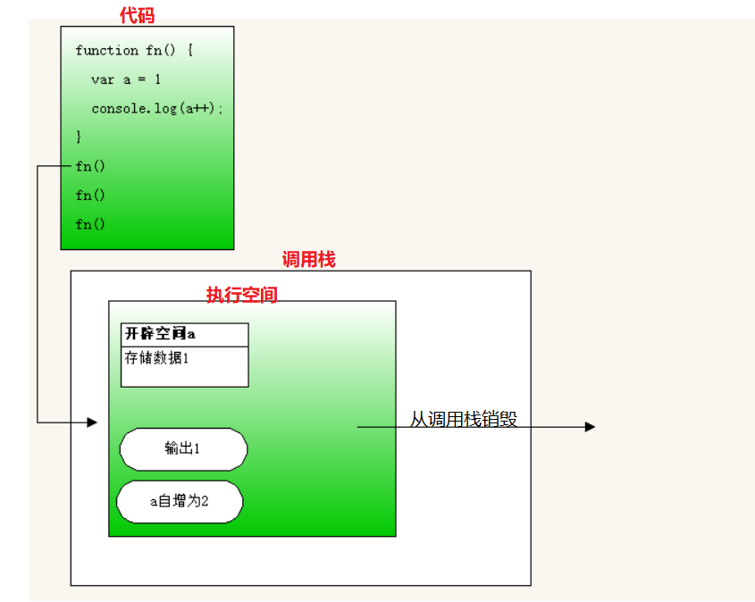
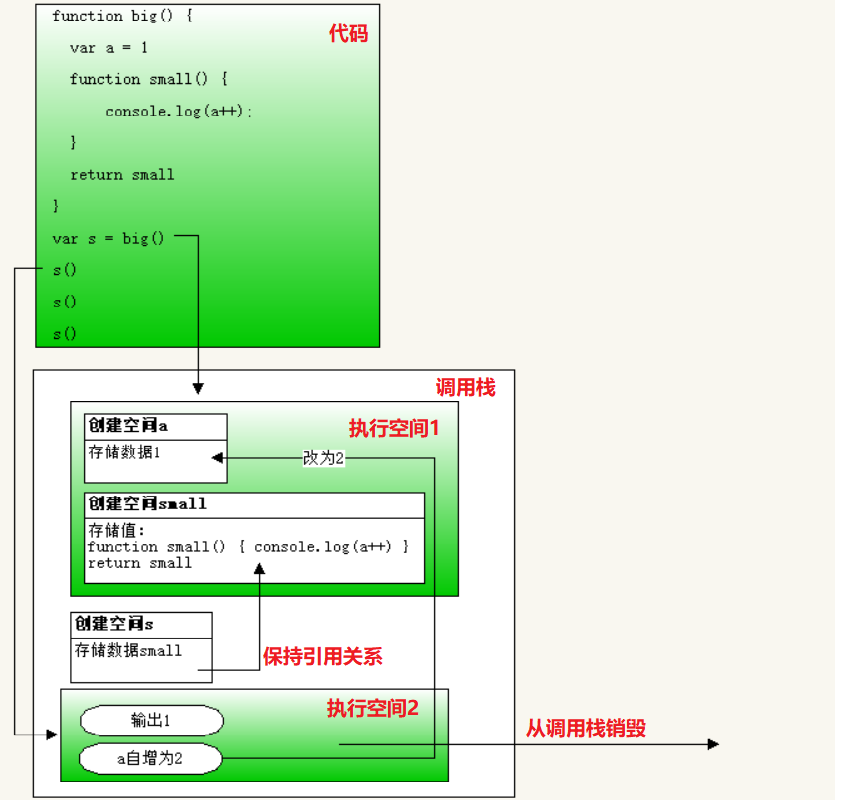
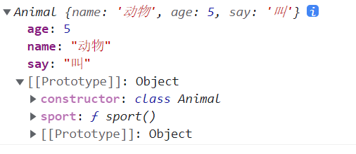
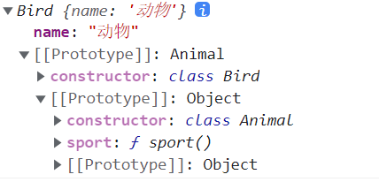
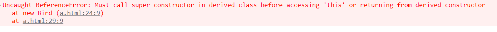
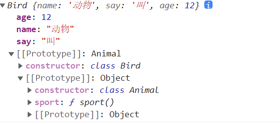
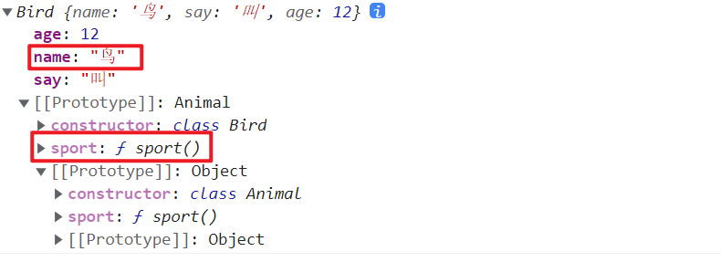

# 闭包和设计模式

## 一、闭包

### 1、闭包介绍

闭包不是新的语法，是函数嵌套后产生一种神奇的场景。

例：

```js
// 普通的函数没有嵌套
function fn() {
    var a = 1
    console.log(a++);
}
fn() // 1
fn() // 1
fn() // 1

// 有函数嵌套
function big() {
    var a = 1
    function small() {
        console.log(a++);
    }
    return small
}
var s = big()
s() // 1
s() // 2
s() // 3
```

函数作用域嵌套，造成变量执行完不被销毁的场景就叫闭包。

### 2、闭包形成的原理

js代码执行，都在内存的**调用栈**内存中进行，函数调用后，会在调用栈中先创建一个执行空间，局部变量，会在执行空间中创建，然后执行代码，当函数代码执行接收后，会从调用栈中销毁这个执行空间。

所以，没有函数嵌套的时候，函数中的局部变量，在执行结束后，执行空间销毁，变量也会被销毁，下次调用的时候会重新在调用栈创建执行空间。

如下图：

  

这个过程重复了3次。所以每次输出都是1。

闭包的执行过程如下图：

  

全局s要和执行空间1中的small保持引用关系，全局s要在后面也能使用，所以执行空间1中的small不能被销毁，所以执行空间1也不能销毁。

所以第二次调用的时候，输出的还是执行空间1中的变量a，是第一次修改后的值2。

### 3、闭包的好处

1. 保护私有变脸不被全局污染
2. 间接的让函数外可以访问函数内的变量
3. 延长了变量的生命周期

<font color="red">**外面函数每调用一次，就会在调用栈保留一个执行空间，调用多了话，可能会造成内存溢出/内存泄漏**</font>    

### 4、闭包的应用

#### 4.1、循环中使用异步或事件

```html
<ul>
    <li>javascript修炼内功</li>
    <li>vue修炼独孤九剑</li>
    <li>react修炼乾坤大挪移</li>
</ul>
</body>
<script>
var lis = document.querySelectorAll('li')
for(var a=0; a<lis.length; a++) {
    lis[a].onclick = click(a)
}
function click(a) {
    return function() {
        alert(lis[a].innerText)
    }
}
</script>
```


#### 4.2、防抖

有一些事件，触发的频率特别高，往往我们在网页中动了一下，事件就会触发很多次，例如：鼠标移动事件、键盘按下事件、浏览器滚动事件、浏览器大小改变事件、文本框及时改变内容事件等。或者人为的频繁触发事件，例如：滑动轮播图，在第一张图还没有完全滑动过去，就点击了多次按钮来触发滑动行为。

这些频繁触发的事件，往往我们不需要触发太多次数，多个动作中，只需要触发一次或几次，而不是每次都触发。

防抖：指事件在频繁的触发时，函数只执行一次。

获取最后一次执行的结果：

```js
document.onmousemove = debounce(fn, 1000)
function debounce(handler, time) {
    var timer = 0
    return function() {
        clearTimeout(timer)
        timer = setTimeout(() => {
            fn.call(this, ...arguments)
        }, time)
    }
}
function fn(e) {
    console.log( e.pageX );
}
```

获取第一次执行的结果：

```js
document.onmousemove = throttling(fn, 1000)
function throttling(handler, time) {
    var flag = true
    var timer = 0
    return function() {
        if(flag) {
            handler.call(this, ...arguments)
            flag = false
        } else {
            clearTimeout(timer)
            timer = setTimeout(() => {
                flag = true
            }, time)
        }
    }
}
function fn(e) {
    console.log( e.pageX );
}
```


#### 4.3、节流

节流：事件在频繁触发时，不是每次触发都会执行函数，让函数有节制的执行。也就是让函数在一个时间段内虽然触发了多次，但是函数只执行了一次。

利用时间差节流：

```js
document.onmousemove = throttling(fn, 1000)
function throttling(handler, time) {
    var startTime = +new Date()
    return function() {
        var now = +new Date()
        if(now - startTime >= time) {
            handler.call(this, ...arguments)
            startTime = now
        }
    }
}
function fn(e) {
    console.log( e.pageX );
}
```

使用定时器和开关节流：

```js
function throttling(handler, time) {
    var flag = true
    return function() {
        if(!flag) return
        flag = false
        setTimeout(() => {
            handler.call(this, ...arguments)
            flag = true
        }, time)
    }
}
```


#### 4.4、函数柯里化

如果一个函数调用传递了多个实参，函数定义就需要多个形参来接收。函数柯里化，就是让函数不接收全部的实参，只接收部分参数，然后在函数内再次返回一个小函数，来接收剩余部分的参数，让函数整个运行流程，可以分多个步骤执行。例：

正常函数：

```js
function add(a, b) {
	console.log(a + b)
}

add(1, 2) // 3
```

柯里化后的函数：

```js
function add(a) {
    return function(b) {
        console.log(a + b)
    }
}
var fn = add(1)
fn(2) // 3
// 简写成
add(2)(3) // 5
```


## 二、继承

### 1、继承的概念

继承是让一个对象可以拥有另一个对象的属性和方法，而不用自己去添加，类似于原型和实例对象的关系。

面向对象编程，有一个特性就是继承。

### 2、原型继承

我们可以通过修改对象的原型，让对象能拥有其他对象的属性和方法。例：

```js
function Animal() {
    this.name = '动物'
}

Animal.prototype.sport = function() {
    console.log('运动');
}

var animal = new Animal()
console.log(animal);

function Bird() {
    this.wing = '翅膀'
}

// 为了能让bird实例对象能拥有animal对象的属性和方法 - 将animal对象作为bird实例对象的原型
Bird.prototype = animal

Bird.prototype.fly = function() {
    console.log('飞翔');
}

var bird = new Bird()
console.log(bird);
console.log(bird.name);
bird.sport()
```

弊端：继承来的属性在原型上，不在自己上，当给自己添加同名属性时，就无法使用原型的属性了。

### 3、借用函数继承

通过借用函数，可以在子构造函数中，执行父构造函数中的代码，将父构造函数中的属性添加在子构造函数中。

```js
function Animal() {
    this.name = '动物'
}

Animal.prototype.sport = function() {
    console.log('运动');
}

var animal = new Animal()
console.log(animal);

function Bird() {
    // 在这里执行父构造函数中的代码并将其中的this改成子构造函数中的this
    Animal.call(this)
    this.wing = '翅膀'
}

Bird.prototype.fly = function() {
    console.log('飞翔');
}

var bird = new Bird()
console.log(bird);
console.log(bird.name);
bird.sport()
```

弊端：父构造函数原型上的方法，bird实例对象无法使用。

### 4、组合继承

为了解决原型继承和借用函数继承的弊端，可以将这两种继承方式都使用上。

```js
function Animal() {
    this.name = '动物'
}

Animal.prototype.sport = function() {
    console.log('运动');
}

var animal = new Animal()
console.log(animal);

function Bird() {
    // 借用函数继承
    Animal.call(this)
    this.wing = '翅膀'
}

// 原型继承
Bird.prototype = animal

Bird.prototype.fly = function() {
    console.log('飞翔');
}

var bird = new Bird()
console.log(bird);
console.log(bird.name);
bird.sport()
```


### 5、ES6的类

高级编程语言，都有面向对象编程，面向对象编程，要有专门的创建方式，在以往的js版本中，使用构造函数来创建。函数本身具有自己让代码复用的功能，再加上创建对象外，反而让js语言显的比较混乱，所以es6增加了专门用于定义对象的数据：类。

类是抽象的对象，对象是实例化的类。所有对象都是由类衍生的，例如人，具体的说，张三这个人，是从人类中衍生的，将人类具体化以后得到的。人类是众多具体的人抽象画后的概念。

ES6中定义类的语法：

```js
class 类的名字{}
```

类只有一个作用，就是定义对象，定义对象的语法：

```js
var 对象 = new 类
```

类的本质，其实还是一个函数，只是换了一种形式，这种形式只能用来定义类，而不能当做构造函数调用了。

```js
class Animal{
    name = '动物'
}
console.log(Animal);
console.log(typeof Animal); // function
Animal() // 报错
```


此时对象是空对象，要给对象中添加属性，就要在类中定义：

```js
class 类的名字{
    属性名 = 值 // 方法1
	// 方法2
    constructor() {
        this.属性名 = 值
    }
}
```

在new类的时候，传递的实参，其实是传递给了constructor，contructor方法只会在new类的时候执行一次。

给对象添加方法：

```js
class 类的名字{
    方法名() {
        代码段
    }
}
```

类中写好的方法，默认会出现在对象的原型中。

例：

```js
class Animal{
    name = '动物'
    constructor(age) {
        this.age = age
        this.say = '叫'
    }

    sport() {
        console.log('运动');
    }
}
var a = new Animal(5)
console.log(a)
```

输出结果：

 

例：利用es6的类写tab切换和轮播图。

### 6、ES6的继承

在ES6的类中定义的对象，实现继承有继承的语法：

```js
class 子类 extends 父类{}
```

例：

```js
class Animal{
    name = '动物'
    constructor(age) {
        this.age = age
        this.say = '叫'
    }

    sport() {
        console.log('运动');
    }
}

class Bird extends Animal{}

var b = new Bird()
console.log(b);
```

输出结果：

 

跟组合继承的效果是一样的。

如果子类中有constructor方法的话，必须在constructor中的第一行代码调用super方法，否则会报错。

```js
class Animal{
    name = '动物'
    sport() {
        console.log('运动');
    }
}

class Bird extends Animal{
    constructor(age) {
        this.age = age
    }
    
}

var b = new Bird(12)
console.log(b);
```

报错：

 

```js
class Animal{
    name = '动物'
    sport() {
        console.log('运动');
    }
}

class Bird extends Animal{
    constructor(age) {
        super()
        this.age = age
    }
    
}

var b = new Bird(12)
console.log(b);
```

如果父类中有constructor，super就相当于在调用父类的constructor，例：

```js
class Animal{
    name = '动物'
    constructor(say) {
        this.say = say
    }
    
    sport() {
        console.log('运动');
    }
}

class Bird extends Animal{
    constructor(age, say) {
        super(say)
        this.age = age
    }
    
}

var b = new Bird(12, '叫')
console.log(b);
```

结果：

 

继承自父类的方法和属性，子类是可以重写的（覆盖）：

```js
class Animal{
    name = '动物'
    constructor(say) {
        this.say = say
    }
    
    sport() {
        console.log('运动');
    }
}

class Bird extends Animal{
    constructor(age, say) {
        super(say)
        this.age = age
        this.name = '鸟'
    }
    sport() {
        console.log('飞翔');
    }
}

var b = new Bird(12, '叫')
console.log(b);
```

结果：

 

这样就可以说，同一个父类，可以被多个子类继承，但每个子类都可以在同样的属性和方法中有不同的表示显示。用专业术语来将，叫做多态。

## 明日面试题

1. apply、call、bind
2. 继承的方式