# day01-变量类型运算

## 一、JS的介绍

### 1、JS的由来

在90年代初，浏览器技术并不发达，浏览器上展示的网页只能以浏览为主，没有用户的交互功能，就像我们现在看到的新闻网页，只能浏览，没有动效，无法通过点击或拖拽实现有趣的效果。网络技术也不发达，数据传送很慢，网速仅有28.8kb/s，不像我们现在的网络，动辄百兆千兆。

基于这样一个背景，用户在进行注册账号的时候，输入的账号等信息，点击提交把数据发送到服务器的时候，传送速度慢，用户需要等待很长时间，才能得到服务器的反馈。例如在表单中输入账号等信息，点击提交后，用户需要耐心等待大概30s的时间，才能知道注册是否成功，关键像两次密码输入不一致、用户名被占用、用户名不合法、密码长度不合法等校验工作，都需要将数据传送给服务器进行验证，每次传送都需要耗费流量，当时的流量费用特别高，给用户操作网页带来了极大的烦恼。

为了解决这个问题，作为当时最受欢迎的浏览器公司网景（Netscape）公司，率先提出了解决方案：将数据校验工作放在浏览器上进行，当浏览器上数据验证通过没有问题之后，再将数据发送给服务器处理，可以减少数据传送次数，节省流量，也节省了传送验证的时间，大大的提高用户体验感。但这需要在浏览器上运行一些脚本才可以实现。

1995年5月，网景公司委派公司程序员布兰登·艾奇（Brendan Eich）开发一些脚本来实现公司的这一创举。在网景公司的设计理念中，这些脚本要使用Java语言来写，因为公司的高管都是Java语言的脑残粉。可是布兰登·艾奇对Java语言完全不感兴趣，所以他用了10个工作日的时间，抱着应付交差的态度匆匆设计出了一门脚本语言：LiveScript。这门语言在后面发布的时候，希望能蹭到Java的热度，将LiveScript改名为JavaScript。简称JS。

JS完美解决了浏览器和服务器交互时间长的问题，也实现了用户和浏览器的交互功能和动态效果，网景公司风头无俩，笑傲江湖。微软看到网景公司的风光，也进军浏览器领域，并借鉴JS开发了属于自己IE浏览器的脚本语言JScript，并捆绑在自己的windows系统产品中，给网景造成了很大的冲击。

于是，网景公司上书IT界的龙头老大欧洲计算机制造商协会（ECMA）公司，要求主持公道，ECMA出面，将JavaScript改名为ECMAScript，简称ES，并制定了浏览器脚本语言的操作标准。不过在IT界，我们把这门语言还称之为JavaScript，只有在版本更新迭代的官方称呼中，叫做ECMAScript。

### 2、JS的概念

支持面向对象的跨平台脚本语言。

概念理解：

> 1. 脚本语言：依赖别的语言才能运行
>
>    html必须在浏览器中才能运行，js嵌套在html中才能运行
>
> 2. 跨平台：可以在不同的平台上运行
>
>    windows、linux、安卓。。。
>
> 3. 支持面向对象
>
>    使用面向对象的思想编程

### 3、JS和H5的关系

广义的H5，指的是大前端，内容包括HTML+CSS+HTML5+CSS3+JavaScript+前端框架（Vue+React+Angular）+移动端开发（App+小程序）+NodeJS后端技术+跟JavaScript相关的其他技术。。。

狭义的H5，特指HTML的第5个版本，新增了一些语义化标签，新增了一些input的type属性，新增了一些选择器。。。

HTML5的强大之处，不在于新语法，而在于很多HTML5的标签，支持了JS的操作，例如：自定义多媒体布局并控制多媒体播放、canvas标签做画布绘图。。。

### 4、JS的应用场景

1. 表单验证：对用户输入数据进行验证，数据验证通过后，进行提交
2. 网页特效：实现用户跟网页的交互，并展示有趣的效果，例如：轮播图、放大镜
3. 游戏开发：网页游戏，例如4399小游戏、网页贪吃蛇、。。。
4. 物联网：门禁、摄像头监控、自动售货机。。。

### 5、JS的组成

| js的组成示意图                            |
| ----------------------------------------- |
|  |

ECMAScript：语法标准

BOM：操作浏览器的标准

DOM：操作HTML文档的标准

## 二、JS的基本使用

### 1、JS的书写方式

跟css样式一样，JS的书写也有3种方式，内联、外联和行内。

### 1.1、内联

JS是脚本语言，运行需要依赖HTML，HTML是由标签组成的，所以JS在HTML中就体现为一个script双标签。JS的代码就写在这个标签中。

这个标签可以放在HTML文档的任意位置，但在不同的位置，对于代码的执行有一定的影响，因为HTML的解析是按照顺序执行的，对于初学者，建议将script标签放在body结束之后。

当浏览器在执行HTML代码的时候，就会解析其中的script标签，并运行JS代码。

### 1.2、外联

将JS代码放在一个后缀为`.js`的文件中，通过script标签的src属性，将文件引入进来即可。

<font color="red">**注意：一个script标签，只能作为内联或外联使用，不可以同时使用。**</font> 

### 1.3、行内

将JS代码写在标签上，作为属性的值使用。

### 2、JS的注释

注释代码不会被执行，仅仅起到一个提示的作用。注释可以对复杂的代码进行解释，方便后期的维护和开发。

1. 单行注释：

   ```js
   // js的单行注释是双斜杠
   ```

2. 多行注释：

   ```js
   /*
   js的多行注释：
   开头是斜杠星号
   结尾是星号斜杠
   */
   ```

### 3、JS的输出

所谓输出，其实就是将内容显示在网页中，和HTML不同，JS代码不会主动显示在网页中。要显示指定的内容，需要特殊方法指定才能显示在网页中，这个指定显示的方式就叫做输出。

1. 以弹窗的形式显示

   ```js
   alert(11);
   ```

    

   这种输出通常适用于给用户做提示，例如：登录成功；删除失败；用户名被占用等......

2. 以文本的形式显示

   ```js
   document.write(123456);
   ```

    

   这种输出方式通常用于给body增加内容。

3. 可输入内容的弹窗

   ```js
   prompt(12345)
   ```

    

   这种弹窗通常在项目使用较少，项目中要提示用户输入内容的时候通常都会使用表单。

4. 询问用户是否确认操作的弹窗

   ```js
   confirm(12345)
   ```

    

   这种弹窗通常在项目中用户进行某些敏感操作时，提示用户是否继续进行下去，例如：用户点击了删除按钮之后，用户点击了退出按钮之后，需要让用户确认是否继续操作，可以取消。

5. 浏览器控制台输出

   ```js
   console.log(123);
   ```

   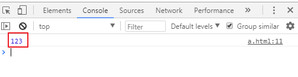 

   这种输出方式在开发过程中很常用，通常用于调试代码时，在浏览器的控制台查看调试结果，不会影响到整体项目的逻辑和效果。

<font color="red">**注意：在js代码中，每行结束可以加分号，也可以不加分号。**</font> 

## 三、变量

引入：

在实际项目中，很多情况下，需要在一个初始数据的基础上进行多次累加操作，例如：

```js
// 第一次输出数字1
console.log(1)
// 第二次需要在第一次的结果基础上添加2
console.log(1+2)
// 第三次需要在第二次的结果基础上添加3
console.log(1+2+3)
// 如果有100次累加，我们就需要在后面写100个加，可想而知其中的繁琐
```

解决方案：我们可以将每次计算得到的数据放在一个容器中，后续操作时，用容器来代表数据即可，不用使用很长的数据了，这样做可以简化我们写的每一行，减少重复的工作。

例如：

```js
a = 1
document.write(a)
b = a + 2
document.write(b)
c = b + 3
document.write(c)
// ...
```

### 1、概念

在JS中，我们把存储数据用的容器，称之为变量。变量这种容器，处于内存中。

也就是说，一个变量就是内存中存储数据用的一个内存空间。

### 2、定义变量

语法：

```js
var 变量名;
```

var是一个关键字，也就是JS内部指定有特殊作用的单词。

### 3、变量名的规则

变量名由字母、数字、下划线、美元符号组成，不能用数字开头，不能使用关键字作为变量名。

关键字如下：

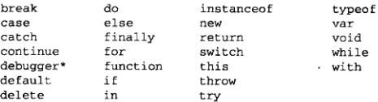 

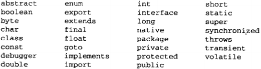 

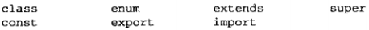 

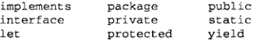 

### 4、变量本质

定义变量的过程，就是在内存开辟了一个空间，名字是变量名，如下图：

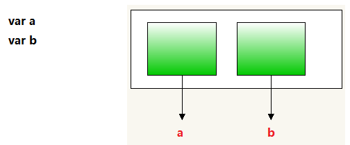  

### 5、赋值

定义好变量就是在内存开辟好了空间，但空间中什么也没有，是一个空的空间。

我们定义变量的目的是给其中放入数据，给变量中放数据的过程，我们称之为赋值。

赋值需要用到一个符号叫赋值符：`=`

这个符号在编程中，不代表相等，代表赋值

赋值重点：

- 赋值符左边的一定是一个变量，准备接收数据

- 赋值符右边的一定是一个具体的值或者能得到值的一个表达式

- 赋值符的唯一作用就是将右边得到的值放在左边的变量容器中


例：

```js
var a;
a = 10;
var b;
b = 20;
var c;
c = a + b;
```

### 6、常用操作

定义变量，给变量赋值的两行代码，可以合并为一行：

```js
var a
a = 10;
var b = 20;
var c = a + b;
```

定义多个变量，也可以在定义的时候赋值，每个变量之间使用逗号隔开：

```js
var a = 10,b = 20;
var a,b = 20;
var a = 10,b;

c = 10 // 强烈不建议写法
```

## 四、数据类型

### 1、引入

> <font color="blue">思考：如何输出一句话？</font>

```javascript
// 在页面上显示：你的头发还好吗
document.write(123456)
document.write(你的头发还好吗)
```

此时浏览器会报错：

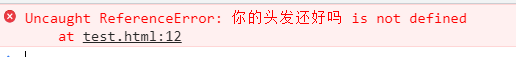 

这个报错表达的意思是说，将你的头发还好吗识别为了一个变量，但是这个变量没有定义过。

也就是说变量在定义的时候，变量的名字还可以使用中文：

```js
var 我 = 123;
console.log(我);
```

这样也是可以的，但是建议不要使用中文汉字作为变量名。

那怎样才能输出上面的中文汉字一段话呢？我们需要给这段话加引号：

```js
console.log("你的头发还好吗");
```

从上面的示例中，可以看到，输出数字不需要加引号，但是输出一段话就需要加引号，也就是说，数据有时候不需要加引号，但有时候就需要加引号，这是因为数据的类型不一致造成的。

js中可以输出数字，输出一段带引号的话，还可以输出哪些数据？

数字、带引号的数据、没有赋值的变量、true、false、[]数据、{}数据、null

根据他们的用途和特性，可以将数据分为以下几类：

| 类型                  | 示例                         | 备注                                             |
| --------------------- | ---------------------------- | ------------------------------------------------ |
| 数字型（number）      | 1   -2   3.14   300          | 包括整数、小数、负数                             |
| 字符串型（string）    | "你好吗？"    '今天嫁给我'   | 用引号引起来的任意多任意字符，单引号和双引号都行 |
| 布尔型（boolean）     | true   false                 | 代表事物的两面性，真和假                         |
| 未定义型（undefined） | var a                        | 代表定义过未赋值的变量                           |
| 对象（object）        | null   [1,2,3]   {name:张三} | 代表一个集合                                     |

### 2、类型检测

使用`typeof(被检测的内容)`可以得出一个内容的类型。

```javascript
console.log(typeof(-123456)); // 数字型
console.log(typeof("明天会更好")); // 字符串型
console.log(typeof(true)); // 布尔型
console.log(typeof(x)); // 布尔型
console.log(typeof([1,2,3])); // 对象
console.log(typeof({name:"张三",age:12})); // 对象
console.log(typeof(null)); // 对象
```

结果如下图：

| 类型检测示意图                            |
| ----------------------------------------- |
| 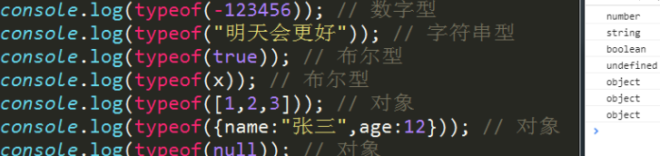 |

多学一招：`typeof(x)` 可以写成 `typeof x` 。使用小括号和空格都可以。

### 3、数字类型

在结果中可以看到使用number来代表数字类型。

#### 3.1、了解内容

##### 3.1.1、不同进制的数字

我们一般使用使用的数字是十进制的，但是在js中我们还可以使用八进制和十六进制。

```javascript
var a = 010; // 8进制
var b = 0xA; // 16进制
var c = 0xb; // 小写字母和大写字母都可以
console.log(a); // 8
console.log(b); // 10
console.log(c); // 11
```

结果：

| 示意图                                    |
| ----------------------------------------- |
|  |

##### 3.1.2、科学计数法

数字的表达当中，有一种叫科学记数法，js中的数字也可以使用科学记数法来表示

```js
//当一次数字很大的时候，可以用科学计数法来表示
var num = 3e+5;  //3乘以10的5次方
var num = 5e-3;//5乘以10的-3次方
```

##### 3.1.3、数值范围

内存大和小有什么区别呢？存储的数据多和少的区别。那计算机存储数据是没有限制的吗？不是，计算机能表达的数字也有极限值：

```js
最小值：Number.MIN_VALUE，这个值为： 5e-324
最大值：Number.MAX_VALUE，这个值为： 1.7976931348623157e+308
无穷大：Infinity    1/0
无穷小：-Infinity
```

#### 3.2、需要掌握的内容

##### 3.2.1、NaN

```javascript
var a = "abc";
var b = 2;
var c = a - b;
console.log(c); // NaN
```

结果：

| 示意图                                    |
| ----------------------------------------- |
| 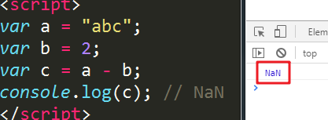 |

> NaN: not a number, 表示一个非数字

在js中，NaN用来表示一个非数字的特殊值，当发现无法进行运算时，js不会报错，而是会返回一个NaN

NaN的注意事项：

- NaN的类型是number类型的，表示一个非数字
- NaN不等于任何值，包括NaN本身
- 通过isNaN()可以判断是否是一个数字，返回false的时候，表示是一个数字。

```js
var a = 123;
var b = "abc";
console.log(isNaN(a)); // false
console.log(isNaN(b)); // true
```

结果：

| 示意图                                    |
| ----------------------------------------- |
| 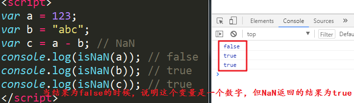 |

##### 3.2.2、小数

计算机中的小数在进行运算的时候，有时会碰到小数点精度不准确的现象

```javascript
//在进行浮点数运算的时候，可能会出现精度丢失的问题
0.1 + 0.2 = 0.30000000000000004;
0.2 + 0.2 = 0.4;
```

原因：

计算机内部所能识别的数据只有二进制，当我们进行10进制数字运算的时候，在计算机内部需要先将数据转为2进制，然后运算，再将结果转为10进制给出来。10进制的小数进行2进制转换的时候，根据转换规则，有些小数会进行无限死循环，最终在后面数字太多的时候只能四舍五入，所以其实最终并没有很精确的转为2进制，所以只能给出一个大概的值。有时候会有两个大概的值相加，在转换10进制的时候正好能转换了，也会计算的比较精准。

```js
consoloe.log(0.2 + 0.2) // 0.4
```

也不绝对，如果小数是2的n次方分支m的话，计算机内部存储的就比较准确。

```js
console.log(0.125 + 0.5) // 0.625
```

解决办法：

```js
// 解决办法 : 
// 1.根据小数点后面的位数量 乘以对应的整数;
0.1 + 0.2  ==> (0.1*10+0.2*10) / 10 = 0.3
// 2.使用toFixed工具强制保留小数点后位数
var a = 0.1 + 0.2
console.log(a.toFixed(3)) // 0.300
```

### 4、字符串类型

字符串所使用的引号，在js中，单引号和双引号是没有区别的，使用哪个都一样。

字符串中的字符是任意字符，即只要在键盘上能输入的字符都是可以的。

单引号和双引号也是字符串的字符：

```js
var str = '"' // 一个双引号字符的字符串
var str1 = "'" // 一个单引号字符的字符串
```

#### 4.1、引号问题

但是双引号中不能包含双引号，单引号中不能包含双引号，因为引号对于字符串来讲是有特殊含义的，就是给字符串做边界，双引号定义的字符串，在字符串中碰到第一个双引号，就认为将前面的双引号结束了，单引号同理。

但在某些特殊情况下，双引号就需要嵌套双引号，单引号就需要嵌套单引号：

```js
var str = '爷爷正在的给孙子讲<<西游记>>的故事，爷爷说:"唐僧害怕被孙悟空打死，所以对孙悟空说:'你回花果山吧'"';
console.log(str)
```

这个字符串在输出的时候是会报错的，因为，浏览器是这样解析这个字符串：

```js
'爷爷正在的给孙子讲<<西游记>>的故事，爷爷说:"唐僧害怕被孙悟空打死，所以对孙悟空说:'你回花果山吧   '"';
```

中间的汉字和两边的字符串之间并没有拼接，不符合js的语法，所以报错。

此时，关键的原因就是单引号字符串中碰到了第一个单引号，就将前面的单引号结束了，因为引号对于字符串是有特殊含义的。

解决方案：

给字符串中的引号转义，也就是将引号对于字符串的特殊含义去掉，就剩下普通字符的含义即可。转义是给引号前加反引号`\`。

```js
var str = '爷爷正在的给孙子讲<<西游记>>的故事，爷爷说:"唐僧害怕被孙悟空打死，所以对孙悟空说:\'你回花果山吧\'"';
console.log(str)
```

#### 4.2、js输出标签

js可以输出标签，让页面中的元素具备标签的特性，但是在输出标签的时候一定要将标签当做字符串输出。

| js输出标签                                |
| ----------------------------------------- |
| 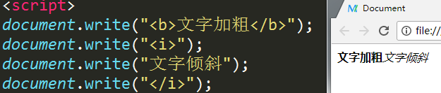 |

输出标签可以看出，每次输出，其实就是在body内容原本的基础上直接追加了，也就是说，一个标签可以分多次输出，结果和输出一次是一样的。

#### 4.3、字符串的拼接

用变量代替每一次的输出：

```js
var a = '<i>';
var b = '文字倾斜';
var c = '</i>';
document.write(a)
document.write(b)
document.write(c)
```

如果我们在此时希望能一次输出的话，就需要将多个变量连接在一起，组成一个更大的字符串才行，字符串之间的连接使用拼接符：`+`

```js
var a = '<i>';
var b = '文字倾斜';
var c = '</i>';
document.write(a + b + c)
```

也就是说，字符串和字符串之间的 `+` 是可以将两个字符串连接在一起组成大字符串的。

### 5、对象类型

object类型，在js中有3种表现形式，分别是：

- null
- 用[]定义的数据
- 用{}定义的数据

### 6、undefined类型

当一个变量定义好了，但是没有给这个变量赋值，也就是没有给这个容器中放入数据，这个变量的默认值就是undefined，类型也是undefined。

## 五、运算符

### 1、算术运算

| 运算符    | 示例                                 | 备注           |
| --------- | ------------------------------------ | -------------- |
| +（求和） | var a = 1; var b = 2; var c = a + b; | 数学中的加法   |
| -（求差） | var a = 2; var b = 1; var c = a - b; | 数学中的减法   |
| *（求积） | var a = 1; var b = 2; var c = a * b; | 数学中的乘法   |
| /（求商） | var a = 1; var b = 2; var c = a / b; | 数学中的除法   |
| %（求余） | var a = 5; var b = 2; var c = a % b; | 数学中的求余数 |

求余运算，通常用于判断一个数字是奇数或偶数。因为所有奇数对2求余的结果都是1，所有偶数对2求余的结果都是0。

### 2、关系运算（比较运算）

| 运算符 | 描述                                                         |
| ------ | ------------------------------------------------------------ |
| `>`    | 大于                                                         |
| `>=`   | 大于等于                                                     |
| `<`    | 小于                                                         |
| `<=`   | 小于等于                                                     |
| `==`   | 等于（主要用于判断两边的值是否相等）                         |
| `===`  | 全等于（先判断两边的类型是否相等，类型相等再判断值是否相等） |
| `!=`   | 不等于，等于的反义词，等于为false的时候，不等于就为true      |
| `!==`  | 不全等，全等的反义词，全等为false的时候，不全等就为true      |

<font color="red">关系运算最后的结果只有两种，一种是真，一种是假，也就是布尔型的`true`和`false`</font>

```javascript
console.log(2>3); // false
var a = 2>1;
console.log(a); // true
```

结果

| 运行结果                                  |
| ----------------------------------------- |
| 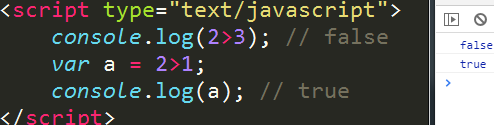 |

等于和全等于

```javascript
var a = 123;
var b = "123";
console.log(a==b); // true
console.log(a===b); // false
```

结果

| 运行结果                                  |
| ----------------------------------------- |
| 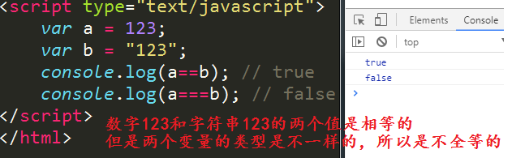 |

引号只能代表数据的类型不同，字符串在内存中存储的时候不会将引号存进去的，所以字符串在内存中的真是存储其实是不带引号的，所以a变量和b变量在内存中存的内容也一样，所以是相等的

但类型不一样，所以不全等。

### 3、赋值运算

| 符号 | 描述                     | 示例                                         |
| ---- | ------------------------ | -------------------------------------------- |
| +=   | 自己先加后，再赋值给自己 | var a = 1; a += 2; 相当于a先加2，结果赋值给a |
| -=   | 自己先减后，再赋值自己   | var a = 1; a -= 1; 相当于a先减1，结果赋值给a |
| *=   | 自己先乘后，再赋值自己   | var a = 1; a *= 3; 相当于a先乘3，结果赋值给a |
| /=   | 自己先除后，再赋值自己   | var a = 4; a /= 2; 相当于a先除2，结果赋值给a |
| %=   | 自己先余后，再赋值自己   | var a = 5; a %= 2; 相当于a先余2，结果赋值给a |

代码：

```javascript
var a = 1;
a += 2; // 将a先加2，得到结果3，再将3赋值给a
console.log(a); // 3
```

要理解上面的代码，首先理解给变量重新赋值。

```javascript
var a = 1; // 先声明，给a赋值为1
a = 3; // 给变量a重新赋值为3
console.log(a); // 3
```

然后理解自己运算后再赋值给自己（回想一下：赋值符左边是变量，右边是值）

```javascript
var a = 1;
a = a + 2; // 自己加2后再赋值给自己
console.log(a); // 3
```

练习：最后的a变量是多少？

```javascript
var a = 5;
a %= 3;
console.log(a); // 2
```

### 4、逻辑运算

逻辑运算一般用于判断多个关系运算，得出最后结果。

| 运算符         | 描述                                                    |
| -------------- | ------------------------------------------------------- |
| &&（与，并且） | 左右两边都为true，最后结果才为true，否则就是false       |
| \|\|（或者）   | 左右两边只要有一个true，最后结果就为true，否则就是false |
| ！（非，取反） | 将true处理为false，将false处理为true                    |

逻辑运算最后得出的结果也是布尔型。

例题：

模特的要求：年龄在18岁以上，30岁以下。小红今年20岁，看看小红是否满足条件。

```javascript
var age = 20; // 小红的年龄
var result = age > 18 && age < 30;
console.log(result); // true    说明小红满足条件了
```

如果小红今年31岁呢？

```javascript
var age = 20; // 小红的年龄
var result = age > 18 && age < 30;
console.log(result); // false    说明小红不满足条件
```


小红嫁人：小红想嫁给小明。小明说：除非你身高160cm以上，或者你有50000元的嫁妆。小红身高155cm，做模特攒了100000元。看看小红是否满足小明的条件。

```javascript
var height = 155; // 小红的身高
var money = 100000; // 小红的钱
var result = height > 160 || money > 50000;
console.log(result); // true 说明小红满足了小明的条件
```

如果小红只攒了30000元呢？

```javascript
var height = 155; // 小红的身高
var money = 30000; // 小红的钱
var result = height > 160 || money > 50000;
console.log(result); // false 说明小红不满足小明的条件
```


双重否定等于肯定。

年龄小于18或年龄大于30都不满足小红嫁人的条件。

```javascript
var age = 20; // 小红的年龄
var result = !(age < 18 || age > 30); // 不满足条件，再取反就满足了
console.log(result); // true   说明这种表达方式也是可以的
```

小红身高小于160cm，并且钱财小于50000元，就不满足小明的条件。

```javascript
var height = 155; // 小红的身高
var money = 100000; // 小红的钱财
var result = !(height < 160 && money < 50000); // 不满足条件再取反表达满足
console.log(result); // true 说明小红还是满足条件的
```

### 5、自增自减运算

符号：++	表示让一个数字递增1

```javascript
var a = 1;
a++
console.log(a); // 2
```

++可以放在后面，也可以放到前面，表示的意思是一样的

```javascript
var a = 1;
++a;
console.log(a); // 2
```

当递增运算碰到赋值或者输出的时候，++放在前面和后就有了区别：

放在后面

```javascript
var a = 1;
console.log(a++); // 1
console.log(a); // 2
var b = 1;
var c = b++;
console.log(c); // 1
console.log(b); // 2
```

当++放在后面的时候，就最后进行递增运算，先进行输出或者赋值。

放在前面

```javascript
var a = 1;
console.log(++a); // 2
console.log(a); // 2
var b = 1;
var c = ++b;
console.log(c); // 2
console.log(b); // 2
```

当++放在前面的时候，就先进行递增运算， 后进行输出或赋值。

符号：--	表示让一个数字递减1

使用方法和注意事项与递增一样。

<font color="red">递增递减运算需要使用变量，不能使用具体数字</font>

## 六、类型转换

### 1、强制转换

#### 1.1、转换为布尔型

```shell
语法：
	Boolean(arg)
```

- 非0数字转换为布尔型为true，0转换为布尔型为false
- 非空字符串转换为布尔型为true，空字符串转换为布尔型为false
- undefined转换为布尔型为false
- null转换为布尔型为false

#### 1.2、转换为字符串

```shell
语法：
	String(arg)
```

- true转换为字符串仍为 true，false转换为字符串仍为false
- null转换为字符串扔为null
- undefined转换为字符串仍为undefined

#### 1.3、转换为数字

```shell
语法：
	Number(str)
```

- NaN代表不是数字，但是他是数字类型（没有意义的数字）
- 非数字字符串转换后都是NaN（NaN是一个不是数字的数字类型）
- true转为数字为1，false转为数字为0
- undefined转换为数字为NaN
- null转化为数字为0

##### 1.3.1、使用函数强制转换为数字

```shell
语法：
	parseInt(arg) # 强制转换为整数
	parseFloat(arg) # 强制转换为小数
```

- 小数转换为整数只取整数，向下取整

- 首位非数字的字符串强转为整数为NaN，首位是数字的字符串强转为整数是首位的数字

- 布尔型强转为**数字**为NaN

- undefined强转为**数字**为NaN

- null强转为**数字**为NaN


补充：使用`toString()`方法强制转换为字符串，转换结果和String()函数一样

```javascript
var a = 123456;
b = true;
var c = a.toString();
var d = b.toString();
console.log(c);
console.log(typeof c);
console.log(d);
console.log(typeof d);
```

注意：这个方法不能给undefined和null使用

### 2、隐形转换

数学运算时转换为数字型，例：

```javascript
var str = "100"
var a = str%10; // 乘和除以及求余都行
var b = true + 1
console.log(a);
console.log(b);
```

比较运算时发生隐形转换，例：

- 如果两个值都是字符串，则进行比较编码值
- 如果有一个值为数字或布尔型，则转换为数字进行比较
- 字符串进行比较的时候首字符进行比较，相等再进行后面的字符比较。参照阿斯克码表。

拼接运算时发生字符串转换，例：

```javascript
var a = "1";
console.log(a+12); // 112
```

## 七、扩展-进制介绍

我们平常使用的数字是十进制的，由0~9这10个数字组成，没有一个单独的数字代表10，要表示10，需要向前进一位，所以是10进制。

计算机内部还会使用二进制、八进制和十六进制。

二进制由0和1两个数字组成，没有一个数字表示2，要表示2，需要向前进一位。

同理八进制由0~7这8个数字组成。表示8的时候要向前进一位。

十六进制由0~9和a~f这16个数字组成，使用f来表示15，表示1要向前进一位。

### 1、其他进制转10进制

转成10进制：以进制为底，幂从右往左依次为0次方，1次方，2次方…，乘以当前当前数字在10进制中的结果，所有乘积相加

例：

#### 1.1、16进制的FF转为10进制：

| 示意图                       |
| ---------------------------- |
| 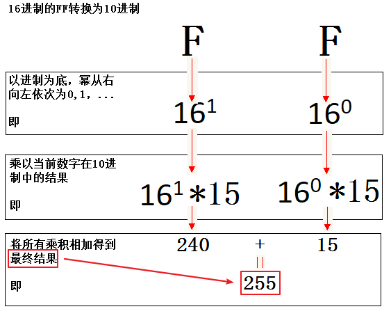 |

#### 1.2、2进制的11011转为10进制

| 示意图                                    |
| ----------------------------------------- |
| 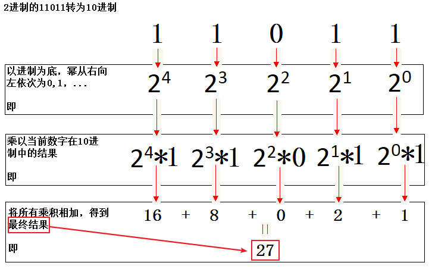 |

### 2、10进制转其他进制

#### 2.1、10进制的11转2进制

反向取余数

| 示意图                                    |
| ----------------------------------------- |
| ![15517698221