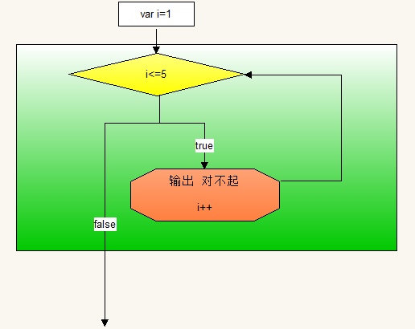

# 循环结构

引入：操场一圈是400米，在运动会的时候，2000米的跑步比赛，我们需要绕操场跑5圈，如下图：

| 示意图                                    |
| ----------------------------------------- |
|  |

这就是一个循环，那么，在这个过程中，其实我们动作只是跑一圈，剩下的过程只是在重复。从计算机的角度来想，我们可不可以设定一个程序，让他自动跑5圈呢？可以的，用咱们今天要学习的循环结构。循环结构的意义就是让代码重复执行。

## 一、while循环结构

语法：

```shell
while(条件语句){
	条件成立执行的代码
}	
```

例：对女朋友说5句我爱你

```js
// 那么既然是循环，咱们需要设定几个条件，首先是从哪开始，每完成一次要进行计数，完成多少次停止。
var i = 1;
while(i<=10){
    document.write("我爱你！");  
    i++;
}
```

while循环结构的具体流程：

| while循环的运行流程                       |
| ----------------------------------------- |
|  |

while循环需要我们在循环外就将变量声名好，在执行代码的过程中，一定要让变量进行变化，否则这个循环就会无休止的进行下去。

不会停止的循环叫做死循环，程序一直不会停止，cpu占用率越来越高，很容易造成系统崩溃。所以我们在写代码的时候一定避免写成死循环。

例：利用while循环中的变量输出数字1~5

```javascript
var i = 1;
while(while<=5){
     document.write(i);
    i++;
}
```

## 二、do while循环结构

do while 循环是while循环的变异体。循环流程相似，唯一不同的地方在于do while循环会先执行一次，不管条件是否成立，先执行一次，后面的流程和while循环一样。

## 三、for循环结构	

语法：

```shell
for(声明变量并赋初始值;条件表达式;每重复一次后变量的变化规律){
    重复执行的代码块
}
# 在语法中的声明变量并赋初始值，就是从哪里开始重复；条件表达式可以限定重复在什么时候停止（当条件不成立的时候）；通过每次重复变量的变化和条件表达式可以知道要重复多少次
```

例：输出10句“我爱你”

```javascript
for(var i = 1;i <= 10; i++){
	document.write("我爱你");
}
```

循环执行过程分析：

> 首先i=1;然后进行条件判断i<=10;条件成立，所以运行了大括号中的代码-----第一次执行
> 接下来i++;然后i=2;再进行条件判断i<=10;条件成立，所以又运行了大括号中的代码------第二次执行
> i++;i=3;条件判断i<=10;条件成立，再次运行------第三次执行
> i++;i=4;条件判断i<=10;条件成立，再次运行------第四次运行
> 。。。

```js
var arr = [10,20,30,40,50];
var sum = 0;
for (var i in arr) {
	sum += arr[i];
}
alert(sum);
```

for循环中的初始值和变化可以不放在小括号中

```js
var i = 1;
for(;i<=5;){
	document.write(i);
	i++;
}
```

执行流程是一样的，只是写法不一样。	

在循环中，变量i的变化规律可以不是递增，也可以递减，也可以不是递增1。。。总而言之，变量i的变化规律可以自定义。

例：求出1~10之间所有单数的和。

```js
var sum = 0;
for(var i = 1;i <= 10;i+=2){
	sum += i;
}
alert(sum); // 25
```

for循环的运行流程

| for循环运行流程                           |
| ----------------------------------------- |
|  |

## 四、循环中的关键字

在循环有两个关键字可以改变循环执行的流程。

continue关键字，可以跳过当前这次的循环，直接进行下一次的循环。

```javascript
for(var i = 1;i <= 5;i++){
	if(i == 3){
		continue; // 当i=3的时候，直接进行下一次的循环
	}
	document.write(i);
} 
// 最后结果是1245
```

break关键字，可终止循环，直接让整个循环结束运行。

```javascript
for(var i = 1;i <= 5;i++){
	if(i == 3){
		break; // 当i=3的时候，直接结束整个循环的运行
	}
	document.write(i);
} 
// 最后结果是12
```

运行流程如下图所示：

|  |
| ----------------------------------------- |
|  |

案例：

1. 入职薪水10K，每年涨幅5%，50年后工资多少？
2. 打印100以内 7的倍数
3. 打印100以内的奇数 

## 五、循环的嵌套

让一段重复执行代码重复执行，也就是设定一个大程序，让多个人跑5圈。

```js
for(var i=1;i<=5;i++){
    for(var j=1;j<=5;j++){
        document.write("第" + i + "个人跑第" + j + "圈<br>");
    }
}
```

## 六、debug调试工具的使用

> 断点调试是指自己在程序的某一行设置一个断点，调试时，程序运行到这一行就会停住，然后你可以一步一步往下调试，调试过程中可以看各个变量当前的值，出错的话，调试到出错的代码行即显示错误，停下。

调试步骤：

```js
浏览器中按F12-->sources-->在network选项中找到需要调试的文件打开-->在程序代码的某一行设置断点
```

调试中的相关操作

| 调试示意图                                |
| ----------------------------------------- |
|  |

练习调试 : 

```js
// 3以内的数相加
var age = 10;
if (age >=18 ) {
	console.log('大');
} else {
	console.log('小');
}
```

案例：

1. 打印100–200之间所有能被3或者7整除的数

2. 计算100的阶乘

3. 求100-999之间的水仙花数。abc =a^3+b^3+c^3

4. 使用双层循环输出8*8的表格

5. 将1~100的数字放到10*10的表格中

   