# HTTP和第三方模块

## 一、http

### 1、介绍

为什么要学习http？因为前端和后台进行交互的时候，使用的就是这个协议。

HTTP协议，叫超文本传输协议(Hypertext transfer protocol)。是一个规则，规定了浏览器和服务器之间通信的规则。

http的传输行为，共分为三个步骤：

1. 建立连接
2. 进行传输
3. 断开连接

无论是哪个步骤，都是由客户端主动开始的，这样比较安全，也符合用户的心理预期。否则，服务器主动给客户端发消息会让人不寒而粟，例如：我们打开浏览器什么也没做，淘宝就主动给用户发消息开始支付。

### 2、三次握手

客户端和服务器传输数据之前，必须先建立连接才可以，建立连接的过程，叫做三次握手。

建立连接，类似于我们平常在聊天的时候，说正事之前，会先说：'在吗'，对方回答：'在'。然后才说正事。

建立连接，就是为后续的传输做准备，所以建立连接的过程中，客户端和服务器都需要确保自己和对方都可以收发消息。

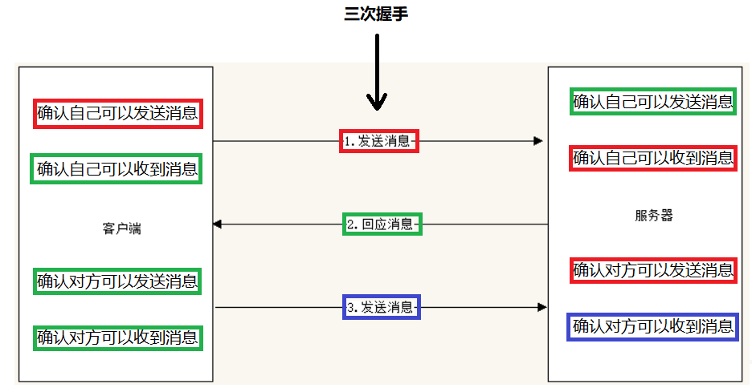 

第一次握手：客户端主动给服务器发送消息，请求连接（其中会携带一些数据作为这次连接的识别符）。

第二次握手：服务器收到消息后，给客户端回应一个消息，表示已经收到要连接的请求（其中会携带两部分数据，一部分是第一次的识别符，另一部分是这次响应的识别符）。

第三次握手：客户端收到服务器的消息后，给服务器再次发送消息，表示收到服务器响应的消息（其中要携带响应的识别符）。

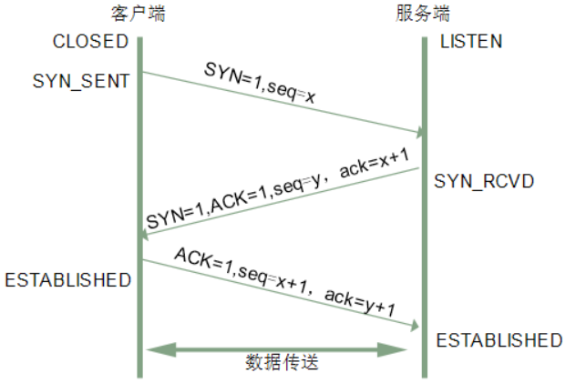 


### 3、传输

当连接建立后，客户端就可以跟服务器进行传输了，整个传输过程分为两个阶段：

- 客户端给服务器发起请求
- 服务器给客户端做出响应

#### 3.1、请求

http协议中规定，客户端发起请求的请求信息，要遵循**请求报文**的格式，请求报文规定请求信息分为4个部分：

- 请求行
- 请求头
- 请求空行
- 请求主体

我们可以在浏览器的network（网络）中看到当前页面的请求：

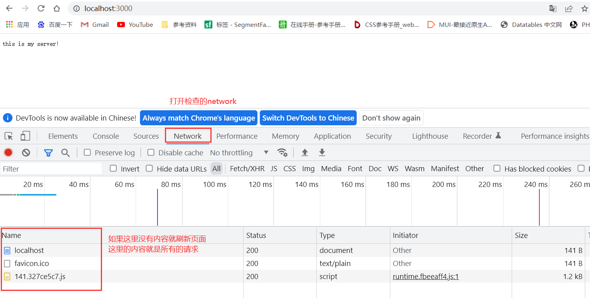 

点击请求名称，可以打开请求，看到这次请求的详细信息：

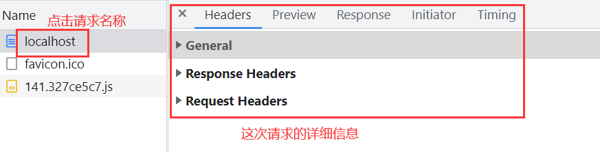 

其中Request就是这次请求的所有请求信息：

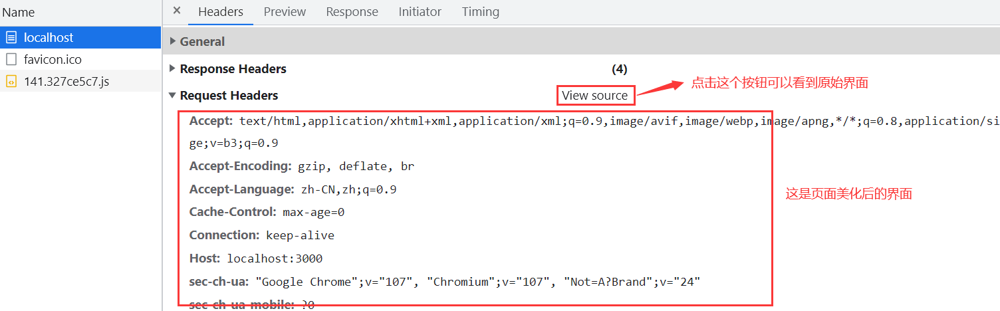 

##### 3.1.1、请求行

请求信息原始界面中的第一行就是请求行

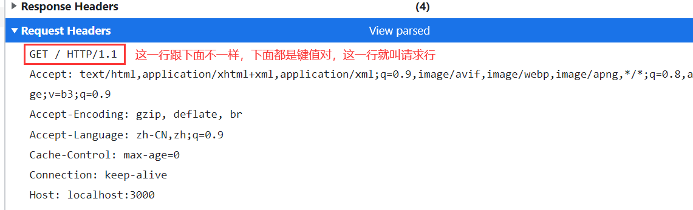 

请求行中包含三个内容：

- 请求方式

  客户端对服务器发起不同的请求方式，服务器有不同的识别规则和回应。最常见的请求方式：

  - get：参数会暴露在地址栏；数据有大小限制，最大4kb；数据只能进行url编码；get请求会被记录在历史记录；可能会被浏览器缓存。语义用于获取服务器端数据。常见的get请求包括：
    - 在地址栏输入数据敲回车
    - 点击a标签跳转
    - html中引入图片、引入css、引入js、引入html地址
    - form默认的提交方式，也可以设置get提交方式
  - post：参数不会暴露在地址栏；数据大小没有限制；数据可以不经过url编码，可以是其他格式数据；post不会被记录在历史记录；不会被浏览器缓存。语义用于给服务器提交数据。常见的post请求：form标签的post提交方式
  - put：语义用于请求服务器修改数据
  - delete：语义用于请求服务器删除数据

- 请求路径

  请求的完整url组成如下图：

  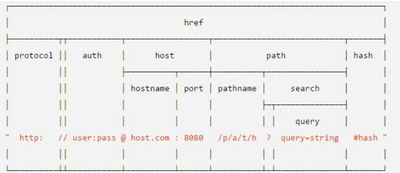 

  这里所指的请求路径是上图中的`path+hash`部分。

  注意：请求路径永远是`/`开头。

  

- 请求的协议以及版本

  http请求的协议为http。不同的网络通信，请求协议也是不同的，常见的协议有：

  http/https/ssh/ftp/sftp/mongodb/mysql/。。。

  demo：nodejs服务器获取请求方式和请求路径

  ```js
  req.method
  req.url
  ```

  

##### 3.1.2、请求头 

请求头代表发起请求的信息中，一些键值对，可以说明这次请求的一些信息：

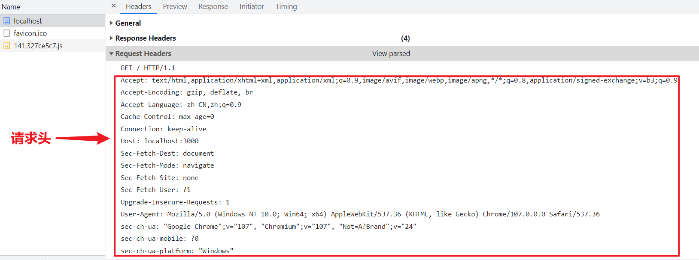 

具体含义：

```shell
Accept: text/html,application/xhtml+xml,application/xml;q=0.9,image/avif,image/webp,image/apng,*/*;q=0.8,application/signed-exchange;v=b3;q=0.9 # 告诉服务器当前客户端可以接收的文档的类型。其实这里包含了*/*，就表示什么都可以接收；
Accept-Encoding: gzip, deflate, br # 客户端支持的编码
Accept-Language: zh-CN,zh;q=0.9 # 当前客户端可以支持的语言，在浏览器的工具->选项中可以得到相关信息
Cache-Control: max-age=0 # 缓存机制
Connection: keep-alive # 客户端支持的连接方式，保持一段连接，默认为3000ms
Host: localhost:3000 # 请求的主机名为localhost：8080，url中的host部分，包含hostname和port
Sec-Fetch-Dest: document # 告诉服务器 浏览器如何使用获取的数据
Sec-Fetch-Mode: navigate # 表示这是一个浏览器的页面切换请求
Sec-Fetch-Site: none # 表示一个请求发起者的来源与目标资源来源之间的关系，因为直接敲回车打开的，所以没有目标来源
Sec-Fetch-User: ?1 # 表示导航请求由用户激活触发(鼠标点击/键盘)
Upgrade-Insecure-Requests: 1 # 表示这个请求不安全，可以跟服务器协商升级为https协议
User-Agent: Mozilla/5.0 (Windows NT 10.0; Win64; x64) AppleWebKit/537.36 (KHTML, like Gecko) Chrome/107.0.0.0 Safari/537.36 # 告诉网站服务器，访问者是通过什么工具来请求的,其中包含系统和客户端信息
sec-ch-ua: "Google Chrome";v="107", "Chromium";v="107", "Not=A?Brand";v="24" # user-agent的补充，怕user-agent泄漏客户端信息而做出的补充
sec-ch-ua-mobile: ?0 # 是否是移动设备
sec-ch-ua-platform: "Windows" # 系统
```

demo：nodejs服务器获取请求头

```js
req.headers
```

##### 3.1.3、请求空行

请求头和请求主体之间要有一个空行。好截取内容。

##### 3.1.4、请求主体

客户端想服务器发起请求的时候可以给服务器携带一些参数，叫做请求主体。

不同的请求方式携带参数的方式也不同的。

- get请求的请求主体，是带在url中的，例：

  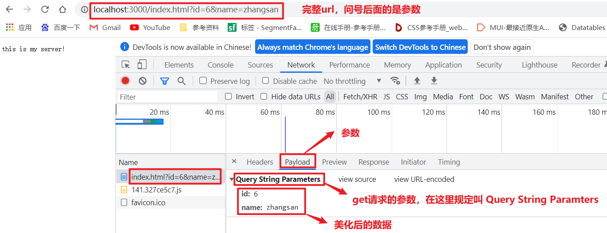

  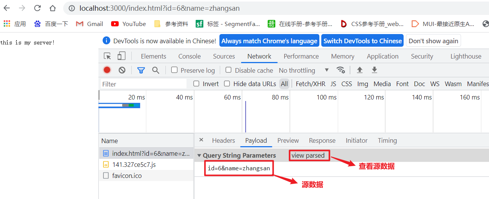 

  demo：nodejs服务器获取get请求参数 

  ```js
  const url = require('url')
  const http = require('http')
  http.createServer((req, res) => {
      if(req.url.startsWith('/index.html') && req.method === 'GET'){
      	// 获取get请求参数
    		url.parse(req.url).query
      }
      
  }).listen(端口号)
  ```

  

- post请求的请求主体，不在url中显示，必须打开浏览器的payload中才能看到：

  后端代码：

  ```js
  require('http').createServer((req, res) => {
      if(req.url === '/') {
          res.end(require('fs').readFileSync('./form.html'))
      } else if(req.url === '/postSubmit') {
          res.end('this is post submit!')
      } else {
          res.end()
      }
  }).listen(3000)
  ```

  前端页面：

  ```html
  <!DOCTYPE html>
  <html lang="en">
  <head>
      <meta charset="UTF-8">
      <title>表单页面</title>
  </head>
  <body>
      <form method='post' action="/postSubmit">
          账号：<input type="text" name="account" />
          <br>
          密码：<input type="password" name="password" />
          <br>
          <input type="submit" />
      </form>
  </body>
  </html>
  ```

  post请求主体图示：

   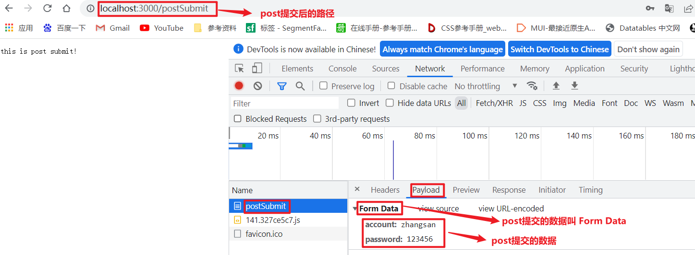   

  这个数据也是经过美化的，原始数据如下：

  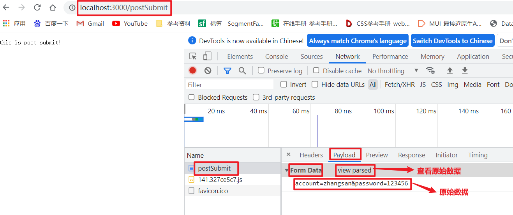  

  demo：nodejs服务器获取post请求参数 

  ```js
  require('http').createServer((req, res) => {
      if(req.method === 'POST' && req.url === '/postSubmit') {
       	// 获取post参数
          var str = ''
          req.on('data', chunk => {
              str += chunk.toString()        
          })
          req.on('end', () => {
              console.log(str)
          })
      }
  }).listen(端口号)
  ```

  > req有on方法用于绑定事件，数据的传送是分成每一小部分传递的
  >
  > data事件，当有一小部分数据传递过来时触发，其中参数chunk代表这一小部分数据，默认格式为buffer
  >
  > end事件，当数据传送完毕后触发
  >
  > 整个过程是异步的

#### 3.2、响应

http规定，服务器接收请求后，要对客户端进行相应。http规定响应信息必须遵循**响应报文**的规则。响应报文规则包含3部分内容：

- 响应行
- 响应头
- 响应主体

响应信息如下图：

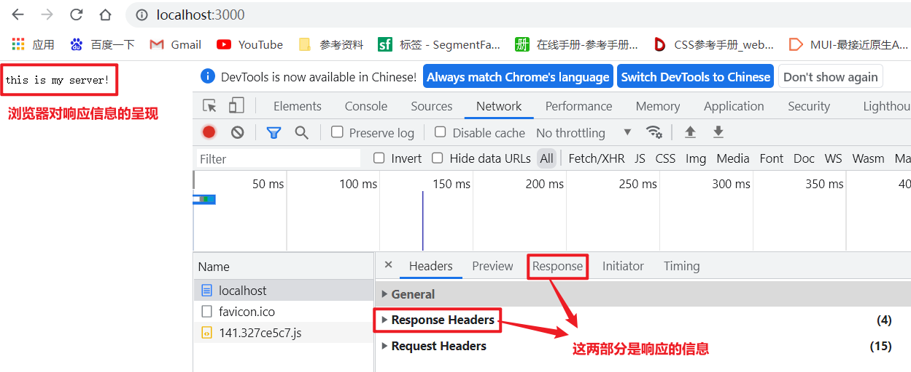  

##### 3.2.1、响应行

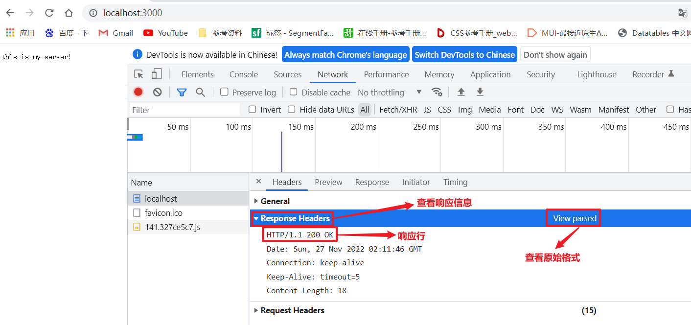 

响应行包含3部分：

- 协议和版本

- 状态码

  状态码是http协议规定用来描述这次请求，服务器给出响应的状态，http请求共有5中响应状态：

  - 1xx：代表请求已被接受，需要继续处理
  - 2xx：代表请求已成功被服务器接收、理解、并接受
  - 3xx：代表需要客户端采取进一步的操作才能完成请求
  - 4xx：代表了客户端看起来可能发生了错误，妨碍了服务器的处理
  - 5xx：代表了服务器在处理请求的过程中有错误或者异常状态发生

- 状态描述

  每个状态码，都有一个描述对应，更详细的说明这个状态码的含义。

  参考网址：https://developer.mozilla.org/zh-CN/docs/Web/HTTP/Status

  附件：[http标准响应状态码](../2-教学资料/http标准状态码.html)

  demo：nodejs服务器设置响应状态码

  ```js
  res.writeHead(状态码, 状态描述)
  ```

  

##### 3.2.2、响应头

响应头是一些键值对来描述响应信息：

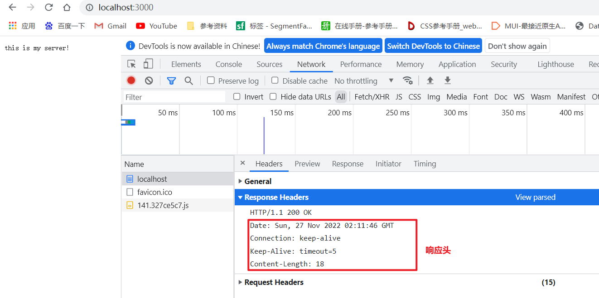  


```shell
Date: Sun, 27 Nov 2022 02:11:46 GMT # 响应时间
Connection: keep-alive # http1.1版本可以允许客户端和服务器持续连接，下次请求可免除重复断开请求的过程，节省连接效率
Keep-Alive: timeout=5 # 表示这个持续的连接可以保持5秒
Content-Length: 18 # 服务端给客户端的数据长度
```

demo：nodejs服务器设置避免中文乱码的响应头

```js
res.setHeader('Content-Type', 'text/html;charset=utf8')
```

##### 3.2.3、响应主体

响应主体是服务器给客户端响应的主要数据：

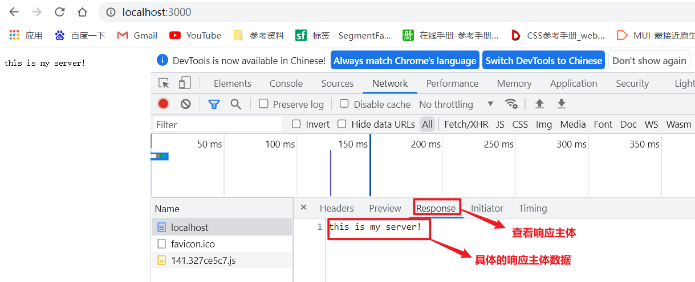 

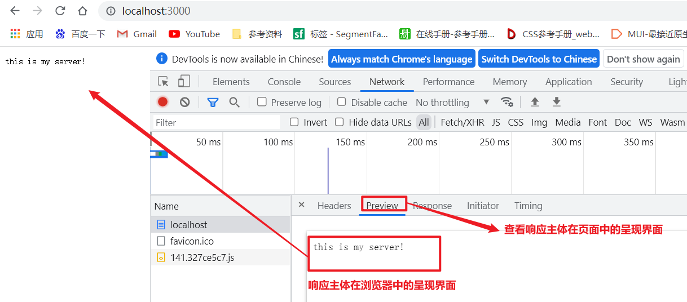 

### 4、四次挥手

当客户端和服务器结束这次请求后，需要断开连接。断开连接也叫作四次挥手。具体过程如下：

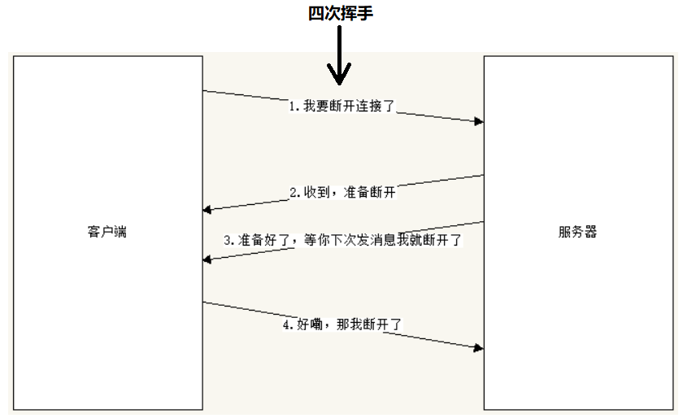 

第一次挥手，客户端主动对服务器发起断开请求（携带这次请求的标识符）

第二次挥手，服务器回应收到这次请求，并做断开准备（携带对这次请求的标识符，表示对这个请求做回应）

第三次挥手，服务器做好断开准备后，通知客户端，可以断开了，当客户端断开后，服务器将销毁这次请求的信息，不再回应（携带对这次请求的标识符，表示对这个请求做回应）

第四次挥手，客户端告诉服务器已经断开（携带回应的标识符）

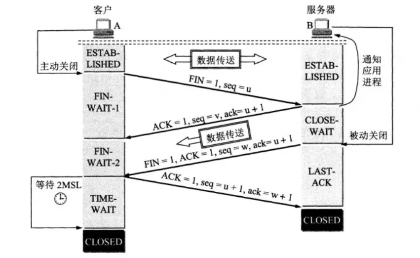 

## 二、第三方模块下载

nodejs自带的模块无法满足业务需求时，我们需要自定义模块来完成功能，对于某一类型的功能，为了能重复使用，自定义的模块是需要封装的。假设已经有人封装好这样的模块了，我们只需要下载下来导入就能使用。这样由别人封装好的模块，叫第三方模块。

第三方模块，需要下载下来。传统方式的下载，需要打开官网，找到下载页，点击下载按钮。

在nodejs开发中，第三方模块，不需要打开官网，只需要执行命令即可，比起传统下载方式方便n倍。

nodejs内置了下载功能，转为下载第三方模块而设计 - npm。

### 1、npm

npm是nodejs自带的转为下载模块的功能，不用下载安装，有安装好nodejs后，直接就可以运行。

```shell
npm -v # 查看npm版本
```

npm下载模块：

```shell
npm install/i 包名
npm i 包名 包名 ... # 下载多个模块
npm i 包名@版本号 # 最新版本可以使用 @latest
```

> 下载命令执行之后，会生成node_modules文件夹，将下载好的包放在这个文件夹中。这个文件夹的特点：文件比较琐碎，层级嵌套较深，依赖关系较多......
>
> 下载命令执行后，还会生成package.json文件，记录所有在当前文件夹下下载的模块和版本。
>
> 还会生成package-lock.json，该文件也会记录模块，但没什么作用，可忽略。

查看模块的所有版本：

```shell
npm view 模块 versions
```

查看所有安装好的依赖包：

```shell
npm list # 简写 npm ls
```

卸载：

```shell
npm uninstall/un 包名
```

npm切换镜像源：

```shell
npm config set registry 镜像源地址 # 切换命令
npm config get registry # 查看镜像源地址
npm --registry https://registry.npm.taobao.org install node-red-contrib-composer@latest # 临时切换使用
```

一个项目的开发，通常会使用很多模块，这写模块会保存在node_modules文件夹。项目开发完成后，需要上线，也就是要将本地项目上传到远程服务器，本质上就是将本地文件复制到远程服务器一份。

node_modules文件夹由于自身的特点：文件比较琐碎，层级嵌套较深，会导致在复制的时候，可能会丢失部分文件，这样项目上传到远程服务器也就无法运行了。

为了避免这个问题发生，我们在上传项目的时候，就会忽略上传node_modules，仅上传package.json文件，然后在package.json文件所在文件夹执行命令：`npm i`，就可以将package.json中记录好的模块，都重新下载安装成功。

可见package.json文件的重要性，但是我们在执行下载命令，有时候是不会自动生成package.json文件的，此时就需要我们在做项目之前，强行生成package.json文件：

npm初始化命令（强制生成package.json文件）：

```shell
npm init # 手动输入整个包的信息
npm init -y # 自动生成整个包的信息 - 不能在中文文件夹下使用
```

下载好的模块如果不知道怎么使用，上网查询：https://www.npmjs.com/。所有使用npm能下载好的模块，都在这个网站上能找到。

### 2、yarn

yarn跟npm一样，是一个第三方包的管理工具，比起npm，yarn工具更加高效快捷。

通常在下载一些较为复杂的包的时候，多个包之间总会有一些依赖关系，npm下载的时候，使用续发形式下载，也就是同步下载;而yarn是并发形式下载，也就是异步下载，效率更高。

例如，我们需要模块A，但是模块A需要依赖模块B，模块B又需要依赖模块C，npm下载的时候是按照顺序：C--->B--->A；yarn下载的时候是并发下载：A和B和C同时下载。

yarn不是一个自带工具，需要手动下载安装，下载地址：https://yarn.bootcss.com/docs/install/#windows-stable 。傻瓜式安装即可。

检测安装：

```shell
yarn --version
```

初始化：

```shell
yarn init
yarn init -y
```

下载安装包：

```shell
yarn add 包
yarn add 包@版本号
```

卸载包：

```shell
yarn remove 包
```

安装全部依赖：

```shell
yarn 
yarn install
```

## 三、常用工具

### 1、nodemon

我们在使用nodejs的http模块开发服务器的时候，每开发一些代码，就需要停止服务器，然后重启生效，过程很繁琐。

nodemon可以让项目文件发生变化的时候自动重新启动。

下载安装：

```shell
npm i nodemon -g
```

工具下载好后，是需要在计算机任何一个目录下都可以使用的，所以要在下载命令后添加`-g`的参数，意为全局安装，计算机任何一个目录下都可以使用。

使用：

```shell
nodemon 待执行的js文件
```

当文件发生改变后，会自动重新启动，无需手动停止启动。

### 2、http-server

http-server工具可以快速将一个文件夹作为服务器根目录，创建一个用于显示页面的服务器。

下载安装：

```shell
npm i http-server -g
```

使用：在目标文件夹下执行命令

```shell
http-server
```

例：

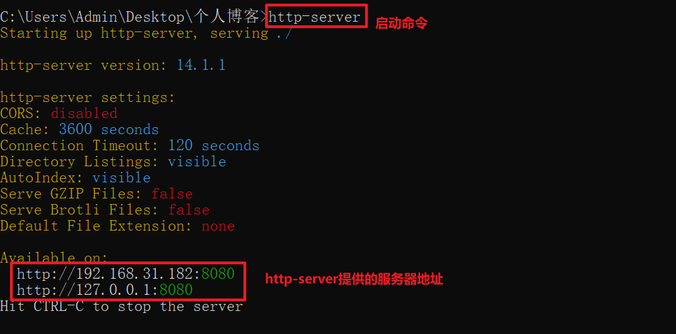 

浏览器打开页面：

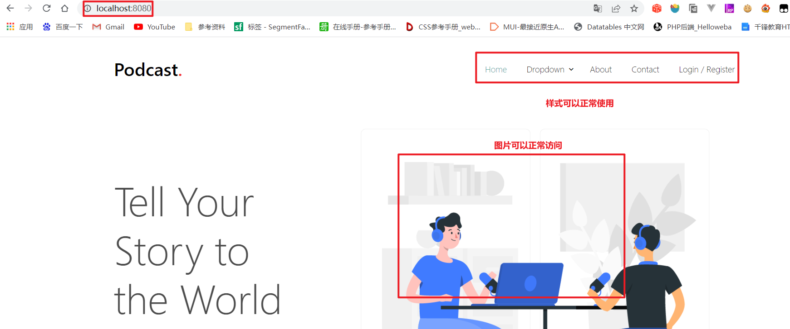 

