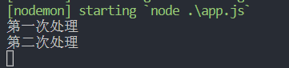

# express

## 一、express介绍

### 1.简介

利用nodejs中http创建的服务器，在处理请求的时候，只能放在一个回调函数中，且判断也相对较为复杂。为了方便基于nodejs服务器的开发，有人对nodejs服务器的创建、请求处理等操作，进行了封装，比较常见的就是express。

可以说，express就是基于nodejs封装的一个框架，专业用于提供方便易操作的web服务器。

Express 的本质：就是一个 npm 上的第三方包，提供了快速创建 Web 服务器的便捷方法。

使用Express开发框架可以非常方便、快速的创建Web网站的服务器或API接口的服务器

官网：https://www.expressjs.com.cn/

### 2、初体验

下载安装：

```shell
npm init -y
npm i express -S
```

使用步骤：

1. 导入包
2. 创建服务器
3. 处理请求
4. 监听端口

```js
const express = require('express')
const app = express()
app.get(路由,回调) // get是请求方法
app.listen(端口号)
```

## 二、路由

含义：请求路径跟响应内容之间的对应关系。简单的说，这次路由：什么方式来的，请求路径是什么，响应什么。

### 1、路由方法

语法：

```js
app.路由方法(路径, 处理函数)
```

路由方法包括：

- get：请求方式是get的，且请求路径为参数1的，可以处理，只能处理一次

  ```js
  const express = require('express')
  const app = express()
  app.listen(3000)
  
  app.get('/', (req, res) => {
      res.end('heihei')
  })
  
  app.get('/', (req, res) => {
      res.end('haha')
  })
  ```

  页面只显示heihei

- post：请求方式是post的，且请求路径为参数1的，可以处理，只能处理一次

  准备表单页面

  ```html
  <!DOCTYPE html>
  <html lang="en">
  <head>
      <meta charset="UTF-8">
      <title>表单页面</title>
  </head>
  <body>
      <form method='post' action="/postSubmit">
          账号：<input type="text" name="account" />
          <br>
          密码：<input type="password" name="password" />
          <br>
          <input type="submit" />
      </form>
  </body>
  </html>
  ```

  js：

  ```js
  const express = require('express')
  const app = express()
  app.listen(3000)
  
  app.get('/', (req, res) => {
      res.end(require('fs').readFileSync('./form.html'))
  })
  
  app.post('/postSubmit', (req, res) => {
      res.end('haha')
  })
  ```

  get请求比较方便通过浏览器就可以完成，但是post请求和后续的put请求以及delete请求，无法使用浏览器发送了，所以我们需要专门用于发送请求的软件（postman）或插件（postwomen）来调试请求。

  postman软件：

    

  postwomen插件：

  将我们需要使用的插件文件的后缀 .crx 改为 .zip ，然后解压

   

  打开谷歌浏览器，点击右上角 ... 三个点图标，选择 更多工具 ，打开 扩展程序 。然后将开发者模式打开。

   

  点击 加载已解压的扩展 ，选择解压后的文件夹

   

  将右下角的图标打开。 

  如果显示错误，也不要紧，正常是可以使用的。

  使用方式：

   

   

  

- put：请求方式是put的，且请求路径为参数1的，可以处理，只能处理一次

  ```js
  const express = require('express')
  const app = express()
  app.listen(3000)
  
  app.put('/', (req, res) => {
      res.end('this is put request"s response')
  })
  ```

   

- delete：请求方式是delete的，且请求路径为参数1的，可以处理，只能处理一次

  ```js
  const express = require('express')
  const app = express()
  app.listen(3000)
  app.delete('/', (req, res) => {
      res.end('this is delete request"s response')
  })
  ```

   

- all：任意请求方法都可以处理，且请求路径为参数1的，都可以处理，只能处理一次

  ```js
  const express = require('express')
  const app = express()
  app.listen(3000)
  
  app.all('/', (req, res) => {
      res.end('this is all request"s response')
  })
  ```

  处理get请求：

   

  处理post请求：

  ```html
  <!DOCTYPE html>
  <html lang="en">
  <head>
      <meta charset="UTF-8">
      <title>表单页面</title>
  </head>
  <body>
      <form method='post' action="/">
          账号：<input type="text" name="account" />
          <br>
          密码：<input type="password" name="password" />
          <br>
          <input type="submit" />
      </form>
  </body>
  </html>
  ```

   

  处理put请求：

   

  处理delete请求：

   

- use：任意请求方法都可以处理，且请求路径以参数1开头的，都可以处理，可以处理多次。可以省略参数1，表示任意路径的请求都会被处理。

  处理路径开头的请求：

  ```js
  const express = require('express')
  const app = express()
  app.listen(3000)
  
  app.use('/a', (req, res) => {
      res.end('use method handle request that the path startsWith "/a"')
  })
  ```

   

  任意方法请求的处理：

   

  处理多次：

  ```js
  const express = require('express')
  const app = express()
  app.listen(3000)
  
  app.use('/', (req, res, next) => {
      console.log('第一次处理');
      next()
  })
  
  app.get('/', (req, res) => {
      console.log('第二次处理');
      res.end('use method handle many requests')
  })
  ```

  处理请求的函数中，可以添加第三个参数next，调用next，表示这次处理结束后，会继续向下执行，再次匹配到后，会再次处理：

   

  处理任意路径的请求：

  ```js
  const express = require('express')
  const app = express()
  app.listen(3000)
  
  app.use((req, res, next) => {
      console.log('总会被这里处理');
      next()
  })
  
  app.get('/', (req, res) => {
      console.log('路径为"/"的请求');
      res.end('use method handle any method request')
  })
  
  app.post('/abc', (req, res) => {
      console.log('路径为"/abc"的请求');
      res.end('use method handle any method request')
  })
  ```

   

   

    

   

### 2、路径匹配

#### 2.1、完全匹配

请求的路径必须跟定义好的路径完全相等，才会处理：

```js
// 匹配根路径的请求
app.get('/', function (req, res) {
  res.send('root');
});

// 匹配 /about 路径的请求
app.get('/about', function (req, res) {
  res.send('about');
});

// 匹配 /random.text 路径的请求
app.get('/random.text', function (req, res) {
  res.send('random.text');
});
```

#### 2.2、不完全匹配

请求路径能符合定义好的路径的规则即可处理：

```js
// 匹配 acd 和 abcd
app.get('/ab?cd', function(req, res) {
  res.send('ab?cd');
});

// 匹配 abcd、abbcd、abbbcd等
app.get('/ab+cd', function(req, res) {
  res.send('ab+cd');
});

// 匹配 abcd、abxcd、abRABDOMcd、ab123cd等
app.get('/ab*cd', function(req, res) {
  res.send('ab*cd');
});

// 匹配 /abe 和 /abcde
app.get('/ab(cd)?e', function(req, res) {
 res.send('ab(cd)?e');
});
```

#### 2.3、正则匹配

请求的路径能符合定义好的正则规则就可以处理：

```js
// 匹配任何路径中含有 a 的路径：
app.get(/a/, function(req, res) {
  res.send('/a/');
});

// 匹配 butterfly、dragonfly，不匹配 butterflyman、dragonfly man等
app.get(/.*fly$/, function(req, res) {
  res.send('/.*fly$/');
});
```

#### 2.4、restful风格匹配

在实际项目开发中，为了能让路径中的参数写起来更简便，且更具有迷惑性，通常会采用动态路由方式进行传参。

动态路由传参，其实就是将参数当做路径一部分，不再使用`?`隔开。

也就是说，传递参数的路径，其实有两种写法，例如：

传统方式：http://localhost:3000/index.html?id=6&name=zhangsan

动态路由：http://localhost:3000/index.html/6/zhangsan

```js
app.get('/about/:id', function (req, res) {
  res.send('about');
});
```

表示在请求的时候，`/about`后面必须加一个id才可以匹配成功去处理。

若要表示id可选项的话，使用`?`：

```js
app.get('/about/:id?', function (req, res) {
  res.send('about');
});
```

#### 2.5、获取get请求参数

传统方式的路径参数获取，使用req.query。

例如：请求地址 - http://localhost:3000/index.html?id=6&name=zhangsan

```js
const express = require('express')
const app = express()
app.listen(3000)

app.get('/index.html', (req, res) => {
    console.log(req.query);
    res.end('get method"s params')
})
```

 

动态路由传参的获取，使用req.params。

例如：请求地址 - http://localhost:3000/index.html/6/zhangsan

```js
const express = require('express')
const app = express()
app.listen(3000)

app.get('/index.html/:id/:name', (req, res) => {
    console.log(req.params);
    res.end('get method"s params')
})

```

  

### 3、路由处理

处理某个请求路径的时候，可以使用一个函数，也可以使用多个函数，也可以使用多个函数组成的数组，也可以将数组和函数组合起来使用。

#### 3.1、单函数处理

```js
app.get('/home', function (req, res) {
  res.end('home');
});
```

#### 3.2、多函数处理

```js
app.get('/home', function (req, res, next) {
  console.log('这处理完之后会交给下一个函数处理');
  next();
}, function (req, res) {
  res.end('home');
});
```

多个函数处理同一个请求的时候，多个函数共用同一个req，例：

```js
app.get('/home', function (req, res, next) {
    req.num = 6
  	console.log('这处理完之后会交给下一个函数处理');
  	next();
}, function (req, res) {
    console.log(req.num)
  	res.end('home');
});
```

#### 3.3、函数数组处理

```js
var cb0 = function (req, res, next) {
  console.log('CB0')
  next()
}

var cb1 = function (req, res, next) {
  console.log('CB1')
  next()
}

var cb2 = function (req, res) {
  res.end('home')
}

app.get('/home', [cb0, cb1, cb2])
```

#### 3.4、函数和数组混合处理

```js
var cb0 = function (req, res, next) {
  console.log('CB0')
  next()
}

var cb1 = function (req, res, next) {
  console.log('CB1')
  next()
}

app.get('/home', [cb0, cb1], function (req, res, next) {
  console.log('CB')
  next()
}, function (req, res){
  res.end('home')
})
```

#### 3.5、路由对象处理路由

路由处理的时候，可以使用路由对象来代替函数处理，只是路由对象自己也要像app一样写具体的处理函数：

```js
const express = require('express')
const app = express()
const router = express.Router() // 创建路由变量
app.get(路由,router)
router.get(路由, (req, res) => {})
app.listen(端口号)
```

#### 3.6、路由对象配合use处理路由

use配合路由对象处理路由的时候，会将自己匹配到的路径截取掉，给router就剩下截取后剩下的路径：

```js
const express = require('express')
const app = express()
// 只要是/home开头的路由都可以匹配到，并都交给router来处理
app.use('/home', router)

const router = expresss.Router()
router.get(完整路径截取掉/home后剩下的路径, (req, res) => {})

app.listen(12345)
```

例：

完整的请求路径为：/user/add

```js
app.use('/user', router)

router.get('/add', (req, res) => {
    res.end('/user/add')
})
```

将这次路由交给router去处理，router在进行具体处理的时候，路径不能在前面加use中的路径了，因为被use截取了。

### 4、路由模块化

利用use方法和router的配合，我们可以将某一部分的请求单独封装到一个文件中，例如，所有有关用户的请求，都会是/user开头的请求路径，将所有有关用户请求的路由处理，单独封装在一个文件中。

app.js

```js
const express = require('express')
const app = express()
const userRouter = require('./user')
app.use('/user', userRouter)
const goodsRouter = require('./goods')
app.use('/goods', goodsRouter)
app.listen(12345)
```

user.js

```js
const express = require('express')
const router = express.Router()
router.get('/add', (req, res) => {
    res.end('/user/add')
})
router.get('/edit', (req, res) => {
    res.end('/user/edit')
})
module.exports = router
```

goods.js

```js
const express = require('express')
const router = express.Router()
router.get('/add', (req, res) => {
    res.end('/goods/add')
})
router.get('/edit', (req, res) => {
    res.end('/goods/edit')
})
module.exports = router
```

## 三、响应方法

```js
res.end() // 终结响应处理流程。
res.redirect() // 重定向请求。
res.send() // 发送各种类型的响应。
res.sendFile() // 以八位字节流的形式发送文件。
res.sendStatus() // 设置响应状态代码，并将其以字符串形式作为响应体的一部分发送。
res.json()
```

## 四、中间件

### 1、概念

正常的请求，是服务器接收到请求后，匹配请求路径，然后对应的处理函数去处理，如下图：

 

中间件是匹配路径后，在最终处理函数响应之前，先交给其他函数去处理一次，然后再交给最终的处理函数去响应，中间处理的函数就叫做中间件，如下图：

 

### 2、中间件的分类

根据中间件的开发者不同，可以将中间件分为3类：

1. 内置中间件 - express系统自带
2. 自定义中间件 - 自己开发的中间件
3. 第三方中间件 - 有人开发好了，我们下载下来使用

根据中间件的使用情况，可以将中间件分为2类：

1. 应用级别中间件 - 由app调用的
   - 全局应用级别中间件 - **当前路由后面**的所有请求都会经过这个中间件
   - 局部应用级别中间件 - 只在**当前路由中**有效
2. 路由级别中间件 - 由router调用的
   - 全局路由级别中间件
   - 局部路由级别中间件

### 3、中间件语法

全局中间件的使用语法：

应用级别使用：

```js
app.use(中间件函数)
```

路由级别使用：

```js
router.use(中间件函数)
```

上面两种使用都是全局的，表示他们后面的路由处理都要经过这个中间件。

局部中间件的使用：

应用级别

```js
app.路由方法(路径, 中间件, 回调函数)
```

路由级别：

```js
router.路由方法(路径, 中间件, 回调函数)
```

### 4、内置中间件

express提供了好用的内置中间件。

1. 静态资源服务器中间件：express.static() - 必须是全局中间件

   ```js
   app.use(express.static('托管目录地址')) 
   ```

   此时我们可以通过`/静态资源名称`就能访问到指定文件夹中的静态资源

   ```js
   app.use('前缀',express.static('托管目录地址'))
   ```

   为了方便区分静态资源路径和其他请求的处理，可以指定请求静态资源的时候，使用指定的路径前缀，此时我们可以通过`/前缀/静态资源名称`来访问到指定文件夹的静态资源。

2. 获取post请求传递的请求主体：express.urlencoded() - 可全局可局部

   ```js
   app.use(express.urlencoded({extended: false}))
   ```

   此后的post请求都可以通过`req.body`获取到post请求传递的请求主体了。

   这个中间件有版本要求：express >= 4.16.0

### 5、自定义中间件

自定义中间件，本质上是一个函数，相当有我们使用多个函数处理请求的时候，中间经历的函数。

自定义中间件：

```js
function myMiddleware(req,res,next){	
    //. 自己需要定义的逻辑流程
	// 中间件最后一定要执行此函数，否则程序无法向下执行下去
	next()
}
```

使用：

```js
app.use(myMiddleware) // 全局应用级别中间件
app.get(路径, myMiddleware, (req, res) => {}) // 局部应用级别中间件

router.use(myMiddleware) // 全局路由级别中间件
router.post(路径, myMiddleware, (req, res) => {}) // 局部路由级别中间件
```


### 6、第三方中间件

很多功能都可以通过别人写好的插件来实现，例如：body-parser

body-parser这个中间件的功能是用来获取post请求传递的请求主体的。使用步骤如下：

1. 下载

   ```shell
   npm i body-parser
   ```

   

2. 导入

   ```js
   const bodyParser = require('body-parser')
   ```

   

3. 使用中间件

   ```js
   app.use(bodyParser.urlencoded({extended: false}))
   ```

   

### 7、异常处理中间件

当我们在某次请求处理的时候，发生了错误，会给客户端抛出报错，这个报错会让用户有不好的体验感，也容易将自己服务器所在的文件目录结构暴露。为了能解决以上两个缺点，我们可以在发生错误的时候，给用户以比较友好的自定义内容响应。这就是异常处理中间件：

```js
app.get('/',(req,res) => {
    throw new Error('服务器内部发生了致命的错误！')
    res.send('Welcome to my homepage')
})

app.use((err,req,res,next) => {
    console.log('发生了错误：' + err.message) // err.message代表具体的错误信息
    res.send('Error！' + err.message)
})
```

手动抛出错误语法：

```js
throw new Error('自定义错误信息') 
```

代码运行会报错。

案例：要求指定一个路径（可能路由对应的文件不存在），读取文件内容，输出给用户

注意事项：错误级别中间件要想发挥其作用，必须写在所有的路由的后面。

### 8、404中间件

当用户发起了一个服务器并没有处理的请求，此时会在页面中输出404，会给用户造成不好的体验感，为了能避免这个问题发生，我们可以在当访问到没有处理的请求的时候，给用户响应自定义内容。

```js
// 该中间件也需要写在最后（与异常中间件的顺序无所谓，只要确保其在所有的路由方法之后就可）
app.use((req,res,next) => {
    // 输出404错误
    res.status(404).send('<h1>404</h1>')
    // 先指定404状态码，然后再输出错误信息
})
```

注意事项：404中间件，必须在所有路由之后，至于与异常中间件的顺序，谁先谁后无所谓。

模板页面：页面：https://404.life/

作业：登录页 + 注册页 + 成功或失败的提示页 + 首页 + 文件存储用户信息

## 明日面试题

1. http和https的区别

   > 1.`HTTP` 的URL 以http:// 开头，而HTTPS 的URL 以https:// 开头
   >
   > 2.`HTTP` 是不安全的，而 HTTPS 是安全的
   >
   > 3.`HTTP` 标准端口是80 ，而 HTTPS 的标准端口是443
   >
   > 4.`在OSI` 网络模型中，HTTP工作于应用层，而HTTPS 的安全传输机制工作在传输层
   >
   > 5.`HTTP` 无法加密，而HTTPS 对传输的数据进行加密
   >
   > 6.`HTTP`无需证书，而HTTPS 需要CA机构wosign的颁发的SSL证书

2. this关键字的理解

   > 1. 一般情况下this是指向window的，如果是严格模式他就指向undefined
   > 2. 我们可以通过call apply bind来修改this的指向
   > 3. new出来的实例对象this是指向这个实例的
   > 4. 在隐士的状态下是指向他调用者