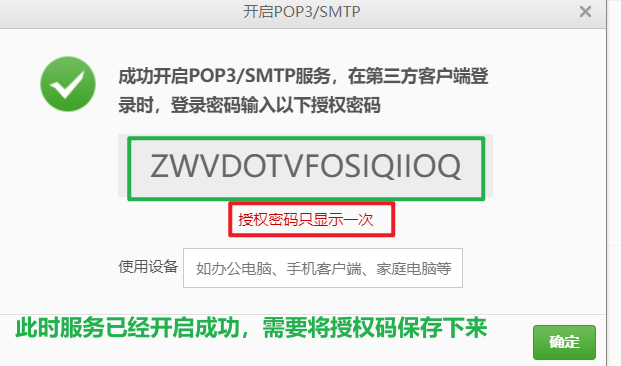

# 常用模块和模板引擎

## 一、常用模块

### 1、加密

```shell
npm i bcryptjs -S
```

使用：

```js
var bcrypt = require('bcryptjs');
// 加密
密文 = bcryptjs.hashSync(明文[,数字]); // 数字，将使用指定的轮数生成盐并将其使用。推荐 10
// 验证
bcryptjs.compareSync(明文,密文); // 通过返回true，失败返回false
```


### 2、文件上传

项目中免不了要进行文件的上传，例如头像的上传。在nodejs中上传文件需要依赖multer第三方模块，使用步骤如下：

下载：

```shell
npm i multer -S
```

导入：

```js
const multer  = require('multer')
```

配置上传选项：

```js
const storage = multer.diskStorage({
    destination: function (req, file, cb) {
        // file中包含了上传的文件的所有信息
        cb(null, 自定义文件上传后所在的目录)
    },
    filename: function (req, file, cb) {
        cb(null, 自定义文件名称)
    }
})
```

根据配置项创建中间件：

```js
const upload = multer({ storage: storage })
```

文件上传通常会使用局部中间件：

使用：

```js
app.post('/profile', upload.single('上传表单name值'), function (req, res, next) {
  // req.file 是上传的文件信息 - 可以从中获取到文件名称、路径、后缀 - 拼接路径存入mongodb
})
```

上传一个文件的时候，使用single方法，上传多个文件的时候，有`array`和`fields`方法可以使用。

### 3、邮件发送

借助某个邮箱账号，开启能给对应的邮箱服务器发送请求的功能。

以163为例：

登录自己的163邮箱

点击设置：

 

选择开启服务：

 

扫码发送短信

 

服务开启成功，需要保存授权码

 


```shell
npm install nodemailer --save
```

使用：

```js
const nodemailer = require('nodemailer')

// 1. 创建发送器
const transport = nodemailer.createTransport({
  // 需要你发送放邮箱的 stmp 域名和密码和一些其他信息
  // 需要你去复制一下, 找到下载的 nodemailer 第三方包
  //   nodemailer -> lib -> well-known -> services.json
  "host": "smtp.qq.com",
  "port": 465,
  "secure": true,
  // 证明你的身份
  auth: {
    // 发送方邮箱的用户名
    user: '邮箱号',
    // stmp 允许密码
    pass: '授权码'
  }
})


// 2. 发送邮件
transport.sendMail({
  // 从那个邮箱发送
  from: '发送方邮箱',
  // 发送到哪里, 可以写一个字符串, 书写邮箱, 也可以写一个数组, 写好多邮箱
  to: ['接收方邮箱', '接收方邮箱'],
  // 邮件标题
  subject: '标题',
  // 本次邮件的 超文本 内容
  html: `
    您好: 本次的验证码是
    <h1 style="color: red;"> 2345 </h1>
    请在 3 分钟内使用


    <br>
    ------------------------<br>
    前途无限股份有限公司
  `,
  // 本次邮件的 文本 内容
  // text: ''
}, function (err, data) {
  if (err) return console.log(err)

  console.log('邮件发送成功')
  console.log(data)
})
```

## 二、模板引擎

### 1、开发模式介绍

我们在项目开发过程中，通常有两种开发模式：

1. 传统开发模式

   传统开发模式指前端代码和后端代码混合在一起进行开发，例如：

   ```js
   app.get('/', (req, res) => {
       res.send(`
   		<body>
   			<div>${username}</div>
   		</body>
   	`)
   })
   ```

   通常是在服务器代码中夹杂前端代码，在nodejs环境中，因为语法都是js语法，看懂会相对容易一些，但在实际项目开发中，服务器可以用java/c++等语言，看起来就比较混乱了，开发成本相对较高，开发者必须既懂后端又懂前端，才可以糅合在一起进行开发；开发效率较低，因为前端后端都是同一个开发者在进行，无法将前端和后端同时进行。但传统开发模式的渲染性能较高，因为从客户端访问到显示内容，只会渲染一次。

2. 前后端分离开发模式

   前后端分离开发模式，是前端和后端同时开发，当后端没有开发好，前端又需要后端提供数据支持的时候，前端可以先做假数据，等后端开发好以后，再将假数据改为后端的数据即可。开发效率比较高，但是渲染性能较低，因为正常的页面一打开会渲染一次，当后端数据请求回来以后，需要再次更新渲染一次。

   

### 2、介绍

所谓模板引擎，其实就是一种单独的文件类型，可以在这个文件中解析后端代码和逻辑代码以及html的展示性代码，即在一个文件中，既可以有后端逻辑代码，又可以有前端页面代码，这种文件就叫做模板。

为了便于维护，且**使后端逻辑能够比较好的融入前端的HTML代码中，同时便于维护**，很多第三方开发者就开发出了各种Nodejs模板引擎，其中比较常用的就是Jade/Pug、Ejs和art-template 等模板引擎。

目的：**使后端逻辑能够比较好的融入前端的HTML代码中，减少渲染次数，同时便于维护**

因为模板引擎不是单纯的html代码，也不是单纯的逻辑代码，所以在浏览器展示页面的时候，需要将模板引擎中的代码**<font color="red">编译</font>**成浏览器能识别的html代码，才可以展示。

模板引擎渲染速度测试：

 

从图中我们可以很直观的选择art-template，因为他的编译速度最快。

网址：

- http://aui.github.io/art-template/zh-cn/
- http://aui.github.io/art-template/express/

### 3、使用

下载安装：

```shell
# 安装
npm i -S art-template express-art-template
```

配置：

```js
// 模板引擎配置
// 指定art-template模板，并指定模块后缀为.html
app.engine('html', require('express-art-template'));
// 指定模板视图路径
app.set('views', path.join(__dirname, 'views'));
// 省略指定模块文件后缀后名称（可选，在渲染时可以省略的后缀）
app.set('view engine', 'html')	
```

使用方式：

- 使用art-template展示一个视图（html文件）

  - 将视图放入views目录下（允许分目录）

  - 编写代码，展示视图的方式是`res.render(文件的路径)

    ```js
    app.get('/', (req, res) => {
        // 输出视图
        res.render(模板名称)
    })
    ```

    

- 控制层返回数据（将后端指定的数据传递到视图中）

  ```js
  app.get(uri,(req,res)=>{
  	res.render(模板,{
  		username: '张三',
          age: 25,
          gender: '女',
          hobby: ['篮球','乒乓球','羽毛球']
  	})
  })
  ```


### 4、模板语法

变量输出：

```html
<!-- 标准语法 -->
{{ username }}
<!-- 或者 -->
<!-- 原始语法 -->
<%= username %>
```

在默认情况下，上述输出方式不能将带有HTML标记的内容让浏览器解析，只会原样输出。如果需要将HTML标记让浏览器，则请使用下述方式输出数据：

```html
<!-- 标准语法 -->
{{@ username}}
<!-- 原始语法 -->
<%- username %>
```

条件判断：

```html
{{if 条件}} … {{else if 条件}} … {{/if}}
<%if (条件)else if (条件)%>
```

循环：

```html
<!-- 支持 数组和对象的迭代  默认元素变量为$value 下标为$index  可以自定义 {{each target val key}}-->
{{each 循环的数据}}
    {{$index}} {{$value}}
{{/each}}

{{each 循环的数据 val key}}
    {{key}} {{val}}
{{/each}}

<% for(var i = 0; i < target.length; i++){ %>
    <%= i %> <%= target[i] %>
<% } %>
```

> 如果使用默认的键、值的名字（index,value）则其前面的`$`一定要写！一定要写！！！
>
> 如果使用的自定义的键、值的名字，则前面的`$`一定不能写！！不能写！！

模板导入：

```html
{{include '被引入文件路径'}}
<% include('被引入文件路径') %>
```

> - **如果是当前路径下的一定要写`./`，不写则从磁盘根下开始寻找**
> - 被include的文件后缀名默认为`.art`，如果不是请勿省略
> - 在子模板中**最好**不要有html、head和body标签（否则容易出现样式错误的问题）

模板继承：

被继承的模板：

```html
<html>
<head>
    <meta charset="utf-8">
    <!-- 类似于vue的插槽 -->
    <title>{{block 'title'}}My Site{{/block}}</title>
</head>
<body>
	<!-- block占位符 content此占位的名称 -->
    {{block 'content'}}{{/block}}
</body>
</html>
```

需要继承的子模板：

```html
<!--extend 继承 -->
{{extend './layout.html'}}
{{block 'title'}}首页{{/block}}
{{block 'content'}}
	<p>This is just an awesome page.</p>
{{/block}}
```

bootcss在线构建器：https://www.bootcss.com/p/layoutit/


### json-server

有时候我们做一些较小的项目，数据量较小。为了提高开发效率，无需专门写接口，利用一个json文件存储数据，此时可以使用json-server工具，快速的启动一个用于提供数据增删改查的服务器。

下载安装：

```shell
npm i json-server -g
```

使用：

```shell
json-server json文件路径
```

例：

 

可以使用postman或postwomen进行增删改查。


