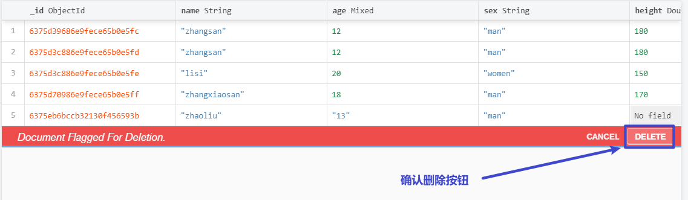

# mongodb

## 一、介绍

### 1、数据库介绍

网站中所使用的数据错综复杂，各种数据之间又互相勾连，例如电商网站的商品分类、推荐商品、猜你喜欢商品、商品详情、购物车数据等等。为了方便管理，会将网站中所使用的所有数据集中在一起进行管理，方便对数据进行各种条件下的查询，实现性能的优化。

存储数据，可以选择使用文件存储，但文件的读写效率偏低，随着科技发展，到目前为止，大家公认的效率和性能较高的存储系统，就是数据库了。

数据库的数据也是存储在磁盘中的，只是有其独有的存储规律和管理办法，从计算机较角度来看，其实就是一个专业管理磁盘中数据的软件。

### 2、数据库分类

数据库技术发展到目前为止，可以分为两大类：

1. 关系型数据库

   通常数据以表格形式存储，表格和表格之间可以设定一定的关联。

    

   左表中的籍贯跟右表中的编号产生关联，此时，右表中的数据不允许删除，否则左表中的人员将失去籍贯，左表中不允许添加右表中不存在的籍贯，否则无法识别人员籍贯。

   代表数据库：Mysql、SqlServer、Oracle。。。

2. 非关系型数据库

   非关系型数据库，通常以键值对形式存储数据，数据和数据之间没有一定的关联。

   代表数据库：MongoDB、Redis。。。


### 3、mongodb介绍

Mongodb是非关系数据库中的一种，采取json格式对数据进行管理，对js是非常友好的。

mongodb数据体系如下图：

    

体系介绍：

mongodb由多个"库"组成，每个库由多个"集合"或"表"组成，每个集合由多个"文档"或"数据"组成。 

## 二、下载安装

下载地址：https://www.mongodb.com/download-center/community

注意：有些高版本mongodb不支持win7，所以win7需要安装稍低点的版本。

两种下载方式：

1. .msi - 傻瓜式安装就好

    

   下载到本机后，双击进行安装mongodb数据库，一路下一步（next）即可（如果需要更改安装路径请自行选择）：

    

    

    

   测试命令：

   ```shell
   mongo
   ```

   

    

   不能用，就需要添加环境变量。

2. .zip - 需要手动配置

   - 解压，然后将文件夹放到目标位置，在这个文件夹中新建：
     - data文件夹，data文件夹中新建db文件夹
     - logs文件夹，logs文件夹中新建mongodb.log文件

   - 设置环境变量，将解压后的文件夹的bin文件夹设置为环境变量

   - 在命令行执行命令：（推荐使用管理员身份运行）

     ```shell
     mongod.exe --logpath mongodb.log文件路径 --logappend --dbpath db文件夹路径 --directoryperdb --bind_ip 0.0.0.0 --serviceName MongoDB --install
     
     net start MongoDB
     ```

     可以新建一个后缀为bat的文件，将上面的命令复制到文件中，将其中的logpath和dbpath修改，然后以管理员身份运行即可。在计算机的管理中，找到服务，在服务中找到mongodb，如果找到了，就说明能用了。

     测试：

     ```shell
     mongo
     ```

      

     如果在双击这个文件的时候，报错说丢失 XX140.dll文件，提示，这是缺少了运行库文件，安装运行库文件。


## 三、命令行操作

### 1、基本操作

- 打开cmd在命令行中输入命令：

```shell
mongo
```


- 退出mongoDB使用`exit`

```shell
exit
```


- 查看所有的数据库列表：

```shell
show dbs
```

  

此命令不显示空库

- 创建数据库或切换数据库：

```shell
use 数据库名
```

 

当数据库存在，则切换到这个数据库，表示后面的操作是针对这个库的，如果数据库不存在，则创建这个库。

- 查看库中所有表

  ```shell
  show tables
  # 或
  show collections
  ```

     

数据库中的表不需要创建，只要添加数据就能将表自动创建好。

- 给数据库中创建一个members的集合，并向集合中添加文档（行）数据：

```shell
db.表名/集合名.insert(JSON格式数据)
```

 

数据是对象，则添加一条，数据是数组，则是多条。

 

- 删除表

```shell
db.表名/集合名.drop()
```

 


- 删除库

> 需要进入要删除的库，然后再去执行这个命令

```shell
# 删除的是当前的库
db.dropDatabase()
```

 

### 2、数据操作

#### 2.1、增

```shell
# 添加文档数据
db.表名/集合名.insertMany([{}, {}, {}])
```

添加一条数据就是数组中一个对象，添加多条数据就是数组中多个对象

 

#### 2.2、查

- 查询所有的数据

```shell
db.表名/集合名.find();    # 获取全部（推荐）
```


> 关于`_id`是由系统自动生成，代表这个数据的唯一标识，类似于人的身份证，确保数据的唯一性，永远不会重复。
>


- 带条件查询

```shell
db.表名/集合名.find({条件})
```

具体条件：

某个键 等于 某个值

```js
{键: 值}
```

 

某个键 大于 某个值

```js
{键: {$gt: 值}}
```

 

某个键 大于等于 某个值

```js
{键: {$gte: 值}}
```

 

某个键 小于 某个值

```js
{键: {$lt: 值}}
```

 

某个键 小于等于 某个值

```js
{键: {$lte: 值}}
```

 

某个键 不等于 某个值

```js
{键: {$ne: 值}}
```

 

某个键 在 某个数组中

```js
{键: {$in: [值, 值]}}
```

 

并且的条件：

```js
{条件, 条件}
```

 

或者的条件：

```js
{$or: [{条件}, {条件}]}
```

 

以正则表达式作为条件查询：

```js
{键: 正则表达式}
```

 

空条件

```js
{}
```

 

空条件表示查询所有

- 字段显示控制

  在查询结果中，希望某些键值对不显示或强制显示

  ```js
  db.表名.find(条件, {键: 0/1})
  ```

  参数说明：

  > 0表示这个键不显示，1表示这个键要强制显示

   

- 统计

  统计查询结果的数据的数量

  ```js
  db.表名.find(条件).count()
  ```

   

  统计所有数据的数据量：

  ```js
  db.表名.count()
  ```

   

- 排序

  ```js
  db.表名.find(条件).sort({键: 1/-1})
  ```

  参数说明：

  > 1表示升序，-1表示降序

   

- 分页

  数据很多，但是要分页显示，根据当前是第几页来查询需要的数据

  ```js
  db.表名.find().skip(数字).limit(数字);
  ```

  参数说明：

  > skip中的数据，表示跳过前面多少条数据，开始查询
  >
  > limit中的数据，表示要查询多少 条数据

   


#### 2.3、改

根据指定条件，将数据中的某一部分修改为指定的新数据

```js
db.表名.updateOne({条件}, {$set: {新的数据}})
```

 

让指定条件的数据中的某个数字自增或自减：

```js
db.表名.updateOne({条件}, {$inc: {键: 自增多少的数字}})
```

 

将自增的数字，作为负数就可以减少。

#### 2.4、删

删除集合中已存在的文档数据： 

```shell
db.表名.deleteOne({条件})
```

 

## 四、可视化操作

在实际项目开发中无论是代码还是数据库都是追求开发效率的，在命令行中操作数据效率会比较低，所以在实际工作中，我们对mongodb的操作是通过一个可视化软件来操作数据库的。

mongodb的管理软件有很多，例如：compass、robot、...

官方推荐使用compass，所以我们安装compass。

compass下载成功后，只需要双击安装即可，不需要做其他操作，会自动安装。

安装完成后会自动启动，这个软件是用来管理数据库的，并不能代表数据库，所以这个软件首先需要连接mongodb：

 

连接成功后，就可以看到数据库中所有的库了：

 

点击其中一个库，可以进行看到这个库中所有的表：

 

点击表，可以看到这个表中所有的数据：

 

数据默认以列表格式显示，可以切换成表格形式显示：

 

数据操作：

增：

 

 

修改：

 

 

删除：

 

 


## 五、代码操作

### 1、操作步骤

在代码中操作mongodb，需要依赖第三方模块mongoose，仅限于nodejs环境中使用。

官网：http://www.mongoosejs.net/docs/index.html

- 下载安装：

  ```js
  npm i mongoose
  ```

  

- 导入模块：

  ```js
  const mongoose = require('mongoose')
  ```

  

- 连接数据库

  代码是代码，数据库属于软件，所有我们在代码中需要连接数据库：

  ```js
  mongoose.connect('mongodb://localhost:27017/数据库名')
  ```

  

- 创建schema

  由于mongodb属于非关系型数据库，对数据的类型和表头没有约束，但在实际引用中，一个表中的数据类型和表头都是相同的，所以mongoose内部封装了schema，用于设置和约束数据的类型和表头。

  ```js
  const UserSchema = new mongoose.Schema({
      // 字段名/域名称
      name: {
          // 指字域类型
          type: String,
          // 必填字段
          required: true,
          // 字段最小长度  minlength 用于字符串类型
          minlength: 2,
      },
      age: {
          type: Number,
          // 默认值
          default: 10,
          // 字段最小值 min用于数字类型
          min: 1,
      },
      pwd: String,
      email: String,
      // 定义此字段为 字符串数组类型
      hobbies: [String],
  });
  ```

  对表头数据的约数规则参考：http://www.mongoosejs.net/docs/guide.html

- 创建model

  对数据的操作都是通过model进行的

  ```js
  const Model = mongoose.model('User', UserSchema, 'users')
  ```

  参数说明：

  > 参数1：模型名称，如果没有参数3，会将模型名的复数表示作为表的名称
  >
  > 参数2：给当前表创建好的schema
  >
  > 参数3：表名，可选

- 数据操作

  - 增

    ```js
    model.insertMany({key:value}, (err, docs) => {
        err为错误信息
        docs为插入的结果信息
    })
    ```

    

  - 删

    ```js
    model.deleteOne({条件}, (err, docs) => {
        err为错误信息
        docs为删除的结果信息
    })
    ```

    

  - 改

    ```js
    model.updateOne({条件},{$set:{key:value}}, (err, docs) => {
        err为错误信息
        docs为修改的结果信息
    })
    ```

    

  - 查

    ```js
    model.find({条件},{可选字段返回:0/1},{skip:0,limit:10}, (err, docs) => {
        err为错误信息
        docs为查询的结果信息 - 返回数组
    })
    
    Model.findOne({条件},{可选字段返回:0/1}, (err, docs) => {
        err为错误信息
        docs为查询的结果信息 - 返回对象
    })
    ```

    

  - 

作业：使用mongodb完成登录注册

## 明日面试题

1. 字符串API
2. 0.1+0.2等于03吗？为什么？