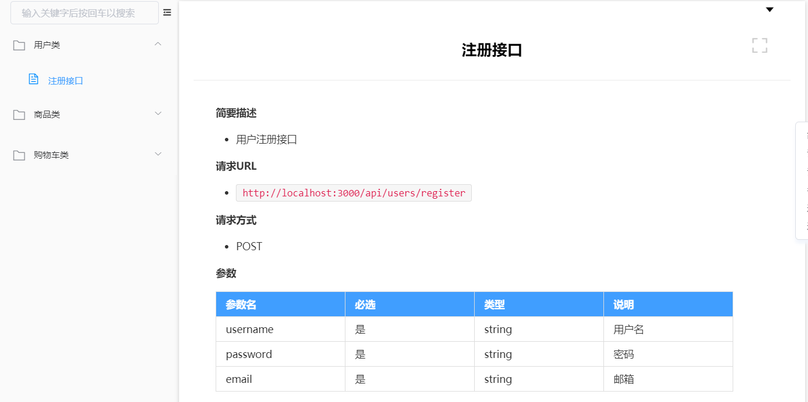

# 接口项目

## 一、项目介绍

工作中，常用开发模式为前后端分离开发模式。后端提供页面所需要的数据，前端使用特殊技术对后端服务器发起请求，获取后端提供的数据，然后渲染到页面上。

后端为前端提供数据的这套项目代码，俗称后端接口。

## 二、接口规划

我们要实现的接口项目，其中包含：注册接口、登录接口、商品列表、商品详情、购物车、用户信息查询和修改。

有了这些接口后，我们可以实现一个比较简单的电商网站。

其中有关商品类的接口，可以规划的更加详细：商品列表分页显示、商品详情展示

购物车接口同上：添加购物车、购物车数据展示、购物车商品数量修改、购物车商品删除、清空购物车

用户接口：用户信息展示、用户信息修改、用户密码修改

项目演示：


开发环境：windows

开发工具：vscode

代码管理工具：git/gitee

项目类型：点餐系统后端接口

技术：nodejs + express + mongoose + mongodb + bcrytpsjs + jsonwebtoken + moment.js ....

## 三、接口实现

### 1、准备工作

#### 1.1、模块下载安装

先进行npm初始化，强制生成package.json

```shell
npm init
```


接口中，需要用到服务器（express）、获取post数据（body-parser）、密码加密（bcryptjs）、数据库（mongoose）、文件上传（multer）

```shell
npm i express body-parser bcryptjs mongoose
```

#### 1.2、搭建服务器

```js
// 导入模块
const express = require('express')

// 创建服务器
const app = express()

// 设置端口号
app.listen(3000)
```

#### 1.3、中间件

```js
// 获取post数据
app.use(bodyParser.urlencoded({extended: false}))
// 404中间件
app.use((req, res, next) => {
    // 给用户响应一个信息
    res.json({
        errorCode: 404,
        msg: '路径不合法！'
    })
})
// 异常处理中间件
app.use((err, req, res, next) => {
    // 输出错误信息
    console.log(err)
    // 给用户响应一个信息
    res.json({
        errorCode: 10,
        msg: '请求错误，刷新重试！'
    })
})
```


### 2、日志记录

所有请求都需要记录请求的状态，方便统计请求来源、请求时间、是否成功、错误信息等，所以日志记录功能应该作为一个全局中间件，后期中间件可能不止这一个，将所有中间件封装一个文件夹中分模块管理，新建文件夹middleware，在其中创建中间件文件writelog.js

日志中记录的数据：请求时间、请求方式、客户端ip、请求路径、请求状态（默认ok）

时间格式：`年-月-日 时:分:秒` 时间格式化可以利用第三方模块`moment`

```js
const moment = require('moment')
const {EOL} = require('os')
const fs = require('fs')
// 导出函数
module.export = (req, res, next) => {
    // 准备记录的数据
    let time = moment().format('YYYY-MM-DD HH:mm:ss')
    let ip = req.ip
    let method = req.method
    let uri = req.url
    let status = 'ok'
    let content = time + ' ' + ip + ' ' + method + ' ' + uri + ' ' + status
    // 规划日志文件存储路径：logs/api.log
    const logPath = path.join(__dirname, 'logs', 'api.log')
    // 判断日志文件是否存在
    if(fs.existsSync(logPath)) {
        // 读取日志文件
    	let log = fs.readFileSync(logPath, 'utf-8')
        fs.appendFileSync(logPath,  EOL + content)
    } else {
        fs.writeFileSync(logPath, content)
    }
    next()
}
```

app中使用中间件：

```js
const writelog = require('./middleware/writelog')
app.use(writeLog)
```

如果这次请求有错误，或者是没有处理到的404路径，则需要在404中间件和异常处理中间件中，将默认的请求状态`ok`改为错误信息，两个中间件中使用的功能是一样的，所以创建工具库目录（utils）封装项目所需工具库

在utils中新建writeErrLog.js文件

```js
module.exports = err => {
    // 读取
    let log = fs.readFileSync('./logs/api.log', 'utf-8')
    log = log.replace(/ok$/, err)
    fs.writeFile(require('path').join(__dirname, '../', 'logs', 'api.log'), log, () => {})
}
```

app中使用工具库

```js
const writeErrLog = require('./utils/writeErrLog')
app.use((req, res, next) => {
    // 将错误信息存起来 - 日志
    writeErrLog('404-路径不合法')
    // 给用户响应一个信息
    res.json({
        errorCode: 404,
        msg: '路径不合法！'
    })
})
app.use((err, req, res, next) => {
    // 将错误信息存起来 - 日志
    writeErrLog(err)
    
    // 给用户响应一个信息
    res.json({
        errorCode: 10,
        msg: '请求错误，刷新重试！'
    })
})
```


### 3、注册接口

app使用中间件处理同类型的请求：

```js
const userRouter = require('./routes/users')
app.use('/api/users', userRouter)
```

新建routes文件夹，用于处理模块化的路由请求

routes中新建users.js处理用户类型的请求：

```js
const {register} = require('../controller/users')
router.post('/api/register', register)
```

将处理请求的函数都放在一个文件夹controller中进行模块化管理

controller下新建users.js

```js
const userModel = require('../db/user')
const bcryptjs = require('bcryptjs')
module.exports = {
    // 用户注册
    register: (req, res) => {
        // 获取post数据
    }
}
```

将所有数据库操作放在db文件夹下进行模块化管理

db下新建users.js管理用户表

```js
const mongoose = require('./mongoose')

const schema = new mongoose.Schema({
    username: {
        type: String,
        minlength: 4,
        maxlength: 10
    },
    password: String,
    tel: Number,
    email: String,
    nickname: String,
    avatar: String
})

const model = mongoose.model('user', schema)

module.exports = model
```

所有表的操作，只需要连接一次数据库，所以将连接数据库的操作封装在同级的mongoose文件中：

```js
const mongoose = require('mongoose')
mongoose.connect('mongodb://localhost:27017/shop')

module.exports = mongoose
```

每次响应信息，都是固定的格式，所以对响应内容进行封装，utils文件夹下封装response.js文件

```js
module.export = (res, errorCode, msg, data = null) => {
    res.json({
        errorCode,
        msg,
        data
    })
}
```


### 4、登录接口

在routes的users.js中处理：

```js
router.post('/login', login)
```

在controller的users.js中处理：

```js
login: (req, res) => {
        // 接收post请求的数据
        let {username, password} = req.body
        // 验证数据
        if(!username || !password) {
            respond(res, 2, '数据不能为空')
            return
        }
        // 用username做条件查询数据中这个用户的数据
        userModel.findOne({username}, (err, docs) => {
            if(err) {
                respond(res, 2, '登录失败')
                return
            }
            // 是否查到数据
            if(!docs) {
                respond(res, 3, '账号或密码错误')
                return
            }
            // 查询到数据了 - 验证密码
            if(bcryptjs.compareSync(password, docs.password)) {
                respond(res, 0, '登录成功')
                return
            }
            respond(res, 3, '账号或密码错误')
        })
    }
```


当接口项目写好后，有些接口功能必须是用户登录后才能进行，后端为了避免前端未登录就进行请求，避免前端伪造自己登录过，所以需要在登录成功后给前端颁发令牌。后续前端每次请求都需要将令牌带回来，后端进行校验令牌是否是自己所颁发，且令牌是否在有效期内，从而间接知道这次请求是否是后端允许的、合法的请求。

令牌的颁发和校验依赖第三模块`jsonwebtoken` 简称jwt。使用原理是对一个对象配合自定义的随机字符串加密得到一个不好识别的字符串。

在controller中添加令牌的处理：

```js
login: (req, res) => {
        // 接收post请求的数据
        let {username, password} = req.body
        // 验证数据
        if(!username || !password) {
            respond(res, 2, '数据不能为空')
            return
        }
        // 用username做条件查询数据中这个用户的数据
        userModel.findOne({username}, (err, docs) => {
            if(err) {
                respond(res, 2, '登录失败')
                return
            }
            // 是否查到数据
            if(!docs) {
                respond(res, 3, '账号或密码错误')
                return
            }
            // 查询到数据了 - 验证密码
            if(bcryptjs.compareSync(password, docs.password)) {
                // 令牌制造语法
                // jwt.sign(对象, 字符串)
                /*
                    令牌就类似于将一些简单的东西，通过特殊的算法进行排列组合，得出一个别人不容易看破的 - 加密
                */
                let token = jwt.sign({
                    username,
                    startTime: +new Date(),
                    expires: 7200*1000
                }, 'ASDFWETRRTYU$#^5kjfaklsdhfkjashf')
                respond(res, 0, '登录成功', {
                    // 颁发令牌 - jsonwebtoken - jwt
                    token: token
                })
                return
            }
            respond(res, 3, '账号或密码错误')
        })
    }
```

### 5、令牌验证中间件

封装验证令牌的中间件，在middleware下新建checkToken.js

```js
module.exports = (req, res, next) => {
    if(!req.headers.authorization) {
        respond(res, 3, '缺少令牌！')
        return
    }
    let tokenData
    try{
        tokenData = jwt.verify(req.headers.authorization, 'ASDFWETRRTYU$#^5kjfaklsdhfkjashf');
    } catch(err) {
        writeErrLog(err)
        respond(res, 4, '令牌是错误的')
        return
    }
    if(tokenData.startTime + tokenData.expires < +new Date()) {
        respond(res, 5, '令牌过期了')
        return
    }
    next()
}
```

在routes中对所有需要验证令牌的请求添加验证令牌的中间件

```js
// 处理注册请求
router.post('/register', register)

// 处理登录请求
router.post('/login', login)

// 处理用户信息获取的请求
router.get('/getUsers/:_id', checkToken, getUsers)

// 修改用户信息
router.put('/editUser/:_id', checkToken, editUser)
```

### 6、获取商品

在app.js中处理商品类型的请求：

```js
app.use('/api/goods', goodsRouter)
```

在routes中新建goods.js：

```js
// 导入
const express = require('express')
const {getAllGoods} = require('../controller/goods')
// 创建路由对象
const router = express.Router()

// 处理获取商品信息的请求
router.get('/getAllGoods/:page/:size', getAllGoods)

// 导出路由对象
module.exports = router
```

在controller中新建goods.js

```js
const respond = require('../utils/respond')
const goodsModel = require('../db/goods')
module.exports = {
    // 查询所有商品数据
    getAllGoods: (req, res) => {
        // 获取get请求的参数
        let {page, size} = req.params
        // 判断当前页不能为空
        if(!page) {
            respond(res, 1, '缺少当前页参数')
            return
        }
        // 根据page当前页获取当前页的数据
        goodsModel.find({}, {__v: 0}, {skip: (page-1)*size, limit: size}, (err, docs) => {
            if(err) {
                respond(res, 2, '获取商品数据失败')
                return
            }
            if(!docs.length) {
                respond(res, 2, '获取商品数据失败')
                return
            }
            respond(res, 0, '获取商品数据成功', docs)
        })
    }
}
```

在db下新建goods.js处理数据库model：

```js
const mongoose = require('./connection')

// 创建schema
const schema = new mongoose.Schema({
    title: String,
    img_big_logo: String,
    img_small_logo: String,
    price: String,
    current_price: String,
    stock: Number,
    is_sale: Boolean,
    is_hot: Boolean,
    goods_introduce: String
})

// 创建model
module.exports = mongoose.model('good', schema)
```

在db下新建connection.js，封装数据库连接：

```js
// 操作mongodb
const mongoose = require('mongoose')

// 连接
mongoose.connect('mongodb://localhost:27017/api')

module.exports = mongoose
```


### 7、项目启动

项目启动，可以简化启动命令。在package.json中的scripts键中，可以配置npm命令：

```json
"scripts": {
    "test": "echo \"Error: no test specified\" && exit 1",
    "start": "nodemon app.js"
  },
```

其中键为要执行的命令，值为实际执行的命令

```shell
npm run 命令名称
```

如果键为：`start/restart/stop/test`，则可以省略run关键字：

```shell
npm start/restart/stop/test
```

## 四、接口文档

后端写好接口后，前端不知道应该如何发起请求。所以后端应该通过文档形式将接口的请求路径、请求方法、请求参数、响应内容进行记录。

文档形式各有千秋，有的会使用excel、word、md、蓝湖、Eolink、Apipost等等，我们在这里使用showdoc。

页面模板：

 

生成线上链接：https://www.showdoc.com.cn/nodejs2208

作业：完成剩余接口

参考：https://www.showdoc.com.cn/nodeTest

## 明日面试题

1. 重排和重绘
2. new操作符的原理
3. 深浅拷贝