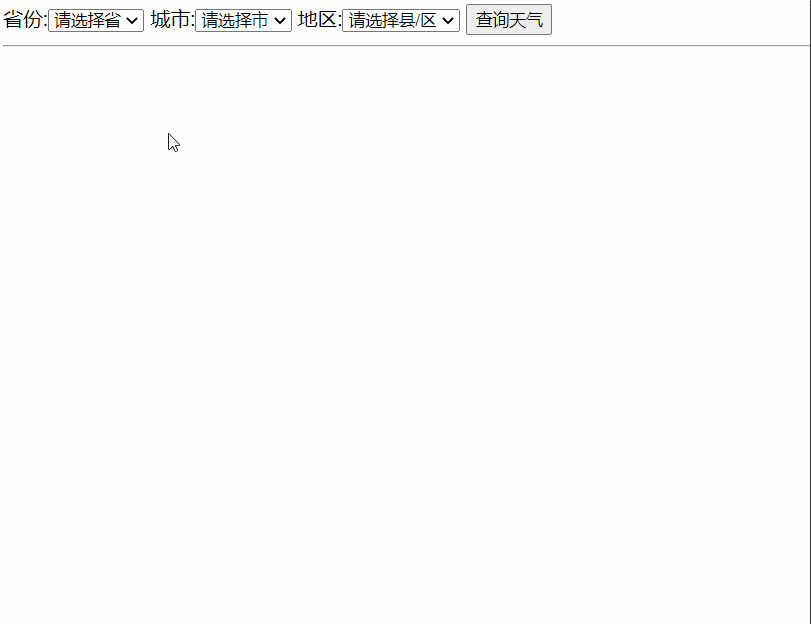
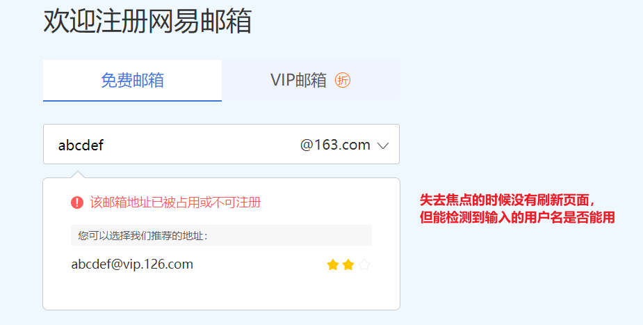
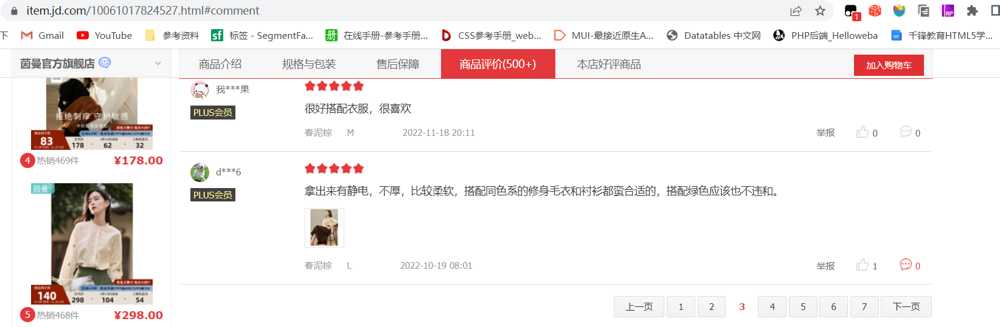
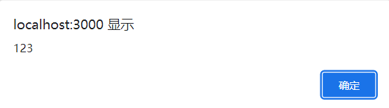
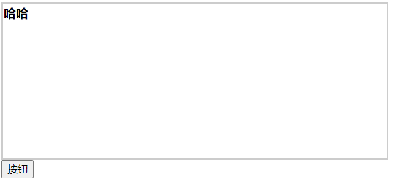

# ajax

## 一、ajax介绍

工作中的项目都是前后端分离模式进行开发的，前端渲染页面需要的数据是跟后端请求回来的。前端对后端发送请求，除了使用a标签、输入网站敲回车、引入css、引入js、引入网站图标、引入图片，表单之外，还可以使用另外一个技术ajax。

为什么有了其他请求方式，还需要ajax？

- a标签跳转页面，只能发送get请求，无法发送post方式，且无法设置请求头
- 输入网址敲回车，只能发送get请求，无法发送post方式，且无法设置请求头
- 引入css，只能发送get请求，无法发送post方式，且无法设置请求头，请求回来的数据只能被解析成css
- 引入js，只能发送get请求，无法发送post方式，且无法设置请求头，请求回来的数据只能被解析成js代码
- 引入网站图标，只能发送get请求，无法发送post方式，且无法设置请求头，请求回来的数据只能被解析成网站图标
- 引入图片，只能发送get请求，无法发送post方式，且无法设置请求头，请求回来的数据只能被解析成图片
- 表单提交，可以发送get请求，可以发送post请求，但无法设置请求头，且请求发送依赖页面跳转，页面不跳转就无法发送请求
- ajax，可以发送get请求，可以发送post请求，可以设置请求头，请求发送不依赖页面跳转，页面不跳转也可以发送请求

ajax技术在项目中应用广泛，且每个项目必须用到ajax来发送请求，例如：三级联动，页面不刷新但数据要重新请求回来。

三级联动演示：

 

再例如：我们在注册失败的时候，会重新跳转到注册页面，彼时，注册表单中的数据都清空了，可能只会有一个数据不正确，但我们需要重新输入所有的数据，用户体验感不佳。如果能在点击提交的时候，不刷新页面，但也能请求到服务器，用户体验感就好了。

实际应用：

网易邮箱检测用户名是否能用：

 

京东商品详情的分页：

 

## 二、ajax语法

AJAX，全称：`async javascript and XML`，是一个异步执行的和后台交互的技术。

1. 创建ajax对象

   ```js
   var xhr = new XMLHttpRequest();
   ```

   

2. 设置请求方式和请求路径

   ```js
   xhr.open(请求方式, 请求地址, true);
   ```

   参数3：是否是异步请求，ajax通常都是异步请求，若要发送同步请求，设置为false，浏览器会有警告。

3. 发送请求

   ```js
   xhr.send();
   ```

   

4. 监听请求的状态

   ```js
   xhr.onreadystatechange = function(){
       // 事件会在ajax请求的状态发生改变的时候会触发
       // ajax状态
       xhr.readyState
       // 响应状态码 - http状态码
       xhr.status
       // 响应数据
       xhr.responseText
   };
   ```

   ajax状态说明：

   > 0：未初始化，对象已经建立，但是还未初始化，就是还未调用open方法
   >
   > 1：请求已经发送，正在发送中
   >
   > 2：请求已经发送服务器
   >
   > 3：服务器正在给客户端响应信息，数据还不完整
   >
   > 4：响应完成，数据全部传送完成，请求结束了

   http状态码说明：

   > 1xx：请求发送到服务器了，服务器正在分析这次请求 - 通常指正在请求中
   >
   > 2xx：请求是成功的
   >
   > 3xx：请求收到，但必须要进一步处理 - 通常是准备响应，指定从哪里响应
   >
   > 4xx：客户端错误
   >
   > 5xx：服务器端错误

   监听代码说明：

   > 1. 判断ajax状态是否完成，要确保数据响应结束
   > 2. 响应结束时，判断请求是否是成功的
   > 3. 接收响应数据

   get请求和post请求不传递参数的情况，上述代码就够了；

   post请求传递参数的情况，在上述代码的结束上，需要做些许改动：

   在send发送请求之前，必须先设置请求头：

   ```js
   xhr.setRequestHeader('content-type', 'application/x-www-form-urlencoded')
   ```

   在send方法中要传递参数：

   ```js
   xhr.send('键=值&键=值&键=值')
   ```

   

## 三、js处理ajax响应的各种数据

### 1、处理普通字符串

普通字符串接收到后，若要显示在页面中，则使用dom操作；若要进一步处理则使用字符串运算或方法。

例：

```js
var xhr = new XMLHttpRequest;
    xhr.open('get','/handlerData');
    xhr.send()
    xhr.onreadystatechange = function(){
        if(xhr.readyState === 4){
            if(xhr.status>=200 && xhr.status<300){
                var res = xhr.responseText;
                // 1.处理普通字符串
                // 字符串需要处理 - 字符串方法，基本操作
                res = res.split('').reverse().join('')
                // 2.将普通字符串放在标签中 - 普通dom操作
                document.querySelector('.box').innerText = res
                console.log(res);
            }
        }
    }
```


### 2、处理json格式字符串

json字符串需要转成数组或对象使用：

```js
JSON.parse(json字符串)
```

例：

后端响应：

```js
res.json({
    error_code: 0,
    msg: '成功'
})
```

前端处理：

```js
res = JSON.parse(res)
let {error_code, msg} = res
if(error_code === 0) {
    alert(msg)
}
```


### 3、处理css字符串

css字符串需要放在style标签中才能生效：

后端响应：

```js
res.end('div{ background: red}')
```

前端处理：

```js
var style = document.createElement('style')
style.innerText = res
document.head.appendChild(style)
```


### 4、处理js字符串

返回的数据如果是js代码的字符串，则需要运行js代码：

```js
eval(js代码字符串)
```

后端响应：

```js
res.end('alert(123)')
```

前端处理：

```js
eval(res)
```

效果：

 

### 5、处理html字符串

需要将响应回来的html字符串，当做某个标签的innerHTML使用：

后端响应：

```js
res.end('<b>哈哈</b>')
```

前端处理：

```js
document.querySelector('.box').innerHTML = res
```

结果：

 

### 6、处理xml数据

如果响应的是xml文件数据，则需要通过特殊的属性来接收：

```js
xhr.responseXML
```

接收到的是一个文档document，可以利用dom操作进行：

xml文件：

```xml
<?xml version="1.0" encoding="utf-8"?>
<data>
    <student id="1">
        <name>张三</name>
        <age>12</age>
        <sex>男</sex>
    </student>
    <student id="2">
        <name>李四</name>
        <age>13</age>
        <sex>女</sex>
    </student>
</data>
```

xml全称extension markup language，可扩展标记语言，目的是用于存储和传输数据，文件中都是自定义标签。xml文件中不能有xml标签。

后端响应：

```js
res.sendFile(__dirname + '/test.xml')
```

前端处理：

```js
var res = xhr.responseXML // 接收到是一个文档
var names = res.querySelectorAll('name')
console.log(names);
for(var a=0; a<names.length; a++) {
    console.log( names[a].innerHTML );
}
```

xml的dom中，没有innerText，只有innerHTML

## 四、ajax处理注册登录

注册html：

```html
<!DOCTYPE html>
<html lang="en">
<head>
    <meta charset="UTF-8">
    <title>注册</title>
    <link rel="stylesheet" href="./css/register.css">
</head>
<body>
    <!-- 需要设置请求地址和提交方式 -->
    <form action="/user/register" method="post">
        <table align="center">
            <caption><h2>注册</h2></caption>
            <tr>
                <td>用户名：</td>
                <td><input type="text" name="username"></td>
            </tr>
            <tr>
                <td>密码：</td>
                <td><input type="password" name="password"></td>
            </tr>
            <tr>
                <td>确认密码：</td>
                <td><input type="password" name="repass"></td>
            </tr>
            <tr>
                <td>邮箱：</td>
                <td><input type="text" name="email"></td>
            </tr>
            <tr>
                <td></td>
                <td>
                    <input type="reset">
                    <input type="submit">
                </td>
            </tr>
        </table>
    </form>
<div class="container footer">
    <div class="content">
        已有账号，去<a href="login.html">登录</a>
    </div>
</div>
</body>
<!-- 表单提交之前，应该对表单数据做验证 -->
<script src="./js/register.js"></script>
</html>
```

注册js：

```js
var form = document.querySelector('form')
var usernameInput = document.querySelector('[name="username"]')
var passwordInput = document.querySelector('[name="password"]')
var repassInput = document.querySelector('[name="repass"]')
var emailInput = document.querySelector('[name="email"]')
form.onsubmit = function() {
    var usernameReg = /^[a-zA-Z][a-zA-Z0-9]{3,9}$/
    if(!usernameReg.test(usernameInput.value)) {
        alert('用户名不符合规则')
        return false
    }
    var passwordReg = /^.{6,10}$/
    if(!passwordReg.test(passwordInput.value)) {
        alert('密码不符合规则')
        return false
    }
    if(passwordInput.value != repassInput.value) {
        alert('两次密码输入不一致')
        return false
    }
    var emailReg = /(^[1-9]\d{5,9}@qq\.com$)|(^[a-zA-Z]\w{5,17}@((126|163)\.com|yeah\.net)$)/
    if(!emailReg.test(emailInput.value)) {
        alert('邮箱不符合规则')
        return false
    }
    // 表单从这里就跳转走了 - 给服务器发送请求了
    // 希望表单不要跳转，能悄悄的发请求 - ajax
    var xhr = new XMLHttpRequest;
    xhr.open('post','/user/register');
    // 设置请求头
    xhr.setRequestHeader('Content-Type', 'application/x-www-form-urlencoded')
    // 发送请求携带参数
    xhr.send(`username=${usernameInput.value}&password=${passwordInput.value}&email=${emailInput.value}`)
    xhr.onreadystatechange = function(){
        if(xhr.readyState === 4){
            if(xhr.status>=200 && xhr.status<300){
                var res = xhr.responseText;
                res = JSON.parse(res)
                var {error_code, msg} = res
                alert(msg)
                if(error_code === 0) {
                    location.href = '/login.html'
                }
                console.log(res);
            }
        }
    }
    // 阻止默认行为，不允许表单跳转
    return false
}
```

注册服务器端：

```js
// 注册请求
router.post('/register', (req, res) => {
    // 接收post提交的数据
    let {username, password, email} = req.body
    // console.log(username, password, email);
    // 检查用户名是否被占用
    // 读取data.txt
    let data = fs.readFileSync('./data.txt', 'utf-8')
    // 判断文件中是否有内容
    if(data) { // 有内容
        // 将字符串转成数组
        data = JSON.parse(data)
        // 判断是否有当前用户名
        let obj = data.find(item => item.username === username)
        // 判断是否有
        if(obj) {
            // 有
            // ajax只需要一个消息，不需要跳转页面
            res.json({
                error_code: 1,
                msg: '用户名被占用'
            })
            return
        }
    } else { // 没内容
        data = []
    }
    data.push({
        username,
        password: bcryptjs.hashSync(password, 10),
        email
    })
    // 将data转成字符串写入文件中
    fs.writeFileSync('./data.txt', JSON.stringify(data))
    // 注册成功
    res.json({
        error_code: 0,
        msg: '注册成功'
    })
})
```

登录html：

```html
<!DOCTYPE html>
<html lang="en">
<head>
    <meta charset="UTF-8">
    <title>登录</title>
    <link rel="stylesheet" href="./css/login.css">
</head>
<body>
    <form action="/user/login" method="post">
        <table align="center">
            <caption><h2>登录</h2></caption>
            <tr>
                <td>用户名：</td>
                <td><input type="text" name="username"></td>
            </tr>
            <tr>
                <td>密码：</td>
                <td><input type="password" name="password"></td>
            </tr>
            <tr>
                <td></td>
                <td>
                    <input type="reset">
                    <input type="submit">
                </td>
            </tr>
        </table>
    </form>
</body>
<script src="./js/login.js"></script>
</html>
```

登录js：

```js
var form = document.querySelector('form')
var usernameInput = document.querySelector('[name="username"]')
var passwordInput = document.querySelector('[name="password"]')
form.onsubmit = function() {
    if(usernameInput.value === '' || passwordInput.value === '') {
        alert('账号和密码不能为空')
        return false
    }
    var xhr = new XMLHttpRequest;
    xhr.open('post','/user/login');
    xhr.setRequestHeader('Content-Type', 'application/x-www-form-urlencoded')
    xhr.send(`username=${usernameInput.value}&password=${passwordInput.value}`)
    xhr.onreadystatechange = function(){
        if(xhr.readyState === 4){
            if(xhr.status>=200 && xhr.status<300){
                var res = xhr.responseText;
                res = JSON.parse(res)
                var {error_code, msg} = res
                alert(msg)
                if(error_code === 0) {
                    location.href = '/'
                }
                console.log(res);
            }
        }
    }
    // 阻止默认行为，不允许跳转
    return false
}
```

登录服务器端：

```js
router.post('/login', (req, res) => {
    // 获取用户名和密码
    let {username, password} = req.body
    // 读取data.txt
    let data = fs.readFileSync('./data.txt', 'utf-8')
    // 判断是否有数据
    if(!data) {
        res.json({
            error_code: 1,
            msg: '还未注册'
        })
        return
    }
    // 将字符串转成数组
    data = JSON.parse(data)
    // 根据用户名找到对应的对象数据
    let obj = data.find(item => item.username === username)
    // 判断
    if(obj) {
        // 验证密码
        if(bcryptjs.compareSync(password, obj.password)) {
            res.json({
                error_code: 0,
                msg: '登录成功'
            })
            return
        }
        res.json({
            error_code: 2,
            msg: '密码不正确'
        })
    } else {
        res.json({
            error_code: 3,
            msg: '用户名不存在'
        }) 
    }
})
```

## 五、cookie和本地存储

### 1、cookie介绍

当登录成功后应该跳转到首页，首页要显示登录过的账号或昵称。但首页显示是又一次http请求，登录是上次的http请求，两次请求之间的状态是无法保持的，所以默认是获取不到登录的账号的。

http请求，每次都有三次握手、通信、四次挥手的过程，所以多次请求之间是完全没有关联的，登录过的状态是无法保持给后续请求的。所以http协议又叫做无状态协议。

但在实际项目中，我们又需要在多次请求之间保持一定的状态，例如，登录过后的所有页面都要保持登录过的状态。这时候就需要用到cookie了。

cookie是基于http无法保持状态而出现的一种解决方案。原理是利用多次请求使用的是同一个浏览器，在浏览器中利用数据的存储来达到保持状态的功能。例如：登录成功后，将账号或昵称保存在浏览器，其他http请求打开页面后，从浏览器中获取数据，判断之前是否登录过。

### 2、cookie特性

cookie本质上就是http协议下，浏览器的存储技术，有以下几个特性：

- 以键值对形式存储
- 具有时效性，不设置有效期，默认关闭浏览器失效；设置了有效期后，有效期后访问则会自动删除。cookie识别的时间是世界标准时间（东八区时间-8小时）
- 分域名存储，当前域名下设置的cookie，只能在当前域名下访问
- 分路径存储，当前路径下设置的cookie，只能在当前路径下访问
- 大小和数量受浏览器显示，最大4kb，最多150条
- cookie默认会请求头和响应头之间来回传递，也就是默认会带给服务器

### 3、cookie操作

#### 3.1、存储cookie

```js
document.cookie = 'key=value;expires=失效时间日期对象(世界标准时间);path=路径'
```

一次只能设置一条cookie，设置多条就需要设置多次。

浏览器默认查看cookie的有效期，是使用中国标准时间查看的，所以查看的不准确，需要使用谷歌插件EditCookie进行查看。

#### 3.2、获取cookie

```js
document.cookie
```

一次性获取到所有的cookie，每个cookie之间使用**分号空格**分割

#### 3.3、删除cookie

前端js没有删除cookie的语法，可以将cookie的失效时间设置为上1秒，等同于删除cookie。

#### 3.4、cookie操作封装

```js
// 设置cookie的函数
function setCookie(key, value, seconds, path = '/') {
    var date = new Date()
    date.setTime(date.getTime() - 8 * 3600 * 1000 + seconds * 1000)
    document.cookie = `${key}=${value};expires=${data};path=${path}`
}

// 获取cookie的函数
function getCookie(key) {
	var cookies = document.cookie
    if(!cookies) return
    var reg = /[^=; ]=[^; ]/g
    while(true) {
    	var arr = reg.exec(cookies)
        if(!arr && arr[1] === key) {
        	return arr[2]
        }
    }
}

// 删除cookie的函数
function removeCookie(key, path = '/') {
    setCookie(key, null, -1, path)
}
```

### 4、本地存储

用户登录后，如果要获取用户详细信息，需要给后端再次发送请求，此时，后端会有需要令牌的验证。

前端登录后，需要将令牌保存起来，后续发送请求需要携带令牌。

通常前端在存储令牌的时候，会将令牌保存在本地存储中。

本地存储也属于浏览器存储数据的一种技术，本地存储由如下几个特点：

- 本地存储是以键值对形式存储的
- 本地存储分域名存储，本地打开的页面也可以存储
- 本地存储没有时效性，默认永久存储
- 本地存储的大小较大一些（5MB）
- 本地存储默认不会携带给服务器

本地存储API：

```js
// 存数据
window.localStorage.setItem(key, value)

// 获取数据
localStorage.getItem(key)

// 删除数据
localStorage.removeItem(key)

// 清空本地存储
localStorage.clear()
```

例：存储token

```js
localStorage.setItem('token', token)
```

存储登录后要跳转的路径：

```js
localStorage.setItem('url', location.href)
```


## 六、ajax封装

```js
// 封装发送ajax的get和post请求的函数
function request(obj) {
    if(obj.url === undefined) {
        throw new Error('请求地址不能为空！')
    }
    if(typeof obj.url != 'string') {
        throw new Error('请求地址不正确！')
    }
    if(obj.method === undefined) {
        obj.method = 'get'
    }
    if(obj.method.toLowerCase() != 'get' && obj.method.toLowerCase() != 'post') {
        throw new Error('请求方式必须是get或post')
    }
    if(obj.async === undefined) {
        obj.async = true
    }
    if(typeof obj.async != 'boolean') {
        throw new Error('async必须是布尔值！')
    }
    if(obj.data != undefined) {
        var data = ''
        if({}.toString.call(obj.data) === '[object String]') {
            if(!obj.data.includes('=')) {
                throw new Error('字符串数据格式：键=值！')
            }
            data = obj.data
        } else if({}.toString.call(obj.data) === '[object Object]') {
            var arr = []
            for(var key in obj.data) {
                arr.push(key + '=' + obj.data[key])
            }
            data = arr.join('&')
        } else {
            if(!obj.data.includes('=')) {
                throw new Error('数据必须是字符串或独享！')
            }
        }
        if(obj.method.toLowerCase() === 'get') {
            obj.url += '?' + data
        }
    }
    if(obj.success === undefined) {
        obj.success = () => {}
    }
    if(typeof obj.success != 'function') {
        throw new Error('success必须是函数')
    }
    if(obj.error === undefined) {
        obj.error = () => {}
    }
    if(typeof obj.error != 'function') {
        throw new Error('error必须是函数')
    }
    if(obj.dataType === undefined) {
        obj.dataType = 'json'
    }
    var xhr = new XMLHttpRequest
    xhr.open(obj.method, obj.url, obj.async)
    if(obj.headers != undefined) {
        if({}.toString.call(obj.header) != '[object Object]') {
            throw new Error('headers头信息必须是对象！')
        }
        for(var key in obj.headers) {
            xhr.setRequestHeader(key, obj.headers[key])
        }
    }
    if(obj.method.toLowerCase() === 'post' && data != undefined) {
        xhr.setRequestHeader('Content-Type', 'application/x-www-form-urlencoded')
        xhr.send(data)
    } else {
        xhr.send()
    }
    if(obj.async === true) {
        xhr.onreadystatechange = function() {
            console.log(xhr.readyState);
            if(xhr.readyState === 4) {
                if(xhr.status >= 200 && xhr.status < 300) {
                    switch(obj.dataType) {
                        case 'json':
                            var res = xhr.responseText
                            res = JSON.parse(res)
                        break
                        case 'text':
                            var res = xhr.responseText
                        break
                        case 'xml':
                            var res = xhr.responseXML
                        break
                        default:
                            throw new Error('dataType必须是json或text或xml！')
                    }
                    obj.success(res)
                } else {
                    obj.error()
                }
            }
        }
    } else {
        switch(obj.dataType) {
            case 'json':
                var res = xhr.responseText
                res = JSON.parse(res)
            break
            case 'text':
                var res = xhr.responseText
            break
            case 'xml':
                var res = xhr.responseXML
            break
            default:
                throw new Error('dataType必须是json或text或xml！')
        }
        obj.success(res)
    }
}
```

注册：

```js
request({
    method: 'post',
    url: '/user/register',
    data: {
        username: usernameInput.value,
        password: passwordInput.value,
        email: emailInput.value
    },
    success(res) {
        var {error_code, msg} = res
        alert(msg)
        if(error_code === 0) {
            location.href = '/login.html'
        }
    }
})
```

登录：

```js
request({
    method: 'post',
    url: '/user/login',
    data: {
        username: usernameInput.value,
        password: passwordInput.value
    },
    success: res => {
        var {error_code, msg} = res
        alert(msg)
        if(error_code === 0) {
            location.href = '/'
        }
    }
})
```
