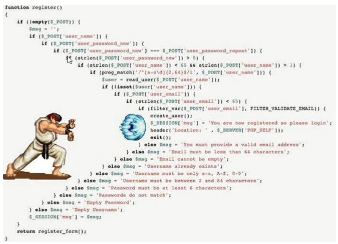

# 回调地狱和跨域

## 一、回调函数

概念：将一个函数当做参数传入另一个函数的时候，这个函数就叫回调函数。

我们之前用过很多次回调函数，比如：数组方法map、filter等；运动函数中处理运动结束传入的函数；分页插件中使用插件的时候执行的函数。。。包括封装的ajax中，请求成功以后执行的success函数。都是回调函数。

为什么要使用回调函数？

当我么需要在异步代码执行结束再执行一些同步代码的时候，在异步代码外面无法预知异步代码什么时候执行结束，只有异步代码内部才能知道异步代码什么时候执行结束。此时，可以将需要执行的同步放在一个函数，将函数当做参数传递进异步代码中，异步代码执行结束后，调用这个函数即可。

也就是说，回调函数是异步代码产生的问题的一种解决方案。

## 二、回调地狱

在一些比较复杂的业务逻辑中，有多个异步代码需要按照一定的顺序执行时，就需要有多个回调函数嵌套在一起执行，代码结构如下：

 

这就造成了，后期这个代码难以阅读和维护，，这是著名的”回调地狱“。

例：1s后输出1，再过1s后输出2，再过1s后输出3，再过1s后输出4

```js
setTimeout(() => {
	console.log(1)
    setTimeout(() => {
        console.log(2)
        setTimeout(() => {
            console.log(3)
            setTimeout(() => {
                console.log(4)
            }, 1000)
        }, 1000)
    }, 1000)
}, 1000)
```

这种嵌套多了以后，就会形成回调地狱。

es6为了解决这个问题，所以新增了promise语法。

## 三、Promise

es6提供的promise是一个构造函数，实例化的时候需要传递一个函数

语法：

```js
var p = new Promise(() => {})
```

实例化得到的promise对象，处于pending状态，表示正在处理，没有结果。

promise对象共有3种状态：

> pending - 正在处理中
>
> fulfilled - 成功的
>
> rejected - 失败的

传递进去的回调函数，在promise构造函数内部调用的时候，给传递了两个实参，分别是：resolve和reject。这两个参数都是函数：

```js
var p = new Promise((resolve, reject) => {
    console.log(resolve, reject) // ƒ () { [native code] } ƒ () { [native code] }
})
```

调用resolve可以将promise对象的状态改为成功，成功的值是resolve的参数；

```js
var p = new Promise((resolve, reject) => {
    resolve('200')
})
console.log(p); // Promise {<fulfilled>: '200'}
```

调用reject可以将promise对象的状态改为失败，失败的值是reject的参数；

```js
var p = new Promise((resolve, reject) => {
    reject('400')
})
console.log(p); // Promise {<rejected>: '400'}
```

resolve和reject不会同时执行，因为promise的状态，从pending到成功或失败就已经结束了，不会再次发生改变了。

如果要用成功或失败的值做进一步的操作，正常是需要在回调函数中进行的，但promise的出现的目的就是为了解决嵌套的，所以promise对象提供了两个方法，分别是then和catch。

在回调函数内部调用resolve，可以通过调用promise对象的then方法获取到成功的值；

```js
var p = new Promise((resolve, reject) => {
    resolve('200')
})
p.then(res => {
    console.log(res)
})
```

在回调函数内部调用reject，可以通过调用promise对象的catch方法获取到失败的值：

```js
var p = new Promise((resolve, reject) => {
    reject('400')
})
p.catch(err => {
    console.log(err)
})
```

promise将需要的进一步操作，放在对象外，调用方法即可获取到，则避免了嵌套语法。

```js
var p1 = new Promise(resolve => {
    setTimeout(() => {
        resolve(1)
    }, 1000)
})

p1.then(res => {
    console.log(res);
    var p2 = new Promise(resolve => {
        setTimeout(() => {
            resolve(2)
        }, 1000)
    })

    p2.then(res => {
        console.log(res);
        var p3 = new Promise(resolve => {
            setTimeout(() => {
                resolve(3)
            }, 1000)
        })

        p3.then(res => {
            console.log(res);
            var p4 = new Promise(res => {
                setTimeout(() => {
                    resolve(4)
                }, 1000)
            })

            p4.then(res => {
                console.log(res);
            })
        })
    })
})
```

如果嵌套实在很多，我们用promise语法后，发现语法变得更复杂，且嵌套问题解决的不彻底，promise基于这种嵌套较多的情况，提供了链式调用：当第一个promise的then方法中返回第二个promise对象，则第二个promise的then方法可以跟第一个promise对象的then方法形成链式操作：

```js
var p1 = new Promise(resolve => {
    setTimeout(() => {
        resolve(1)
    }, 1000)
})

p1.then(res => { // 这是p1的then方法
    console.log(res)
    var p2 = new Promise(resolve => {
        setTimeout(() => {
            resolve(2)
        }, 1000)
    })
    return p2 // p1的then方法中返回p2 - promise对象
}).then(res => { // 这是p2的then方法
    console.log(res)
})
```

所以，上面繁琐的4次嵌套，可以彻底变成不嵌套的链式结构：

```js
var p1 = new Promise(resolve => {
    setTimeout(() => {
        resolve(1)
    }, 1000)
})

p1.then(res => {
    console.log(res);
    var p2 = new Promise(resolve => {
        setTimeout(() => {
            resolve(2)
        }, 1000)
    })
    return p2
}).then(res => {
    console.log(res);
    var p3 = new Promise(resolve => {
        setTimeout(() => {
            resolve(3)
        }, 1000)
    })
    return p3
}).then(res => {
    console.log(res);
    var p4 = new Promise(resolve => {
        setTimeout(() => {
            resolve(4)
        }, 1000)
    })
    return p4
}).then(res => {
    console.log(res);
})
```

如果需要处理错误，可以在最后一个then的后面添加唯一的catch即可解决所有promise对象错误：

```js
var p1 = new Promise((resolve, reject) => {
    setTimeout(() => {
        resolve(1)
    }, 1000)
})

p1.then(res => {
    console.log(res);
    var p2 = new Promise((resolve, reject) => {
        setTimeout(() => {
            resolve(2)
        }, 1000)
    })
    return p2
}).then(res => {
    console.log(res);
    var p3 = new Promise((resolve, reject) => {
        setTimeout(() => {
            resolve(3)
        }, 1000)
    })
    return p3
}).then(res => {
    console.log(res);
    var p4 = new Promise((resolve, reject) => {
        setTimeout(() => {
            resolve(4)
        }, 1000)
    })
    return p4
}).then(res => {
    console.log(res);
}).catch(err => {
    console.log(err)
})
```

只要有一个promise执行错误了，就不会他的then方法，也就不会有其他的promise对象了，所以跳过所有then直接执行到最后的catch了。

promise的then方法和catch方法是异步代码：

```js
new Promise(resolve => {
    console.log(1)
    resolve()
}).then(() => {
    console.log(2)
})
console.log(3)
// 1 3 2
```


promise封装ajax：

```js
function promiseAjax(obj) {
    return new Promise((resolve, reject) => {
        if(obj.url === undefined) {
            throw new Error('请求地址不能为空！')
        }
        if(typeof obj.url != 'string') {
            throw new Error('请求地址不正确！')
        }
        if(obj.method === undefined) {
            obj.method = 'get'
        }
        if(obj.method.toLowerCase() != 'get' && obj.method.toLowerCase() != 'post') {
            throw new Error('请求方式必须是get或post')
        }
        if(obj.async === undefined) {
            obj.async = true
        }
        if(typeof obj.async != 'boolean') {
            throw new Error('async必须是布尔值！')
        }
        if(obj.data != undefined) {
            var data = ''
            if({}.toString.call(obj.data) === '[object String]') {
                if(!obj.data.includes('=')) {
                    throw new Error('字符串数据格式：键=值！')
                }
                data = obj.data
            } else if({}.toString.call(obj.data) === '[object Object]') {
                var arr = []
                for(var key in obj.data) {
                    arr.push(key + '=' + obj.data[key])
                }
                data = arr.join('&')
            } else {
                if(!obj.data.includes('=')) {
                    throw new Error('数据必须是字符串或独享！')
                }
            }
            if(obj.method.toLowerCase() === 'get') {
                obj.url += '?' + data
            }
        }
        if(obj.dataType === undefined) {
            obj.dataType = 'json'
        }
        var xhr = new XMLHttpRequest
        xhr.open(obj.method, obj.url, obj.async)
        if(obj.headers != undefined) {
            if({}.toString.call(obj.header) != '[object Object]') {
                throw new Error('headers头信息必须是对象！')
            }
            for(var key in obj.headers) {
                xhr.setRequestHeader(key, obj.headers[key])
            }
        }
        if(obj.method.toLowerCase() === 'post' && data != undefined) {
            xhr.setRequestHeader('Content-Type', 'application/x-www-form-urlencoded')
            xhr.send(data)
        } else {
            xhr.send()
        }
        if(obj.async === true) {
            xhr.onreadystatechange = function() {
                console.log(xhr.readyState);
                if(xhr.readyState === 4) {
                    if(xhr.status >= 200 && xhr.status < 300) {
                        switch(obj.dataType) {
                            case 'json':
                                var res = xhr.responseText
                                res = JSON.parse(res)
                            break
                            case 'text':
                                var res = xhr.responseText
                            break
                            case 'xml':
                                var res = xhr.responseXML
                            break
                            default:
                                throw new Error('dataType必须是json或text或xml！')
                        }
                        resolve(res)
                    } else {
                        reject()
                    }
                }
            }
        } else {
            switch(obj.dataType) {
                case 'json':
                    var res = xhr.responseText
                    res = JSON.parse(res)
                break
                case 'text':
                    var res = xhr.responseText
                break
                case 'xml':
                    var res = xhr.responseXML
                break
                default:
                    throw new Error('dataType必须是json或text或xml！')
            }
            resolve(res)
        }
    })
}
```

案例：用promise简化接口项目中的mongodb操作。

## 四、ASYNC/AWAIT

promise虽然将嵌套结构变成了链式结构，但将所有代码作为一个整体，更不利于后期代码的维护，所以在es7中，新增了async/await语法，彻底解决回调地狱，号称回调地狱的终极解决方案。

async/await语法中，其实就是两个关键字：async和await。

### 1、async

async用于修饰一个函数：

```js
async function fn() {
    console.log(1)
}

fn()
```

async单独使用，函数的使用跟正常的函数没有区别，但会隐形返回一个状态为成功的promise对象：

```js
async function fn() {
    console.log(1)
}

var p = fn()
console.log(p) // Promise {<fulfilled>: undefined}
```

成功值默认为undefined，若要改变，需要在函数中返回内容。

```js
async function fn() {
    console.log(1)
    return 111
}

var p = fn()
console.log(p) // Promise {<fulfilled>: 111}
```

### 2、await

await关键字，无法单独使用，必须在async修饰的函数内部使用，用于修饰一个promise对象。

作用是让后续的代码，等待promise有了成功的结果后，再执行，无论promise中执行的是同步代码还是异步代码：

```js
async function fn() {
    await new Promise(resolve => {
        setTimeout(() => {
            console.log(111);
            // resolve(222) // 不调用resolve就不会执行后续的3333
        }, 1000)
    })
    console.log(333);
}

fn()
```

await还可以将修饰的promise对象的成功结果接收到：

```js
async function fn() {
    var res = await new Promise(resolve => {
        setTimeout(() => {
            resolve(222)
        }, 1000)
    })
    console.log(res); // 222
    console.log(333);
}

fn()
```

为什么将这个语法叫做回调地狱的终极解决方案？因为用这个语法，异步代码和同步并没有什么区别了，无法再继续优化了。

案例：用async/await解决接口项目中的mongodb操作。


## 五、跨域

### 1、跨域介绍

我们在前后端分离开发模式下，前端和后端同时开发，前端项目需要通过服务器打开，后端接口也是一个服务器。

我们直接在前端项目通过ajax请求到后端的接口，是不能成功的。

浏览器为了安全，对前端的ajax请求进行了限制 - 同源策略。

同源策略：前端ajax所在页面地址跟被请求的服务器地址，需要同源才可以请求成功，否则浏览器不允许请求成功。

同源：同协议且同域名且同端口号，三者只要有一个不同，就是不同源，也就是造成了跨域。

若非要进行跨域，需要使用特殊的解决办法：proxy、cors、jsonp

### 2、proxy

proxy俗称服务器代理。

解决原理：浏览器能限制客户端的ajax，但是无法限制服务器。前端ajax将请求发送到自己所在服务器中，服务器代替ajax请求目标服务器，将请求回来的数据响应给前端ajax。

在nodejs中服务器中，实现proxy服务器代理需要依赖第三方模块 - http-proxy-middleware

代理代码：

```js
const express = require('express')
const {createProxyMiddleware} = require('http-proxy-middleware')

// 配置代理
const proxy = createProxyMiddleware('/crossReq', {
    target: 'http://localhost:3001/cross',
    changeOrigin: true,
    pathRewrite: {
        '/crossReq': ''
    }
})

const app = express()
app.listen(3000)

app.use(express.static('public'))

app.get('/crossReq', (req, res) => {
    proxy(req, res)
})
```


### 3、cors

浏览器之所以不让前端ajax跨域成功，是因为他不知道目标服务器是否允许不同源的地址请求。如果目标服务器摆明了允许不同源的地址请求，浏览器也没有借口继续拦截。

cors跨域解决办法就是在目标服务器中设置允许不同源地址跨域请求的响应头。

```js
res.setHeader('Access-Control-Allow-Origin', 'http://localhost:3000')
```

响应头的值，是允许的来源协议、域名、端口号，`*`代表任意来源

### 4、jsonp

浏览器会限制前端ajax，但前端的标签浏览器是不做限制的。例如：img引入其他服务器的图片地址、link引入其他服务器的css文件地址、script引入其他服务器的js文件地址、iframe引入其他页面地址。

jsonp跨域的原理，就是利用script标签发送请求，不受浏览器限制。

```js
var script=document.createElement('script');
// 根据后端设置请求地址
script.setAttribute('src',"目标服务器地址");
$('head').append(script);
script.parentNode.removeChild(script);
```

例：

后端代码：

```js
app.get('/cross', (req, res) => {
    // 准备给客户端的数据
    let data = JSON.stringify({
        error_code: 0,
        msg: '跨域请求的响应'
    })
    // 需要接收客户端传递的函数名称
    let {fnname} = req.query
    // 响应字符串 - 函数名称(数据)
    res.send(`${fnname}(${data})`)
})
```

前端代码：

```js
var script = document.createElement('script')
script.src = 'http://localhost:3001/cross?fnname=getData'
window.getData = function(data) {
    console.log(data);
}
document.head.appendChild(script)
document.head.removeChild(script)
```

案例：

1、前后端项目登录和注册（验证码模块）

2、后端接口中设置允许跨域的响应头中间件（第三方中间件cors）

3、jsonp模拟百度关键字搜索

## 六、事件循环

事件循环，指的是js执行同步代码和异步代码的流程。

js代码都在js主线程（调用栈）中执行，同步代码直接执行了，异步代码交给浏览器的webAPI处理了，同步执行和异步处理是同时进行的。

webAPI在处理异步的时候，会将异步代码分为两种：宏任务和微任务。

宏任务包括：定时器

微任务包括：promise的then

因为异步代码有两种，所以异步代码待到要执行的时机时，放任务的队列也分为两种：宏队列和微队列。

js调用栈将所有同步代码执行结束后，会交替清空微队列和宏队列，不停的交替下去，所以叫做事件循环。


作业：前后端项目（注册、登录、首页、列表页、详情页、购物车、用户中心、用户修改、密码修改）

## 明日面试题

1. 事件循环
2. promise


