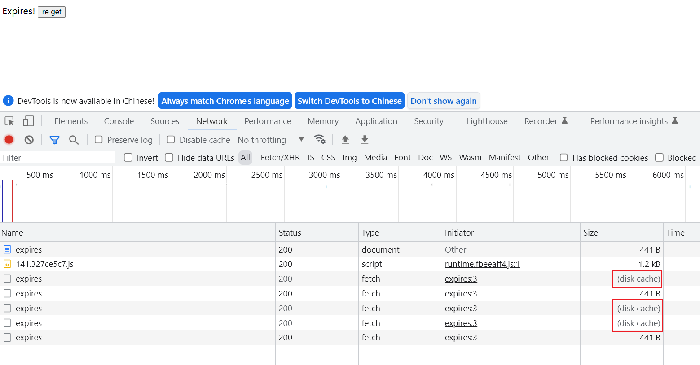
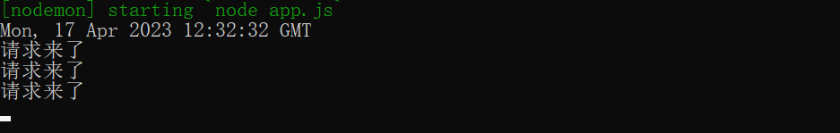
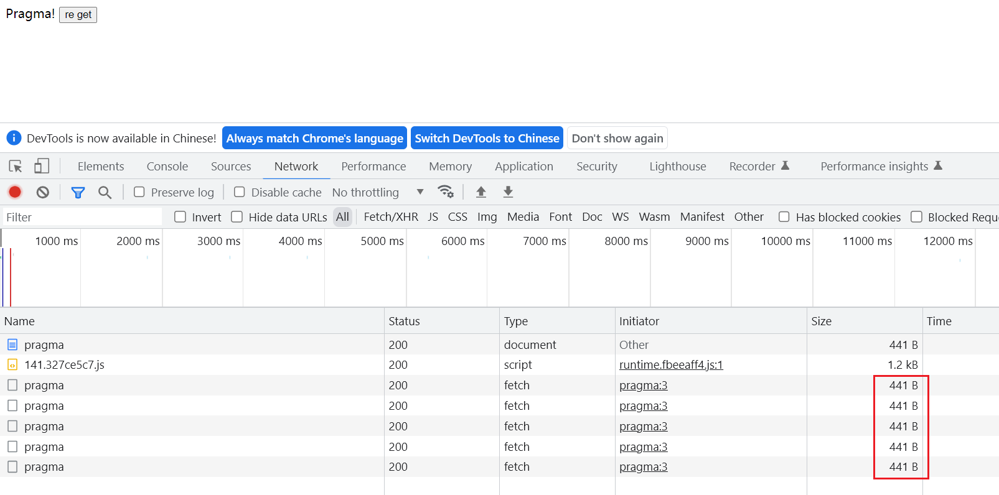
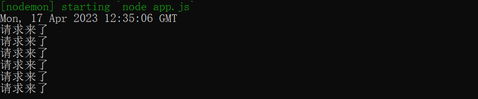
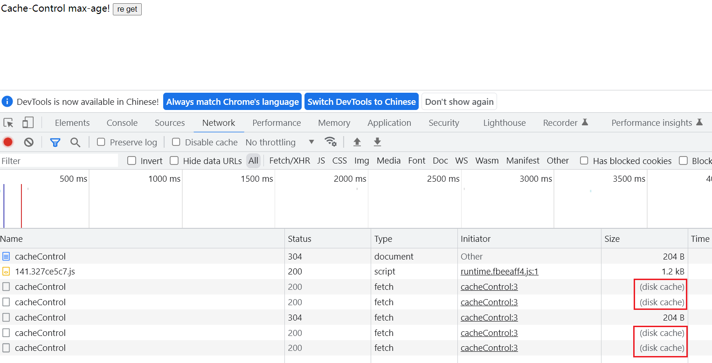
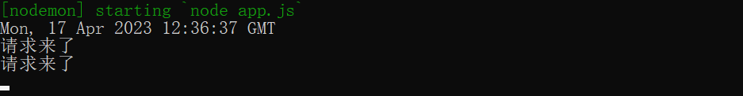
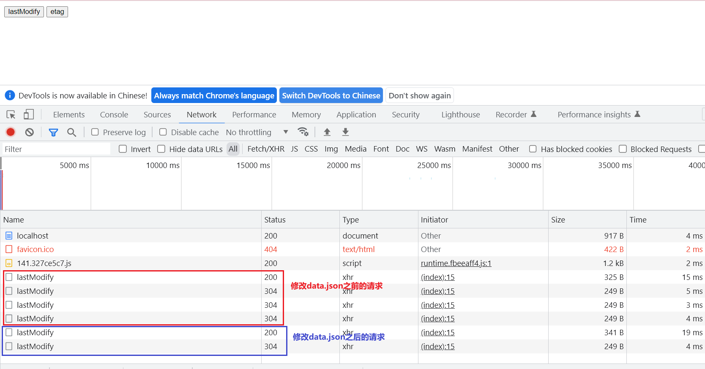
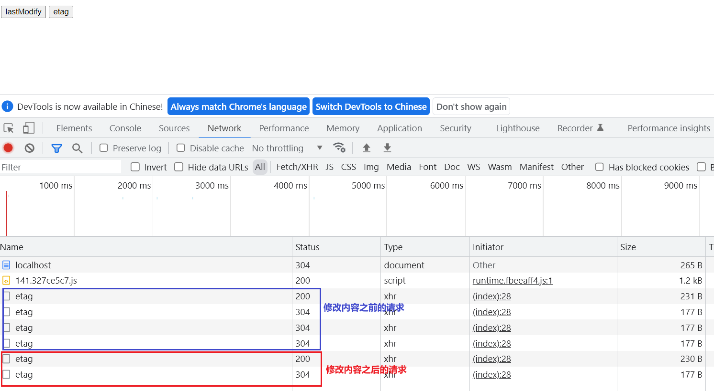
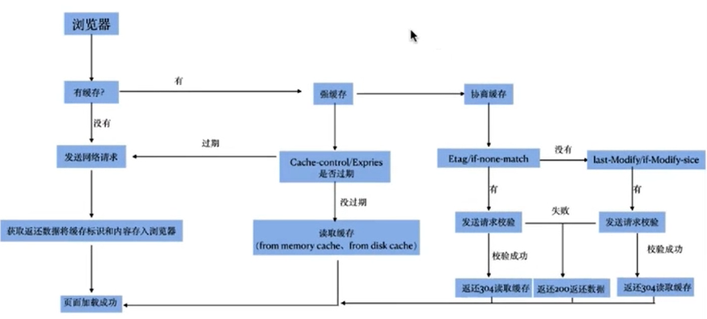

# 浏览器缓存机制

缓存机制有很多，例如：浏览器缓存机制、服务器缓存机制、代理服务器缓存。。。

我们在这里主要说浏览器的缓存机制。

浏览器的缓存机制分为两种：

- 强制缓存
- 协商缓存

浏览器缓存机制主要是由响应头控制的。

## 强制缓存

通常浏览器的请求中包含disk cache或memory cache就表示有强制缓存了。

强制缓存只要服务器设置响应头就行，客户端不需要配合。

设置强制缓存的响应头包含：

- expires
- pragma
- cache-control

expires和pragma是在http1.1之前就已经存在的两个键。

cache-control是http1.1之后才有键，所以优先级比expires要高。

### expires

expires主要用于设置缓存的时间，值是RFC 2822 格式的时间字符串，如果设置的值不是这样一个字符串或不是一个时间，则设置了也不会生效。

例：

```js
// 获取RFC 2822格式的时间格式字符串
function getRFC2822Date(addSeconds = 3) {
  const RFC2822Format = "ddd, DD MMM YYYY HH:mm:ss [GMT]";
  return moment()
    .utc()
    .add(addSeconds, 's')
    .format(RFC2822Format)  
}

console.log(getRFC2822Date());

app.get('/expires', (req, res) => {
    console.log('请求来了')
    // 浏览器默认会有etag缓存，所以需要先取消
    app.set('etag', false)
    // 设置expires缓存，有效期为3s
    res.setHeader(
        'Expires',
        getRFC2822Date()
    )
    res.send(`
        <script>
        	function getData() { fetch('http://localhost:3000/expires')}
        </script>
        <div>
            Expires!
            <button onclick="getData()">re get</button>
        </div>`
    )
})
```

点击5次的效果：

 

 

### pragma

对应的值只有`no-cache`，是用来防止缓存的，只要设置了这个响应头就不会被缓存。 

例：

```js
function getRFC2822Date(addSeconds = 10) {
  const RFC2822Format = "ddd, DD MMM YYYY HH:mm:ss [GMT]";
  return moment()
    .utc()
    .add(addSeconds, 's')
    .format(RFC2822Format)  
}

app.get('/pragma', (req, res) => {
    app.set('etag', false)
    res.setHeader(
        'Expires',
        getRFC2822Date()
    )
    res.setHeader('Pragma', 'no-cache')
  	res.send(`
      	<script>
      		function getData() { fetch('http://localhost:8800/pragma')}
      	</script>
      	<div>
      		Pragma!
      		<button onclick="getData()">re get</button>
      	</div>`
     )
})
```

点击5次的效果：

 

 

虽然设置了expires，但也不会被缓存，因为设置了Pragma，取消缓存了。

### cache-control

跟expires也是用于设置缓存的，对应的值有很多，但我们通常使用的只有一个max-age，用于设置缓存有效期，单位秒。

> - private：内容是对用户私有的，只能在浏览器端缓存，不能在其他地方（缓存除了浏览器可以缓存，还可以有代理服务器的缓存）缓存
> - public：内容是公开的，可以在任何地方进行缓存，可以是浏览器，也可以是代理服务器
> - no-store：内容不可以被任何地方缓存
> - no-cache：表示内容可以被缓存，但是浏览器每次都需要请求服务器，对内容进行对比校验
> - max-age：缓存内容的过期时间，单位是秒，使用起来比exprires更加友好。
> - s-max-age：作用是一样的，但是这个值通常代表代理服务器上的时间，如果浏览器中同时有这两个属性， 浏览器有限使用max-age
> - must-revalidate：在某些情况下，服务器无法访问，浏览器会使用缓存的内容，哪怕这个缓存的有效期已经超过了max-age，超过后必须去请求服务器。
> - proxy-revalidate：作用跟muse-revalidate一样。针对代理服务器。

例：

```js
app.get('/cacheControl', (req, res) => {
  console.log('请求来了');
  // 有效期3s
  res.set('cache-control', 'max-age=3')
  res.send(`
    <script>
        function getData() { fetch('http://localhost:3000/cacheControl')}
    </script>
    <div>
        Cache-Control max-age!
        <button onclick="getData()">re get</button>
    </div>`
    )
})
```

点击5次的效果：

 

 

## 协商缓存

协商缓存是服务器设置缓存，但是需要客户端配合，不过配合是自动配合，也不需要手动去设置。

### Last-Modified

服务器设置协商缓存的响应头是Last-Modified，值是一个时间戳。

具体过程：当服务器没有设置Last-Modified的时候，客户端也不会有If-Modified-Since；如果第一次请求服务器设置了Last-Modified响应头，第二次请求的时候，客户端会自动带上If-Modified-Since请求头，值是第一次服务器响应的Last-Modified的值。服务器接收到第二次请求的时候，先获取到If-Modified-Since的值，跟自己设置的Last-Modified的值进行对比，如果相等，说明，内容不需要进行更改，响应304状态码；如果不相等，说明内容需要更新，响应新内容。

例：

准备好被静态托管的静态资源：

```js
<body>
<button>按钮</button>
</body>
<script>
document.querySelector('button').onclick = function() {
    var xhr = new XMLHttpRequest;
    xhr.open('get','/lastModify');
    xhr.send()
    xhr.onreadystatechange = function(){
        if(xhr.readyState === 4){
            if(xhr.status>=200 && xhr.status<300){
                var res = xhr.responseText;
                console.log(res);
            }
        }
    }
}
</script>
```

创建服务器，进行静态资源托管：

```js
const express = require('express')
const app = express()
app.listen(3000)
app.use(express.static('public'))
```

处理点击后发起的请求，并处理协商缓存：

```js
app.get('/lastModify', (req, res) => {
    // 取消强制缓存
    res.set('cache-control', 'no-cache')
    let mtime = fs.statSync('./data.json').mtime
    res.setHeader('Last-Modified', mtime.toGMTString())
    if(req.headers['if-modified-since'] && req.headers['if-modified-since'] === mtime) {
        res.status(304)
    } else {
        res.send(fs.readFileSync('./data.json'))
    }
})
```

被读取的data.json文件：

```js
{
    "name": "张三"
}
```

第一次请求响应状态码是200，后续不许改data.json文件，响应状态码为304，直到修改data.json后响应状态码再变成200。

 

### ETag

ETag也是服务器开启的协商缓存，优先级比Last-Modified高。

服务器只要开启了ETag，会在响应头中携带ETag响应头，下次请求的时候，客户端会自动携带If-None-Match请求头，服务器会自动对比是否一致，一致就返回304，不一致，就重新响应新内容，并响应200。

原理跟if-modified-since一样，只是自动了。

准备好被静态托管的静态资源：

```js
<body>
<button>按钮</button>
</body>
<script>
document.querySelector('button').onclick = function() {
    var xhr = new XMLHttpRequest;
    xhr.open('get','/etag');
    xhr.send()
    xhr.onreadystatechange = function(){
        if(xhr.readyState === 4){
            if(xhr.status>=200 && xhr.status<300){
                var res = xhr.responseText;
                console.log(res);
            }
        }
    }
}
</script>
```

创建服务器，进行静态资源托管：

```js
const express = require('express')
const app = express()
app.listen(3000)
app.use(express.static('public'))
```

处理点击后发起的请求，并处理协商缓存：

```js
app.get('/etag', (req, res) => {
    app.set('etag', true)
    res.send('etag')
})
```

内容不变则一直是304，内容变了重新响应200。

 

## 总结

缓存运行图：

 

通常会将html设置为协商缓存，其他静态资源设置为强缓存。

f5刷新会暂时禁止强缓存，还会有协商缓存，ctrl+f5会禁止所有缓存策略。

