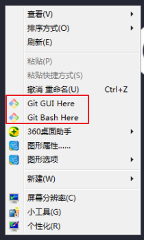
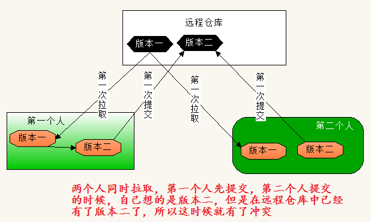

# Git

## 一、git介绍

### 1、概念介绍

git是一个项目管理工具。

在工作中，一个项目会分给多人合作，每个人负责一个模块，所有人做完后，将项目代码放在一起组成完成的项目。

在以前， 这项工作需要人工处理，工作量大，出错率高。

现在，这项工作都交给git（项目管理工具）自动处理，工作量忽略不计，出错率低。

主管每天查看项目小组的工作量，以前需要拿到代码文件，跟上一天做对比，现在，通过git工具快速得到统计，可以更公平的论功行赏。

项目开发过程中，如果改动较大，完全瘫痪，正常文件夹中的操作，就需要从头来过了，但是用git来管理项目文件，可以快速回退到某个节点。

工作中的项目都是放在一个代码仓库中的，每个人负责将代码仓库中的代码下载到本地进行开发，每天开发完，都要上传到代码仓库，组长进行项目合并。这个上传和下载的过程，都是通过git工具进行的。

代码仓库相当于一个专门用于存储代码的远程服务器。

利用一个软件 - git工具，对本地或远程的项目文件进行方便的管理。

### 2、学前了解

#### 2.1、文件夹和仓库

仓库是被git工具管理的文件夹。

仓库中有`.git`隐藏文件夹。

仓库可以跟远程服务器建立连接。

#### 2.2、仓库状态

##### 2.2.1、工作区

还未放入仓库中的文件，属于文件夹，但不属于仓库。准备存入仓库的文件。

##### 2.2.2、暂存区

进入仓库的文件，但是还未指定版本记录，没有历史操作记录，准备登记记录。

##### 2.2.3、版本区

进入仓库的文件，已经有登记，可以随时根据记录找到对应的文件。

任何内容要真正存入仓库，需要先在 工作区==>暂存区==>版本区

#### 2.3、仓库类型

##### 2.3.1、远程仓库

- github

  官网：https://github.com/

  属于微软，国际程序员都在使用，有较为先进的开源项目，有个人项目，有社区项目，很多名人都在使用这种仓库记录代码。

  企业版要收费，因为需要占用别人的空间，自己搭建服务。

- gitee

  码云，官网：https://gitee.com/

  服务器在国内，中国版的github，国内很多开源项目都在上面。

  企业版不收费，但空间和服务完全是网站提供的，可能会有不安全的感受。

- gitlab

  官网：https://git.lug.ustc.edu.cn

  由乌克兰程序员开发。

  企业版不收费，但服务需要自己搭建。现在很多企业都在使用。

##### 2.3.2、本地仓库

本地被git工具管理的文件夹。

#### 2.4、专业术语

本地仓库：在自己电脑上被 git 管理的文件夹

远程仓库：在线上管理的文件夹

推送：将本地的内容，上传到远程

同步/拉取：将线上的内容和本地内容保持一致

git可以管理远程的仓库，也可以管理本地仓库。

### 3、工具安装

傻瓜式安装即可。

下载安装，检测是否安装成功：

```shell
git --version
```

或者点击鼠标右键出现下图也可以

  

## 二、远程仓库

### 1、新建仓库

 

 

 选择初始化仓库后的仓库展示： 

未选择初始化仓库的展示：

 

### 2、未初始化

在本地新建文件夹，然后初始化为仓库

```shell
git init
```

本地添加内容，查看仓库状态

```shell
git status
```

红色代表在工作区；绿色代表在暂存区：

 

  

将工作区文件放在暂存区：

```shell
git add .
```

将暂存区文件放在版本区：

```shell
git commit -m "版本记录"
```

建立和远程仓库的联系：

```shell
git remote add origin 远程仓库地址
```

将本地仓库版本区文件推送到远程仓库：

```shell
git push -u origin master
```

这里的origin跟上一个命令中的origin同名，origin是一个变量名，可以自定义。

要将本地仓库推送到未初始化的远程仓库，本地仓库必须至少有一个版本。

后续再次将本地仓库推送到远程，只需要执行git push就行。

### 3、有版本记录

将远程仓库文件克隆到本地：

```shell
git clone 远程仓库地址 指定的文件夹名称
```

文件夹名称可以省略，默认使用远程仓库名称

本地操作正常的工作区、暂存区、版本区操作，后推送到远程仓库：

```shell
git push
```

远程仓库有变化，需要本地跟远程保持同样的变化：

```shell
git pull
```


### 4、冲突和解决

远程仓库要形成版本，必须一个一个生成，不能跳着生成，例如：版本1只能生成版本2，不能生成版本。

当两个人操作同一个仓库的时候容易造成跨版本生成的冲突。

  

冲突报错图示：

  

解决办法：

1. 先让本地仓库和远程仓库保持同步

   ```shell
   git pull
   ```

   

2. 再次推送

   ```shell
   git push
   ```

### 5、秘钥的配置

远程仓库操作有两种协议：https和ssh方式。

https方式推送需要输入账号和密码，传输安全性不如shh高。

ssh协议的使用，需要配置公钥和秘钥，可以节省输入账号密码的操作，保证传输的安全。

检测本地计算机是否有秘钥

```shell
cd ~/.ssh
```

有这个文件夹，表示存在，否则不存在

 

秘钥生成：

```shell
ssh-keygen -t rsa -C "提交使用的邮箱"
```

图示：

  

公钥配置：

将带有.pub的文件内容复制到SSH公钥。

 

然后我们在使用仓库地址的时候，就可以使用ssh的地址了：

 

推送/拉取都不需要输入账号密码了，且只有当前计算机可以使用，其他计算机无法使用。

## 三、分支操作

一个大项目，会分很多人开发，每个人一个功能，这时候，每个功能作为一个分支，主分支只有目录结构。当所有人将自己负责的功能开发完成的时候，再将所有分支合并到主分支上，形成一个完整的项目。

每次初始化一个git的时候，默认创建一个主要分支：`master`

查看所有分支：

```shell
git branch
```

创建分支：

```shell
git branch 分支名
```

切换分支：

```shell
git checkout 分支名
```

创建并切换到这个分支：

```shell
git checkout -b 新分支名
```

合并分支：(将别的分支合并到自己分支)

```shell
git merge 要合并的分支
```

删除分支：(不能自己删自己)

```shell
git branch -D 要删除的分支
```

在实际工作的项目中，master分支用于正在运行的完整的项目。我们通常在开发的时候，不会直接操作master分支的，master分支上的代码是从主测试分支上合并过来的。主测试分支上的代码，是从主开发分支上合并过来的，主开发分支上的代码，是从分开发分支上合并过来的，我们在工作中，通常是在分开发分支上进行操作的。

我们本地和远程进行非主分支操作的时候，本地的分支名和远程的分支名一定要保持一致。

## 四、其他命令

设置提交的用户名和邮箱：

```shell
git config --global user.name "自定义的名字"
git config --global user.email "自定义的邮箱地址"
```

将源文件添加到暂存区：

```shell
git add 文件 # 将单独一个文件添加到暂存区
git add 文件夹/ # 将整个文件夹添加到暂存区(git不管理空文件夹)
git add --all # 将当前文件夹中所有文件和文件夹都添加到暂存区  -  简写：git add .
```

将暂存区的文件拉回到源文件：

```shell
git reset HEAD -- 文件 # 将某个文件从暂存区变为源文件
git reset HEAD -- 文件夹/ # 将整个文件夹从暂存区变为源文件
git reset HEAD -- . # 将所有文件从暂存区变为源文件
```

我们每次提交就相当于在整个开发中，记录了一些节点 - 版本

查看版本信息：

```shell
git log
```

图示：

   

回到指定版本：

```shell
git reset --hard HEAD^ # 有几个上档键就回退几个版本
git reset --hard 历史版本号
```

让git能管理一个空文件夹：

在空文件夹中新建文件：`.gitkeep`，这个文件没有实际意义，这是为了占位，让空文件夹能被管理的标识，以后要在文件夹中写文件的时候，这个文件可以被删除

让某些文件或者文件夹被忽略管理：

在和`.git`同级的位置，新建文件：`.gitignore`，在这个文件中书写要忽略的内容：

```shell
直接写文件名，代表要忽略的是哪个文件
写文件夹路径，表示要忽略的是哪个文件夹
*.后缀，表示要忽略的是所有后缀为指定后缀的文件
```

## 明日面试题

1. 重排和重绘
2. git常用命令