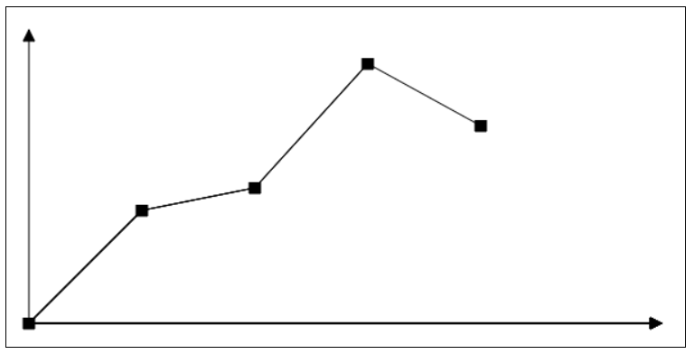
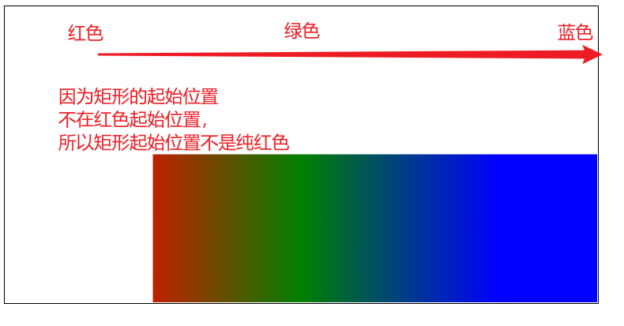
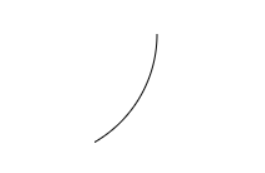
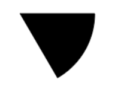
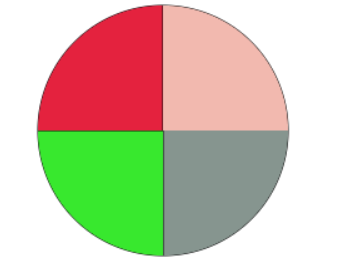
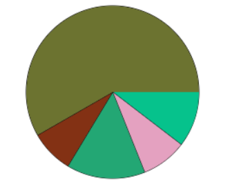
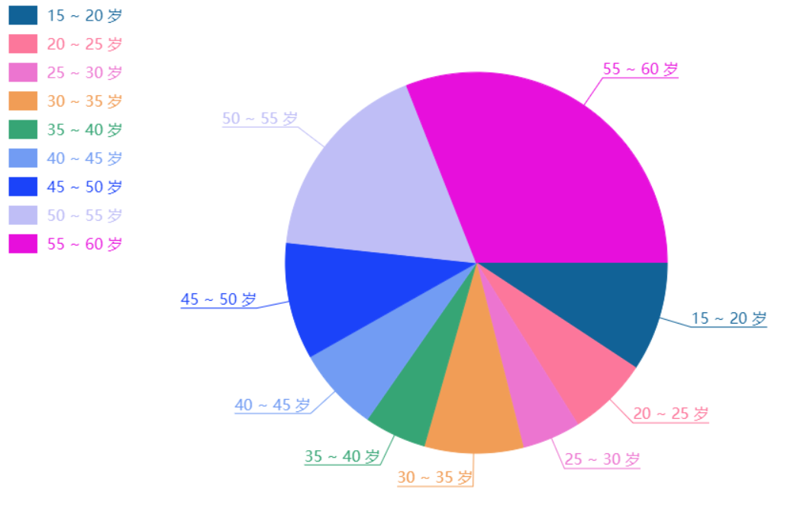

# canvas

## 简介

canvas是html5的一个标签，代表一个画布，可以在上面进行绘画、动画等操作。画布默认大小是300*150。

canvas标签本省只是画布，要实现上面有文字、线条等呈现，需要使用js实现。总之，画布上一切的呈现，都需要使用js来实现。canvas标签本质上就是一张图片，只是一张空白图片。

画布大小不能使用样式控制，用样式调整的是一个可视区域，其实真实的大小，还是一样的，只是在画布上画内容的话，会等比例放大。调整画布大小，需要在标签上直接添加width和height属性。

canvas标签也是可以放文字的，只是当canvas标签不被浏览器支持的时候，会显示，例如ie8。

## 初体验

canvas的简单使用：

1. 获取canvas元素

   ```js
   var canvas = document.querySelector('canvas')
   ```

   

2. 获取这个元素的工具箱 - 上下文

   工具箱中包含了很多工具：直线工具、弧形工具、文本工具、矩形工具...... 我们需要依赖这些工具进行绘画

   语法：

   ```js
   var ctx = canvas.getContext('2d')
   ```

   

3. 画图形

   默认情况下，canvas选中的工具是直线工具，要画一条直线的话，需要先将画笔放到一个指定像素点

   ```js
   ctx.moveTo(x轴坐标,y轴坐标)
   ```

   然后以线的形式，将画笔移动到终点：

   ```js
   ctx.lineTo(200,100)
   ```

   此时应该已经有线了，但是页面中并没有出现，因为我们前面两个步骤描述的是画笔走的路径，这个路径需要进行填充：

   ```js
   ctx.fill
   ```

   也可以进行描边：

   ```js
   ctx.strock()
   ```

   默认是黑色，线的宽度是1px

此时在画布中出现了一条线，但是发现线的粗细不是1px，颜色也不是黑色。

这是因为，canvas绘制线条，会将线条的中心点跟坐标点的位置进行对齐，这样的话，不管是线的开始对准坐标点还是线的结束对准中心点都不合适，所以浏览器干脆将线强行拉伸到 坐标点-1~坐标点+1，也就是本来1px的线，被强制拉伸到了2px，这样的话，颜色也就浅了。

我们可以将线的宽度设置为2px做验证，因为2px就不用被拉伸了：

```js
ctx.lineWith = 2 // 值是数字
ctx.lineTo(200,100)
```

结果就是2px宽的线，纯黑色了。

基于这个问题，我们以后在绘图的时候，尽量将像素设置为双数。

## 使用

### 画多条线：

可以在一个画布中画多条线，但是直接将画笔以线的形式移动到一个位置的时候，是从前面的结束位置，到新的位置画了一条新的线，所以我们需要重新将画笔移动到第二条线的开始位置，然后再以线的形式移动画笔，再次描边。

但是在描第二条边的时候，会再次描第一条边，所以多次描边，前面的线的颜色会越来越深。

我们通常在绘制的时候，会等所有图案绘制结束之后，描一次边，不会描多次。

如果要设置描边的颜色，可以在描边之前设置描边的颜色：

```js
ctx.strockStyle = '颜色值';
```


问题：如何给多条线设置不同的宽度和颜色？因为我们在最后描边的时候，发现所有线都是同一个颜色，哪怕给每条线都进行描边，也是一样的结果，说明每条线之间有很大的关联，canvas默认会从上下文上继承颜色和宽度。

我们需要在每次开始绘制的时候，告诉canvas下次的绘制是重新设置，跟上面的没有关系：

```js
ctx.beginPath()
```


### 画三角形：

三条线回到起点，就是三角形，但是线的结尾和开头部分，进行闭合的时候，其实是缺一个角的。

闭合：

1. 手动闭合，再次画一次开始的线段

2. 自动闭合 - 需要在描边之前闭合

   ```js
   ctx.closePath() // 会自动将开始和结束的边进行闭合
   ```

3. 依靠填充的方式闭合：

   ```js
   ctx.fill() // 填充颜色默认是黑色
   ```

   

描边和填充可以一起使用，也可以单独使用，但是都有各自的规则：

描边会把填充的内容扩大

描边的颜色默认是黑色，使用`ctx.strokeStyle`来设置描边颜色

填充的颜色默认是黑色，使用`ctx.fillStyle`来设置填充颜色


### 画填充回形：

需求：

大正方形：200 * 200；小正方形：100 * 100；出现在画布的最中心；线宽2；

获取画布的宽度和高度：

```js
ctx.canvas.width
ctx.canvas.height
```

通过线段描边，得到两个正方形，填充规则 - 非零填充规则：

在任何一个填充的区域，向外(到外围canvas的区域)拉一条线，数数经过了几个顺时针和逆时针进行计算：

顺时针+1，逆时针-1

最后得到的数字不是0，就填充；是0，就不填充


### 线段两端的样式：

```js
ctx.lineCap = 值;
// 取值：
/*
butt - 默认是没有 - 不会超出线段区域
round - 原型，会超出线段区域
square - 矩形形状，会超出线段区域
*/
```


### 线段和线段交接处的样式：

```js
ctx.lineJoin = 值;
// 取值：
/*
miter - 默认
round - 圆弧形状
bevel - 平角形状
*/
```


### 画虚线：

需要在绘制线条之前，设置线条的样式为虚线：

```js
ctx.setLineDash(参数);
// 参数：
/*
	数组 - 虚线方案，在数组中描述线条和空白的长度，然后不停的重复
	两个值，第一个值是线条长度，第二个值是空白长度 - 重复
	三个值，第一个值是线条长度，第二个值空白长度，第三个值是线条的长度；接下来是第二个值的空白长度，第二个值是线条的长度，第三个值是空白的长度 - 重复
	四个值，第一个值是线条长度，第二个值是空白长度，第三个值是线条的长度，第四个值是空白长度 - 重复
	
总结：
数组中有奇数个元素，那重复的个数就是 2*奇数个
数组中有偶数个元素，那重复的个数就是偶数个
*/
```

获取虚线的方案：

```js
ctx.getLineDash()
// 获取到的是一个数组，数组中记录了一段不重复的虚线方案
```

练习：利用循环画纯色渐变的线条：

 

```js
ctx.lineWidth = 10
for(var i=0;i<256;i++){
    ctx.beginPath()
    ctx.moveTo(100+i,100)
    ctx.lineTo(100+i+1,100)
    ctx.strokeStyle = `rgb(255,${255-i},${255-i})`
    ctx.closePath()
    ctx.stroke()
}
```

### 画折线图

 

html

```html
<style>
    canvas{
        border:1px solid #000;
    }
</style>
<canvas width=600 height=300></canvas>
```

js

```js
var canvas = document.querySelector('canvas');
var ctx = canvas.getContext('2d');
// 画点的函数
function setPoint(pointData){
    ctx.beginPath()
    ctx.moveTo(pointData.x - 5,pointData.y - 5)
    ctx.lineTo(pointData.x - 5,pointData.y + 5)
    ctx.lineTo(pointData.x + 5,pointData.y + 5)
    ctx.lineTo(pointData.x + 5,pointData.y - 5)
    ctx.stroke()
    ctx.fill()
}
// 画多个点的函数
function setPoints(pointsData){
    pointsData.forEach(v=>{
        setPoint(v)
    })
}
var pointsData = [
    {
        x:20,
        y:280
    },
    {
        x:120,
        y:180
    },
    {
        x:220,
        y:160
    },
    {
        x:320,
        y:50
    },
    {
        x:420,
        y:105
    }
]
setPoints(pointsData)
// 画坐标轴
var space = 20;
var width = ctx.canvas.width
var height = ctx.canvas.height
// x轴
function setAxiosX(){
    var pointX = space;
    var pointY = height - space;
    var endX = space;
    var endY = space;
    ctx.beginPath()
    ctx.moveTo(pointX,pointY)
    ctx.lineTo(endX,endY)
    // 画箭头
    ctx.lineTo(endX-5,endY+10)
    ctx.lineTo(endX+5,endY+10)
    ctx.lineTo(endX,endY)
    ctx.stroke()
    ctx.fill()
}
setAxiosX()
// y轴
function setAxiosY(){
    var pointX = space;
    var pointY = height - space;
    var endX = width-space;
    var endY = height - space;
    ctx.beginPath()
    ctx.moveTo(pointX,pointY)
    ctx.lineTo(endX,endY)
    // 画箭头
    ctx.lineTo(endX-10,endY-5)
    ctx.lineTo(endX-10,endY+5)
    ctx.lineTo(endX,endY)
    ctx.stroke()
    ctx.fill()
}
setAxiosY()

// 点连线
function connectPoints(pointsData){
    for(var i=0;i<pointsData.length-1;i++){
        ctx.moveTo(pointsData[i].x,pointsData[i].y)
        ctx.lineTo(pointsData[i+1].x,pointsData[i+1].y)
        ctx.stroke()
    }
}
connectPoints(pointsData)
```


面向对象改造。

```js

// 定义一个类
class LineChart{
    constructor(classname,data){
        // 画布标签获取到
        this.canvas = document.querySelector('.'+classname)
        // 工具箱
        this.ctx = this.canvas.getContext('2d')
        // 定义画布大小
        this.canvasWidth = this.ctx.canvas.width
        this.canvasHeight = this.ctx.canvas.height
        // 定义坐标轴到画布边缘的间隙
        this.space = 20
        // 定义原点
        this.originX = 0
        this.originY = 0
        // 定义箭头三角形的高 和 点 的长度
        this.length = 10
        // 将数据绑定成类的属性
        this.data = data
        // 定义画布中的数据
        this.canvasData = null;
    }
    // 定义一个初始化方法
    init(){
        // 获取原点
        this.getOrigin()
        // 创建坐标轴 - x、y
        this.createAxisX()
        this.createAxisY()
        // 转换数据
        this.convert(this.data)
        // 描每个点
        // this.setPoint(data)
        // 描所有点
        this.setPoints(this.canvasData)
        // 连线
        this.connectLine(this.canvasData)
    }
    connectLine(data){
        for(let i=0;i<data.length-1;i++){
            this.ctx.beginPath()
            // 放画笔
            this.ctx.moveTo(data[i].x,data[i].y)
            // 画线
            this.ctx.lineTo(data[i+1].x,data[i+1].y)
            this.ctx.closePath()
            this.ctx.stroke()
        }
    }
    // 描所有点的方法
    setPoints(data){
        data.forEach(point=>{
            this.setPoint(point)
        })
    }
    // 描一个点的方法
    setPoint(data){
        this.ctx.beginPath()
        // 放画笔位置
        this.ctx.moveTo(data.x-this.length/2,data.y-this.length/2)
        // 画线
        this.ctx.lineTo(data.x+this.length/2,data.y-this.length/2)
        this.ctx.lineTo(data.x+this.length/2,data.y+this.length/2)
        this.ctx.lineTo(data.x-this.length/2,data.y+this.length/2)
        this.ctx.lineTo(data.x-this.length/2,data.y-this.length/2)
        this.ctx.closePath()
        this.ctx.stroke()
        this.ctx.fill()
    }
    // 转换数据的方法
    convert(){
        // 将坐标轴的数据转成画布的数据
        // 遍历数据
        this.canvasData = this.data.map(point=>{
            return {
                x:point.x+this.space,
                y:this.canvasHeight - this.space - point.y
            }
        })
    }
    // 创建y轴
    createAxisY(){
        this.ctx.beginPath()
        // 将画笔放到原点
        this.ctx.moveTo(this.originX,this.originY)
        // 画线
        this.ctx.lineTo(this.originX,this.space)
        // 画箭头
        this.ctx.lineTo(this.originX-this.length/2,this.space + this.length)
        this.ctx.lineTo(this.originX+this.length/2,this.space + this.length)
        this.ctx.lineTo(this.originX,this.space)
        this.ctx.closePath()
        this.ctx.stroke()
        this.ctx.fill()
    }
    // 获取原点的方法
    getOrigin(){
        this.originX = this.space;
        this.originY = this.canvasHeight - this.space
    }
    // 定义创建x坐标轴的方法
    createAxisX(){
        this.ctx.beginPath()
        // 将画笔放到原点
        this.ctx.moveTo(this.originX,this.originY)
        // 画线
        this.ctx.lineTo(this.canvasWidth - this.space,this.originY)
        // 画箭头
        this.ctx.lineTo(this.canvasWidth-this.space-this.length,this.originY-this.length/2)
        this.ctx.lineTo(this.canvasWidth-this.space-this.length,this.originY+this.length/2)
        this.ctx.lineTo(this.canvasWidth - this.space,this.originY)
        this.ctx.closePath()
        this.ctx.stroke()
        this.ctx.fill()
    }
}

var lc = new LineChart('linechart',[
    {
        x:0,
        y:0
    },
    {
        x:100,
        y:100
    },
    {
        x:200,
        y:120
    },
    {
        x:300,
        y:220
    },
    {
        x:400,
        y:150
    },
    
])
console.log(lc);
lc.init()
```


### 画矩形：

矩形需要设置起点和矩形的宽和高：

```js
ctx.rect(起点x,起点y,宽,高)
```

然后进行描边或填充。

直接进行绘制矩形并描边：

```js
ctx.strokeRect(起点x,起点y,宽,高)
```

直接绘制矩形并填充：

```js
ctx.fillRect(起点x,起点y,宽,高)
```

当进行多个矩形填充不同颜色的时候，不需要结束路径，因为绘制矩形没有开启新的路径，绘制形状互相是独立的。


清除矩形：

清除矩形是将指定范围内的东西都清除掉

```js
ctx.clearRect(起点x,起点y,宽,高)
```


### 渐变：

设置颜色的时候是可以设置渐变的。渐变跟形状无关，在画布中确定好渐变的区域和颜色之后，在这个区域内的图形，填充或描边时可以将颜色设置成渐变。

设置渐变方案：

```js
ctx.createLinearGradient(开始x,开始y,结束x,结束y) // 返回渐变方案
```

通过设置的初始值和结束值可以确定渐变的方向。

设置渐变颜色：

```js
渐变方案.addColorStop(数字,颜色)
// 数字：
/*
取值范围是0~1，0代表开始，1代表结束
*/
```

渐变方案可以直接赋值给填充或描边颜色的，例：

```js
// 设置渐变方案
var linearGradient = ctx.createLinearGradient(100,100,500,100);
// 添加渐变颜色
linearGradient.addColorStop(0,'red');
linearGradient.addColorStop(0.5,'green');
linearGradient.addColorStop(1,'blue');
// 将渐变方案设置给填充颜色
ctx.fillStyle = linearGradient;
// 绘制矩形
ctx.fillRect(150,150,500,200)
```

 


### 画弧线：

画弧线是画一个路径，后面需要填充或描边。

```js
ctx.arc(圆心x,圆心y,半径,开始弧度,结束弧度)
```

弧度：当圆形上的边跟半径相等的时候就是一个弧长，弧度其实就是弧长的个数。

我们通常描述的时候，会使用角度来描述弧形，很少描述弧度，但是计算机在计算的时候使用弧度的时候比较多。

弧度和角度的换算：

```js
周长 = π * 半径 * 2
一周长是360度，1弧长是半径，所以：
1弧长对应的角度 = 180 / π
新角度/计算出来的角度 = 新弧长 / 1弧长
新弧长 = 1弧长 * 新角度 / 计算出来的角度
新弧长 = r * 60 * π / 180 
弧度 = 角度 * π / 180
```

横向x轴向右的角度是0度，顺时针是正角度，所以画一个0度到60度的弧形：

```js
// 圆心是100*100，半径是100
ctx.arc(100,100,100,0,60 * Math.PI/180)
ctx.stroke()
ctx.fill()
```

 

将这个弧形和半径进行填充就能得到一个扇形。

```js
ctx.moveTo(100,100)
ctx.arc(100,100,100,0,Math.PI/3)
ctx.stroke()
ctx.fill()
```

 

### 等分圆形：

```js
var width = ctx.canvas.width;
var height = ctx.canvas.height
var pointX = width / 2;
var pointY = height / 2;

var r = 100;
var num = 4;
var startArc = 0;
for(var i=0;i<num;i++){
    ctx.beginPath()
    ctx.moveTo(pointX,pointY)
    ctx.fillStyle = getColor()
    ctx.arc(pointX,pointY,r,startArc,(i+1)*360/num*Math.PI/180)
    ctx.stroke()
    ctx.fill()
    startArc = (i+1)*360/num*Math.PI/180
}

function getColor(){
    var r = Math.floor(Math.random()*256);
    var g = Math.floor(Math.random()*256);
    var b = Math.floor(Math.random()*256);
    return `rgb(${r},${g},${b})`
}
```

 

### 画饼图：

已知数据：

> 15 ~ 20 岁, 22 人
> 20 ~ 25 岁, 18 人
> 25 ~ 30 岁, 31 人
> 30 ~ 35 岁, 17 人
> 35 ~ 40 岁, 123 人

将数据抽象出来成一个数组：

```js
[22,18,31,17,123]
```

每个数据对应的弧长：

```shell
角度：(数据 / 总和) * 360
弧度：角度 * Math.PI / 180
```

代码：

```js
var arr = [22,18,31,17,123]
var canvas = document.querySelector('canvas');
var ctx = canvas.getContext('2d')

var width = ctx.canvas.width;
var height = ctx.canvas.height;

var pointX = width / 2;
var pointY = height / 2;
var r = 100;
var sum = arr.reduce((a,b)=>a+b)
var startArc = 0
arr.forEach(v=>{
    var endArc = startArc + v/sum * 360 * Math.PI/180
    ctx.beginPath()
    ctx.moveTo(pointX,pointY);
    ctx.fillStyle = getColor()
    ctx.arc(pointX,pointY,r,startArc,endArc)
    ctx.stroke()
    ctx.fill()
    startArc = endArc
})
function getColor(){
    var r = Math.floor(Math.random()*256);
    var g = Math.floor(Math.random()*256);
    var b = Math.floor(Math.random()*256);
    return `rgb(${r},${g},${b})`
}
```

 


### 画文字：

```js
ctx.strokeText(文本,文字开始x,文字开始y) // 描边
ctx.fillText(文本,文字开始x,文字开始y) // 填充文字
```

例：

```js

```

文字大小：

```js
ctx.font = '字号大小 字体'
// 字号大小就是 数字px
```

上下对齐方式：

```js
ctx.textBaseLine = 值;
// 取值：
/*
默认是baseline
bottom：底线对齐
top：顶线对齐
middle：中线对齐
*/
```

左右对齐方式：

```js
ctx.textAlign = 值;
// 取值：基于我们设置的文字坐标来对齐的
/*
left - 默认值，左对齐
right - 右对齐
*/
```

获取文本内容的总宽度：

```js
ctx.measureText(文本内容)
// 获取到一个对象，其中包含width属性就是文字的宽度
```


作业：

 

面向过程代码

```js
var canvas = document.querySelector('canvas')
var ctx = canvas.getContext('2d');

var x = ctx.canvas.width / 2 + 200;
var y = ctx.canvas.height / 2;
var r = 150
var R = r + 40

var data = [
    {
        title:"15 ~ 20 岁",
        num:20
    },
    {
        title:"20 ~ 25 岁",
        num:15
    },
    {
        title:"25 ~ 30 岁",
        num:10
    },
    {
        title:"30 ~ 35 岁",
        num:35
    },
    {
        title:"35 ~ 40 岁",
        num:12
    },
    {
        title:"40 ~ 45 岁",
        num:25
    },
    {
        title:"45 ~ 50 岁",
        num:30
    },
    {
        title:"50 ~ 55 岁",
        num:35
    },
    {
        title:"55 ~ 60 岁",
        num:50
    }
];

// 处理数据
var startNum = data[0].num
var total = data.reduce((a,b)=>{
    if(typeof a === 'number'){
        return a + b.num
    }else{
        return startNum + b.num
    }
    
})
// console.log(total);
data.forEach(v=>{
    // 给每个对象添加弧度
    // v.arc = v.num/total*360 * Math.PI / 180
    v.arc = v.num/total*2 * Math.PI
})
// console.log(data);

// 画饼
var startArc = 0
data.forEach((v,index)=>{
    ctx.beginPath()
    ctx.moveTo(x,y)
    var endArc = startArc + v.arc
    ctx.arc(x,y,r,startArc,endArc)
    startArc = endArc
    var color = getColor()
    ctx.fillStyle = color
    ctx.fill()
    // 画延伸线
    outLine(v.arc,endArc,color,v.title)
    // 画说明方块
    descSquare(index)
})
// 画说明方块
function descSquare(index){
    var squareWidth = 50;
    var squareHeight = 30;
    var squareLeft = 20;
    var squareTop = 20
    // 画小方块
    ctx.fillRect(squareLeft,squareTop*(index+1)+squareHeight*index,squareWidth,squareHeight)

    // 计算文字的开始坐标
    var textX = squareLeft + squareWidth + squareLeft
    var textY = squareTop*(index+1)+squareHeight*index+squareHeight/2

    ctx.textBaseline = 'middle';
    ctx.textAlign = 'left';
    var percent = (data[index].num / total).toFixed(2) * 100 + '%'
    ctx.fillText(data[index].title+'   ' + percent,textX,textY)

}
// 画延伸线
function outLine(currentArc,endArc,color,title){
    // 获取到需要画线的这个弧度
    var arc = endArc - currentArc/2
    // 计算这条线的终点x和y
    var endX = Math.cos(arc) * R + x
    var endY = Math.sin(arc) * R + y
    ctx.moveTo(x,y)
    ctx.lineTo(endX,endY)
    ctx.strokeStyle = color
    // 获取文字长度
    ctx.font = '16px 楷体'
    var textWidth = ctx.measureText(title).width
    if(endX<x){
        textX = endX - textWidth
        ctx.textAlign = 'left';
    }else{
        textX = endX + textWidth
        ctx.textAlign = 'right';
    }
    ctx.textBaseline = 'bottom';
    ctx.lineTo(textX,endY)
    // 写字
    ctx.strokeText(title,textX,endY-3)
    ctx.stroke()
}

// 随机颜色
function getColor(){
    return `rgb(${Math.floor(Math.random()*256)},${Math.floor(Math.random()*256)},${Math.floor(Math.random()*256)})`
}
```

面向对象代码

```js
class Pie{
    constructor(classname,data){
        // 将数据绑定在属性上
        this.data = data
        // 获取canvas节点
        this.canvas = document.querySelector('.'+classname)
        // 获取工具箱
        this.ctx = this.canvas.getContext('2d');
        // 定义圆心
        this.x = this.ctx.canvas.width / 2 + 200;
        this.y = this.ctx.canvas.height / 2;
        // 定义半径
        this.r = 150
        // 定义延伸线的长度
        this.R = this.r + 40
        // 定义数据总量
        this.total = this.data.reduce((a,b)=>{
            if(typeof a === 'number'){
                return a + b.num
            }else{
                return this.data[0].num + b.num
            }
            
        })
    }
    // 初始化方法
    init(){
        // 数据处理方法
        this.convertData()
        // 画饼的方法
        this.drawPie()
    }
    // 数据处理方法
    convertData(){
        this.data.forEach(v=>{
            v.arc = v.num/this.total*2 * Math.PI
        })
    }
    // 画饼的方法
    drawPie(){
        // 初始弧度
        var startArc = 0
        this.data.forEach((v,index)=>{
            this.ctx.beginPath()
            this.ctx.moveTo(this.x,this.y)
            var endArc = startArc + v.arc
            this.ctx.arc(this.x,this.y,this.r,startArc,endArc)
            startArc = endArc
            var color = this.getColor()
            this.ctx.fillStyle = color
            this.ctx.fill()
            // 画延伸线
            this.outLine(v.arc,endArc,color,v.title)
            // 画说明方块
            this.descSquare(index)
        })
    }
    // 画说明方块的方法
    descSquare(index){
        var squareWidth = 50;
        var squareHeight = 30;
        var squareLeft = 20;
        var squareTop = 20
        // 画小方块
        this.ctx.fillRect(squareLeft,squareTop*(index+1)+squareHeight*index,squareWidth,squareHeight)
    
        // 计算文字的开始坐标
        var textX = squareLeft + squareWidth + squareLeft
        var textY = squareTop*(index+1)+squareHeight*index+squareHeight/2
    
        this.ctx.textBaseline = 'middle';
        this.ctx.textAlign = 'left';
        var percent = (this.data[index].num / this.total).toFixed(2) * 100 + '%'
        this.ctx.fillText(this.data[index].title+'   ' + percent,textX,textY)
    }
    // 画延伸线的方法
    outLine(currentArc,endArc,color,title){
        // 获取到需要画线的这个弧度
        var arc = endArc - currentArc/2
        // 计算这条线的终点x和y
        var endX = Math.cos(arc) * this.R + this.x
        var endY = Math.sin(arc) * this.R + this.y
        this.ctx.moveTo(this.x,this.y)
        this.ctx.lineTo(endX,endY)
        this.ctx.strokeStyle = color
        // 获取文字长度
        this.ctx.font = '16px 楷体'
        var textWidth = this.ctx.measureText(title).width
        if(endX<this.x){
            var textX = endX - textWidth
            this.ctx.textAlign = 'left';
        }else{
            var textX = endX + textWidth
            this.ctx.textAlign = 'right';
        }
        this.ctx.textBaseline = 'bottom';
        this.ctx.lineTo(textX,endY)
        // 写字
        this.ctx.strokeText(title,textX,endY-3)
        this.ctx.stroke()
    }
    // 获取随机颜色的方法
    getColor(){
        return `rgb(${Math.floor(Math.random()*256)},${Math.floor(Math.random()*256)},${Math.floor(Math.random()*256)})`
    }

}
var data = [
    {
        title:"15 ~ 20 岁",
        num:20
    },
    {
        title:"20 ~ 25 岁",
        num:15
    },
    {
        title:"25 ~ 30 岁",
        num:10
    },
    {
        title:"30 ~ 35 岁",
        num:35
    },
    {
        title:"35 ~ 40 岁",
        num:12
    },
    {
        title:"40 ~ 45 岁",
        num:25
    },
    {
        title:"45 ~ 50 岁",
        num:30
    },
    {
        title:"50 ~ 55 岁",
        num:35
    },
    {
        title:"55 ~ 60 岁",
        num:50
    }
];

var pie = new Pie('pie',data)
pie.init()
```


