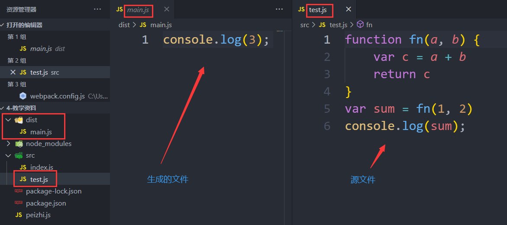
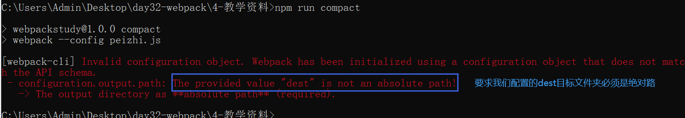
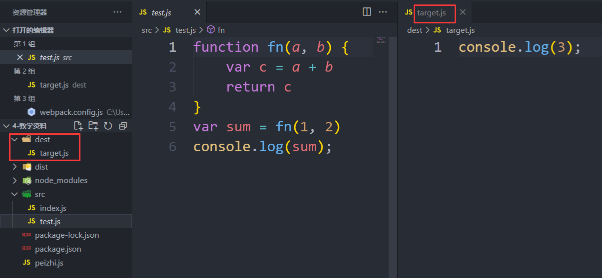
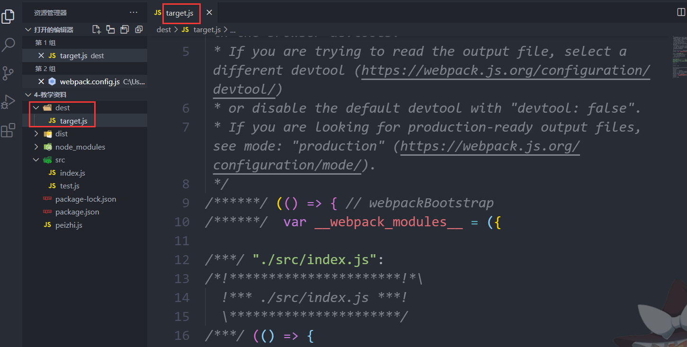
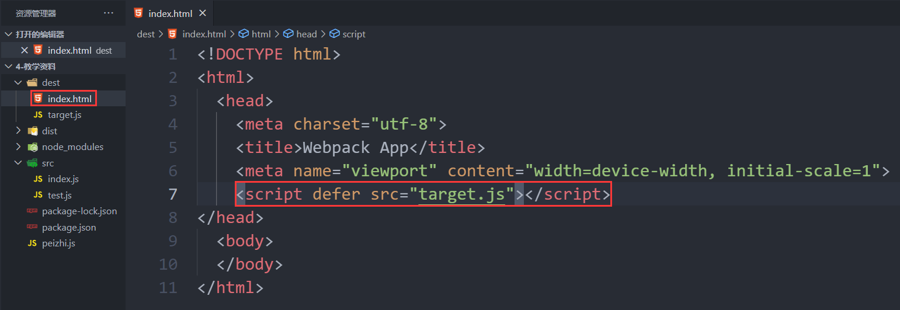
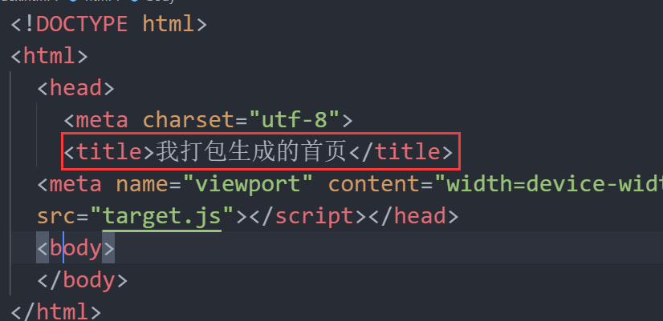
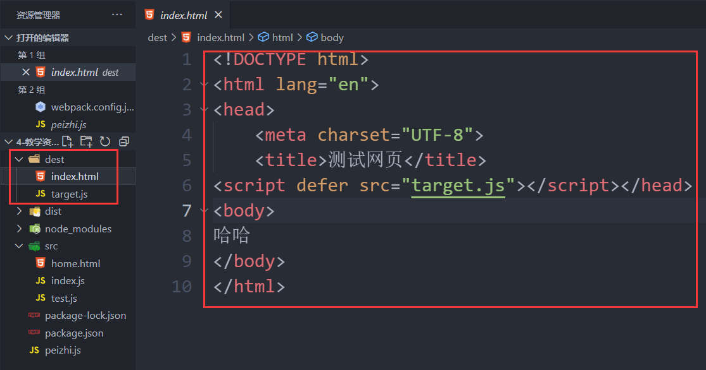
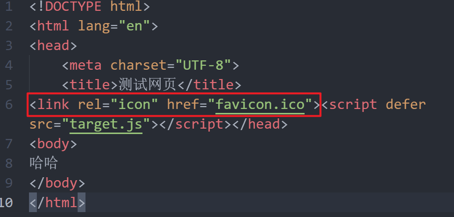
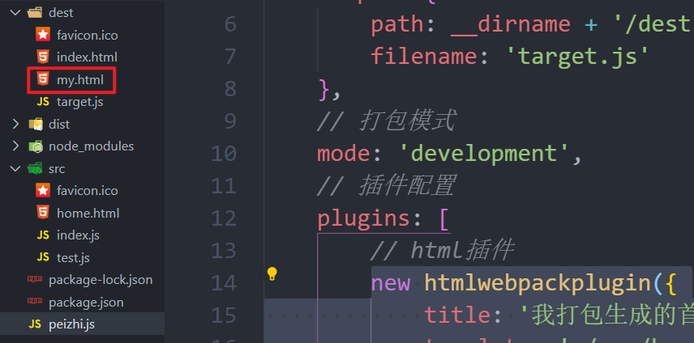
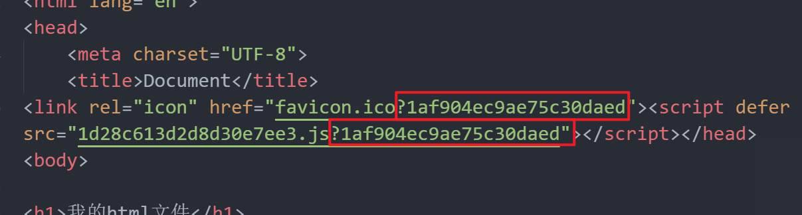

# webpack工具

## webpack介绍

项目做好以后，在上线之前还有一些工作需要去做：

- 压缩css
- 压缩js
- 压缩图片
- 编译sass
- 合并文件
- 。。。

等等，在前端工作流出现之前，这些工作都由人力完成，而这些工作往往比写业务本身更加费时，效率非常之低且还容易出错，于是自动化的处理工具也就必然出现了。

前端的构建工具常见的有Grunt、Gulp、Webpack三种，Grunt比较老旧，功能少，更新少，插件少。gulp适用于原生项目的打包，但是在现代的工作中使用非常少。webpack通常被用在框架中，使用量很大，所以我们学习webpack。

## webpack使用

### 下载安装

webpack打包需要下载安装webpack工具，安装方式有两种：

1. 全局安装 - 在计算机任何一个地方都可以使用 - 通常适用于一次性使用的工具

   ```shell
   npm i webpack webpack-cli -g
   ```

   

2. 局部安装 - 只能在当前文件夹中使用 - 推荐使用方式 - 因为webpack不是一个一次性使用的工具

   ```shell
   npm i webpack webpack-cli
   ```

有很多项目，在开发过程也需要一边开发一边使用webpack打包项目，所以，webpack不是一个一次性工具，所以建议使用局部安装，只要有项目的地方，都需要下载安装这个工具。

### 打包准备工作

打包的具体工作，就是在命令行中执行打包命令。但打包的是哪个文件，是否需要压缩，是否需要将es6转成es5的语法等操作，都需要进行配置，所以执行打包命令之前需要先书写打包配置。

#### 配置文件

webpack默认的配置文件为`webpack.config.js`，也可以是一个自定义的js文件。不管是默认的还是自定义的配置文件，代码必须是导出一个对象。webpack打包配置遵循nodejs的语法规范，所以配置文件的导出操作使用的也是nodejs的导出规范：`module.exports = {}`

#### 打包命令的配置

- 如果是全局下载安装的webpack工具，使用的配置文件是webpack默认的配置文件`webpack.config.js`，直接在配置文件所在目录中执行`webpack`命令即可。

- 如果是全局下载安装的webpack工具，使用的配置文件是自定义的配置文件，执行命令需要在配置文件所在目录中执行`webpack --config 自定义配置文件`命令。

- 如果是局部下载安装的webpack工具，使用的是默认的配置文件，需要先在package.json文件中配置命令才能执行：

  ```json
  "scripts": {
      "自定义命令": "webpack"
  }
  ```

  执行命令，需要在配置文件所在目录：

  ```shell
  npm run 自定义命令
  ```

  

- 如果是局部下载安装的webpack工具，使用的是自定义的配置文件，需要在package.json文件中配置命令才能执行：

  ```json
  "scripts": {
      "自定义命令": "webpack --config 自定义配置文件"
  }
  ```

  执行命令，需要在配置文件所在目录：

  ```shell
  npm run 自定义命令
  ```

<font color="blue">**补充：自定义命令如果是`start/restart/stop/test`，这4个命令属于npm的关键字命令，执行时可以省略run：`npm start/restart/stop/test`。**</font>  

#### 被打包文件

webpack默认只能打包js文件，之所以能打包整个项目，是因为有很多js的操作和配置。

webpack默认是打包一个js文件，且js文件的路径为：`src/index.js`。

<font color="red">**注意：src文件夹要跟webpack的配置文件在同级目录下。**</font>  

### 具体配置

#### 入口文件配置

如果不配置入口文件，默认会打包src文件夹下的index.js文件，如果要打包其他文件，就需要进行配置：

```json
entry: 入口文件路径
```

例：我们打包src文件夹下的test.js

```js
module.exports = {
    // 所有配置都在这里定义
    entry: './src/test.js'
}
```

打包结果：

 

entry的值还可以是一个对象，表示多入口，也就是一次性打包多个js文件：

```js
entry: {
    app: './src/app.js',
    adminApp: './src/adminApp.js',
},
```


#### 出口文件配置

如果不配置出口文件，默认会将打包结果放在dist文件夹下的main.js文件中，如果希望生成的目标文件在别的文件夹下，换个新的文件名称，就需要配置出口文件：

```json
output: {
    path: 文件夹路径,
    filename: 文件名称,
    clean: true, // 是否每次清空目标文件夹
}
```

例：将目标文件放在dest文件夹下的target.js文件中

```js
output: {
    path: 'dest',
    filename: 'target.js'
}
```

执行结果：

 

配置中的文件夹路径，必须是绝对路径，所以重新修改路径如下：

```js
module.exports = {
    // 所有配置都在这里定义
    entry: './src/test.js',
    output: {
        path: __dirname + '/dest', // 这里必须是绝对路径
        filename: 'target.js'
    }
}
```

重新执行命令，打包结果如下：

 

<font color="red">**注意：filename的值，可以是具体的文件名称，可以是`[contenthash].js`，表示生成的文件是一个系统随机创建的文件。如果是多入口打包，可以是`[name].js`，表示生成的文件名称为：`entry中入口文件名称的键.js`。单入口文件场景中，`[name].js`配置不生效。**</font>  

#### 打包模式配置

打包模式分两种，分别是开发模式和生产模式。区别如下：

> production是生产模式，会把打包好后的代码进行压缩，可阅读性不好，但是代码体积小
>
> development是开发模式，不会压缩代码，可阅读性好，但是代码体积大

默认打包规则是生产模式，如果要指定打包模式，需要配置：

```json
mode: development/production
```

例：将默认的生产模式换成开发模式

```js
module.exports = {
    // 所有配置都在这里定义
    entry: './src/index.js',
    output: {
        path: __dirname + '/dest',
        filename: 'target.js'
    },
    // 打包模式
    mode: 'development'
}
```

打包的目标文件结果：

 

从上图中可以看出，打包的最终结果，不再是压缩形式的，这是开发模式的打包。

<font color="blue">**前面每次打包的警告就是表示我们没有配置打包模式**</font> 

#### map文件配置

如果打包好的文件在运行的时候报错了，报错在打包的文件中，我们很难找到错误的地方和原因，因为打包生成的文件不是我们手写的，是机器生成的，为了能将错误定位在源文件中，我们需要添加map文件配置：

```js
devtool:"source-map"
```

如果在我们运行的目标文件中报错了，可以通过这个文件准确的定位到错误的源文件。

#### 插件配置

<font color="red">**webpack默认只能打包js文件，如果要处理html文件或其他文件的操作就需要依赖插件**</font>  

```json
plgins: [
    插件配置
]
```


##### html插件

插件名称：`html-webpack-plugin`

下载：`npm i html-webpack-plugin`

导入：

```js
const htmlwebpackplugin = require('html-webpack-plugin')
```

插件配置：

```js
const htmlwebpackplugin = require('html-webpack-plugin')
module.exports = {
    // 所有配置都在这里定义
    entry: './src/index.js',
    output: {
        path: __dirname + '/dest',
        filename: 'target.js'
    },
    // 打包模式
    mode: 'development',
    // 插件配置
    plugins: [
        // html插件
        new htmlwebpackplugin({
            
        })
    ]
}
```

默认会在目标文件夹中生成index.html文件，并将我们打包好的js文件注入到这个html中：

 

如果要打包一个html文件，或对打包后的html进行其他配置，可以配置如下选项：

```json
template: 要打包的html文件,
filename: 生成的目标文件名称,
hash: 是否为每次打包的所有注入的静态资源添加系统生成的随机的唯一hash值,
inject: 向template或者templateContent中注入所有静态资源，不同的配置值注入的位置不经相同,
	取值：
		body：所有JavaScript资源插入到body元素的底部
		true或者head: 所有JavaScript资源插入到head元素中 - 默认
		false： 所有静态资源css和JavaScript都不会注入到模板文件中
favicon: 添加特定favicon路径到输出的html文档中,
title: 生成的html文档的标题。配置该项，它并不会替换指定模板文件中的title元素的内容,仅限于没有打包的html，要生成html的时候，对生成的html配置标题
chunks: 值是数组，指定我们要注入的入口js文件
```

配置项测试：

###### title选项

```js
new htmlwebpackplugin({
    title: '我打包生成的首页'
})
```

打包后结果：

 

###### template选项

```js
new htmlwebpackplugin({
    title: '我打包生成的首页',
    template: './src/home.html'
})
```

在src下新建home.html，内容如下：

```html
<!DOCTYPE html>
<html lang="en">
<head>
    <meta charset="UTF-8">
    <title>测试网页</title>
</head>
<body>
哈哈
</body>
</html>
```

打包结果：

 

title选项是不会改变原网页中标题的，只有在没有原网页，需要创建一个html的时候，指定title才有用。

如果指定了template选项后，不会自动创建html文件，是将指定的html页面打包到目标文件夹中。

###### favicon选项

```js
new htmlwebpackplugin({
    title: '我打包生成的首页',
    template: './src/home.html',
    favicon: './src/favicon.ico'
})
```

给src文件夹下放一个网站图标，打包结果：

 

###### filename选项

```js
new htmlwebpackplugin({
    title: '我打包生成的首页',
    template: './src/home.html',
    favicon: './src/favicon.ico',
    filename: 'my.html'
})
```

会将template打包生成新的文件名称：`my.html`，如下图：

 

###### inject选项

> 默认为true/'head'，表示要将打包后的js文件注入到html中，且放在html头部head标签中，false表示不注入，'body'表示将打包后的js文件引入到html的body标签中。
>

###### hash选项

> 默认值为false，当设置为true的时候，打包后的html引入的静态文件，会在地址后面添加随机的参数，目的是为了避免浏览器缓存。

设置为true的时候，生成的html如下：

 

###### chunks选项

chunks选项适用于多入口且多html的时候，我们希望某些html引入不同的入口中的内容，就给当前html插件配置chunks选项：

```js
plugins: [
    new htmlwebpackplugin({
        title: '我打包生成的首页',
        template: './src/home.html',
        favicon: './src/favicon.ico',
        filename: 'my.html',
        chunks: [entry的入口键, entry中的入口键]
    }),
     new htmlwebpackplugin({
        title: '我打包生成的列表页',
        template: './src/a.html',
        favicon: './src/favicon.ico',
        filename: 'b.html',
        chunks: [entry的入口键, entry中的入口键]
    })
]
```


##### 拷贝文件插件

我们在开发过程中，有些文件是需要拷贝到目标文件夹中的，因为此时只能打包js文件和html文件，css和其他js文件是不能进行打包的，也拷贝不到目标文件夹中 - 静态css，所以将来打包后的html是会运行报错的，此时就需要用到另外一个插件：

```js
npm i copy-webpack-plugin@6.4.1
```

导入并使用：

```js
const CopyPlugin = require("copy-webpack-plugin");
// 在插件配置中使用
new CopyPlugin({
    // 插件配置  from从某文件夹复制,可以使用相对路径；to到某文件夹，尽量使用绝对路径，使用相对路径的时候是相对上面设置好的输出目录
    patterns: [
        { "from": "./public/img", "to": path.join(__dirname, "./dist/img/") },
        { "from": "./public/css", "to": path.join(__dirname, "./dist/css/") },
        { "from": "./public/js", "to": path.join(__dirname, "./dist/js/") },
        { "from": "./public/fonts", "to": path.join(__dirname, "./dist/fonts/") }
    ]
}),
```


#### 解析器

如果在html页面中，引入了css文件、图片等静态资源，打包后的html页面中同样保持引入的关系，但是css文件、图片等静态资源没有被打包到目标文件夹中，导致html文件无法出现正常效果。

要将css文件、图片等静态资源一起打包目标文件夹中，就需要使用解析器来处理。

解析器配置：

```json
module:{ 
    rules: [
        解析器的配置
    ]
}
```

不同的静态资源处理需要使用不同的解析器。

##### css解析

css解析器需要下载两个插件：`npm i css-loader style-loader`

`css-loader`插件起到的作用是将入口文件中css进行打包

`style-loader`插件起到的作用是将打包好的css引入到html中

下载好后不需要导入，但是需要配置：

```js
module: {
    rules: [
        {
            // 匹配到.css的文件后缀就进行处理
            test: /\.css/,
            // 使用两个插件进行处理
            use: ['style-loader', 'css-loader']
        }
    ]
}
```

光有这样的配置是不行的，因为webpack默认打包的是入口文件，所有内容都要放在入口文件中导入才能被打包，所以我们需要将静态资源在入口文件中导入：

```js
require('./css/test.css')
```

这样就可以了。最终打开打包后的html页面，css样式效果能正常展示在浏览器中了。

当我们打开目标文件夹后，发现css文件并没有在目标文件夹中，那是因为默认将css样式打包在出口js文件中了。

在实际项目中，我们还是希望能将css单独放在一个文件中，不希望都放在出口js文件中，这时就需要一个插件来处理了

插件名称：`mini-css-extract-plugin`

下载：`npm i mini-css-extract-plugin`

导入：

```js
const MiniCssExtractPlugin = require('mini-css-extract-plugin');
```

配置这个插件：

```js
new MiniCssExtractPlugin({
    // 生成的文件名
    filename:'css/[hash].css'
}) 
```

如果不设置文件名称，最终会默认生成`main.css`。

配置好以后，在解析器中用这个插件替换`style-loader`插件：

```js
{
    test: /\.css/,
    use: [MiniCssExtractPlugin.loader, 'css-loader']
}
```

此时重新打包就可以在目标文件夹中生成，css文件夹，目标css文件就在css文件中。出口文件中也就没有css的代码了。

##### sass解析

sass文件需要进行编译，还要被引入到html文件中使用，需要依赖两个插件：`npm i sass sass-loader`，下载成功后同样不需要导入，只需要配置解析器就好：

```js
{
    test: '\.scss',
    use: [MiniCssExtractPlugin.loader, 'css-loader', 'sass-loader']
}
```

同样的sass文件也要在入口文件被导入才能被解析：

```js
require('./css/test.css')
require('./sass/test.scss')
```

<font color="red">**注意：loader的配置项是按照从有向左的顺序执行的，所以他们的配置有顺序关系，例如，css解析，一定要先style-loader，再css-loader，sass也一样。**</font>   

##### ES6转ES5

下载插件：

```shell
npm i babel-loader @babel/core @babel/preset-env @babel/runtime @babel/plugin-transform-runtime
```

配置loader：

```js
{
    test: /\.js$/,
    exclude: /node_modules/,
    use: {
    	loader: 'babel-loader',
        options: {
            presets: ['@babel/preset-env'],
            plugins: [
                [
                    '@babel/plugin-transform-runtime'
                ]
            ]
        }
    }
}
```

##### 图片解析

需要依赖1个插件：`html-loader`：

下载：`npm i html-loader`

使用配置：

首先修改导出文件目录：

```js
output: {
    path: __dirname + '/dest',
    filename: 'target.js',
    clean: true,
    assetModuleFilename: 'img/[name][ext]'
}
```

然后添加图片解析器：

```json
{
    test: /\.png$/,
    type: 'asset/resource' // webpack自带的静态资源处理
},
{
    test: /\.html$/,
    loader: 'html-loader'
}
```

不管是css中引入的图片还是html中引入的图片都可以进行打包了。

#### 服务器配置

如果希望我们的项目运行在一个web服务器中，webpack也有对应的插件让我们可以快速启动一个web服务器，且这个插件还可以让我们的项目自动刷新。

插件名称：`webpack-dev-server`

下载：`npm i webpack-dev-server`

这个插件不需要导入，直接使用：

```js
devServer: {
    static: {
        directory: path.join(__dirname, 'dest'),
    }
}
```

这个web服务器要启动起来要再次执行一个命令：

```shell
webpack serve --config peizhi.js --open
```

后面`--open`参数是自动打开浏览器的。

其他配置参考网址：https://webpack.js.org/configuration/dev-server/#devserverproxy

## 项目打包

修改源项目文件，因为webpack打包，是基于入口文件打包的，js文件，还是css文件，最终都会引入在一个入口文件中，html引入这个最终中的js

将原本html中引入的js/css都删掉

配置多入口

打包多个html，分别引入不同的入口。


